---

## 📌 핵심 요약
> 이 장에서는 **생성 디자인 패턴(Creational Design Patterns)**을 CI/CD 파이프라인에 적용하는 방법을 다룬다. 핵심은 Factory Method, Abstract Factory, Singleton, Prototype, Builder 패턴이 **클라우드 네이티브 환경에서 확장성과 복원력**을 어떻게 지원하는지 이해하고, 컨테이너화, 마이크로서비스, 서버리스 생태계와의 통합을 실현하는 것이다.

## 🎯 학습 목표
이 내용을 읽고 나면:
- [ ] 5가지 생성 디자인 패턴(Factory Method, Abstract Factory, Singleton, Prototype, Builder)을 CI/CD 맥락에서 설명할 수 있다
- [ ] 클라우드 네이티브 CI/CD 패턴의 핵심 구성요소를 이해할 수 있다
- [ ] 컨테이너화와 생성 패턴의 관계를 설명할 수 있다
- [ ] 마이크로서비스 아키텍처에서 CI/CD 파이프라인 구현 방법을 이해할 수 있다
- [ ] CI/CD 파이프라인에 보안과 컴플라이언스를 통합하는 방법을 알 수 있다

## 📖 본문 정리

### 1. 생성 디자인 패턴의 개념

생성 디자인 패턴(Creational Design Patterns)은 **객체 생성 과정을 캡슐화**하여 코드의 유연성과 재사용성을 향상시킨다. 시스템이 객체가 어떻게 생성되고, 구성되며, 표현되는지에 덜 의존하게 만든다.

> 💬 **비유**: `new` 연산자로 직접 객체를 생성하면 애플리케이션 전체에 객체 생성 코드가 흩어지게 된다. 생성 패턴은 이를 한 곳에 모아 관리하는 "객체 공장"과 같다.

#### 5가지 생성 디자인 패턴

| 패턴 | 핵심 개념 | CI/CD 적용 사례 |
|------|----------|----------------|
| **Factory Method** | 서브클래스가 생성할 객체 유형 결정 | 환경별(dev/staging/prod) 배포 작업 생성 |
| **Abstract Factory** | 관련 객체 그룹을 구체 클래스 없이 생성 | 다중 환경에서 서버/DB 등 관련 리소스 세트 생성 |
| **Singleton** | 클래스 인스턴스를 하나로 제한 | 공유 설정, 로깅 서비스, 연결 풀 관리 |
| **Prototype** | 기존 객체 복제로 새 객체 생성 | 환경 설정 템플릿 복제, 빠른 환경 구축 |
| **Builder** | 복잡한 객체의 단계별 구성 | 파이프라인 단계별 구성 (build → test → deploy) |

---

### 2. CI/CD에서의 확장성과 복원력

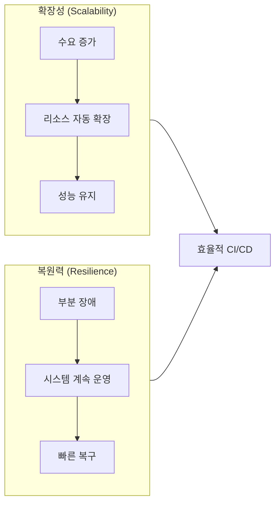

#### 확장성 (Scalability)
- **정의**: CI/CD 파이프라인이 증가하는 부하를 우아하게 처리하는 능력
- **구현**: Autoscaler, Kubernetes 클러스터, 서버리스 플랫폼

#### 복원력 (Resilience)
- **정의**: 일부가 실패해도 시스템이 계속 작동하는 능력
- **구현**: 다중 인스턴스 실행(중복성), Circuit Breaker 패턴

---

### 3. Singleton 패턴 - CI/CD 적용

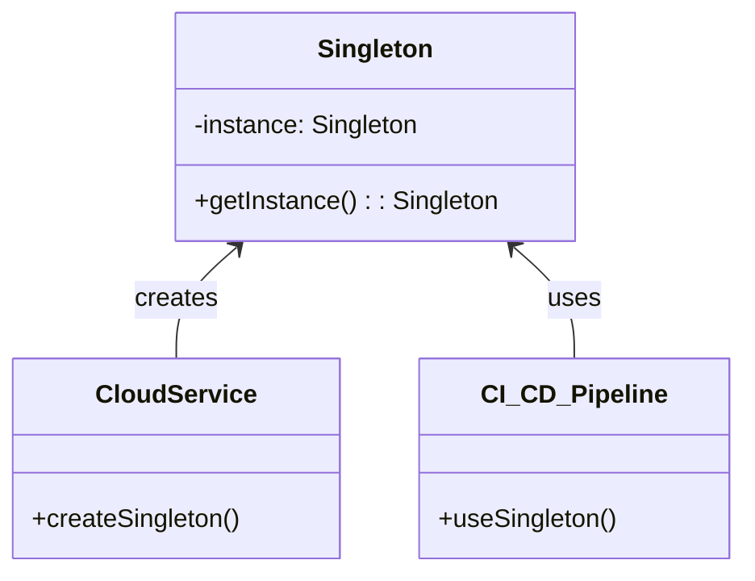

**Singleton 패턴이 CI/CD에서 중요한 이유**:

| 이점 | 설명 |
|------|------|
| **일관성** | 파이프라인의 모든 부분이 동일한 데이터셋으로 작업 |
| **제어된 접근** | 공유 리소스(로그 파일 등)에 대한 조율된 접근 |
| **지연 초기화** | 필요할 때만 객체 초기화 → 성능 향상 |
| **오버헤드 감소** | 인스턴스 수 제한으로 리소스 절약 |

**Kubernetes ConfigMap 예시**:
```yaml
# Singleton으로 동작하는 로깅 설정
apiVersion: v1
kind: ConfigMap
metadata:
  name: logging-config
data:
  log_level: "Warning"
```
> 클러스터의 모든 컨테이너가 동일한 `log_level` 설정을 참조

---

### 4. Factory Method 패턴 - CI/CD 적용

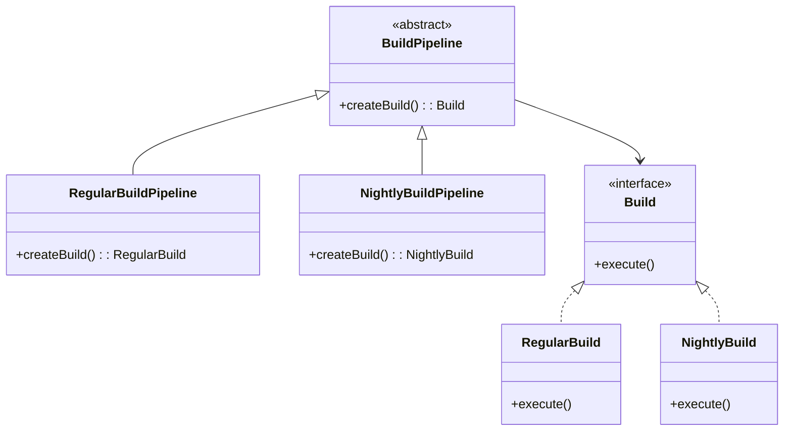

**Factory Method 패턴의 CI/CD 이점**:
- **유연성**: 새로운 빌드 유형 추가 시 기존 코드 변경 최소화
- **느슨한 결합**: 시스템 부분 간 의존성 감소
- **단일 책임 원칙**: 각 팩토리가 특정 유형 객체 생성에만 집중

**Docker 컨테이너 생성 예시 (Java)**:
```java
abstract class Build {
    abstract Process createContainer() throws IOException;
}

class JavaBuild extends Build {
    @Override
    Process createContainer() throws IOException {
        return new ProcessBuilder("docker", "run", "-d",
            "openjdk:8-jdk-alpine").start();
    }
}

class PythonBuild extends Build {
    @Override
    Process createContainer() throws IOException {
        return new ProcessBuilder("docker", "run", "-d",
            "python:3.7-alpine").start();
    }
}

// 파이프라인은 빌드 유형에 무관하게 동작
public class Main {
    static void runPipeline(Build build) throws IOException {
        Process container = build.createContainer();
        // 컨테이너와 상호작용
    }

    public static void main(String[] args) throws IOException {
        runPipeline(new JavaBuild());
        runPipeline(new PythonBuild());
    }
}
```

---

### 5. Abstract Factory 패턴 - 다중 환경 지원

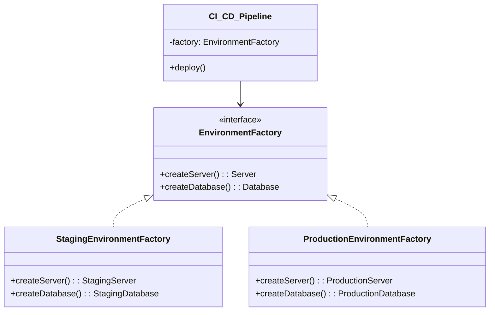

**Abstract Factory 패턴의 CI/CD 이점**:

| 이점 | 설명 |
|------|------|
| 환경 설정 | staging/production 환경별 관련 객체 세트 생성 |
| 파이프라인 구성 | 환경에 따른 파이프라인 구성 |
| 일관된 배포 | 함께 동작하는 객체 세트 사용 보장 |
| 확장성 | 새로운 환경/컴포넌트 추가 용이 |

---

### 6. Builder 패턴 - 파이프라인 단계 구성

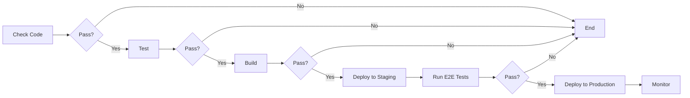

Builder 패턴은 **복잡한 파이프라인의 단계별 구성**에 적합:
1. 코드 체크
2. 테스트 실행
3. 빌드
4. 스테이징 배포
5. E2E 테스트
6. 프로덕션 배포
7. 모니터링

---

### 7. Prototype 패턴 - 환경 복제

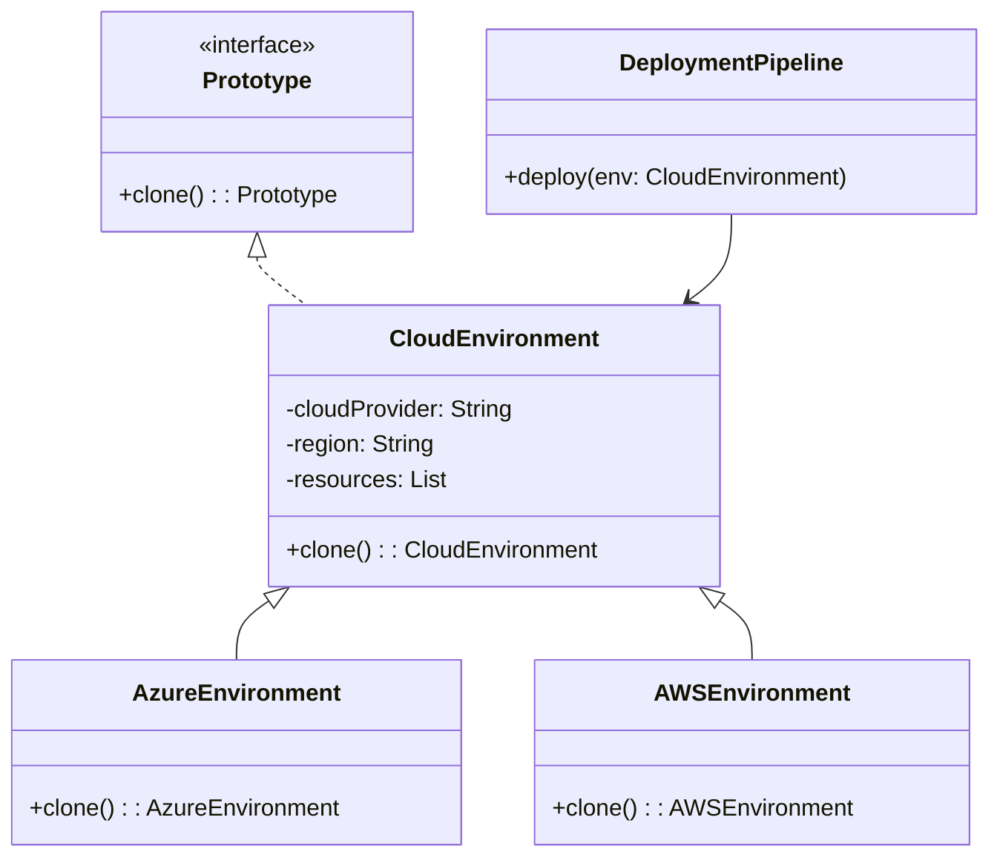

**Prototype 패턴의 CI/CD 이점**:
- **효율성**: 기존 객체 복제로 복잡한 객체 빠르게 생성
- **일관성**: 파이프라인 단계 간 일관된 설정 보장
- **유연성**: 복제된 객체를 필요에 따라 커스터마이징
- **리소스 관리**: 기존 객체 재사용으로 효율적 리소스 관리

---

### 8. 클라우드 네이티브 CI/CD 패턴

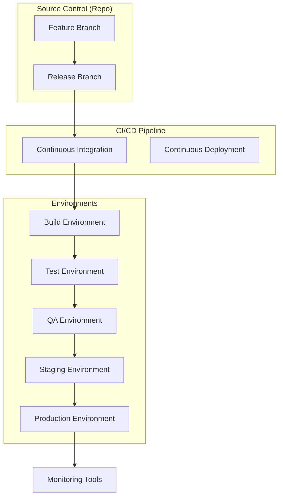

#### 클라우드 네이티브 CI/CD의 핵심 원칙

| 원칙 | 설명 |
|------|------|
| **불변 인프라** | 기존 구성요소 수정 대신 교체 → "내 머신에서는 되는데" 문제 해결 |
| **마이크로서비스 아키텍처** | 개별 서비스 독립 배포/확장 |
| **IaC (Infrastructure as Code)** | 인프라 자동 프로비저닝 및 버전 관리 |
| **컨테이너화 & 오케스트레이션** | Kubernetes로 일관된 컨테이너 배포 |
| **Configuration as Code** | 빌드/배포 프로세스를 코드로 정의 |
| **GitOps** | Git 저장소를 소스 오브 트루스로 활용 |
| **Observability** | 로깅, 모니터링, 알림 시스템 |
| **지속적 피드백** | 개발 라이프사이클 전체에서 피드백 수집 |

---

### 9. 컨테이너화와 생성 패턴의 관계

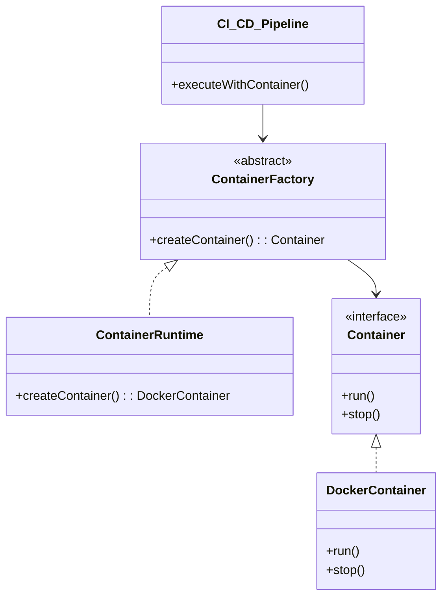

**컨테이너화와 생성 패턴의 매핑**:

| 생성 패턴 | 컨테이너화에서의 적용 |
|----------|---------------------|
| **Prototype** | 단일 컨테이너를 프로토타입으로 복제 |
| **Factory Method** | 컨테이너 런타임이 팩토리 역할 |
| **Builder** | Dockerfile로 컨테이너 이미지 단계별 구성 |
| **Singleton** | Kubernetes에서 단일 설정 파일(소스 오브 트루스) 관리 |

---

### 10. 마이크로서비스와 서버리스

#### 호텔 예약 애플리케이션 예시

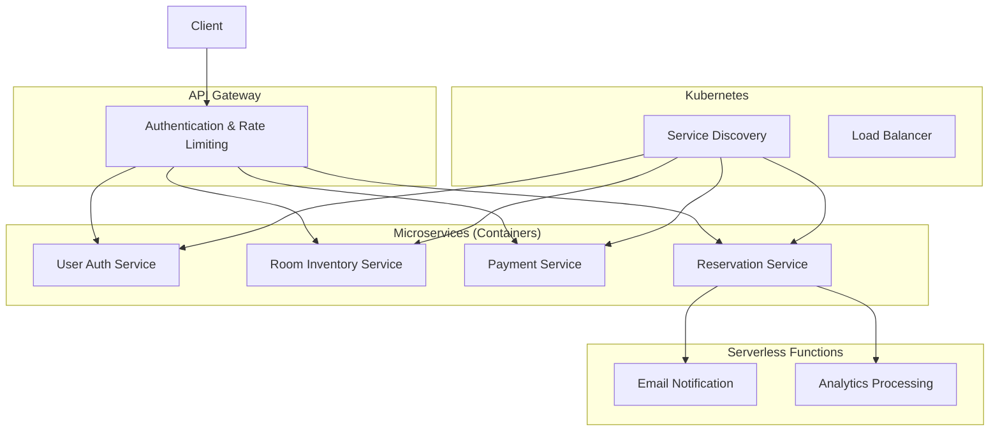

#### 서버리스 CI/CD 특성

| 특성 | 설명 |
|------|------|
| **함수 기반 배포** | 개별 함수 독립 배포/확장 |
| **이벤트 기반 테스트** | 이벤트 시뮬레이션으로 함수 트리거 테스트 |
| **IaC 활용** | CloudFormation, Serverless Framework 등 |
| **Cold Start 고려** | 비사용 시 함수 종료 → 재호출 시 지연 |
| **최소 권한 원칙** | 배포에 필요한 최소 권한만 사용 |

---

### 11. 보안과 컴플라이언스 통합

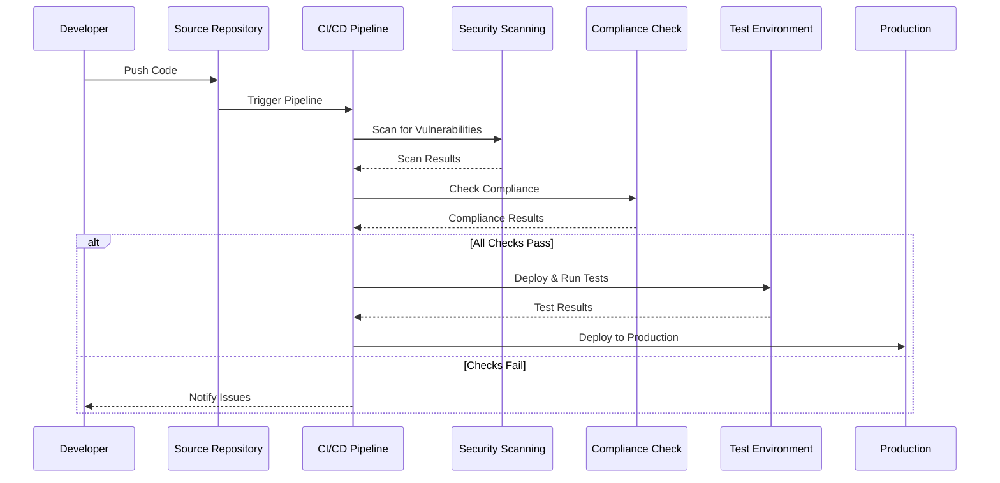

**보안 및 컴플라이언스 핵심 구성요소**:

| 구성요소 | 설명 |
|----------|------|
| **DevSecOps** | 보안을 DevOps 프로세스에 통합 |
| **Shift-Left Security** | 개발 초기 단계에서 보안 고려 |
| **코드 스캐닝** | 취약점 식별 도구 활용 |
| **컨테이너 보안** | 컨테이너 이미지 취약점 검사 |
| **비밀 관리** | 접근 제어 및 권한 분리 |
| **Policy as Code** | 정책을 코드로 자동화 |
| **감사 및 증명** | 정기 감사, 규정 준수 검증 |

---

### 12. Argo CD를 활용한 Factory Method 구현

**디렉토리 구조**:
```
.
├── base
│   ├── deployment.yaml
│   └── service.yaml
├── overlays
│   ├── dev
│   │   ├── kustomization.yaml
│   │   └── patch.yaml
│   ├── prod
│   │   ├── kustomization.yaml
│   │   └── patch.yaml
│   └── stage
│       ├── kustomization.yaml
│       └── patch.yaml
└── kustomization.yaml
```

**Argo CD 애플리케이션 정의**:
```yaml
apiVersion: argoproj.io/v1alpha1
kind: Application
metadata:
  name: my-app-dev
spec:
  project: default
  source:
    repoURL: https://github.com/my-org/my-repo.git
    targetRevision: HEAD
    path: overlays/dev  # 환경별 오버레이 경로
  destination:
    server: https://kubernetes.default.svc
    namespace: dev
```

> `path` 필드를 `overlays/stage` 또는 `overlays/prod`로 변경하여 각 환경에 맞는 배포 구성 적용

---

### 13. 확장 및 최적화 전제조건

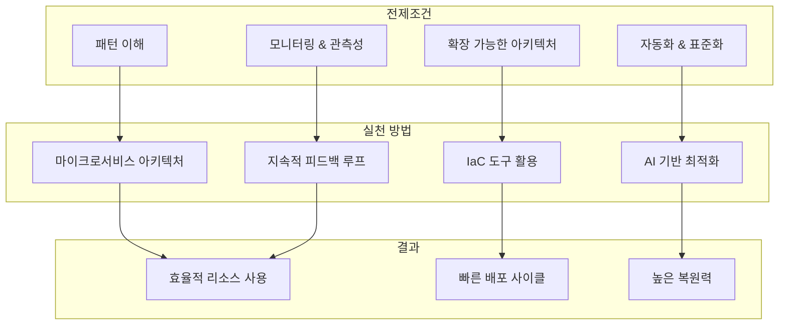

**확장 및 최적화 고려사항**:
1. 현재 상태 파악 및 병목 지점 식별
2. 마이크로서비스 아키텍처 적용
3. 프로세스 자동화 및 표준화
4. 리소스 및 비용 최적화
5. 지속적 개선을 위한 피드백 루프 구현
6. 호환성, 확장성, 성능, 보안, 사용성 기반 도구 선택
7. 인프라 사전 확장으로 단일 장애 지점 방지

---

## 🔍 심화 학습

### 추가 조사 내용

- **Kubernetes 오퍼레이터 패턴**: 커스텀 리소스와 컨트롤러를 사용한 애플리케이션 관리 자동화
- **Service Mesh (Istio, Linkerd)**: 마이크로서비스 간 통신 관리, 관측성, 보안
- **Chaos Engineering**: Netflix Chaos Monkey 등을 활용한 복원력 테스트
- **FinOps**: 클라우드 비용 최적화와 CI/CD 파이프라인 연계

### 출처
- [Argo CD 공식 문서](https://argo-cd.readthedocs.io/)
- [Kubernetes 패턴](https://kubernetes.io/docs/concepts/overview/working-with-objects/)
- [Kustomize 문서](https://kustomize.io/)
- [CNCF Cloud Native 정의](https://www.cncf.io/about/charter/)

---

## 💡 실무 적용 포인트

### 이런 상황에서 사용하세요

- **다중 환경 배포**: Abstract Factory 패턴으로 dev/staging/prod 환경별 리소스 세트 생성
- **공유 설정 관리**: Singleton 패턴으로 ConfigMap을 통한 일관된 설정 배포
- **빌드 유형 다양화**: Factory Method 패턴으로 Java/Python/Node.js 등 다양한 빌드 지원
- **환경 템플릿**: Prototype 패턴으로 기본 환경 설정 복제 및 커스터마이징
- **복잡한 파이프라인**: Builder 패턴으로 단계별 파이프라인 구성

### 주의할 점 / 흔한 실수

- ⚠️ Singleton 패턴은 멀티스레드 환경에서 **스레드 안전성** 보장 필요
- ⚠️ 생성 패턴은 CI/CD에서 **개념적 가이드**로 활용 - 실제 구현은 Kubernetes, Argo CD 등 도구 활용
- ⚠️ 서버리스의 **Cold Start** 문제 고려 - 지연에 민감한 작업은 별도 처리
- ⚠️ IaC 도구(Terraform 등) 사용 시 **상태 파일 관리** 주의
- ⚠️ 마이크로서비스 아키텍처의 **복잡성 증가** - 서비스 메시나 API 게이트웨이로 관리

### 면접에서 나올 수 있는 질문

- Q: CI/CD 파이프라인에서 Singleton 패턴은 어떻게 적용되는가?
- Q: Factory Method 패턴과 Abstract Factory 패턴의 차이점을 CI/CD 맥락에서 설명하라
- Q: 불변 인프라(Immutable Infrastructure)의 장점은 무엇인가?
- Q: 컨테이너화가 "내 머신에서는 되는데" 문제를 어떻게 해결하는가?
- Q: 클라우드 네이티브 CI/CD에서 GitOps의 역할은?

---

## ✅ 핵심 개념 체크리스트

- [ ] 5가지 생성 패턴(Factory Method, Abstract Factory, Singleton, Prototype, Builder)의 CI/CD 적용 사례를 설명할 수 있는가?
- [ ] 확장성(Scalability)과 복원력(Resilience)의 차이를 알고 있는가?
- [ ] 컨테이너화와 생성 패턴의 관계를 이해하는가?
- [ ] 클라우드 네이티브 CI/CD의 핵심 원칙(불변 인프라, IaC, GitOps 등)을 설명할 수 있는가?
- [ ] 마이크로서비스와 서버리스의 CI/CD 파이프라인 특성을 알고 있는가?
- [ ] CI/CD 파이프라인에 보안과 컴플라이언스를 통합하는 방법을 이해하는가?
- [ ] Argo CD와 Kustomize를 활용한 환경별 배포 설정 방법을 알고 있는가?

---

## 🔗 참고 자료

- 📄 공식 문서: [Kubernetes Patterns](https://kubernetes.io/docs/concepts/)
- 📄 Argo CD: [Declarative GitOps CD](https://argo-cd.readthedocs.io/)
- 📄 CNCF: [Cloud Native Definition](https://github.com/cncf/toc/blob/main/DEFINITION.md)
- 📄 Kustomize: [Kubernetes Native Configuration Management](https://kustomize.io/)
- 🎬 추천 영상: [CNCF YouTube Channel](https://www.youtube.com/@clooudnativefdn)
- 📚 연관 서적: "Kubernetes Patterns" (Bilgin Ibryam, Roland Huß)

---
