---

## 📌 핵심 요약
> 이 장에서는 **클라우드 네이티브 환경에서의 배포 전략**과 **CI/CD 생성 패턴의 실제 적용**을 다룬다. 핵심은 Landing Zone 개념, Singleton 패턴을 활용한 표준화(저장소 구조, 파이프라인, IaC), 다양한 배포 전략(Blue-Green, Canary, Rolling), 그리고 Team Topologies를 통한 조직 구조 최적화를 이해하는 것이다.

## 🎯 학습 목표
이 내용을 읽고 나면:
- [ ] Landing Zone 개념과 CI/CD 설계에 미치는 영향을 설명할 수 있다
- [ ] Singleton 패턴을 저장소 구조, 파이프라인, IaC에 적용하는 방법을 이해할 수 있다
- [ ] 클라우드 네이티브 개발의 4가지 핵심 원칙을 설명할 수 있다
- [ ] 배포 전략(Blue-Green, Canary, Rolling)의 장단점을 비교할 수 있다
- [ ] Team Topologies와 Platform Team의 역할을 이해할 수 있다
- [ ] AWS CodePipeline을 활용한 서버리스 배포 파이프라인을 구성할 수 있다

## 📖 본문 정리

### 1. Landing Zone 개념

> 💬 **정의**: Landing Zone은 확장 가능하고 안전한, 잘 설계된 다중 계정 AWS 환경이다. 조직이 보안과 인프라에 대한 확신을 가지고 워크로드와 애플리케이션을 빠르게 배포할 수 있는 시작점이다.

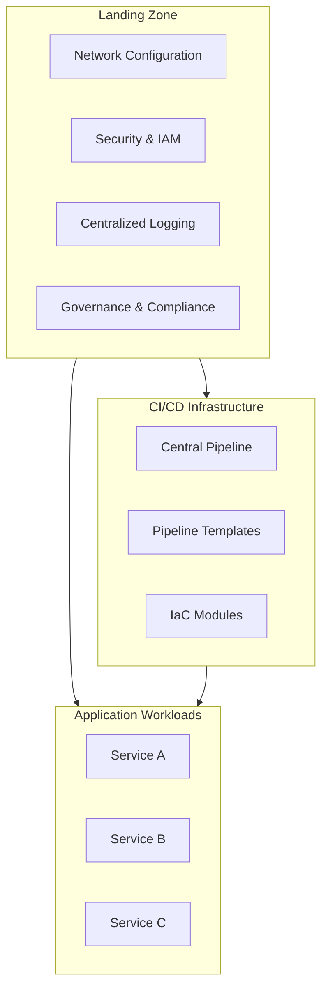

**Landing Zone이 CI/CD 설계에 미치는 영향**:
- 아키텍처 범위와 책임 결정
- 워크플로우 설계 방식 강제
- 생성 패턴 적용 방식 결정

---

### 2. Singleton 패턴 - 저장소 구조 표준화

#### 모노레포 구조 예시

```
.
├── .github
│   └── workflows
├── Infrastructure
│   ├── Common
│   ├── Service1
│   ├── Service2
│   └── Service3
├── Configuration
│   ├── Common
│   ├── Service1
│   ├── Service2
│   └── Service3
└── Application
    ├── Service1
    ├── Service2
    └── Service3
```

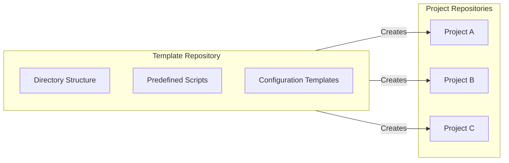

**템플릿 저장소 사용 이점**:
| 이점 | 설명 |
|------|------|
| **표준화** | 코드 구조 일관성 보장 |
| **재사용성** | 스크립트, 설정 파일 재작성 불필요 |
| **파이프라인 단순화** | 구조 분석 없이 빌드/배포 가능 |
| **모듈화** | 스크립트 코드 대신 위치만 제공 |

---

### 3. Singleton 패턴 - 파이프라인 템플릿화

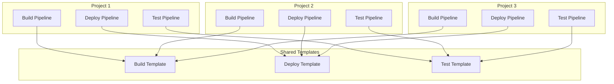

**템플릿/모듈 사용의 핵심 이유**:
- **일관성 (Consistency)**: 모든 프로젝트에 동일한 표준 적용
- **확장성 (Scalability)**: 프로젝트 수 증가에도 관리 용이
- **효율성 (Efficiency)**: 변경 시 모듈 한 곳만 수정
- **빠른 프로토타이핑**: 새 프로젝트 빠르게 시작

---

### 4. Singleton 패턴 - IaC 모듈

```hcl
# Terraform 모듈을 Singleton처럼 재사용
module "vpc" {
  source  = "terraform-aws-modules/vpc/aws"
  version = "5.8.1"
}
```

> 💬 **비유**: Terraform 모듈을 Singleton처럼 정의하면, 여러 프로젝트에서 동일한 네트워크 구성을 재사용할 수 있다. 마치 공장에서 동일한 설계도로 제품을 찍어내는 것과 같다.

---

### 5. 클라우드 네이티브 개발의 4가지 핵심 원칙

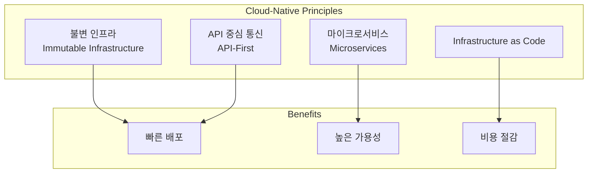

#### 4가지 원칙 상세

| 원칙 | 설명 | CI/CD 영향 |
|------|------|-----------|
| **불변 인프라** | 인프라 수정 대신 교체 | 롤백 용이, 일관성 보장 |
| **마이크로서비스** | 작은 독립 컴포넌트 | 빠른 개발/테스트/배포 |
| **API** | 서비스 간 느슨한 결합 | 계약 테스트, 통합 테스트 필요 |
| **IaC** | 인프라의 코드화 | 버전 관리, 자동화, 재현성 |

#### API 테스트 단계

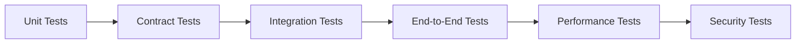

---

### 6. AWS 기반 마이크로서비스 아키텍처

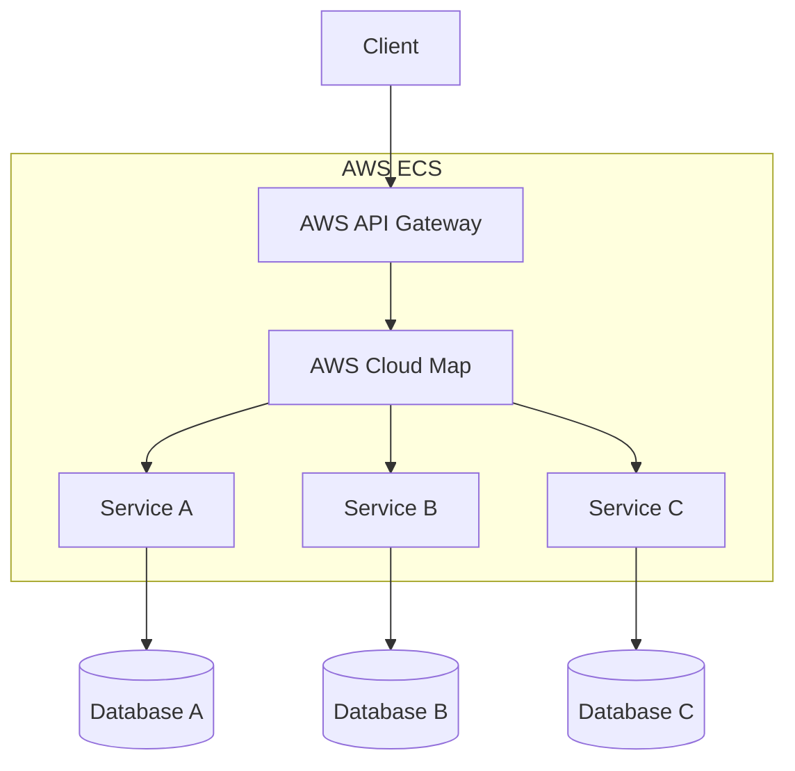

**AWS Cloud Map의 역할**:
- 클라우드 리소스 검색 서비스
- API Gateway가 요청을 보낼 컨테이너 IP 제공
- 로드 밸런서 없이 서비스 디스커버리 가능 → 비용/성능 개선

#### 저장소 구조 선택 기준

| 질문 | 예 → 모노레포 | 아니오 → 폴리레포 |
|------|--------------|-----------------|
| 시스템의 폐쇄된 컴포넌트인가? | ✓ | |
| API가 마이크로서비스의 유일한 진입점인가? | ✓ | |
| Cloud Map이 이 마이크로서비스들만 사용하는가? | ✓ | |
| 두 마이크로서비스가 같은 DB 사용 가능한가? | ✓ | |

---

### 7. 서버리스 아키텍처

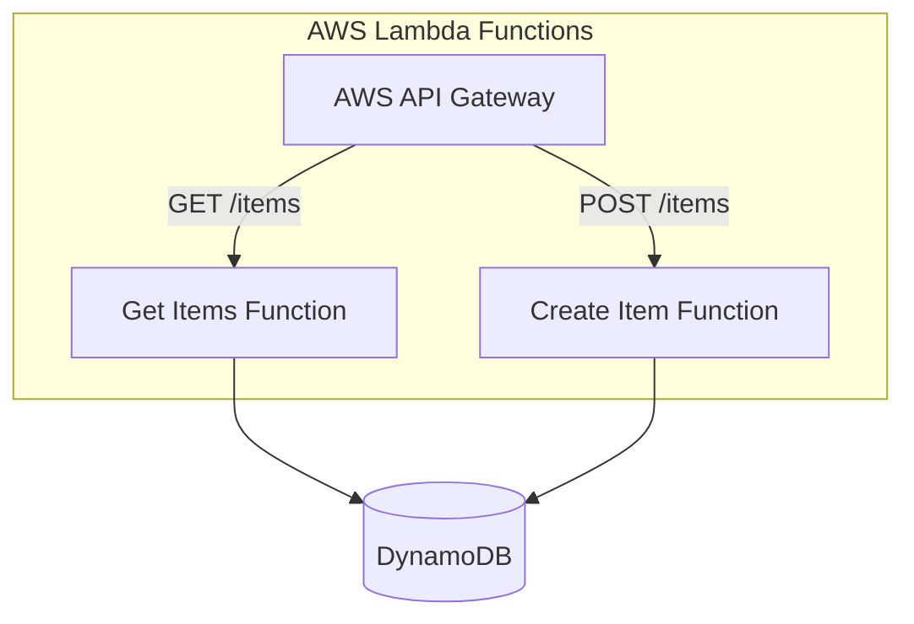

#### 서버리스 코드 구조 (Handler 함수)

**JavaScript**:
```javascript
export const handler = async (event) => {
  const response = {
    statusCode: 200,
    body: JSON.stringify('Hello, world!'),
  };
  return response;
};
```

**Python**:
```python
import json

def handler(event, context):
    return {
        'statusCode': 200,
        'body': json.dumps('Hello, world!')
    }
```

#### 서버리스 CI/CD 고려사항

| 특성 | 설명 |
|------|------|
| **함수 기반 배포** | 개별 함수 독립 배포/확장 |
| **이벤트 기반 테스트** | 이벤트 시뮬레이션으로 함수 트리거 |
| **IaC 의존** | CloudFormation, SAM, Serverless Framework |
| **Cold Start** | 비사용 시 함수 종료 → 재호출 시 지연 |
| **깊은 디커플링** | 복잡한 연결 패턴 |

#### 하이브리드 저장소 전략

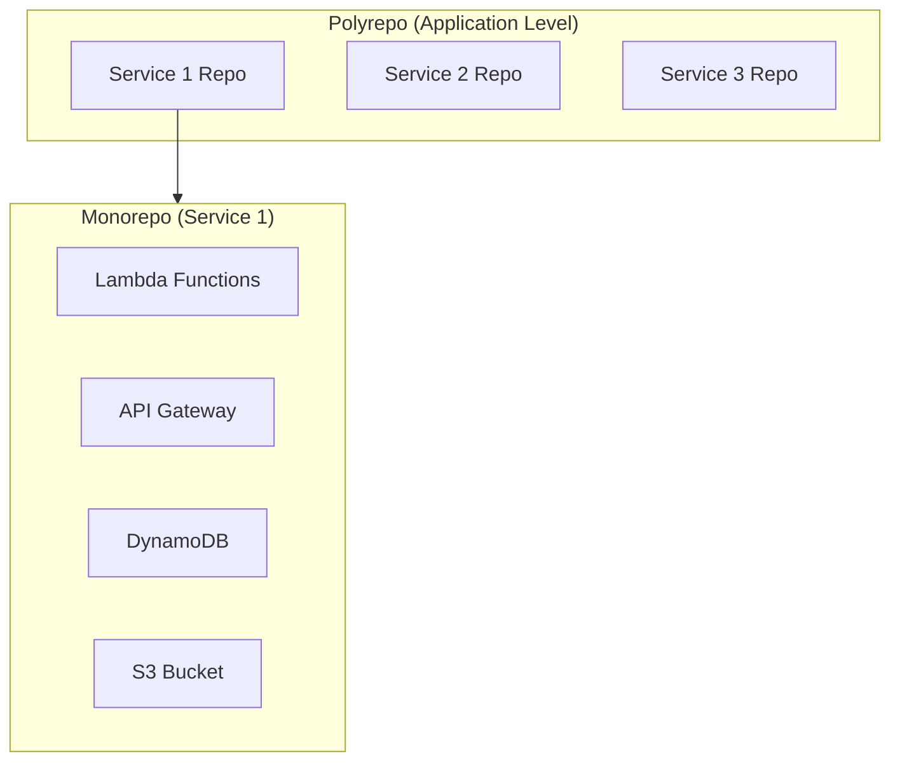

> **권장**: 전체 애플리케이션은 폴리레포, 각 서비스는 관련 리소스(DB, API, 스토리지 등)를 포함한 모노레포

---

### 8. 클라우드 CI/CD 도구 비교

| 도구 | 특징 |
|------|------|
| **Azure DevOps** | 독립적인 SaaS CI/CD 플랫폼, Azure 외 플랫폼과도 통합 가능 |
| | Azure Boards (프로젝트 관리), Test Plans, Artifacts, Repos, Pipelines |
| **AWS CodePipeline** | AWS 생태계에 깊이 통합 |
| | CodeCommit (저장소), CodeBuild (빌드), CodeDeploy (배포), CodeArtifacts (아티팩트) |

---

### 9. 배포 전략

#### 9.1 Blue-Green 배포

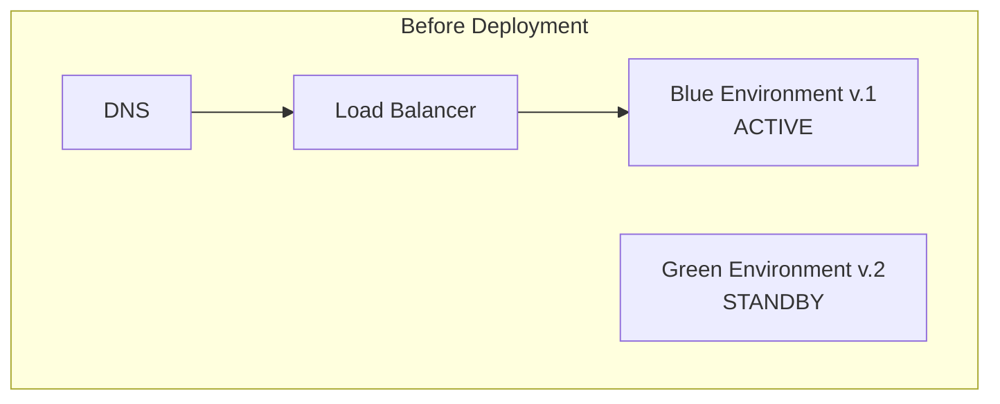

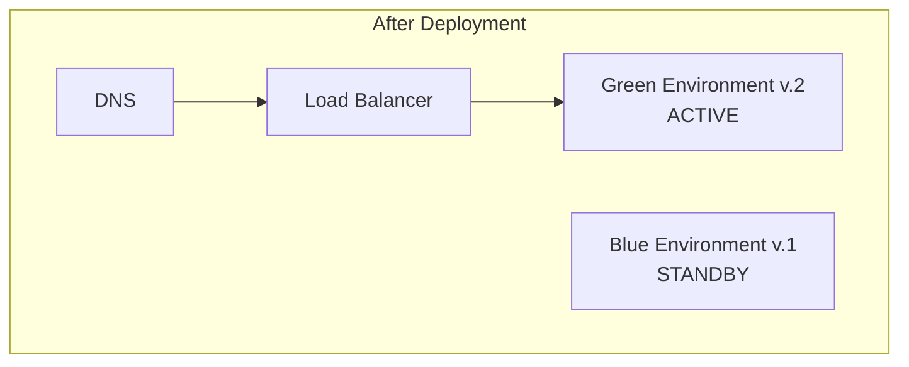

**Blue-Green 장단점**:

| 장점 | 단점 |
|------|------|
| DNS 레벨 전환으로 쉬운 롤백 | 인프라 이중화로 높은 복잡성 |
| 새 버전 완전 테스트 가능 | 2배의 비용 |
| Release 방식에 적합 | 두 DB 간 데이터 일관성 관리 필요 |
| 운영 환경 최소 영향 | 보안 관리 이중화 |

#### 9.2 Blue-Violet 배포 (Blue-Green 변형)

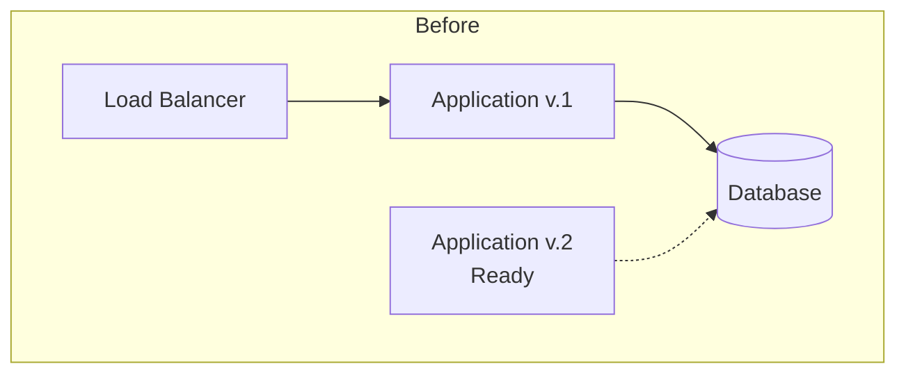

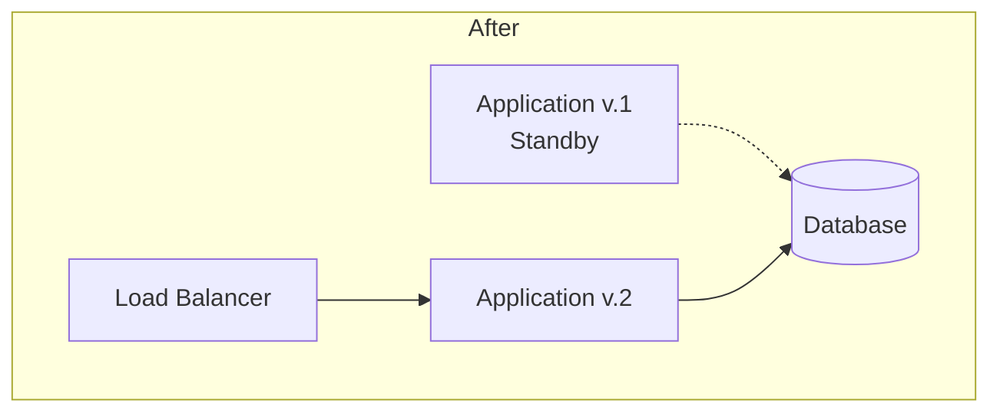

> 로드 밸런서와 데이터베이스 사이의 애플리케이션 레이어만 전환

#### 9.3 Red-Black 배포 (Blue-Violet + Canary)

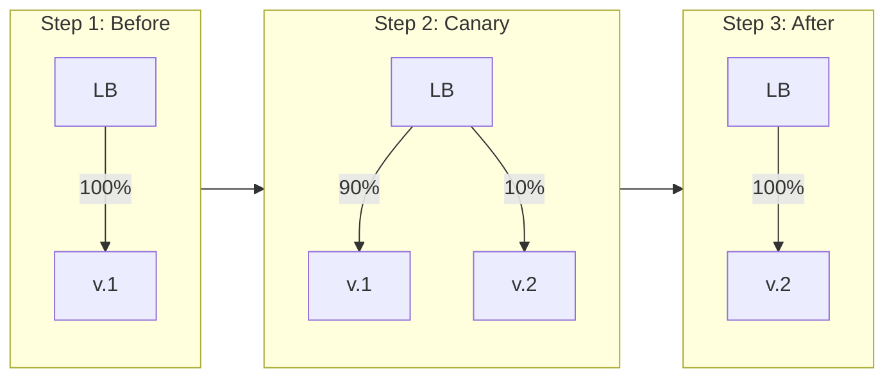

#### 9.4 Canary 배포

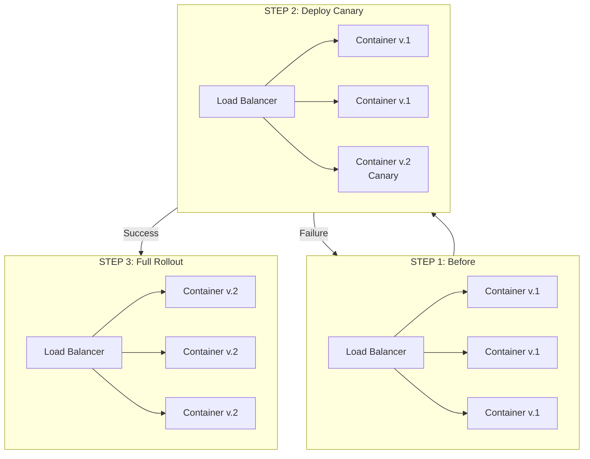

> 💬 **비유**: "카나리아"라는 이름은 광부들이 탄광에서 일산화탄소를 감지하기 위해 카나리아 새를 사용한 것에서 유래했다. 새가 먼저 쓰러지면 위험 신호로 인식했다.

**Canary 장단점**:

| 장점 | 단점 |
|------|------|
| 아키텍처 변경 불필요 | 카나리아가 신뢰할 수 없을 수 있음 |
| 배포 정확성 빠른 평가 | 문제 발생 시 안정화 노력 증가 |
| 자동화 용이 | 다중 버전 동시 관리 복잡성 |

#### 롤백 전략

| 전략 | 설명 |
|------|------|
| **Rollback Back** | 이전 버전으로 복원, 팀이 문제 해결할 시간 확보 |
| **Rollback Forward** | 이전 버전 대신 수정된 새 버전 배포 |

#### 9.5 Rolling 배포

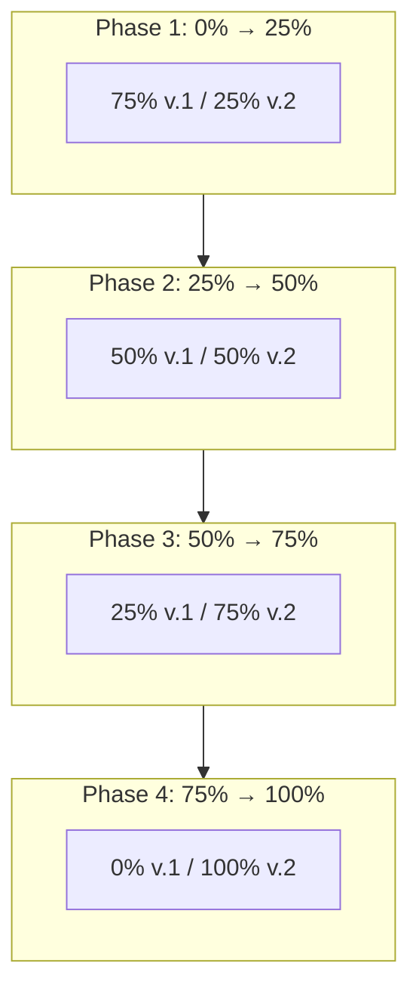

**Rolling 장단점**:

| 장점 | 단점 |
|------|------|
| 점진적 배포, 다수 체크포인트 | Canary보다 긴 배포 시간 |
| 배포 평가 용이 | CI/CD 파이프라인 소요 시간 증가 |
| 서비스 중단 위험 낮음 | 업데이트 중 다중 버전 동시 운영 |

---

### 10. Team Topologies

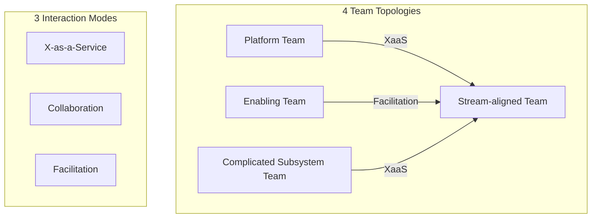

#### Platform Team의 CI/CD 책임

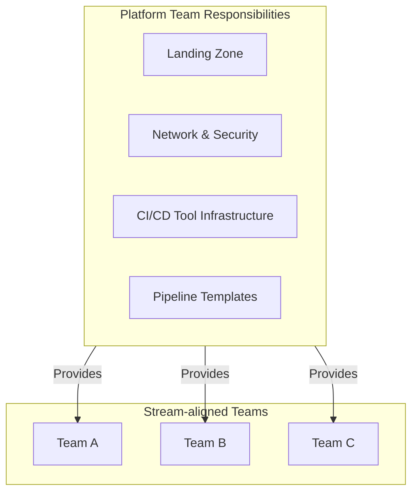

**Platform Team의 핵심 역할**:
- Landing Zone 및 핵심 리소스(네트워크, 접근 권한 등) 관리
- CI/CD 도구 인프라 관리
- 파이프라인 핵심 스켈레톤 준비
- 표준화, 모듈화, 확장성 패턴 적용

---

### 11. AWS CodePipeline 실전 예시

#### CodeBuild (CI 부분)

```yaml
lambdaBuild:
  Type: AWS::CodeBuild::Project
  Properties:
    Name: lambdaPipeline_Build
    Description: Build the artifact
    ServiceRole: !GetAtt lambdaBuildRole.Arn
    Artifacts:
      Type: CODEPIPELINE
    Environment:
      Type: LINUX_CONTAINER
      ComputeType: BUILD_GENERAL1_SMALL
      Image: aws/codebuild/amazonlinux2-x86_64-standard:3.0
    Source:
      Type: CODEPIPELINE
      BuildSpec: !Sub |
        version: 0.2
        env:
          shell: bash
        phases:
          install:
            runtime-versions:
              python: 3.8
          build:
            commands:
              - !Sub aws cloudformation package --template-file template.yml --s3-bucket ${artifactsBucket} --output-template-file outputTemplate.yml
        artifacts:
          type: zip
          files:
            - template.yml
            - outputTemplate.yml
    TimeoutInMinutes: 5
```

#### CodeDeploy (CD 부분) - CloudFormation ChangeSet

```yaml
- Name: DeployLambda
  Actions:
  # Step 1: ChangeSet 생성
  - Name: CreateChangeSet
    ActionTypeId:
      Category: Deploy
      Owner: AWS
      Version: 1
      Provider: CloudFormation
    Configuration:
      ActionMode: CHANGE_SET_REPLACE
      StackName: lambdaDemo
      ChangeSetName: simpleLambdaChangeSet
      TemplatePath: lambdaBuildOutput::outputTemplate.yml
      Capabilities: CAPABILITY_IAM,CAPABILITY_AUTO_EXPAND
      RoleArn: !GetAtt lambdaDeployRole.Arn
    RunOrder: 1

  # Step 2: 수동 승인
  - Name: ManualApproval
    ActionTypeId:
      Category: Approval
      Owner: AWS
      Version: 1
      Provider: Manual
    Configuration:
      NotificationArn: !Ref notificationTopic
      CustomData: 'Approve or reject the pipeline.'
    RunOrder: 2

  # Step 3: ChangeSet 실행
  - Name: ExecuteChangeSet
    ActionTypeId:
      Category: Deploy
      Owner: AWS
      Version: 1
      Provider: CloudFormation
    Configuration:
      ActionMode: CHANGE_SET_EXECUTE
      StackName: lambdaDemo
      ChangeSetName: simpleLambdaChangeSet
      RoleArn: !GetAtt lambdaDeployRole.Arn
    RunOrder: 3
```

---

## 🔍 심화 학습

### 추가 조사 내용

- **AWS SAM (Serverless Application Model)**: 서버리스 애플리케이션 정의 및 배포 간소화
- **Serverless Framework**: 다중 클라우드 서버리스 배포 지원
- **AWS CDK**: 프로그래밍 언어로 IaC 작성
- **GitOps with Argo CD**: Kubernetes 환경에서의 선언적 배포

### 출처
- [AWS Landing Zone 가이드](https://docs.aws.amazon.com/prescriptive-guidance/latest/migration-aws-environment/understanding-landing-zones.html)
- [AWS Cloud Native 정의](https://aws.amazon.com/what-is/cloud-native/)
- [Team Topologies 공식 사이트](https://teamtopologies.com/book)
- [Conway's Law - Martin Fowler](https://martinfowler.com/bliki/ConwaysLaw.html)
- [AWS Lambda Deploy Samples](https://github.com/aws-samples/aws-lambda-deploy/tree/master)

---

## 💡 실무 적용 포인트

### 이런 상황에서 사용하세요

- **새 프로젝트 시작**: 템플릿 저장소로 표준 구조 생성
- **다중 환경 관리**: Blue-Green 또는 Canary 배포 전략 선택
- **마이크로서비스 전환**: 서비스별 모노레포 + 전체 폴리레포 하이브리드 전략
- **팀 확장**: Platform Team 구성으로 CI/CD 표준화 및 셀프서비스 제공
- **서버리스 도입**: AWS SAM 또는 Serverless Framework로 리소스 통합 관리

### 주의할 점 / 흔한 실수

- ⚠️ Blue-Green 배포는 **비용이 2배** - 클라우드의 온디맨드 장점을 활용하기 어려움
- ⚠️ AWS CodeDeploy 대신 **CodeBuild만으로 모든 작업 처리**하는 안티패턴 주의
- ⚠️ 서버리스 테스트는 **특별한 함수 구조** 필요 - 기존 테스트 방식과 다름
- ⚠️ Platform Team 없이 표준화 시도 시 **효과 급감**
- ⚠️ CloudFormation ChangeSet 사용으로 **배포 전 변경사항 검토** 권장

### 면접에서 나올 수 있는 질문

- Q: Blue-Green과 Canary 배포 전략의 차이점은?
- Q: Landing Zone이란 무엇이며 CI/CD 설계에 어떤 영향을 미치는가?
- Q: 마이크로서비스 아키텍처에서 모노레포와 폴리레포 중 어떤 것을 선택해야 하는가?
- Q: Team Topologies의 4가지 팀 유형과 3가지 상호작용 모드를 설명하라
- Q: Rollback Back과 Rollback Forward의 차이점은?
- Q: 불변 인프라(Immutable Infrastructure)의 장점은?

---

## ✅ 핵심 개념 체크리스트

- [ ] Landing Zone 개념과 CI/CD 설계에 미치는 영향을 설명할 수 있는가?
- [ ] Singleton 패턴을 저장소 구조, 파이프라인, IaC에 어떻게 적용하는지 이해하는가?
- [ ] 클라우드 네이티브 4가지 원칙(불변 인프라, 마이크로서비스, API, IaC)을 설명할 수 있는가?
- [ ] 배포 전략(Blue-Green, Blue-Violet, Red-Black, Canary, Rolling)의 장단점을 비교할 수 있는가?
- [ ] Team Topologies와 Platform Team의 역할을 이해하는가?
- [ ] 서버리스 환경에서의 하이브리드 저장소 전략을 설명할 수 있는가?
- [ ] AWS CodePipeline의 CodeBuild와 CodeDeploy의 역할 차이를 알고 있는가?

---

## 🔗 참고 자료

- 📄 공식 문서: [AWS CodePipeline](https://docs.aws.amazon.com/codepipeline/)
- 📄 AWS SAM: [Serverless Application Model](https://aws.amazon.com/serverless/sam/)
- 📚 필독서: "Team Topologies" (Matthew Skelton, Manuel Pais)
- 📄 Terraform Modules: [terraform-aws-modules](https://registry.terraform.io/namespaces/terraform-aws-modules)
- 🎬 추천 영상: [AWS re:Invent - CI/CD Sessions](https://www.youtube.com/results?search_query=aws+reinvent+cicd)

---
