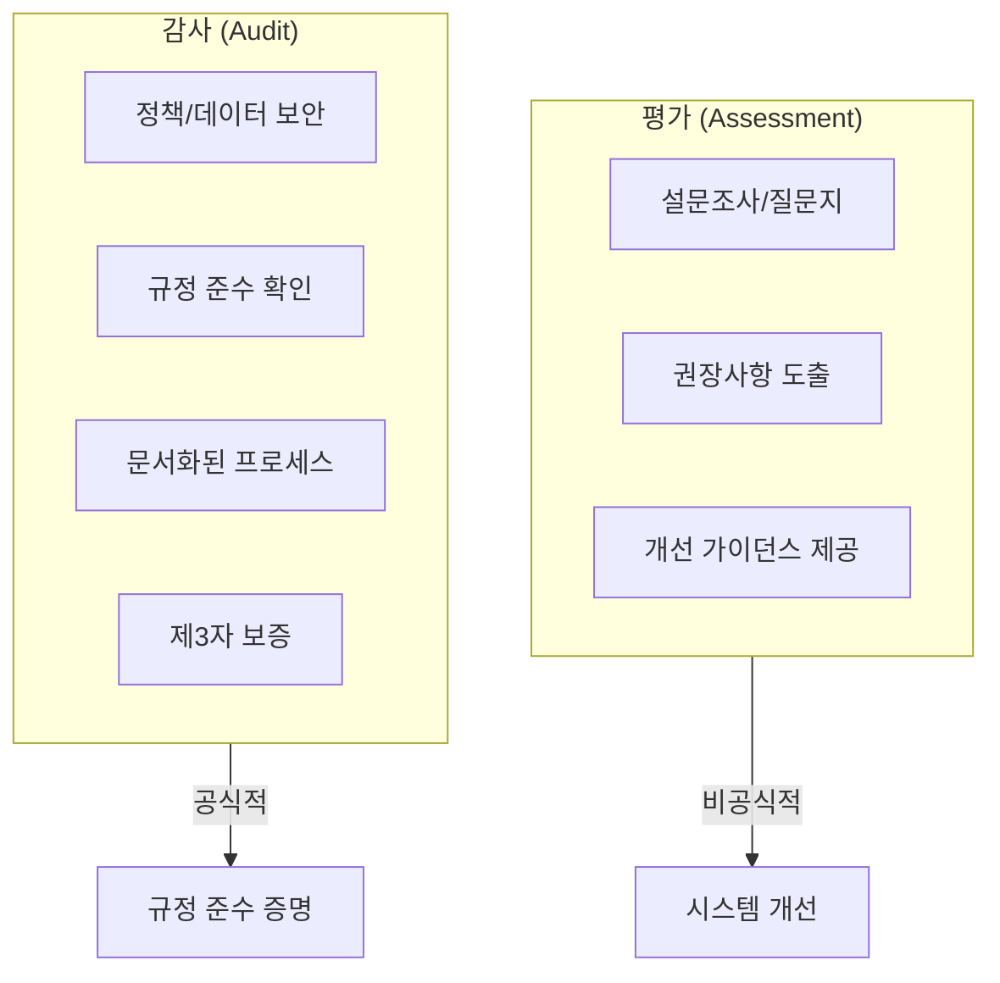
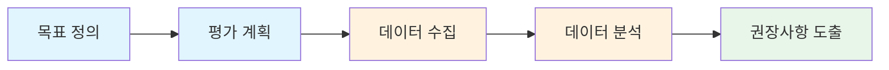
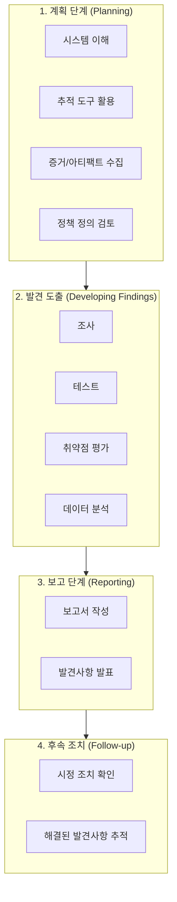
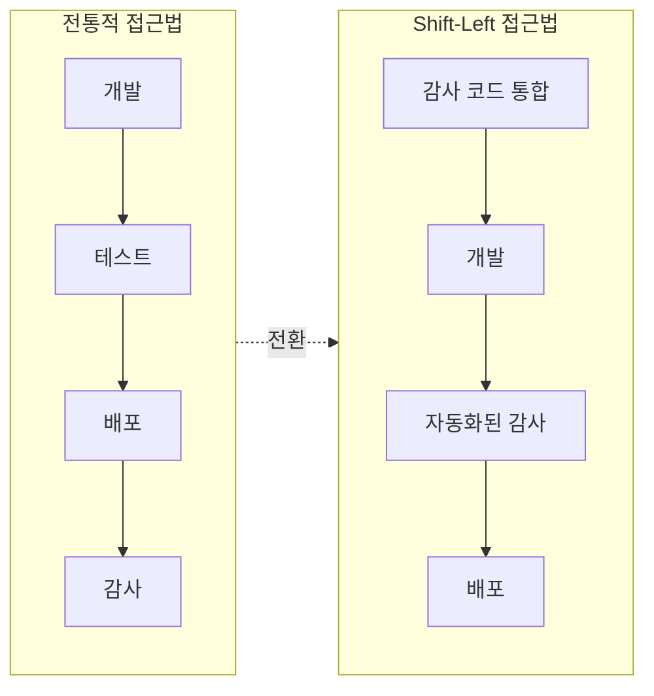
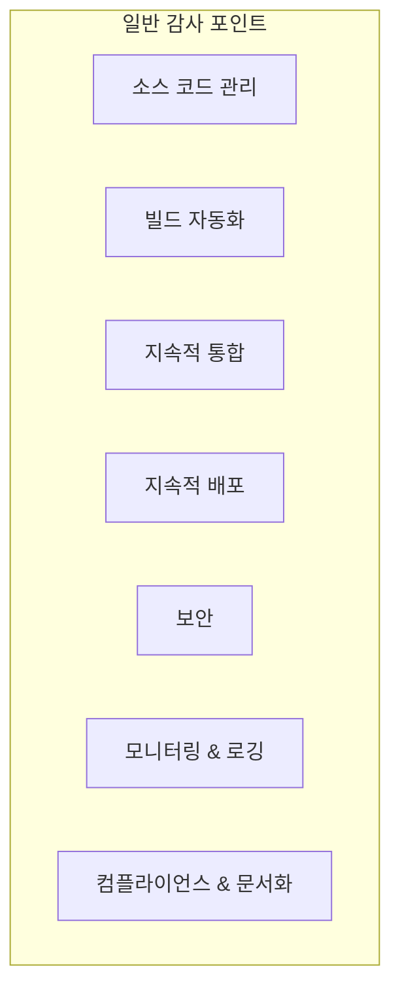
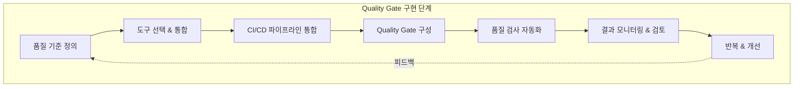
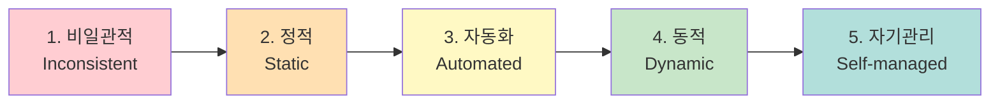
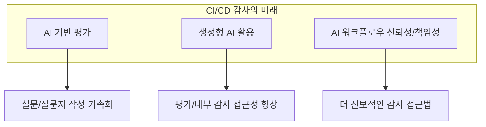

---

## 📌 핵심 요약
> 이 장에서는 **CI/CD 디자인 패턴의 감사(Audit)와 평가(Assessment)**를 다룬다. 핵심은 평가와 감사의 차이를 이해하고, Shift-Left 감사 접근법을 통해 조기에 문제를 발견하며, Quality Gate를 활용해 감사 포인트를 자동화하고, CI/CD 디자인 패턴의 **성숙도 모델**을 통해 조직의 현재 위치와 개선 방향을 파악하는 것이다.

## 🎯 학습 목표
이 내용을 읽고 나면:
- [ ] 평가(Assessment)와 감사(Audit)의 차이를 설명할 수 있다
- [ ] CI/CD 감사 프로세스의 4단계를 이해할 수 있다
- [ ] Shift-Left 감사 접근법의 장점을 설명할 수 있다
- [ ] 일반 감사 포인트와 특정 감사 포인트를 구분할 수 있다
- [ ] Quality Gate를 활용한 감사 자동화 방법을 이해할 수 있다
- [ ] CI/CD 디자인 패턴 성숙도 모델의 5단계를 설명할 수 있다

## 📖 본문 정리

### 1. 평가(Assessment)와 감사(Audit)의 차이



| 구분 | 평가 (Assessment) | 감사 (Audit) |
|------|------------------|--------------|
| **정의** | 설문/질문지를 통한 권장사항 및 개선 가이던스 제공 | ISO 정의: 감사 기준 충족 여부를 객관적으로 평가하는 체계적이고 독립적인 문서화된 프로세스 |
| **목적** | 시스템 상태 개선 | 규정 준수 증명, 신뢰 구축 |
| **범위** | 광범위 ~ 특정 범위 | 보안, 컴플라이언스, 정책 준수 |
| **수행 주체** | 내부 또는 도구 기반 | 내부/외부 제3자 |
| **형식** | 비교적 비공식적 | 공식적, 문서화 필수 |

#### 평가의 종류

- **성능 평가 (Performance Assessment)**
- **위험 평가 (Risk Assessment)**
- **CI/CD 포트폴리오 평가**
- **재무 평가 (Financial Assessment)**
- **처방적 평가 (Prescriptive Assessment)**

---

### 2. 포괄적 평가 수행 프로세스



| 단계 | 활동 | 산출물 |
|------|------|--------|
| **1. 목표 정의** | 핵심 목표 및 결과물 정의 | 평가 범위 문서 |
| **2. 계획 수립** | 빈도, 기간, 도구 선정 | 평가 계획서 |
| **3. 데이터 수집** | 선정된 도구로 데이터 수집 | 원시 데이터 |
| **4. 데이터 분석** | 해석부터 복잡한 탐색까지 | 분석 결과 |
| **5. 권장사항 도출** | 인사이트 및 핵심 조치 제안 | 권장사항 보고서 |

---

### 3. 평가 도구 및 기법

#### DORA 메트릭스

> 💬 **정의**: Google Cloud의 DevOps Research and Assessment 프로그램에서 정의한 소프트웨어 개발의 속도와 안정성을 나타내는 4가지 핵심 지표

| 메트릭 | 설명 |
|--------|------|
| **Deployment Frequency** | 배포 빈도 |
| **Lead Time for Changes** | 변경 리드 타임 |
| **Change Failure Rate** | 변경 실패율 |
| **Time to Restore Service** | 서비스 복구 시간 |

#### 평가 도구

| 도구 | 용도 |
|------|------|
| **Txture** | 인프라 매핑 |
| **Matilda** | 에이전트리스 애플리케이션 토폴로지 발견 |
| **Apache DevLake™** | DevOps 도구의 분산된 데이터를 수집, 분석, 시각화 |

#### 기타 기법

- **게이미피케이션 (Gamification)**: 계층 기반 점수 시스템으로 팀/개인 동기 부여
- **디스커버리 도구**: 기존 CI/CD 접근법의 토폴로지 분석

---

### 4. CI/CD 감사 프로세스 4단계



---

### 5. Shift-Left 감사 접근법



**Shift-Left 감사의 장점**:

| 장점 | 설명 |
|------|------|
| **조기 문제 발견** | SDLC 초기에 불일치 감지 |
| **자동화된 컴플라이언스 검사** | 노동 집약적 프로세스 감소 |
| **실시간 모니터링** | 파이프라인 내 투명한 감사 추적 |
| **빠른 피드백 루프** | 신속한 시정 조치 가능 |
| **비용 절감** | 후기 단계 감사 리소스 절약 |

> 💬 **핵심**: 전통적으로 감사는 구현 후에 수행되었지만, Shift-Left 접근법은 **감사 요구사항을 코드로 구현**하여 개발 초기부터 반영한다.

---

### 6. 일반 감사 포인트 (General Audit Points)



| 감사 포인트 | 확인 사항 |
|------------|----------|
| **소스 코드 관리** | 모든 코드 변경이 VCS에서 추적되는지, 브랜치 관리 및 코드 리뷰 프로세스 |
| **빌드 자동화** | 빌드가 자동화되고 재현 가능한지, 빌드 스크립트 버전 관리, 빌드 실패 보고 |
| **지속적 통합 (CI)** | 모든 커밋에 자동화된 테스트 실행, 코드 품질 검사 통합 |
| **지속적 배포 (CD)** | 스테이징/프로덕션 배포 자동화, 배포 스크립트 버전 관리, 롤백 메커니즘 테스트 |
| **보안** | 보안 테스트 도구 통합, 시크릿 관리, SBOM 생성, 접근 제어 |
| **모니터링 & 로깅** | 빌드/배포 로그 보존, 파이프라인 상태 모니터링, 중요 장애 알림 |
| **컴플라이언스 & 문서화** | 산업 표준/규정 준수, 최신 문서화, 감사 추적 유지 |

---

### 7. 특정 감사 포인트 (Specific Audit Points)

| 감사 포인트 | 확인 사항 |
|------------|----------|
| **리뷰 컨트롤** | 버전 관리 흐름, RBAC, 파이프라인 접근 제어, 브랜치/릴리스 보호 규칙, 자격증명 관리 |
| **아티팩트 관리** | 아티팩트 무결성/보안 검증, 코드 서명, 환경 리소스 설정 드리프트 |
| **ID 관리** | 외부/공유/로컬 ID 인벤토리, 오래된 ID 카탈로그 |
| **ID 분석 및 매핑** | 불필요한 역할/권한/ID 제거 권장 |
| **도구/애플리케이션 인벤토리** | 공급망 종속성 관리, 도구 수 최적화, 라이선스 관리 |
| **자동화 워크플로우** | 빌드/테스트/배포 자동화 런타임 성능 |
| **위험 평가** | 파이프라인 공격, CI/CD 소프트웨어 스택의 보안 결함 |
| **제3자 서비스** | GitHub SaaS 등 통합 포인트, 복잡한 제3자 연결 메시 가시성 |

---

### 8. Quality Gate로 감사 포인트 구현



#### Quality Gate 구현 단계

| 단계 | 활동 |
|------|------|
| **1. 품질 기준 정의** | 코드 품질, 보안, 컴플라이언스, 성능 등 핵심 메트릭 식별 |
| **2. 도구 선택** | SonarQube (정적 분석), Snyk (보안), JMeter (성능) 등 |
| **3. 파이프라인 통합** | 플러그인 또는 API로 CI/CD 플랫폼에 통합 |
| **4. Gate 구성** | 임계값 및 조건 설정 (예: 코드 커버리지 최소 비율) |
| **5. 자동화** | 특정 단계(커밋, PR, 배포 전)에서 자동 실행 |
| **6. 모니터링** | 결과 지속 모니터링 및 이슈 검토 |
| **7. 반복 개선** | 피드백 및 진화하는 표준에 따라 기준 업데이트 |

#### Jenkins + SonarQube Quality Gate 예시

```groovy
pipeline {
    agent any
    stages {
        stage('Build') {
            steps {
                // 빌드 단계
            }
        }
        stage('SonarQube Analysis') {
            steps {
                script {
                    def scannerHome = tool 'SonarQube Scanner'
                    withSonarQubeEnv('SonarQube') {
                        sh "${scannerHome}/bin/sonar-scanner -Dsonar.projectKey=my-project -Dsonar.sources=src"
                    }
                }
            }
        }
        stage('Quality Gate') {
            steps {
                timeout(time: 1, unit: 'HOURS') {
                    // Quality Gate 통과 여부 확인
                    // 실패 시 파이프라인 중단
                    waitForQualityGate abortPipeline: true
                }
            }
        }
    }
}
```

> **동작**: 코드 빌드 → SonarQube 분석 (코드 품질, 보안 이슈) → Quality Gate 기준 확인 → **기준 미충족 시 파이프라인 중단**

---

### 9. 감사와 평가의 영향 - 사례 연구

#### Case 1: 보안 제어 누락으로 인한 데이터 유출

| 문제 | 원인 | 결과 |
|------|------|------|
| 악성 코드가 프로덕션 서버에 배포됨 | CI/CD 파이프라인 보안 평가/침투 테스트 미실시 | 대규모 데이터 유출, 평판 손상, 고객 클레임 |

**교훈**: CI/CD 프로세스의 보안 설정에 대한 체계적인 감사가 무단 접근을 방지할 수 있었음

#### Case 2: 정책/규정 변화에 대한 미준수

| 문제 | 원인 | 결과 |
|------|------|------|
| 새로운 데이터 보안 규정 미준수 | CI/CD 워크플로우가 규정 변화를 빠르게 반영하지 못함, 감사 프로그램 빈도/철저함 부족 | 심각한 처벌 |

**교훈**: CI/CD 워크플로우를 규정 업데이트와 일치시키고, 정기적이고 철저한 평가/감사 필수

#### Case 3: 부적절한 접근 권한으로 인한 무단 프로덕션 배포

| 문제 | 원인 | 결과 |
|------|------|------|
| 개발자가 테스트되지 않은 릴리스 배포 | 부적절한 접근 제어, 정기 접근 감사 부재 | 광범위한 시스템 장애, 데이터 손실 |

**교훈**: 정기적인 접근 관리 감사로 무단 배포 방지, 명확한 접근 제어 메커니즘 수립

---

### 10. CI/CD 디자인 패턴 성숙도 모델



| 단계 | 상태 | 특징 |
|------|------|------|
| **1. 비일관적 (Inconsistent)** | CI/CD 디자인 패턴 부재 | 다양한 구현의 공통점 통합 미시도 |
| **2. 정적 (Static)** | 공통 패턴의 이점 인식 시작 | 정적 가이드라인/체크리스트 생성, 시간이 지나면 구식화 가능 |
| **3. 자동화 (Automated)** | 시스템 확장에 따른 자동화 | 현대 도구로 프로세스 일부 자동화, 요구사항 입력 시 패턴 자동 생성 |
| **4. 동적 (Dynamic)** | 패턴의 진화 및 지속적 개선 | 관측성 도구로 평가/권장/개선 구현, 패턴 라이브러리, 코드 스니펫 제공 |
| **5. 자기관리 (Self-managed)** | 최고 성숙도 | 자기 관리되는 디자인 패턴 인벤토리, 여러 팀이 패턴 라이브러리 활용 |

---

### 11. 포괄적 감사/평가의 일반적 과제

| 과제 | 설명 | 해결 방향 |
|------|------|----------|
| **과도한 표준화** | 디자인 패턴이 시스템을 느리게 만들 수 있음 | 패턴의 유연성 유지 |
| **팀 조직 방식** | 아이보리 타워(중앙 집중) 형성 위험 | 실무자 주도의 연합적 접근 |
| **문서화 & 커뮤니케이션** | 다수 실무자 협업 시 오버헤드 발생 | 문서 유지가 패턴 지속에 필수 |
| **선형적 진행** | 성숙도 모델의 선형 진행이 창의성 제한 | 단계는 참고용, 창의적 사고 허용 |

---

### 12. 향후 전망



- **AI 기반 기능 활용 증가**: 소프트웨어 워크플로우의 신뢰성과 책임성 보장 중요성 증대
- **생성형 AI 기반 평가**: 설문/질문지 작성 가속화, 평가/내부 감사 접근성 향상

---

## 🔍 심화 학습

### 추가 조사 내용

- **SOC 2 (Service Organization Control 2)**: 서비스 조직의 보안, 가용성, 처리 무결성, 기밀성, 개인정보 보호 통제
- **ISO 27001**: 정보보안 관리 시스템(ISMS) 국제 표준
- **NIST Cybersecurity Framework**: 사이버보안 위험 관리 프레임워크
- **Continuous Compliance**: 지속적인 컴플라이언스 자동화 도구 (Chef InSpec, Terraform Sentinel)

### 출처
- [KPMG - Role of Internal Audit in DevOps](https://kpmg.com/kpmg-us/content/dam/kpmg/pdf/2020/role-of-internal-audit-in-devops.pdf)
- [DevOps Institute - CI/CD Audit Controls](https://www.devopsinstitute.com/wp-content/uploads/2021/07/CICD-21-AndersWallgren-SlideDeck.pdf)
- [Apache DevLake](https://devlake.apache.org/)
- [Txture](https://txture.io/en)

---

## 💡 실무 적용 포인트

### 이런 상황에서 사용하세요

- **규정 준수 필요**: SOC 2, ISO 27001 등 인증 준비 시 감사 체크리스트 활용
- **보안 강화**: CI/CD 파이프라인에 보안 테스트 도구 통합 및 Quality Gate 설정
- **조직 성숙도 평가**: 5단계 성숙도 모델로 현재 위치 파악 및 개선 로드맵 수립
- **팀 역량 향상**: DORA 메트릭스로 팀 성과 측정 및 개선 영역 식별
- **자동화된 컴플라이언스**: Policy as Code로 감사 요구사항 코드화

### 주의할 점 / 흔한 실수

- ⚠️ **과도한 표준화**는 시스템을 느리게 만들 수 있음 - 유연성 유지 필요
- ⚠️ **아이보리 타워** 형성 방지 - 실무자 주도의 패턴 진화 허용
- ⚠️ Quality Gate **임계값이 너무 엄격**하면 배포 병목 발생
- ⚠️ 감사/평가 **빈도 부족**은 규정 변화에 대응 실패로 이어질 수 있음
- ⚠️ **문서화 부족**은 감사 추적 불가능으로 이어짐

### 면접에서 나올 수 있는 질문

- Q: 평가(Assessment)와 감사(Audit)의 차이점은?
- Q: Shift-Left 감사 접근법이란 무엇이며 장점은?
- Q: CI/CD 파이프라인에서 Quality Gate의 역할은?
- Q: DORA 메트릭스의 4가지 지표를 설명하라
- Q: CI/CD 디자인 패턴 성숙도 모델의 5단계를 설명하라
- Q: CI/CD 감사에서 일반 감사 포인트와 특정 감사 포인트의 차이는?

---

## ✅ 핵심 개념 체크리스트

- [ ] 평가(Assessment)와 감사(Audit)의 차이를 설명할 수 있는가?
- [ ] CI/CD 감사 프로세스의 4단계(계획, 발견 도출, 보고, 후속 조치)를 이해하는가?
- [ ] Shift-Left 감사 접근법의 개념과 장점을 알고 있는가?
- [ ] 일반 감사 포인트 7가지를 나열할 수 있는가?
- [ ] Quality Gate를 CI/CD 파이프라인에 구현하는 방법을 이해하는가?
- [ ] CI/CD 디자인 패턴 성숙도 모델의 5단계를 설명할 수 있는가?
- [ ] 감사/평가의 일반적 과제와 해결 방향을 알고 있는가?

---

## 🔗 참고 자료

- 📄 공식 문서: [SonarQube Documentation](https://docs.sonarqube.org/)
- 📄 DORA: [DORA Metrics](https://dora.dev/)
- 📄 Apache DevLake: [DevOps Data Platform](https://devlake.apache.org/)
- 📚 연관 서적: "Strategizing Continuous Delivery in the Cloud" (Bajpai & Schuetz)
- 🎬 추천 영상: [DevOps Institute CI/CD Audit Controls](https://www.devopsinstitute.com/)

---
