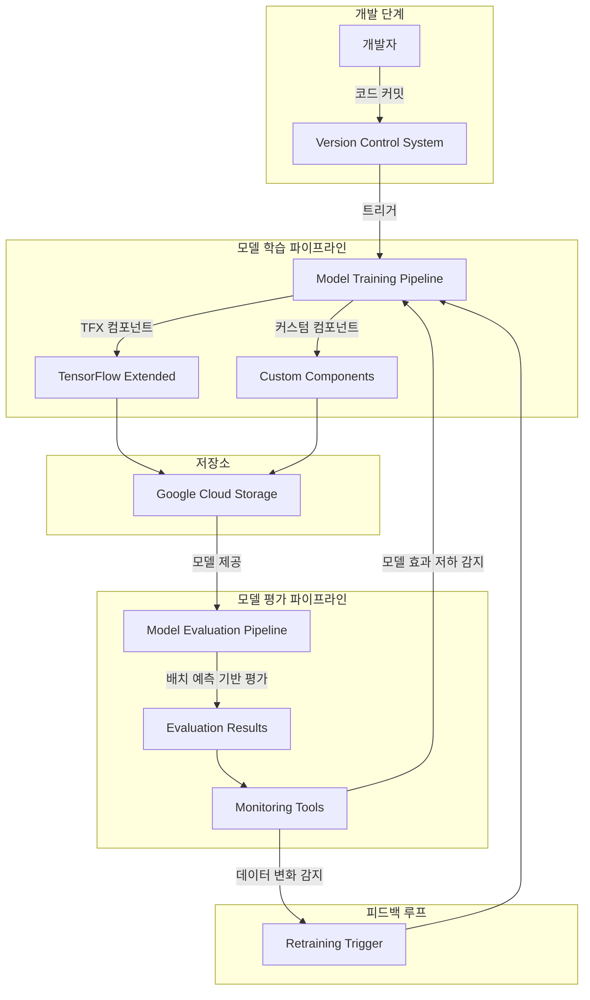
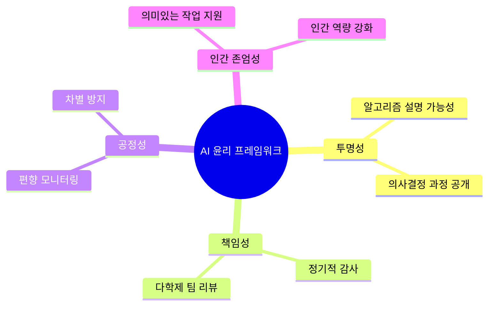
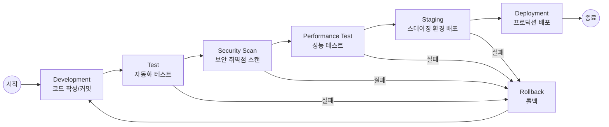
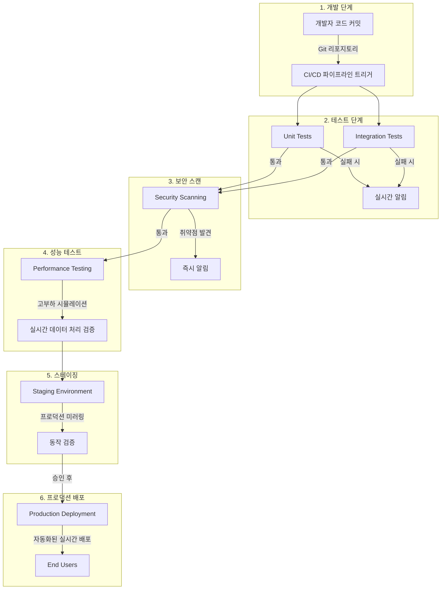
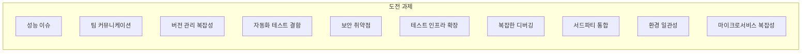
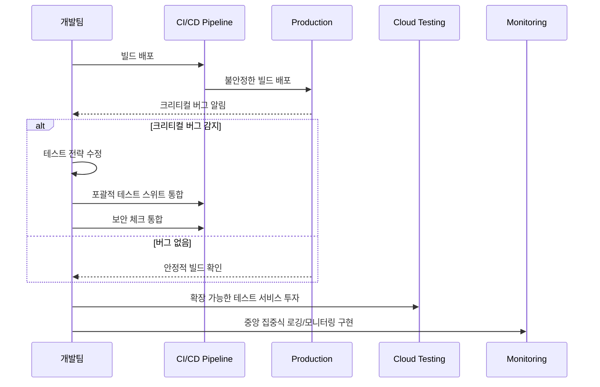
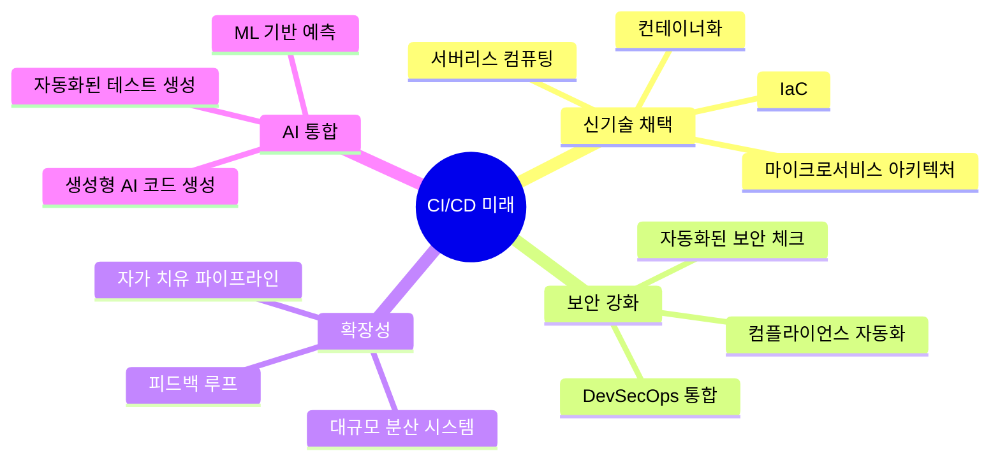
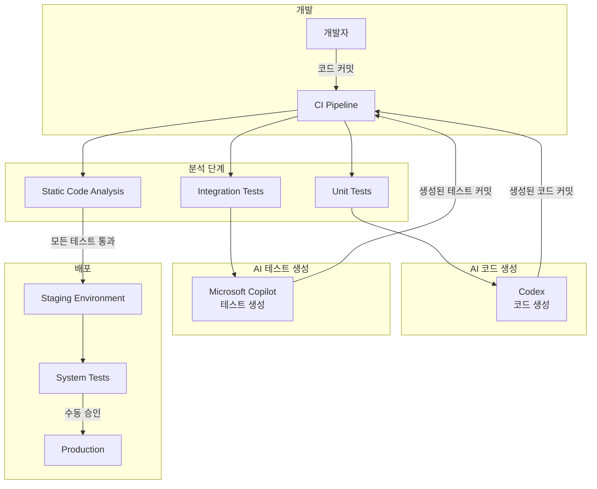
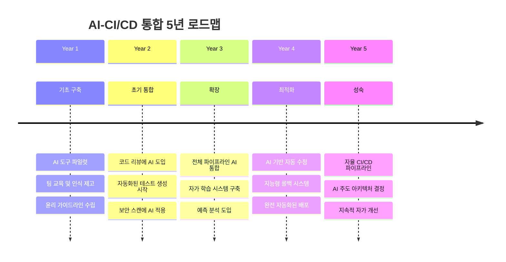

---

## 📌 핵심 요약
> 이 장에서는 **머신러닝과 생성형 AI를 CI/CD 파이프라인에 통합**하는 고급 설계 패턴을 다룬다. 핵심은 **자가 학습(Self-learning) CI/CD 시스템**과 **실시간 유틸리티 기반 패턴**을 이해하고, AI가 주도하는 CI/CD의 미래 로드맵을 파악하는 것이다.

## 🎯 학습 목표
이 내용을 읽고 나면:
- [ ] 자가 학습 CI/CD 시스템의 개념과 구성요소를 설명할 수 있다
- [ ] 실시간 유틸리티 기반 CI/CD 설계 패턴을 정의하고 적용할 수 있다
- [ ] 핀테크 등 실제 산업에서의 구현 사례와 도전 과제를 이해할 수 있다
- [ ] 생성형 AI(Codex, Copilot)를 CI/CD 파이프라인에 통합하는 방법을 설명할 수 있다
- [ ] CI/CD와 AI 통합의 5년 로드맵을 구상할 수 있다

## 📖 본문 정리

### 1. 자가 학습 CI/CD 설계 패턴 (Self-learning CI/CD)

자가 학습 CI/CD는 **머신러닝 알고리즘을 활용**하여 과거 배포 데이터를 분석하고, 패턴을 식별하며, 결과를 예측하여 파이프라인 효율성을 향상시키는 시스템이다.

#### 핵심 개념

| 구분 | 설명 |
|------|------|
| **Design Patterns** | CI/CD에서 공통 문제 해결을 위한 구조화된 접근법 |
| **Anti-Patterns** | 반복되는 문제에 대한 비효과적이고 역효과적인 대응 (예: Manual Intervention) |
| **Self-learning** | 과거 데이터 학습을 통해 안티패턴을 최소화하고 배포 프로세스를 지속적으로 개선 |

#### 구성 요소

- **VCS (Version Control System)**: 코드 변경 추적
- **자동화된 테스트**: 품질 보장
- **모니터링 도구**: 시스템 상태 파악
- **피드백 루프**: 지속적 개선 사이클

> 💬 **비유**: 자가 학습 CI/CD는 마치 자율주행 차량이 주행 데이터를 학습하여 점점 더 나은 운전을 하는 것과 같다. 과거 배포 실패 사례를 학습하여 미래의 문제를 예방한다.

#### 자가 학습 CI/CD 시스템 워크플로우



#### TensorFlow Extended (TFX) 소개

| 구성요소 | 역할 |
|----------|------|
| **ExampleGen** | 데이터 수집 및 분할 |
| **StatisticsGen** | 데이터 통계 생성 |
| **SchemaGen** | 스키마 추론 |
| **Transform** | 특성 엔지니어링 |
| **Trainer** | 모델 학습 |
| **Evaluator** | 모델 평가 |
| **Pusher** | 모델 배포 |

---

### 2. AI 윤리 및 거버넌스

AI를 CI/CD에 통합할 때 반드시 고려해야 할 윤리적 프레임워크:



**핵심 원칙:**
- AI 시스템이 인간의 작업을 대체하는 것이 아닌 **보완**하도록 설계
- **지속적인 윤리 교육** 및 모든 이해관계자의 인식 제고
- **적응형 거버넌스 구조**로 새로운 윤리적 도전에 대응
- 외부 전문가 참여를 통한 폭넓은 관점 확보

---

### 3. 실시간 유틸리티 기반 CI/CD 설계 패턴

실시간 유틸리티 기반 CI/CD는 **실시간 피드백, 성능 메트릭, 사용자 행동** 등을 기반으로 CI/CD 관행을 동적으로 조정하는 개념이다.

#### 핵심 특성

| 특성 | 설명 |
|------|------|
| **실시간(Real-time)** | 코드 커밋 시 자동 트리거, 즉각적인 피드백 제공 |
| **유틸리티 기반(Utility-based)** | 개발에서 프로덕션까지 유틸리티(앱)를 전달하도록 설계 |
| **CI/CD 패턴 준수** | 소프트웨어 전달 프로세스 자동화 강조 |

#### 실시간 유틸리티 패턴 워크플로우



---

### 4. 핀테크 기업 구현 사례

금융 관리 플랫폼을 개발하는 핀테크 기업의 실시간 유틸리티 기반 CI/CD 구현 예시:

#### 단계별 구현



#### 각 단계의 실시간 & 유틸리티 특성

| 단계 | 실시간 특성 | 유틸리티 특성 |
|------|-------------|---------------|
| **개발** | 커밋 시 즉시 파이프라인 트리거 | 최신 기능/수정이 포함된 플랫폼 전달 |
| **테스트** | 테스트 실패 시 즉시 알림 | 기존 기능 유지 보장 |
| **보안 스캔** | 취약점 발견 시 즉시 알림 | 산업 표준 준수 보장 |
| **성능 테스트** | 고부하 상황 실시간 시뮬레이션 | 피크 시간 효율적 데이터 전달 보장 |
| **스테이징** | 이전 단계 통과 시 자동 배포 | 실제 환경에서 동작 검증 |
| **프로덕션** | 승인 후 자동화된 실시간 배포 | 사용자에게 항상 최신 버전 제공 |

---

### 5. 구현 도전 과제와 해결책

#### 주요 도전 과제



#### 도전 과제별 해결 전략

| 도전 과제 | 해결 전략 |
|-----------|-----------|
| **성능 이슈** | 성능 모니터링 도구로 병목 현상 식별 및 해결 |
| **팀 커뮤니케이션** | 명확한 커뮤니케이션 프로토콜 및 협업 도구 활용 |
| **버전 관리 복잡성** | Feature Branching + Peer Review 전략 채택 |
| **자동화 테스트 결함** | 포괄적인 테스트 스위트로 모든 크리티컬 경로 커버 |
| **보안 취약점** | CI/CD 파이프라인에 보안 체크 통합 |
| **테스트 인프라 확장** | 클라우드 기반 테스트 서비스 투자 |
| **복잡한 디버깅** | 중앙 집중식 로깅 및 모니터링 구현 |
| **서드파티 통합** | 표준화된 커스텀 커넥터 라이브러리 생성 |
| **환경 일관성** | 컨테이너화 + IaC 활용 |
| **마이크로서비스 복잡성** | Service Mesh 구현으로 서비스 간 통신 관리 |

#### Feature Branching 전략

```mermaid
gitgraph
    commit id: "main"
    branch feature-A
    checkout feature-A
    commit id: "Feature A 개발"
    commit id: "Feature A 완료"
    checkout main
    branch feature-B
    checkout feature-B
    commit id: "Feature B 개발"
    checkout feature-A
    commit id: "PR 생성"
    checkout main
    merge feature-A id: "Peer Review 후 병합" tag: "v1.1"
    checkout feature-B
    commit id: "Feature B 완료"
    commit id: "PR 생성"
    checkout main
    merge feature-B id: "Peer Review 후 병합" tag: "v1.2"
```

#### 문제 해결 플로우



---

### 6. CI/CD의 미래 진화

#### 고려해야 할 핵심 트렌드



---

### 7. 생성형 AI와 CI/CD 통합

#### AI 통합 CI/CD 파이프라인



#### AI 도구 역할 비교

| AI 도구 | 역할 | 활용 단계 |
|---------|------|-----------|
| **Codex** | 자연어 기반 코드 생성, 코드 자동 완성 | 개발, 코드 생성 |
| **GitHub Copilot** | 테스트 코드 생성, 코드 제안 | 테스트 생성, 코드 리뷰 |
| **CodeWhisperer** | AWS 환경 최적화 코드 제안 | 인프라 코드 |

---

### 8. AI 통합 5년 로드맵



#### 연도별 상세 목표

| 연도 | 목표 | 주요 활동 |
|------|------|-----------|
| **1년차** | 기초 구축 | AI 도구 탐색, 파일럿 프로젝트, 윤리 프레임워크 수립 |
| **2년차** | 초기 통합 | 코드 리뷰 AI 도입, 테스트 자동 생성, 보안 스캔 AI 적용 |
| **3년차** | 확장 | 전체 파이프라인 AI 통합, MLOps 도입, 예측 분석 |
| **4년차** | 최적화 | AI 기반 자동 수정, 지능형 롤백, 완전 자동화 배포 |
| **5년차** | 성숙 | 자율 CI/CD, AI 주도 의사결정, 지속적 자가 개선 |

---

## 🔍 심화 학습

### 추가 조사 내용

- **MLOps와 CI/CD 통합**: MLOps는 ML 모델의 CI/CD를 위한 전문 영역으로, 모델 버전 관리, A/B 테스트, 모델 모니터링을 포함한다.
- **Feature Store**: 머신러닝 파이프라인에서 특성(feature)을 중앙에서 관리하고 재사용하는 시스템
- **LLMOps**: 대규모 언어 모델(LLM)을 위한 운영 프레임워크, Prompt 버전 관리 및 모델 평가 포함

### 관련 기술 스택

| 기술 | 용도 |
|------|------|
| **TensorFlow Extended (TFX)** | 엔드투엔드 ML 파이프라인 |
| **MLflow** | ML 실험 추적 및 모델 관리 |
| **Kubeflow** | Kubernetes 기반 ML 워크플로우 |
| **Vertex AI** | Google Cloud의 통합 AI 플랫폼 |
| **Amazon SageMaker** | AWS의 완전 관리형 ML 서비스 |

### 출처
- [TensorFlow Extended 공식 문서](https://www.tensorflow.org/tfx)
- [MLOps: Continuous Delivery for ML](https://cloud.google.com/architecture/mlops-continuous-delivery-and-automation-pipelines-in-machine-learning)
- [GitHub Copilot 문서](https://docs.github.com/copilot)

---

## 💡 실무 적용 포인트

### 이런 상황에서 사용하세요
- **반복적인 배포 실패**: 자가 학습 CI/CD로 패턴 분석 및 예방
- **실시간 서비스**: 핀테크, 이커머스 등 즉각적인 피드백이 필요한 도메인
- **대규모 팀**: Feature Branching + Peer Review로 충돌 최소화
- **ML 모델 배포**: MLOps 통합으로 모델 학습-평가-배포 자동화

### 주의할 점 / 흔한 실수
- ⚠️ AI 도구에 과도하게 의존하지 말 것 - 인간의 검토는 여전히 필수
- ⚠️ 윤리적 프레임워크 없이 AI 도입 시 편향 및 보안 문제 발생 가능
- ⚠️ 테스트 인프라 확장 없이 마이크로서비스 전환 시 병목 발생
- ⚠️ 환경 일관성 없이 "내 컴퓨터에서는 되는데" 증후군 발생
- ⚠️ 5년 로드맵은 예시일 뿐, 조직 상황에 맞게 조정 필요

### 면접에서 나올 수 있는 질문
- Q: 자가 학습 CI/CD 시스템이란 무엇이며, 어떤 구성요소가 필요한가?
- Q: 실시간 유틸리티 기반 CI/CD 패턴의 "실시간"과 "유틸리티 기반"은 각각 무엇을 의미하는가?
- Q: 생성형 AI를 CI/CD 파이프라인에 통합할 때 고려해야 할 윤리적 측면은?
- Q: MLOps와 전통적인 CI/CD의 차이점은?
- Q: Feature Branching 전략이 마이크로서비스 환경에서 중요한 이유는?

---

## ✅ 핵심 개념 체크리스트
- [ ] 자가 학습 CI/CD의 정의와 구성요소(VCS, 자동화 테스트, 모니터링, 피드백 루프)를 설명할 수 있는가?
- [ ] TensorFlow Extended(TFX)의 주요 컴포넌트를 알고 있는가?
- [ ] 실시간 유틸리티 기반 CI/CD의 3가지 특성(실시간, 유틸리티 기반, CI/CD 패턴 준수)을 설명할 수 있는가?
- [ ] 핀테크 사례의 6단계 파이프라인을 이해하고 있는가?
- [ ] 구현 도전 과제 10가지와 해결 전략을 알고 있는가?
- [ ] Feature Branching + Peer Review 전략을 설명할 수 있는가?
- [ ] 생성형 AI(Codex, Copilot)의 CI/CD 통합 방법을 설명할 수 있는가?
- [ ] AI 통합 5년 로드맵의 단계별 목표를 이해하고 있는가?

---

## 🔗 참고 자료
- 📄 공식 문서: [TensorFlow Extended (TFX)](https://www.tensorflow.org/tfx)
- 📄 Google Cloud: [MLOps: Continuous delivery and automation pipelines in ML](https://cloud.google.com/architecture/mlops-continuous-delivery-and-automation-pipelines-in-machine-learning)
- 📄 GitHub: [GitHub Copilot Documentation](https://docs.github.com/copilot)
- 📄 OpenAI: [Codex API Documentation](https://openai.com/blog/openai-codex)
- 📚 연관 서적: "Practical MLOps" (Noah Gift, Alfredo Deza)

---
