---

## 📌 핵심 요약
> 이 장에서는 **CI/CD 설계 패턴의 안티패턴**을 다룬다. 안티패턴은 단기적으로는 올바른 선택처럼 보이지만 장기적으로 부정적인 결과를 초래하는 관행이다. 핵심은 **7가지 주요 안티패턴을 인식하고 회피**하며, **최적의 설계 패턴을 선택**하고, **플랫폼 엔지니어링과 CI/CD의 시너지**를 이해하는 것이다.

## 🎯 학습 목표
이 내용을 읽고 나면:
- [ ] 안티패턴의 정의와 논의해야 하는 이유를 설명할 수 있다
- [ ] CI/CD의 7가지 주요 안티패턴을 식별하고 해결책을 제시할 수 있다
- [ ] 프로젝트에 맞는 최적의 CI/CD 설계 패턴을 선택할 수 있다
- [ ] Shift-Left 보안 원칙을 CI/CD 파이프라인에 적용할 수 있다
- [ ] 플랫폼 엔지니어링과 CI/CD 설계 패턴의 관계를 이해할 수 있다

## 📖 본문 정리

### 1. 안티패턴(Anti-Pattern)이란?

안티패턴은 **반복되는 문제에 대한 일반적이지만 비효과적인 해결책**으로, 표면적으로는 유익해 보이지만 해결하는 것보다 더 많은 문제를 야기한다.

> 💬 **비유**: 안티패턴은 마치 두통에 진통제만 계속 먹는 것과 같다. 당장의 통증은 줄어들지만, 근본 원인을 해결하지 않으면 더 큰 문제가 발생한다.

#### 안티패턴을 논의해야 하는 이유

| 이유 | 설명 |
|------|------|
| **비효과적 솔루션 인식** | 문제를 해결하기보다 더 많은 문제를 야기하는 솔루션에 대한 인식 제고 |
| **결과 이해** | 단기적으로는 작동하지만 장기적으로 부정적인 결과 초래 이해 |
| **코드 품질 향상** | 복잡성 증가, 유지보수성 감소로 이어지는 나쁜 코딩 관행 개선 |
| **커뮤니케이션 강화** | 문제 논의를 위한 공통 언어 제공 |
| **재발 방지** | 인식된 안티패턴은 미래에 쉽게 회피 가능 |
| **베스트 프랙티스 촉진** | 안티패턴 논의는 자연스럽게 베스트 프랙티스 논의로 이어짐 |

#### 프로그래밍의 대표적 안티패턴 예시

- **Spaghetti Code**: 얽히고 혼란스러운 코드 구조
- **God Object**: 단일 클래스/객체에 과도한 책임이 집중

---

### 2. CI/CD의 7가지 주요 안티패턴

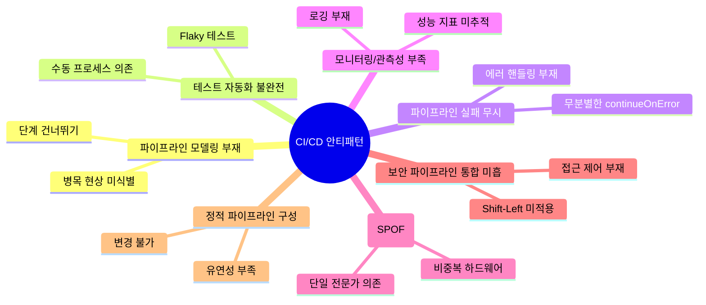

---

### 2.1 파이프라인 모델링 부재 (Lack of Proper Pipeline Modeling)

파이프라인의 명확하고 포괄적인 모델을 만들지 못하면 프로세스 가시성이 부족해지고 병목 현상을 식별할 수 없다.

#### 잘못된 파이프라인 예시

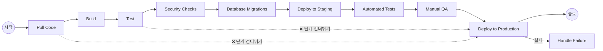

**문제점:**
- 각 단계 후 프로덕션으로 직접 배포 (중요 단계 건너뛰기)
- 실패 처리가 프로덕션 배포 후에만 발생
- 테스트되지 않거나 손상된 코드가 프로덕션에 배포될 위험

#### 해결책

| 해결 방법 | 설명 |
|-----------|------|
| **체계적 파이프라인 모델링** | 각 단계를 매핑하고 KPI 측정 (리드 타임, 프로세스 타임) |
| **엔드투엔드 가시성 확보** | 병목 현상 식별 및 제거 우선순위 지정 |
| **투자 균형** | 파이프라인 개선과 기능 개발 간 균형 유지 |

---

### 2.2 테스트 자동화 불완전 (Poor or Incomplete Automation in Testing)

#### 주요 안티패턴

| 안티패턴 | 문제점 |
|----------|--------|
| **수동 프로세스 의존** | 자동화해야 할 프로세스를 수동으로 처리 → 병목 및 오류 |
| **Flaky 테스트** | 비결정적 테스트 → False Positive/Negative 발생 |
| **테스트 스위트 미업데이트** | 애플리케이션 변경 미반영 → 새로운 이슈 미발견 |
| **E2E 테스트 과의존** | 시간 소모 및 취약성 → Unit/Integration 테스트 균형 필요 |
| **로깅/모니터링 부재** | 실패 원인 파악 불가 |

#### 잘못된 테스트 플로우

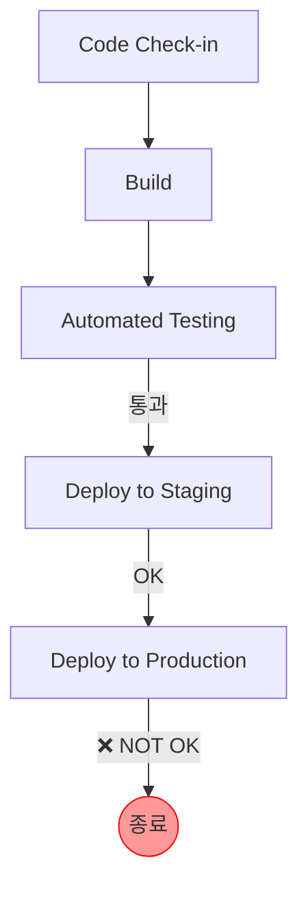

**문제점:** 프로덕션 환경에서 문제 발생 시 **롤백 메커니즘 부재**

#### 해결책: 테스트 자동화 피라미드

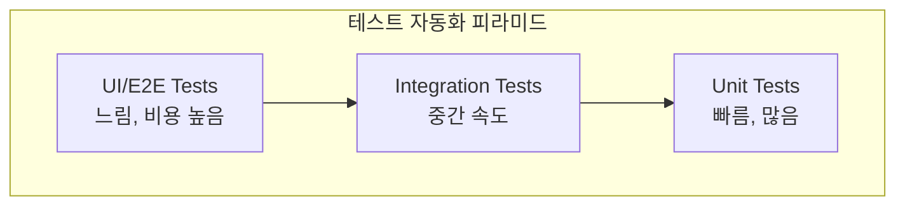

**베스트 프랙티스:**
- 포괄적인 테스트 전략 수립 (Unit → Integration → E2E 균형)
- 테스트를 애플리케이션 진화에 맞게 업데이트
- 부하/성능 테스트 정기 수행
- 조기 통합 테스트로 문제 조기 발견

---

### 2.3 파이프라인 실패 무시 (Ignoring Pipeline Failures)

파이프라인 실패 처리는 중요하지만, 비중요 단계에서는 전략적으로 무시할 수도 있다.

#### Jenkins 예시: try-catch 블록

```groovy
pipeline {
    agent any
    stages {
        stage('Build') {
            steps {
                script {
                    try {
                        sh '''
                            echo "Building..."
                            exit 1  // 의도적 실패
                        '''
                    } catch(Exception e) {
                        // 에러 캐치 후 파이프라인 계속 진행
                        echo "Build failed with error: ${e.getMessage()}"
                    }
                }
            }
        }
    }
}
```

#### Jenkins 예시: catchError 단계

```groovy
pipeline {
    agent any
    stages {
        stage('Example') {
            steps {
                catchError(buildResult: 'SUCCESS', stageResult: 'FAILURE') {
                    // 빌드 단계
                    // 실패해도 파이프라인은 계속 진행
                }
            }
        }
    }
}
```

#### Azure Pipelines 예시: continueOnError

```yaml
trigger:
- master

pool:
  vmImage: 'ubuntu-latest'

steps:
- script: echo "Building..."
  displayName: 'Build'

- script: exit 1
  displayName: 'Test'
  continueOnError: true  # 실패해도 계속 진행

- script: echo "Deploying..."
  displayName: 'Deploy'
```

**핵심:** 회복력(Resilience)과 책임성(Accountability) 간의 균형

---

### 2.4 모니터링/관측성 부족 (Poor Monitoring/Observability)

#### 발생하는 문제들

| 문제 | 결과 |
|------|------|
| **느린 배포** | 성능 버그 수정 지연 → 사용자 경험 저하 |
| **불완전한 테스트** | 테스트되지 않은 릴리스 배포 위험 |
| **제한된 테스트 커버리지** | 다양한 구성에서 성능 문제 미발견 |
| **자격 증명 관리 부실** | 보안 침해 위험 |
| **가시성 부족** | 기술 부채 누적, 비효율적 프로세스 미식별 |

#### 해결책

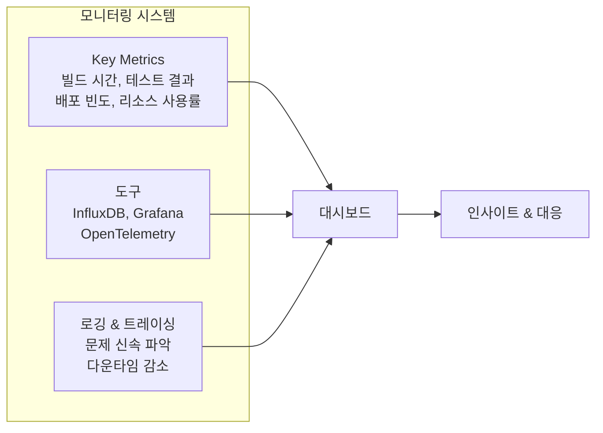

---

### 2.5 단일 장애점 (SPOF in CI/CD Infrastructure)

SPOF는 단일 구성요소 실패 시 전체 시스템이 중단될 수 있는 지점이다.

#### SPOF 유형

| 유형 | 예시 |
|------|------|
| **하드웨어** | 단일 서버, 단일 네트워크 스위치 |
| **서비스** | 단일 인터넷 서비스 제공자 |
| **인력** | 특정 전문가에 대한 과도한 의존 |
| **전문성** | 중요 애플리케이션에 대한 단일 전문가 |

#### 해결책

- **이중화(Redundancy)** 구현
- 정기적인 리뷰 수행
- 투명한 문화 조성 (SPOF 보고에 대한 두려움 제거)
- 포괄적인 비즈니스 영향 분석 및 리스크 평가

---

### 2.6 보안 파이프라인 통합 미흡 (Bad Security Pipeline Integration)

#### Shift-Left 보안 원칙

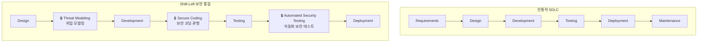

#### 주요 보안 취약점 (OWASP Top 10 기반)

| 취약점 | 설명 | 예시 |
|--------|------|------|
| **Broken Access Control** | 적절한 제한 없이 작업 수행 | 직원이 관리자 권한 접근 |
| **Cryptographic Failures** | 민감 데이터 보호 부족 | 암호화되지 않은 비밀번호 |
| **Injection** | 신뢰할 수 없는 데이터로 명령 실행 | SQL 인젝션 |
| **Insecure Design** | 효과적인 보안 제어 부재 | 입력 검증 없는 웹앱 |
| **Security Misconfiguration** | 기본 보안 설정으로 인한 취약점 | 변경되지 않은 기본 비밀번호 |
| **Outdated Components** | 오래된 소프트웨어 사용 | 패치되지 않은 서버 |
| **Authentication Failures** | 사용자 신원 확인 실패 | 약한 인증에 대한 브루트포스 공격 |
| **Software/Data Integrity Failures** | 코드/데이터 무결성 손상 | 소프트웨어 업데이트에 삽입된 멀웨어 |
| **Logging/Monitoring Failures** | 침해 탐지 부족 | 모니터링 부재로 인한 미탐지 침입 |

---

### 2.7 정적 파이프라인 구성 (Static Pipeline Configuration)

정적 파이프라인은 미리 정의되어 실행 중 변경되지 않는 구성이다.

#### 정적 파이프라인 구조

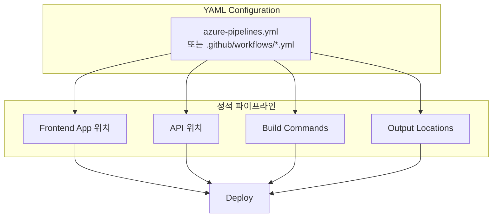

#### 왜 안티패턴인가?

| 문제점 | 영향 |
|--------|------|
| **유연성 부족** | 동적 개발 환경에 적응 어려움 |
| **수동 개입 필요** | 업데이트/수정 시 광범위한 수동 작업 |
| **병목 현상** | 전달 프로세스 지연 |
| **협업/혁신 저해** | 새로운 도구/관행 통합 어려움 |

**해결책:** 프로젝트 요구에 따라 진화할 수 있는 **동적 구성** 채택

---

### 3. 최적의 설계 패턴 선택 - 고려사항

#### 패턴 선택 시 고려 요소

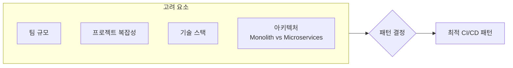

#### 주요 설계 패턴 비교

| 패턴 | 장점 | 고려사항 |
|------|------|----------|
| **Pipeline as Code** | 투명성, 버전 관리, 재현성 | 스크립트 언어 숙련도 필요 |
| **Immutable Infrastructure** | 환경 일관성, 롤백 간소화 | 높은 초기 설정 비용 |
| **Microservices** | 민첩성, 확장성, 장애 격리 | 서비스 관리 복잡성 증가 |
| **IaC** | 배포 가속화, 추적성, 일관성 | 도구 투자 필요 (Terraform 등) |
| **Blue-Green Deployment** | 다운타임 최소화, 롤백 간소화 | 인프라 이중화 비용 |
| **Canary Releases** | 위험 감소, 조기 문제 발견 | 상세 모니터링 필요 |
| **Automated Testing** | 코드 품질 보장, 빠른 피드백 | 테스트 스크립트 유지보수 |
| **Continuous Feedback** | 지속적 개선, 고품질 배포 | 포괄적 모니터링 메커니즘 필요 |
| **GitOps** | 단일 소스, 감사 가능성 | Git 및 CI/CD 도구 통합 지식 필요 |

#### Monorepo vs Polyrepo

| 구분 | Monorepo | Polyrepo |
|------|----------|----------|
| **정의** | 단일 저장소에 여러 프로젝트 | 프로젝트별 별도 저장소 |
| **장점** | 의존성 관리 간소화, 일관된 워크플로우 | 변경 격리, 소규모 팀에 적합 |
| **고려사항** | 대규모 코드베이스에서 복잡해질 수 있음 | 의존성 관리 어려움, 크로스 레포 조율 필요 |

---

### 4. CI/CD 설계 패턴과 플랫폼 엔지니어링

플랫폼 엔지니어링은 CI/CD를 보완하여 **전체 소프트웨어 개발 라이프사이클을 지원**하는 견고한 기반을 구축한다.

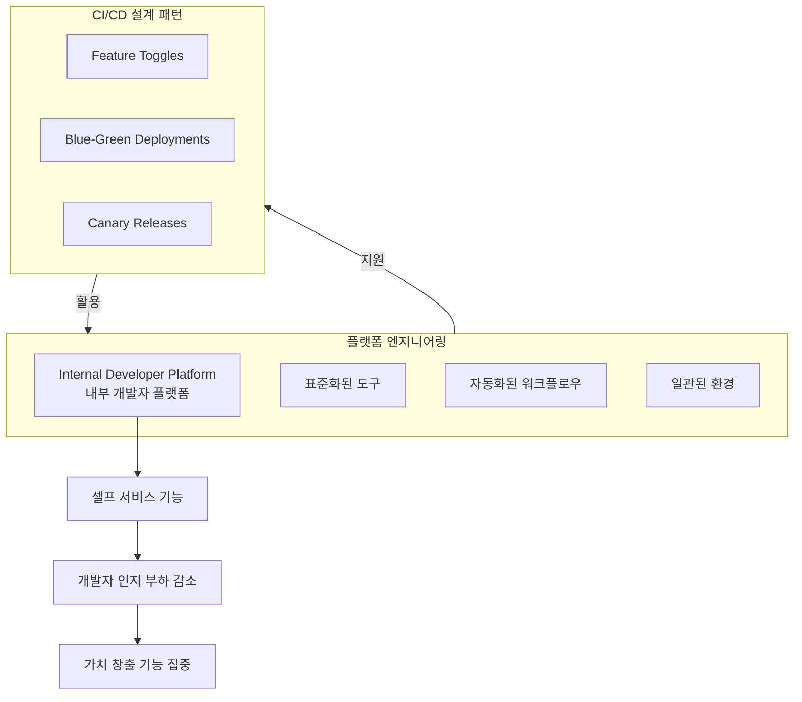

#### 시너지 효과

| CI/CD 설계 패턴 | 플랫폼 엔지니어링 기여 |
|-----------------|------------------------|
| 코드 변경 통합/배포 프로세스 간소화 | 기반 인프라와 도구 최적화 |
| 위험 관리 및 다운타임 감소 | 셀프 서비스 기능으로 개발자 생산성 향상 |
| 자동화된 파이프라인 구축 | 일관된 환경 및 표준화된 도구 제공 |

---

### 5. 케이스 스터디: 플랫폼 엔지니어링에서의 CI/CD 통합

#### 배경
중간 규모 소프트웨어 개발 회사가 배포 빈도와 소프트웨어 릴리스 품질 향상을 추구. 수동 프로세스의 오류 가능성과 시간 소모가 문제였다.

#### 적용된 설계 패턴

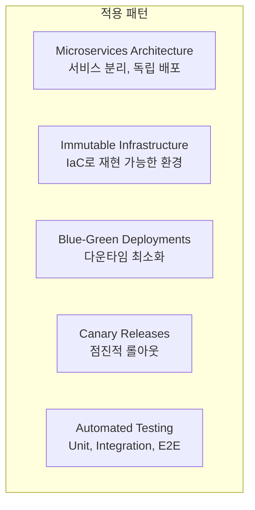

#### 아키텍처 다이어그램

```mermaid
flowchart TB
    subgraph CICD["CI/CD Pipeline"]
        SC[Source Control<br/>Git]
        BA[Build Automation<br/>빌드 자동화]
        AT[Automated Testing<br/>테스트 자동화]
        DA[Deployment Automation<br/>배포 자동화]
        ML[Monitoring & Logging<br/>모니터링 & 로깅]
    end

    subgraph Arch["Architecture"]
        MS[Microservices]
        GW[API Gateway]
        LB[Load Balancer]
        SD[Service Discovery]
    end

    subgraph Infra["Infrastructure"]
        IAC[Infrastructure as Code]
        CONT[Containerization<br/>Docker]
        BGDEP[Blue-Green Deployments]
        CAN[Canary Releases]
    end

    SC --> BA --> AT --> DA --> ML
    MS --> GW --> LB
    LB --> SD
    IAC --> CONT --> BGDEP --> CAN
```

#### 회피한 안티패턴

| 안티패턴 | 회피 방법 |
|----------|-----------|
| **Big Bang Deployments** | 작고 빈번한 배포로 전환 |
| **Manual Gates** | 자동화로 수동 승인 프로세스 최소화 |
| **Configuration Drift** | IaC와 컨테이너화로 환경 일관성 유지 |
| **E2E 테스트 과의존** | Unit/Integration 테스트 균형 |

#### 결과

| 지표 | 개선 |
|------|------|
| **Time to Market** | 50% 감소 |
| **배포 빈도** | 격주 → 하루 여러 번 |
| **배포 실패** | 현저히 감소 |
| **개발자 시간** | 기능 개발에 집중 가능 |

---

## 🔍 심화 학습

### 추가 조사 내용

- **Platform Engineering Maturity Model**: 플랫폼 엔지니어링의 성숙도를 평가하는 프레임워크
- **Internal Developer Platform (IDP)**: Backstage, Port, Humanitec 등의 플랫폼
- **DORA Metrics**: 배포 빈도, 리드 타임, 변경 실패율, 복구 시간 측정

### 관련 도구

| 카테고리 | 도구 |
|----------|------|
| **테스트 자동화** | Selenium, TestComplete, Appium, Cypress |
| **모니터링** | InfluxDB, Grafana, OpenTelemetry, Prometheus |
| **IaC** | Terraform, AWS CloudFormation, Pulumi |
| **컨테이너** | Docker, Kubernetes, Podman |
| **IDP** | Backstage, Port, Humanitec |

### 출처
- [OWASP Top 10](https://owasp.org/www-project-top-ten/)
- [The Test Automation Pyramid](https://martinfowler.com/articles/practical-test-pyramid.html)
- [Platform Engineering on Kubernetes](https://platformengineering.org/)

---

## 💡 실무 적용 포인트

### 이런 상황에서 주의하세요
- **파이프라인 단계 건너뛰기**: 빠른 배포를 위해 테스트 단계를 건너뛰는 유혹
- **E2E 테스트만 의존**: 느리고 취약한 테스트로 인한 피드백 지연
- **수동 승인 병목**: 자동화할 수 있는 게이트를 수동으로 처리
- **단일 전문가 의존**: 핵심 시스템에 대한 지식이 한 사람에게 집중

### 주의할 점 / 흔한 실수
- ⚠️ `continueOnError`를 무분별하게 사용하면 실패가 묻힐 수 있음
- ⚠️ 정적 파이프라인은 초기에 편리하지만 장기적으로 유연성 저하
- ⚠️ 보안 검사를 배포 후에 수행하면 이미 늦음 (Shift-Left 적용)
- ⚠️ 테스트 스위트를 애플리케이션 변경에 맞게 업데이트하지 않으면 무의미
- ⚠️ 모니터링 없이 자동화만 하면 문제 원인 파악 불가

### 면접에서 나올 수 있는 질문
- Q: CI/CD에서 안티패턴이란 무엇이며, 왜 인식해야 하는가?
- Q: 파이프라인 실패를 무시할 수 있는 경우와 무시해서는 안 되는 경우는?
- Q: Shift-Left 보안이란 무엇이며, CI/CD 파이프라인에 어떻게 적용하는가?
- Q: Monorepo와 Polyrepo의 장단점을 비교하시오.
- Q: 플랫폼 엔지니어링과 CI/CD 설계 패턴의 관계를 설명하시오.
- Q: 테스트 자동화 피라미드란 무엇이며, 왜 중요한가?

---

## ✅ 핵심 개념 체크리스트
- [ ] 안티패턴의 정의와 논의해야 하는 6가지 이유를 설명할 수 있는가?
- [ ] CI/CD의 7가지 주요 안티패턴을 나열하고 각각의 해결책을 제시할 수 있는가?
- [ ] Jenkins의 try-catch, catchError와 Azure의 continueOnError 사용법을 알고 있는가?
- [ ] Shift-Left 보안 원칙과 OWASP Top 10 취약점을 이해하고 있는가?
- [ ] 테스트 자동화 피라미드의 구조와 목적을 설명할 수 있는가?
- [ ] 정적 파이프라인 구성이 안티패턴인 이유를 설명할 수 있는가?
- [ ] 프로젝트에 맞는 설계 패턴 선택 시 고려해야 할 요소를 알고 있는가?
- [ ] 플랫폼 엔지니어링과 CI/CD의 시너지를 설명할 수 있는가?

---

## 🔗 참고 자료
- 📄 OWASP: [Top 10 Web Application Security Risks](https://owasp.org/www-project-top-ten/)
- 📄 Martin Fowler: [The Practical Test Pyramid](https://martinfowler.com/articles/practical-test-pyramid.html)
- 📄 Jenkins: [Pipeline Syntax](https://www.jenkins.io/doc/book/pipeline/syntax/)
- 📄 Azure DevOps: [YAML Schema Reference](https://docs.microsoft.com/en-us/azure/devops/pipelines/yaml-schema)
- 📄 Platform Engineering: [What is Platform Engineering?](https://platformengineering.org/blog/what-is-platform-engineering)
- 📚 연관 서적: "Team Topologies" (Matthew Skelton, Manuel Pais)

---
