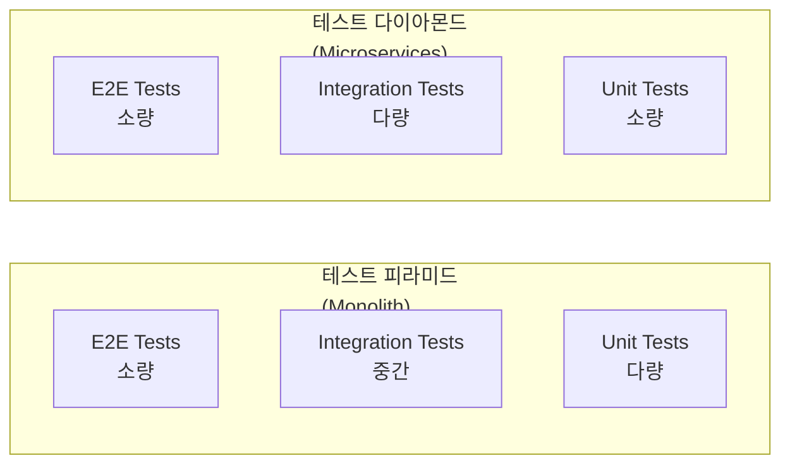
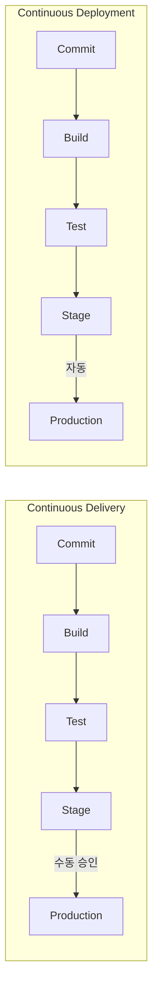
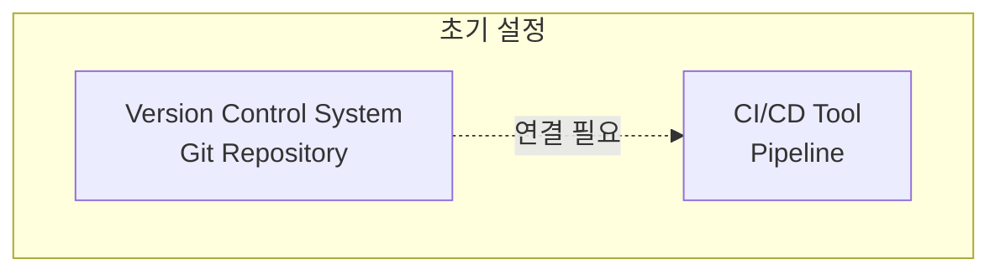
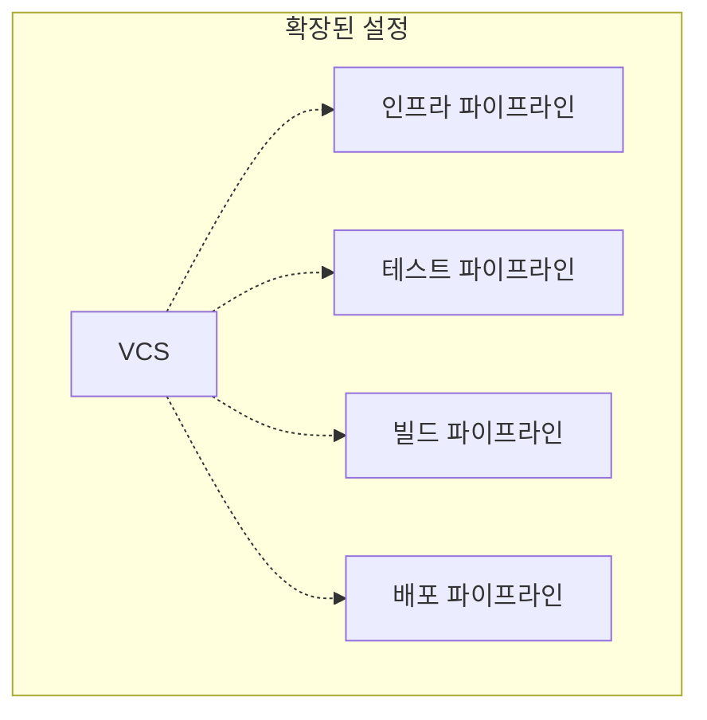
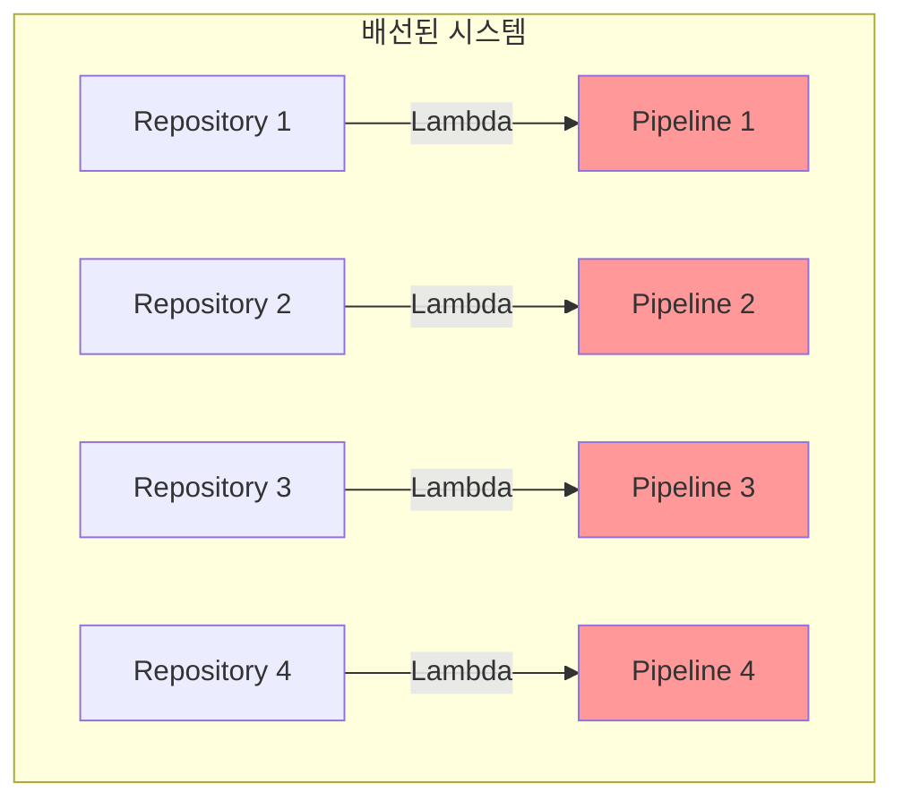
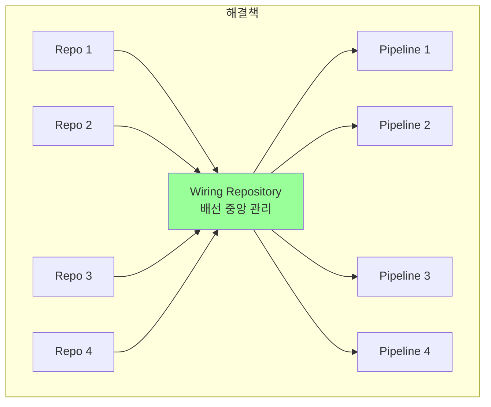
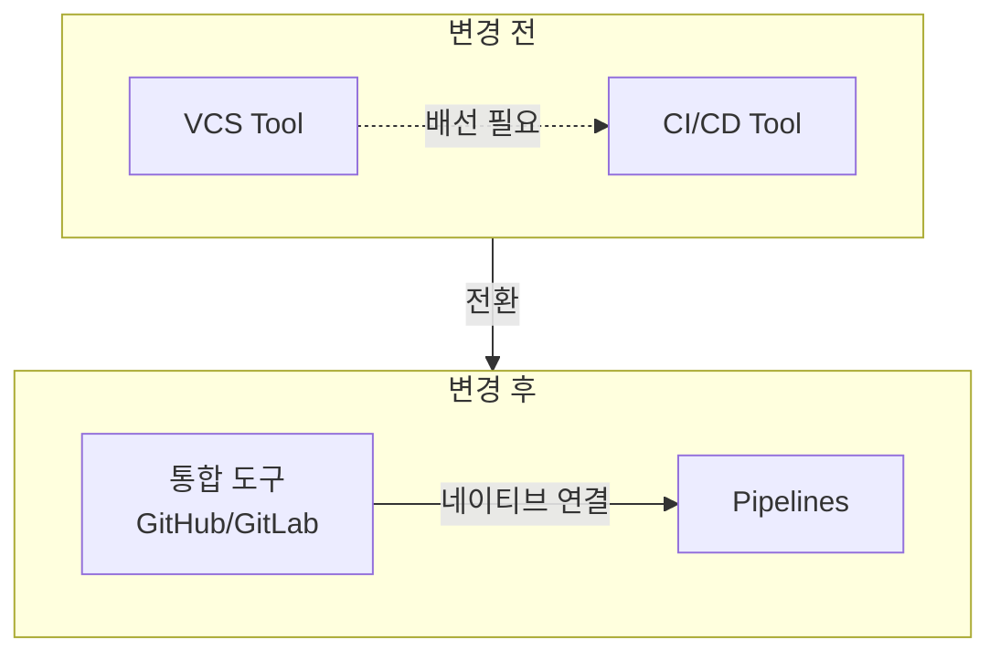
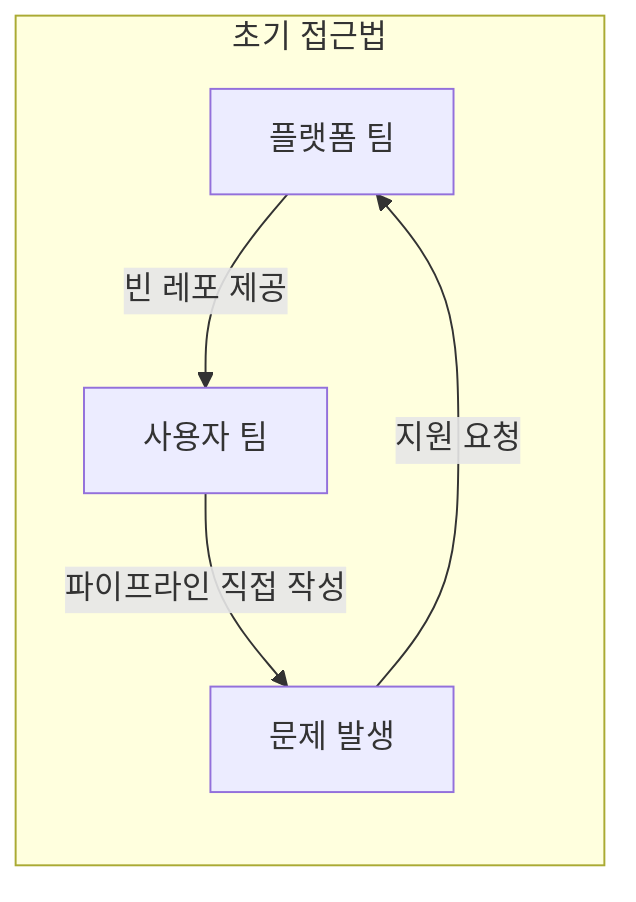
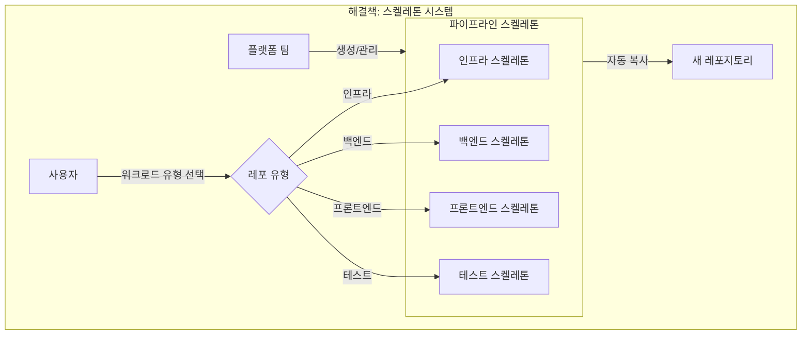
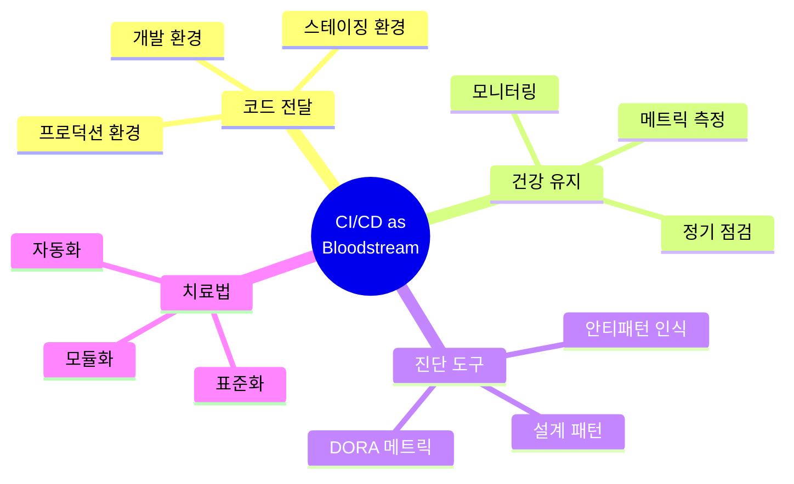

---

## 📌 핵심 요약
> 이 장은 책의 마지막 부분으로, **15개의 퀴즈를 통한 지식 점검**과 **3가지 실제 케이스 스터디**를 제공한다. 핵심은 책 전체 내용을 복습하고, 실제 조직에서 CI/CD 설계 패턴을 적용할 때 발생하는 문제와 해결책을 이해하는 것이다.

## 🎯 학습 목표
이 내용을 읽고 나면:
- [ ] 책에서 다룬 CI/CD 설계 패턴의 핵심 개념을 퀴즈로 점검할 수 있다
- [ ] 각 퀴즈 답안과 해당 챕터 참조를 통해 부족한 부분을 파악할 수 있다
- [ ] VCS와 CI/CD 도구 연결의 복잡성과 해결책을 이해할 수 있다
- [ ] 플랫폼 팀의 역할과 표준화의 중요성을 설명할 수 있다
- [ ] CI/CD를 단순한 파이프라인이 아닌 전달 시스템의 핵심 요소로 인식할 수 있다

## 📖 본문 정리

### 1. 지식 테스트 (Knowledge Test)

책 전체 내용을 복습하는 15개의 퀴즈와 정답입니다.

#### 퀴즈 및 정답

| # | 질문 | 정답 | 참조 챕터 |
|---|------|------|-----------|
| 1 | 설계 패턴(Design Pattern)이란? | **일반적이고 재사용 가능한 공통 문제 해결책으로, 해당 유형의 문제 해결을 위한 베스트 프랙티스** | Ch.1 - An overview of design patterns |
| 2 | 올바른 빌드 사이클 순서는? | **Initializing → Compiling → Testing → Packaging → Reviewing** | Ch.1 - The build cycle |
| 3 | 마이크로서비스에서 테스트 다이아몬드가 더 나은 선택인 이유는? | **마이크로서비스 간 통합 테스트에 집중하기 때문** | Ch.1 - Implementing testing in CI/CD |
| 4 | CI/CD 파이프라인의 단계는? | **Source Control → Build → Test → Deploy → Release** | Ch.3 - What are the components of a CI/CD pipeline? |
| 5 | Continuous Delivery와 Continuous Deployment의 차이는? | **CD(Deployment)는 프로덕션까지 완전 자동화, CD(Delivery)는 수동 단계(테스트, 승인) 포함** | Ch.4 - A decade of action using CI/CD patterns |
| 6 | GitOps란? | **코드를 푸시하는 것에서 풀(Pull)하는 것으로 모델을 변경한 전달 접근법** | Ch.4 - A decade of action using CI/CD patterns |
| 7 | DORA 메트릭은 몇 개인가? | **5개** (원래 4개였으나 최근 1개 추가) | Ch.4 - Introduction to CI/CD measurements |
| 8 | "모놀리식 파이프라인"의 의미는? | **서로 다른 트리거가 하나의 파이프라인에 유지되며 논리적으로 분리됨** | Ch.5 - Design examples for monorepo and polyrepo |
| 9 | CI에서 트렁크(Trunk)란? | **리포지토리의 메인 브랜치** | Ch.5 - Key components – tools, code, and modularity |
| 10 | 어댑터 패턴(Adapter Pattern)은? | **구조적 패턴 (Structural Pattern)** | Ch.1 - Structural patterns |
| 11 | DDD(Domain-Driven Design)가 CI/CD 설계와 관련이 있는가? | **예 (Yes)** | Ch.8 |
| 12 | 클라우드 네이티브 생태계의 3가지 핵심 구성요소는? | **컨테이너화, 마이크로서비스, 서버리스** | Ch.9 - Key components |
| 13 | IaC에서 싱글톤으로 취급될 수 있는 예시는? | **Terraform의 모듈 정의** | Ch.10 - Singletons in clouds |
| 14 | Blue-Green 배포의 가장 큰 단점은? | **인프라 이중화** | Ch.10 - Blue-green deployment strategy |
| 15 | 조직이 SonarQube를 CI/CD에 사용해야 하는 이유는? | **보안 및 품질 게이트를 활용한 Shift-Left 접근법** | Ch.11 - Implementing audit points with quality gates |

---

### 2. 퀴즈 상세 해설

#### Q1: 설계 패턴의 정의

```
❌ 틀린 답:
- "특정적이고(specific)" 재사용 가능한 솔루션 → "일반적인(general)"이 맞음
- "모든 유형의 문제"를 해결 → "해당 유형의 문제"가 맞음

✅ 정답:
일반적이고 재사용 가능한 공통 문제 해결책으로,
해당 유형의 문제 해결을 위한 베스트 프랙티스를 나타냄
```

#### Q3: 테스트 다이아몬드 vs 테스트 피라미드



**마이크로서비스에서 테스트 다이아몬드가 적합한 이유:**
- 서비스 간 통합이 핵심 복잡성
- 개별 서비스의 단위 테스트보다 **서비스 간 상호작용** 테스트가 중요
- E2E 테스트는 여전히 제한적으로 유지

#### Q5: Continuous Delivery vs Continuous Deployment



#### Q7: DORA 메트릭 5가지

| 메트릭 | 설명 |
|--------|------|
| **Deployment Frequency** | 프로덕션 배포 빈도 |
| **Lead Time for Changes** | 커밋에서 프로덕션까지 시간 |
| **Change Failure Rate** | 배포 실패율 |
| **Time to Restore Service** | 서비스 복구 시간 |
| **Reliability** | 신뢰성 (최근 추가) |

---

### 3. 케이스 스터디

#### Case 1: 불필요한 "배선(Wiring)" 개선

**상황:** 조직이 특정 도구에 대한 강한 의견을 가지고 VCS와 CI/CD 도구를 별도로 선택

##### 초기 상태



##### 문제 발생 - 추가 파이프라인 필요



##### 배선(Wiring) 구현



**문제점:**
- 각 레포지토리마다 별도의 연결 구조 (AWS Lambda 등) 필요
- 유지보수 및 확장의 어려움
- 일관성 부재

##### 해결책: 모듈화



**개선 효과:**
- 모듈화, 자동화, 배선 제어 향상
- 중앙 집중식 관리로 유지보수 용이

---

#### Case 2: 잘못된 결정 수정

**상황:** Case 1의 프로젝트에서 추가 분석을 통해 근본적인 문제 파악

##### 발견된 문제점

| 문제 | 설명 |
|------|------|
| **연결 끊김 (Disconnection)** | VCS와 CI/CD 간 정보 흐름 불가, 배선으로도 완전 해결 안 됨 |
| **데이터 누락 (Missing Data)** | 모니터링은 가능하나 **측정(Measure)** 불가, DORA 데이터 수집 불가 |
| **추가 유지보수 부담** | 배선이 불안정하여 실패 빈번, 문제 파악 및 수정에 과도한 시간 소요 |

##### 해결책: 도구 통합



**개선 효과:**
- 배선 부담 제거
- 적절한 메트릭 수집 가능
- 유지보수 시간 최소화

---

#### Case 3: 플랫폼 팀 수용

**상황:** 조직이 플랫폼 팀을 만들고 CI/CD 파이프라인 책임을 부여

##### 초기 접근법의 문제



**발생한 문제:**
- 파이프라인 작성 능력 부족한 사용자
- 복잡한 에러 해결 요청 쇄도
- 플랫폼 팀이 본연의 업무(플랫폼 관리/개발) 수행 불가

##### 해결책: 모듈화 및 표준화



##### 표준화 요소

| 요소 | 설명 |
|------|------|
| **파이프라인 스켈레톤** | 워크로드 유형별 미리 구성된 템플릿 |
| **품질 게이트** | IaC 검사, SonarQube, SBOM 생성 |
| **중앙 아티팩트 저장소** | 일관된 아티팩트 관리 |
| **업데이트 알림** | 스켈레톤 업데이트 시 사용자에게 알림 |

**개선 효과:**
- 표준화된 프로세스
- 완전한 제어 및 감사 가능한 프로세스
- 플랫폼 팀의 본연 업무 집중 가능

---

### 4. 책의 핵심 메시지

> 💬 **비유**: CI/CD를 인체로 비유하면, CI/CD는 **혈류 시스템**과 같다. 혈액(코드)을 신체의 모든 부분(환경)에 전달하는 기능을 한다. 따라서 CI/CD를 건강한 상태로 유지하고 정기적인 점검을 해야 한다.



#### 책에서 배운 핵심 역량

| 역량 | 설명 |
|------|------|
| **설계 패턴 적용** | 다양한 CI/CD 설계 패턴을 상황에 맞게 적용 |
| **시스템 확장** | 조직 성장에 맞춰 CI/CD 시스템 확장 |
| **채택 및 트렌드 측정** | DORA 등 메트릭을 통한 성과 측정 |
| **미래 리스크 예방** | 안티패턴 인식을 통한 장기적 문제 예방 |

---

## 🔍 심화 학습

### 챕터별 핵심 개념 요약

| 챕터 | 핵심 개념 |
|------|-----------|
| **Ch.1** | 설계 패턴 개요, 빌드 사이클, 테스트 피라미드 |
| **Ch.3** | CI/CD 파이프라인 구성요소 |
| **Ch.4** | CI/CD 역사, GitOps, DORA 메트릭 |
| **Ch.5** | Monorepo/Polyrepo, 트렁크 기반 개발 |
| **Ch.8** | DDD와 CI/CD |
| **Ch.9** | 클라우드 네이티브 (컨테이너, 마이크로서비스, 서버리스) |
| **Ch.10** | 배포 전략 (Blue-Green, Canary), 싱글톤 패턴 |
| **Ch.11** | 감사, 품질 게이트, SonarQube |
| **Ch.12** | 자가 학습 CI/CD, 생성형 AI 통합 |
| **Ch.13** | 안티패턴, 플랫폼 엔지니어링 |

### 출처
- [DORA State of DevOps Report](https://dora.dev/)
- [Martin Fowler - CI/CD](https://martinfowler.com/articles/continuousIntegration.html)
- [Platform Engineering Maturity Model](https://platformengineering.org/)

---

## 💡 실무 적용 포인트

### 퀴즈에서 얻은 인사이트

| 주제 | 핵심 인사이트 |
|------|---------------|
| **테스트 전략** | 마이크로서비스에서는 통합 테스트에 더 집중 (테스트 다이아몬드) |
| **CD 구분** | Delivery는 수동 단계 포함, Deployment는 완전 자동화 |
| **DORA** | 5개 메트릭으로 DevOps 성과 측정 |
| **싱글톤** | Terraform 모듈로 재사용 가능한 표준화된 리소스 정의 |
| **품질 게이트** | SonarQube로 Shift-Left 보안 구현 |

### 케이스 스터디에서 얻은 교훈

| 케이스 | 핵심 교훈 |
|--------|-----------|
| **Case 1** | 분리된 도구 간 배선은 모듈화로 관리 |
| **Case 2** | 근본적 문제 해결을 위해 도구 통합 고려 |
| **Case 3** | 플랫폼 팀은 스켈레톤과 표준화로 확장 |

### 면접에서 나올 수 있는 질문
- Q: Continuous Delivery와 Continuous Deployment의 차이점은?
- Q: DORA 메트릭 5가지를 설명하시오.
- Q: 마이크로서비스에서 테스트 다이아몬드가 테스트 피라미드보다 적합한 이유는?
- Q: GitOps의 핵심 원칙은 무엇인가?
- Q: 플랫폼 팀이 CI/CD 파이프라인을 표준화하는 방법은?
- Q: CI/CD를 단순한 파이프라인이 아닌 전달 시스템으로 봐야 하는 이유는?

---

## ✅ 핵심 개념 체크리스트

### 퀴즈 기반 자가 점검
- [ ] 설계 패턴의 정의를 한 문장으로 설명할 수 있는가?
- [ ] 올바른 빌드 사이클 순서를 알고 있는가?
- [ ] 테스트 다이아몬드와 테스트 피라미드의 차이를 설명할 수 있는가?
- [ ] CI/CD 파이프라인의 5단계를 나열할 수 있는가?
- [ ] Continuous Delivery와 Continuous Deployment를 구분할 수 있는가?
- [ ] GitOps의 핵심 개념(Pull-based)을 설명할 수 있는가?
- [ ] DORA 메트릭 5가지를 알고 있는가?
- [ ] 모놀리식 파이프라인의 의미를 설명할 수 있는가?
- [ ] 트렁크 기반 개발의 "트렁크"가 무엇인지 알고 있는가?
- [ ] 클라우드 네이티브의 3가지 핵심 구성요소를 알고 있는가?
- [ ] Blue-Green 배포의 장단점을 알고 있는가?
- [ ] SonarQube가 Shift-Left에 기여하는 방법을 설명할 수 있는가?

### 케이스 스터디 기반 자가 점검
- [ ] VCS와 CI/CD 도구 분리 시 발생하는 "배선" 문제를 이해했는가?
- [ ] 도구 통합의 이점(메트릭 수집, 유지보수 감소)을 설명할 수 있는가?
- [ ] 플랫폼 팀의 스켈레톤 전략을 이해하고 있는가?
- [ ] CI/CD를 "혈류 시스템"으로 비유한 의미를 이해했는가?

---

## 🔗 참고 자료
- 📄 DORA: [State of DevOps Report](https://dora.dev/)
- 📄 Martin Fowler: [Continuous Integration](https://martinfowler.com/articles/continuousIntegration.html)
- 📄 Atlassian: [Continuous Delivery vs Continuous Deployment](https://www.atlassian.com/continuous-delivery/principles/continuous-integration-vs-delivery-vs-deployment)
- 📄 GitOps: [OpenGitOps Principles](https://opengitops.dev/)
- 📄 SonarQube: [Quality Gates Documentation](https://docs.sonarqube.org/latest/user-guide/quality-gates/)
- 📚 연관 서적: "Accelerate" (Nicole Forsgren, Jez Humble, Gene Kim)

---

## 📚 전체 책 요약

### Part별 핵심 내용

| Part | 챕터 | 핵심 주제 |
|------|------|-----------|
| **Part 1** | Ch 1-2 | CI/CD 기초, 설계 패턴 개요, 빌드 사이클 |
| **Part 2** | Ch 3-6 | 파이프라인 구성요소, 측정, Monorepo/Polyrepo |
| **Part 3** | Ch 7-8 | 조직 설계, DDD와 CI/CD |
| **Part 4** | Ch 9-11 | 클라우드 네이티브, 배포 전략, 감사 |
| **Part 5** | Ch 12-13 | AI 통합, 안티패턴, 플랫폼 엔지니어링 |
| **Appendix** | Ch 14 | 지식 테스트, 케이스 스터디 |

### 책의 핵심 메시지

```
CI/CD ≠ 단순한 파이프라인
CI/CD = 전달 시스템의 핵심 요소 (혈류 시스템)

목표:
1. 파이프라인뿐 아니라 전체 전달 프로세스 개선
2. 문제 발생 시 기대 결과를 희생하지 않고 해결책 찾기
3. 오늘뿐 아니라 미래의 리스크도 예방
```

---
