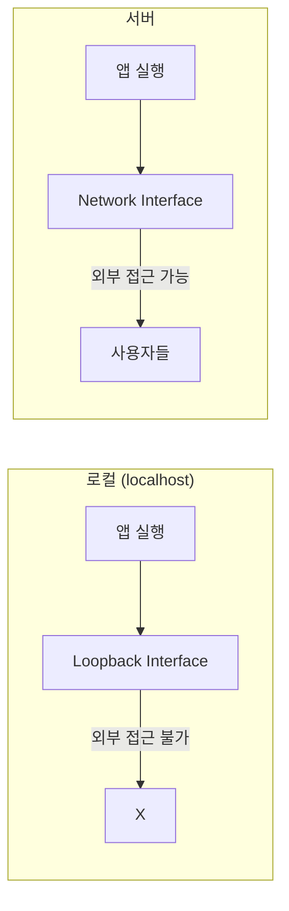
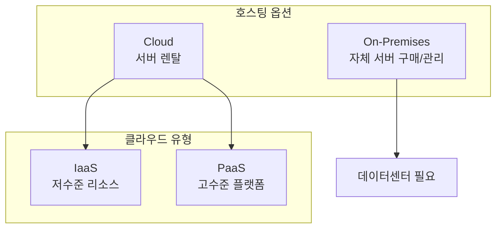
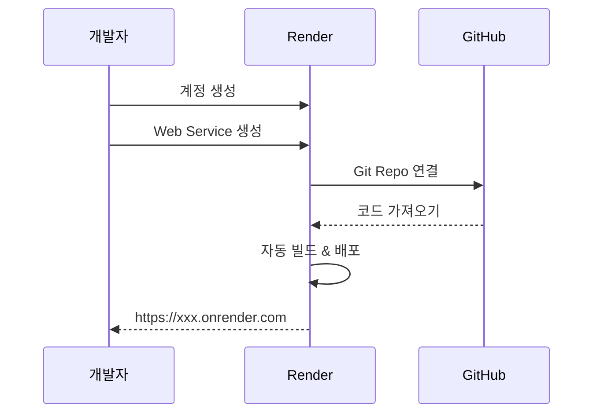
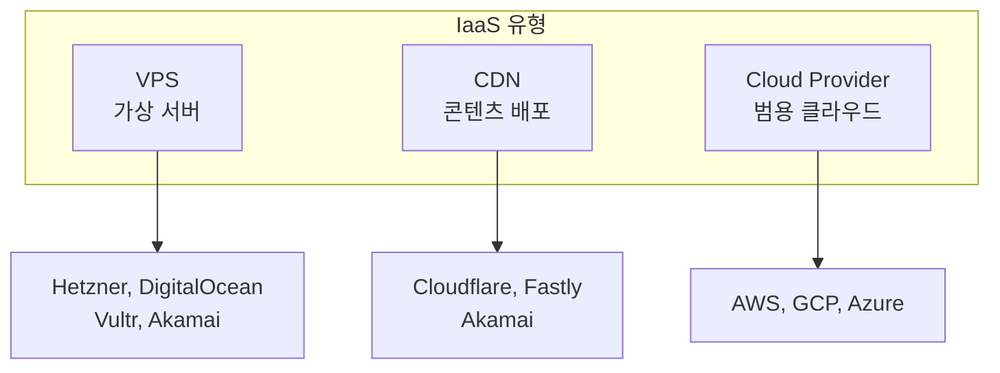
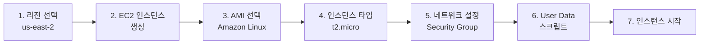
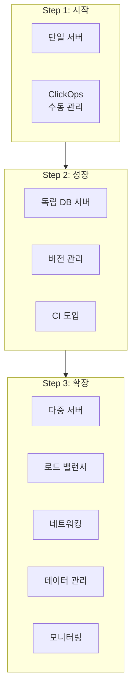
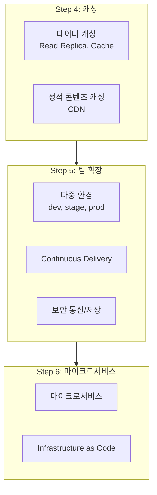
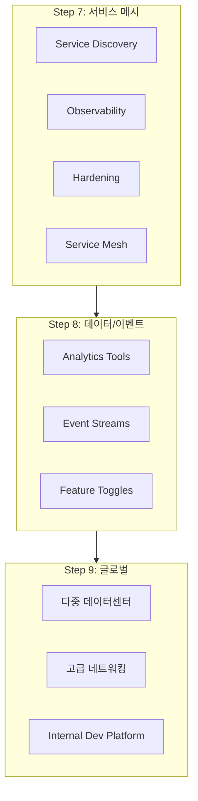
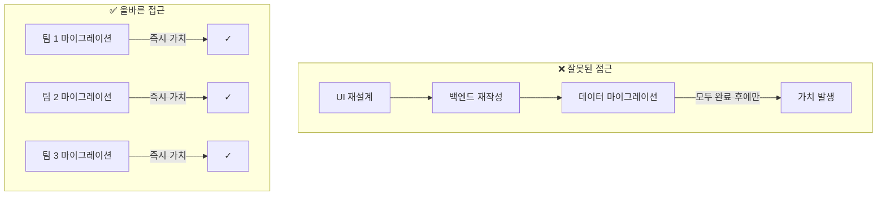
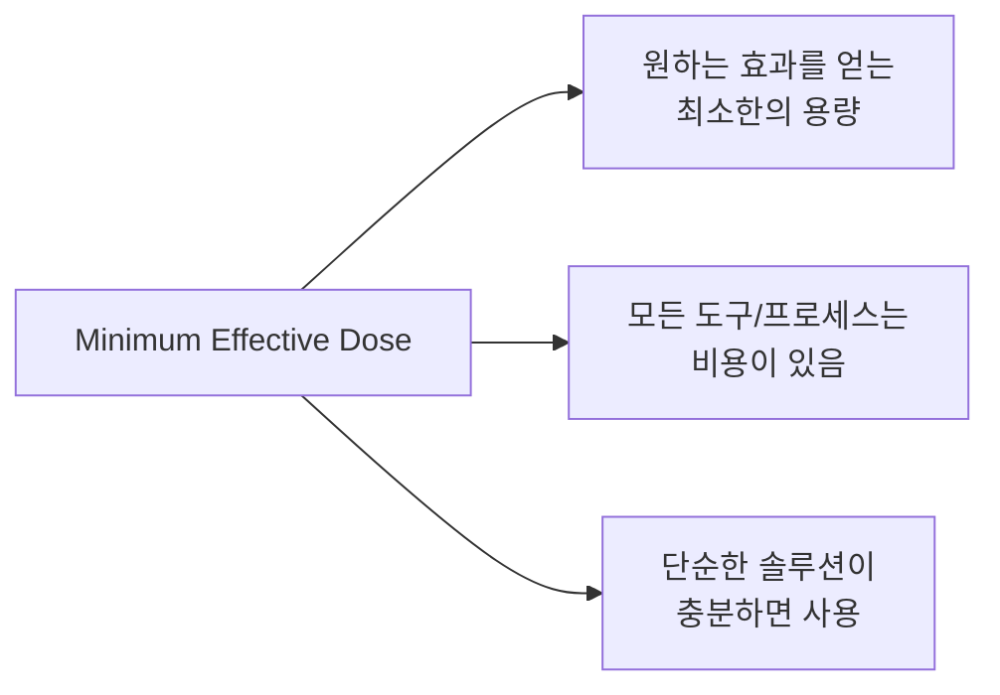

# Chapter 1: How to Deploy Your App (앱 배포 방법)

## 📌 핵심 요약

> **"앱을 배포하려면 개인 컴퓨터가 아닌 서버에서 실행해야 한다. 클라우드를 기본으로 선택하고, PaaS로 시작하여 필요할 때만 IaaS로 전환하라. DevOps는 점진적으로 도입하며, 각 단계가 독립적인 가치를 제공해야 한다. 항상 'Minimum Effective Dose'를 추구하라."**

이 챕터에서는 앱 배포의 기본 개념과 On-prem, Cloud, PaaS, IaaS의 차이점을 학습한다.

---

## 🎯 학습 목표

이 챕터를 완료하면 다음을 할 수 있다:

- [ ] 로컬에서 앱 실행과 서버 배포의 차이 이해
- [ ] On-prem과 Cloud 호스팅 비교
- [ ] PaaS(Render)를 통한 앱 배포
- [ ] IaaS(AWS EC2)를 통한 앱 배포
- [ ] DevOps 진화 9단계 이해
- [ ] 점진적 DevOps 도입 전략

---

## 📖 본문 정리

### 1.1 로컬 배포 vs 서버 배포

#### localhost의 한계



#### 개인 컴퓨터 vs 서버

| 특성 | 개인 컴퓨터 | 서버 |
|------|-------------|------|
| **보안** | 다양한 소프트웨어, 하드닝 안됨 | 최소 OS, 방화벽, 침입 방지 |
| **가용성** | 언제든 꺼질 수 있음 | 24/7 운영, 이중화 전원 |
| **성능** | 다른 작업으로 영향 받음 | 앱 전용 리소스 |
| **협업** | 개인 접근만 가능 | 팀 접근 설계 |

> **Key Takeaway 1**: 개인 컴퓨터에서 실행 중인 앱을 외부에 노출하지 마라.

---

### 1.2 On-prem vs Cloud

#### 호스팅 옵션 비교



#### Cloud의 7가지 장점

| 장점 | 설명 |
|------|------|
| **탄력성 & Pay-as-you-go** | 사용량에 따른 비용, 탄력적 스케일링 |
| **속도** | 몇 주 → 몇 분으로 단축 |
| **유지보수 & 전문성** | 하드웨어, 냉각, 전력 관리 위탁 |
| **관리형 서비스** | DB, 로드밸런서, ML 등 제공 |
| **보안** | 143개 보안 표준 준수 (PCI, HIPAA, NIST) |
| **글로벌 도달** | 전 세계 수십 개 데이터센터 |
| **스케일** | AWS 2024년 $1,070억 매출 |

> **Key Takeaway 2**: 대부분의 새 배포에서 클라우드를 기본 선택으로 사용하라.

#### On-prem이 적합한 경우

- 이미 잘 작동하는 데이터센터 보유
- 탄력성이 필요 없는 안정적 트래픽 패턴
- 클라우드에 아직 적응하지 않은 규정/준수 요건
- 가격 통제 필요성

---

### 1.3 PaaS (Platform as a Service)

#### Render를 통한 배포 예시



#### PaaS 제공 기능 (Out of the Box)

```
✅ 다중 서버 스케일링
✅ 도메인 이름 (<NAME>.onrender.com)
✅ 암호화 (HTTPS)
✅ 모니터링 (로그, 메트릭)
✅ 자동 빌드 & 배포
```

#### PaaS 장단점

| 장점 | 단점 |
|------|------|
| 빠른 시작 (분 단위) | 디버깅 어려움 (블랙박스) |
| 많은 기능 Out of the Box | 제한된 앱 유형/아키텍처 |
| 운영 부담 최소화 | 하드웨어 접근 제한 |
| 마법처럼 작동 | 마법이 깨지면 수정 어려움 |

---

### 1.4 IaaS (Infrastructure as a Service)

#### IaaS 3가지 유형



#### AWS EC2 배포 단계



#### User Data 스크립트 예시

```bash
#!/usr/bin/env bash
set -e

# Node.js 설치
tee /etc/yum.repos.d/nodesource-nodejs.repo > /dev/null <<EOF
[nodesource-nodejs]
baseurl=https://rpm.nodesource.com/pub_23.x/nodistro/nodejs/x86_64
gpgkey=https://rpm.nodesource.com/gpgkey/ns-operations-public.key
EOF
yum install -y nodejs

# 앱 코드 작성
tee app.js > /dev/null << "EOF"
const http = require('http');
const server = http.createServer((req, res) => {
  res.writeHead(200, { 'Content-Type': 'text/plain' });
  res.end('Hello, World!\n');
});
const port = process.env.PORT || 80;
server.listen(port, () => {
  console.log(`Listening on port ${port}`);
});
EOF

# 앱 실행
nohup node app.js &
```

#### ⚠️ 예제의 문제점과 개선 방향

| 문제 | 예제 | 개선 방향 |
|------|------|-----------|
| Root 사용자 | root로 앱 실행 | 제한된 권한의 별도 사용자 |
| Port 80 | root 권한 필요 | 1024 이상 포트 사용 |
| User Data 한계 | 16KB 제한 | 구성 관리 도구 사용 |
| 프로세스 관리 | 재시작 없음 | Process Supervisor 사용 |
| Node.js 설정 | 단일 프로세스, 개발 모드 | CPU당 프로세스, 프로덕션 모드 |

---

### 1.5 PaaS vs IaaS 비교

> **Key Takeaway 3**: 회사 요구사항을 충족하면서 소프트웨어 딜리버리에 가능한 한 적은 시간을 투자하라.

> **Key Takeaway 4**: 가능하면 PaaS를 사용하고, 필요할 때만 IaaS로 전환하라.

#### 선택 가이드

| 상황 | PaaS | IaaS |
|------|:----:|:----:|
| 사이드 프로젝트 | ✅ | |
| 스타트업/소규모 회사 | ✅ | |
| 새로운/실험적 프로젝트 | ✅ | |
| 높은 트래픽/부하 | | ✅ |
| 대규모 팀 (수백 명) | | ✅ |
| 높은 가용성 요구 | | ✅ |
| 보안/컴플라이언스 요구 | | ✅ |

---

### 1.6 DevOps 진화 9단계

#### Step 1-3: 초기 단계



#### Step 4-6: 중간 단계



#### Step 7-9: 고급 단계



#### 9단계 요약 테이블

| 단계 | 주요 요소 | 관련 챕터 |
|------|-----------|-----------|
| **1** | 단일 서버, ClickOps | Ch 1 |
| **2** | 독립 DB, 버전 관리, CI | Ch 4, 5 |
| **3** | 다중 서버, LB, 네트워킹, 모니터링 | Ch 3, 7, 10 |
| **4** | 데이터 캐싱, CDN | Ch 9 |
| **5** | 다중 환경, CD, 보안 | Ch 5, 6, 8 |
| **6** | 마이크로서비스, IaC | Ch 2, 6 |
| **7** | Service Discovery, Observability, Mesh | Ch 7, 10 |
| **8** | Analytics, Event Streams, Feature Toggles | Ch 5, 9 |
| **9** | 다중 DC, 고급 네트워킹, IDP | Ch 6, 7, 11 |

---

### 1.7 DevOps 도입 전략

#### 점진적 도입의 중요성



> **Key Takeaway 5**: 회사 단계에 적합한 아키텍처와 소프트웨어 딜리버리 프로세스를 채택하라.

> **Key Takeaway 6**: DevOps를 점진적으로 도입하되, 각 단계가 독립적으로 가치를 제공해야 한다.

#### False Incrementalism 피하기

| 접근 | 특징 | 위험 |
|------|------|------|
| **Big Bang** | 모든 것을 한번에 변경 | 실패 시 전체 손실 |
| **False Incrementalism** | 단계 분할하지만 마지막에만 가치 | 중단 시 투자 손실 |
| **True Incrementalism** | 각 단계가 독립적 가치 제공 | 중단해도 이미 가치 획득 |

---

### 1.8 Minimum Effective Dose

#### 핵심 개념



**약리학 원칙:**
> 모든 약물은 충분히 높은 용량에서 독성이 된다. 원하는 효과를 얻는 최소 용량만 사용하라.

**DevOps 적용:**
> 모든 아키텍처, 프로세스, 도구에는 비용이 있다. 원하는 효과를 얻는 가장 단순하고 최소한의 솔루션을 사용하라.

---

## 💡 실무 적용 포인트

### 배포 옵션 선택 체크리스트

```
□ 프로젝트 유형 확인
  ├── 사이드 프로젝트 → PaaS
  ├── 스타트업 초기 → PaaS
  ├── 성장 단계 → IaaS 검토
  └── 엔터프라이즈 → IaaS + 전용 인프라팀

□ 요구사항 평가
  ├── 트래픽 예상치
  ├── 가용성 요구 수준
  ├── 보안/컴플라이언스 요건
  └── 팀 규모 및 역량

□ 클라우드 vs On-prem
  ├── 새 프로젝트 → Cloud 기본
  ├── 기존 DC 있음 → Hybrid 고려
  └── 특수 요건 → On-prem 검토
```

### 6가지 핵심 Key Takeaways

| # | Key Takeaway |
|---|--------------|
| 1 | 개인 컴퓨터에서 실행 중인 앱을 외부에 노출하지 마라 |
| 2 | 대부분의 새 배포에서 클라우드를 기본 선택으로 사용하라 |
| 3 | 소프트웨어 딜리버리에 가능한 한 적은 시간을 투자하라 |
| 4 | 가능하면 PaaS, 필요할 때만 IaaS |
| 5 | 회사 단계에 적합한 아키텍처/프로세스 채택 |
| 6 | DevOps를 점진적으로 도입, 각 단계가 독립적 가치 제공 |

---

## ✅ 핵심 개념 체크리스트

- [ ] localhost는 loopback interface → 외부 접근 불가
- [ ] 서버: 보안, 가용성, 성능, 협업에서 개인 컴퓨터와 다름
- [ ] On-prem: 자체 서버 구매/관리, 데이터센터 필요
- [ ] Cloud: 서버 렌탈, 탄력성, pay-as-you-go
- [ ] PaaS: 고수준 플랫폼, 빠른 시작, Out of the Box 기능
- [ ] IaaS: 저수준 리소스, 더 많은 제어, 더 많은 작업
- [ ] VPS, CDN, General Cloud Provider 구분
- [ ] DevOps 진화 9단계 이해
- [ ] Minimum Effective Dose: 최소한의 복잡성으로 목표 달성
- [ ] True Incrementalism: 각 단계가 독립적 가치 제공

---

## 🔗 참고 자료

- [GitHub: devops-book 예제 코드](https://github.com/brikis98/devops-book)
- [AWS Free Tier](https://aws.amazon.com/free/)
- [Render](https://render.com)
- [Hello, Startup (O'Reilly)](https://www.oreilly.com/library/view/hello-startup/9781491910016/)

---

## 📚 다음 챕터 미리보기

- **Chapter 2**: Infrastructure as Code (IaC) - 수동 클릭 대신 코드로 인프라 관리
