# Chapter 2: How to Manage Your Infrastructure as Code (인프라를 코드로 관리하는 방법)

## 📌 핵심 요약

> **"ClickOps(수동 클릭)는 느리고, 오류가 발생하기 쉬우며, 한 사람에게 의존하게 된다. IaC를 통해 인프라를 코드로 정의하면 자동화, 문서화, 버전 관리, 검증, 셀프 서비스, 재사용이 가능해진다. 4가지 IaC 도구 카테고리(Ad hoc 스크립트, 구성 관리, 서버 템플릿, 프로비저닝)의 특성을 이해하고 상황에 맞게 조합하여 사용한다."**

이 챕터에서는 인프라를 코드로 관리하는 다양한 방법과 도구들의 장단점을 학습한다.

---

## 🎯 학습 목표

이 챕터를 완료하면 다음을 할 수 있다:

- [ ] ClickOps의 문제점과 IaC의 필요성 설명
- [ ] IaC의 7가지 이점 이해
- [ ] 4가지 IaC 도구 카테고리 구분 및 선택
- [ ] IaC 카테고리 평가 기준 6가지 적용
- [ ] Bash, Ansible, Packer, OpenTofu 기본 사용법
- [ ] 여러 IaC 도구를 조합하는 전략 수립
- [ ] IaC 도입 시 고려사항 이해

---

## 📖 본문 정리

### 2.1 ClickOps의 문제점

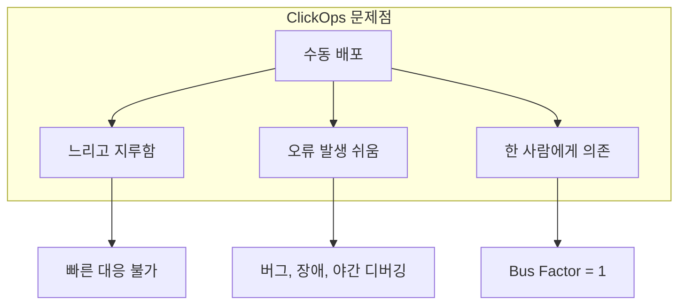

| 문제 | 결과 |
|------|------|
| **느린 배포** | 자주 배포 불가, 기회/문제 대응 지연 |
| **오류 발생** | 버그, 장애, 새 기능 도입 두려움 |
| **Single Point of Failure** | 과부하, 장기 개선 시간 없음, 이직 시 중단 |

---

### 2.2 DevOps의 핵심 통찰: 모든 것을 코드로

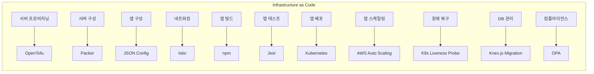

| 작업 | 코드로 관리하는 방법 | 예시 | 챕터 |
|------|---------------------|------|------|
| 서버 프로비저닝 | Provisioning Tools | OpenTofu | Ch.2 |
| 서버 구성 | Server Templating | Packer | Ch.2 |
| 앱 구성 | Config Files | JSON | Ch.6 |
| 네트워킹 | SDN | Istio | Ch.7 |
| 앱 빌드/테스트 | Build Systems | npm, Jest | Ch.4 |
| 앱 배포/스케일링 | Orchestration | Kubernetes | Ch.3 |
| DB 관리 | Schema Migrations | Knex.js | Ch.9 |

---

### 2.3 IaC의 7가지 이점

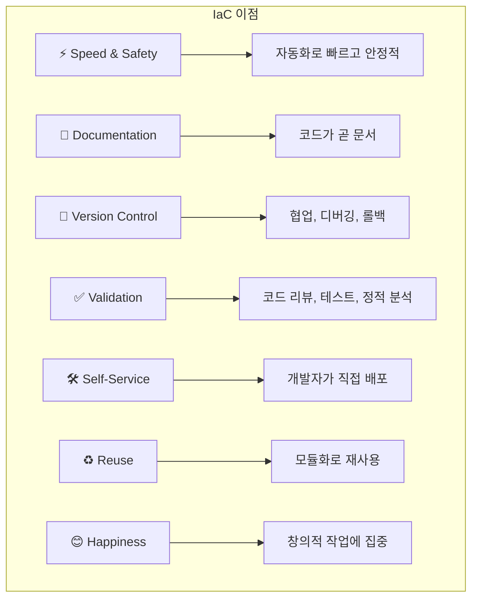

| 이점 | 설명 |
|------|------|
| **Speed & Safety** | 사람 → 컴퓨터, 빠르고 신뢰성 높음 |
| **Documentation** | 인프라 상태가 소스 파일에 기록됨 |
| **Version Control** | 변경 이력 추적, 롤백 가능 |
| **Validation** | 코드 리뷰, 자동 테스트, 정적 분석 |
| **Self-Service** | Ops 의존 없이 개발자가 직접 배포 |
| **Reuse** | 모듈로 패키징하여 반복 사용 |
| **Happiness** | 반복 작업에서 해방, 창의적 작업에 집중 |

---

### 2.4 IaC 도구 4가지 카테고리

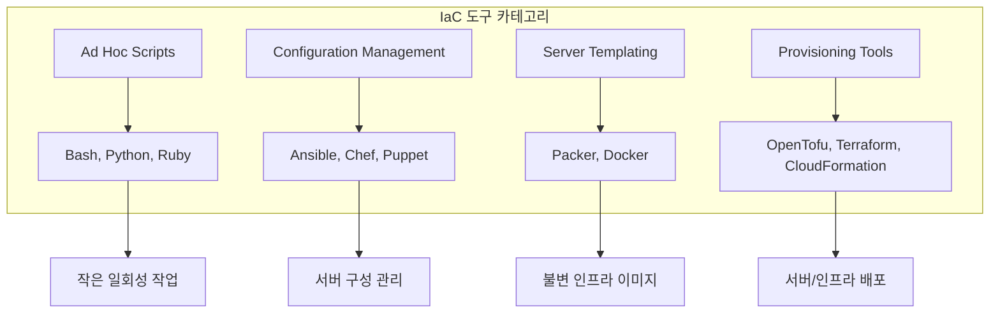

---

### 2.5 IaC 카테고리 평가 기준 (6가지)

| 기준 | 설명 |
|------|------|
| **CRUD** | Create, Read, Update, Delete 지원 여부 |
| **Scale** | 수백 개 리소스 관리 가능 여부 |
| **Deployment Strategies** | 롤링, Blue-Green 배포 지원 |
| **Idempotency** | 여러 번 실행해도 동일한 결과 |
| **Consistency** | 일관된 코드 구조와 규칙 |
| **Verbosity** | 코드의 간결함 |

---

### 2.6 Ad Hoc Scripts

#### Bash 스크립트 예시

```bash
#!/usr/bin/env bash
set -e

export AWS_DEFAULT_REGION="us-east-2"
user_data=$(cat user-data.sh)

# 1. Security Group 생성
security_group_id=$(aws ec2 create-security-group \
  --group-name "sample-app" \
  --description "Allow HTTP traffic" \
  --output text --query GroupId)

# 2. Inbound Rule 추가
aws ec2 authorize-security-group-ingress \
  --group-id "$security_group_id" \
  --protocol tcp --port 80 --cidr "0.0.0.0/0"

# 3. AMI ID 조회
image_id=$(aws ec2 describe-images \
  --owners amazon \
  --filters 'Name=name,Values=al2023-ami-2023.*-x86_64' \
  --query 'reverse(sort_by(Images, &CreationDate))[:1] | [0].ImageId' \
  --output text)

# 4. EC2 Instance 생성
instance_id=$(aws ec2 run-instances \
  --image-id "$image_id" \
  --instance-type "t2.micro" \
  --security-group-ids "$security_group_id" \
  --user-data "$user_data" \
  --output text --query Instances[0].InstanceId)
```

#### Ad Hoc Scripts 평가

| 기준 | 평가 | 설명 |
|------|------|------|
| CRUD | ❌ Create만 | Read/Update/Delete 미지원 |
| Scale | ❌ 어려움 | 수백 개 리소스 관리 불가 |
| Deployment | ❌ 없음 | 직접 구현 필요 |
| Idempotency | ❌ 없음 | 두 번째 실행 시 오류 |
| Consistency | ❌ 없음 | 사람마다 다른 스타일 |
| Verbosity | ❌ 장황함 | CRUD 등 추가 시 배로 증가 |

> **Key Takeaway 1**: Ad hoc 스크립트는 작고 일회성 작업에 적합하지만, 전체 인프라 관리에는 부적합하다.

---

### 2.7 Configuration Management Tools

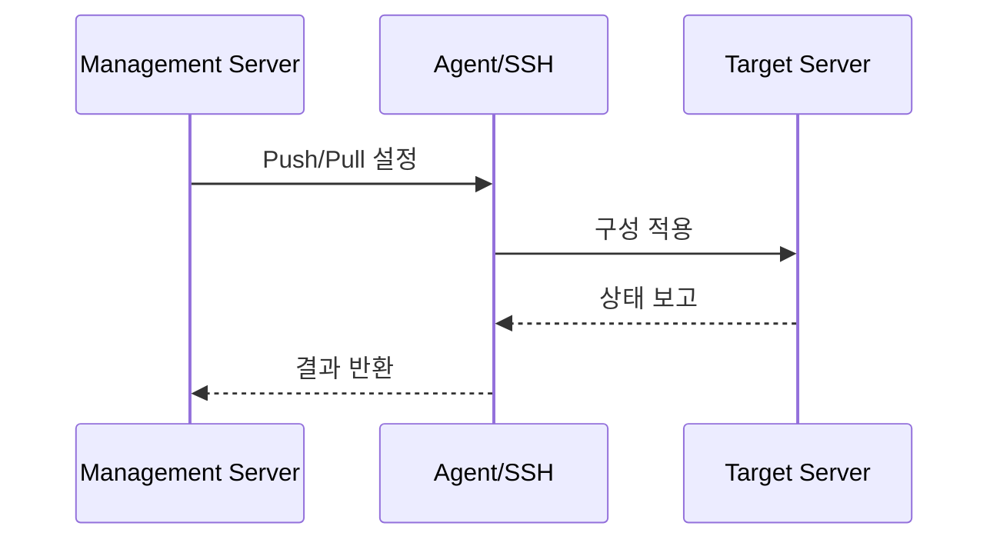

#### Ansible Playbook 예시

```yaml
- name: Deploy EC2 instances in AWS
  hosts: localhost
  gather_facts: no
  vars:
    num_instances: 1
    base_name: sample_app_ansible
    http_port: 8080
  tasks:
    - name: Create security group
      amazon.aws.ec2_security_group:
        name: "{{ base_name }}"
        rules:
          - proto: tcp
            ports: ["{{ http_port }}"]
            cidr_ip: 0.0.0.0/0

    - name: Create EC2 instances
      loop: "{{ range(num_instances | int) | list }}"
      amazon.aws.ec2_instance:
        name: "{{ '%s_%d' | format(base_name, item) }}"
        instance_type: t2.micro
```

#### Ansible Role 구조

```
roles/
└── sample-app/
    ├── defaults/
    │   └── main.yml
    ├── files/
    │   └── app.js
    ├── handlers/
    │   └── main.yml
    ├── tasks/
    │   └── main.yml
    ├── templates/
    │   └── foo.txt.j2
    └── vars/
        └── main.yml
```

#### Configuration Management 평가

| 기준 | 평가 | 설명 |
|------|------|------|
| CRUD | ⚠️ CRU만 | Delete 미지원 (수동 필요) |
| Scale | ✅ 좋음 | 다중 서버 관리에 설계됨 |
| Deployment | ✅ 일부 | 롤링 배포 지원 (Ansible) |
| Idempotency | ⚠️ 작업별 | yum은 멱등, shell은 아님 |
| Consistency | ✅ 좋음 | 표준화된 폴더 구조 (roles) |
| Verbosity | ✅ 간결 | DSL로 간결한 코드 |

#### Mutable vs Immutable Infrastructure

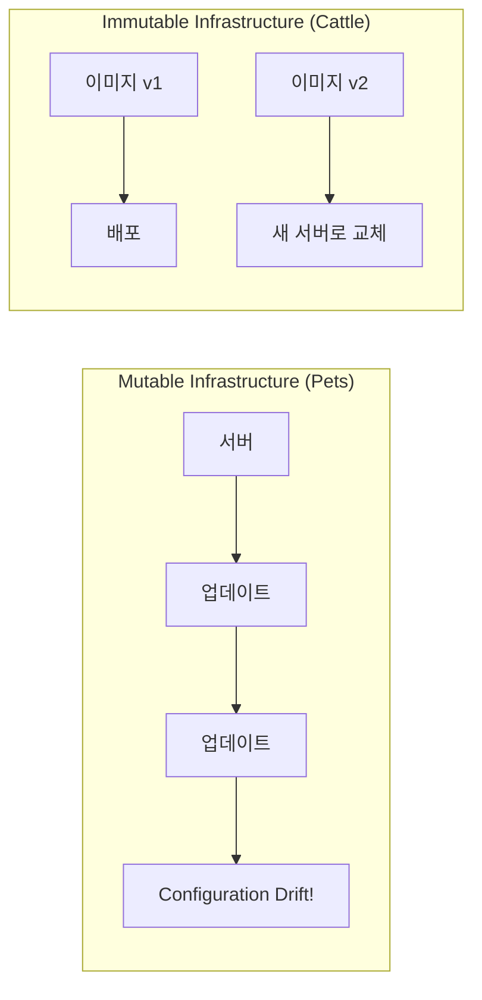

| 패러다임 | 비유 | 특징 |
|----------|------|------|
| **Mutable** | Pets (애완동물) | 고유 이름, 오래 유지, 직접 업데이트 |
| **Immutable** | Cattle (가축) | 번호로 식별, 교체, 새 이미지로 배포 |

> **Key Takeaway 2**: Configuration Management는 서버 구성 관리에 적합하지만, 서버 자체나 다른 인프라 배포에는 부적합하다.

---

### 2.8 Server Templating Tools

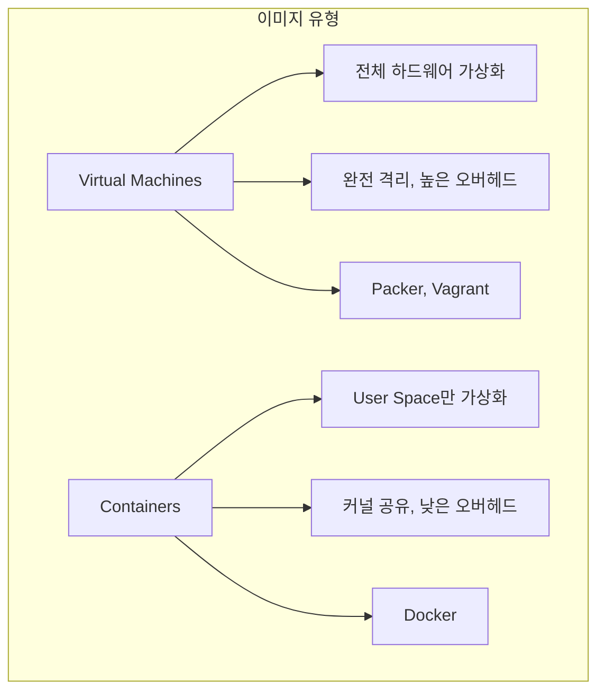

| 유형 | 장점 | 단점 | 도구 |
|------|------|------|------|
| **VM** | 완전 격리, 보안성 | CPU/메모리 오버헤드, 느린 시작 | Packer, Vagrant |
| **Container** | 빠른 시작, 낮은 오버헤드 | 커널 공유로 격리 제한 | Docker |

#### Packer Template 예시

```hcl
packer {
  required_plugins {
    amazon = {
      version = ">= 1.3.1"
      source  = "github.com/hashicorp/amazon"
    }
  }
}

# 1. Amazon Linux AMI 조회
data "amazon-ami" "amazon-linux" {
  filters = {
    name = "al2023-ami-2023.*-x86_64"
  }
  owners      = ["amazon"]
  most_recent = true
  region      = "us-east-2"
}

# 2. Source 이미지 정의
source "amazon-ebs" "amazon-linux" {
  ami_name      = "sample-app-packer-${uuidv4()}"
  instance_type = "t2.micro"
  region        = "us-east-2"
  source_ami    = data.amazon-ami.amazon-linux.id
  ssh_username  = "ec2-user"
}

# 3. Build 단계
build {
  sources = ["source.amazon-ebs.amazon-linux"]

  provisioner "file" {
    source      = "app.js"
    destination = "/home/ec2-user/app.js"
  }

  provisioner "shell" {
    script       = "install-node.sh"
    pause_before = "30s"
  }
}
```

#### Server Templating 평가

| 기준 | 평가 | 설명 |
|------|------|------|
| CRUD | ✅ Create만 | Immutable이므로 CRU/D 불필요 |
| Scale | ✅ 좋음 | 하나의 이미지로 N개 서버 |
| Deployment | N/A | 다른 도구가 배포 담당 |
| Idempotency | ✅ 설계상 | 매번 새 이미지 생성 |
| Consistency | ✅ 좋음 | 표준화된 구조 |
| Verbosity | ✅ 간결 | DSL로 간결한 코드 |

> **Key Takeaway 3**: Server Templating은 불변 인프라 방식으로 서버 구성 관리에 적합하다.

---

### 2.9 Provisioning Tools

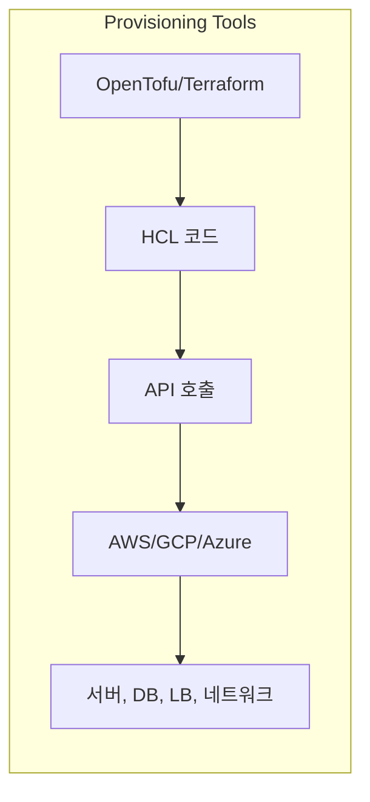

#### OpenTofu 모듈 구조

```
tofu/
├── modules/
│   └── ec2-instance/
│       ├── main.tf
│       ├── variables.tf
│       └── outputs.tf
└── live/
    └── sample-app/
        ├── main.tf
        └── outputs.tf
```

#### OpenTofu main.tf 예시

```hcl
provider "aws" {
  region = "us-east-2"
}

resource "aws_security_group" "sample_app" {
  name        = var.name
  description = "Allow HTTP traffic into ${var.name}"
}

resource "aws_security_group_rule" "allow_http_inbound" {
  type              = "ingress"
  protocol          = "tcp"
  from_port         = 8080
  to_port           = 8080
  security_group_id = aws_security_group.sample_app.id
  cidr_blocks       = ["0.0.0.0/0"]
}

data "aws_ami" "sample_app" {
  filter {
    name   = "name"
    values = ["sample-app-packer-*"]
  }
  owners      = ["self"]
  most_recent = true
}

resource "aws_instance" "sample_app" {
  ami                    = data.aws_ami.sample_app.id
  instance_type          = "t2.micro"
  vpc_security_group_ids = [aws_security_group.sample_app.id]
  user_data              = file("${path.module}/user-data.sh")

  tags = {
    Name = var.name
  }
}
```

#### OpenTofu 모듈 재사용

```hcl
# live/sample-app/main.tf
provider "aws" {
  region = "us-east-2"
}

module "sample_app_1" {
  source = "../../modules/ec2-instance"
  name   = "sample-app-tofu-1"
}

module "sample_app_2" {
  source = "../../modules/ec2-instance"
  name   = "sample-app-tofu-2"
}
```

#### Registry 모듈 사용

```hcl
module "sample_app_1" {
  source  = "brikis98/devops/book//modules/ec2-instance"
  version = "1.0.0"
  name    = "sample-app-tofu-1"
}
```

#### Provisioning Tools 평가

| 기준 | 평가 | 설명 |
|------|------|------|
| CRUD | ✅ 완전 지원 | Create, Read, Update, Delete 모두 |
| Scale | ✅ 매우 좋음 | 수천 개 리소스 관리 가능 |
| Deployment | ✅ 지원 | 기반 인프라의 전략 사용 가능 |
| Idempotency | ✅ 설계상 | 선언적 → 자동 멱등성 |
| Consistency | ✅ 좋음 | 표준화된 구조와 규칙 |
| Verbosity | ✅ 간결 | Bash의 절반 길이로 더 많은 기능 |

> **Key Takeaway 4**: Provisioning Tools는 서버와 인프라를 배포하고 관리하는 데 적합하다.

---

### 2.10 여러 IaC 도구 조합

> **Key Takeaway 5**: 실제 환경에서는 여러 IaC 도구를 함께 사용해야 한다.

#### 조합 1: Provisioning + Configuration Management

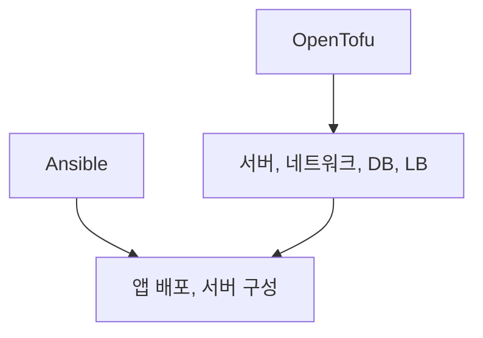

| 장점 | 단점 |
|------|------|
| 시작하기 쉬움 | Mutable 인프라 |
| 둘의 통합 용이 | 유지보수 어려움 증가 |

#### 조합 2: Provisioning + Server Templating

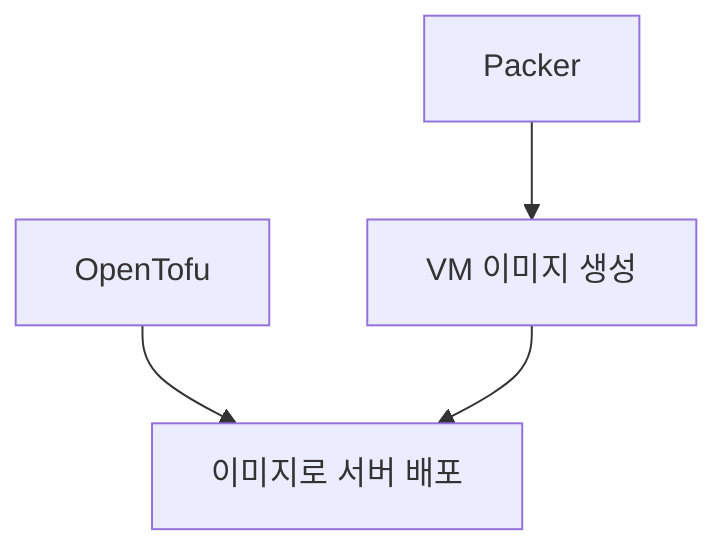

| 장점 | 단점 |
|------|------|
| Immutable 인프라 | VM 빌드/배포 시간 김 |
| 유지보수 용이 | 반복 속도 느림 |

#### 조합 3: Provisioning + Server Templating + Orchestration

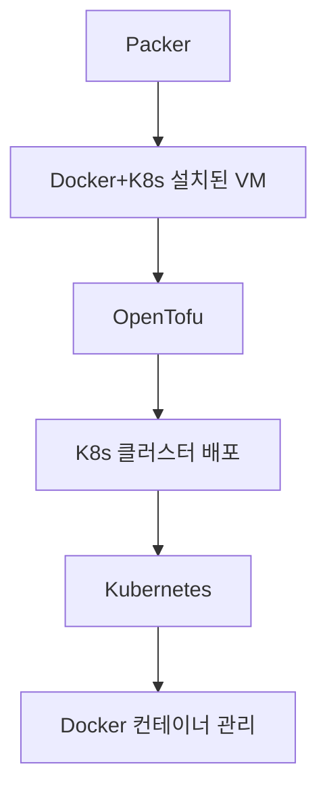

| 장점 | 단점 |
|------|------|
| IaC + 템플릿 + 오케스트레이션 | 복잡성 증가 |
| 스케줄링, 자동 복구, 스케일링 | 학습 곡선 높음 |
| 빠른 컨테이너 빌드 | 추가 인프라 필요 (K8s) |

---

### 2.11 IaC 도입 시 고려사항

> **Key Takeaway 6**: IaC 도입은 단순히 새 도구를 도입하는 것이 아니라 팀의 문화와 프로세스를 변경해야 한다.

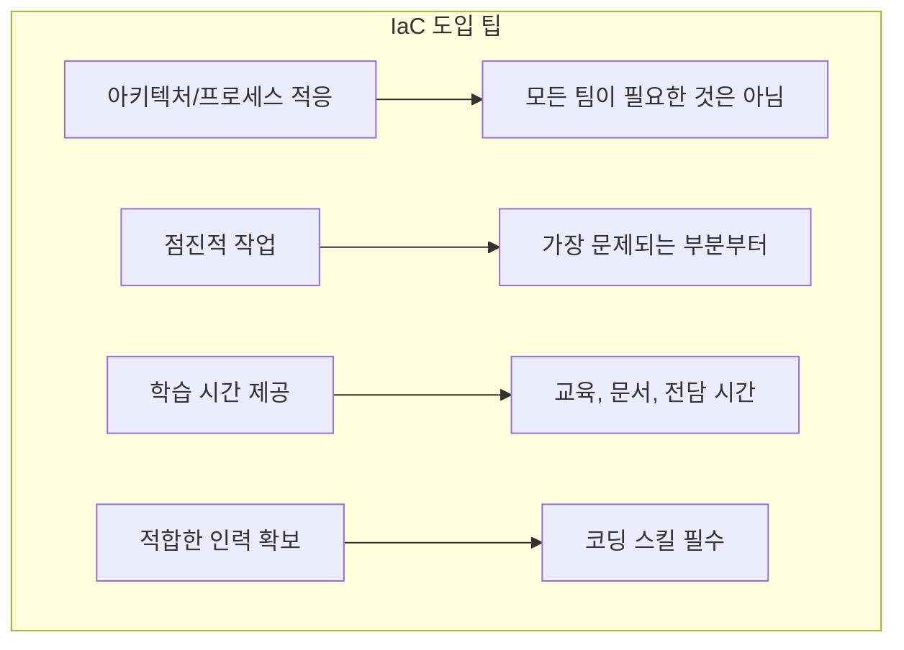

| 팁 | 설명 |
|------|------|
| **적응** | 모든 팀에 IaC가 필요한 것은 아님 (소규모 스타트업, 프로토타입) |
| **점진적** | 한 번에 모든 것을 마이그레이션하지 말고 가장 문제되는 부분부터 |
| **학습 시간** | 팀원들에게 충분한 학습 시간과 리소스 제공 |
| **적합한 인력** | IaC는 코딩 스킬 필수, 일부는 레벨업, 일부는 채용 필요 |

---

## 💡 실무 적용 포인트

### IaC 도구 선택 가이드

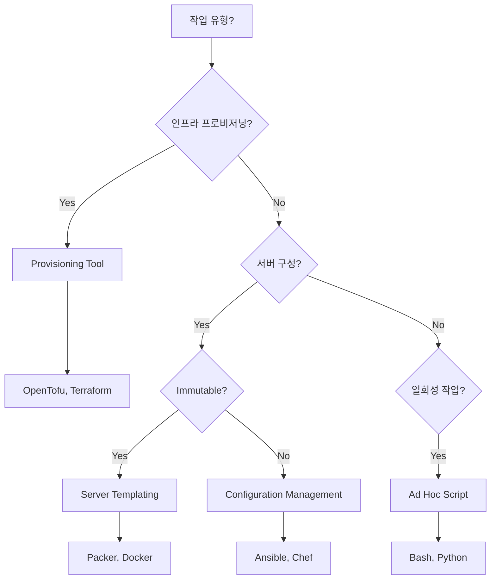

### 도구별 명령어 요약

| 도구 | 초기화 | 실행 | 삭제 |
|------|--------|------|------|
| **Bash** | `chmod u+x script.sh` | `./script.sh` | 수동 |
| **Ansible** | `ansible-galaxy install` | `ansible-playbook playbook.yml` | 수동 |
| **Packer** | `packer init template.pkr.hcl` | `packer build template.pkr.hcl` | N/A (이미지) |
| **OpenTofu** | `tofu init` | `tofu apply` | `tofu destroy` |

### OpenTofu 핵심 개념

| 개념 | 설명 |
|------|------|
| **Provider** | 클라우드 제공자 (AWS, GCP, Azure) |
| **Resource** | 생성할 인프라 (서버, DB, LB) |
| **Data Source** | 기존 인프라 조회 |
| **Module** | 재사용 가능한 코드 단위 |
| **State** | 실제 인프라 상태 추적 파일 |
| **Plan** | 변경 사항 미리보기 |
| **Apply** | 변경 사항 적용 |

### 디렉토리 구조 예시

```
fundamentals-of-devops/
├── ch1/
│   ├── ec2-user-data-script/
│   │   └── user-data.sh
│   └── sample-app/
│       └── app.js
└── ch2/
    ├── bash/
    │   ├── deploy-ec2-instance.sh
    │   └── user-data.sh
    ├── ansible/
    │   ├── create_ec2_instances_playbook.yml
    │   ├── configure_sample_app_playbook.yml
    │   ├── inventory.aws_ec2.yml
    │   ├── group_vars/
    │   │   └── sample_app_ansible.yml
    │   └── roles/
    │       └── sample-app/
    │           ├── files/
    │           │   └── app.js
    │           └── tasks/
    │               └── main.yml
    ├── packer/
    │   ├── sample-app.pkr.hcl
    │   ├── install-node.sh
    │   └── app.js
    └── tofu/
        ├── modules/
        │   └── ec2-instance/
        │       ├── main.tf
        │       ├── variables.tf
        │       ├── outputs.tf
        │       └── user-data.sh
        └── live/
            └── sample-app/
                ├── main.tf
                └── outputs.tf
```

---

## ✅ 핵심 개념 체크리스트

- [ ] ClickOps의 3가지 문제점 (느림, 오류, 의존성)
- [ ] IaC의 7가지 이점 (Speed, Documentation, Version Control, Validation, Self-Service, Reuse, Happiness)
- [ ] 4가지 IaC 카테고리 (Ad hoc, Config Management, Server Templating, Provisioning)
- [ ] 6가지 평가 기준 (CRUD, Scale, Deployment, Idempotency, Consistency, Verbosity)
- [ ] Mutable vs Immutable Infrastructure (Pets vs Cattle)
- [ ] OpenTofu 핵심 개념 (Provider, Resource, Module, State, Plan, Apply)
- [ ] 도구 조합 전략 3가지
- [ ] IaC 도입 시 4가지 팁 (적응, 점진적, 학습 시간, 적합한 인력)

---

## 🔗 참고 자료

- [OpenTofu Documentation](https://opentofu.org/docs/)
- [Terraform: Up & Running (O'Reilly)](https://www.terraformupandrunning.com/)
- [Ansible Documentation](https://docs.ansible.com/)
- [Packer Documentation](https://developer.hashicorp.com/packer/docs)
- [IaC Tool Comparison](https://www.gruntwork.io/devops-checklist#infrastructure_as_code)

---

## 📚 다음 챕터 미리보기

- **Chapter 3**: How to Manage Your Apps (Kubernetes를 사용한 앱 오케스트레이션 - 스케줄링, 자동 복구, 자동 스케일링, 서비스 통신)
