# Chapter 3: How to Manage Your Apps by Using Orchestration Tools (오케스트레이션 도구를 사용한 앱 관리)

## 📌 핵심 요약

> **"오케스트레이션(Orchestration)은 인프라 위에서 앱을 실행하고 관리하는 방법이다. 배포, 스케줄링, 롤백, 자동 스케일링, 자동 복구, 로드 밸런싱, 설정/시크릿 관리, 서비스 통신, 디스크 관리 등 10가지 핵심 문제를 해결해야 한다. 서버, VM, 컨테이너, 서버리스 4가지 유형의 오케스트레이션 도구가 있으며, 각각 장단점이 다르다."**

이 챕터에서는 오케스트레이션의 핵심 문제와 서버/VM/컨테이너/서버리스 각 유형별 솔루션을 학습한다.

---

## 🎯 학습 목표

이 챕터를 완료하면 다음을 할 수 있다:

- [ ] 오케스트레이션이 해결해야 할 10가지 핵심 문제 이해
- [ ] 서버 오케스트레이션: Ansible + nginx + PM2 활용
- [ ] VM 오케스트레이션: Packer + OpenTofu + ASG + ALB 구성
- [ ] 컨테이너 오케스트레이션: Docker + Kubernetes + EKS 배포
- [ ] 서버리스 오케스트레이션: AWS Lambda 구현
- [ ] 각 오케스트레이션 유형의 장단점 비교

---

## 📖 본문 정리

### 3.1 오케스트레이션 소개

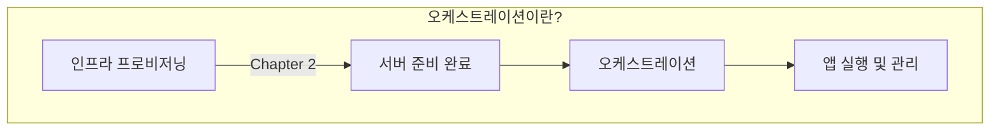

**IaC vs 오케스트레이션**:
- **IaC (Chapter 2)**: 인프라를 코드로 프로비저닝 (서버, 네트워크 등)
- **오케스트레이션 (Chapter 3)**: 인프라 위에서 앱을 실행하고 관리

---

### 3.2 오케스트레이션 10가지 핵심 문제

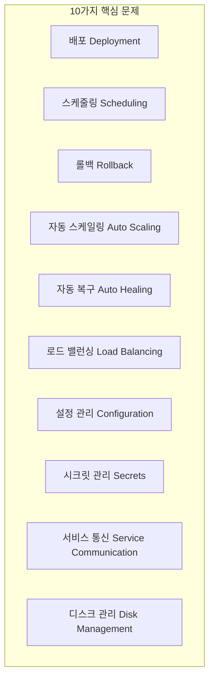

| 문제 | 설명 | 예시 |
|------|------|------|
| **배포 (Deployment)** | 앱을 서버에 배포하는 방법 | AMI, Docker image, JAR 배포 |
| **스케줄링 (Scheduling)** | 어떤 서버에 앱을 실행할지 결정 | 리소스 가용성 기반 배치 |
| **롤백 (Rollback)** | 배포 실패 시 이전 버전으로 복원 | 자동/수동 롤백 |
| **자동 스케일링 (Auto Scaling)** | 부하에 따라 서버 수 조정 | CPU 80% → 스케일 아웃 |
| **자동 복구 (Auto Healing)** | 장애 서버 자동 교체 | 헬스체크 실패 → 재시작 |
| **로드 밸런싱 (Load Balancing)** | 트래픽을 여러 서버에 분산 | Round-robin, Least connections |
| **설정 관리 (Configuration)** | 앱 설정값 관리 | 환경변수, 설정 파일 |
| **시크릿 관리 (Secrets)** | 민감 정보 안전하게 관리 | DB 비밀번호, API 키 |
| **서비스 통신 (Service Communication)** | 서비스 간 통신 방법 | Service discovery, DNS |
| **디스크 관리 (Disk Management)** | 영구 데이터 저장소 관리 | EBS, NFS, Persistent Volume |

---

### 3.3 서버 오케스트레이션 (Server Orchestration)

#### 아키텍처 개요

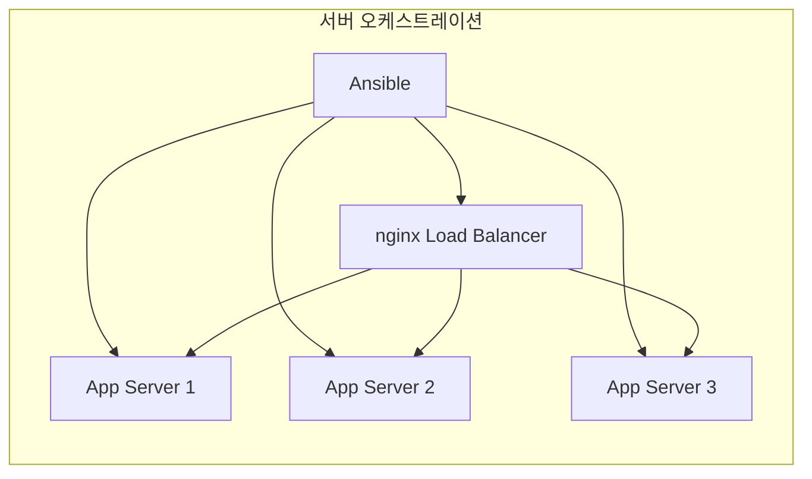

#### Ansible로 다중 서버 배포

**인벤토리 설정 (inventory.yml)**:
```yaml
all:
  children:
    app_servers:
      hosts:
        app1:
          ansible_host: 11.22.33.44
        app2:
          ansible_host: 11.22.33.55
        app3:
          ansible_host: 11.22.33.66
    load_balancers:
      hosts:
        lb:
          ansible_host: 11.22.33.77
```

**nginx 로드 밸런서 설정**:
```nginx
upstream app_servers {
    server {{ hostvars['app1']['ansible_host'] }}:8080;
    server {{ hostvars['app2']['ansible_host'] }}:8080;
    server {{ hostvars['app3']['ansible_host'] }}:8080;
}

server {
    listen 80;
    location / {
        proxy_pass http://app_servers;
    }
}
```

#### PM2 프로세스 슈퍼바이저

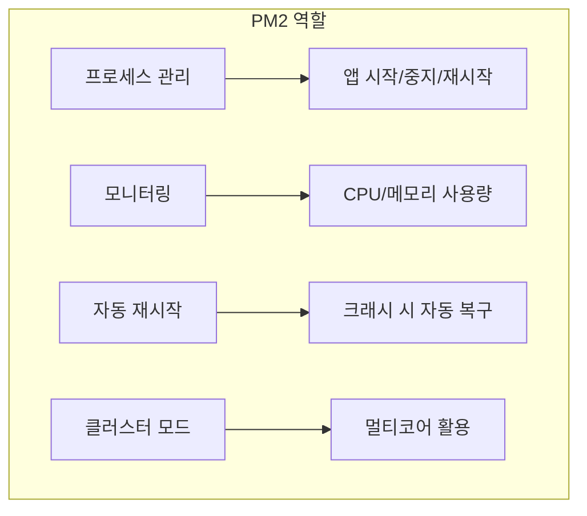

**PM2 설정 (ecosystem.config.js)**:
```javascript
module.exports = {
  apps: [{
    name: 'sample-app',
    script: './server.js',
    instances: 'max',           // CPU 코어 수만큼 인스턴스
    exec_mode: 'cluster',       // 클러스터 모드
    env: {
      NODE_ENV: 'production',
      PORT: 8080
    }
  }]
};
```

#### 롤링 배포 (Rolling Deployment)

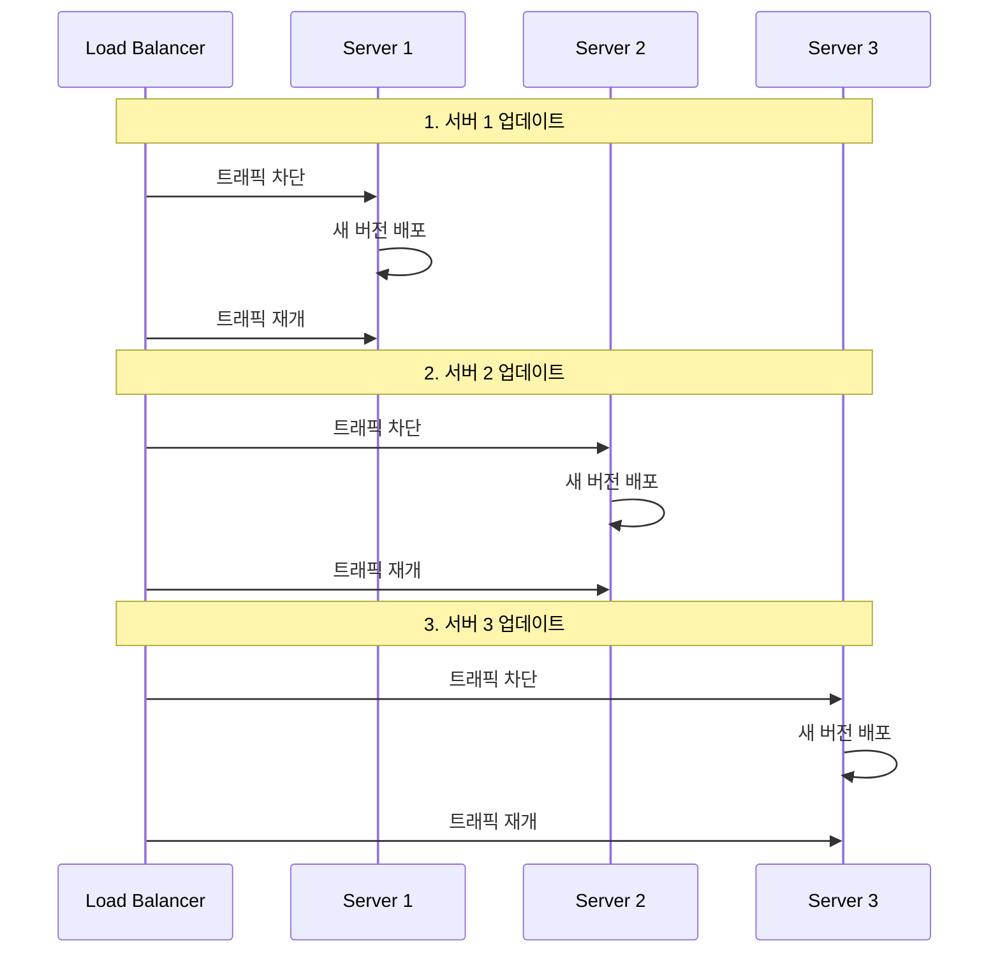

**Ansible 롤링 배포 Playbook**:
```yaml
- name: Rolling deployment
  hosts: app_servers
  serial: 1                     # 한 번에 하나씩 배포
  tasks:
    - name: Remove from load balancer
      # nginx upstream에서 제거

    - name: Deploy new version
      # 새 버전 배포

    - name: Health check
      # 헬스체크 통과 대기

    - name: Add back to load balancer
      # nginx upstream에 재추가
```

---

### 3.4 VM 오케스트레이션 (VM Orchestration)

#### 아키텍처 개요

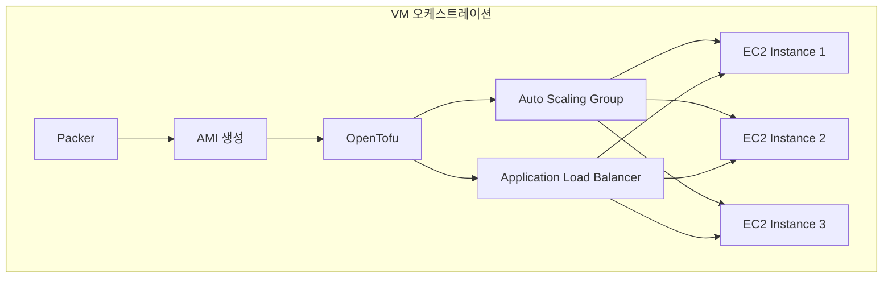

#### Packer로 AMI 생성

```hcl
# sample-app.pkr.hcl
source "amazon-ebs" "sample_app" {
  ami_name      = "sample-app-${formatdate("YYYYMMDD-hhmmss", timestamp())}"
  instance_type = "t2.micro"
  region        = "us-east-2"
  source_ami    = data.amazon-ami.ubuntu.id

  ssh_username = "ubuntu"
}

build {
  sources = ["source.amazon-ebs.sample_app"]

  provisioner "shell" {
    script = "install-sample-app.sh"
  }
}
```

#### OpenTofu ASG + ALB 모듈

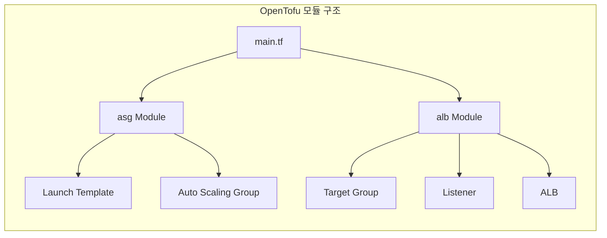

**ASG 모듈 (modules/asg/main.tf)**:
```hcl
resource "aws_launch_template" "sample_app" {
  name_prefix   = var.name
  image_id      = var.ami_id
  instance_type = var.instance_type

  user_data = base64encode(<<-EOF
    #!/bin/bash
    systemctl start sample-app
  EOF
  )
}

resource "aws_autoscaling_group" "sample_app" {
  name                = var.name
  min_size            = var.min_size
  max_size            = var.max_size
  desired_capacity    = var.desired_capacity
  vpc_zone_identifier = var.subnet_ids

  launch_template {
    id      = aws_launch_template.sample_app.id
    version = "$Latest"
  }

  target_group_arns = var.target_group_arns

  instance_refresh {
    strategy = "Rolling"
    preferences {
      min_healthy_percentage = 50
    }
  }
}
```

**ALB 모듈 (modules/alb/main.tf)**:
```hcl
resource "aws_lb" "sample_app" {
  name               = var.name
  load_balancer_type = "application"
  subnets            = var.subnet_ids
  security_groups    = [aws_security_group.alb.id]
}

resource "aws_lb_target_group" "sample_app" {
  name     = var.name
  port     = var.app_port
  protocol = "HTTP"
  vpc_id   = var.vpc_id

  health_check {
    path                = "/health"
    protocol            = "HTTP"
    healthy_threshold   = 2
    unhealthy_threshold = 2
  }
}

resource "aws_lb_listener" "http" {
  load_balancer_arn = aws_lb.sample_app.arn
  port              = 80
  protocol          = "HTTP"

  default_action {
    type             = "forward"
    target_group_arn = aws_lb_target_group.sample_app.arn
  }
}
```

#### Instance Refresh로 롤링 배포

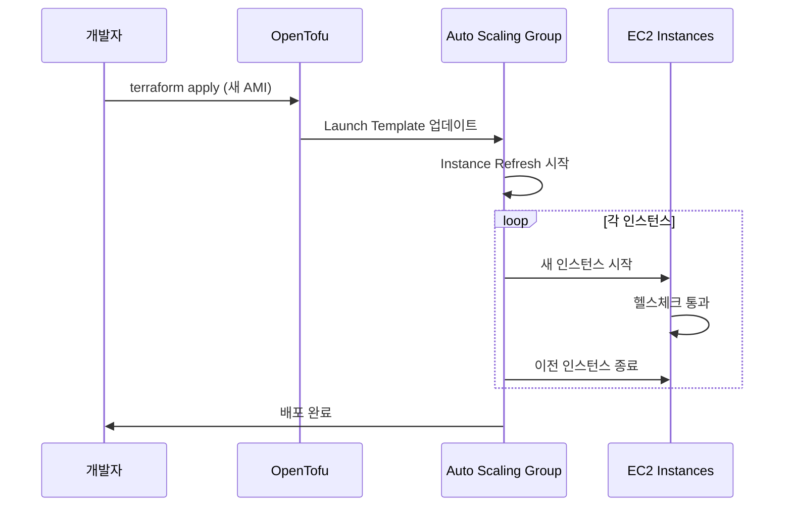

---

### 3.5 컨테이너 오케스트레이션 (Container Orchestration)

#### Docker 기초

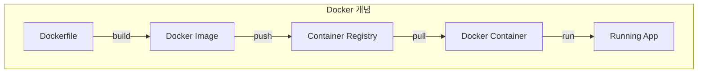

**Dockerfile 예시**:
```dockerfile
FROM node:18-alpine

WORKDIR /app

COPY package*.json ./
RUN npm ci --only=production

COPY . .

EXPOSE 8080
CMD ["node", "server.js"]
```

**Docker 명령어**:
```bash
# 이미지 빌드
docker build -t sample-app:v1 .

# 컨테이너 실행
docker run -d -p 8080:8080 sample-app:v1

# 컨테이너 목록
docker ps

# 로그 확인
docker logs <container_id>
```

#### Kubernetes 핵심 개념

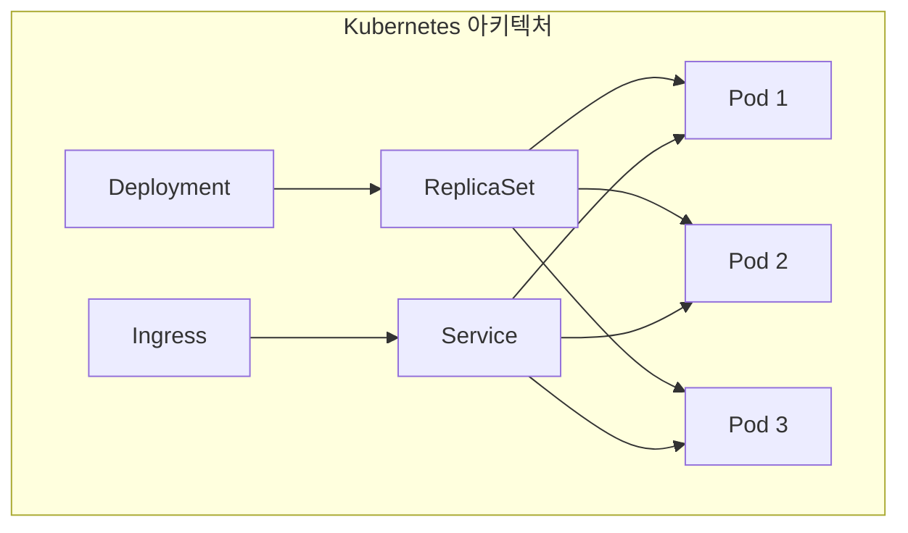

| 리소스 | 설명 | 역할 |
|--------|------|------|
| **Pod** | 최소 배포 단위 | 1개 이상의 컨테이너 |
| **Deployment** | Pod 관리자 | 롤링 업데이트, 스케일링 |
| **ReplicaSet** | 복제본 관리 | 지정된 수의 Pod 유지 |
| **Service** | 네트워크 추상화 | Pod 그룹에 단일 IP 제공 |
| **Ingress** | 외부 트래픽 라우팅 | HTTP 라우팅, TLS 종료 |

**Deployment YAML**:
```yaml
apiVersion: apps/v1
kind: Deployment
metadata:
  name: sample-app
spec:
  replicas: 3
  selector:
    matchLabels:
      app: sample-app
  template:
    metadata:
      labels:
        app: sample-app
    spec:
      containers:
      - name: sample-app
        image: sample-app:v1
        ports:
        - containerPort: 8080
        resources:
          requests:
            memory: "128Mi"
            cpu: "100m"
          limits:
            memory: "256Mi"
            cpu: "200m"
        livenessProbe:
          httpGet:
            path: /health
            port: 8080
          initialDelaySeconds: 10
          periodSeconds: 5
```

**Service YAML**:
```yaml
apiVersion: v1
kind: Service
metadata:
  name: sample-app
spec:
  type: LoadBalancer
  selector:
    app: sample-app
  ports:
  - port: 80
    targetPort: 8080
```

#### EKS (Elastic Kubernetes Service)

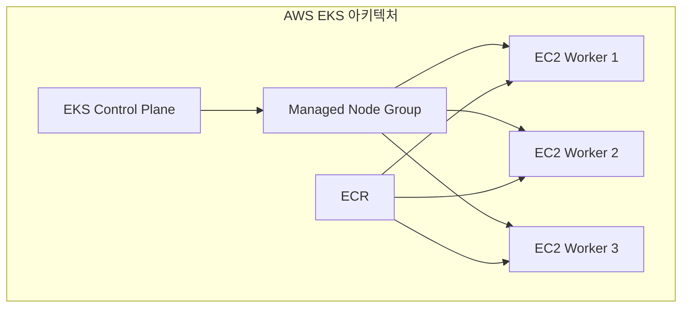

**OpenTofu로 EKS 프로비저닝**:
```hcl
module "eks" {
  source  = "terraform-aws-modules/eks/aws"
  version = "~> 19.0"

  cluster_name    = "sample-cluster"
  cluster_version = "1.28"

  vpc_id     = module.vpc.vpc_id
  subnet_ids = module.vpc.private_subnets

  eks_managed_node_groups = {
    default = {
      min_size     = 1
      max_size     = 10
      desired_size = 3

      instance_types = ["t3.medium"]
    }
  }
}
```

**ECR (Elastic Container Registry) 사용**:
```bash
# ECR 로그인
aws ecr get-login-password --region us-east-2 | \
  docker login --username AWS --password-stdin \
  123456789012.dkr.ecr.us-east-2.amazonaws.com

# 이미지 태그
docker tag sample-app:v1 \
  123456789012.dkr.ecr.us-east-2.amazonaws.com/sample-app:v1

# 이미지 푸시
docker push \
  123456789012.dkr.ecr.us-east-2.amazonaws.com/sample-app:v1
```

**kubectl 명령어**:
```bash
# Deployment 생성
kubectl apply -f deployment.yaml

# 상태 확인
kubectl get pods
kubectl get deployments
kubectl get services

# 스케일링
kubectl scale deployment sample-app --replicas=5

# 롤링 업데이트
kubectl set image deployment/sample-app \
  sample-app=sample-app:v2

# 롤백
kubectl rollout undo deployment/sample-app

# 로그 확인
kubectl logs -f deployment/sample-app
```

---

### 3.6 서버리스 오케스트레이션 (Serverless Orchestration)

#### AWS Lambda 개요

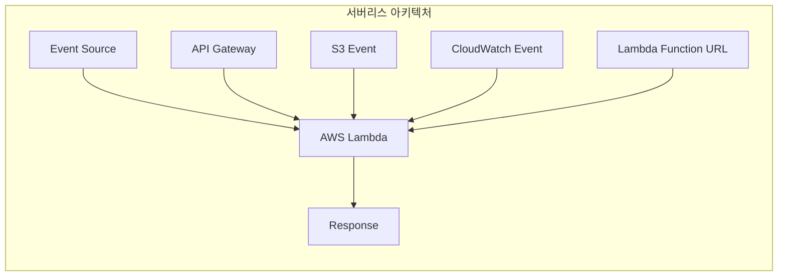

**Lambda의 특징**:
- **FaaS (Function as a Service)**: 함수 단위 배포
- **이벤트 기반**: 요청 시에만 실행
- **자동 스케일링**: 동시 실행 자동 조정
- **종량제 과금**: 실행 시간만 과금

#### Lambda 함수 구현

**handler.js**:
```javascript
exports.handler = async (event) => {
  console.log('Received event:', JSON.stringify(event, null, 2));

  return {
    statusCode: 200,
    headers: {
      'Content-Type': 'application/json'
    },
    body: JSON.stringify({
      message: 'Hello from Lambda!',
      timestamp: new Date().toISOString()
    })
  };
};
```

**OpenTofu로 Lambda 배포**:
```hcl
resource "aws_lambda_function" "sample_app" {
  function_name = "sample-app"
  role          = aws_iam_role.lambda_exec.arn
  handler       = "handler.handler"
  runtime       = "nodejs18.x"

  filename         = "lambda.zip"
  source_code_hash = filebase64sha256("lambda.zip")

  environment {
    variables = {
      NODE_ENV = "production"
    }
  }
}

resource "aws_lambda_function_url" "sample_app" {
  function_name      = aws_lambda_function.sample_app.function_name
  authorization_type = "NONE"
}

output "lambda_url" {
  value = aws_lambda_function_url.sample_app.function_url
}
```

#### Lambda Function URL

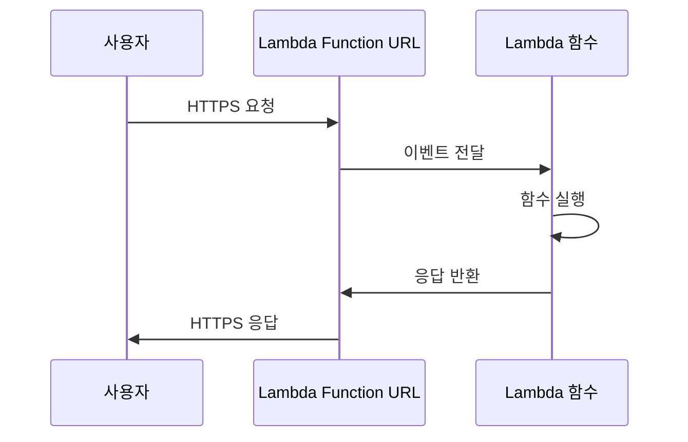

**장점**:
- API Gateway 없이 HTTP 엔드포인트 제공
- 간단한 설정
- 추가 비용 없음

---

### 3.7 오케스트레이션 비교

#### 기능별 비교

| 기능 | 서버 | VM | 컨테이너 | 서버리스 |
|------|------|-----|----------|----------|
| **배포** | Ansible | AMI + ASG | Docker + K8s | Lambda |
| **스케줄링** | 수동 | ASG | K8s Scheduler | AWS 관리 |
| **롤백** | Ansible | Instance Refresh | kubectl rollout | 버전 별칭 |
| **자동 스케일링** | 수동 | ASG 정책 | HPA | 자동 |
| **자동 복구** | PM2 | ASG 헬스체크 | K8s Liveness | 자동 |
| **로드 밸런싱** | nginx | ALB | Service | 내장 |
| **설정 관리** | Ansible vars | Launch Template | ConfigMap | 환경변수 |
| **시크릿 관리** | Ansible Vault | Secrets Manager | K8s Secret | Secrets Manager |

#### 비기능 요구사항 비교

| 요구사항 | 서버 | VM | 컨테이너 | 서버리스 |
|----------|------|-----|----------|----------|
| **학습 곡선** | 낮음 | 중간 | 높음 | 중간 |
| **운영 부담** | 높음 | 중간 | 중간 | 낮음 |
| **이식성** | 낮음 | 중간 | 높음 | 낮음 |
| **비용 효율** | 낮음 | 중간 | 중간 | 높음* |
| **콜드 스타트** | 없음 | 분 단위 | 초 단위 | 초~분 |
| **최대 실행 시간** | 무제한 | 무제한 | 무제한 | 15분 |

*낮은 트래픽 기준

---

## 💡 실무 적용 포인트

### 오케스트레이션 선택 가이드

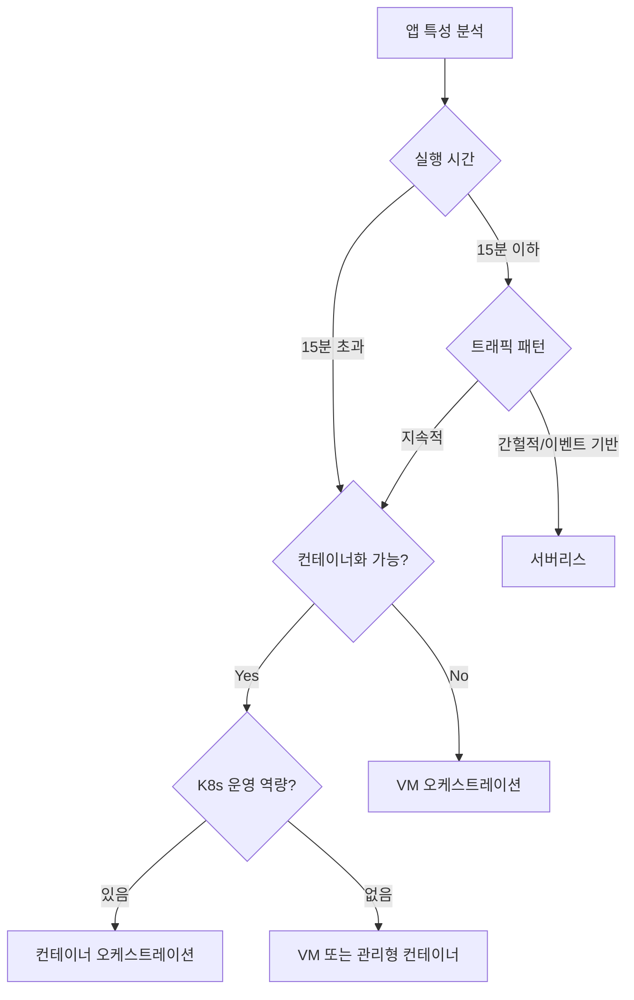

### 점진적 마이그레이션 전략

```
1단계: 서버 오케스트레이션
  ├── Ansible로 배포 자동화
  ├── PM2로 프로세스 관리
  └── nginx로 로드 밸런싱

2단계: VM 오케스트레이션
  ├── Packer로 AMI 생성
  ├── ASG로 자동 스케일링
  └── ALB로 로드 밸런싱

3단계: 컨테이너 오케스트레이션
  ├── Docker로 컨테이너화
  ├── EKS로 Kubernetes 관리
  └── ECR로 이미지 저장

4단계: 서버리스 (적합한 워크로드)
  ├── Lambda로 이벤트 처리
  ├── API Gateway 또는 Function URL
  └── 관리 부담 최소화
```

### 핵심 도구 요약

| 도구 | 역할 | 오케스트레이션 유형 |
|------|------|---------------------|
| **Ansible** | 서버 설정/배포 자동화 | 서버 |
| **PM2** | Node.js 프로세스 관리 | 서버 |
| **nginx** | 로드 밸런서/리버스 프록시 | 서버 |
| **Packer** | 머신 이미지 생성 | VM |
| **ASG** | 자동 스케일링 그룹 | VM |
| **ALB** | 애플리케이션 로드 밸런서 | VM |
| **Docker** | 컨테이너 런타임 | 컨테이너 |
| **Kubernetes** | 컨테이너 오케스트레이터 | 컨테이너 |
| **EKS** | 관리형 Kubernetes | 컨테이너 |
| **Lambda** | 서버리스 함수 실행 | 서버리스 |

---

## ✅ 핵심 개념 체크리스트

- [ ] 오케스트레이션 10가지 핵심 문제 (배포, 스케줄링, 롤백, 자동 스케일링, 자동 복구, 로드 밸런싱, 설정, 시크릿, 서비스 통신, 디스크)
- [ ] 서버 오케스트레이션: Ansible + nginx + PM2 조합
- [ ] 롤링 배포: 무중단 배포를 위한 순차적 업데이트
- [ ] VM 오케스트레이션: Packer (AMI) + OpenTofu (ASG/ALB)
- [ ] Instance Refresh: ASG의 롤링 업데이트 기능
- [ ] Docker: Dockerfile → Image → Container 워크플로우
- [ ] Kubernetes: Deployment, Service, Pod 핵심 리소스
- [ ] EKS + ECR: AWS 관리형 Kubernetes 환경
- [ ] Lambda: FaaS, 이벤트 기반, 자동 스케일링, 종량제
- [ ] Lambda Function URL: API Gateway 없이 HTTP 엔드포인트 제공

---

## 🔑 Key Takeaways

1. **오케스트레이션은 10가지 핵심 문제를 해결한다**: 배포, 스케줄링, 롤백, 자동 스케일링, 자동 복구, 로드 밸런싱, 설정 관리, 시크릿 관리, 서비스 통신, 디스크 관리

2. **4가지 오케스트레이션 유형이 있다**: 서버(Ansible/PM2), VM(ASG/ALB), 컨테이너(Docker/Kubernetes), 서버리스(Lambda). 각각 장단점이 다르므로 요구사항에 맞게 선택

3. **컨테이너와 서버리스가 주류 트렌드**: 이식성, 효율성, 운영 부담 감소 측면에서 장점. 단, 학습 곡선과 기존 인프라 고려 필요

4. **점진적 마이그레이션이 현실적**: 서버 → VM → 컨테이너 → 서버리스 순으로 단계별 전환. 모든 워크로드에 서버리스가 적합한 것은 아님

---

## 🔗 참고 자료

- [Ansible Documentation](https://docs.ansible.com/)
- [PM2 Documentation](https://pm2.keymetrics.io/docs/)
- [AWS Auto Scaling](https://docs.aws.amazon.com/autoscaling/)
- [Docker Documentation](https://docs.docker.com/)
- [Kubernetes Documentation](https://kubernetes.io/docs/)
- [AWS EKS](https://docs.aws.amazon.com/eks/)
- [AWS Lambda](https://docs.aws.amazon.com/lambda/)

---

## 📚 다음 챕터 미리보기

- **Chapter 4**: How to Set Up Networking - VPC, 서브넷, 보안 그룹, 로드 밸런서 네트워크 구성
