# Chapter 4: How to Version, Build, and Test Your Code (코드 버전 관리, 빌드, 테스트)

## 📌 핵심 요약

> **"팀 협업을 위해 버전 관리(Git/GitHub), 빌드 시스템(npm), 자동화된 테스트가 필수다. 버전 관리는 코드 접근과 변경 추적을, 빌드 시스템은 일관된 작업 방식을, 자동화된 테스트는 변경에 대한 자신감을 제공한다. TDD(테스트 주도 개발)는 더 나은 설계와 높은 테스트 커버리지로 이어진다."**

이 챕터에서는 팀 협업을 위한 버전 관리, 빌드 시스템, 의존성 관리, 자동화된 테스트의 모범 사례를 학습한다.

---

## 🎯 학습 목표

이 챕터를 완료하면 다음을 할 수 있다:

- [ ] Git과 GitHub로 코드 버전 관리
- [ ] 효과적인 버전 관리 5가지 권장 사항 적용
- [ ] npm을 빌드 시스템으로 활용
- [ ] 의존성 관리 도구로 라이브러리 관리
- [ ] 8가지 테스트 유형 이해 및 테스트 피라미드 적용
- [ ] TDD(테스트 주도 개발) 실천

---

## 📖 본문 정리

### 4.1 팀 협업의 3가지 핵심 문제

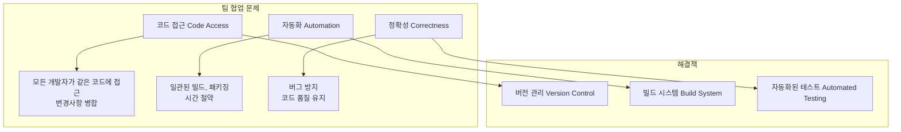

---

### 4.2 버전 관리 (Version Control)

#### 버전 관리란?

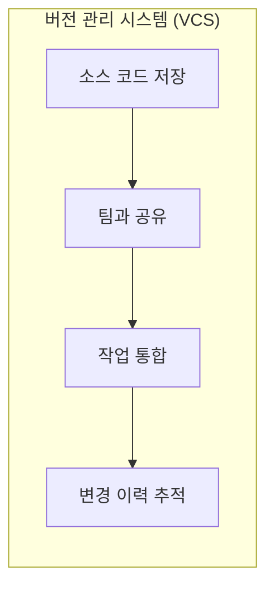

**주요 도구**:
| 도구 | 유형 | 특징 |
|------|------|------|
| **Git** | VCS | 가장 인기 있는 분산 버전 관리 |
| **GitHub** | Git 호스팅 | 가장 인기 있는 Git 호스팅 |
| GitLab | Git 호스팅 | 자체 호스팅 가능 |
| Bitbucket | Git 호스팅 | Atlassian 생태계 |

#### Git 저장소 초기화

```bash
# Git 저장소 초기화
cd fundamentals-of-devops
git init

# .gitignore 생성
cat > .gitignore << 'EOF'
*.tfstate*      # OpenTofu 상태 파일
.terraform      # OpenTofu 스크래치 디렉토리
*.key           # SSH 키 (비밀)
*.zip           # 빌드 아티팩트
node_modules    # Node.js 의존성
EOF

# 첫 번째 커밋
git add .gitignore
git commit -m "Add .gitignore"

# 나머지 코드 커밋
git add .
git commit -m "Example code for first few chapters"
```

#### GitHub에 푸시

```bash
# GitHub 원격 저장소 추가
git remote add origin https://github.com/<USERNAME>/<REPO>.git

# main 브랜치 푸시
git push origin main
```

---

### 4.3 버전 관리 5가지 권장 사항


#### 1. 항상 버전 관리 사용

> **Key Takeaway 1**: 항상 버전 관리 시스템으로 코드를 관리하라.

- 쉽고, 저렴하거나 무료
- 소프트웨어 엔지니어링에 막대한 이점
- **예외 없이** 모든 코드를 버전 관리에 저장

#### 2. 좋은 커밋 메시지 작성

```
Fix bug with search auto complete

A more detailed explanation of the fix, if necessary. Provide
additional context that isn't obvious from reading the code.

- Use bullet points
- If appropriate

Fixes #123. Jira #456.
```

| 요소 | 설명 | 권장 |
|------|------|------|
| **요약 (Summary)** | 첫 줄, 변경 요약 | 50자 미만 |
| **컨텍스트 (Context)** | 빈 줄 후 상세 설명 | what과 why 중심 |

#### 3. 자주 커밋 (Commit Early and Often)

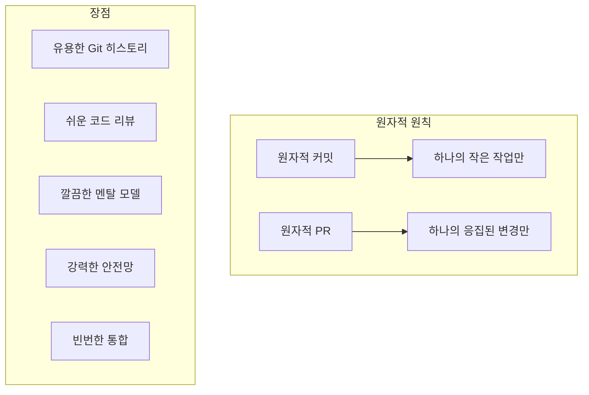

**안티패턴 예시**:
```
❌ PR에 새 기능 + 버그 수정 + 리팩토링 포함

✅ 3개의 별도 PR로 분리:
   - PR 1: 버그 수정
   - PR 2: 리팩토링
   - PR 3: 새 기능
```

#### 4. 코드 리뷰 프로세스

| 방식 | 설명 | 특징 |
|------|------|------|
| **PR 워크플로우** | 모든 변경을 PR로 제출 | 비동기 리뷰 |
| **페어 프로그래밍** | 두 명이 한 컴퓨터에서 작업 | 실시간 리뷰 |
| **공식 검사** | 팀 전체가 코드 라인별 검토 | 미션 크리티컬 코드용 |

**코드 리뷰 효과**: 결함률 **50%~80% 감소**

#### 5. 코드 보호

| 보호 수단 | 설명 | 구현 |
|-----------|------|------|
| **서명된 커밋** | 암호화 서명으로 신원 확인 | GPG/SSH 키 사용 |
| **브랜치 보호** | 특정 브랜치에 요구사항 적용 | PR 필수, 리뷰어 수, 검사 통과 |

---

### 4.4 빌드 시스템 (Build System)

#### 빌드 시스템이란?

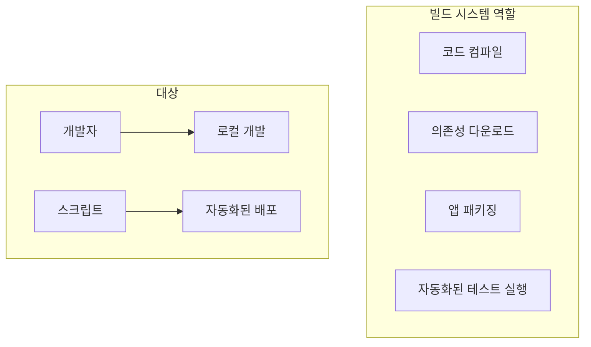

> **Key Takeaway 2**: 빌드 시스템을 사용하여 프로젝트의 중요한 작업과 지식을 코드로 캡처하라. 개발자와 자동화 도구 모두 사용할 수 있어야 한다.

**빌드 도구 예시**:
| 도구 | 언어/프레임워크 | 특징 |
|------|-----------------|------|
| **npm** | JavaScript/Node.js | 이 책에서 사용 |
| Yarn | JavaScript/Node.js | npm 대안 |
| Gradle | Java | 유연한 빌드 |
| Make | 언어 무관 | 범용 빌드 |
| Bazel | 언어 무관 | 대규모 모노레포 |

#### npm 빌드 설정

**package.json 초기화**:
```bash
cd ch4/sample-app
npm init
```

**package.json 예시**:
```json
{
  "name": "sample-app",
  "version": "0.0.1",
  "description": "Sample app for DevOps book",
  "scripts": {
    "start": "node server.js",
    "test": "jest --verbose",
    "dockerize": "./build-docker-image.sh"
  },
  "dependencies": {
    "express": "^4.19.2",
    "ejs": "^3.1.9"
  },
  "devDependencies": {
    "jest": "^29.7.0",
    "supertest": "^7.0.0"
  }
}
```

**빌드 명령어**:
```bash
# 앱 시작
npm start

# 테스트 실행
npm test

# Docker 이미지 빌드 (커스텀 명령)
npm run dockerize
```

#### Docker 이미지 빌드 스크립트

**build-docker-image.sh**:
```bash
#!/usr/bin/env bash
set -e

# package.json에서 이름과 버전 읽기
name=$(npm pkg get name | tr -d '"')
version=$(npm pkg get version | tr -d '"')

# 멀티 아키텍처 빌드
docker buildx build \
  --platform=linux/amd64,linux/arm64 \
  --load \
  -t "$name:$version" \
  .
```

---

### 4.5 의존성 관리 (Dependency Management)

#### 의존성 유형

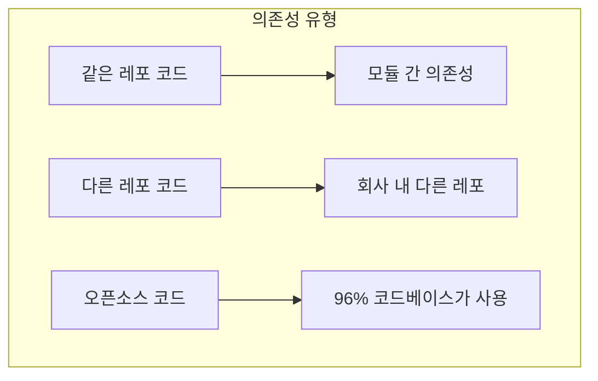

#### 복사-붙여넣기의 문제점

| 문제 | 설명 |
|------|------|
| **전이 의존성** | 의존성의 의존성 관리 어려움 |
| **업데이트 어려움** | 새 버전 적용 시 수동 작업 필요 |
| **비공개 API 사용** | 의도치 않은 동작 발생 가능 |
| **저장소 비대화** | VCS 크기 증가, 속도 저하 |

> **Key Takeaway 3**: 의존성 관리 도구를 사용하여 의존성을 가져오라. 복사-붙여넣기는 금물!

#### npm으로 의존성 추가

```bash
# 프로덕션 의존성 추가
npm install express --save

# 개발 의존성 추가
npm install --save-dev jest supertest
```

**의존성 관련 파일**:
| 파일 | 역할 |
|------|------|
| `package.json` | 의존성 선언 (버전 범위) |
| `package-lock.json` | 정확한 버전 고정 (재현 가능한 빌드) |
| `node_modules/` | 다운로드된 의존성 (.gitignore에 추가) |

**캐럿 버전 범위**:
```json
"dependencies": {
  "express": "^4.19.2"  // 4.19.2 이상, 5.0.0 미만
}
```

---

### 4.6 자동화된 테스트 (Automated Testing)

#### 왜 자동화된 테스트인가?

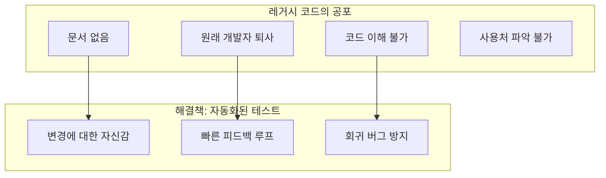

> **Key Takeaway 4**: 자동화된 테스트를 사용하여 팀이 빠르게 변경할 수 있는 자신감을 제공하라.

**레거시 코드 정의** (Michael Feathers):
> "레거시 코드는 단순히 테스트가 없는 코드다."

---

### 4.7 테스트 유형 8가지

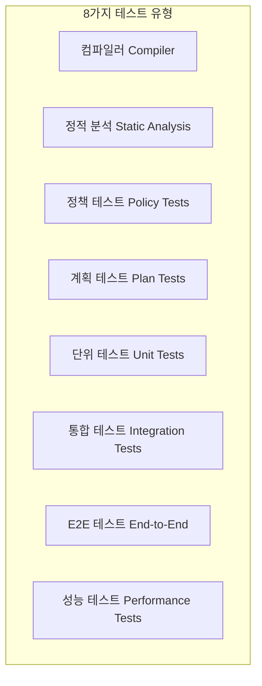

| 테스트 유형 | 설명 | 도구 예시 |
|-------------|------|-----------|
| **컴파일러** | 문법/타입 오류 검출 | TypeScript, Go |
| **정적 분석** | 코드 실행 없이 검사 | ESLint, ShellCheck, Terrascan |
| **정책 테스트** | 회사 정책/규정 준수 | OPA, Sentinel |
| **계획 테스트** | 부분 실행 (읽기만) | OpenTofu plan, Terratest |
| **단위 테스트** | 단일 유닛만 테스트 | Jest, JUnit, unittest |
| **통합 테스트** | 여러 유닛 함께 테스트 | 실제 DB + 모의 서비스 |
| **E2E 테스트** | 전체 시스템 테스트 | Cypress, Playwright |
| **성능 테스트** | 부하/장애 상황 테스트 | JMeter, Gatling |

---

### 4.8 테스트 피라미드

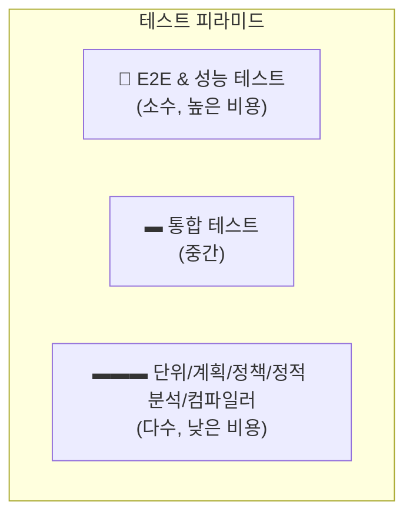

| 레벨 | 특징 | 비중 |
|------|------|------|
| **상단** | 높은 비용, 느림, 불안정 | 적음 |
| **중간** | 중간 비용, 중간 속도 | 중간 |
| **하단** | 낮은 비용, 빠름, 안정적 | 많음 |

**테스트 유형별 비교**:

| 항목 | 컴파일러 | 정적분석 | 단위 | 통합 | E2E | 성능 |
|------|----------|----------|------|------|-----|------|
| 문법 오류 | ⭐⭐⭐ | ⭐⭐⭐ | ⭐⭐ | ⭐⭐ | ⭐⭐ | ⭐⭐ |
| 유닛 기능 | ⭐ | ⭐ | ⭐⭐⭐ | ⭐⭐ | ⭐⭐ | ⭐⭐ |
| 시스템 기능 | ⭐ | ⭐ | ⭐ | ⭐ | ⭐⭐⭐ | ⭐⭐ |
| 부하 하 기능 | ⭐ | ⭐ | ⭐ | ⭐ | ⭐ | ⭐⭐⭐ |
| 테스트 속도 | ⭐⭐⭐ | ⭐⭐⭐ | ⭐⭐ | ⭐ | ⭐ | ⭐ |
| 안정성 | ⭐⭐⭐ | ⭐⭐⭐ | ⭐⭐ | ⭐ | ⭐ | ⭐ |
| 작성 노력 | ⭐⭐⭐ | ⭐⭐⭐ | ⭐⭐ | ⭐ | ⭐ | ⭐ |

---

### 4.9 Node.js 앱 테스트 예시

#### 앱 구조 분리

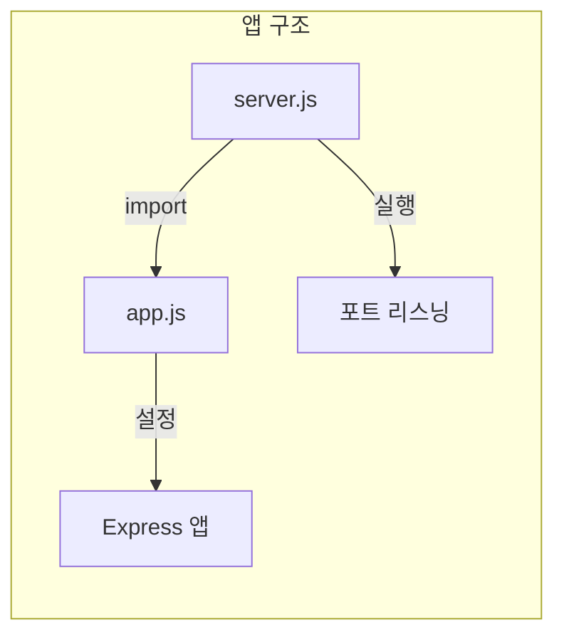

**app.js (설정만)**:
```javascript
const express = require('express');

const app = express();
app.set('view engine', 'ejs');

app.get('/', (req, res) => {
  res.send('Hello, World!');
});

app.get('/name/:name', (req, res) => {
  res.render('hello', {name: req.params.name});
});

module.exports = app;
```

**server.js (실행)**:
```javascript
const app = require('./app');

const port = process.env.PORT || 8080;

app.listen(port, () => {
  console.log(`Example app listening on port ${port}`);
});
```

#### Jest + SuperTest 테스트

**app.test.js**:
```javascript
const request = require('supertest');
const app = require('./app');

describe('Test the app', () => {
  test('Get / should return Hello, World!', async () => {
    const response = await request(app).get('/');
    expect(response.statusCode).toBe(200);
    expect(response.text).toBe('Hello, World!');
  });

  test('Get /name/Bob should return Hello, Bob!', async () => {
    const response = await request(app).get('/name/Bob');
    expect(response.statusCode).toBe(200);
    expect(response.text).toBe('Hello, Bob!');
  });

  // XSS 방지 테스트
  const maliciousUrl = '/name/%3Cscript%3Ealert("hi")%3C%2Fscript%3E';
  const sanitizedHtml = 'Hello, &lt;script&gt;alert(&#34;hi&#34;)&lt;/script&gt;!'

  test('Get /name should sanitize its input', async () => {
    const response = await request(app).get(maliciousUrl);
    expect(response.statusCode).toBe(200);
    expect(response.text).toBe(sanitizedHtml);
  });
});
```

**테스트 실행**:
```bash
$ npm test

 PASS  ./app.test.js
  Test the app
    ✓ Get / should return Hello, World! (13 ms)
    ✓ Get /name/Bob should return Hello, Bob! (7 ms)
    ✓ Get /name should sanitize its input (2 ms)

Tests:       3 passed, 3 total
Time:        0.32 s
```

---

### 4.10 OpenTofu 테스트 예시

#### OpenTofu 테스트 파일

**deploy.tftest.hcl**:
```hcl
run "deploy" {
  command = apply
}

run "validate" {
  command = apply

  module {
    source  = "brikis98/devops/book//modules/test-endpoint"
    version = "1.0.0"
  }

  variables {
    endpoint = run.deploy.function_url
  }

  assert {
    condition     = data.http.test_endpoint.status_code == 200
    error_message = "Unexpected status: ${data.http.test_endpoint.status_code}"
  }

  assert {
    condition     = data.http.test_endpoint.response_body == "Hello, World!"
    error_message = "Unexpected body: ${data.http.test_endpoint.response_body}"
  }
}
```

**테스트 실행**:
```bash
$ tofu init
$ tofu test

deploy.tftest.hcl... pass
  run "deploy"... pass
  run "validate"... pass

Success! 2 passed, 0 failed.
```

---

### 4.11 테스트 주도 개발 (TDD)

#### TDD 프로세스

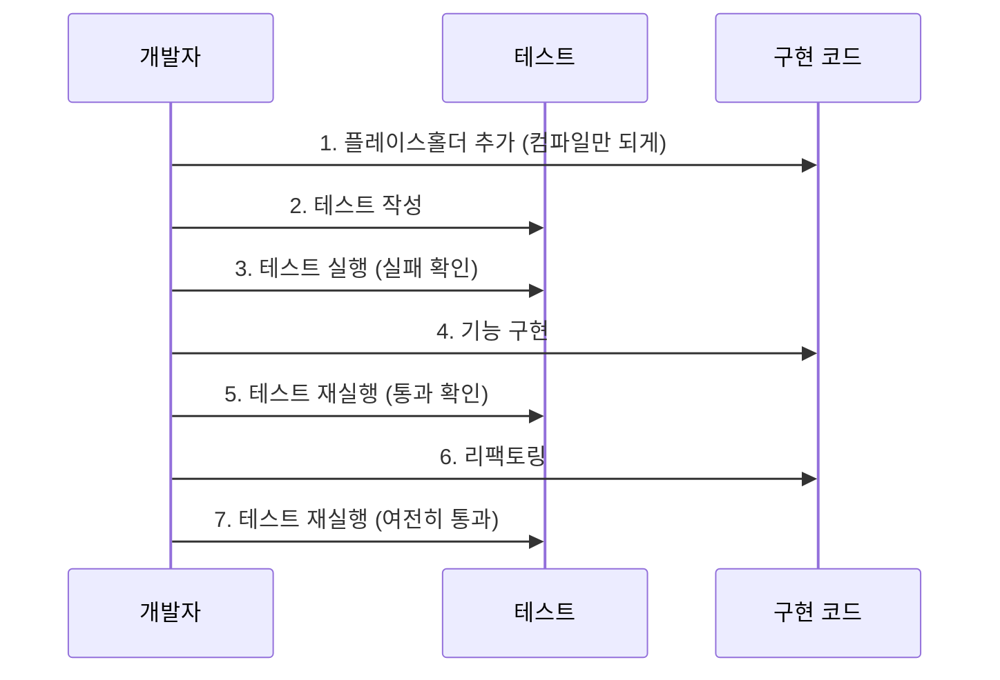

#### TDD의 장점

| 장점 | 설명 |
|------|------|
| **더 나은 설계** | 테스트 작성이 설계를 강제함 |
| **높은 테스트 커버리지** | 점진적 작성으로 지루함 감소 |
| **빠른 피드백** | 구현 직후 검증 |
| **회귀 테스트** | 버그 재발 방지 |

#### TDD 적용 사례: XSS 버그 수정

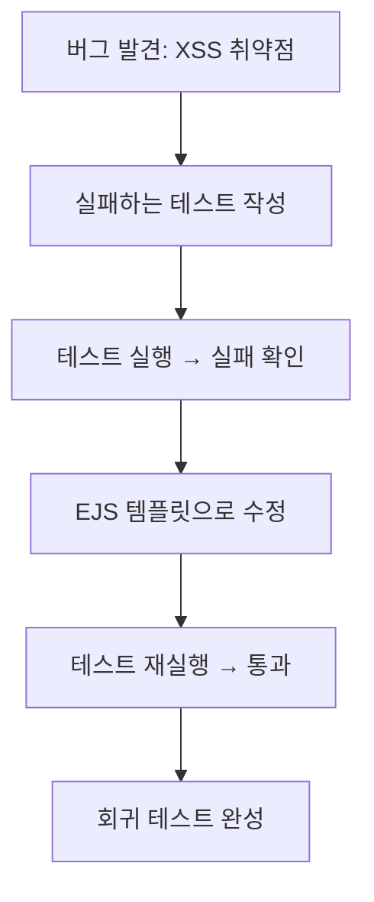

---

### 4.12 테스트 권장 사항

#### 무엇을 테스트할 것인가?

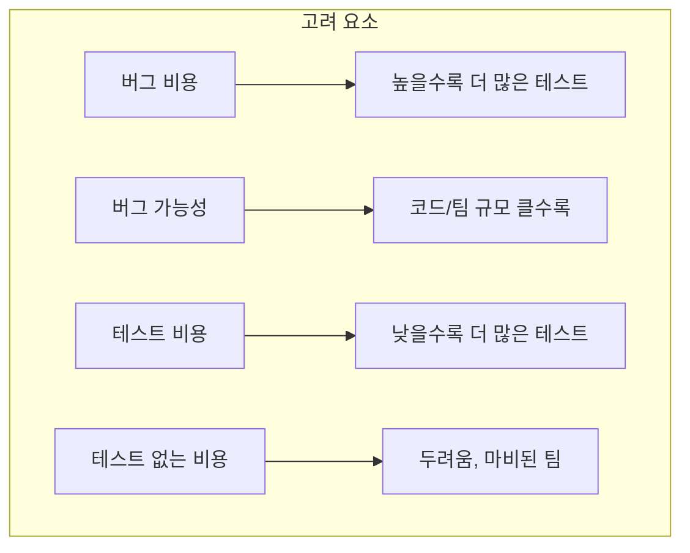

#### 테스트 투자 결정

| 상황 | 테스트 투자 |
|------|-------------|
| 결제/보안 코드 | 높음 (버그 비용 높음) |
| 1주 프로토타입 | 낮음 (버그 비용 낮음) |
| 대규모 팀 | 높음 (버그 가능성 높음) |
| 단위 테스트 | 높음 (테스트 비용 낮음) |
| 성능 테스트 | 선택적 (테스트 비용 높음) |

---

## 💡 실무 적용 포인트

### 버전 관리 체크리스트

```
□ .gitignore 설정
  ├── *.tfstate* (OpenTofu 상태)
  ├── .terraform (OpenTofu 스크래치)
  ├── *.key (비밀 키)
  ├── *.zip (빌드 아티팩트)
  └── node_modules (의존성)

□ 커밋 메시지 형식
  ├── 첫 줄: 50자 미만 요약
  ├── 빈 줄
  └── 상세 설명 (what & why)

□ 브랜치 보호 설정
  ├── PR 필수
  ├── 리뷰어 필수
  └── CI 통과 필수
```

### npm 빌드 시스템 구조

```
sample-app/
├── package.json           # 빌드 설정, 의존성
├── package-lock.json      # 의존성 잠금
├── node_modules/          # 의존성 (gitignore)
├── app.js                 # 앱 설정
├── server.js              # 서버 실행
├── app.test.js            # 테스트
├── Dockerfile             # 컨테이너화
├── build-docker-image.sh  # 빌드 스크립트
└── views/
    └── hello.ejs          # EJS 템플릿
```

### 핵심 명령어 요약

| 작업 | 명령어 |
|------|--------|
| Git 초기화 | `git init` |
| 의존성 추가 | `npm install express --save` |
| 개발 의존성 추가 | `npm install --save-dev jest` |
| 앱 시작 | `npm start` |
| 테스트 실행 | `npm test` |
| Docker 빌드 | `npm run dockerize` |
| OpenTofu 테스트 | `tofu test` |

---

## ✅ 핵심 개념 체크리스트

- [ ] Git/GitHub로 버전 관리
- [ ] .gitignore 설정 (상태파일, 비밀, 의존성 제외)
- [ ] 좋은 커밋 메시지 (요약 + 컨텍스트)
- [ ] 원자적 커밋과 PR
- [ ] 코드 리뷰 프로세스 (PR, 페어 프로그래밍)
- [ ] 브랜치 보호와 서명된 커밋
- [ ] npm을 빌드 시스템으로 활용
- [ ] package-lock.json으로 재현 가능한 빌드
- [ ] 8가지 테스트 유형 이해
- [ ] 테스트 피라미드 적용
- [ ] Jest + SuperTest로 Node.js 테스트
- [ ] OpenTofu 내장 테스트
- [ ] TDD (테스트 주도 개발) 실천

---

## 🔑 Key Takeaways

1. **항상 버전 관리 시스템으로 코드를 관리하라**: 쉽고, 저렴하고, 이점이 막대하다. 예외 없이 모든 코드를 버전 관리에 저장.

2. **빌드 시스템을 사용하여 중요한 작업을 코드로 캡처하라**: 개발자와 자동화 도구 모두 사용할 수 있는 방식으로. npm start, npm test 같은 표준 명령어 활용.

3. **의존성 관리 도구를 사용하라 (복사-붙여넣기 금지)**: 전이 의존성, 업데이트, 비공개 API, 저장소 비대화 문제 방지.

4. **자동화된 테스트로 변경에 대한 자신감을 제공하라**: 테스트는 기술적 이점만큼 심리적 이점도 크다. 레거시 코드에 대한 두려움을 없앤다.

5. **자동화된 테스트는 코딩 중 생산성을 높인다**: 변경 → 테스트 → 변경 → 테스트의 빠른 피드백 루프가 개발 속도를 높인다.

6. **자동화된 테스트는 미래 생산성도 높인다**: 테스트가 버그를 미리 잡아주므로 버그 수정에 드는 막대한 시간을 절약할 수 있다.

---

## 🔗 참고 자료

- [Git Documentation](https://git-scm.com/doc)
- [GitHub Docs](https://docs.github.com/)
- [npm Documentation](https://docs.npmjs.com/)
- [Jest Documentation](https://jestjs.io/docs/getting-started)
- [OpenTofu Test](https://opentofu.org/docs/language/tests/)
- [Google Code Review Guidelines](https://google.github.io/eng-practices/review/)
- [Conventional Commits](https://www.conventionalcommits.org/)

---

## 📚 다음 챕터 미리보기

- **Chapter 5**: How to Set Up Continuous Integration and Continuous Delivery - CI/CD 파이프라인으로 버전 관리, 빌드, 테스트를 자동화하고 팀 협업 효율화
