# Chapter 5: How to Set Up Continuous Integration and Continuous Delivery (CI/CD 설정)

## 📌 핵심 요약

> **"지속적 통합(CI)은 모든 개발자가 하루에 여러 번 코드를 통합하고 자동화된 테스트를 실행하는 것이며, 지속적 전달(CD)은 코드 변경을 자동으로 프로덕션까지 배포하는 것이다. 핵심은 '아프면 더 자주 하라(If it hurts, do it more often)'는 원칙이다."**

이 챕터에서는 CI/CD 파이프라인 구축 방법과 다양한 배포 전략을 학습한다.

---

## 🎯 학습 목표

이 챕터를 완료하면 다음을 할 수 있다:

- [ ] 지속적 통합(CI)의 원칙과 trunk-based development 이해
- [ ] Self-testing builds와 CI 서버 설정
- [ ] Branch by abstraction과 Feature toggles 활용
- [ ] Machine User Credentials vs OIDC 차이점 이해
- [ ] 배포 전략 6가지 비교 및 선택 기준 파악
- [ ] GitOps 원칙과 배포 파이프라인 구성
- [ ] GitHub Actions로 CI/CD 파이프라인 구축

---

## 📖 본문 정리

### 5.1 지속적 통합 (Continuous Integration)

#### CI의 핵심 원칙

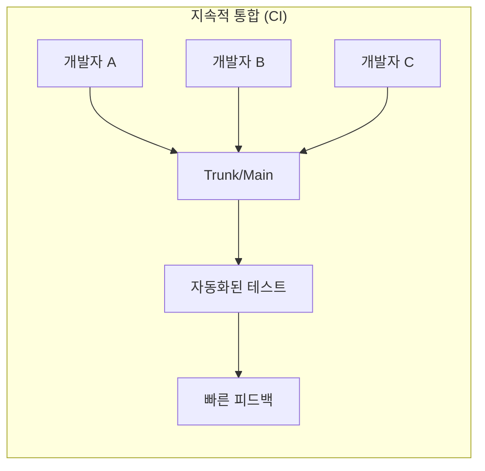

| 원칙 | 설명 |
|------|------|
| **하루에 여러 번 통합** | 모든 개발자가 main/trunk에 자주 머지 |
| **자동화된 빌드/테스트** | 매 통합마다 자동으로 빌드하고 테스트 |
| **빠른 피드백** | 문제 발생 시 즉시 알림 |

#### "아프면 더 자주 하라" 원칙

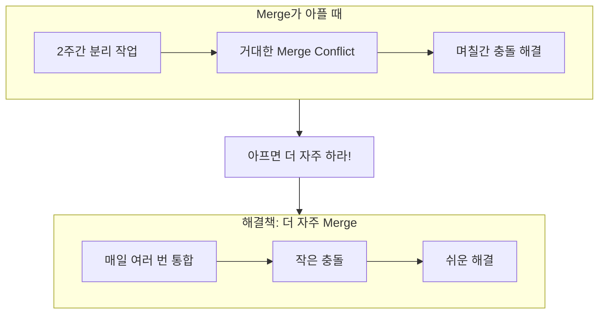

**핵심 아이디어**:
- 머지가 아프다면 → 더 자주 머지하라
- 배포가 아프다면 → 더 자주 배포하라
- 작은 변경을 자주 하면 각각의 변경이 덜 아프다

#### Trunk-Based Development

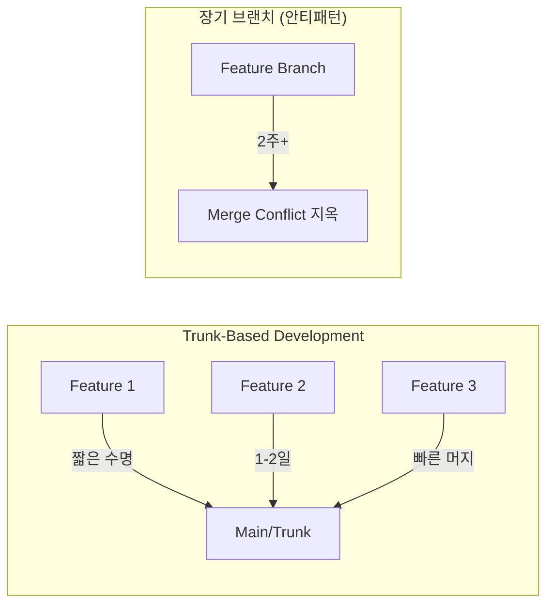

| 방식 | 브랜치 수명 | 충돌 빈도 | 권장 |
|------|------------|----------|------|
| **Trunk-Based** | 1-2일 | 낮음 | ✅ |
| **Long-Lived Branch** | 2주+ | 높음 | ❌ |

---

### 5.2 Self-Testing Builds

#### CI 서버의 역할

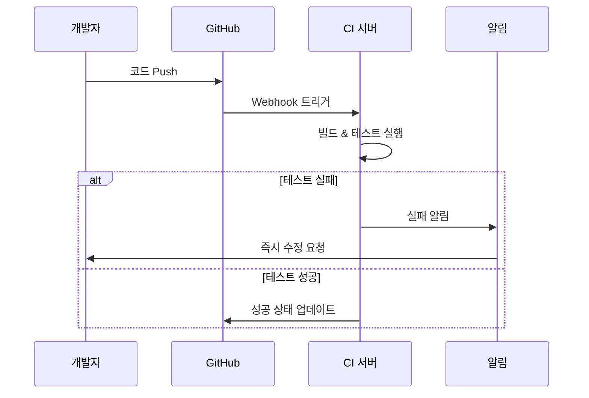

#### GitHub Actions 예제 - 앱 테스트

```yaml
# .github/workflows/app-tests.yml
name: App Tests

on:
  push:
    branches: [main]
  pull_request:
    branches: [main]

jobs:
  test:
    runs-on: ubuntu-latest

    steps:
      - uses: actions/checkout@v4

      - name: Setup Node.js
        uses: actions/setup-node@v4
        with:
          node-version: '20'
          cache: 'npm'

      - name: Install dependencies
        run: npm ci

      - name: Run tests
        run: npm test
```

#### GitHub Actions 예제 - 인프라 테스트

```yaml
# .github/workflows/infra-tests.yml
name: Infrastructure Tests

on:
  push:
    branches: [main]
    paths:
      - 'infra/**'
  pull_request:
    branches: [main]
    paths:
      - 'infra/**'

jobs:
  test:
    runs-on: ubuntu-latest

    steps:
      - uses: actions/checkout@v4

      - name: Setup OpenTofu
        uses: opentofu/setup-opentofu@v1

      - name: Tofu Init
        run: tofu init
        working-directory: infra

      - name: Tofu Validate
        run: tofu validate
        working-directory: infra

      - name: Tofu Test
        run: tofu test
        working-directory: infra
```

---

### 5.3 대규모 변경 처리

#### Branch by Abstraction

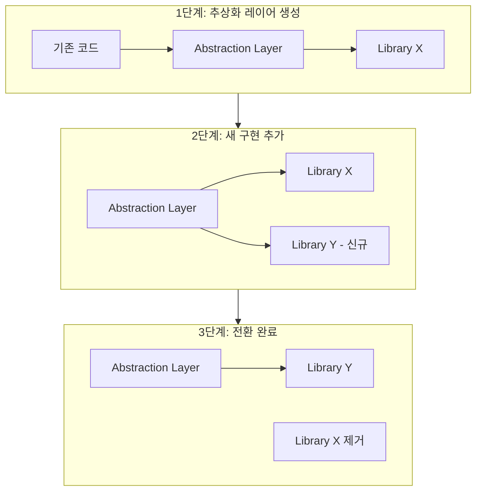

**사용 시점**:
- 라이브러리 교체 (e.g., jQuery → React)
- 대규모 리팩토링
- 데이터베이스 마이그레이션

**장점**:
- 점진적 변경 가능
- 롤백 용이
- 작은 PR로 분할 가능

#### Feature Toggles (Feature Flags)

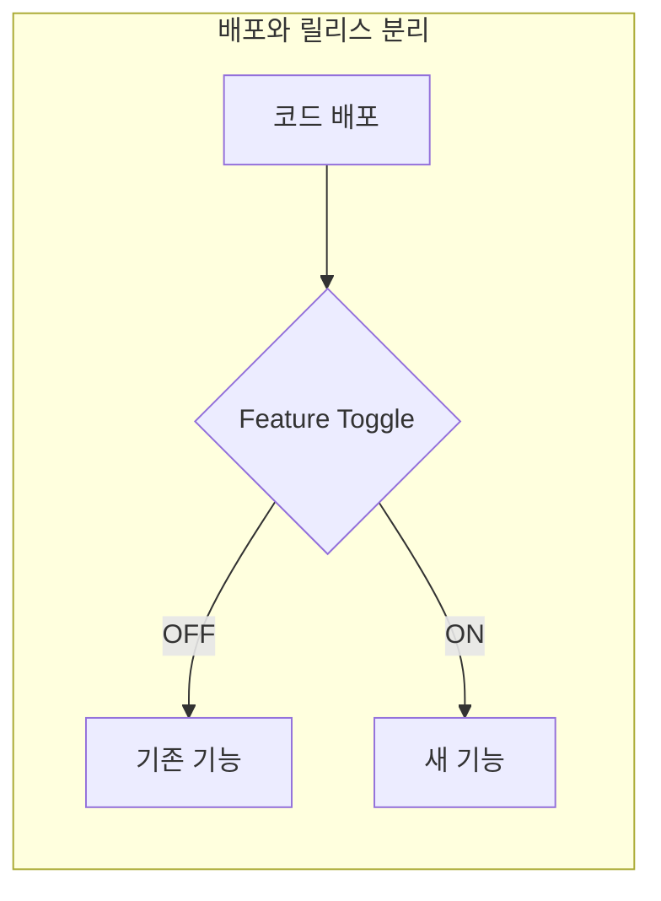

```javascript
// Feature Toggle 예제
const features = {
  NEW_CHECKOUT_FLOW: process.env.FEATURE_NEW_CHECKOUT === 'true',
  DARK_MODE: process.env.FEATURE_DARK_MODE === 'true',
};

function renderCheckout() {
  if (features.NEW_CHECKOUT_FLOW) {
    return <NewCheckoutFlow />;
  }
  return <LegacyCheckoutFlow />;
}
```

| 용도 | 설명 |
|------|------|
| **릴리스 토글** | 새 기능 점진적 롤아웃 |
| **실험 토글** | A/B 테스트 |
| **운영 토글** | 성능 문제 시 기능 비활성화 |
| **권한 토글** | 특정 사용자에게만 기능 제공 |

**"배포는 마케팅 결정이 아닌 기술 결정이어야 한다"**

---

### 5.4 CI 서버 인증

#### Machine User Credentials vs OIDC

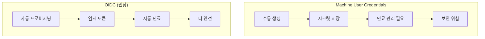

| 방식 | 장점 | 단점 |
|------|------|------|
| **Machine User** | 설정 간단 | 수동 관리, 만료 위험, 장기 유효 |
| **OIDC** | 자동 프로비저닝, 임시 토큰, 더 안전 | 초기 설정 복잡 |

#### GitHub Actions OIDC 설정 예제

```yaml
# AWS OIDC 연동
jobs:
  deploy:
    runs-on: ubuntu-latest
    permissions:
      id-token: write  # OIDC 토큰 요청 권한
      contents: read

    steps:
      - uses: actions/checkout@v4

      - name: Configure AWS Credentials
        uses: aws-actions/configure-aws-credentials@v4
        with:
          role-to-assume: arn:aws:iam::123456789:role/github-actions
          aws-region: ap-northeast-2
```

---

### 5.5 지속적 전달 (Continuous Delivery)

#### 배포 전략 개요

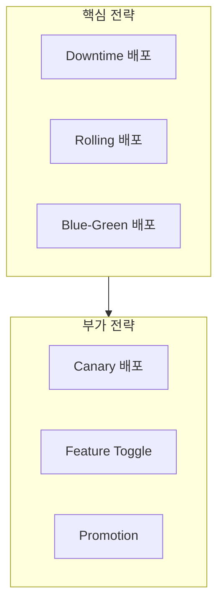

#### 1. Downtime 배포

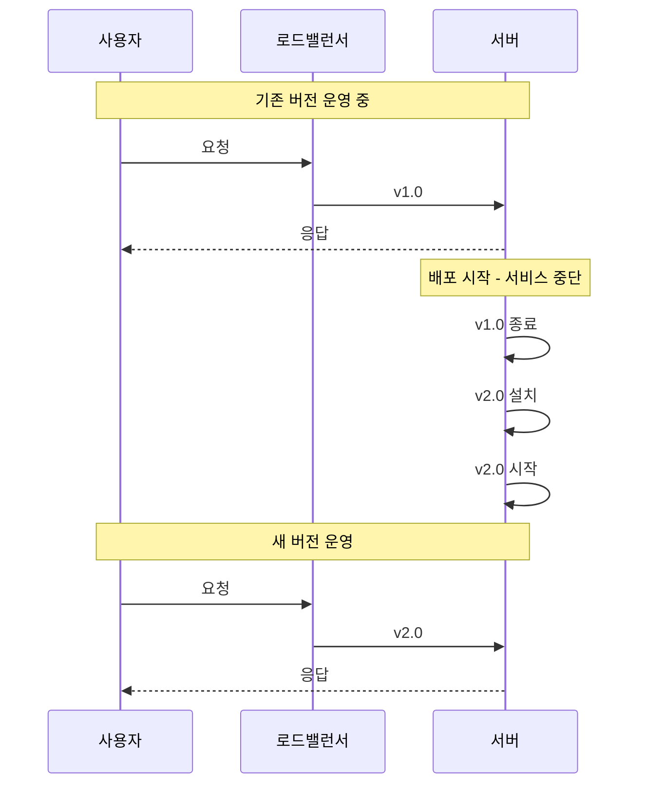

| 장점 | 단점 |
|------|------|
| 가장 간단 | 서비스 중단 발생 |
| 리소스 추가 불필요 | 사용자 경험 저하 |
| 상태 일관성 보장 | SLA 위반 가능 |

#### 2. Rolling 배포 (교체 없이)

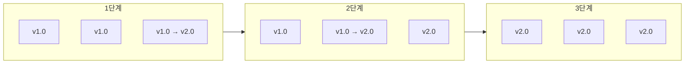

| 장점 | 단점 |
|------|------|
| 무중단 배포 | 일시적 용량 감소 |
| 리소스 추가 불필요 | 두 버전 동시 운영 |
| 점진적 롤아웃 | 롤백 시간 소요 |

#### 3. Rolling 배포 (교체 포함)

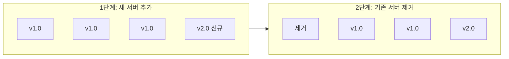

| 장점 | 단점 |
|------|------|
| 무중단 배포 | 일시적 리소스 증가 |
| 용량 유지 | 비용 증가 |
| 깨끗한 환경 | 복잡한 오케스트레이션 |

#### 4. Blue-Green 배포

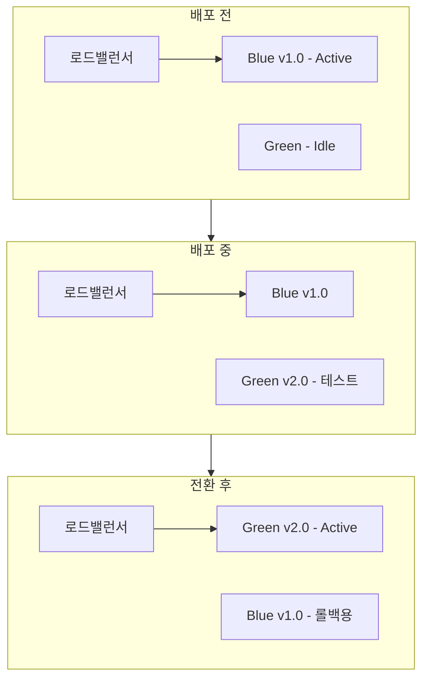

| 장점 | 단점 |
|------|------|
| 무중단 배포 | 2배 리소스 필요 |
| 즉시 롤백 가능 | 높은 비용 |
| 전체 테스트 가능 | 데이터 동기화 복잡 |

#### 배포 전략 비교표

| 전략 | 중단 시간 | 롤백 속도 | 리소스 | 복잡도 | 권장 상황 |
|------|----------|----------|--------|--------|----------|
| **Downtime** | 있음 | 느림 | 1x | 낮음 | 개발 환경, 점검 시간 |
| **Rolling (교체X)** | 없음 | 느림 | 1x | 중간 | 일반적인 상황 |
| **Rolling (교체O)** | 없음 | 중간 | 1.x | 중간 | 불변 인프라 |
| **Blue-Green** | 없음 | 빠름 | 2x | 높음 | 중요 서비스, 빠른 롤백 필요 |

---

### 5.6 부가 배포 전략

#### Canary 배포

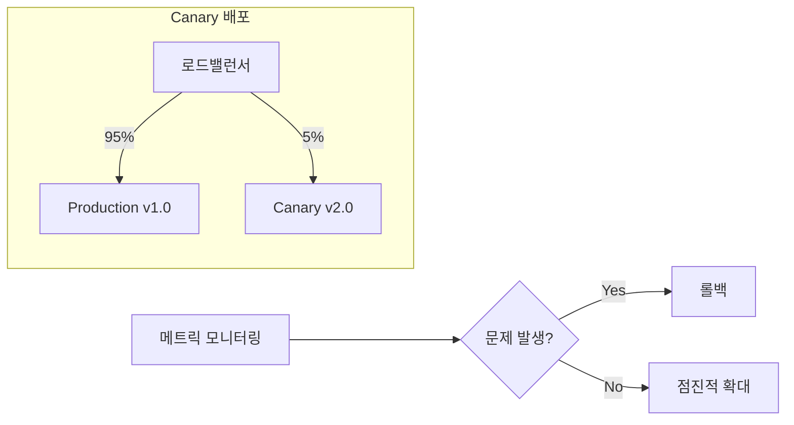

**단계적 롤아웃**:
1. 5% 트래픽 → Canary
2. 모니터링 (에러율, 지연시간)
3. 문제 없으면 25% → 50% → 100%
4. 문제 발생 시 즉시 롤백

#### Feature Toggle 기반 배포

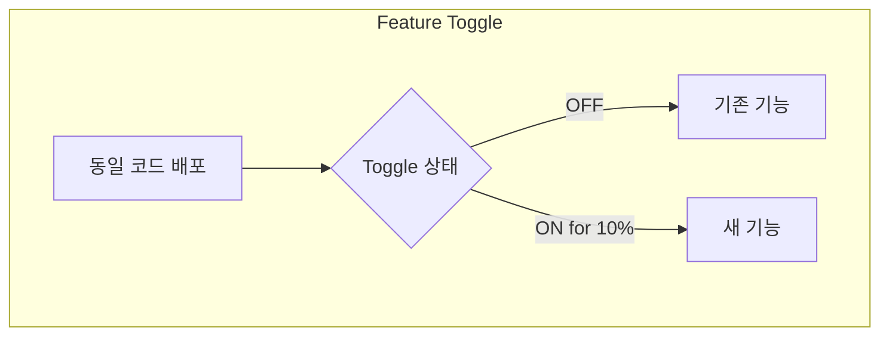

| Canary | Feature Toggle |
|--------|----------------|
| 트래픽 기반 분할 | 사용자/기능 기반 분할 |
| 인프라 레벨 | 애플리케이션 레벨 |
| 전체 앱 영향 | 특정 기능만 영향 |

#### Promotion (환경 승격)

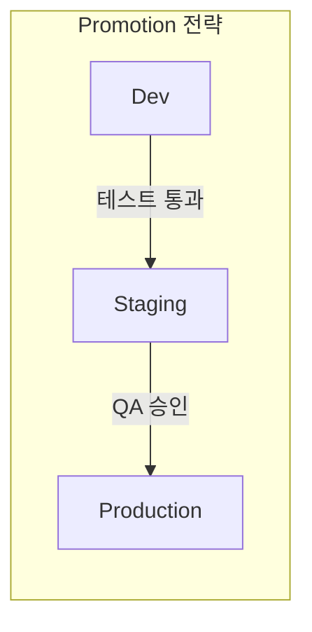

| 환경 | 목적 | 데이터 |
|------|------|--------|
| **Dev** | 개발자 테스트 | 목 데이터 |
| **Staging** | 통합 테스트 | 프로덕션 유사 |
| **Production** | 실제 서비스 | 실제 데이터 |

---

### 5.7 배포 파이프라인

#### 파이프라인 구조

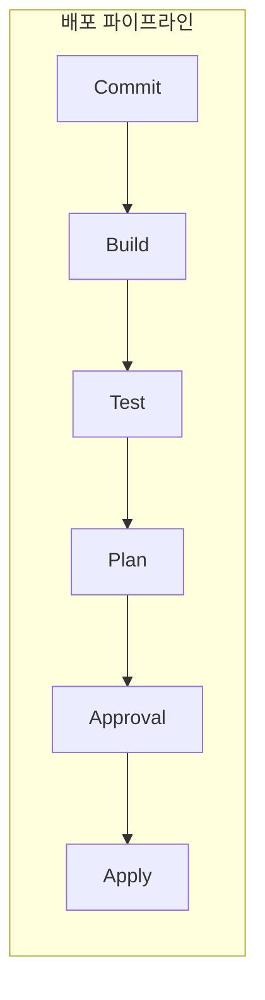

#### GitOps 4원칙

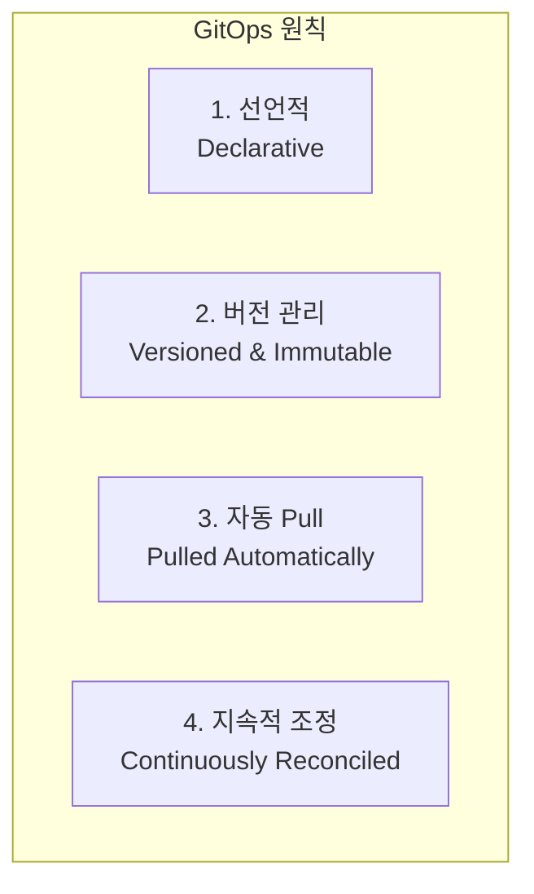

| 원칙 | 설명 |
|------|------|
| **Declarative** | 원하는 상태를 선언 (how가 아닌 what) |
| **Versioned & Immutable** | Git에 버전 관리, 감사 추적 가능 |
| **Pulled Automatically** | 에이전트가 자동으로 변경 감지 |
| **Continuously Reconciled** | 현재 상태를 원하는 상태로 지속 조정 |

#### GitHub Actions - Plan 워크플로우

```yaml
# .github/workflows/tofu-plan.yml
name: OpenTofu Plan

on:
  pull_request:
    branches: [main]
    paths:
      - 'infra/**'

permissions:
  id-token: write
  contents: read
  pull-requests: write

jobs:
  plan:
    runs-on: ubuntu-latest

    steps:
      - uses: actions/checkout@v4

      - name: Configure AWS Credentials
        uses: aws-actions/configure-aws-credentials@v4
        with:
          role-to-assume: ${{ secrets.AWS_ROLE_ARN }}
          aws-region: ap-northeast-2

      - name: Setup OpenTofu
        uses: opentofu/setup-opentofu@v1

      - name: Tofu Init
        run: tofu init
        working-directory: infra

      - name: Tofu Plan
        id: plan
        run: tofu plan -no-color -out=tfplan
        working-directory: infra

      - name: Comment Plan on PR
        uses: actions/github-script@v7
        with:
          script: |
            const output = `#### Terraform Plan 📖
            \`\`\`
            ${{ steps.plan.outputs.stdout }}
            \`\`\`
            `;
            github.rest.issues.createComment({
              issue_number: context.issue.number,
              owner: context.repo.owner,
              repo: context.repo.repo,
              body: output
            });
```

#### GitHub Actions - Apply 워크플로우

```yaml
# .github/workflows/tofu-apply.yml
name: OpenTofu Apply

on:
  push:
    branches: [main]
    paths:
      - 'infra/**'

permissions:
  id-token: write
  contents: read

jobs:
  apply:
    runs-on: ubuntu-latest
    environment: production  # 수동 승인 필요

    steps:
      - uses: actions/checkout@v4

      - name: Configure AWS Credentials
        uses: aws-actions/configure-aws-credentials@v4
        with:
          role-to-assume: ${{ secrets.AWS_ROLE_ARN }}
          aws-region: ap-northeast-2

      - name: Setup OpenTofu
        uses: opentofu/setup-opentofu@v1

      - name: Tofu Init
        run: tofu init
        working-directory: infra

      - name: Tofu Apply
        run: tofu apply -auto-approve
        working-directory: infra
```

#### S3 Backend 설정

```hcl
# infra/backend.tf
terraform {
  backend "s3" {
    bucket         = "my-terraform-state"
    key            = "prod/terraform.tfstate"
    region         = "ap-northeast-2"
    dynamodb_table = "terraform-locks"
    encrypt        = true
  }
}
```

---

### 5.8 파이프라인 권장사항

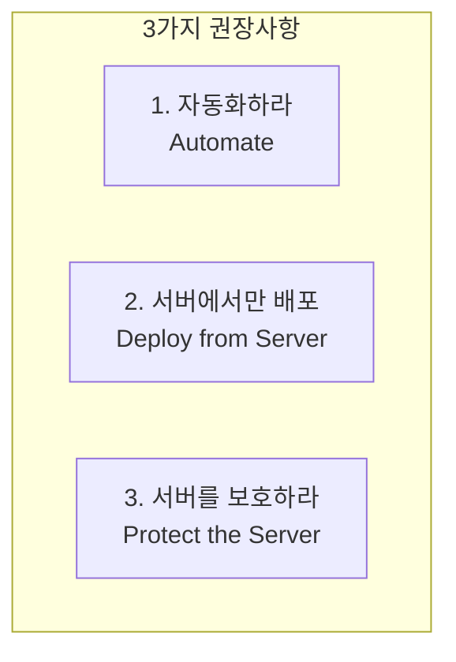

#### 1. 자동화하라 (Automate)

| 수동 배포 | 자동 배포 |
|----------|----------|
| 인적 오류 발생 | 일관된 실행 |
| 속도 느림 | 빠른 배포 |
| 재현 어려움 | 재현 가능 |
| 문서화 부족 | 코드가 문서 |

#### 2. 서버에서만 배포 (Deploy from Server)

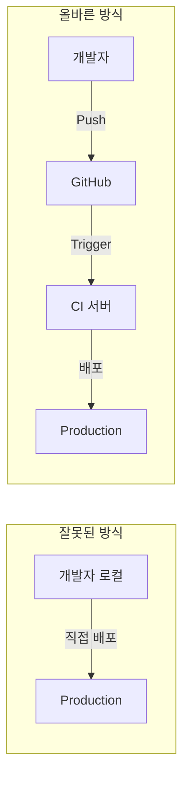

**로컬 배포의 문제점**:
- 환경 불일치
- 감사 추적 불가
- 권한 관리 어려움
- 실수 위험

#### 3. 서버를 보호하라 (Protect the Server)

| 보호 방법 | 설명 |
|----------|------|
| **네트워크 격리** | Private subnet에 배치 |
| **최소 권한** | 필요한 권한만 부여 |
| **감사 로깅** | 모든 작업 기록 |
| **비밀 관리** | 시크릿 매니저 사용 |
| **접근 제어** | IP 화이트리스트, MFA |

---

## 💡 실무 적용 포인트

### CI/CD 파이프라인 체크리스트

```
□ CI 설정
  ├── trunk-based development 적용
  ├── PR마다 자동 테스트 실행
  ├── 빌드 실패 시 즉시 알림
  └── 코드 리뷰 필수화

□ CD 설정
  ├── 배포 전략 선택 (환경에 맞게)
  ├── 자동 롤백 메커니즘
  ├── 배포 승인 프로세스
  └── 환경별 파이프라인 분리

□ 보안
  ├── OIDC 사용 (Machine User 대신)
  ├── 최소 권한 원칙
  ├── 시크릿 관리
  └── 감사 로깅
```

### 배포 전략 선택 가이드

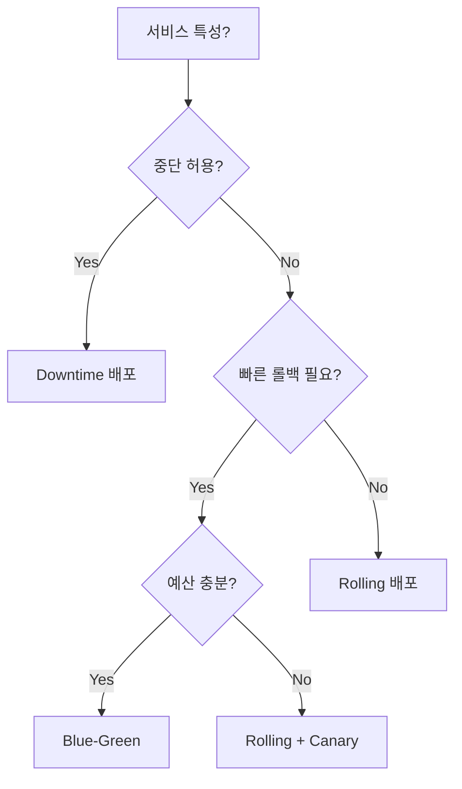

### GitHub Actions 구조 예시

```
.github/
└── workflows/
    ├── app-tests.yml      # PR: 앱 테스트
    ├── infra-tests.yml    # PR: 인프라 테스트
    ├── tofu-plan.yml      # PR: Plan 결과 코멘트
    └── tofu-apply.yml     # Main: 자동 Apply
```

---

## ✅ 핵심 개념 체크리스트

- [ ] CI: 하루에 여러 번 통합, 자동화된 테스트
- [ ] "아프면 더 자주 하라" 원칙 이해
- [ ] Trunk-based development vs Long-lived branches
- [ ] Branch by abstraction으로 대규모 변경 처리
- [ ] Feature toggles로 배포와 릴리스 분리
- [ ] OIDC가 Machine User보다 안전한 이유
- [ ] 배포 전략 4가지: Downtime, Rolling, Blue-Green, Canary
- [ ] GitOps 4원칙: 선언적, 버전관리, 자동 Pull, 지속적 조정
- [ ] 파이프라인 3원칙: 자동화, 서버 배포, 서버 보호

---

## 🔑 Key Takeaways

1. **Integration**: 코드 통합의 고통을 줄이는 방법은 더 자주 통합하는 것이다
2. **Self-testing builds**: CI 서버가 모든 커밋에서 자동으로 테스트를 실행해야 한다
3. **Feature toggles**: 배포와 릴리스를 분리하면 배포가 기술 결정이 된다
4. **Deployment strategies**: 핵심(Downtime/Rolling/Blue-Green)과 부가(Canary/Toggle/Promotion) 전략을 조합하라
5. **Pipeline protection**: 배포는 CI 서버에서만, 서버는 보호하라

---

## 🔗 참고 자료

- [Martin Fowler - Continuous Integration](https://martinfowler.com/articles/continuousIntegration.html)
- [Trunk-Based Development](https://trunkbaseddevelopment.com/)
- [GitHub Actions Documentation](https://docs.github.com/en/actions)
- [GitOps Principles](https://opengitops.dev/)
- [Feature Toggles (Feature Flags)](https://martinfowler.com/articles/feature-toggles.html)

---

## 📚 다음 챕터 미리보기

- **Chapter 6**: 네트워킹 기초 - TCP/IP, DNS, HTTP, 그리고 AWS VPC 구성 방법
