# Chapter 6: How to Work with Multiple Teams and Environments (다중 팀과 환경 관리)

## 📌 핵심 요약

> **"규모의 문제를 해결하는 가장 일반적인 방법은 분할 정복(Divide and Conquer)이다. 배포를 여러 환경으로 분리하고, 코드베이스를 여러 라이브러리와 서비스로 분할하여 각 부분을 독립적으로 관리할 수 있게 한다."**

이 챕터에서는 회사가 성장함에 따라 발생하는 규모의 문제를 해결하기 위한 배포 환경 분리와 코드베이스 분할 전략을 학습한다.

---

## 🎯 학습 목표

이 챕터를 완료하면 다음을 할 수 있다:

- [ ] 다중 환경이 필요한 이유와 설정 방법 이해
- [ ] AWS Organizations로 다중 계정 구성
- [ ] 코드베이스를 라이브러리와 서비스로 분할하는 방법 파악
- [ ] 라이브러리 분할 vs 서비스 분할의 장단점 비교
- [ ] Kubernetes에서 마이크로서비스 배포
- [ ] 분할의 비용과 이점을 이해하고 적절한 시점 판단

---

## 📖 본문 정리

### 6.1 규모의 문제 (Problems of Scale)

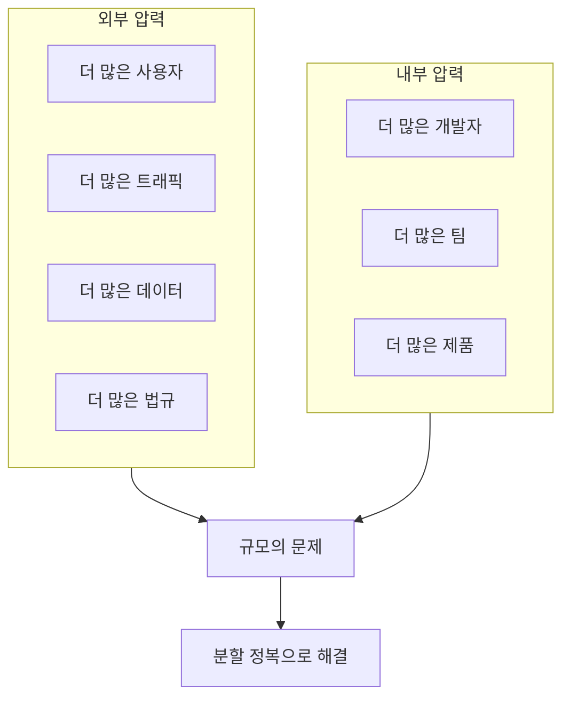

**해결 전략**:
| 전략 | 설명 |
|------|------|
| **배포 분리** | 소프트웨어를 여러 격리된 환경에 배포 |
| **코드베이스 분할** | 코드베이스를 여러 라이브러리/서비스로 분할 |

---

### 6.2 배포 환경 분리 (Breaking Up Deployments)

#### 다중 환경이 필요한 이유

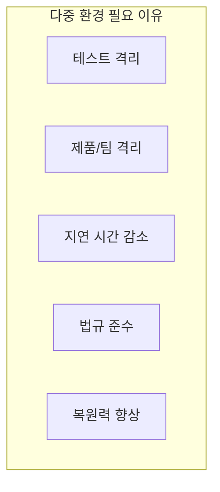

##### 1. 테스트 격리 (Isolating Tests)

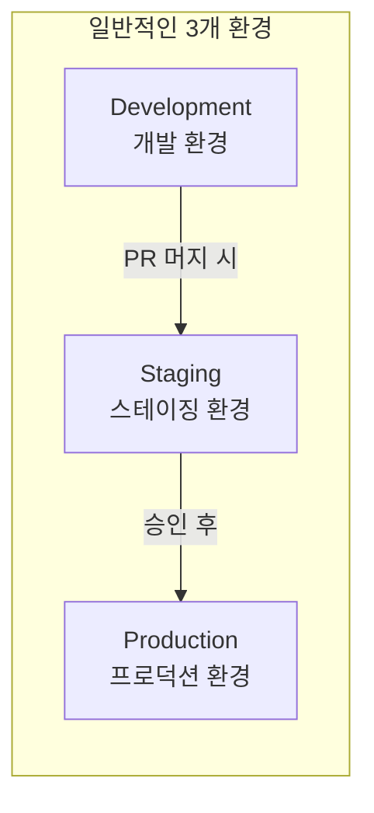

| 환경 | 목적 | 노출 대상 |
|------|------|----------|
| **Development** | 개발 중 변경 테스트, PR 머지마다 배포 | 개발팀 |
| **Staging** | 프로덕션 배포 전 연습, 축소된 프로덕션 클론 | 직원, 일부 파트너 |
| **Production** | 실제 사용자 서비스 | 모든 사용자 |

##### 2. 제품/팀 격리 (Isolating Products and Teams)

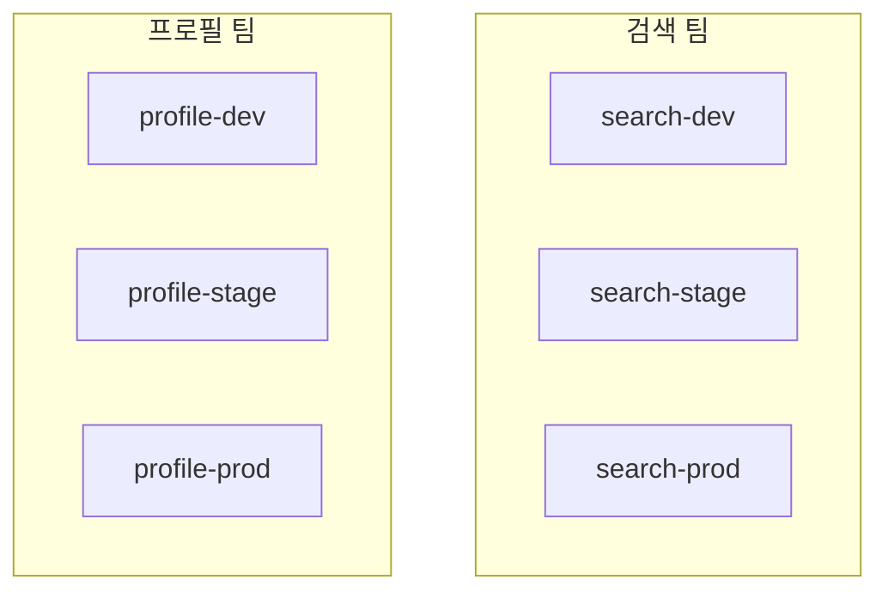

**장점**:
- 팀별로 환경 커스터마이징 가능
- 한 팀의 문제가 다른 팀에 영향 최소화
- 팀 간 독립적 작업 가능

##### 3. 지연 시간 감소 (Reducing Latency)

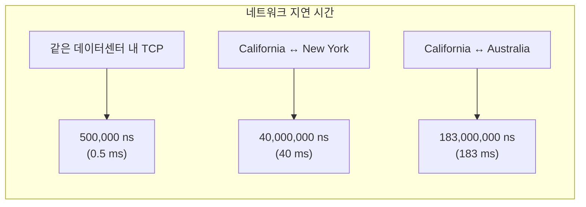

**일반적인 컴퓨터 작업 지연 시간**:

| 작업 | 시간 (ns) |
|------|-----------|
| CPU 캐시 (L1) 읽기 | 1 |
| 메인 메모리 (DRAM) 읽기 | 100 |
| 1KB Zippy 압축 | 2,000 |
| SSD 랜덤 읽기 | 16,000 |
| 데이터센터 내 TCP 왕복 | 500,000 |
| 회전 디스크 랜덤 읽기 | 2,000,000 |
| CA ↔ NY TCP 왕복 | 40,000,000 |
| CA ↔ 호주 TCP 왕복 | 183,000,000 |

##### 4. 법규 준수 (Compliance)

| 규정 | 적용 대상 |
|------|----------|
| **PCI DSS** | 신용카드 정보 처리 |
| **HIPAA/HITRUST** | 의료 정보 처리 |
| **FedRAMP** | 미국 정부 소프트웨어 |
| **GDPR** | EU 데이터 레지던시 |

##### 5. 복원력 향상 (Resiliency)

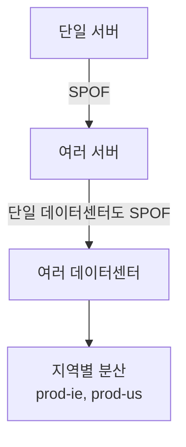

---

#### 다중 환경 설정 방법

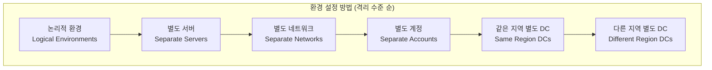

| 방법 | 격리 수준 | 복원력 | 운영 오버헤드 |
|------|----------|--------|--------------|
| **논리적 환경** | 최저 | 최저 | 최저 |
| **별도 서버** | 낮음 | 낮음 | 낮음 |
| **별도 네트워크** | 중간 | 중간 | 중간 |
| **별도 계정** | 높음 | 높음 | 높음 |
| **같은 지역 별도 DC** | 매우 높음 | 매우 높음 | 매우 높음 |
| **다른 지역 별도 DC** | 최고 | 최고 | 최고 |

---

#### 다중 환경의 과제

##### 1. 운영 오버헤드 증가

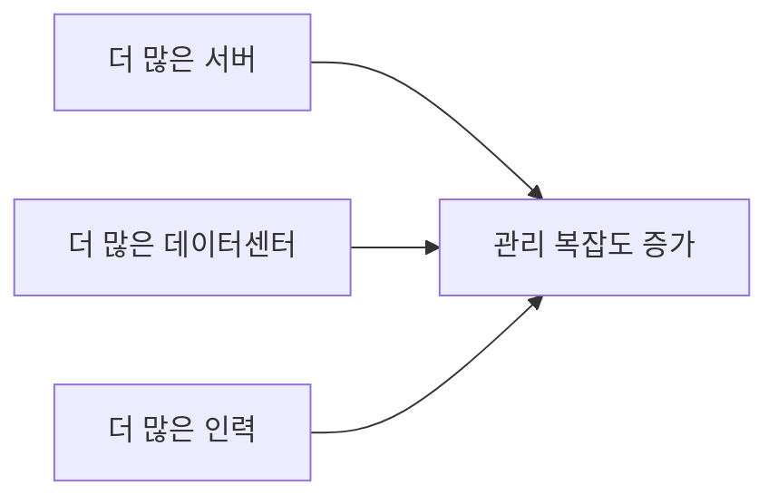

##### 2. 데이터 저장 복잡도 증가

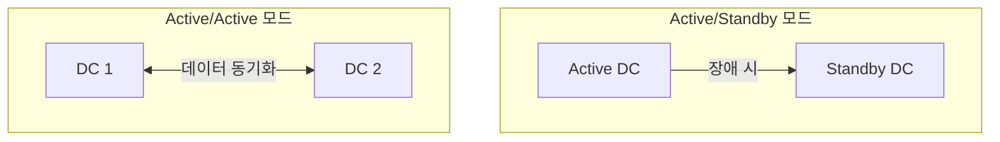

| 모드 | 장점 | 단점 |
|------|------|------|
| **Active/Standby** | 데이터 일관성 유지 쉬움 | 지연 시간 개선 안됨 |
| **Active/Active** | 지연 시간 개선 | 아키텍처 재설계 필요 |

**Active/Active 시 고려사항**:
- Primary Key 생성 방식 변경 (auto-increment 불가)
- 데이터 일관성 (uniqueness, foreign key, transaction)
- 다중 DB 조회 및 조인

##### 3. 애플리케이션 설정 복잡도 증가

**환경별 다른 설정 항목**:
- 성능 설정 (CPU, 메모리, GC)
- 보안 설정 (DB 비밀번호, API 키, TLS 인증서)
- 네트워킹 설정 (IP, 포트, 도메인)
- 서비스 디스커버리 설정
- 기능 설정 (Feature toggles)

**Google 장애 원인 통계 (2010-2017)**:

| 원인 | 비율 |
|------|------|
| 바이너리 배포 | 37% |
| **설정 변경** | **31%** |
| 사용자 행동 변화 | 9% |
| 처리 파이프라인 | 6% |
| 서비스 제공자 변경 | 5% |

**설정 관리 방법**:

| 방법 | 설명 | 권장 사용 |
|------|------|----------|
| **빌드 타임 설정** | 버전 관리에 체크인된 설정 파일 (JSON, YAML) | 대부분의 설정 |
| **런타임 설정** | 데이터 스토어에서 읽기 (Consul, etcd) | 자주 변경되는 설정 |

---

#### 예제: AWS 다중 계정 설정

##### AWS Organizations 구조

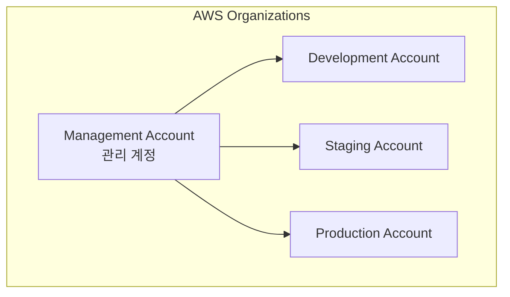

##### Child Accounts 생성 (OpenTofu)

```hcl
# ch6/tofu/live/child-accounts/main.tf
provider "aws" {
  region = "us-east-2"
}

module "child_accounts" {
  source  = "brikis98/devops/book//modules/aws-organizations"
  version = "1.0.0"

  create_organization = true

  accounts = {
    development = "username+dev@email.com"
    staging     = "username+stage@email.com"
    production  = "username+prod@email.com"
  }
}
```

##### 환경별 변수 정의 파일

```hcl
# dev.tfvars
environment = "development"
memory_size = 128

# stage.tfvars
environment = "staging"
memory_size = 128

# prod.tfvars
environment = "production"
memory_size = 256  # 프로덕션은 더 많은 리소스
```

##### 환경별 배포 명령어

```bash
# Dev 환경 배포
$ tofu init -var-file=dev.tfvars -reconfigure
$ AWS_PROFILE=dev-admin tofu apply -var-file=dev.tfvars

# Stage 환경 배포
$ tofu init -var-file=stage.tfvars -reconfigure
$ AWS_PROFILE=stage-admin tofu apply -var-file=stage.tfvars

# Prod 환경 배포
$ tofu init -var-file=prod.tfvars -reconfigure
$ AWS_PROFILE=prod-admin tofu apply -var-file=prod.tfvars
```

---

### 6.3 코드베이스 분할 (Breaking Up Your Codebase)

#### 코드베이스 분할이 필요한 이유

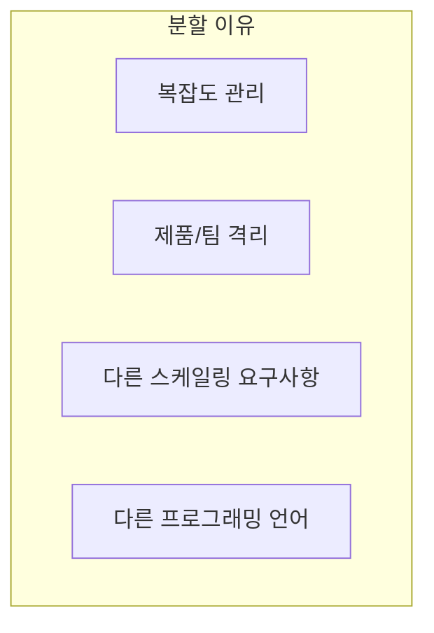

##### 복잡도와 버그 밀도

| 프로젝트 크기 (LOC) | 버그 밀도 (버그/1K LOC) |
|---------------------|------------------------|
| < 2K | 0–25 |
| 2K–6K | 0–40 |
| 16K–64K | 0.5–50 |
| 64K–512K | 2–70 |
| > 512K | 4–100 |

**핵심 통찰**: 같은 개발자가 같은 100줄의 코드를 추가해도:
- 작은 프로젝트 (< 2K LOC): 0-2개 버그
- 큰 프로젝트 (> 512K LOC): 최대 10개 버그

---

#### 분할 방법 1: 라이브러리로 분할

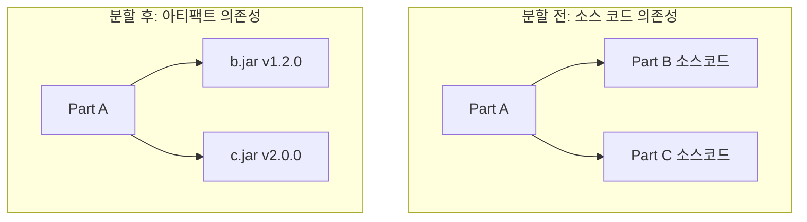

**라이브러리 분할 장점**:
- 작은 부분에 집중 가능
- 팀별 독립적 개발 가능
- 버전 관리로 변경 영향 통제

##### 라이브러리 분할 권장 사항

**1. 시맨틱 버저닝 (SemVer)**

```
MAJOR.MINOR.PATCH

예시: 1.2.3
- MAJOR (1): 호환되지 않는 API 변경
- MINOR (2): 하위 호환 기능 추가
- PATCH (3): 하위 호환 버그 수정
```

**2. 자동 업데이트 설정**

| 도구 | 설명 |
|------|------|
| **Dependabot** | GitHub 내장, 자동 PR 생성 |
| **Renovate** | 다양한 플랫폼 지원 |
| **Patcher** | 엔터프라이즈 패칭 |

---

#### 분할 방법 2: 서비스로 분할

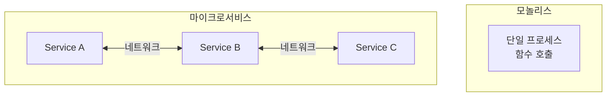

**서비스 분할 장점**:

| 장점 | 설명 |
|------|------|
| **팀 격리** | 각 서비스를 다른 팀이 소유 |
| **다중 언어** | 서비스별 다른 언어 사용 가능 |
| **독립적 스케일링** | 서비스별 개별 확장 가능 |

---

#### 코드베이스 분할의 과제

##### 1. 다중 코드베이스 관리의 어려움

**모놀리스에서 함수명 변경 (foo → bar)**:
1. B에서 foo를 bar로 이름 변경
2. foo 참조하는 모든 곳 업데이트
3. 완료

**별도 라이브러리에서 함수명 변경**:
1. 팀 논의 (breaking change 여부)
2. B에서 foo를 bar로 이름 변경
3. 새 버전 릴리스 (MAJOR 버전 증가)
4. 마이그레이션 문서 작성
5. 의존하는 모든 팀이 개별적으로 업데이트
6. 완료

**별도 서비스에서 엔드포인트 변경**:
1. 팀 논의
2. bar 엔드포인트 추가 (foo 유지)
3. 새 버전 배포
4. 모든 사용자에게 알림
5. 모든 팀이 foo → bar 전환 대기 (수주~수개월)
6. foo 사용량 0 확인 후 제거
7. 완료

##### 2. 통합의 어려움

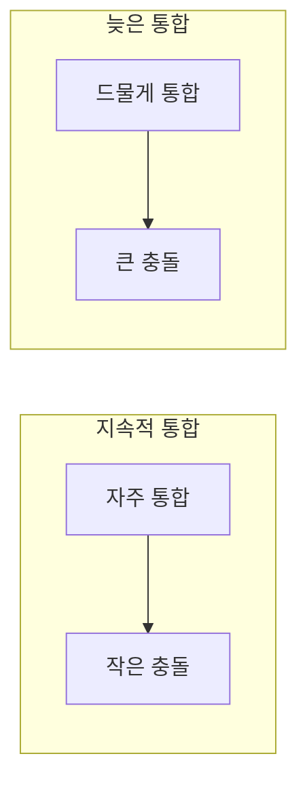

**의존성 지옥 (Dependency Hell)**:

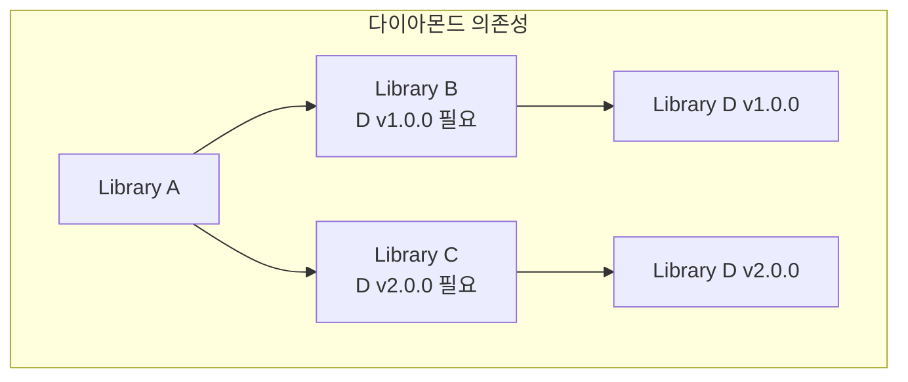

문제점:
- 너무 많은 의존성
- 긴 의존성 체인
- 다이아몬드 의존성 충돌

##### 3. 다중 서비스 관리의 어려움

**배포 순서 오버헤드**:

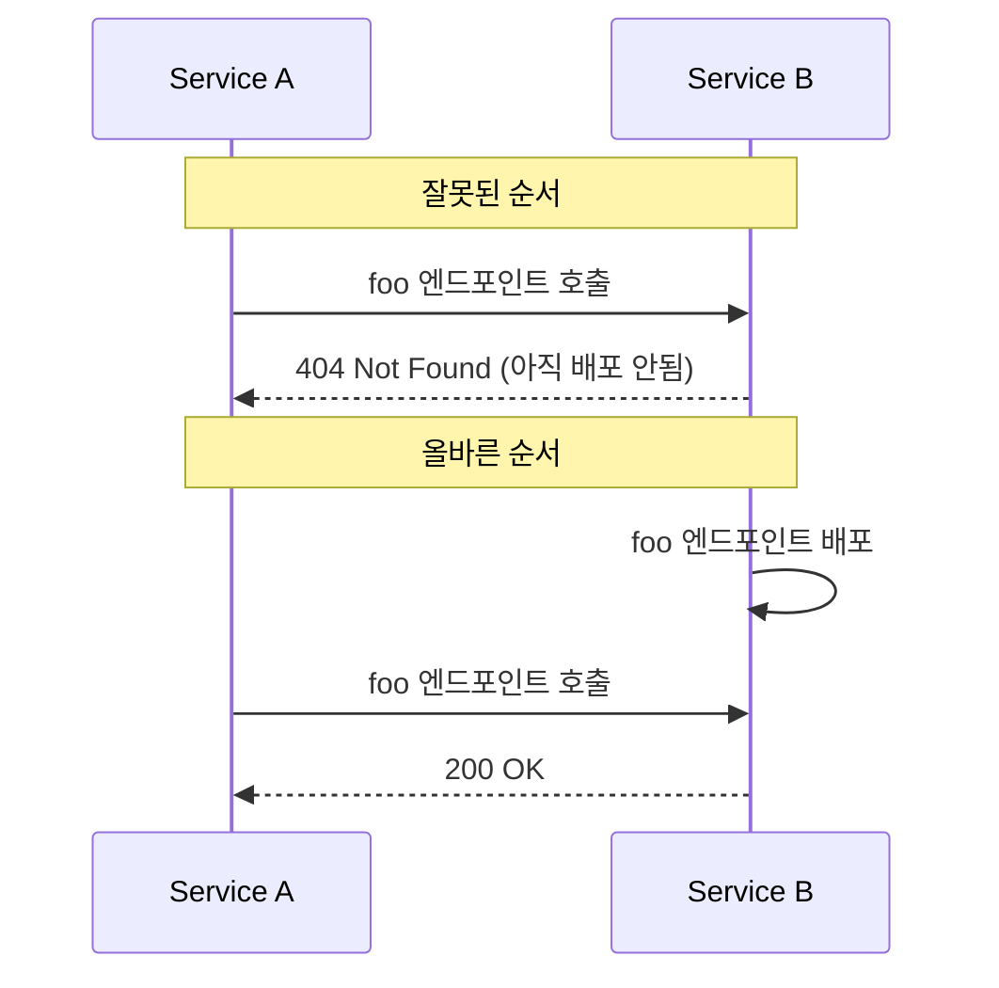

**디버깅 오버헤드**:
- 여러 서비스의 로그 확인 필요
- 분산 트레이싱 도구 필요
- 로컬 환경에서 전체 재현 어려움

**인프라 오버헤드**:
- Kubernetes (오케스트레이션)
- Istio (서비스 메시)
- Kafka (비동기 메시징)
- Jaeger (분산 트레이싱)

**성능 오버헤드**:

| 통신 방식 | 지연 시간 |
|----------|----------|
| 메인 메모리 읽기 | 100 ns |
| 데이터센터 내 TCP | 500,000 ns |
| **배수** | **5,000x 느림** |

**분산 시스템 복잡도**:
- 새로운 실패 모드 (네트워크 다운, 타임아웃, 부분 응답)
- I/O 복잡도 (스레드 풀, 비동기 I/O)
- 데이터 저장 복잡도

---

#### 분할 시점 판단

**분할을 고려할 신호**:

| 패턴 | 설명 |
|------|------|
| **함께 변경되는 파일** | X 변경 시 A 파일들, Y 변경 시 B 파일들 |
| **팀이 집중하는 파일** | 팀 X가 90% A 파일, 팀 Y가 90% B 파일 |
| **오픈소스가 될 수 있는 부분** | 독립적 라이브러리/API로 분리 가능 |
| **성능 병목** | 특정 부분이 90% 시간 소요 |

**분할하지 말아야 할 때**:
- 작은 스타트업 (3인 팀에 12개 마이크로서비스는 과도함)
- 경계가 명확하지 않을 때
- 자주 전역 변경이 필요할 때

---

#### 예제: Kubernetes 마이크로서비스 배포

##### 아키텍처

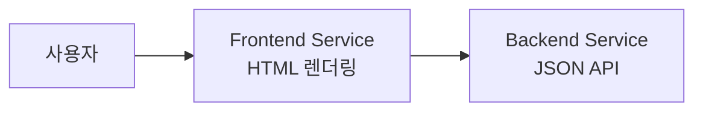

##### Backend Service

```javascript
// app.js
app.get('/', (req, res) => {
  res.json({text: "backend microservice"});
});
```

```yaml
# sample-app-backend/sample-app-service.yml
metadata:
  name: sample-app-backend-service
spec:
  type: ClusterIP  # 클러스터 내부에서만 접근 가능
  selector:
    app: sample-app-backend-pods
  ports:
    - protocol: TCP
      port: 80
      targetPort: 8080
```

##### Frontend Service

```javascript
// app.js
const backendHost = 'http://sample-app-backend-service'; // K8s DNS

app.get('/', async (req, res) => {
  const response = await fetch(backendHost);
  const responseBody = await response.json();
  res.render('hello', {name: responseBody.text});
});
```

```yaml
# sample-app-frontend/sample-app-service.yml
metadata:
  name: sample-app-frontend-loadbalancer
spec:
  type: LoadBalancer  # 외부에서 접근 가능
  selector:
    app: sample-app-frontend-pods
```

##### Kubernetes 서비스 디스커버리

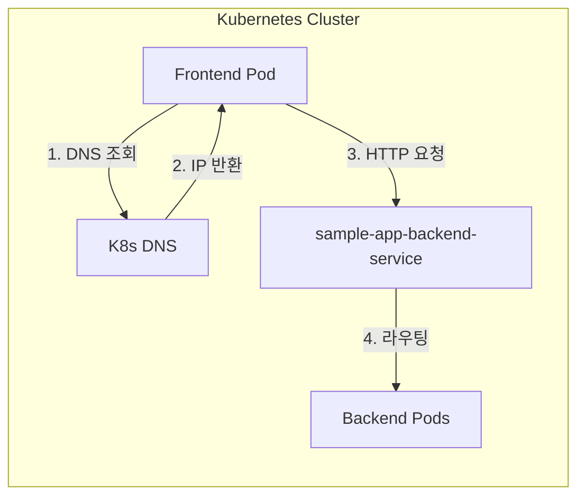

**핵심**: Kubernetes에서 Service를 `foo`로 생성하면, `http://foo`로 자동 접근 가능

##### 배포 명령어

```bash
# Backend 배포
$ cd sample-app-backend
$ npm run dockerize
$ kubectl apply -f sample-app-deployment.yml
$ kubectl apply -f sample-app-service.yml

# Frontend 배포
$ cd sample-app-frontend
$ npm run dockerize
$ kubectl apply -f sample-app-deployment.yml
$ kubectl apply -f sample-app-service.yml

# 확인
$ kubectl get services
NAME                               TYPE           EXTERNAL-IP   PORT(S)
sample-app-backend-service         ClusterIP      <none>        80/TCP
sample-app-frontend-loadbalancer   LoadBalancer   localhost     80:32081/TCP
```

---

## 💡 실무 적용 포인트

### 다중 환경 체크리스트

```
□ 환경 분리 전략
  ├── 테스트 격리 (dev/stage/prod)
  ├── 팀/제품 격리
  ├── 지연 시간 요구사항 확인
  └── 법규 준수 요구사항 확인

□ 환경 설정 방법 선택
  ├── AWS: 별도 계정 (Organizations)
  ├── Kubernetes: 별도 네임스페이스 또는 클러스터
  └── 네트워크 격리 수준 결정

□ 설정 관리
  ├── 환경별 .tfvars 파일
  ├── 빌드 타임 설정 (대부분)
  └── 런타임 설정 (자주 변경되는 것만)
```

### 코드베이스 분할 결정 가이드

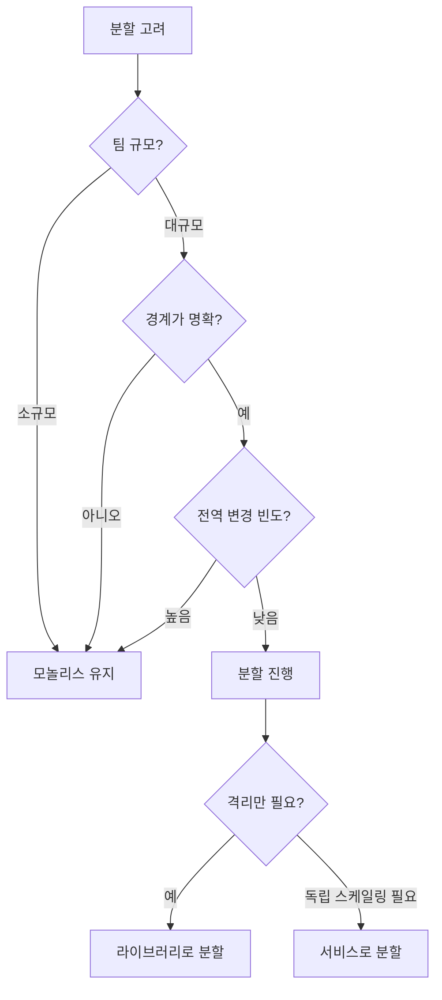

### 마이크로서비스 도입 시 고려사항

| 고려 항목 | 질문 |
|----------|------|
| **팀 규모** | 서비스당 최소 한 팀이 소유할 수 있는가? |
| **운영 역량** | K8s, 서비스 메시, 분산 트레이싱 운영 가능한가? |
| **경계 명확성** | 서비스 간 상호작용이 제한적인가? |
| **전역 변경** | 여러 서비스 동시 변경이 드문가? |

---

## ✅ 핵심 개념 체크리스트

- [ ] 다중 환경 필요 이유: 테스트 격리, 팀 격리, 지연 시간, 법규, 복원력
- [ ] 환경 설정 방법: 논리적 → 서버 → 네트워크 → 계정 → DC
- [ ] 설정 변경이 코드 변경만큼 위험 (Google 장애 31%)
- [ ] AWS Organizations로 다중 계정 관리
- [ ] 라이브러리 분할: 버전 아티팩트, SemVer, 자동 업데이트
- [ ] 서비스 분할: 팀 격리, 다중 언어, 독립 스케일링
- [ ] 분할 비용: 전역 변경 어려움, 통합 지연, 운영 오버헤드
- [ ] Kubernetes 서비스 디스커버리: Service 이름으로 DNS 접근

---

## 🔑 Key Takeaways

1. **환경 분리**: 배포를 여러 환경으로 분리하면 테스트를 프로덕션에서 격리하고 팀을 서로 격리할 수 있다
2. **다중 리전**: 여러 리전에 배포하면 지연 시간 감소, 복원력 향상, 법규 준수가 가능하지만 아키텍처 재설계가 필요할 수 있다
3. **설정 위험**: 설정 변경은 코드 변경만큼 장애를 유발할 가능성이 높다
4. **라이브러리 분할**: 코드베이스를 라이브러리로 분할하면 개발자가 한 번에 작은 부분에 집중할 수 있다
5. **서비스 분할**: 코드베이스를 서비스로 분할하면 각 부분을 독립적으로 소유, 개발, 스케일링할 수 있다
6. **변경 속도 트레이드오프**: 코드베이스를 분할하면 각 부분 내 변경은 빨라지지만, 전체 코드베이스에 걸친 변경과 통합은 느려진다
7. **늦은 통합**: 코드베이스를 여러 부분으로 분할하는 것은 CI 대신 늦은 통합을 선택하는 것이므로, 부분들이 진정으로 독립적일 때만 해야 한다
8. **분할 비용**: 라이브러리와 서비스로 분할하는 것은 상당한 비용이 있다. 이점이 비용을 초과할 때만 해야 하며, 이는 보통 더 큰 규모에서 발생한다

---

## 🔗 참고 자료

- [AWS Organizations](https://docs.aws.amazon.com/organizations/)
- [AWS Multi-Account Strategy](https://docs.aws.amazon.com/whitepapers/latest/organizing-your-aws-environment/organizing-your-aws-environment.html)
- [Semantic Versioning](https://semver.org/)
- [Kubernetes Services](https://kubernetes.io/docs/concepts/services-networking/service/)
- [Microservices Patterns](https://microservices.io/)

---

## 📚 다음 챕터 미리보기

- **Chapter 7**: 네트워킹 기초 - TCP/IP, DNS, HTTP, 그리고 AWS VPC를 사용한 네트워크 격리 및 서비스 디스커버리
