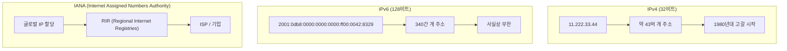
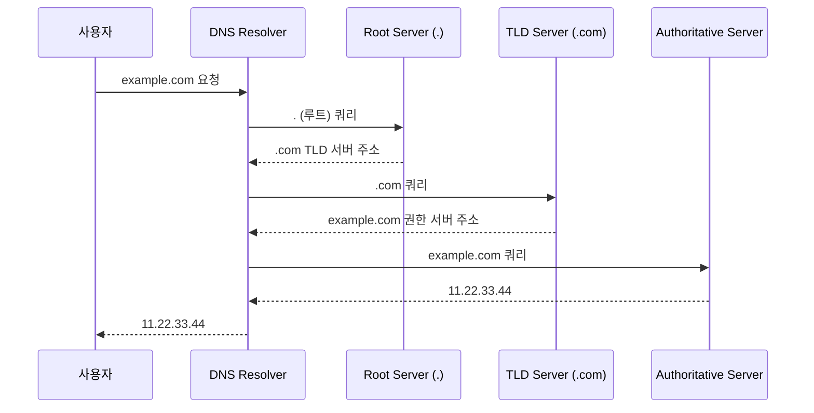
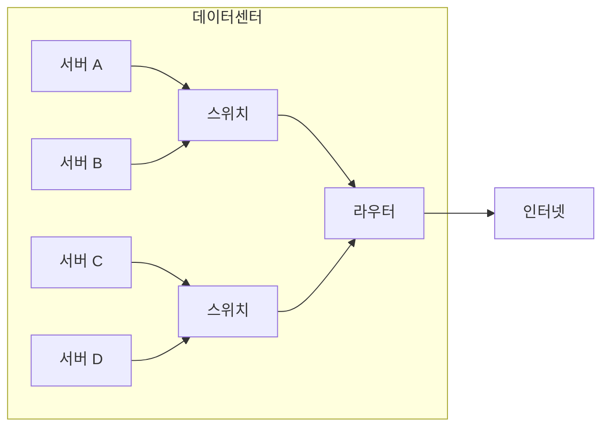
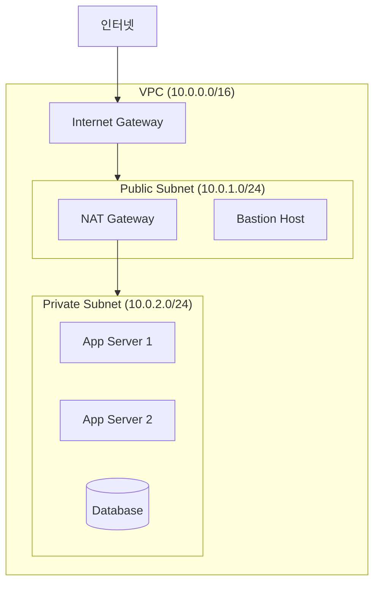
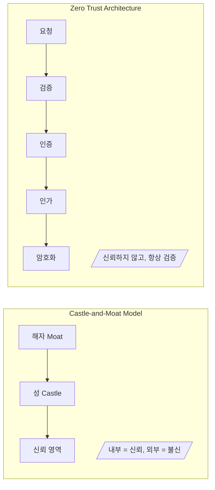
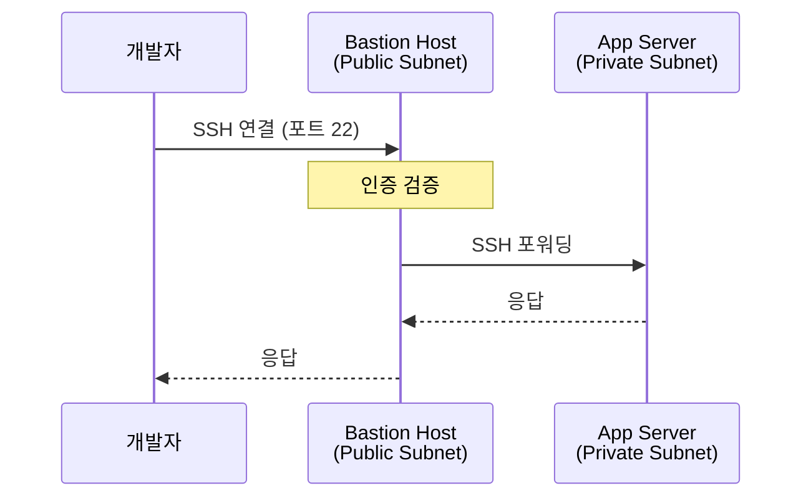
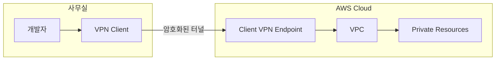
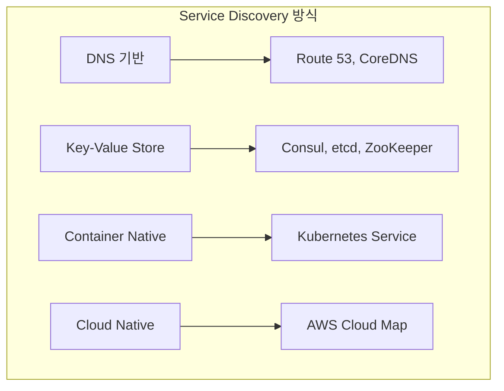
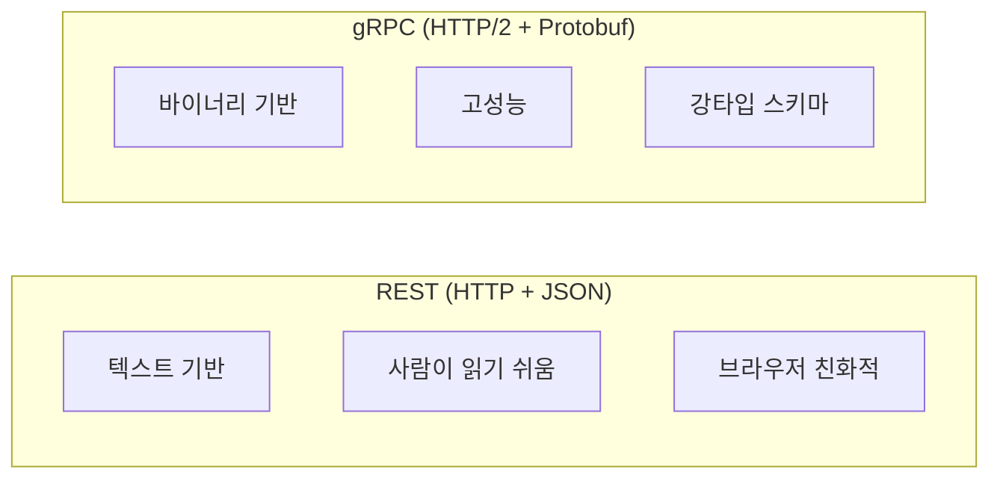
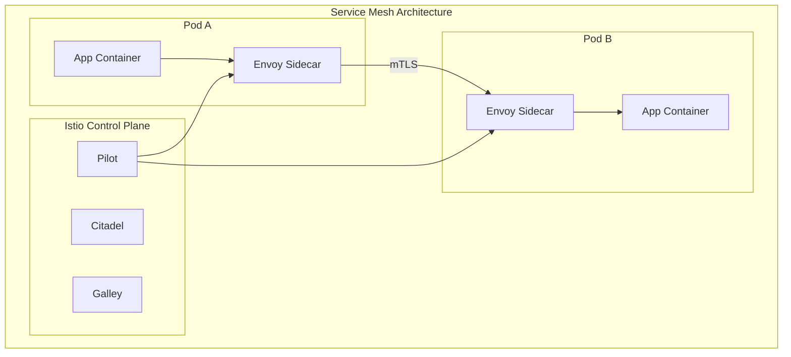

# Chapter 7: How to Set Up Networking (네트워킹 설정)

## 📌 핵심 요약

> **"네트워킹은 퍼블릭 네트워킹(IP 주소, DNS), 프라이빗 네트워킹(물리적 네트워크, VPC), 프라이빗 네트워크 접근(SSH, VPN, Zero Trust), 서비스 간 통신(Service Discovery, gRPC, Service Mesh)의 4가지 핵심 영역으로 구성된다."**

이 챕터에서는 DevOps 엔지니어가 알아야 할 네트워킹의 핵심 개념과 실무 적용 방법을 학습한다.

---

## 🎯 학습 목표

이 챕터를 완료하면 다음을 할 수 있다:

- [ ] IPv4/IPv6 주소 체계와 DNS 계층 구조 이해
- [ ] Route 53을 사용한 도메인 등록 및 관리
- [ ] VPC 설계 및 Public/Private 서브넷 구성
- [ ] Castle-and-Moat vs Zero Trust Architecture 비교
- [ ] SSH Bastion Host 및 VPN 설정
- [ ] Service Discovery 도구 선택 및 구성
- [ ] REST vs gRPC 프로토콜 선택 기준 이해
- [ ] Istio Service Mesh 기본 구성

---

## 📖 본문 정리

### 7.1 Public Networking (퍼블릭 네트워킹)

#### IP 주소 (IP Addresses)



| 구분 | IPv4 | IPv6 |
|------|------|------|
| **비트 수** | 32비트 | 128비트 |
| **주소 형식** | 11.222.33.44 | 2001:0db8:...:8329 |
| **주소 개수** | ~43억 | ~340간 (10^38) |
| **현재 상태** | 고갈됨 | 충분 |
| **채택률** | 약 60% | 약 40% |

#### DNS (Domain Name System)



**DNS 레코드 유형**:

| 레코드 | 용도 | 예시 |
|--------|------|------|
| **A** | 도메인 → IPv4 | example.com → 11.22.33.44 |
| **AAAA** | 도메인 → IPv6 | example.com → 2001:db8::1 |
| **CNAME** | 도메인 → 도메인 | www.example.com → example.com |
| **MX** | 메일 서버 | example.com → mail.example.com |
| **TXT** | 텍스트 정보 | SPF, DKIM 검증 |
| **NS** | 네임 서버 | example.com → ns1.example.com |

#### Route 53 도메인 등록 예제

```hcl
# live/route53/main.tf

provider "aws" {
  region = "us-east-2"
}

# 도메인 등록
resource "aws_route53domains_registered_domain" "example" {
  domain_name = "fundamentals-of-devops.com"

  # 도메인 잠금 (이전 방지)
  transfer_lock = true

  # 연락처 정보
  registrant_contact {
    first_name    = "Jim"
    last_name     = "Smith"
    address_line_1 = "100 Main St"
    city          = "Phoenix"
    state         = "AZ"
    country_code  = "US"
    zip_code      = "85001"
    email         = "jim@example.com"
    phone_number  = "+1.5555555555"
    contact_type  = "PERSON"
  }

  # WHOIS 프라이버시 보호
  registrant_privacy = true
  admin_privacy      = true
  tech_privacy       = true
}

# Hosted Zone 생성
resource "aws_route53_zone" "example" {
  name = aws_route53domains_registered_domain.example.domain_name
}

# A 레코드 추가
resource "aws_route53_record" "a_record" {
  zone_id = aws_route53_zone.example.zone_id
  name    = "www"
  type    = "A"
  ttl     = 300
  records = ["11.22.33.44"]
}
```

**배포 명령**:
```bash
cd live/route53
tofu init
tofu apply
```

---

### 7.2 Private Networking (프라이빗 네트워킹)

#### 물리적 네트워크 구성 요소



| 장비 | 역할 | OSI 계층 |
|------|------|----------|
| **Switch** | 동일 네트워크 내 장비 연결 | Layer 2 (Data Link) |
| **Router** | 서로 다른 네트워크 간 연결 | Layer 3 (Network) |
| **Firewall** | 트래픽 필터링 | Layer 3-7 |
| **Load Balancer** | 트래픽 분산 | Layer 4/7 |

#### RFC 1918 Private IP Ranges

| CIDR 블록 | IP 범위 | 주소 개수 |
|-----------|---------|-----------|
| **10.0.0.0/8** | 10.0.0.0 ~ 10.255.255.255 | ~1,600만 |
| **172.16.0.0/12** | 172.16.0.0 ~ 172.31.255.255 | ~100만 |
| **192.168.0.0/16** | 192.168.0.0 ~ 192.168.255.255 | ~65,000 |

#### 네트워크 레이턴시 비교 (Table 6-1)

| 작업 | 레이턴시 |
|------|----------|
| L1 캐시 참조 | 1 ns |
| L2 캐시 참조 | 4 ns |
| 메인 메모리 참조 | 100 ns |
| SSD 랜덤 읽기 | 16 μs |
| **동일 데이터센터 내 왕복** | **500 μs** |
| HDD 디스크 탐색 | 2 ms |
| **US 동-서 해안 왕복** | **40 ms** |
| **US-EU 왕복** | **80 ms** |
| **US-호주 왕복** | **200 ms** |

> **핵심 인사이트**: 물리적 거리가 레이턴시에 미치는 영향을 고려하여 데이터센터 위치를 선택해야 한다.

#### AWS VPC 구성 예제



```hcl
# live/vpc/main.tf

provider "aws" {
  region = "us-east-2"
}

module "vpc" {
  source  = "github.com/brikis98/devops-book//ch7/tofu/modules/vpc"

  name               = "example-vpc"
  cidr_block         = "10.0.0.0/16"
  num_nat_gateways   = 1

  # 가용 영역별 서브넷
  availability_zones = ["us-east-2a", "us-east-2b", "us-east-2c"]

  tags = {
    Environment = "production"
    ManagedBy   = "OpenTofu"
  }
}

# 출력값
output "vpc_id" {
  value = module.vpc.vpc_id
}

output "public_subnet_ids" {
  value = module.vpc.public_subnet_ids
}

output "private_subnet_ids" {
  value = module.vpc.private_subnet_ids
}
```

**VPC 서브넷 구성**:

| 서브넷 유형 | 용도 | 인터넷 접근 |
|-------------|------|-------------|
| **Public** | Load Balancer, Bastion Host | 직접 (IGW) |
| **Private** | App Server, Database | NAT Gateway 경유 |

---

### 7.3 Accessing Private Networks (프라이빗 네트워크 접근)

#### Castle-and-Moat vs Zero Trust Architecture



| 비교 항목 | Castle-and-Moat | Zero Trust |
|-----------|-----------------|------------|
| **기본 가정** | 내부 네트워크 = 신뢰 | 아무것도 신뢰하지 않음 |
| **인증** | 네트워크 경계에서 1회 | 모든 요청마다 |
| **내부 통신** | 암호화 선택사항 | 항상 암호화 |
| **접근 제어** | 네트워크 기반 | ID 기반 |
| **취약점** | 내부 침투 시 전체 노출 | 피해 범위 제한 |

> **"Never trust, always verify"** - Zero Trust의 핵심 원칙

#### Zero Trust의 5가지 핵심 원칙

1. **네트워크가 아닌 ID 기반 인증**
2. **모든 트래픽 암호화**
3. **최소 권한 원칙 적용**
4. **지속적인 모니터링 및 검증**
5. **마이크로 세그멘테이션**

#### SSH Bastion Host 구성



```hcl
# live/ec2-instances/main.tf

provider "aws" {
  region = "us-east-2"
}

# SSH 키 페어 생성
resource "aws_key_pair" "deployer" {
  key_name   = "deployer-key"
  public_key = file("~/.ssh/id_rsa.pub")
}

# Bastion Host Security Group
resource "aws_security_group" "bastion" {
  name        = "bastion-sg"
  description = "Security group for bastion host"
  vpc_id      = data.aws_vpc.example.id

  # SSH 인바운드 (제한된 IP에서만)
  ingress {
    from_port   = 22
    to_port     = 22
    protocol    = "tcp"
    cidr_blocks = ["YOUR_IP/32"]  # 특정 IP만 허용
  }

  egress {
    from_port   = 0
    to_port     = 0
    protocol    = "-1"
    cidr_blocks = ["0.0.0.0/0"]
  }
}

# Bastion Host EC2 Instance
module "bastion" {
  source = "github.com/brikis98/devops-book//ch7/tofu/modules/ec2-instance"

  name                   = "bastion"
  ami_id                 = data.aws_ami.amazon_linux.id
  instance_type          = "t3.micro"
  key_name               = aws_key_pair.deployer.key_name
  vpc_security_group_ids = [aws_security_group.bastion.id]
  subnet_id              = data.aws_subnet.public.id

  # Public IP 할당
  associate_public_ip_address = true
}

# Private Subnet의 App Server
module "app_server" {
  source = "github.com/brikis98/devops-book//ch7/tofu/modules/ec2-instance"

  name                   = "app-server"
  ami_id                 = data.aws_ami.amazon_linux.id
  instance_type          = "t3.micro"
  key_name               = aws_key_pair.deployer.key_name
  vpc_security_group_ids = [aws_security_group.private.id]
  subnet_id              = data.aws_subnet.private.id

  # Private IP만 사용
  associate_public_ip_address = false
}
```

**SSH 연결 방법**:
```bash
# 1. Bastion Host에 연결
ssh -i ~/.ssh/id_rsa ec2-user@<bastion-public-ip>

# 2. Bastion에서 Private Server로 연결
ssh -i ~/.ssh/id_rsa ec2-user@<app-private-ip>

# 또는 SSH ProxyJump 사용 (권장)
ssh -J ec2-user@<bastion-ip> ec2-user@<app-private-ip>
```

#### VPN (Virtual Private Network)



| 접근 방식 | 장점 | 단점 | 사용 시점 |
|-----------|------|------|-----------|
| **SSH Bastion** | 간단, 저비용 | 수동 관리, 확장 어려움 | 소규모 팀, 개발 환경 |
| **VPN** | 전체 네트워크 접근 | 설정 복잡, 비용 | 다수의 리소스 접근 |
| **Zero Trust Proxy** | 세밀한 접근 제어 | 도입 복잡성 | 보안 중시 환경 |

---

### 7.4 Service Communication (서비스 간 통신)

#### Service Discovery



**Service Discovery 도구 비교**:

| 도구 | 유형 | 헬스체크 | 분산 KV | 사용 환경 |
|------|------|----------|---------|-----------|
| **Kubernetes Service** | DNS/Proxy | ✅ | ❌ | K8s 클러스터 |
| **AWS Cloud Map** | DNS | ✅ | ❌ | AWS 환경 |
| **Consul** | DNS/HTTP | ✅ | ✅ | 하이브리드 |
| **etcd** | Key-Value | ❌ | ✅ | K8s 내부 |
| **ZooKeeper** | Key-Value | ✅ | ✅ | Java 생태계 |

#### Communication Protocols: REST vs gRPC



| 비교 항목 | REST | gRPC |
|-----------|------|------|
| **프로토콜** | HTTP/1.1 | HTTP/2 |
| **데이터 형식** | JSON (텍스트) | Protocol Buffers (바이너리) |
| **성능** | 보통 | 빠름 (2-10x) |
| **스트리밍** | 제한적 | 양방향 스트리밍 |
| **브라우저 지원** | 완전 지원 | 제한적 (gRPC-Web) |
| **디버깅** | 쉬움 (텍스트) | 어려움 (바이너리) |
| **스키마** | 선택적 (OpenAPI) | 필수 (Proto) |

**Protocol Buffers 예제**:
```protobuf
// user.proto
syntax = "proto3";

package user;

service UserService {
  rpc GetUser (GetUserRequest) returns (User);
  rpc ListUsers (ListUsersRequest) returns (stream User);
}

message GetUserRequest {
  string user_id = 1;
}

message User {
  string id = 1;
  string name = 2;
  string email = 3;
  int32 age = 4;
}

message ListUsersRequest {
  int32 page_size = 1;
  string page_token = 2;
}
```

#### Service Mesh와 Istio



**Service Mesh 핵심 기능**:

| 기능 | 설명 | Istio 컴포넌트 |
|------|------|----------------|
| **Traffic Management** | 라우팅, 로드 밸런싱 | VirtualService, DestinationRule |
| **Security** | mTLS, 인증/인가 | PeerAuthentication, AuthorizationPolicy |
| **Observability** | 메트릭, 트레이싱, 로깅 | Kiali, Jaeger, Prometheus |
| **Resilience** | 재시도, 타임아웃, 서킷 브레이커 | DestinationRule |

#### Istio + Kubernetes 마이크로서비스 예제

```yaml
# 1. Istio Gateway
apiVersion: networking.istio.io/v1beta1
kind: Gateway
metadata:
  name: microservices-gateway
spec:
  selector:
    istio: ingressgateway
  servers:
  - port:
      number: 80
      name: http
      protocol: HTTP
    hosts:
    - "api.example.com"

---
# 2. VirtualService (Traffic Routing)
apiVersion: networking.istio.io/v1beta1
kind: VirtualService
metadata:
  name: sample-app-routes
spec:
  hosts:
  - "api.example.com"
  gateways:
  - microservices-gateway
  http:
  - match:
    - uri:
        prefix: /users
    route:
    - destination:
        host: user-service
        port:
          number: 8080
  - match:
    - uri:
        prefix: /orders
    route:
    - destination:
        host: order-service
        port:
          number: 8080

---
# 3. DestinationRule (Load Balancing + Circuit Breaker)
apiVersion: networking.istio.io/v1beta1
kind: DestinationRule
metadata:
  name: user-service-dr
spec:
  host: user-service
  trafficPolicy:
    connectionPool:
      tcp:
        maxConnections: 100
      http:
        h2UpgradePolicy: UPGRADE
        http1MaxPendingRequests: 100
        http2MaxRequests: 1000
    outlierDetection:
      consecutive5xxErrors: 5
      interval: 30s
      baseEjectionTime: 30s

---
# 4. PeerAuthentication (mTLS)
apiVersion: security.istio.io/v1beta1
kind: PeerAuthentication
metadata:
  name: default
  namespace: default
spec:
  mtls:
    mode: STRICT

---
# 5. AuthorizationPolicy (접근 제어)
apiVersion: security.istio.io/v1beta1
kind: AuthorizationPolicy
metadata:
  name: user-service-policy
spec:
  selector:
    matchLabels:
      app: user-service
  rules:
  - from:
    - source:
        principals: ["cluster.local/ns/default/sa/order-service"]
    to:
    - operation:
        methods: ["GET"]
        paths: ["/users/*"]
```

**Kubernetes Service 정의**:
```yaml
# user-service.yaml
apiVersion: v1
kind: Service
metadata:
  name: user-service
  labels:
    app: user-service
spec:
  ports:
  - port: 8080
    targetPort: 8080
    protocol: TCP
  selector:
    app: user-service

---
apiVersion: apps/v1
kind: Deployment
metadata:
  name: user-service
spec:
  replicas: 3
  selector:
    matchLabels:
      app: user-service
  template:
    metadata:
      labels:
        app: user-service
      annotations:
        sidecar.istio.io/inject: "true"  # Istio sidecar 자동 주입
    spec:
      containers:
      - name: user-service
        image: my-registry/user-service:v1.0.0
        ports:
        - containerPort: 8080
        resources:
          requests:
            memory: "256Mi"
            cpu: "100m"
          limits:
            memory: "512Mi"
            cpu: "500m"
```

---

## 💡 실무 적용 포인트

### 네트워킹 설계 체크리스트

```
□ 퍼블릭 네트워킹
  ├── 도메인 등록 및 DNS 설정
  ├── Route 53 Hosted Zone 구성
  └── SSL/TLS 인증서 적용 (ACM)

□ 프라이빗 네트워킹
  ├── VPC CIDR 블록 설계 (확장성 고려)
  ├── 가용 영역별 서브넷 분리
  ├── NAT Gateway 설정 (Private 서브넷용)
  └── Security Group 정책 수립

□ 네트워크 접근
  ├── Bastion Host vs VPN 선택
  ├── Zero Trust 원칙 적용 고려
  └── 접근 로그 및 모니터링

□ 서비스 통신
  ├── Service Discovery 전략 수립
  ├── 통신 프로토콜 선택 (REST vs gRPC)
  └── Service Mesh 도입 여부 결정
```

### 환경별 권장 구성

| 환경 | VPC 구성 | 네트워크 접근 | Service Mesh |
|------|----------|---------------|--------------|
| **Development** | 단일 VPC, 단순 서브넷 | SSH Bastion | 불필요 |
| **Staging** | Multi-AZ VPC | VPN | 선택적 |
| **Production** | Multi-AZ VPC + PrivateLink | Zero Trust | 권장 |

### gRPC vs REST 선택 가이드

```
REST 선택:
├── 브라우저 클라이언트 존재
├── 외부 API 제공
├── 디버깅 용이성 중요
└── 팀이 REST에 익숙

gRPC 선택:
├── 마이크로서비스 내부 통신
├── 고성능 요구사항
├── 강타입 계약 필요
├── 양방향 스트리밍 필요
└── 다중 언어 환경
```

---

## ✅ 핵심 개념 체크리스트

- [ ] IPv4/IPv6 주소 체계와 IANA 역할 이해
- [ ] DNS 계층 구조와 레코드 유형 (A, AAAA, CNAME, MX)
- [ ] Route 53 Hosted Zone과 도메인 등록
- [ ] RFC 1918 Private IP 범위 (10.x, 172.16-31.x, 192.168.x)
- [ ] VPC, Subnet, Internet Gateway, NAT Gateway 관계
- [ ] Castle-and-Moat vs Zero Trust Architecture
- [ ] SSH Bastion Host 패턴과 ProxyJump
- [ ] Service Discovery 도구들 (Kubernetes Service, Consul, AWS Cloud Map)
- [ ] REST vs gRPC 선택 기준
- [ ] Protocol Buffers 기본 문법
- [ ] Istio Service Mesh 핵심 컴포넌트

---

## 🔑 7 Key Takeaways

1. **Every computer connected to a public network needs a public IP address**: IP 주소는 인터넷 상에서 컴퓨터를 고유하게 식별한다.

2. **You can use DNS to map human-friendly domain names to IP addresses**: DNS를 통해 기억하기 쉬운 도메인 이름을 IP 주소로 변환한다.

3. **Private networks are isolated from the public Internet**: 프라이빗 네트워크는 보안을 위해 인터넷과 격리되어 있다.

4. **You need to use special tools to access private networks**: SSH, RDP, VPN 등의 도구가 필요하며, 보안 강화를 위해 Zero Trust 방식을 고려해야 한다.

5. **Services need to communicate with each other**: 마이크로서비스 환경에서 서비스 간 통신이 필수적이다.

6. **You can use service discovery and service mesh tools**: 서비스 디스커버리로 동적 서비스 위치를 관리하고, Service Mesh로 통신을 제어한다.

7. **Services can communicate over REST or gRPC protocols**: REST는 범용성이 높고 gRPC는 성능이 우수하다.

---

## 🔗 참고 자료

- [AWS VPC Documentation](https://docs.aws.amazon.com/vpc/)
- [Route 53 Developer Guide](https://docs.aws.amazon.com/Route53/latest/DeveloperGuide/)
- [Istio Documentation](https://istio.io/latest/docs/)
- [gRPC Documentation](https://grpc.io/docs/)
- [Zero Trust Architecture - NIST SP 800-207](https://csrc.nist.gov/publications/detail/sp/800-207/final)
- [Kubernetes Networking](https://kubernetes.io/docs/concepts/services-networking/)

---

## 📚 다음 챕터 미리보기

- **Chapter 8**: How to Manage Data and State (데이터베이스, 스키마 관리, 백업, 스토리지)
