# Chapter 8: How to Secure Communication and Storage (통신과 저장소 보안)

## 📌 핵심 요약

> **"암호화의 핵심은 직접 만들지 않는 것이다. 성숙하고 검증된 알고리즘(AES-GCM, ChaCha20-Poly1305, RSA-OAEP)과 도구(AWS Secrets Manager, Let's Encrypt, Argon2id)를 사용하여 저장 데이터(Encryption at Rest)와 전송 데이터(Encryption in Transit)를 보호한다."**

이 챕터에서는 암호학 기초(Encryption, Hashing)와 실무 적용(Secrets Management, TLS, E2E Encryption)을 학습한다.

---

## 🎯 학습 목표

이 챕터를 완료하면 다음을 할 수 있다:

- [ ] 대칭키/비대칭키/하이브리드 암호화 이해
- [ ] AES, RSA, ChaCha20 알고리즘 선택 기준 파악
- [ ] SHA-256, HMAC, 디지털 서명의 용도 구분
- [ ] 개인/인프라/고객 비밀 관리 전략 수립
- [ ] 비밀번호 저장에 Argon2id + salt + pepper 적용
- [ ] Let's Encrypt로 TLS 인증서 발급
- [ ] AWS Secrets Manager로 인프라 비밀 관리
- [ ] End-to-End 암호화 개념과 한계 이해

---

## 📖 본문 정리

### 8.1 Cryptography Primer (암호학 기초)

#### 암호학의 3가지 목표 (CIA)

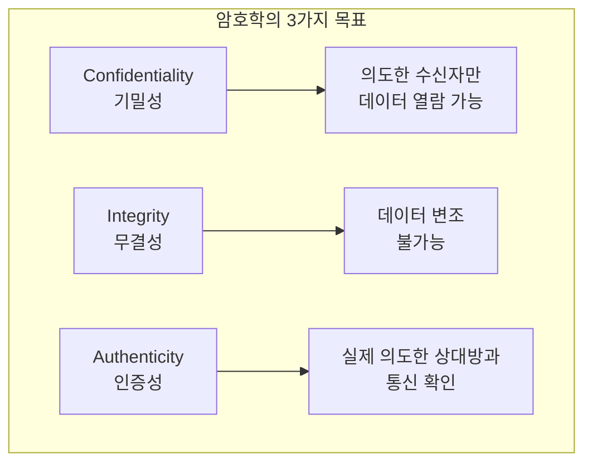

> **⚠️ Key Takeaway 1**: 직접 암호화를 구현하지 마라. 항상 성숙하고 검증된 알고리즘과 구현체를 사용하라.

**왜 직접 만들면 안 되는가?**

| 일반 소프트웨어 | 암호화 소프트웨어 |
|----------------|------------------|
| 사용자는 보통 관심 낮음 | 적극적인 적대자(Adversary) 존재 |
| 대부분의 버그는 경미함 | 하나의 버그가 치명적 |
| 기능만 작동하면 OK | 수년간의 공격에도 견뎌야 함 |

---

### 8.2 Encryption (암호화)

#### 암호화 유형 비교

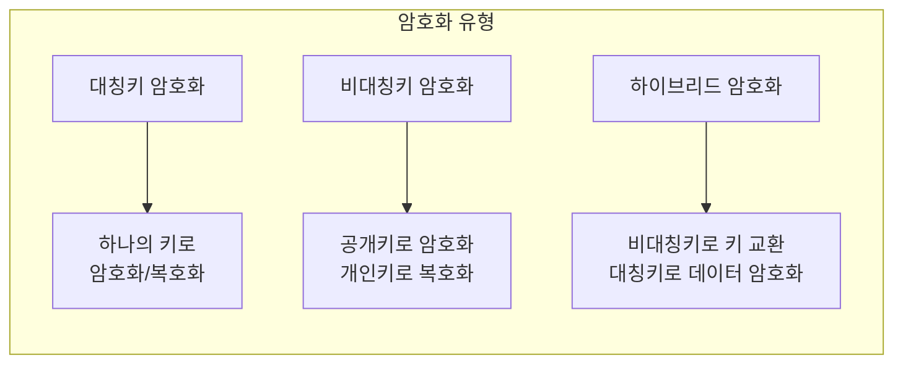

#### Symmetric-key Encryption (대칭키 암호화)

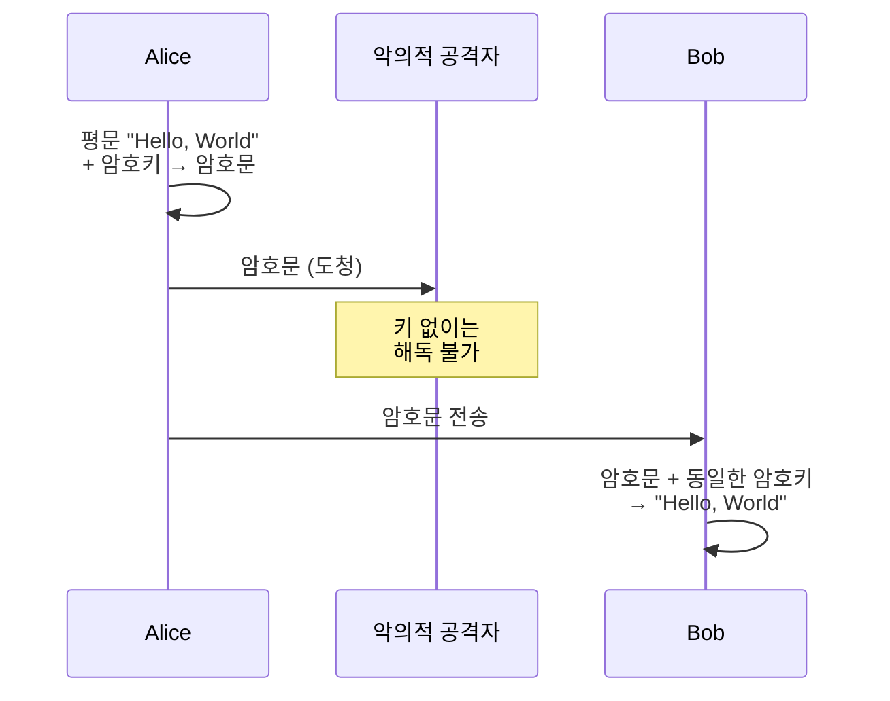

**권장 대칭키 알고리즘 (2025년 기준)**:

| 알고리즘 | 특징 | 권장 버전 |
|----------|------|-----------|
| **AES** | NIST 표준, 하드웨어 가속 지원, 20년+ 검증 | AES-GCM (MAC 포함) |
| **ChaCha** | 소프트웨어에서 더 빠름, 특정 공격에 더 안전 | ChaCha20-Poly1305 (MAC 포함) |

**대칭키 암호화의 한계**: 암호키를 안전하게 교환하기 어려움 → 비대칭키 암호화로 해결

#### Asymmetric-key Encryption (비대칭키 암호화)

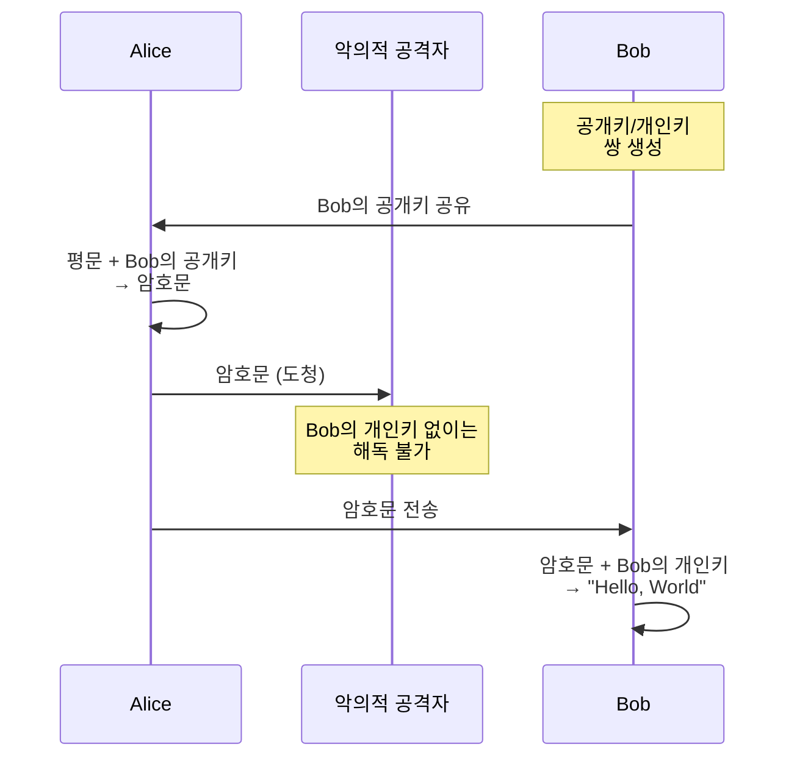

**권장 비대칭키 알고리즘**:

| 알고리즘 | 기반 수학 | 권장 버전 |
|----------|-----------|-----------|
| **RSA** | 소인수분해 | RSA-OAEP (취약점 보완) |
| **ECC** | 타원곡선 | ECIES (하이브리드 방식) |

#### Hybrid Encryption (하이브리드 암호화)

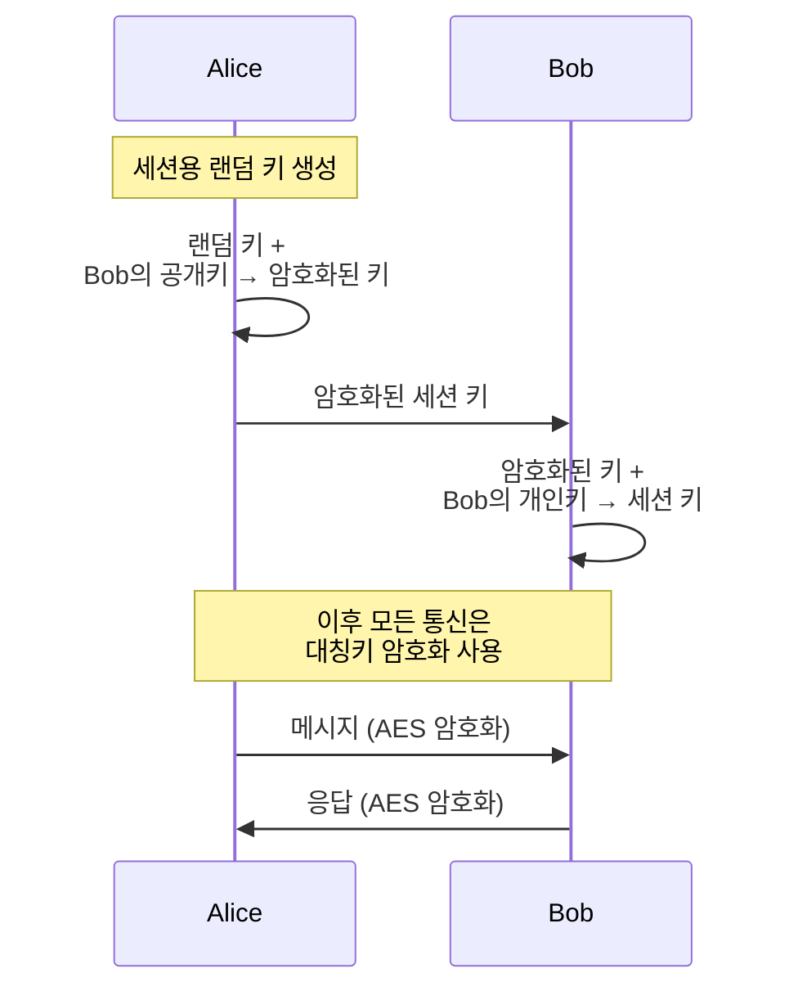

**하이브리드 암호화의 장점**:

| 장점 | 설명 |
|------|------|
| **Out-of-band 채널 불필요** | 사전 키 교환 없이 안전한 통신 |
| **성능** | 대부분 빠른 대칭키 암호화 사용 |
| **Forward Secrecy** | 개인키 유출되어도 과거 통신 해독 불가 |

#### OpenSSL 암호화 예제

```bash
# 대칭키 암호화 (AES)
$ echo "Hello, World" | openssl aes-128-cbc -base64 -pbkdf2
# 암호 입력 후 암호문 출력: U2FsdGVkX19V9Ax8Y/AOJT4nbRwr...

# 대칭키 복호화
$ echo "<CIPHERTEXT>" | openssl aes-128-cbc -d -base64 -pbkdf2
Hello, World

# 비대칭키 쌍 생성 (RSA)
$ openssl genrsa -out private-key.pem 2048
$ openssl rsa -in private-key.pem -pubout -out public-key.pem

# 공개키로 암호화
$ echo "Hello, World" | \
  openssl pkeyutl -encrypt -pubin -inkey public-key.pem | \
  openssl base64

# 개인키로 복호화
$ echo "<CIPHERTEXT>" | \
  openssl base64 -d | \
  openssl pkeyutl -decrypt -inkey private-key.pem
Hello, World
```

---

### 8.3 Hashing (해싱)

#### 암호화 vs 해싱

| 특성 | 암호화 (Encryption) | 해싱 (Hashing) |
|------|---------------------|----------------|
| **방향** | 양방향 (복호화 가능) | 단방향 (복원 불가) |
| **출력 크기** | 입력에 비례 | 고정 크기 (예: 256비트) |
| **키 필요** | ✅ 필요 | ❌ 불필요 |
| **용도** | 데이터 보호 | 무결성 검증, 비밀번호 저장 |

#### 암호학적 해시 함수의 특성

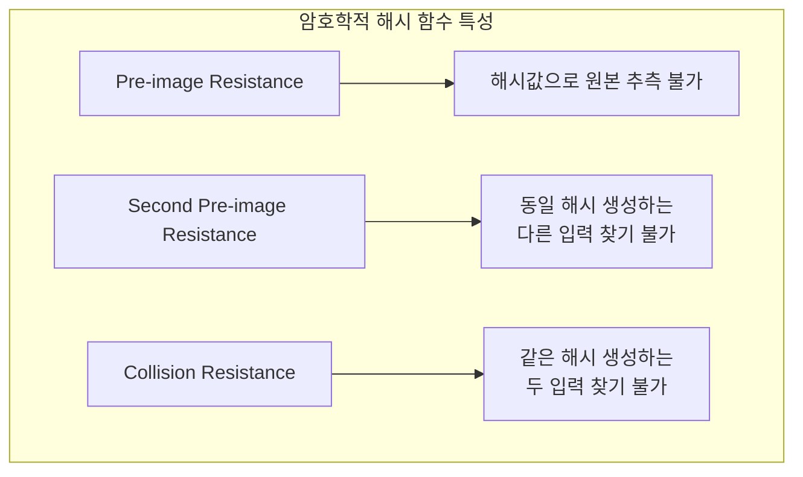

**권장 해시 알고리즘**:

| 알고리즘 | 출력 크기 | 용도 |
|----------|-----------|------|
| **SHA-256** | 256비트 | 범용 무결성 검증 |
| **SHA-512** | 512비트 | 높은 보안 요구 |
| **SHA3-256** | 256비트 | 최신 표준 |
| **SHAKE** | 가변 | 특수 용도 (XOF) |

#### 해시 함수의 활용

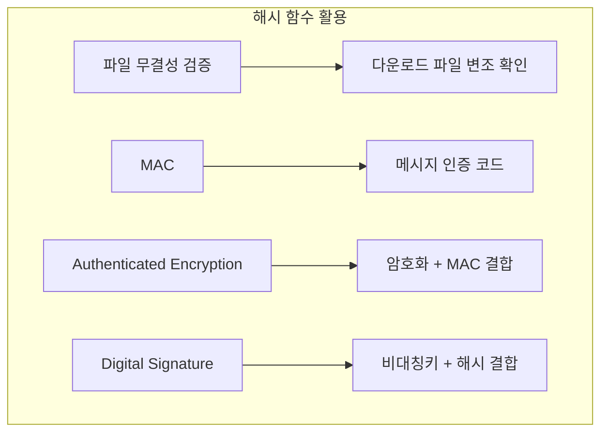

#### Message Authentication Code (MAC)

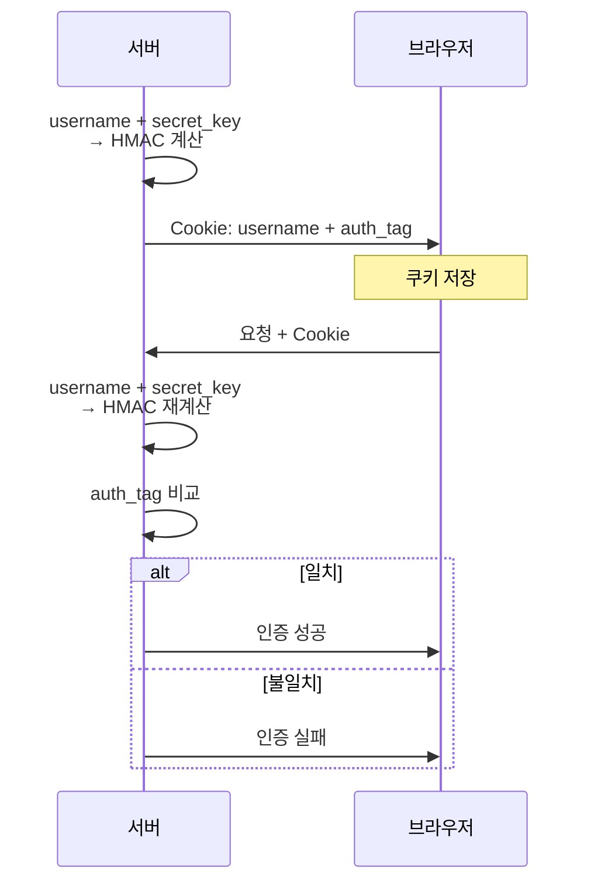

#### Digital Signature (디지털 서명)

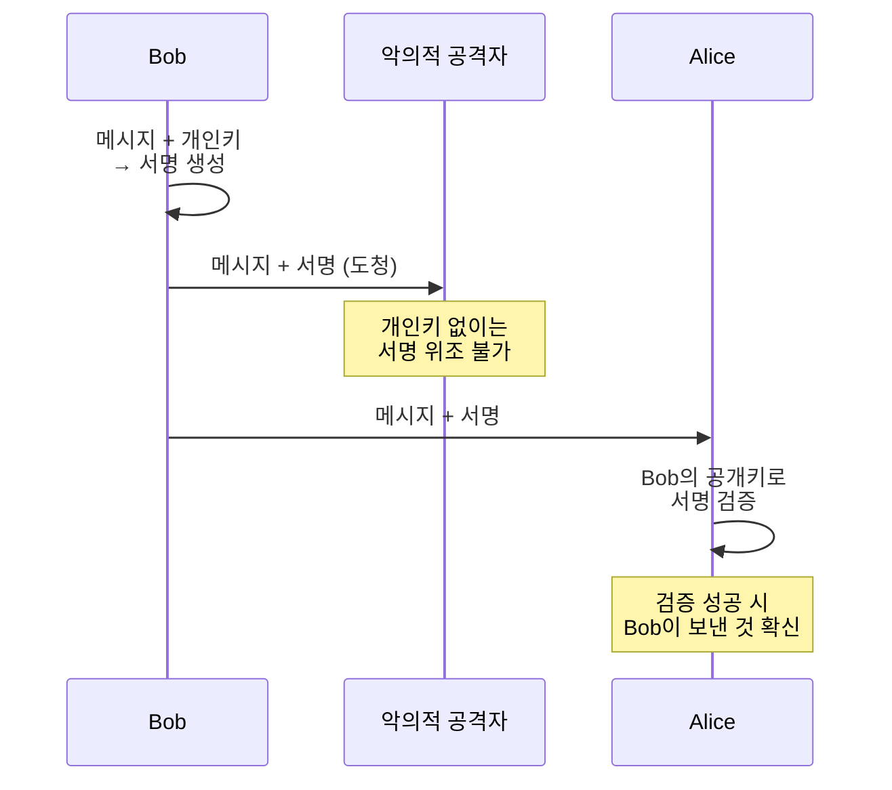

#### OpenSSL 해싱 예제

```bash
# 파일 해시 계산
$ echo "Hello, World" > file.txt
$ openssl sha256 file.txt
SHA2-256(file.txt)= 8663bab6d124806b...

# 파일 수정 후 해시 (완전히 다른 값)
$ echo "Hello, world" > file.txt  # W → w
$ openssl sha256 file.txt
SHA2-256(file.txt)= 37980c33951de6b0...

# HMAC (인증 태그)
$ openssl sha256 -hmac password file.txt
HMAC-SHA2-256(file.txt)= 3b86a735fa627cb6...

# 디지털 서명 생성
$ openssl sha256 -sign private-key.pem -out file.txt.sig file.txt

# 디지털 서명 검증
$ openssl sha256 -verify public-key.pem -signature file.txt.sig file.txt
Verified OK
```

---

### 8.4 Secure Storage (안전한 저장)

#### Secrets Management (비밀 관리)

> **⚠️ Key Takeaway 2**: 비밀을 평문으로 저장하지 마라.

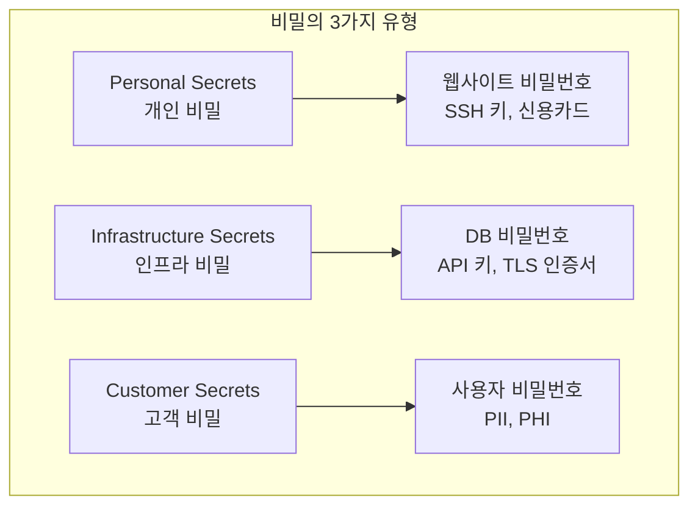

> **⚠️ Key Takeaway 3**: 가능하면 비밀을 저장하지 마라 (SSO, 서드파티 서비스 활용).

#### 비밀 유형별 관리 전략

| 비밀 유형 | 저장 방식 | 권장 도구 |
|-----------|-----------|-----------|
| **Personal** | 비밀번호 관리자 | 1Password, Bitwarden |
| **Infrastructure** | Secret Store / KMS | AWS Secrets Manager, HashiCorp Vault |
| **Customer Passwords** | 해시 (평문 저장 금지!) | Argon2id + salt + pepper |

> **⚠️ Key Takeaway 4**: 개인 비밀은 비밀번호 관리자에 저장하라.

> **⚠️ Key Takeaway 5**: 인프라 비밀은 KMS 또는 범용 Secret Store에 저장하라.

#### Password Storage (비밀번호 저장)

> **⚠️ Key Takeaway 6**: 사용자 비밀번호는 절대 저장하지 마라 (암호화해서도 안 됨). 대신 해시를 저장하라.

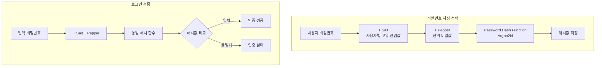

**비밀번호 해시 함수 (권장 순서)**:

| 함수 | 특징 | 권장도 |
|------|------|--------|
| **Argon2id** | 메모리 집약적, 최신 표준 | ⭐⭐⭐ 최우선 |
| **scrypt** | 메모리 집약적 | ⭐⭐ |
| **bcrypt** | 오래된 표준, 여전히 안전 | ⭐ |
| **PBKDF2** | 가장 오래됨 | 최후의 수단 |

**왜 일반 해시(SHA-256)를 쓰면 안 되는가?**

| 해시 함수 | 실행 시간 | 브루트포스 난이도 |
|-----------|-----------|-------------------|
| SHA-256 | < 1ms | 쉬움 |
| Argon2id | 1-2초 | 1000배 어려움 |

#### Encryption at Rest (저장 데이터 암호화)

> **⚠️ Key Takeaway 7**: Full-disk, Data store, Application-level 암호화를 사용하라.

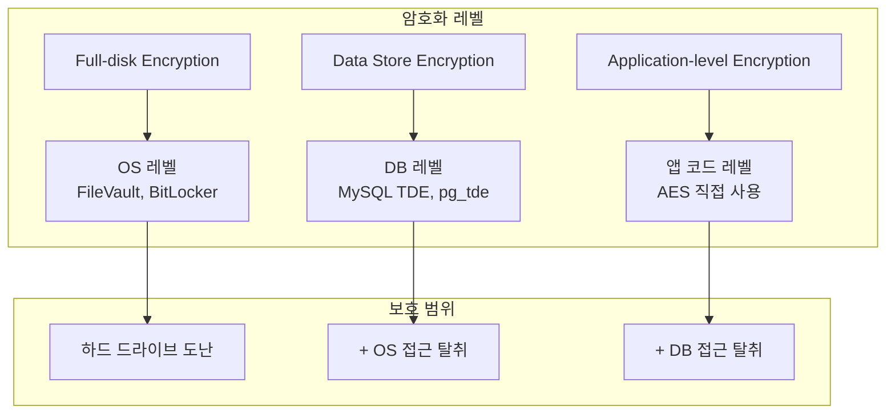

| 암호화 레벨 | 보호 대상 | 한계 |
|-------------|-----------|------|
| **Full-disk** | 물리적 하드 드라이브 도난 | 인증된 OS에서는 무방비 |
| **Data Store** | + 파일시스템 접근 | DB 인증 탈취 시 무방비 |
| **Application** | + DB 쿼리 접근 | 암호키 탈취 시 무방비 |

---

### 8.5 Secure Communication (안전한 통신)

#### Transport Layer Security (TLS)

> **⚠️ Key Takeaway 8**: TLS를 사용하여 전송 데이터를 암호화하라. CA에서 TLS 인증서를 받아라.

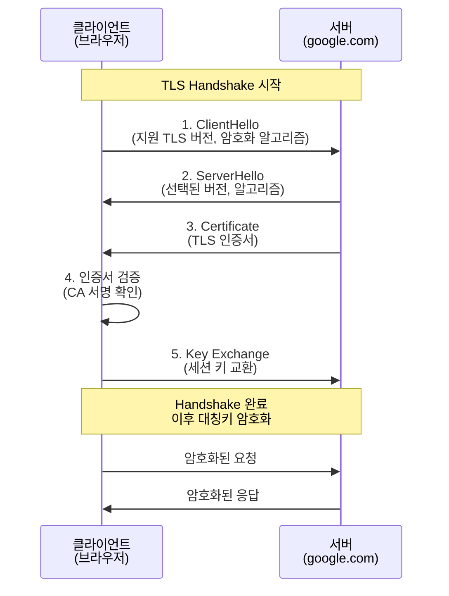

#### TLS 인증서 발급 과정

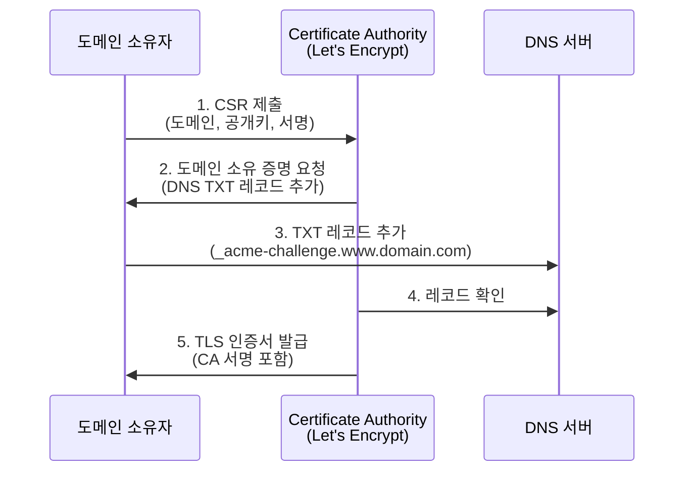

#### PKI (Public Key Infrastructure)

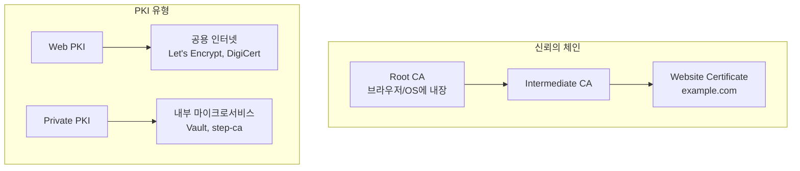

**TLS 인증서 발급 옵션**:

| 옵션 | 비용 | 자동 갱신 | 사용 환경 |
|------|------|-----------|-----------|
| **Let's Encrypt** | 무료 | 수동/자동화 필요 | 범용 |
| **AWS ACM** | 무료 | ✅ 자동 | AWS 서비스만 |
| **DigiCert/GoDaddy** | 유료 | 수동 | 특수 요구사항 |

#### Let's Encrypt + AWS Secrets Manager 예제

**1. Certbot으로 TLS 인증서 발급**:
```bash
# Certbot 설치 (macOS)
$ brew install certbot

# 인증서 요청 (수동 DNS 검증)
$ certbot certonly --manual \
    --config-dir . \
    --work-dir . \
    --logs-dir . \
    --domain www.<YOUR-DOMAIN> \
    --cert-name example \
    --preferred-challenges=dns

# Route 53에 DNS TXT 레코드 추가 후 Enter
# _acme-challenge.www.<YOUR-DOMAIN> = <SOME-VALUE>
```

**2. AWS Secrets Manager에 인증서 저장**:
```bash
# JSON 형식으로 변환
$ CERTS_JSON=$(jq -n -c -r \
  --arg cert "$(cat live/example/fullchain.pem)" \
  --arg key "$(cat live/example/privkey.pem)" \
  '{cert:$cert,key:$key}')

# Secrets Manager에 저장
$ aws secretsmanager create-secret \
  --region us-east-2 \
  --name certificate \
  --secret-string "$CERTS_JSON"

# 로컬 인증서 삭제 (보안)
$ certbot delete --config-dir . --work-dir . --logs-dir .
```

**3. OpenTofu로 EC2 인스턴스에 권한 부여**:
```hcl
# main.tf
resource "aws_iam_role_policy" "tls_cert_access" {
  role   = module.instances.iam_role_name
  policy = data.aws_iam_policy_document.tls_cert_access.json
}

data "aws_secretsmanager_secret" "certificate" {
  name = "certificate"
}

data "aws_iam_policy_document" "tls_cert_access" {
  statement {
    effect    = "Allow"
    actions   = ["secretsmanager:GetSecretValue"]
    resources = [data.aws_secretsmanager_secret.certificate.arn]
  }
}
```

**4. Node.js 앱에서 HTTPS 서버 실행**:
```javascript
// app.js
const https = require('https');
const secretsMgr = require('@aws-sdk/client-secrets-manager');
const client = new secretsMgr.SecretsManagerClient({region: 'us-east-2'});

(async () => {
  // Secrets Manager에서 TLS 인증서 가져오기
  const response = await client.send(new secretsMgr.GetSecretValueCommand({
    SecretId: 'certificate'
  }));

  const options = JSON.parse(response.SecretString);

  // HTTPS 서버 시작
  const server = https.createServer(options, (req, res) => {
    res.writeHead(200, { 'Content-Type': 'text/plain' });
    res.end('Hello, World!\n');
  });

  const port = process.env.PORT || 443;
  server.listen(port, () => {
    console.log(`Listening on port ${port}`);
  });
})();
```

---

### 8.6 End-to-End Encryption (종단 간 암호화)

> **⚠️ Key Takeaway 9**: E2E 암호화를 사용하면 소프트웨어 제공자도 데이터를 볼 수 없다.

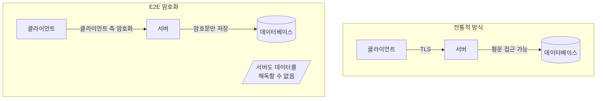

#### E2E 암호화의 발전

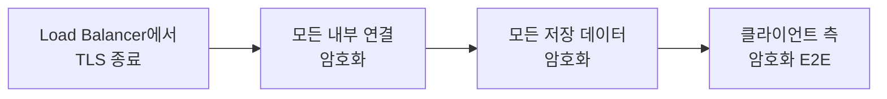

#### E2E 암호화 신뢰 문제

| 문제 | 설명 | 예시 |
|------|------|------|
| **거짓 주장** | 회사가 E2E 주장하지만 실제로는 아님 | Zoom 사례 (FTC 조사) |
| **백도어** | 정부 기관에 의한 강제 백도어 | Skype/Outlook NSA 백도어 |
| **버그** | 의도치 않은 취약점 | 보안 권고 메일링 리스트 참조 |
| **소프트웨어 변조** | 다운로드 중간자 공격 | TLS 인증서 체인도 신뢰 필요 |

---

## 💡 실무 적용 포인트

### 암호화 Use Case별 Cheat Sheet

| Use Case | 솔루션 | 권장 도구 |
|----------|--------|-----------|
| 개인 비밀 저장 | 비밀번호 관리자 | 1Password, Bitwarden |
| 인프라 비밀 저장 | Secret Store / KMS | AWS Secrets Manager, OpenBao |
| 고객 비밀번호 저장 | hash(password + salt + pepper) | Argon2id, scrypt, bcrypt |
| 저장 데이터 암호화 | Authenticated Encryption | AES-GCM, ChaCha20-Poly1305 |
| 공용 인터넷 전송 암호화 | TLS + 공용 CA | Let's Encrypt, ACM |
| 내부 네트워크 전송 암호화 | TLS + 사설 CA | Istio, step-ca |
| 데이터 무결성 검증 | 암호학적 해시 | SHA-256, SHA-3 |
| 데이터 인증 | MAC | HMAC, KMAC |

### 보안 체크리스트

```
□ 암호화 기본 원칙
  ├── 직접 암호화 구현하지 않음
  ├── 검증된 알고리즘만 사용
  └── 비밀을 평문으로 저장하지 않음

□ Secrets Management
  ├── 개인 비밀 → 비밀번호 관리자
  ├── 인프라 비밀 → Secret Store / KMS
  └── 고객 비밀번호 → 해시 (절대 평문 저장 금지)

□ Encryption at Rest
  ├── Full-disk 암호화 활성화
  ├── DB 암호화 활성화
  └── 필요시 Application-level 암호화

□ Encryption in Transit
  ├── 모든 외부 통신 → HTTPS/TLS
  ├── 내부 서비스 → mTLS
  └── TLS 1.2 이상만 허용
```

### 비밀번호 강도 가이드

| 특성 | 권장 사항 |
|------|-----------|
| **고유성** | 모든 계정에 다른 비밀번호 |
| **길이** | 최소 15자 이상 |
| **복잡성** | Diceware 방식 권장 (4-6 단어) |
| **저장** | 비밀번호 관리자에만 저장 |

---

## ✅ 핵심 개념 체크리스트

- [ ] 대칭키 vs 비대칭키 vs 하이브리드 암호화 이해
- [ ] AES-GCM, ChaCha20-Poly1305 권장 이유
- [ ] RSA-OAEP, ECIES 사용 시점
- [ ] 해싱 vs 암호화 차이점
- [ ] SHA-256, HMAC, 디지털 서명 용도
- [ ] 개인/인프라/고객 비밀 관리 전략
- [ ] Argon2id + salt + pepper 비밀번호 저장
- [ ] Full-disk, Data store, Application-level 암호화
- [ ] TLS 핸드셰이크 과정
- [ ] CA와 PKI 신뢰 체인
- [ ] Let's Encrypt 인증서 발급
- [ ] AWS Secrets Manager 사용법
- [ ] E2E 암호화의 의미와 한계

---

## 🔑 9 Key Takeaways

1. **직접 암호화를 구현하지 마라**: 항상 성숙하고 검증된 알고리즘과 구현체를 사용하라.

2. **비밀을 평문으로 저장하지 마라**: 버전 관리, 이메일, 채팅, 텍스트 파일에 평문 비밀 금지.

3. **가능하면 비밀을 저장하지 마라**: SSO, 서드파티 서비스, 또는 데이터 자체를 저장하지 않는 방법 활용.

4. **개인 비밀은 비밀번호 관리자에 저장하라**: 1Password, Bitwarden 등 사용.

5. **인프라 비밀은 KMS 또는 Secret Store에 저장하라**: AWS Secrets Manager, HashiCorp Vault 등 사용.

6. **사용자 비밀번호는 절대 저장하지 마라**: password hash function으로 hash(password + salt + pepper) 저장.

7. **저장 데이터는 Full-disk, Data store, Application-level 암호화를 사용하라**.

8. **전송 데이터는 TLS로 암호화하라**: CA에서 TLS 인증서 발급.

9. **E2E 암호화로 소프트웨어 제공자도 볼 수 없게 데이터를 보호하라**.

---

## 🔗 참고 자료

- [OWASP Cryptographic Cheat Sheet](https://cheatsheetseries.owasp.org/cheatsheets/Cryptographic_Storage_Cheat_Sheet.html)
- [Let's Encrypt Documentation](https://letsencrypt.org/docs/)
- [AWS Secrets Manager Documentation](https://docs.aws.amazon.com/secretsmanager/)
- [Argon2 Password Hashing](https://github.com/P-H-C/phc-winner-argon2)
- [NIST Cryptographic Standards](https://csrc.nist.gov/projects/cryptographic-standards-and-guidelines)
- [TLS 1.3 RFC 8446](https://datatracker.ietf.org/doc/html/rfc8446)

---

## 📚 다음 챕터 미리보기

- **Chapter 9**: How to Store Data (SQL, NoSQL, Queues, Warehouses, File Stores)
