# Chapter 9: How to Store Data (데이터 저장)

## 📌 핵심 요약

> **"데이터 저장소는 사용 사례에 따라 선택해야 한다. 관계형 DB는 ACID 트랜잭션이 필요한 기본 데이터에, 캐시는 성능 향상에, 객체 저장소는 정적 파일에, 문서 저장소는 반정형 데이터에, 컬럼형 DB는 분석에, 메시지 큐와 이벤트 스트림은 비동기 처리에 적합하다. 확장성을 위해 복제와 파티셔닝을 사용하고, 3-2-1 규칙으로 백업을 관리한다."**

이 챕터에서는 다양한 데이터 저장 방식과 각각의 적합한 사용 사례를 학습한다.

---

## 🎯 학습 목표

이 챕터를 완료하면 다음을 할 수 있다:

- [ ] 로컬 스토리지와 네트워크 연결 스토리지 이해
- [ ] 관계형 데이터베이스의 ACID 트랜잭션과 스키마 설계
- [ ] 캐싱 전략 (Key-Value Store, CDN) 적용
- [ ] 파일 저장소와 객체 저장소 구분 사용
- [ ] 문서 저장소 (MongoDB) 활용
- [ ] 컬럼형 데이터베이스로 분석 쿼리 최적화
- [ ] 메시지 큐와 이벤트 스트림으로 비동기 처리 구현
- [ ] 복제와 파티셔닝으로 확장성 확보
- [ ] CAP 정리와 NoSQL/NewSQL 트레이드오프 이해
- [ ] 3-2-1 규칙으로 백업 전략 수립

---

## 📖 본문 정리

### 9.1 로컬 스토리지 (Local Storage)

#### 스토리지 계층 구조

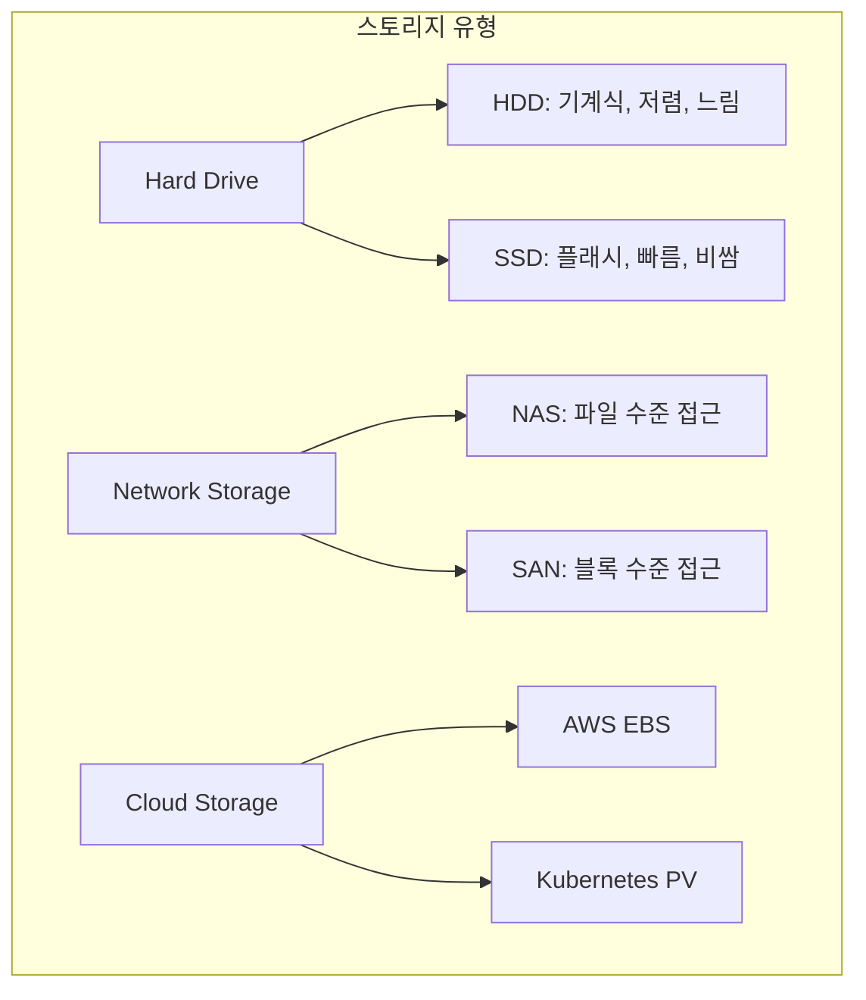

#### 스토리지 유형 비교

| 유형 | 특징 | 사용 사례 |
|------|------|-----------|
| **HDD** | 회전 디스크, 저렴, 순차 읽기에 적합 | 백업, 아카이브 |
| **SSD** | 플래시 메모리, 빠른 랜덤 접근 | 데이터베이스, OS |
| **NAS** | 네트워크 파일 시스템 | 공유 파일 스토리지 |
| **SAN** | 블록 레벨 접근, 고성능 | 기업용 DB |
| **EBS** | AWS 블록 스토리지 | EC2 인스턴스 디스크 |
| **Persistent Volume** | Kubernetes 영구 스토리지 | 컨테이너 상태 저장 |

---

### 9.2 기본 데이터 저장소: 관계형 데이터베이스

#### ACID 속성

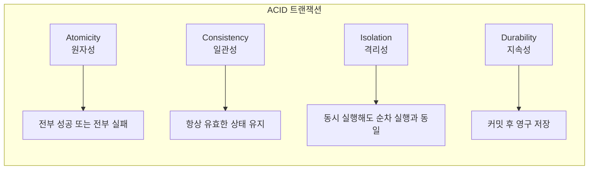

#### 관계형 DB 핵심 개념

| 개념 | 설명 | 예시 |
|------|------|------|
| **Schema** | 데이터 구조 정의 | 테이블, 컬럼, 타입 |
| **Constraint** | 데이터 무결성 규칙 | NOT NULL, UNIQUE |
| **Foreign Key** | 테이블 간 관계 | user_id → users.id |
| **Index** | 조회 성능 최적화 | CREATE INDEX |
| **Transaction** | 원자적 작업 단위 | BEGIN...COMMIT |
| **Migration** | 스키마 버전 관리 | Knex.js, Flyway |

#### PostgreSQL + Lambda + Knex.js 예시

```javascript
// knexfile.js - 마이그레이션 설정
module.exports = {
  client: 'pg',
  connection: process.env.DATABASE_URL,
  migrations: {
    directory: './migrations'
  }
};
```

```javascript
// migrations/20240101_create_users.js
exports.up = function(knex) {
  return knex.schema.createTable('users', (table) => {
    table.increments('id').primary();
    table.string('email').notNullable().unique();
    table.string('name').notNullable();
    table.timestamps(true, true);
  });
};

exports.down = function(knex) {
  return knex.schema.dropTable('users');
};
```

```javascript
// Lambda에서 DB 쿼리
const knex = require('knex')(require('./knexfile'));

exports.handler = async (event) => {
  const users = await knex('users')
    .select('id', 'email', 'name')
    .where('active', true);
  return { statusCode: 200, body: JSON.stringify(users) };
};
```

---

### 9.3 캐싱 (Caching)

#### 캐싱 전략 비교

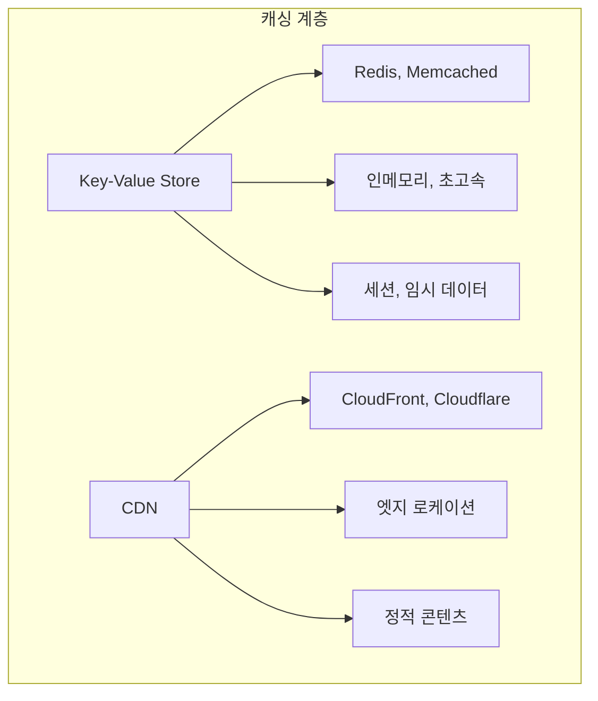

#### 캐시 패턴

| 패턴 | 설명 | 적합한 경우 |
|------|------|-------------|
| **Cache-Aside** | 앱이 캐시와 DB 직접 관리 | 읽기 집중 워크로드 |
| **Read-Through** | 캐시가 DB 조회 대행 | 단순한 읽기 패턴 |
| **Write-Through** | 캐시와 DB 동시 쓰기 | 일관성 중요 |
| **Write-Behind** | 캐시 먼저, DB 비동기 | 쓰기 성능 중요 |

#### Redis 캐시 예시

```javascript
const Redis = require('ioredis');
const redis = new Redis(process.env.REDIS_URL);

async function getUser(userId) {
  // 캐시 확인
  const cached = await redis.get(`user:${userId}`);
  if (cached) return JSON.parse(cached);

  // DB 조회
  const user = await db.query('SELECT * FROM users WHERE id = $1', [userId]);

  // 캐시 저장 (TTL: 1시간)
  await redis.setex(`user:${userId}`, 3600, JSON.stringify(user));
  return user;
}
```

---

### 9.4 파일 저장소 (File Storage)

#### 파일 서버 vs 객체 저장소

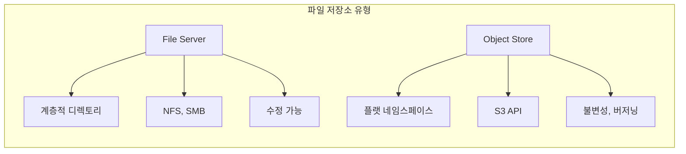

| 특성 | 파일 서버 | 객체 저장소 |
|------|-----------|-------------|
| **구조** | 계층적 디렉토리 | 플랫 버킷/키 |
| **접근** | 파일 시스템 마운트 | HTTP API |
| **수정** | 일부 수정 가능 | 전체 교체만 |
| **메타데이터** | 파일 속성 | 무제한 사용자 정의 |
| **확장성** | 제한적 | 무제한 |
| **예시** | NFS, EFS | S3, GCS |

#### S3 + CloudFront 정적 웹사이트

```hcl
# S3 버킷 생성
resource "aws_s3_bucket" "website" {
  bucket = "my-static-website"
}

resource "aws_s3_bucket_website_configuration" "website" {
  bucket = aws_s3_bucket.website.id

  index_document {
    suffix = "index.html"
  }

  error_document {
    key = "error.html"
  }
}

# CloudFront 배포
resource "aws_cloudfront_distribution" "cdn" {
  enabled             = true
  default_root_object = "index.html"

  origin {
    domain_name = aws_s3_bucket.website.bucket_regional_domain_name
    origin_id   = "S3Origin"

    s3_origin_config {
      origin_access_identity = aws_cloudfront_origin_access_identity.oai.cloudfront_access_identity_path
    }
  }

  default_cache_behavior {
    allowed_methods        = ["GET", "HEAD"]
    cached_methods         = ["GET", "HEAD"]
    target_origin_id       = "S3Origin"
    viewer_protocol_policy = "redirect-to-https"

    forwarded_values {
      query_string = false
      cookies {
        forward = "none"
      }
    }
  }

  restrictions {
    geo_restriction {
      restriction_type = "none"
    }
  }

  viewer_certificate {
    cloudfront_default_certificate = true
  }
}
```

---

### 9.5 반정형 데이터: 문서 저장소 (Document Store)

#### Schema-on-Write vs Schema-on-Read

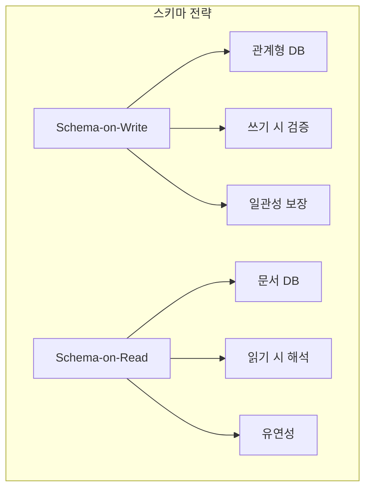

| 특성 | Schema-on-Write | Schema-on-Read |
|------|-----------------|----------------|
| **검증 시점** | 쓰기 시 | 읽기 시 |
| **유연성** | 낮음 | 높음 |
| **일관성** | 강함 | 약함 |
| **마이그레이션** | 필수 | 선택적 |
| **예시** | PostgreSQL | MongoDB |

#### MongoDB 예시

```javascript
// 문서 삽입 - 유연한 스키마
db.products.insertOne({
  name: "Laptop",
  price: 999,
  specs: {
    cpu: "Intel i7",
    ram: "16GB",
    storage: "512GB SSD"
  },
  tags: ["electronics", "computer"],
  reviews: [
    { user: "john", rating: 5, comment: "Great!" }
  ]
});

// 중첩 문서 쿼리
db.products.find({
  "specs.ram": "16GB",
  tags: "electronics"
});

// 집계 파이프라인
db.products.aggregate([
  { $match: { price: { $gt: 500 } } },
  { $group: { _id: "$category", avgPrice: { $avg: "$price" } } },
  { $sort: { avgPrice: -1 } }
]);
```

---

### 9.6 분석용 데이터: 컬럼형 데이터베이스

#### Row-Oriented vs Column-Oriented

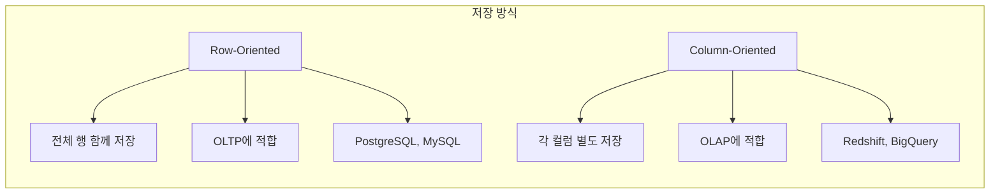

| 특성 | Row-Oriented | Column-Oriented |
|------|--------------|-----------------|
| **저장 방식** | 행 단위 | 열 단위 |
| **압축** | 낮음 | 높음 (동일 타입) |
| **쓰기** | 빠름 | 느림 |
| **전체 행 읽기** | 빠름 | 느림 |
| **집계 쿼리** | 느림 | 매우 빠름 |
| **사용 사례** | 트랜잭션 | 분석, 리포팅 |

#### 컬럼형 DB 쿼리 예시

```sql
-- 분석 쿼리: 컬럼형 DB에서 빠름
SELECT
  DATE_TRUNC('month', order_date) as month,
  SUM(amount) as total_sales,
  COUNT(*) as order_count
FROM orders
WHERE order_date >= '2024-01-01'
GROUP BY DATE_TRUNC('month', order_date)
ORDER BY month;

-- 이유: amount 컬럼만 읽으면 됨
-- Row-oriented: 모든 컬럼을 읽어야 함
```

---

### 9.7 비동기 처리 (Asynchronous Processing)

#### 메시지 큐 vs 이벤트 스트림

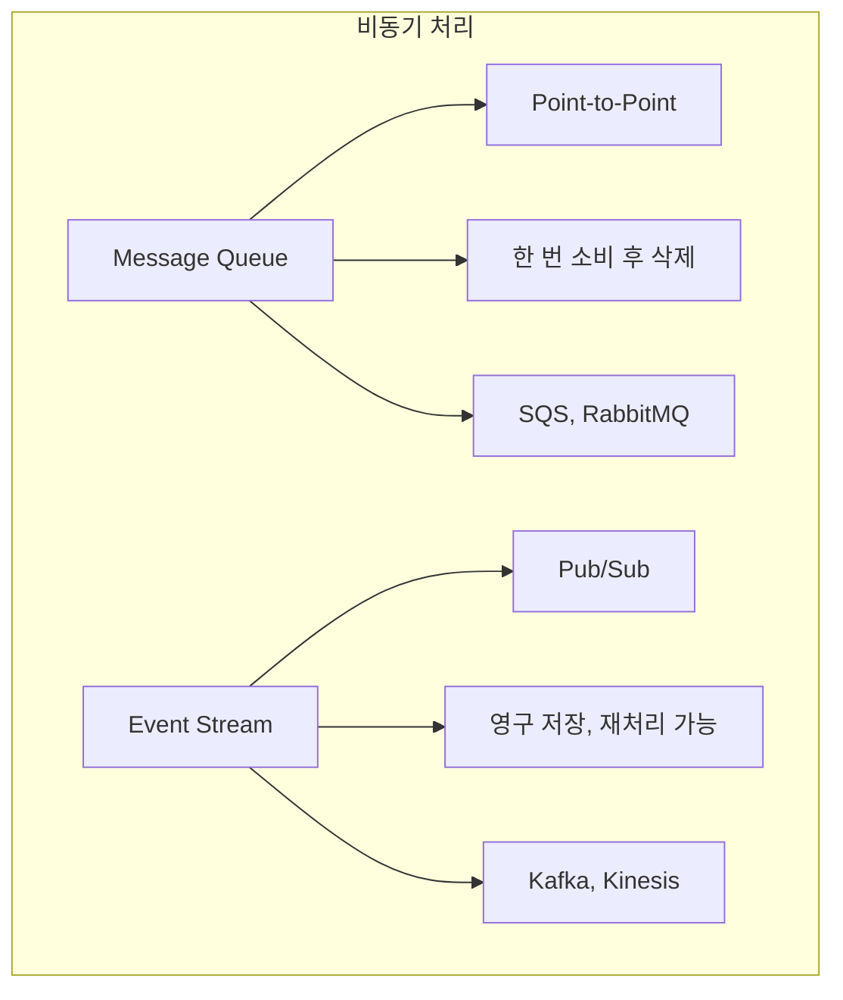

| 특성 | Message Queue | Event Stream |
|------|---------------|--------------|
| **소비 모델** | Point-to-Point | Pub/Sub |
| **메시지 보관** | 소비 후 삭제 | 영구 보관 |
| **재처리** | 불가능 | 가능 |
| **순서 보장** | 제한적 | 파티션 내 보장 |
| **사용 사례** | 작업 큐 | 이벤트 소싱, 로그 |

#### SQS 메시지 큐 예시

```javascript
const AWS = require('aws-sdk');
const sqs = new AWS.SQS();

// 메시지 전송
await sqs.sendMessage({
  QueueUrl: process.env.QUEUE_URL,
  MessageBody: JSON.stringify({
    action: 'process_order',
    orderId: '12345'
  })
}).promise();

// 메시지 수신 (Lambda에서)
exports.handler = async (event) => {
  for (const record of event.Records) {
    const message = JSON.parse(record.body);
    await processOrder(message.orderId);
  }
};
```

#### Kafka 이벤트 스트림 예시

```javascript
const { Kafka } = require('kafkajs');

const kafka = new Kafka({
  clientId: 'my-app',
  brokers: ['kafka1:9092', 'kafka2:9092']
});

// 프로듀서
const producer = kafka.producer();
await producer.send({
  topic: 'orders',
  messages: [
    { key: 'order-123', value: JSON.stringify({ status: 'created' }) }
  ]
});

// 컨슈머 (여러 그룹이 독립적으로 소비 가능)
const consumer = kafka.consumer({ groupId: 'analytics-group' });
await consumer.subscribe({ topic: 'orders' });
await consumer.run({
  eachMessage: async ({ topic, partition, message }) => {
    console.log(message.value.toString());
  }
});
```

---

### 9.8 확장성과 가용성 (Scalability & Availability)

#### 복제 (Replication)

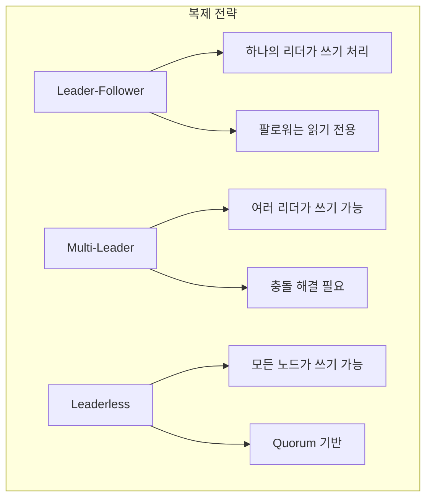

#### 파티셔닝 (Partitioning/Sharding)

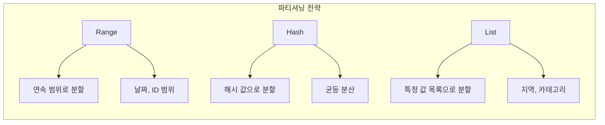

#### CAP 정리

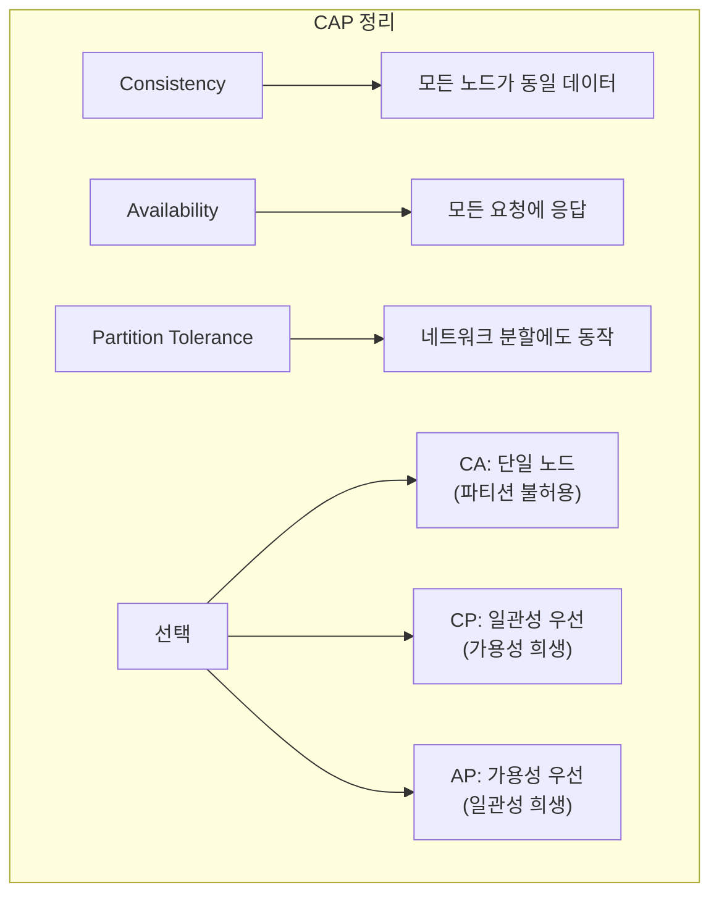

| 유형 | 특성 | 예시 |
|------|------|------|
| **CP** | 일관성 + 파티션 허용 | HBase, MongoDB (기본) |
| **AP** | 가용성 + 파티션 허용 | Cassandra, DynamoDB |
| **CA** | 일관성 + 가용성 | 단일 노드 RDBMS |

#### NoSQL vs NewSQL

| 특성 | 전통 RDBMS | NoSQL | NewSQL |
|------|-----------|-------|--------|
| **스키마** | 고정 | 유연 | 유연~고정 |
| **트랜잭션** | ACID | BASE | ACID |
| **확장성** | 수직 | 수평 | 수평 |
| **일관성** | 강함 | 최종적 | 강함 |
| **예시** | PostgreSQL | MongoDB, Cassandra | CockroachDB, Spanner |

---

### 9.9 백업과 복구 (Backup & Recovery)

#### 백업 전략

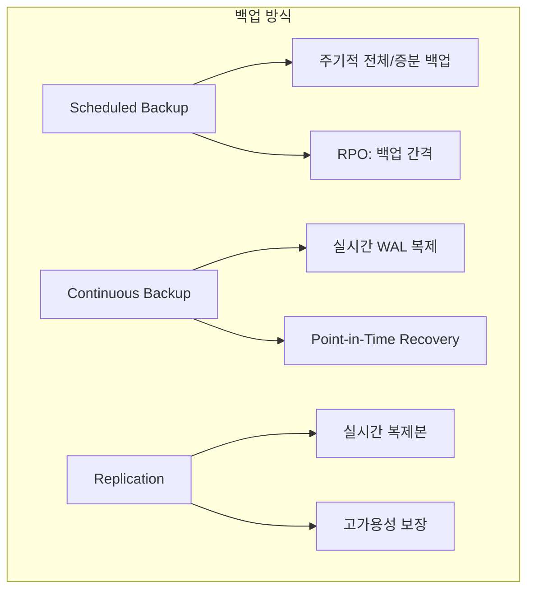

#### 3-2-1 백업 규칙

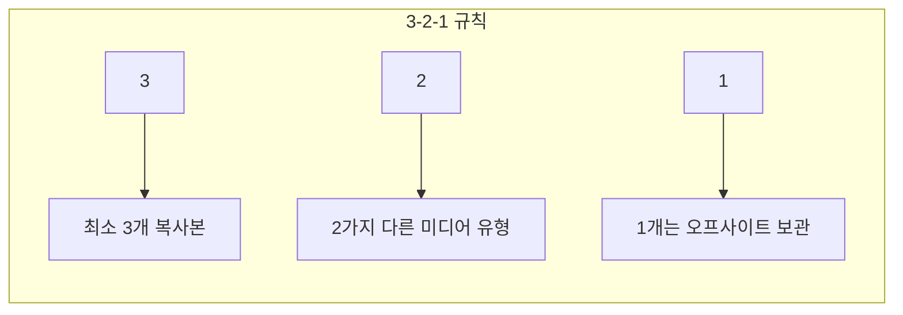

| 요소 | 설명 | 예시 |
|------|------|------|
| **3 Copies** | 최소 3개 복사본 | 원본 + 2개 백업 |
| **2 Media Types** | 다른 저장 매체 | 로컬 디스크 + 테이프/클라우드 |
| **1 Offsite** | 다른 물리적 위치 | 다른 리전, 다른 데이터센터 |

#### AWS 백업 예시

```hcl
# RDS 자동 백업
resource "aws_db_instance" "main" {
  identifier = "my-database"

  # 자동 백업 활성화
  backup_retention_period = 7  # 7일 보관
  backup_window           = "03:00-04:00"  # 백업 시간대

  # Multi-AZ 복제
  multi_az = true

  # 스냅샷 복사 (다른 리전)
  copy_tags_to_snapshot = true
}

# S3 버전 관리 및 복제
resource "aws_s3_bucket_versioning" "backup" {
  bucket = aws_s3_bucket.backup.id
  versioning_configuration {
    status = "Enabled"
  }
}

resource "aws_s3_bucket_replication_configuration" "backup" {
  bucket = aws_s3_bucket.backup.id
  role   = aws_iam_role.replication.arn

  rule {
    status = "Enabled"
    destination {
      bucket        = aws_s3_bucket.backup_replica.arn
      storage_class = "STANDARD_IA"
    }
  }
}
```

---

## 💡 실무 적용 포인트

### 데이터 저장소 선택 가이드

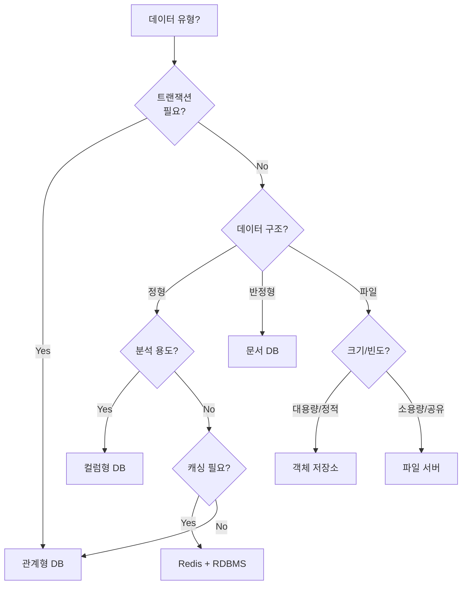

### 저장소별 사용 사례 요약

| 저장소 | 강점 | 약점 | 사용 사례 |
|--------|------|------|-----------|
| **PostgreSQL** | ACID, 복잡한 쿼리 | 수평 확장 어려움 | 사용자 데이터, 주문 |
| **Redis** | 초고속, 다양한 자료구조 | 메모리 제한 | 세션, 캐시, 실시간 |
| **S3** | 무제한 확장, 저렴 | 지연 시간 | 정적 파일, 백업 |
| **MongoDB** | 유연한 스키마 | 복잡한 조인 | 콘텐츠 관리, 로그 |
| **Redshift** | 대용량 분석 | 실시간 부적합 | BI, 리포팅 |
| **Kafka** | 고처리량, 재처리 | 복잡한 운영 | 이벤트 소싱, 로그 |

### 확장성 전략

| 상황 | 전략 | 구현 |
|------|------|------|
| 읽기 부하 증가 | 복제 + 읽기 전용 복제본 | RDS Read Replica |
| 쓰기 부하 증가 | 파티셔닝/샤딩 | 해시 기반 샤딩 |
| 글로벌 서비스 | 멀티 리전 복제 | DynamoDB Global Tables |
| 캐시 필요 | CDN + 애플리케이션 캐시 | CloudFront + ElastiCache |

---

## ✅ 핵심 개념 체크리스트

### 기본 저장소
- [ ] HDD vs SSD 차이점과 선택 기준
- [ ] EBS와 Persistent Volume 이해
- [ ] 관계형 DB ACID 속성 설명 가능
- [ ] 스키마, 제약조건, 외래키 설계

### 캐싱과 파일 저장
- [ ] Cache-Aside 패턴 구현
- [ ] CDN 동작 원리와 CloudFront 설정
- [ ] 파일 서버 vs 객체 저장소 구분
- [ ] S3 정적 웹사이트 호스팅

### 고급 저장소
- [ ] Schema-on-Write vs Schema-on-Read
- [ ] Row-Oriented vs Column-Oriented DB
- [ ] 메시지 큐 vs 이벤트 스트림 선택
- [ ] Kafka 파티션과 컨슈머 그룹

### 확장성과 백업
- [ ] Leader-Follower 복제 이해
- [ ] 파티셔닝 전략 (Range, Hash, List)
- [ ] CAP 정리와 트레이드오프
- [ ] 3-2-1 백업 규칙 적용

---

## 📚 핵심 요점 (Key Takeaways)

1. **로컬 스토리지**: 하드 드라이브는 데이터의 기본 저장소이며, 네트워크 연결 스토리지는 컴퓨팅과 스토리지 분리를 가능하게 한다

2. **관계형 DB**: SQL 기반 관계형 데이터베이스는 ACID 트랜잭션, 스키마, 제약조건 덕분에 대부분 앱의 기본 데이터 저장소로 적합하다

3. **캐싱**: Key-Value Store와 CDN을 사용하여 자주 접근하는 데이터를 메모리나 엣지에 캐싱하면 성능이 크게 향상된다

4. **객체 저장소**: S3 같은 객체 저장소는 정적 콘텐츠에 이상적이며, CDN과 함께 사용하면 전 세계에 빠르게 제공할 수 있다

5. **문서 저장소**: MongoDB 같은 문서 저장소는 유연한 Schema-on-Read 접근 방식으로 반정형 데이터를 저장한다

6. **컬럼형 DB**: 분석 쿼리에는 Row-Oriented보다 Column-Oriented 데이터베이스가 훨씬 효율적이다

7. **비동기 처리**: 메시지 큐는 작업 분배에, 이벤트 스트림은 영구 로그와 재처리가 필요한 경우에 적합하다

8. **복제**: 데이터를 여러 서버에 복제하면 읽기 성능과 가용성이 향상되지만, 일관성 트레이드오프가 발생한다

9. **파티셔닝**: 데이터를 여러 서버에 분산하면 쓰기 처리량이 향상되지만, 쿼리 복잡도가 증가한다

10. **CAP 정리**: 분산 데이터 저장소에서는 일관성, 가용성, 파티션 허용성 중 두 가지만 완벽히 보장할 수 있다

11. **NoSQL**: 확장성과 유연성을 위해 일관성을 희생하는 트레이드오프를 선택한다

12. **NewSQL**: ACID 트랜잭션을 유지하면서 수평 확장을 지원하는 새로운 세대의 데이터베이스다

13. **백업**: 데이터를 안전하게 보호하려면 3-2-1 규칙(3개 복사본, 2가지 미디어, 1개 오프사이트)을 따른다

---

## 🔗 참고 자료

- [AWS Database Services](https://aws.amazon.com/products/databases/)
- [MongoDB Documentation](https://www.mongodb.com/docs/)
- [Apache Kafka](https://kafka.apache.org/documentation/)
- [PostgreSQL Documentation](https://www.postgresql.org/docs/)
- [Redis Documentation](https://redis.io/docs/)

---

## 📚 다음 챕터 미리보기

- **Chapter 10**: How to Build Docker Images - 컨테이너 이미지 빌드와 최적화

