# Chapter 10: How to Monitor Your Systems (시스템 모니터링)

## 📌 핵심 요약

> **"모니터링은 로그, 메트릭, 이벤트, 알림의 4가지 핵심 요소로 구성된다. 로그는 구조화된 JSON 형식으로 집계하고, 메트릭은 가용성/비즈니스/애플리케이션/서버/팀 5가지 유형을 수집한다. 관측 가능성(Observability)과 분산 추적으로 복잡한 시스템을 이해하고, 알림은 액션 가능하고 중요하며 긴급한 경우에만 발송한다. 인시던트 발생 시 블레임리스 포스트모템으로 시스템을 개선한다."**

이 챕터에서는 소프트웨어 시스템을 모니터링하는 4가지 핵심 기법을 학습한다.

---

## 🎯 학습 목표

이 챕터를 완료하면 다음을 할 수 있다:

- [ ] 로그 레벨과 구조화된 로깅 구현
- [ ] 로그 파일 로테이션과 집계 설정
- [ ] 5가지 유형의 메트릭 수집 및 대시보드 구성
- [ ] Four Golden Signals (LETS) 모니터링
- [ ] 관측 가능성(Observability) 도구 활용
- [ ] 분산 추적(Distributed Tracing) 구현
- [ ] 효과적인 알림 트리거 설정
- [ ] 온콜 로테이션과 인시던트 대응 프로세스 수립

---

## 📖 본문 정리

### 10.1 모니터링의 4가지 핵심 요소

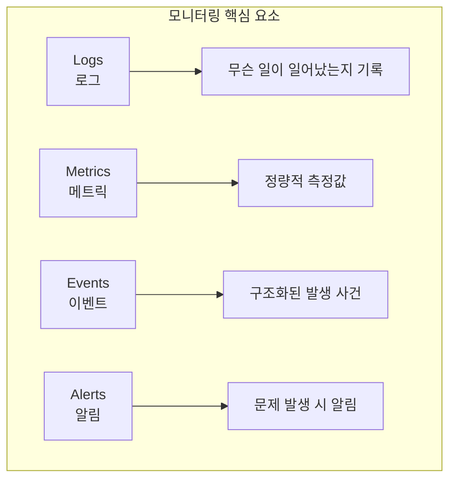

| 요소 | 목적 | 주요 도구 |
|------|------|-----------|
| **Logs** | 디버깅, 분석, 감사 | winston, Log4j, Fluentd |
| **Metrics** | 성능, 사용자 행동 측정 | Datadog, CloudWatch, Prometheus |
| **Events** | 관측 가능성, 추적 | Honeycomb, Jaeger, OpenTelemetry |
| **Alerts** | 문제 발견 및 알림 | PagerDuty, Opsgenie |

---

### 10.2 로그 (Logs)

#### 로그 레벨 (Log Levels)

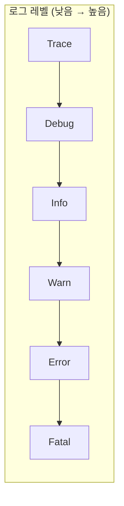

| 레벨 | 목적 | 예시 |
|------|------|------|
| **Trace** | 코드 실행 경로 추적 | 함수 진입점 로그 |
| **Debug** | 디버깅용 진단 정보 | 데이터 구조 내용 |
| **Info** | 중요 정보 캡처 | 사용자 구매 완료 |
| **Warn** | 실패하지 않은 예상치 못한 문제 | 데이터 누락 but 폴백 사용 |
| **Error** | 일부 기능 실패 | 기능 중단 오류 |
| **Fatal** | 전체 소프트웨어 실패 | DB 완전 다운 |

#### winston 로깅 라이브러리 예시

```javascript
const winston = require('winston');

// 기본 로거 생성
const logger = winston.createLogger({
  level: 'info',                              // 최소 로그 레벨
  format: winston.format.simple(),
  transports: [new winston.transports.Console()]
});

logger.info('Hello, World!');
// 출력: info: Hello, World!

// 다양한 로그 레벨 사용
logger.debug('디버그 메시지');  // 출력 안됨 (level이 info이므로)
logger.info('정보 메시지');     // 출력됨
logger.error('에러 메시지');    // 출력됨
```

#### 로그 포맷팅

```javascript
const logger = winston.createLogger({
  level: 'info',
  defaultMeta: req,  // 요청 객체 메타데이터
  format: winston.format.combine(
    winston.format.timestamp(),
    winston.format.printf(({timestamp, ip, method, path, level, message}) =>
      `${timestamp} ${ip} ${method} ${path} [${level}]: ${message}`
    ),
  ),
  transports: [new winston.transports.Console()]
});

// 출력 예시:
// 2024-10-05T20:17:49.332Z 1.2.3.4 GET /foo [info]: A message at info level
```

#### 구조화된 로깅 (Structured Logging)

```javascript
const logger = winston.createLogger({
  level: 'info',
  format: winston.format.combine(
    winston.format.timestamp(),
    winston.format.json()  // JSON 포맷
  ),
  transports: [new winston.transports.Console()]
});

// Key-Value 쌍으로 로깅
logger.info({
  request_id: req.id,
  user_id: user.id,
  action: "complete-purchase",
  product_id: product.id,
  product_price: product.price,
  message: `User bought ${product.name}`
});

// 출력 (JSON):
// {
//   "action": "complete-purchase",
//   "level": "info",
//   "message": "User bought Fundamentals of DevOps",
//   "product_id": 1098174593,
//   "product_price": "$54.99",
//   "timestamp": "2024-10-05T20:21:49.231Z",
//   "user_id": 53345644345655
// }
```

#### 로그 파일 로테이션

```javascript
const logger = winston.createLogger({
  transports: [
    new winston.transports.File({
      filename: 'app.log',
      maxsize: 10000000,   // 10MB 초과 시 로테이션
      maxFiles: 10,        // 최대 10개 파일 유지
      zippedArchive: true  // 이전 파일 압축
    })
  ]
});
```

#### 로그 집계 (Log Aggregation)

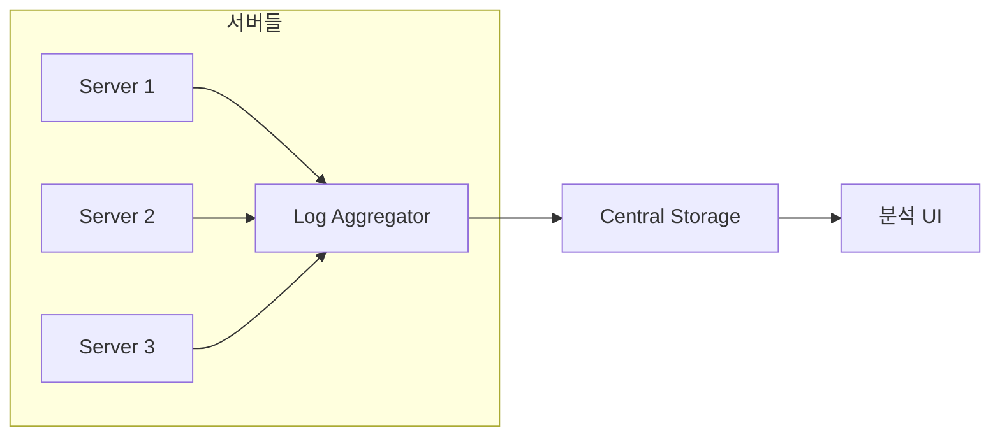

| 도구 | 유형 | 특징 |
|------|------|------|
| **Elasticsearch** | 저장/분석 | Logstash와 함께 ELK 스택 |
| **CloudWatch Logs** | AWS 통합 | Lambda, EC2 자동 집계 |
| **Fluentd** | 수집기 | 다양한 백엔드 지원 |
| **OpenTelemetry** | 표준 | 벤더 중립적 |

---

### 10.3 메트릭 (Metrics)

#### 5가지 메트릭 유형

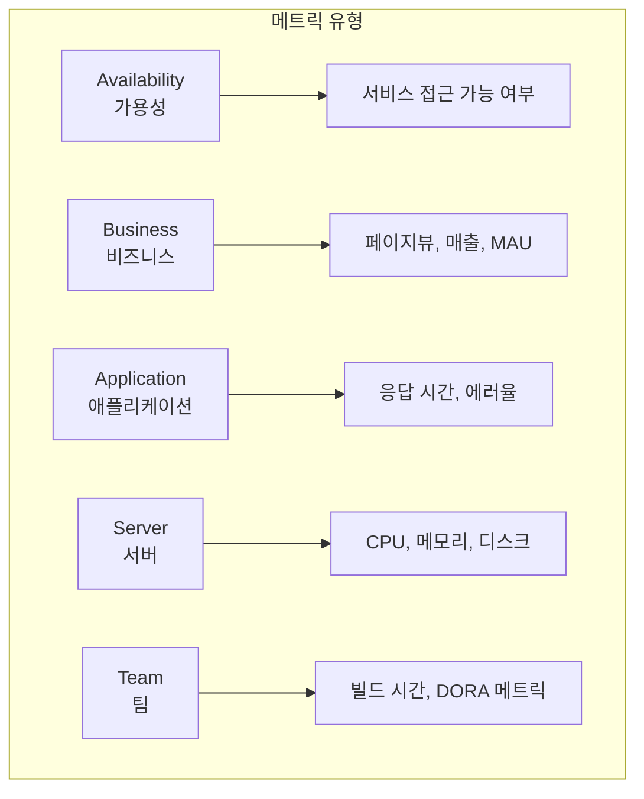

#### 가용성과 신뢰성 (Nines)

| 신뢰성 | 연간 허용 다운타임 | 월간 허용 다운타임 |
|--------|-------------------|-------------------|
| 99% (2 nines) | 3.6일 | 7시간 |
| 99.9% (3 nines) | 8.7시간 | 44분 |
| 99.99% (4 nines) | 52분 | 4분 |
| 99.999% (5 nines) | 5분 | 26초 |

**100% 가용성이 비현실적인 이유**:
1. 각 추가 nine은 기하급수적으로 비용 증가
2. 고객이 차이를 느끼지 못할 수 있음
3. 매우 높은 신뢰성을 위해 모든 개발 중단 필요

#### Four Golden Signals (LETS)

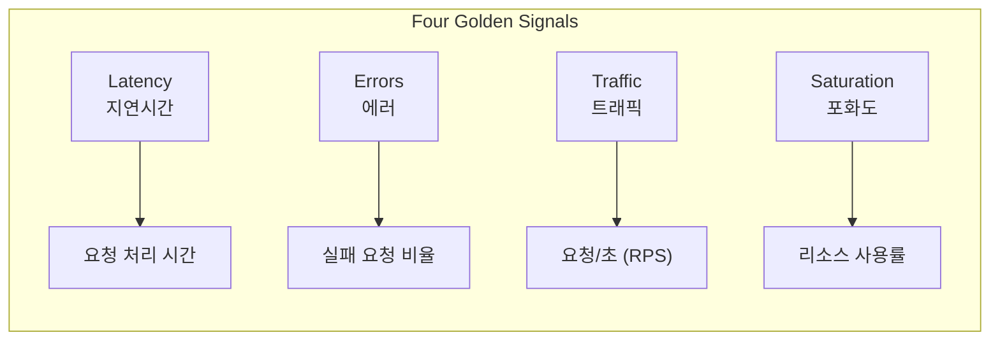

| 신호 | 설명 | 주의점 |
|------|------|--------|
| **Latency** | 요청 처리 시간 | 증가 시 과부하 신호 |
| **Errors** | 실패 요청 % | 사용자에게 보이는/숨겨진 오류 |
| **Traffic** | 요청량 (RPS/QPS) | 급증/급감 모두 문제 신호 |
| **Saturation** | CPU/메모리/디스크 사용률 | 90% 이상 시 성능 저하 |

#### 메트릭 수집 및 시각화 흐름

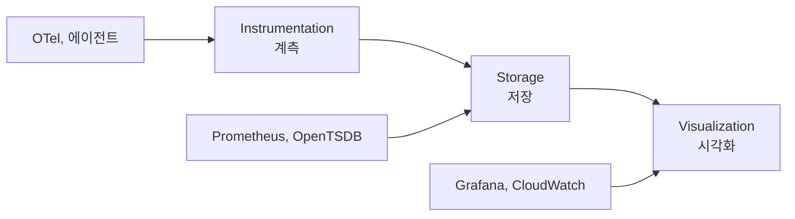

#### CloudWatch 대시보드 예시 (Terraform)

```hcl
# Route 53 헬스체크
resource "aws_route53_health_check" "example" {
  fqdn              = module.alb.alb_dns_name
  type              = "HTTP"
  request_interval  = "10"
  resource_path     = "/"
  port              = 80
  failure_threshold = 1

  tags = {
    Name = "sample-app-health-check"
  }
}

# CloudWatch 대시보드
module "cloudwatch_dashboard" {
  source = "brikis98/devops/book//modules/cloudwatch-dashboard"

  name            = "sample-app-dashboard"
  asg_name        = module.asg.asg_name
  alb_name        = module.alb.alb_name
  alb_arn_suffix  = module.alb.alb_arn_suffix
  health_check_id = aws_route53_health_check.example.id
}
```

---

### 10.4 이벤트 (Events)

#### 관측 가능성 (Observability)

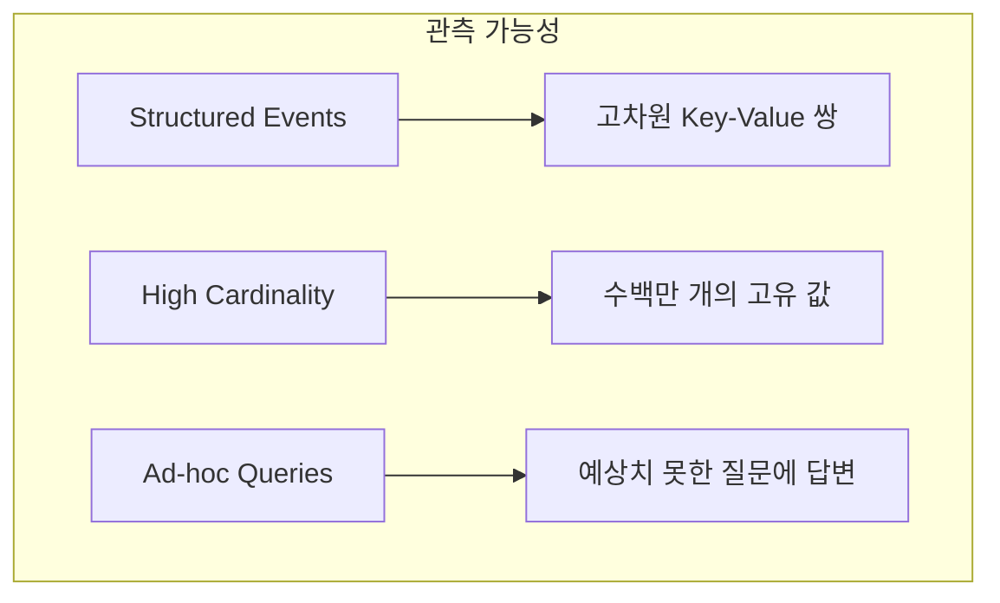

**관측 가능성이 필요한 이유**:
- 예측할 수 없는 문제 증가
- 새 코드 배포 없이 시스템 조사 필요
- Unknown Unknowns 처리

**관측 가능성 도구**:
- Honeycomb (선구자)
- SigNoz, Uptrace
- New Relic, Datadog (관측 가능성 기능 추가)

#### 디버깅 예시 흐름

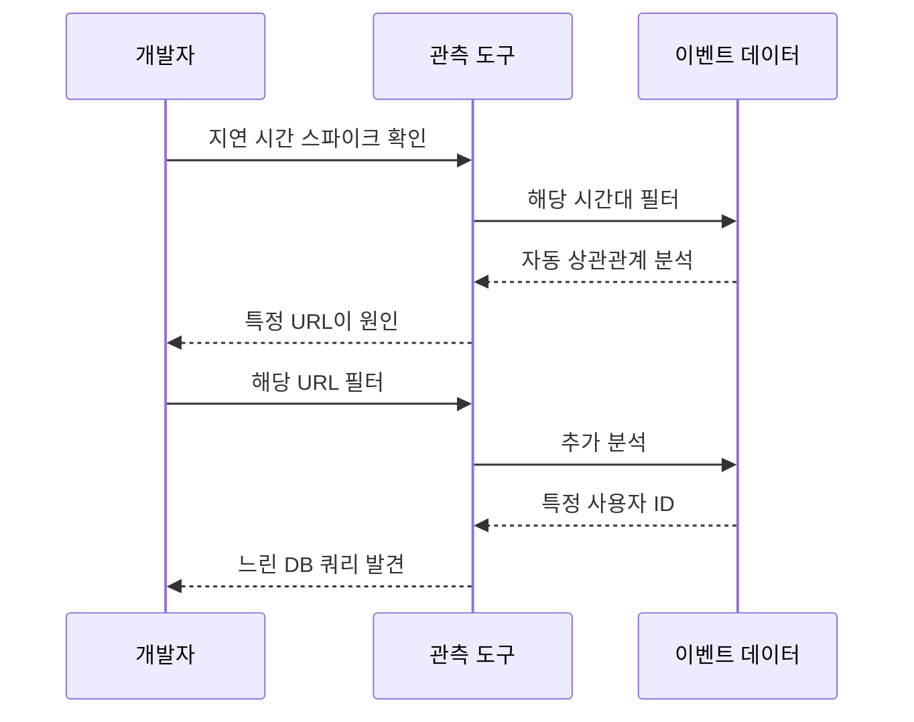

#### 분산 추적 (Distributed Tracing)

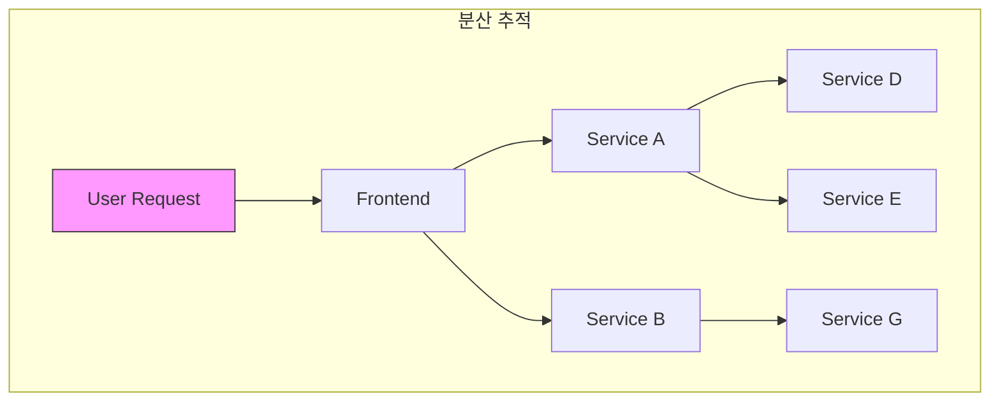

**Trace ID 전파**:
1. 최초 요청에 고유 Trace ID 할당
2. 모든 다운스트림 요청에 Trace ID 전달
3. 각 서비스가 Trace ID와 함께 이벤트 발행
4. 추적 도구가 이벤트를 워터폴 다이어그램으로 조합

**분산 추적 도구**:
- Zipkin, Jaeger (전용)
- OpenTelemetry (표준)
- Istio (서비스 메시 내장)

#### 프로덕션 테스팅 (TIP)

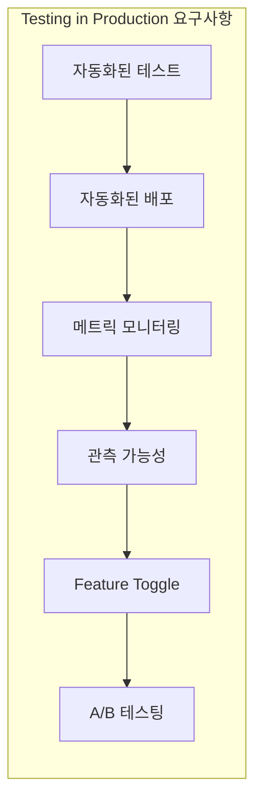

| TIP 적합 | TIP 부적합 |
|----------|-----------|
| 낮은 버그 비용 | 보안 기능 |
| UI 변경 | 금융 거래 |
| 기능 실험 | 데이터 저장 |
| 비핵심 기능 | 생명 관련 기능 |

---

### 10.5 알림 (Alerts)

#### 알림 트리거 유형

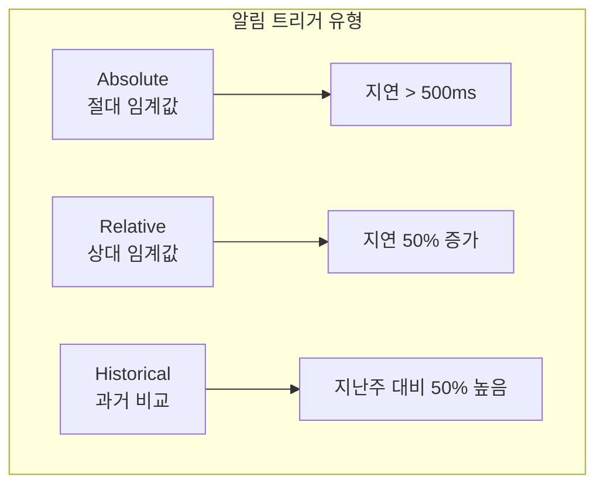

| 트리거 유형 | 설명 | 적합한 경우 |
|-------------|------|-------------|
| **Absolute** | 구체적 값 기준 | 디스크 공간 0 |
| **Relative** | 베이스라인 대비 | 스파이크 감지 |
| **Historical** | 과거 동일 시점 대비 | 계절적 패턴 |

#### 알림 발송 기준 (3가지 조건)

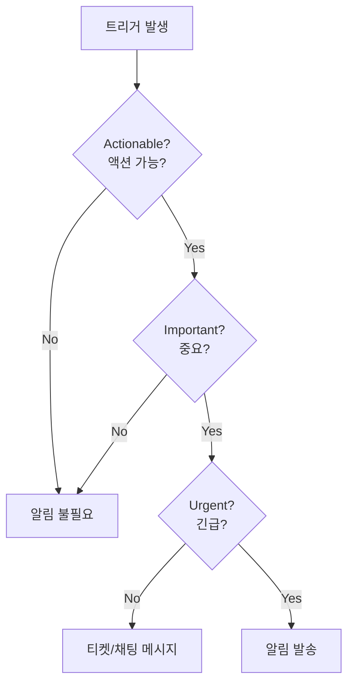

**Alert Fatigue 방지**:
- 3가지 조건 모두 충족 시에만 알림
- 아니면 비긴급 알림 (티켓, Slack)
- 모든 알림 해결 후 설정 검토

#### 온콜 (On-Call) 모범 사례

| 실천 | 설명 |
|------|------|
| **Toil 측정** | 반복 작업 vs 엔지니어링 비율 추적 (목표: <20%) |
| **Error Budget** | 가용성 목표에서 허용 다운타임 계산 |
| **개발자 온콜 포함** | "던져버리기" 문화 방지 |
| **인시던트 해결자 인정** | 인정, 휴가, 보너스 |

#### 인시던트 대응 프로세스

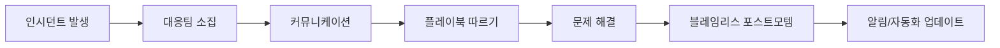

**인시던트 대응 계획 구성요소**:
- **Response Team**: 담당자, 에스컬레이션 경로
- **Response Time**: SLO/SLA 충족
- **Communication Channels**: 이메일, 채팅, 상태 페이지
- **Playbooks**: 특정 문제 유형별 단계별 지침
- **Blameless Postmortem**: 시스템 원인 분석, 개선점 도출

#### CloudWatch 알림 예시

```hcl
# CloudWatch 알림 설정
resource "aws_cloudwatch_metric_alarm" "sample_app_is_down" {
  provider = aws.us_east_1

  alarm_name = "sample-app-is-down"

  namespace   = "AWS/Route53"
  metric_name = "HealthCheckStatus"
  dimensions = {
    HealthCheckId = aws_route53_health_check.example.id
  }

  statistic           = "Minimum"
  comparison_operator = "LessThanThreshold"
  threshold           = 1
  period              = 60
  evaluation_periods  = 1

  alarm_actions = [aws_sns_topic.cloudwatch_alerts.arn]
}

# SNS 토픽 및 구독
resource "aws_sns_topic" "cloudwatch_alerts" {
  provider = aws.us_east_1
  name     = "sample-app-cloudwatch-alerts"
}

resource "aws_sns_topic_subscription" "email" {
  provider  = aws.us_east_1
  topic_arn = aws_sns_topic.cloudwatch_alerts.arn
  protocol  = "email-json"
  endpoint  = "your-email@example.com"
}
```

---

## 💡 실무 적용 포인트

### 모니터링 시작 가이드

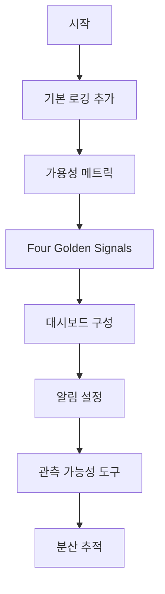

### 도구 선택 가이드

| 요구사항 | 추천 도구 |
|----------|-----------|
| 로그 집계 | ELK Stack, CloudWatch Logs |
| 메트릭 수집 | Prometheus, CloudWatch |
| 시각화 | Grafana, CloudWatch Dashboards |
| 관측 가능성 | Honeycomb, Datadog |
| 분산 추적 | Jaeger, OpenTelemetry |
| 알림 | PagerDuty, Opsgenie |
| 통합 솔루션 | Datadog, New Relic |

### OpenTelemetry 권장 이유

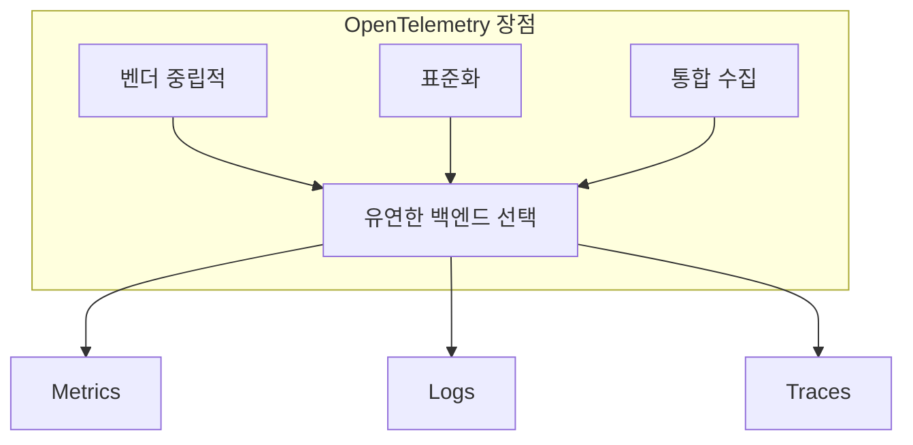

---

## ✅ 핵심 개념 체크리스트

### 로그
- [ ] 로그 레벨 (Trace → Fatal) 이해 및 활용
- [ ] 구조화된 로깅 (JSON) 구현
- [ ] 로그 파일 로테이션 설정
- [ ] 로그 집계 도구 사용 (CloudWatch, ELK)

### 메트릭
- [ ] 5가지 메트릭 유형 구분
- [ ] Four Golden Signals (LETS) 모니터링
- [ ] 대시보드 구성 및 유지
- [ ] SLO/SLA 설정 및 추적

### 이벤트
- [ ] 관측 가능성 개념 이해
- [ ] 구조화된 이벤트 발행
- [ ] 분산 추적 구현
- [ ] TIP 적합성 판단

### 알림
- [ ] 3가지 조건 (Actionable, Important, Urgent)
- [ ] Alert Fatigue 방지 전략
- [ ] 온콜 로테이션 운영
- [ ] 블레임리스 포스트모템 수행

---

## 📚 핵심 요점 (Key Takeaways)

1. **로깅 추가**: 코드 전반에 로깅을 추가하여 시스템에서 일어나는 일을 가시화한다

2. **효과적인 로깅**: 로그 레벨, 포맷팅, 다중 로거, 구조화된 로깅, 파일 로테이션, 로그 집계를 사용하여 로깅을 효과적으로 만든다

3. **메트릭 활용**: 메트릭을 사용하여 문제 감지, 사용자 행동 이해, 제품 및 팀 성능 개선, 지속적 피드백과 개선의 메커니즘으로 활용한다

4. **다양한 메트릭 수집**: 5가지 유형의 메트릭(가용성, 비즈니스, 애플리케이션, 서버, 팀)을 수집하고 비즈니스에 가장 중요한 메트릭에 집중하는 대시보드를 구축한다

5. **구조화된 이벤트**: 코드를 계측하여 구조화된 이벤트를 발행한다. 관측 가능성 도구를 사용하여 이러한 구조화된 이벤트에 대해 반복적이고 임시적인 쿼리를 수행하여 소프트웨어의 동작을 이해한다

6. **분산 추적**: 분산 추적을 사용하여 마이크로서비스 아키텍처를 통한 요청 경로를 시각화한다

7. **알림 기준**: 알림을 사용하여 문제를 알리되, 해당 문제가 액션 가능하고, 중요하며, 긴급한 경우에만 사용한다

8. **온콜 로테이션**: 온콜 로테이션을 사용하여 알림에 대응하되, Toil을 관리하고, Error Budget을 적용하고, 개발자를 로테이션에 포함하고, 인시던트 해결자를 인정한다

9. **인시던트 대응**: 대응팀을 구성하고, 이해관계자를 업데이트하고, SLA/SLO를 충족하고, 플레이북을 따라 인시던트를 해결한다. 각 인시던트 후 블레임리스 포스트모템을 수행하고 알림 설정을 업데이트한다

---

## 🔗 참고 자료

- [OpenTelemetry](https://opentelemetry.io/)
- [Honeycomb Observability](https://www.honeycomb.io/)
- [Prometheus Monitoring](https://prometheus.io/)
- [Grafana Dashboards](https://grafana.com/)
- [PagerDuty Incident Response](https://www.pagerduty.com/)

---

## 📚 다음 챕터 미리보기

- **Chapter 11**: The Future of DevOps and Software Delivery - DevOps와 소프트웨어 딜리버리의 미래

