# Chapter 11: The Future of DevOps and Software Delivery (DevOps와 소프트웨어 딜리버리의 미래)

## 📌 핵심 요약

> **"DevOps의 미래는 더 높은 수준의 추상화로 이동하는 것이다. Infrastructureless는 인프라를 신경 쓰지 않고 앱에 집중하게 하고, Generative AI는 코딩 어시스턴트와 RAG를 통해 생산성을 높이며, Secure by Default는 보안을 기본값으로 만든다. Platform Engineering은 IDP를 통해 개발자 경험을 표준화하고, Infrastructure from Code는 앱 코드에서 인프라를 자동 추론한다."**

이 챕터에서는 DevOps와 소프트웨어 딜리버리의 5가지 미래 트렌드를 탐구한다.

---

## 🎯 학습 목표

이 챕터를 완료하면 다음을 이해할 수 있다:

- [ ] Infrastructureless 개념과 서버리스의 진화
- [ ] Generative AI의 DevOps 적용과 한계
- [ ] Secure by Default 전략 (Shift Left, Supply Chain Security)
- [ ] Platform Engineering과 IDP (Internal Developer Platform)
- [ ] Infrastructure from Code (IfC) 접근 방식

---

## 📖 본문 정리

### 11.1 추상화의 진화

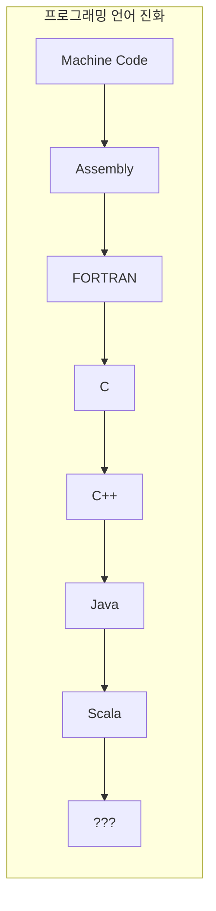

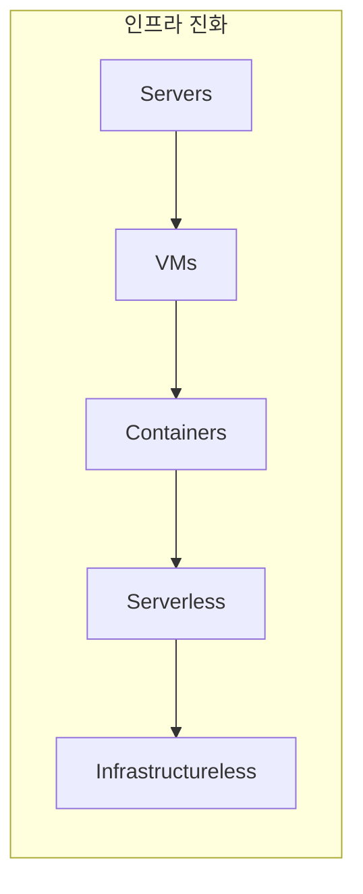

**추상화의 핵심 원리**:
1. 대부분의 사용 사례에서 저수준 제어가 필요 없음
2. 고수준 구성이 더 쉽고 접근성이 높음
3. 제어를 포기하는 대신 문제 클래스 전체를 무시 가능

---

### 11.2 Infrastructureless

#### 서버리스의 현재와 미래

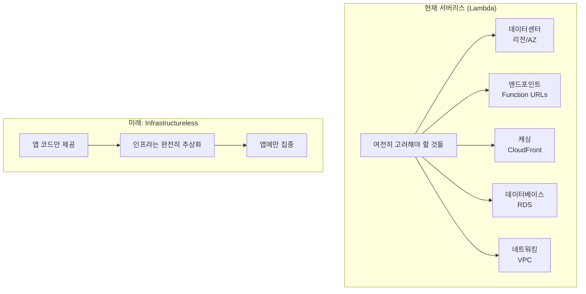

| 현재 서버리스 | 미래 Infrastructureless |
|--------------|------------------------|
| 리전/AZ 선택 필요 | 자동 처리 |
| VPC 구성 필요 | 자동 처리 |
| DB 연결 설정 | 자동 처리 |
| 캐싱 구성 | 자동 처리 |
| **앱 + 인프라 고려** | **앱에만 집중** |

**핵심 예측**:
> 인프라는 여전히 존재하지만, 대부분의 사용 사례에서 완전히 처리되어 무시할 수 있는 저수준 문제가 된다. 앱과 관련된 고수준 문제에만 집중하게 된다.

---

### 11.3 Generative AI

#### GenAI의 DevOps 적용

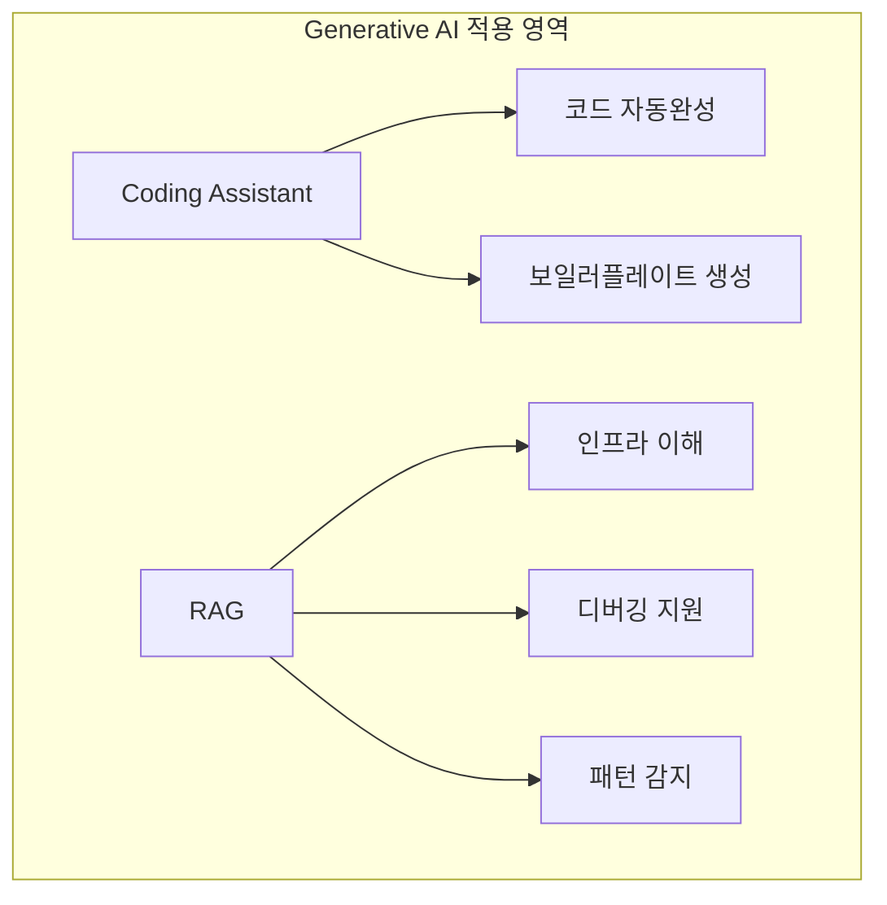

#### GenAI의 한계점

| 한계 | 설명 | 영향 |
|------|------|------|
| **Hallucinations** | 설득력 있어 보이지만 잘못된/가짜 답변 생성 | 존재하지 않는 API 사용 코드 생성 |
| **Inconsistency** | 유사한 프롬프트에 다른 응답 | 보안 취약 코드 생성 가능 |
| **No Source Citation** | 원본 소스 참조 불가 | 코드 품질/신뢰성 판단 불가 |

#### RAG (Retrieval-Augmented Generation)

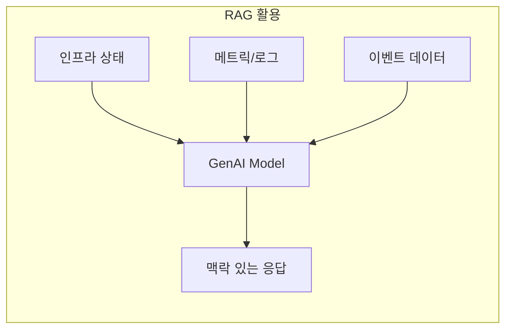

**RAG 활용 사례**:

| 활용 | 질문 예시 | 효과 |
|------|----------|------|
| **인프라 이해** | "이 K8s 클러스터 구성?" | 신규 입사자 온보딩 |
| **디버깅** | "지난 24시간 고지연 요청?" | 자연어 관측 도구 |
| **패턴 감지** | VPC 플로우 로그 분석 | DDoS 공격 자동 감지 |

**GenAI DevOps 도구 예시**:
- Honeycomb Query Assistant
- Datadog Bits AI
- Snyk DeepCode AI

---

### 11.4 Secure by Default

#### 현재의 보안 문제

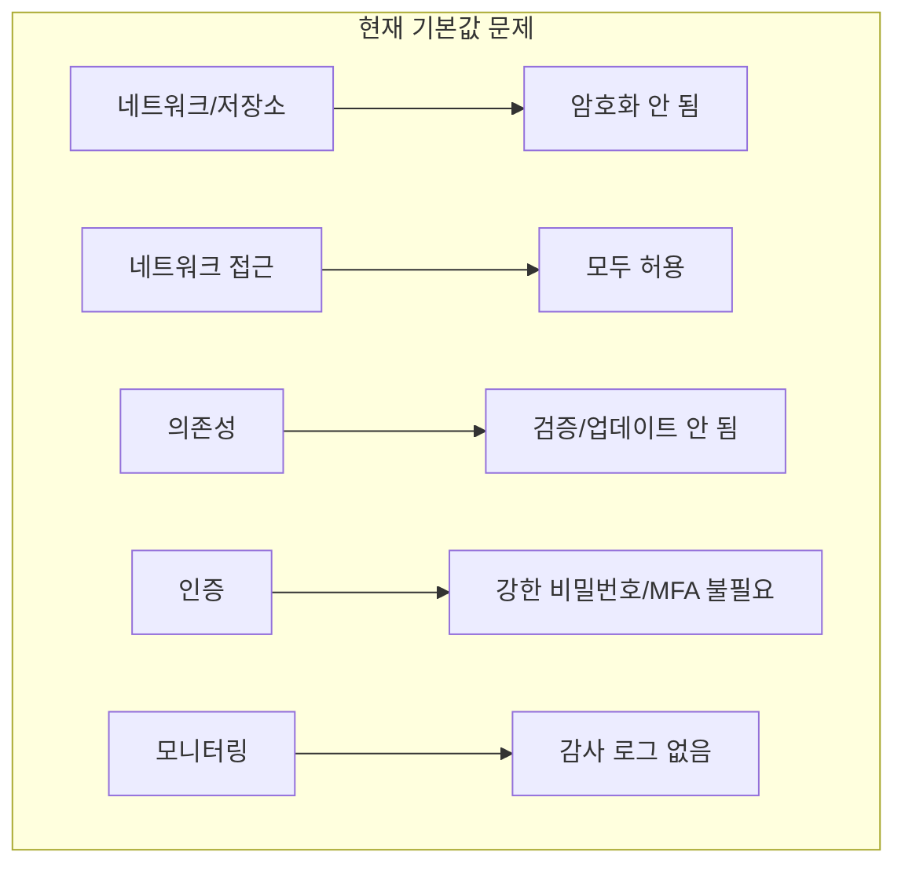

#### Secure by Default 트렌드

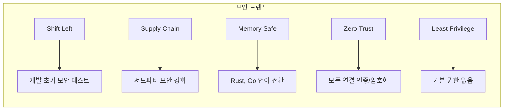

#### Shift Left 전략

| 유형 | 설명 | 도구 예시 |
|------|------|-----------|
| **SAST** | 정적 분석으로 취약점 탐지 | Snyk, SonarQube, Wiz |
| **DAST** | 실행 중 공격 시뮬레이션 | ZAP, Invicti |

#### Supply Chain Security

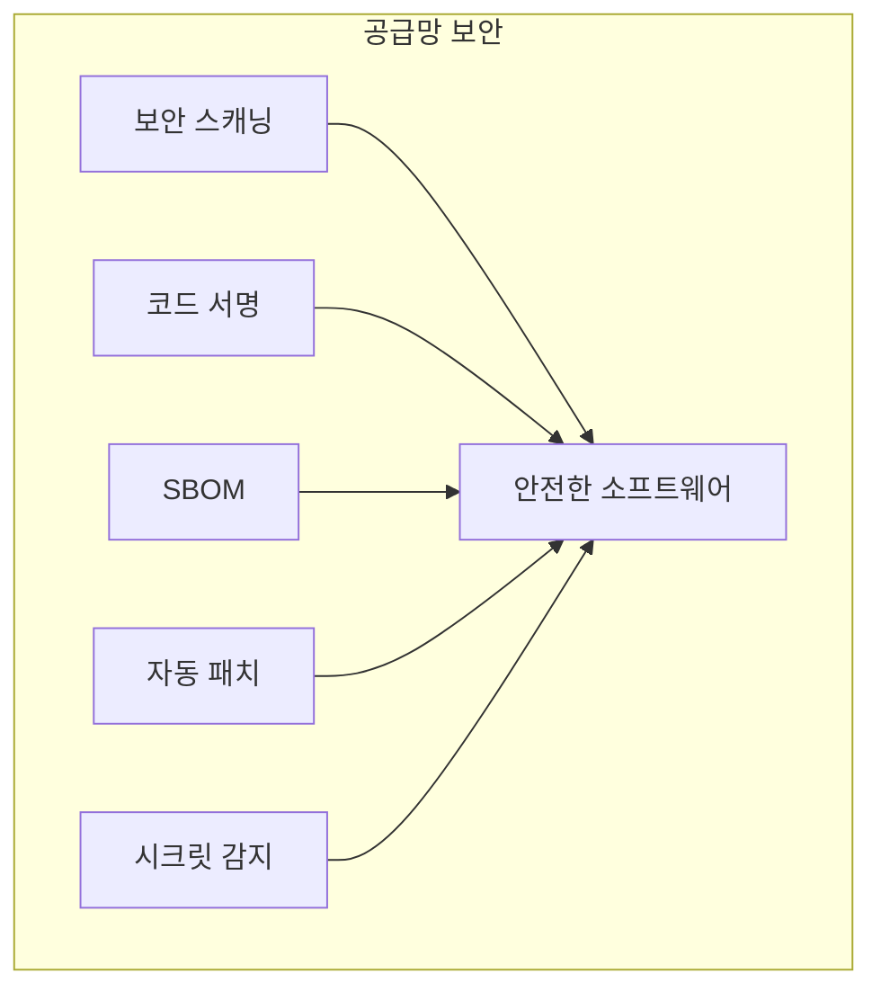

**주요 도구**: Chainguard, Mend, GitGuardian

#### Memory-Safe Languages

| 언어 유형 | 예시 | 보안 |
|----------|------|------|
| **메모리 수동 관리** | C, C++ | ~70% 보안 취약점 원인 |
| **메모리 안전** | Rust, Go | 대부분 취약점 불가능 |

#### 보안의 핵심 원칙

> **"보안은 기술적 질문만이 아니라 경제학과 인체공학의 질문이다. 이론상 안전하지만 설정이 너무 오래 걸리거나 아무도 이해할 수 없을 정도로 복잡한 기술 설계는 실제로는 안전하지 않다."**

**Otis 엘리베이터 원칙**:
- 기본 상태가 안전해야 함
- 안전한 경로가 쉬운 경로여야 함
- 안전하지 않은 것을 하기가 어려워야 함

---

### 11.5 Platform Engineering

#### IDP (Internal Developer Platform)

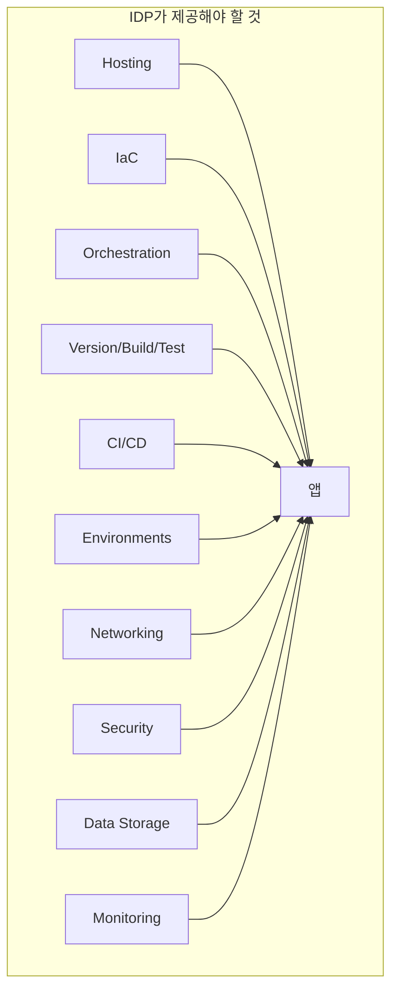

#### IDP 제공 기능 (책 챕터별)

| 챕터 | IDP 제공 기능 |
|------|--------------|
| Ch 1-2 | 호스팅 (PaaS, IaaS), IaC |
| Ch 3 | 오케스트레이션 (K8s, Lambda) |
| Ch 4-5 | 버전 관리, 빌드, 테스트, CI/CD |
| Ch 6 | 환경 (dev, stage, prod) |
| Ch 7 | 네트워킹 (DNS, VPC, Service Mesh) |
| Ch 8 | 보안 통신/저장소 (TLS, 암호화) |
| Ch 9 | 데이터 저장소 (DB, 마이그레이션, 백업) |
| Ch 10 | 모니터링 (로그, 메트릭, 알림) |

#### IDP 도구의 딜레마

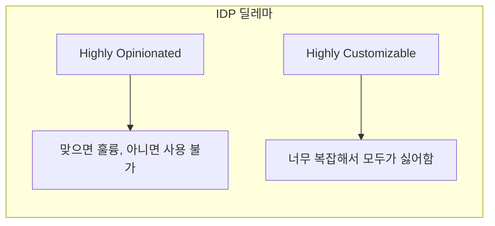

**IDP 도구 예시**: Backstage, Humanitec, OpsLevel

---

### 11.6 Infrastructure Code의 미래

#### Interactive Playbooks

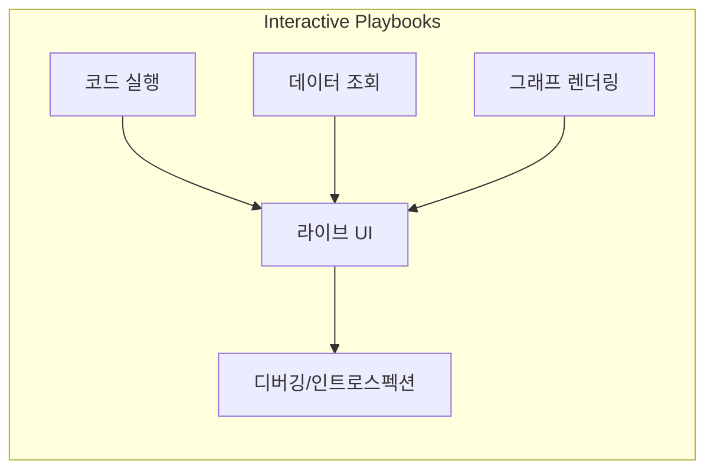

**특징**:
- Jupyter Notebook과 유사한 DevOps 도구
- 정적 위키 문서 대신 라이브 인터랙티브 UI
- 재사용 가능한 "위젯" 조합으로 IDP 구현 가능

**도구 예시**: RunDeck, Runme

#### Infrastructure from Code (IfC)

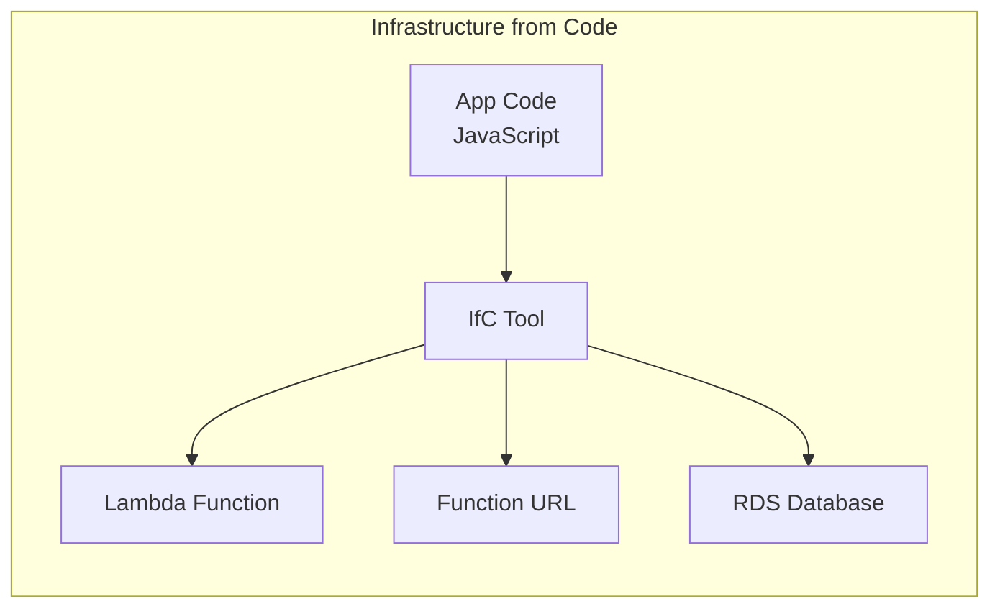

| IaC | IfC |
|-----|-----|
| 인프라 코드 직접 작성 | 앱 코드에서 인프라 자동 추론 |
| 인프라 명시적 정의 | 인프라 암묵적 추론 |
| 클라우드별 코드 필요 | 클라우드 간 이식성 |

**IfC 장점**:
- **이식성**: 동일 앱으로 AWS, GCP, Azure 자동 프로비저닝
- **추상화**: 인프라 생각 없이 앱에만 집중

**도구 예시**: Ampt, Nitric

---

## 💡 실무 적용 포인트

### 5가지 미래 트렌드 요약

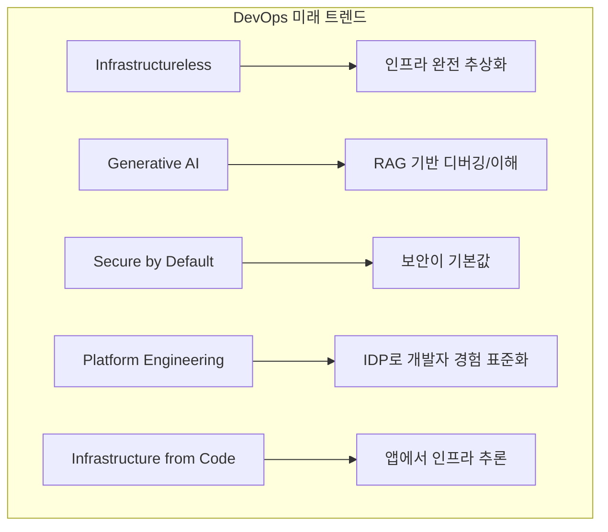

### 현재 적용 가능한 실천 사항

| 트렌드 | 현재 적용 가능 |
|--------|---------------|
| **Infrastructureless** | 서버리스 우선 아키텍처 |
| **GenAI** | RAG 기반 관측 도구 도입 |
| **Secure by Default** | SAST/DAST 파이프라인 추가 |
| **Platform Engineering** | 팀별 IDP 템플릿 구축 |
| **IfC** | Ampt, Nitric 평가 |

### 추상화 트레이드오프

| 수준 | 제어 | 복잡도 | 적합한 경우 |
|------|------|--------|-------------|
| **Low (C, Servers)** | 높음 | 높음 | 성능 최적화 필요 |
| **Mid (Java, Containers)** | 중간 | 중간 | 대부분의 서비스 |
| **High (Serverless, IfC)** | 낮음 | 낮음 | 빠른 개발, MVP |

---

## ✅ 핵심 개념 체크리스트

### Infrastructureless
- [ ] 추상화 진화 이해 (Servers → VMs → Containers → Serverless)
- [ ] 현재 서버리스의 한계 인식
- [ ] Infrastructureless 비전 이해

### Generative AI
- [ ] GenAI의 DevOps 적용 (코딩 어시스턴트, RAG)
- [ ] GenAI 한계 (Hallucinations, Inconsistency, No Citation)
- [ ] RAG 활용 사례 이해

### Secure by Default
- [ ] Shift Left (SAST, DAST) 이해
- [ ] Supply Chain Security 중요성
- [ ] Memory-Safe Languages 전환 트렌드
- [ ] "안전한 경로 = 쉬운 경로" 원칙

### Platform Engineering
- [ ] IDP 개념과 제공 기능
- [ ] IDP 도구의 딜레마 (Opinionated vs Customizable)

### Infrastructure Code의 미래
- [ ] Interactive Playbooks 개념
- [ ] Infrastructure from Code (IfC) 접근 방식

---

## 📚 책 전체 여정 요약

이 책을 통해 학습한 DevOps와 소프트웨어 딜리버리의 전체 여정:

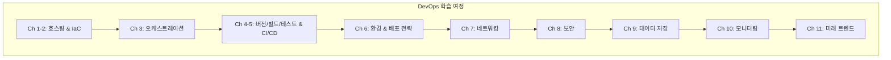

**실습한 도구들**:
- **호스팅**: PaaS, IaaS
- **IaC**: Ansible, Docker, Packer, OpenTofu
- **오케스트레이션**: Kubernetes, Lambda
- **버전/빌드/테스트**: GitHub, npm, Jest
- **CI/CD**: GitHub Actions
- **네트워킹**: Route 53, VPC, Istio
- **보안**: TLS, AES
- **데이터**: PostgreSQL, RDS, Knex.js
- **모니터링**: CloudWatch

> **"소프트웨어는 코드가 내 컴퓨터에서 작동할 때, 코드 리뷰에서 'ship it'을 받을 때, Jira 티켓을 'done'으로 옮길 때 끝나지 않는다. 소프트웨어는 절대 끝나지 않는다. 그것은 살아 숨 쉬는 것이며, DevOps와 소프트웨어 딜리버리는 그것을 살아 있게 하고 성장시키는 방법에 관한 것이다."**

---

## 🔗 참고 자료

- [Backstage by Spotify](https://backstage.io/)
- [Honeycomb Observability](https://www.honeycomb.io/)
- [Snyk Security](https://snyk.io/)
- [Nitric - Infrastructure from Code](https://nitric.io/)
- [OpenTelemetry](https://opentelemetry.io/)

---

## 📚 추가 학습 자료

책 웹사이트에서 각 챕터별 심화 학습 자료를 확인하세요.

피드백이나 질문: jim@ybrikman.com

