# Chapter 6. Retriever를 활용한 효율적인 데이터 저장

---

## 📌 핵심 요약

> 이 장에서는 **Observability 데이터를 효과적으로 저장하고 검색하는 방법**을 다룬다. 핵심은 **고카디널리티(High-Cardinality)와 고차원(High-Dimensionality) 데이터를 인덱스 없이도 빠르게 쿼리**할 수 있어야 한다는 것이다. 기존 TSDB나 NoSQL은 이 요구사항을 충족하지 못하며, **시간 기반 파티셔닝과 컬럼 기반 저장을 결합한 하이브리드 접근법**이 해결책이다. Honeycomb의 Retriever 구현을 통해 실제 트레이드오프와 해결 방안을 살펴본다.

---

## 🎯 학습 목표

이 내용을 읽고 나면:
- [ ] Observability 워크로드의 기능적 요구사항 5가지를 설명할 수 있다
- [ ] TSDB가 Observability에 부적합한 이유(카디널리티 폭발)를 이해할 수 있다
- [ ] Row-based와 Column-based 저장 방식의 트레이드오프를 비교할 수 있다
- [ ] 시간 기반 세그먼트 파티셔닝의 원리와 장점을 설명할 수 있다
- [ ] 병렬 처리와 티어링을 통한 성능 최적화 전략을 이해할 수 있다

---

## 📖 본문 정리

### 1. Observability의 기능적 요구사항

Observability 데이터 저장소는 일반적인 데이터베이스와 다른 특수한 요구사항을 가진다:

| 요구사항 | 설명 | 중요도 |
|---------|------|--------|
| **초고속 쿼리** | 결과가 수 초 내에 반환되어야 함 | 🔴 Critical |
| **고카디널리티 지원** | 수백만 개의 고유값을 가진 필드 쿼리 가능 | 🔴 Critical |
| **고차원 지원** | 이벤트의 모든 필드가 쿼리 가능해야 함 | 🔴 Critical |
| **실시간 데이터** | 데이터 수신 후 수 초 내 쿼리 가능 | 🟡 High |
| **내구성/신뢰성** | 장애 상황에서도 데이터 손실 없이 동작 | 🟡 High |

> 💬 **비유**: 장애 발생 시 커피 한 잔 내릴 시간 동안 쿼리 결과를 기다려야 한다면, 그 도구는 프로덕션 디버깅에 부적합하다.

**핵심 제약사항**:
- 사전 집계(Pre-aggregation) 불가 → 어떤 필드가 조사에 필요할지 미리 알 수 없음
- 특정 차원의 검색 성능을 우대할 수 없음 → 모든 필드가 동등하게 빨라야 함
- 예외: **시간(timestamp)**과 **서비스(partition)** 만 인덱싱 가능

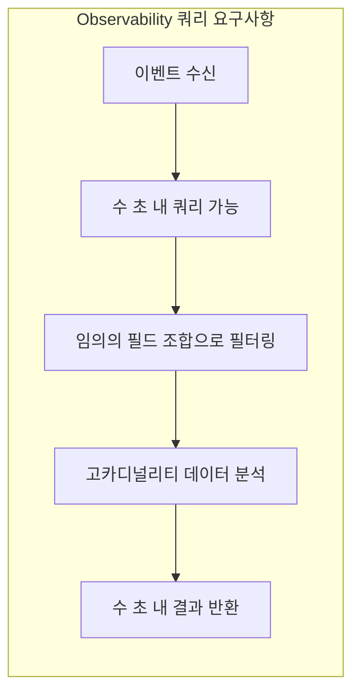

---

### 2. TSDB가 Observability에 부적합한 이유

#### 2.1 TSDB의 작동 원리

TSDB(Time-Series Database)는 **집계된 메트릭**을 저장하도록 설계되었다:

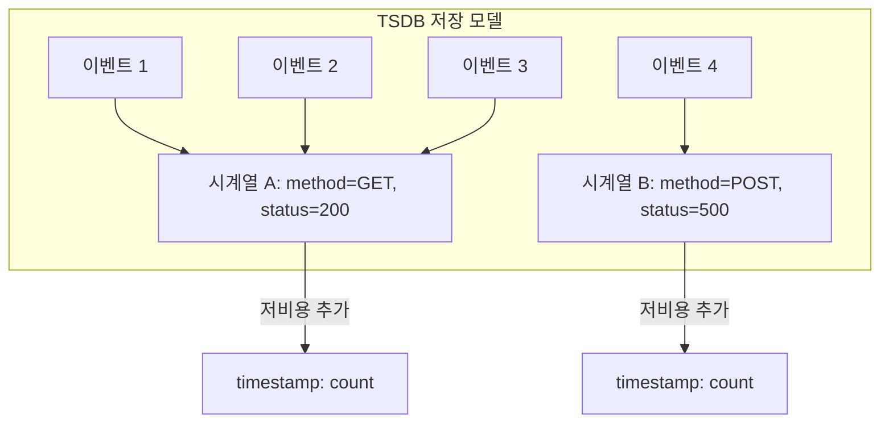

- **Row 생성 비용**: 새로운 태그 조합 생성 시 높은 오버헤드
- **측정값 추가 비용**: 기존 시계열에 값 추가는 매우 저렴
- **쿼리 비용**: 시계열 찾기 > 결과 스캔 (이미 집계되어 있으므로)

#### 2.2 카디널리티 폭발(Cardinality Explosion) 문제

고카디널리티 필드(예: `user_id`)를 태그로 추가하면:

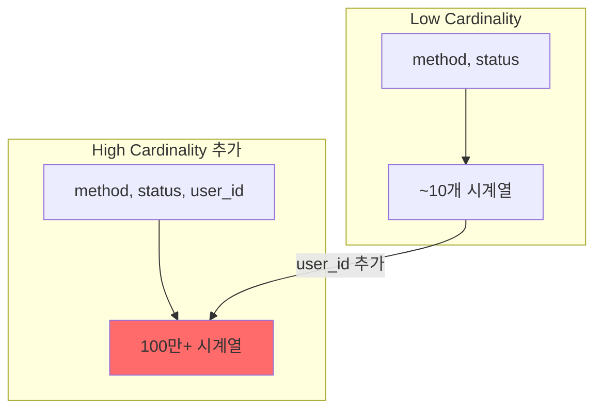

**문제점**:
- 각 고유한 `user_id` 조합마다 새 시계열 생성
- Row 생성 비용이 이벤트 수에 비례하여 선형 증가
- 대부분의 시계열이 단 하나의 이벤트만 포함 → 비효율

> ⚠️ **결론**: TSDB는 구조화된 이벤트(Structured Events) 저장에 부적합

---

### 3. 대안 데이터 저장소 검토

| 저장소 유형 | 장점 | Observability 한계 |
|------------|------|-------------------|
| **NoSQL (MongoDB, Snowflake)** | 유연한 스키마, 빠른 ingestion | 인덱스 없는 임의 쿼리 느림 |
| **Facebook Scuba** | RAM 기반 풀스캔으로 빠른 쿼리 | RAM 비용 100배 이상 (1TB RAM ≈ $5,000 vs 1TB SSD ≈ $50) |
| **Jaeger 백엔드 (Cassandra, ES)** | 트레이싱 데이터 저장 가능 | Observability 쿼리 요구사항에 최적화되지 않음 |
| **Grafana Tempo** | 트레이싱 전용 설계 | 기능적 쿼리 요구사항 미충족 |
| **ClickHouse** | 컬럼 기반, 오픈소스 | ✅ Observability에 적합 (다음 장에서 상세 설명) |

---

### 4. 데이터 저장 전략: Row vs Column

#### 4.1 Row-based 저장 (Bigtable 예시)

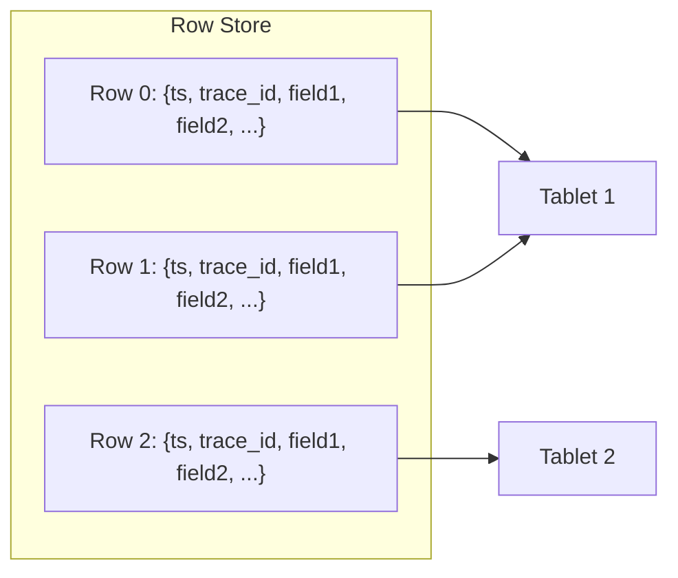

**특징**:
- 개별 트레이스 검색 빠름 (Primary Key 인덱싱)
- Mutable → Update/Delete 지원
- **문제**: Compaction 오버헤드, Locality Group 한계

**Bigtable의 Observability 한계**:
```
인덱스 3개(service, host, timestamp)만 추가해도
→ 트레이스 데이터 크기의 76% 추가 공간 필요
```

#### 4.2 Column-based 저장 (Dremel/ColumnIO 예시)

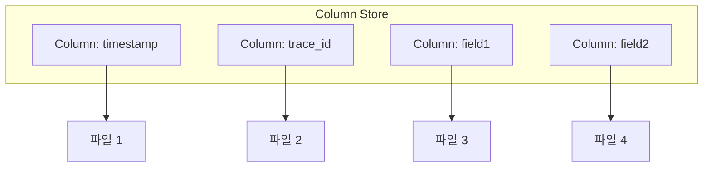

**특징**:
- 필요한 컬럼만 읽기 가능 → I/O 효율
- **문제**: 단일 Row 접근 시 모든 컬럼 파일 스캔 필요

#### 4.3 하이브리드 접근법 (Retriever)

| 측면 | Row-based | Column-based | **Hybrid (Retriever)** |
|------|-----------|--------------|------------------------|
| 개별 Row 접근 | ✅ 빠름 | ❌ 느림 | ⚡ 세그먼트 내 빠름 |
| 부분 컬럼 스캔 | ❌ 전체 Row 읽기 | ✅ 빠름 | ✅ 빠름 |
| 시간 범위 쿼리 | ⚠️ 인덱스 필요 | ⚠️ 수동 샤딩 | ✅ 자동 파티셔닝 |
| 쓰기 성능 | ⚠️ Compaction 필요 | ✅ Append-only | ✅ Append-only |

---

### 5. Honeycomb Retriever 구현 케이스 스터디

#### 5.1 시간 기반 파티셔닝

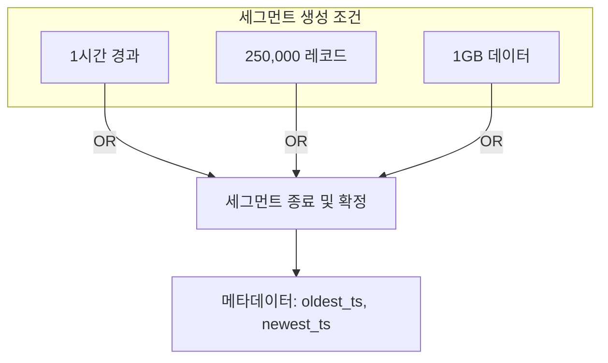

**핵심 아이디어**:
- 이벤트가 도착 순서대로 현재 세그먼트에 추가 (Append-only)
- 각 세그먼트는 시작/종료 타임스탬프 메타데이터 보유
- 쿼리 시 시간 범위와 겹치는 세그먼트만 스캔

```mermaid
gantt
    title 쿼리 시간 범위와 세그먼트 매칭
    dateFormat HH:mm

    section 세그먼트
    Segment 1 :s1, 00:00, 01:00
    Segment 2 :s2, 01:00, 02:00
    Segment 3 :s3, 02:00, 03:00
    Segment 4 :s4, 03:00, 04:00

    section 쿼리 범위
    Query Window :active, q1, 01:30, 02:30
```

> 위 예시에서 **Segment 2, 3만 스캔** (1, 4는 제외)

**장점**:
1. 이벤트 타임스탬프 정렬 불필요 (세그먼트 범위만 추적)
2. Append-only → Compaction 불필요

#### 5.2 세그먼트 내 컬럼 저장

**원본 데이터**:
```json
Row 0: { "timestamp": "2020-08-20 01:31:20", "trace_id": "efb8...", "field1": null }
Row 1: { "timestamp": "2020-08-20 01:30:32", "trace_id": "562e...", "field1": "foo" }
Row 2: { "timestamp": "2020-08-20 01:31:21", "trace_id": "178c...", "field1": "foo" }
Row 3: { "timestamp": "2020-08-20 01:31:21", "trace_id": "178c...", "field1": "bar" }
```

**컬럼 파일로 변환**:

```
# timestamp 인덱스 파일
idx | value
----|-------------------------
0   | 2020-08-20 01:31:20
1   | 2020-08-20 01:30:32   ← 시간순 아님 (도착순)
2   | 2020-08-20 01:31:21
3   | 2020-08-20 01:31:21

# field1 컬럼 파일 (null 제외)
idx | value
----|-------
1   | foo
2   | foo
3   | bar
```

**압축 기법**:

| 기법 | 적용 대상 | 효과 |
|------|----------|------|
| **Dictionary Encoding** | 반복 문자열 | `{1: "foo", 2: "bar"}` + `[1, 1, 2]` |
| **Sparse Encoding** | null이 많은 컬럼 | Bitmask로 존재 여부만 표시 |
| **Run-Length Encoding** | 연속 반복값 | `foo, foo, foo` → `foo x 3` |
| **Delta Encoding** | 타임스탬프, 숫자 | 이전 값과의 차이만 저장 |
| **LZ4 압축** | 최종 파일 | 빠른 압축/해제 속도 우선 |

#### 5.3 쿼리 워크로드 처리

```sql
-- 예시 쿼리
SELECT SUM(x), COUNT(*), AVG(x), MAX(x)
FROM events
WHERE y > 0
GROUP BY a, b
```

**6단계 쿼리 처리 과정**:

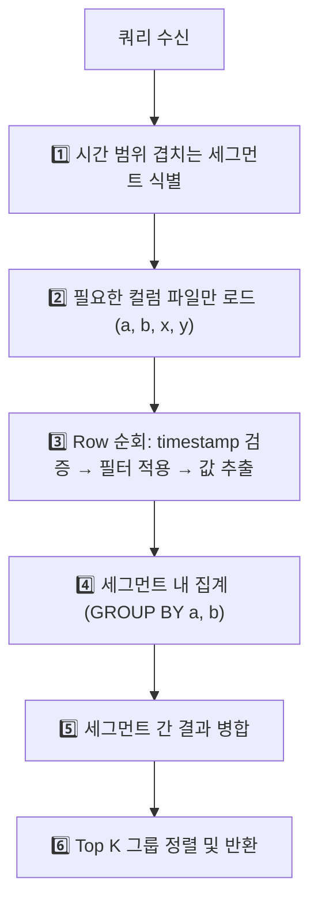

**의사코드**:
```go
groups := make(map[Key]Aggregation)

for _, segment := range segments {
    // 필요한 컬럼만 로드
    for _, row := range fieldSubset(segment, []string{"a", "b", "x", "y"}) {
        // 필터 적용
        if row["y"] <= 0 {
            continue
        }

        // 그룹별 집계
        key := Key{A: row["a"], B: row["b"]}
        aggr := groups[key]
        aggr.Count++
        aggr.Sum += row["x"]
        if aggr.Max < row["x"] {
            aggr.Max = row["x"]
        }
        groups[key] = aggr
    }
}

// 평균 계산
for k := range groups {
    groups[k].Avg = groups[k].Sum / groups[k].Count
}
```

#### 5.4 트레이스 쿼리

트레이스 조회는 컬럼 스토어에서 **특수 케이스 쿼리**:

```sql
-- Root span 찾기
SELECT * FROM spans WHERE trace.parent_id IS NULL

-- 특정 트레이스의 모든 span 조회
SELECT timestamp, duration, name, trace.parent_id, trace.span_id
FROM spans
WHERE trace.trace_id = 'guid-here'
```

**Join 처리** (크로스-스팬 조회):
- 동일 trace의 span은 같은 파티션으로 라우팅
- 메모리 내 시간 윈도우로 조인 후보 관리
- 메모리 기반 동적 윈도우 크기 조정

#### 5.5 실시간 쿼리 지원

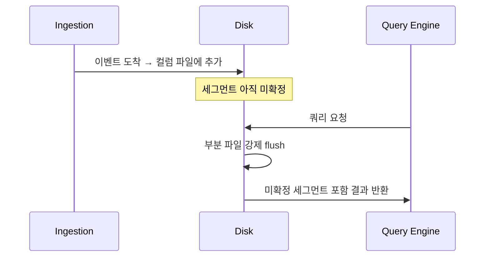

**핵심**: 세그먼트 확정/압축 전에도 쿼리 가능

#### 5.6 티어링(Tiering)을 통한 비용 절감

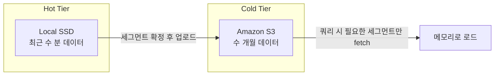

**비용 비교**:
- 1TB RAM: ~$5,000
- 1TB SSD: ~$50
- 1TB S3: ~$23/월

#### 5.7 병렬 처리를 통한 속도 향상

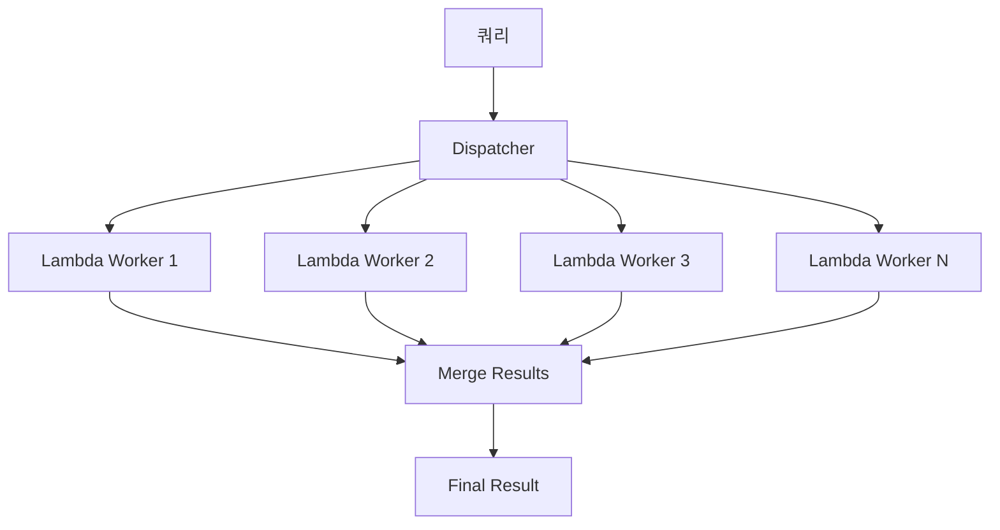

**Impatience 패턴** (꼬리 지연 처리):
```
90% 완료 시점에서 → 나머지 10% 재요청 (기존 요청 취소 없이)
→ 먼저 도착한 결과 사용
→ 10% 추가 비용으로 p99 레이턴시 대폭 개선
```

#### 5.8 고카디널리티 처리

**문제**: `GROUP BY log_message` 시 수십만 개 그룹 발생

**해결책**:
1. **Reduce 팬아웃**: 해시 기반으로 그룹을 여러 reducer에 분산
2. **메모리 제한**: 총 메모리 내 그룹 수 제한
3. **Top K 추정**: ORDER BY/LIMIT 기준으로 생존 가능 그룹만 유지
4. **쿼리 중단**: 너무 많은 그룹 시 abort

#### 5.9 확장성과 내구성

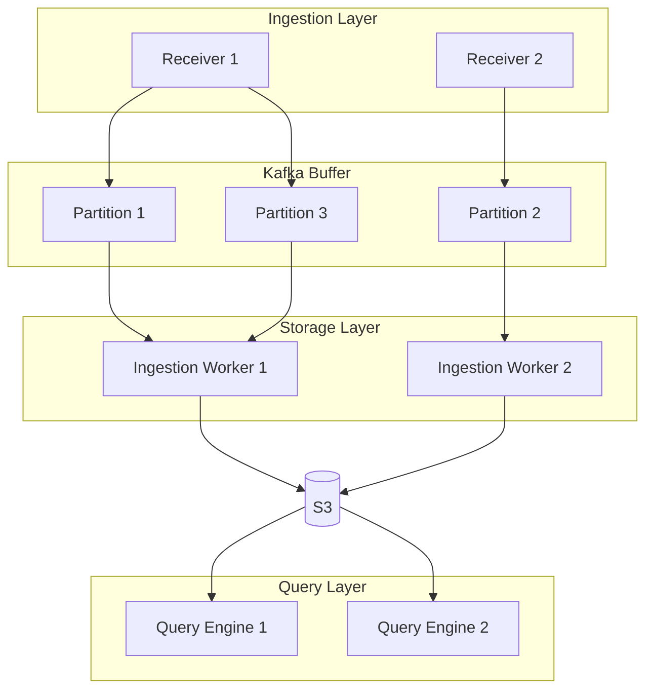

**Kafka 활용**:
- 순서 보장된 내구성 버퍼
- Producer/Consumer/Broker 재시작 내성
- 수 시간~수 일 보관 (재해 복구용)

**관심사 분리**:
- Ingestion 문제 → 쿼리에 영향 없음 (기존 데이터 쿼리 가능)
- Query 급증 → Ingestion에 영향 없음

---

### 6. Retriever 프로덕션 규모 (2025년 11월 기준)

| 구성요소 | 규모 |
|---------|------|
| Receiver Workers | ~1,500 Graviton4 vCPU |
| Kafka Brokers | ~240 Graviton2 vCPU |
| Retriever Workers | ~2,000 Graviton3 vCPU |
| Lambda Workers (버스트) | 최대 200,000 Graviton2 vCPU |
| 저장 데이터 | ~1.5 PB (2개월) |
| 세그먼트 수 | 10억+ 압축 아카이브 |
| Ingestion Rate | 3-5M spans/sec |
| 쿼리 지연 | Median 50ms, p99 5초 |

---

## 🔍 심화 학습

### 추가 조사 내용

#### 관련 기술/개념

**1. t-digest 알고리즘**
- 분위수(Percentile) 추정을 위한 확률적 자료구조
- p99 계산에 사용
- 메모리 효율적으로 분포 요약

**2. HyperLogLog**
- COUNT DISTINCT 근사 계산
- 고카디널리티에서도 일정한 메모리 사용

**3. Roaring Bitmaps**
- Boolean 데이터의 효율적 저장
- 집합 연산(AND, OR) 최적화

#### 대안 기술

| 솔루션 | 특징 | 적합성 |
|--------|------|--------|
| **ClickHouse** | 오픈소스 컬럼 DB, 단일 바이너리 | ✅ 소규모 시작에 적합 |
| **Google BigQuery** | 관리형 서비스, 자동 확장 | ⚠️ 커스텀 샤딩 필요 |
| **Apache Druid** | 실시간 분석, OLAP | ⚠️ 운영 테스트 필요 |

### 출처
- [Facebook Scuba 논문](https://research.facebook.com/publications/scuba-diving-into-data-at-facebook/)
- [Google Dapper 논문](https://research.google/pubs/pub36356/)
- [Bigtable Schema Design Best Practices](https://cloud.google.com/bigtable/docs/schema-design)

---

## 💡 실무 적용 포인트

### 이런 상황에서 사용하세요

1. **자체 Observability 백엔드 구축 시**
   - 컬럼 스토어 + 시간 기반 파티셔닝 패턴 적용
   - ClickHouse로 시작 후 필요 시 확장

2. **기존 시스템 성능 병목 분석 시**
   - TSDB 사용 중 카디널리티 폭발 문제 발생 → 컬럼 스토어 검토
   - Elasticsearch 쿼리 느림 → 전용 Observability 백엔드 검토

3. **비용 최적화 필요 시**
   - Hot/Cold 티어링 적용
   - 오래된 데이터는 S3로 이동

### 주의할 점 / 흔한 실수

- ⚠️ **One-time-use 컬럼 생성 금지**: `timestamp_2021061712345` 같은 일회성 컬럼은 오버헤드만 증가
  - ✅ 올바른 방법: `timestamp` 컬럼에 값으로 `2021061712345` 저장

- ⚠️ **Backfill 데이터 주의**: 과거 데이터 대량 삽입 시 세그먼트 시간 범위가 넓어져 쿼리 성능 저하
  - ✅ 별도 파티션 또는 재압축(compaction) 고려

- ⚠️ **고카디널리티 GROUP BY**: 수십만 그룹은 그래프로 표현 불가
  - ✅ Top K 제한 또는 집계 수준 조정

### 면접에서 나올 수 있는 질문

**Q: TSDB가 Observability에 부적합한 이유는?**
> A: 고카디널리티 필드(user_id 등)를 태그로 추가하면 카디널리티 폭발이 발생한다. 각 고유 조합마다 새 시계열이 생성되어 Row 생성 비용이 이벤트 수에 선형 비례하게 된다.

**Q: Row-based와 Column-based 저장의 트레이드오프는?**
> A: Row-based는 단일 레코드 조회가 빠르지만 부분 컬럼 스캔이 비효율적이다. Column-based는 부분 컬럼 스캔이 효율적이지만 단일 Row 재구성이 느리다. Observability는 하이브리드 접근(시간 파티셔닝 + 컬럼 저장)이 적합하다.

**Q: 실시간 쿼리를 어떻게 지원하는가?**
> A: 세그먼트가 확정되기 전에도 열린 컬럼 파일을 강제 flush하여 쿼리 가능하게 한다. Ingestion과 Query 프로세스를 분리하여 파일시스템만 공유한다.

**Q: 꼬리 지연(Tail Latency)을 어떻게 처리하는가?**
> A: Impatience 패턴을 사용한다. 90% 완료 시점에 나머지 10%를 재요청하고, 먼저 도착한 결과를 사용한다. 10% 추가 비용으로 p99 레이턴시를 크게 개선한다.

---

## ✅ 핵심 개념 체크리스트

- [ ] Observability 데이터 저장의 5가지 기능적 요구사항을 나열할 수 있는가?
- [ ] 카디널리티 폭발(Cardinality Explosion)이 무엇인지 설명할 수 있는가?
- [ ] 시간 기반 세그먼트 파티셔닝의 장점 2가지를 말할 수 있는가?
- [ ] Dictionary Encoding, Run-Length Encoding의 차이를 알고 있는가?
- [ ] Hot/Cold 티어링이 비용을 절감하는 원리를 이해하는가?
- [ ] Impatience 패턴이 꼬리 지연을 해결하는 방법을 설명할 수 있는가?

---

## 🔗 참고 자료

- 📄 [Facebook Scuba 논문 (VLDB 2013)](https://research.facebook.com/publications/scuba-diving-into-data-at-facebook/)
- 📄 [Google Dapper 논문](https://research.google/pubs/pub36356/)
- 📄 [Google Bigtable Schema Design](https://cloud.google.com/bigtable/docs/schema-design)
- 📚 연관 서적: *Kafka: The Definitive Guide* (Gwen Shapira et al., O'Reilly)
- 📚 다음 장: Chapter 7 - ClickHouse를 활용한 오픈소스 컬럼 스토리지

---
