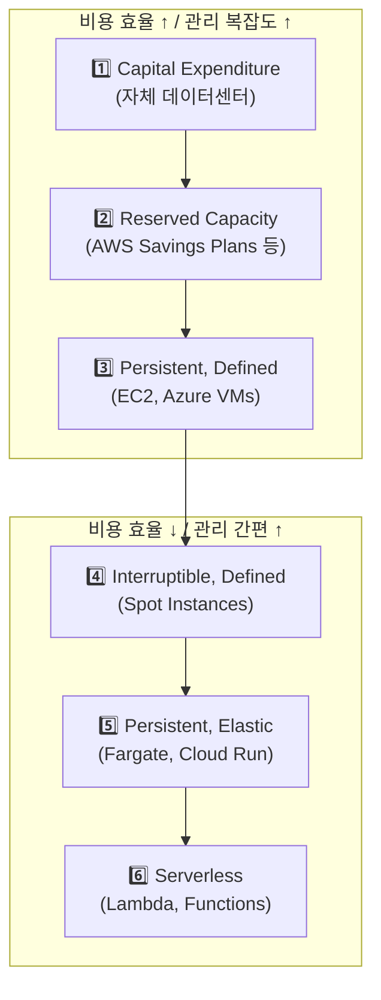
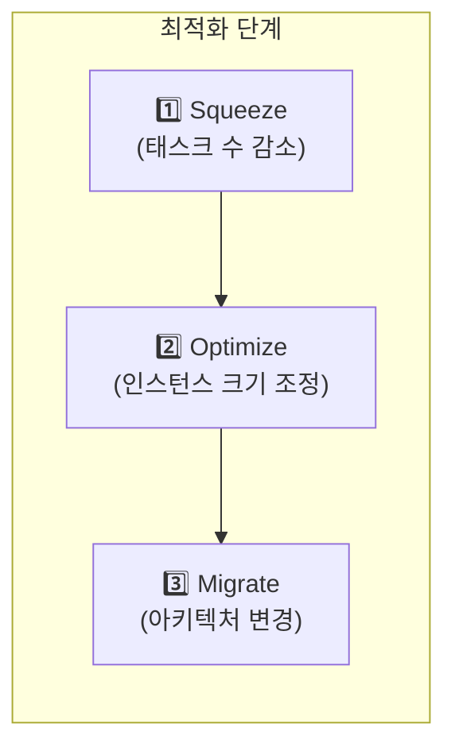
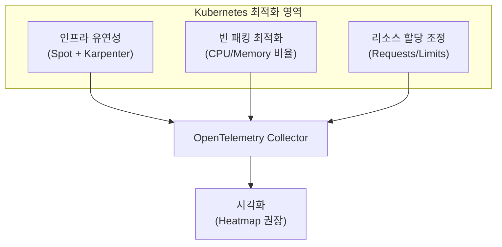
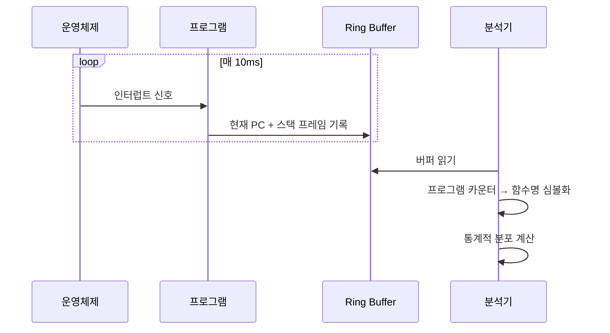
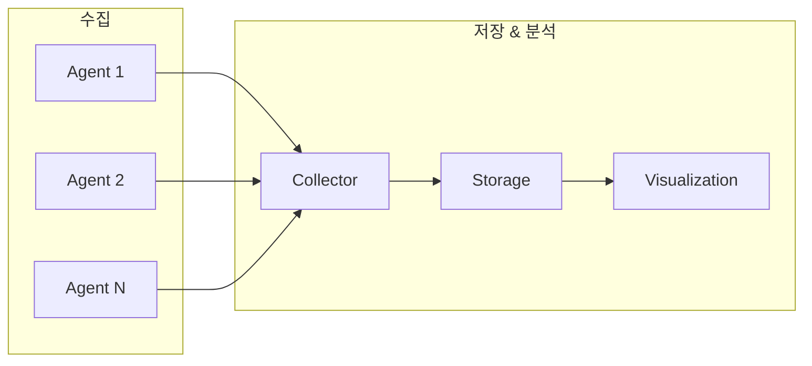
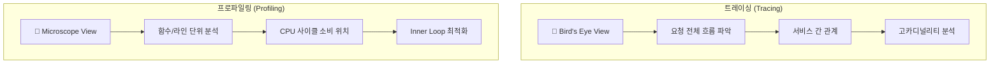
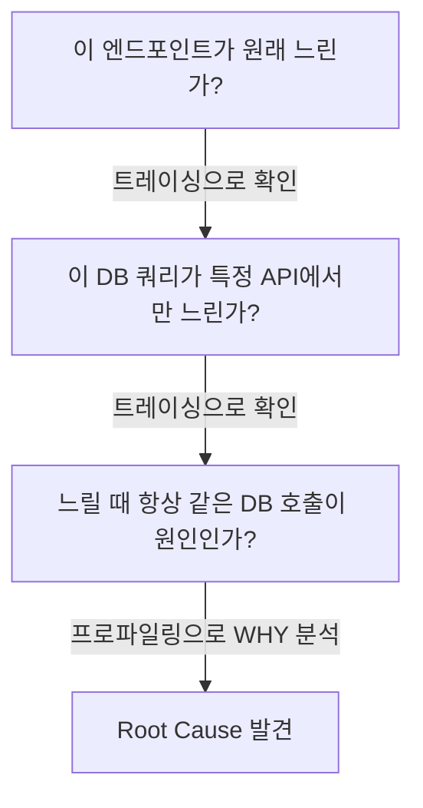
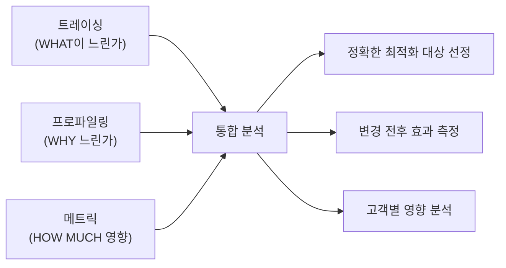
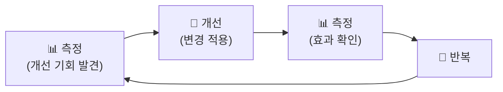

# Chapter 7. Observability와 Performance Engineering

---

## 📌 핵심 요약

> 이 장에서는 **Performance Engineering이 무엇이며 Observability와 어떻게 교차하는지**를 다룬다. 핵심은 **트레이싱만으로는 발견할 수 없는 성능 문제를 프로파일링(Profiling)으로 해결**할 수 있다는 것이다. 비용 최적화를 위한 인프라 선택, Kubernetes 최적화, 그리고 **연속 프로파일링(Continuous Profiling)**을 통해 Observability와 Performance Engineering을 통합하는 방법을 살펴본다.

---

## 🎯 학습 목표

이 내용을 읽고 나면:
- [ ] Performance Engineering이 필요한 이유와 비즈니스 가치를 설명할 수 있다
- [ ] 6가지 클라우드 컴퓨트 모델의 트레이드오프를 비교할 수 있다
- [ ] CPU 프로파일링의 원리와 Flame Graph 해석 방법을 이해할 수 있다
- [ ] 트레이싱과 프로파일링의 역할 차이를 구분할 수 있다
- [ ] Kubernetes 비용 최적화 전략을 적용할 수 있다

---

## 📖 본문 정리

### 1. Performance Engineering이 필요한 이유

#### 1.1 실제 사례: 숨겨진 레이턴시 버그

Honeycomb 팀은 로드 밸런서 로그와 애플리케이션 트레이스 간 레이턴시 불일치를 발견했다:

```
서버 측 측정: 0.1ms
로드 밸런서 측정: 수 ms
→ 어딘가에서 시간이 "사라지고" 있었다
```

> 💬 **핵심 교훈**: 트레이싱 훅은 HTTP 라우터가 초기화된 **후**에 호출되므로, 라우터 초기화 자체의 오버헤드는 트레이싱으로 잡을 수 없었다.

#### 1.2 프로파일링으로 문제 발견


**문제의 원인**: HTTP 라우터가 싱글톤으로 재사용되지 않고 매 요청마다 폐기 → 정규식 재컴파일

```go
// 수정 전: 매 요청마다 새 라우터 생성
// 수정 후: 싱글톤으로 재사용 (5줄 변경)
```

#### 1.3 Performance Engineering의 비즈니스 가치

| 목표 | 설명 |
|------|------|
| **비용 절감** | 클라우드 비용 최적화로 수익성 개선 |
| **고객 경험 향상** | 레이턴시 감소로 사용자 만족도 증가 |

> ⚠️ **주의**: 조기 최적화(Premature Optimization)는 피해야 한다. 엔지니어 급여 + 기회비용 > 절감 비용이면 투자 가치 없음.

---

### 2. 코드 수정 없이 비용 최적화

#### 2.1 인프라 구매 모델 6가지



| 모델 | 장점 | 단점 | 적합한 워크로드 |
|------|------|------|----------------|
| **CapEx (자체 DC)** | CPU-hour 비용 최저 | 초기 투자, 운영 책임 | 대규모 예측 가능 워크로드 |
| **Reserved** | 할인율 높음 | 커밋 필요 | 안정적인 베이스라인 |
| **EC2/VMs** | 상태 유지, 캐시 가능 | 유휴 시간 비용 발생 | 지속적인 서비스 |
| **Spot/Preemptible** | 최대 90% 할인 | 언제든 종료 가능 | 내결함성 배치 작업 |
| **Fargate/Cloud Run** | 자동 확장, 관리 불필요 | VM 대비 비쌈 | 가변적 컨테이너 워크로드 |
| **Lambda/Functions** | 완벽한 활용률 | 단위 비용 높음, Cold Start | 이벤트 기반, 간헐적 실행 |

> 💬 **비유**: 자가용(CapEx) vs 장기렌트(Reserved) vs 카셰어링(EC2) vs 택시(Lambda) - 사용 패턴에 따라 최적 선택이 다르다.

**Observability 활용**:
- Serverless: 트레이스 span duration → 직접 비용 계산 가능
- VM: 동시 실행 수 메트릭 → 적정 용량 산정
- 하이브리드: 사용률 메트릭 → 모델 전환 시점 결정

#### 2.2 Fleet-wide 최적화 기법



**실용적 최적화 체크리스트**:

| 기법 | 설명 | 절감 효과 |
|------|------|----------|
| **태스크 수 감소** | SLO 충족하는 최소 인스턴스 수 찾기 | 10-30% |
| **CPU/메모리 축소** | 실제 사용량 기반 할당 조정 | 10-20% |
| **Auto-scaling 목표 상향** | 40% → 70-80% 활용률 | 20-40% |
| **최신 세대 HW** | Graviton, Cobalt, Axion 등 | 20-40% |
| **NVMe 직접 사용** | EBS 대신 인스턴스 스토리지 | I/O 비용 절감 |
| **arm64 마이그레이션** | Intel → ARM 아키텍처 전환 | 20-40% |

**arm64 마이그레이션 단계**:
```bash
# 1. 베이스 이미지 변경
FROM --platform=linux/arm64 ubuntu:22.04

# 2. 빌드 파이프라인 테스트
docker buildx build --platform linux/arm64 .

# 3. 대표 트래픽으로 배포 테스트
# 4. 부하 테스트로 성능 비교 (SMT 차이 고려)
```

> ⚠️ **ARM 테스트 주의**: Intel/AMD는 SMT(하이퍼스레딩)를 사용하지만 ARM은 사용하지 않음. ARM에서는 더 높은 포화도(70-80%)로 실행해도 안전.

#### 2.3 Kubernetes 비용 최적화



**핵심 메트릭**:
```yaml
# kubeletstats receiver로 수집
- pod.cpu.utilization      # 실제 CPU 사용률
- pod.memory.usage         # 실제 메모리 사용량
- container.cpu.request    # 요청된 CPU
- container.memory.request # 요청된 메모리
```

**빈 패킹 최적화 예시**:

```
문제 상황:
- 32코어 노드
- 20코어 필요한 Pod
- 1코어 DaemonSet
→ Pod 1개만 배치 가능 (11-12코어 낭비)

해결책 1: 64코어 노드로 변경 → 3개 Pod 배치 가능
해결책 2: Pod 크기를 15코어로 축소 → 더 나은 패킹
```

**시각화 권장사항**:
- ❌ Percentile: 분산이 커서 오해 유발
- ✅ Heatmap: 노드별 포화도 한눈에 파악, 100% 클리핑 감지

---

### 3. CPU 프로파일링 도구

#### 3.1 프로파일링의 원리



**핵심 아이디어**:
- OS 시그널로 프로그램을 주기적으로 중단
- 현재 실행 중인 명령어(Program Counter) + 콜스택 기록
- 샘플링 기반 → 정확한 값이 아닌 통계적 근사

#### 3.2 Go pprof 사용법

```go
// 1. HTTP 핸들러 활성화 (내부 포트에서만!)
import _ "net/http/pprof"

go func() {
    http.ListenAndServe("localhost:6060", nil)
}()
```

```bash
# 2. 프로파일 수집 (1분)
curl -o profile.pb.gz http://localhost:6060/debug/pprof/profile?seconds=60

# 3. 분석 (웹 UI 권장)
go tool pprof -http :8080 profile.pb.gz

# 벤치마크 프로파일링
go test -bench . -cpuprofile cpu.prof
```

#### 3.3 Flame Graph 해석

```
┌─────────────────────────────────────────────────────────────┐
│                        main.ServeHTTP                        │ ← 전체 시간
├───────────────────────────────┬─────────────────────────────┤
│      mux.newRouteRegexp       │       handler.Process       │
├───────────────────────────────┤                             │
│      regexp.Compile (17%)     │ ← 🔴 최적화 대상!           │
└───────────────────────────────┴─────────────────────────────┘

가로 너비 = 해당 함수 + 자식 함수들의 총 시간
세로 쌓임 = 호출 관계 (아래 → 위 호출)
```

**최적화 대상 선정 기준**:

| 우선순위 | 특징 | 예시 |
|----------|------|------|
| 🔴 높음 | 여러 곳에서 호출되는 중간 비용 함수 | 공통 라이브러리 함수 |
| 🟡 중간 | 루트 근처에서 자식 없이 시간 소비 | 무거운 초기화 코드 |
| 🟢 낮음 | 한 곳에서만 호출되는 작은 함수 | 유틸리티 함수 |

#### 3.4 연속 프로파일링 (Continuous Profiling)



**연속 프로파일링 도구**:
- **Grafana Pyroscope**: 오픈소스, Grafana 통합
- **Polar Signals**: 클라우드 네이티브
- **Blackfire**: PHP/Python 특화

**OpenTelemetry 프로파일링** (2024년~):
- 공통 에이전트 + 인코딩 표준화
- 벤더 중립적 프로파일링 데이터

---

### 4. 올바른 Observability 신호 사용

#### 4.1 트레이싱 vs 프로파일링



| 관점 | 트레이싱 | 프로파일링 |
|------|----------|------------|
| **범위** | 분산 시스템 전체 | 단일 프로세스 |
| **입도** | 함수/서비스 단위 | 라인/명령어 단위 |
| **오버헤드** | 낮음 (샘플링) | 중간 |
| **발견 가능 문제** | 느린 서비스, DB 쿼리 | 비효율적 코드, 라이브러리 버그 |
| **질문 유형** | "어떤 서비스가 느린가?" | "왜 이 함수가 느린가?" |

#### 4.2 조사 흐름 예시



---

### 5. Performance Engineering과 Observability 통합

#### 5.1 실제 사례: 고객별 프로파일링

Honeycomb에서 발견한 문제:


**해결책 1**: JSON 직렬화 캐싱
**해결책 2**: 쿼리 언어 개선 (switch 문 도입)

```sql
-- Before: 중첩 if-else (느림)
if { } else { if { } else { if { } else { ... } } }

-- After: switch 문 (빠름)
switch { case A: ... case B: ... default: ... }
```

> 💬 **핵심 교훈**: 이 문제는 트레이싱만으로는 절대 발견할 수 없었다. Inner Loop의 각 함수 호출까지 트레이싱하는 것은 비용상 불가능하기 때문이다.

#### 5.2 통합 접근법의 가치



**Span-linked Profiling**:
- 개별 트레이스 span에 프로파일 연결
- "누구에게, 무엇이, 왜" 동시 파악 가능

---

### 6. Performance Engineering 프랙티스 구축

#### 6.1 핵심 루프



#### 6.2 성숙도 모델

| 단계 | 특징 | 도구 |
|------|------|------|
| **Ad-hoc** | 필요 시 수동 프로파일링 | `go tool pprof`, `perf` |
| **Reactive** | 문제 발생 시 조사 | 트레이싱 + 수동 프로파일링 |
| **Proactive** | 연속 프로파일링 + 알림 | Pyroscope, Polar Signals |
| **Integrated** | 트레이싱-프로파일링 연동 | 통합 Observability 플랫폼 |

---

## 🔍 심화 학습

### 추가 조사 내용

#### 관련 기술/개념

**1. eBPF (Extended Berkeley Packet Filter)**
- 커널 레벨 프로파일링 가능
- 애플리케이션 수정 없이 관측
- 네트워크, 보안, 성능 모니터링 통합

**2. Google-Wide Profiling (GWP)**
- 플릿 전체 연속 프로파일링
- 공통 라이브러리 병목 발견
- 1%의 1%도 전체로 보면 의미 있는 절감

**3. SMT (Simultaneous Multi-Threading)**
- Intel: Hyper-Threading
- 하나의 물리 코어에서 2개 논리 스레드
- ARM은 SMT 미사용 → 포화도 계산 시 주의

### 출처
- [Brendan Gregg - BPF Performance Tools](https://www.brendangregg.com/bpf-performance-tools-book.html)
- [Brendan Gregg - Systems Performance](https://www.brendangregg.com/systems-performance-2nd-edition-book.html)
- [Google-Wide Profiling 논문 (IEEE Micro 2010)](https://research.google/pubs/pub36575/)

---

## 💡 실무 적용 포인트

### 이런 상황에서 사용하세요

1. **트레이싱으로 원인을 못 찾을 때**
   - 서비스 내부 코드에서 시간이 사라지는 경우
   - 특정 요청만 느린데 외부 호출은 정상인 경우

2. **클라우드 비용 최적화가 필요할 때**
   - 클라우드 비용 / 엔지니어 수 비율이 높은 경우
   - 마진 개선이 비즈니스에 직접 영향을 미치는 SaaS

3. **새로운 아키텍처로 마이그레이션할 때**
   - arm64 전환 전 성능 베이스라인 측정
   - Spot 인스턴스 도입 전 내결함성 검증

### 주의할 점 / 흔한 실수

- ⚠️ **조기 최적화 금지**: 측정 없이 "느릴 것 같아서" 최적화하지 말 것
  - ✅ 항상 프로파일링으로 실제 병목 확인 후 최적화

- ⚠️ **1%의 1% 최적화에 시간 낭비**: ROI 계산 필수
  - ✅ 전체 워크로드에 일반화 가능한지 확인

- ⚠️ **프로파일링 엔드포인트 노출 주의**: 내부 포트에서만 활성화
  - ✅ `localhost:6060`에서만 pprof 노출

- ⚠️ **SMT 차이 무시**: ARM과 Intel 성능 비교 시 포화도 기준 다름
  - ✅ Intel 40% vs ARM 70-80% 동등 수준

### 면접에서 나올 수 있는 질문

**Q: 트레이싱과 프로파일링의 차이점은?**
> A: 트레이싱은 분산 시스템 전체의 요청 흐름(Bird's Eye View)을 보여주고, 프로파일링은 단일 프로세스 내 함수/라인 단위(Microscope View)의 CPU 소비를 보여준다. 트레이싱은 "어떤 서비스가 느린가", 프로파일링은 "왜 이 함수가 느린가"에 답한다.

**Q: Flame Graph에서 최적화 대상을 어떻게 선정하나요?**
> A: 1) 여러 곳에서 호출되는 중간 비용 함수(공통 라이브러리), 2) 루트 근처에서 자식 없이 시간을 소비하는 함수를 우선 타겟으로 한다. 한 곳에서만 호출되는 작은 함수는 우선순위가 낮다.

**Q: 연속 프로파일링(Continuous Profiling)의 장점은?**
> A: 문제가 발생한 순간을 잡지 않아도 사후 분석이 가능하다. 프로파일 데이터는 압축률이 높아 저장 비용이 합리적이며, 2시간 데이터가 120배가 아닌 훨씬 작은 크기로 저장된다.

**Q: Kubernetes에서 비용 최적화 시 Heatmap을 권장하는 이유는?**
> A: Pod/Node별 사용률 분산이 크기 때문에 Percentile은 오해를 유발할 수 있다. Heatmap은 100% 포화(클리핑) 상태를 한눈에 파악할 수 있어 성능 저하 위험을 감지하기 좋다.

---

## ✅ 핵심 개념 체크리스트

- [ ] 프로파일링이 트레이싱으로 잡을 수 없는 문제를 어떻게 발견하는지 설명할 수 있는가?
- [ ] 6가지 클라우드 컴퓨트 모델의 트레이드오프를 알고 있는가?
- [ ] Flame Graph에서 가로 너비와 세로 쌓임이 무엇을 의미하는지 아는가?
- [ ] SMT가 있는 CPU와 없는 CPU의 포화도 차이를 이해하는가?
- [ ] 연속 프로파일링의 데이터 저장 효율성 원리를 설명할 수 있는가?
- [ ] "측정 → 개선 → 측정 → 반복" 루프의 중요성을 이해하는가?

---

## 🔗 참고 자료

- 📚 [BPF Performance Tools](https://www.brendangregg.com/bpf-performance-tools-book.html) - Brendan Gregg
- 📚 [Systems Performance: Enterprise and the Cloud](https://www.brendangregg.com/systems-performance-2nd-edition-book.html) - Brendan Gregg
- 📄 [Google-Wide Profiling 논문](https://research.google/pubs/pub36575/)
- 🔧 [Go pprof 공식 문서](https://pkg.go.dev/net/http/pprof)
- 🔧 [Grafana Pyroscope](https://grafana.com/oss/pyroscope/)
- 🔧 [OpenTelemetry Profiling](https://opentelemetry.io/docs/specs/otel/profiling/)

---
