# Chapter 8. LLM을 위한 Observability

---

## 📌 핵심 요약

> 이 장에서는 **LLM 기반 애플리케이션의 신뢰성을 높이기 위한 Observability 실천법**을 다룬다. 핵심은 LLM이 **비결정적(Nondeterministic)이고 디버깅 불가능한 시스템**이므로, **프로덕션 데이터를 수집하고 이를 Evals(평가)에 피드백하는 순환 구조**가 필수라는 것이다. Honeycomb의 Query Assistant 사례를 통해 에러율을 25%에서 1% 미만으로 개선한 실제 방법론을 살펴본다.

---

## 🎯 학습 목표

이 내용을 읽고 나면:
- [ ] LLM에 Observability가 필요한 이유를 설명할 수 있다
- [ ] Evals의 3가지 구성요소(Data, Task Function, Scoring Function)를 이해할 수 있다
- [ ] LLM 애플리케이션의 텔레메트리 설계 방법을 적용할 수 있다
- [ ] 프로덕션 데이터를 Evals에 피드백하는 순환 구조를 구축할 수 있다
- [ ] 수정 가능한 에러(Correctable Errors)를 활용한 신뢰성 개선 전략을 이해할 수 있다

---

## 📖 본문 정리

### 1. LLM에 Observability가 필요한 이유

#### 1.1 LLM의 본질적 특성

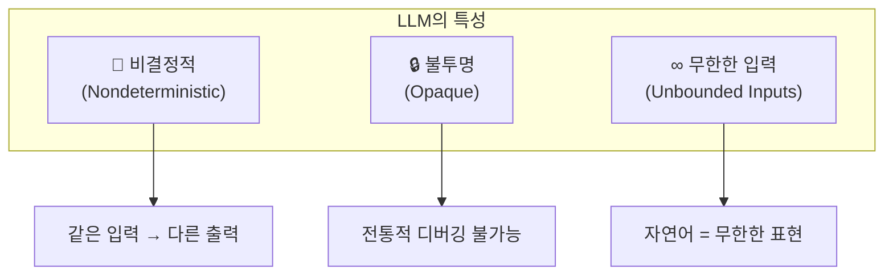

**LLM이 어려운 이유**:

| 특성 | 설명 | 영향 |
|------|------|------|
| **비결정적** | temperature, top_p로도 완전한 재현성 보장 불가 | 유닛 테스트 무의미 |
| **불투명** | 내부 로직 step-through 디버깅 불가 | 출력 이유 설명 불가 |
| **무한한 입력** | 자연어는 프로그래밍 언어보다 표현력 무한대 | 예측 불가능한 사용 패턴 |

> 💬 **비유**: LLM은 마치 블랙박스 안의 천재와 대화하는 것과 같다. 대부분 좋은 답을 주지만, 왜 그 답을 주는지 알 수 없고, 가끔 이상한 답을 해도 고칠 방법이 없다.

#### 1.2 전통적 접근법의 한계

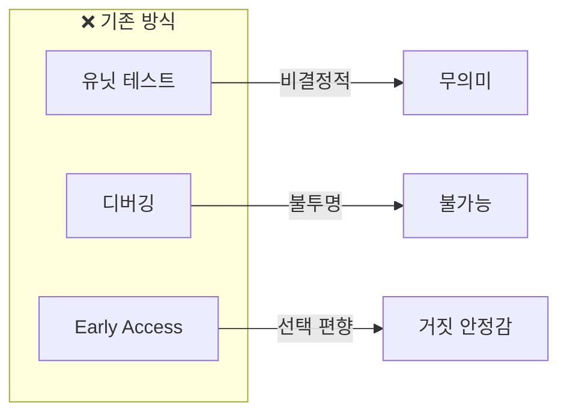

**인식해야 할 현실**:
- ⚠️ 실패는 **언제** 발생하는지의 문제, **만약** 발생하면이 아님
- ⚠️ 사용자는 예측 불가능한 행동을 함
- ⚠️ "버그 수정"이 다른 것을 망가뜨림
- ⚠️ Early Access 프로그램은 실제 도움이 안 됨

---

### 2. Evals(평가)를 통한 LLM 신뢰성

#### 2.1 Evals란?

**Evals = LLM을 위한 테스트**, 단 전통적 테스트와 다른 점이 있다:

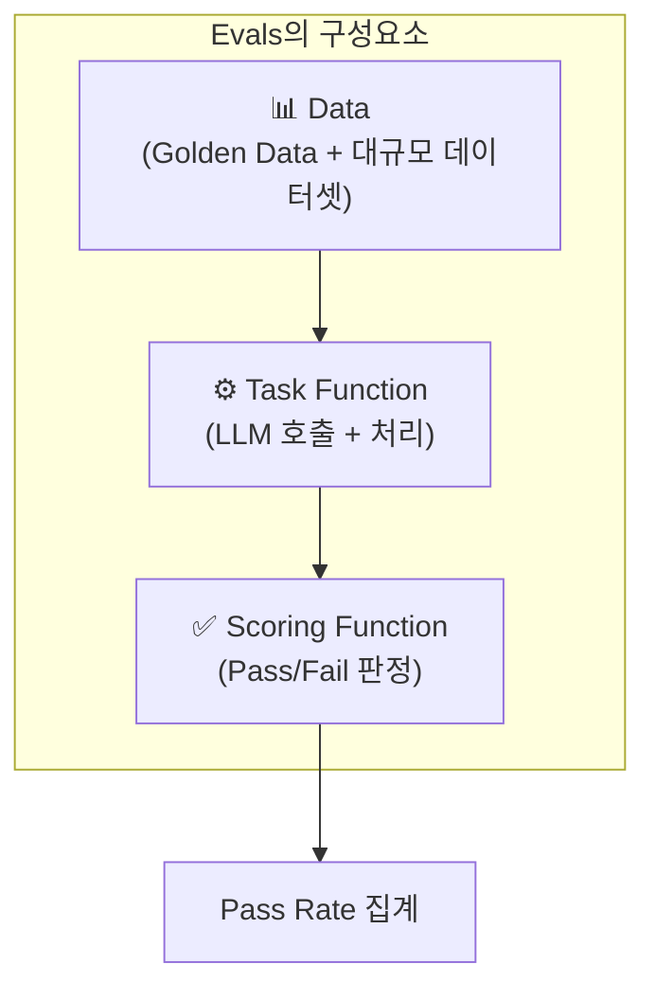

| 구성요소 | 설명 | 예시 |
|---------|------|------|
| **Golden Data** | 수작업으로 생성/주석 처리된 대표 데이터 | 10-50개의 핵심 입출력 쌍 |
| **대규모 데이터셋** | LLM 생성 또는 프로덕션 스냅샷 | 수백~수천 개 |
| **Task Function** | 실제 LLM 호출 로직 | prompt → LLM → output |
| **Scoring Function** | 출력 품질 판정 로직 | JSON 파싱 성공? 필수 필드 존재? |

#### 2.2 Evals의 두 가지 유형

| 유형 | 특성 | 예시 |
|------|------|------|
| **Deterministic** | 명확한 Pass/Fail | "욕설 포함 여부", "JSON 파싱 성공" |
| **Fuzzy** | 여러 "좋은" 답변 가능 | "응답이 도움이 되는가?" |

> ⚠️ **중요**: Evals의 목표는 100% Pass Rate가 **아님**! 100%면 충분히 대표적인 입력이 없다는 신호.

#### 2.3 "프로덕션에 충분한" Evals 만들기


**단계별 가이드**:

1. **프로토타입 구축**: 기본 기능 구현 후 "느낌" 확인
2. **Golden Data 생성** (며칠~1주):
   - 사용자 입력 카테고리 정의
   - 각 카테고리별 대표 입력 수집
   - 이상적인 출력 수작업 작성
3. **Scoring Function 정의**:
   - JSON 파싱 가능?
   - 필수 데이터 포함?
   - 작게 시작 → 점진적 확장
4. **반복 개선**: 50%+ Pass Rate 달성 시 프로덕션 배포 고려

---

### 3. 텔레메트리 설계

#### 3.1 기본 LLM 호출 (정적 프롬프트)

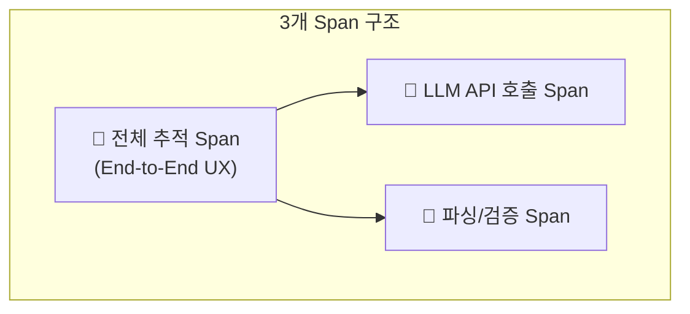

#### 3.2 RAG (Retrieval Augmented Generation)

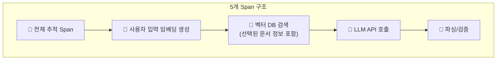

#### 3.3 Agent / 체인 호출

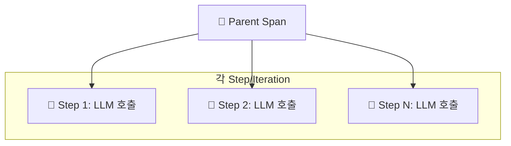

> ⚠️ **주의**: 무한 실행 가능성 고려 - 트레이스의 span 수가 가변적

#### 3.4 필수 수집 데이터

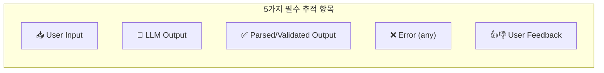

| 데이터 | 중요성 | 용도 |
|--------|--------|------|
| **User Input** | 🔴 필수 | 패턴 분석, Evals 데이터 |
| **LLM Output** | 🔴 필수 | 프롬프트 엔지니어링 개선 |
| **Parsed Output** | 🔴 필수 | 최종 사용자 경험 이해 |
| **Error** | 🔴 필수 | 수정 가능 에러 식별 |
| **User Feedback** | 🟡 권장 | 품질 측정, 우선순위 결정 |

#### 3.5 LLM 출력 파싱/검증이 중요한 이유

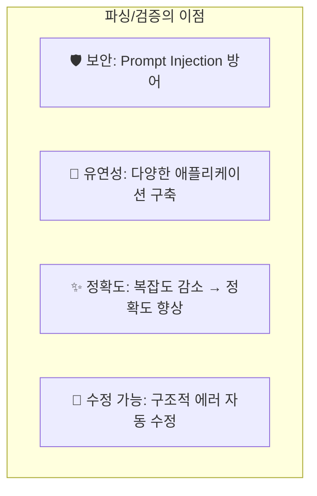

> 💬 **핵심**: LLM 출력은 **신뢰할 수 없는 입력(Untrusted Input)**으로 취급해야 함

---

### 4. 텔레메트리 분석

#### 4.1 다차원 분석의 힘

단일 차원 분석:
```
GROUP BY error → "어떤 에러가 가장 흔한가?"
```

**다차원 분석**:
```
GROUP BY error, user_input, llm_output, parsed_output
→ "동일 입력이 다른 에러를 발생시키는가?"
→ "동일 에러를 유발하는 입력의 공통점은?"
→ "LLM 출력 중 같은 파싱 에러를 유발하는 유사점은?"
```

#### 4.2 SLO 설정

**레이턴시 SLO**:

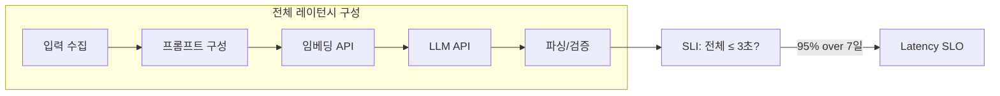

**에러율 SLO**:

| 항목 | 설정 예시 |
|------|----------|
| **SLI** | 에러 없음 = 성공 |
| **초기 목표** | 개발 중 성공률 기반 (예: 75%) |
| **기간** | 7일 |
| **예시** | 1,000 호출 중 750개 성공 |

> ⚠️ **알림 정책**: LLM SLO 알림은 **비긴급**으로 설정. Slack/Teams로 전송, PagerDuty 사용 금지.

---

### 5. Observability 데이터를 개발에 피드백

#### 5.1 프로덕션 데이터 기반 반복

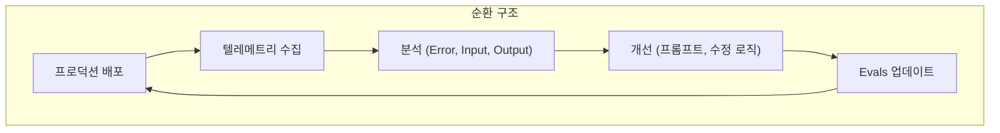

**대표성 기준** (Rule of Thumb):
- 10명 이상 사용자
- 100회 이상 일일 사용
- → 프롬프트 변경의 영향 확인 가능

#### 5.2 수정 가능한 에러(Correctable Errors) 활용

**Honeycomb Query Assistant 사례**:

```json
// LLM 출력 (에러)
{
  "calculations": [
    {"op": "COUNT", "column": "exception.message"}  // ❌ COUNT는 column 불필요
  ]
}

// 자동 수정 후 (성공)
{
  "calculations": [
    {"op": "COUNT"}  // ✅ column 제거
  ]
}
```

**결과**:
```
에러율 25% → 14% (수정 로직만으로)
→ 프롬프트 개선 후 → 1% 미만
```


> 💬 **핵심 교훈**: 프롬프트 엔지니어링 전에 **수정 가능한 에러**부터 처리하면 빠른 성과 가능

---

### 6. Evals와 Observability 함께 사용하기

#### 6.1 프로덕션 데이터를 Evals에 피드백

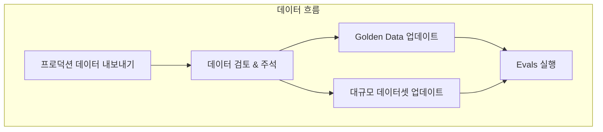

**Golden Data 업데이트 절차**:

1. 프로덕션 데이터 샘플 추출
2. 각 입력에 대해:
   - 이 입력을 Golden Data에 추가할 것인가?
   - 이상적인 출력은 무엇인가? (수작업 작성)
   - 기존 Golden Data에서 제거할 항목은?
3. 대규모 데이터셋에 나머지 데이터 추가

#### 6.2 선순환 구조


**실험 대상**:
- 다른 프롬프트
- 새로운 모델 (예: GPT-4 → Claude)
- RAG 파이프라인 변경
- 검색 전략 수정

#### 6.3 공개 벤치마크의 한계

| 벤치마크 유형 | 유용성 | 한계 |
|-------------|--------|------|
| **공개 벤치마크** | 모델 간 일반 비교 | 비즈니스 특화 사용에 무의미 |
| **일반 메트릭 (Helpfulness, Toxicity 등)** | 기본 품질 확인 | 실제 유용성과 무관할 수 있음 |
| **Grounding in Facts** | RAG 앱에 유용 | 설정에 노력 필요 |

> ⚠️ **결론**: **비즈니스/고객 워크플로우에 특화된 자체 Evals 투자 필수**

---

### 7. 팀 스포츠로서의 Observability

#### 7.1 역할별 책임

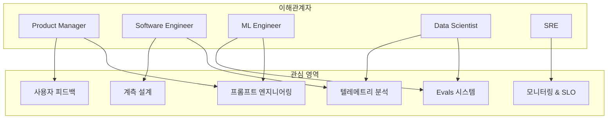

#### 7.2 역할 변화의 필요성

| 기존 역할 | 새로운 책임 |
|----------|------------|
| **Software Engineer** | 데이터 품질, 대표성, 확률적 시스템 이해 |
| **ML Engineer** | 사용자 상호작용, 제품 행동 이해 |
| **Product Manager** | Python, Jupyter로 프롬프트 실험 참여 |

> 💬 **핵심**: 새로운 직함을 채용할 필요는 없지만, 기존 역할이 새로운 책임을 **적응**해야 함

---

## 🔍 심화 학습

### 추가 조사 내용

#### 관련 기술/개념

**1. Prompt Injection 공격**
- 악의적 입력으로 LLM 행동 조작
- 데이터 유출, 출력 조작, 시스템 재프로그래밍
- 완전한 해결책 없음 → 출력 파싱/검증으로 완화

**2. LLM as Judge**
- LLM을 사용하여 다른 LLM 출력 평가
- 대규모 Fuzzy Evals에 활용
- 실제 데이터 vs 합성 데이터 구분 필요

**3. Temperature와 Top_p**
- Temperature: 출력의 무작위성 조절 (0=결정적, 1=창의적)
- Top_p: 누적 확률 기반 토큰 선택
- 완전한 재현성 보장하지 않음

### 출처
- [OpenAI Cookbook - Evals](https://cookbook.openai.com/examples/evaluation)
- [Anthropic - Prompt Engineering](https://docs.anthropic.com/claude/docs/prompt-engineering)
- [LangChain - Evaluation](https://python.langchain.com/docs/guides/evaluation/)

---

## 💡 실무 적용 포인트

### 이런 상황에서 사용하세요

1. **LLM 기반 기능 첫 출시 시**
   - Golden Data 10-50개로 시작
   - 50%+ Pass Rate에서 프로덕션 배포
   - 프로덕션 데이터로 Evals 지속 개선

2. **에러율이 높을 때 (>20%)**
   - 수정 가능한 에러(Correctable Errors) 먼저 분석
   - 프롬프트 변경 전 수정 로직으로 빠른 개선

3. **사용자 피드백이 부정적일 때**
   - Input/Output/Error 다차원 분석
   - 특정 입력 패턴과 부정 피드백 상관관계 확인

### 주의할 점 / 흔한 실수

- ⚠️ **Evals 100% Pass Rate 추구**: 오히려 대표성 부족의 신호
  - ✅ 50-95% Pass Rate가 건강한 상태

- ⚠️ **공개 벤치마크에 의존**: 비즈니스 특화 품질과 무관
  - ✅ 자체 Evals 투자 필수

- ⚠️ **LLM 출력을 그대로 사용**: 보안 위험 + 수정 기회 상실
  - ✅ 항상 파싱/검증 단계 포함

- ⚠️ **Early Access로 충분하다고 판단**: 선택 편향, 거짓 안정감
  - ✅ "Ship to Learn" 마인드셋 채택

### 면접에서 나올 수 있는 질문

**Q: LLM 애플리케이션에 전통적 유닛 테스트가 효과적이지 않은 이유는?**
> A: LLM은 비결정적 시스템이라 같은 입력에 다른 출력이 나올 수 있다. 또한 내부가 불투명해서 특정 입력이 특정 출력을 보장하도록 만들 수 없다. 대신 Evals를 통한 통계적 품질 측정이 필요하다.

**Q: Evals의 Golden Data와 대규모 데이터셋의 차이는?**
> A: Golden Data는 수작업으로 생성/주석 처리된 10-50개의 대표 입출력 쌍으로, 핵심 사용 케이스를 대표한다. 대규모 데이터셋은 LLM으로 생성하거나 프로덕션에서 수집한 수백~수천 개 데이터로, 실제 다양성을 반영한다.

**Q: Honeycomb이 에러율을 25%에서 1%로 낮춘 방법은?**
> A: 두 단계로 진행했다. 1) 수정 가능한 에러(예: COUNT 연산자의 불필요한 column 필드)를 프로그래밍으로 자동 수정하여 25%→14%로 개선. 2) 프롬프트 엔지니어링으로 14%→1%로 추가 개선.

**Q: LLM SLO 알림을 PagerDuty로 보내면 안 되는 이유는?**
> A: LLM 관련 SLO 위반은 즉각 조치가 필요한 긴급 상황이 아니라, 팀이 계획적으로 개선 작업을 진행해야 하는 정보성 알림이다. Slack/Teams로 보내 계획적 대응을 유도해야 한다.

---

## ✅ 핵심 개념 체크리스트

- [ ] LLM이 "비결정적, 불투명, 무한 입력" 시스템인 이유를 설명할 수 있는가?
- [ ] Evals의 3가지 구성요소(Data, Task Function, Scoring Function)를 알고 있는가?
- [ ] "프로덕션에 충분한" Evals의 기준(50%+ Pass Rate)을 이해하는가?
- [ ] LLM 출력을 파싱/검증해야 하는 이유 4가지를 설명할 수 있는가?
- [ ] 수정 가능한 에러(Correctable Errors)를 활용한 빠른 개선 전략을 알고 있는가?
- [ ] 프로덕션 데이터 → Evals 피드백 순환 구조를 설명할 수 있는가?

---

## 🔗 참고 자료

- 📄 [OpenAI Cookbook - Evals](https://cookbook.openai.com/examples/evaluation)
- 📄 [Anthropic Prompt Engineering Guide](https://docs.anthropic.com/claude/docs/prompt-engineering)
- 📄 [LangChain Evaluation](https://python.langchain.com/docs/guides/evaluation/)
- 🔧 [OpenTelemetry LLM Instrumentation](https://opentelemetry.io/docs/specs/semconv/gen-ai/)
- 📚 이 책의 Query Assistant 사례: Honeycomb의 실제 개선 여정

---
