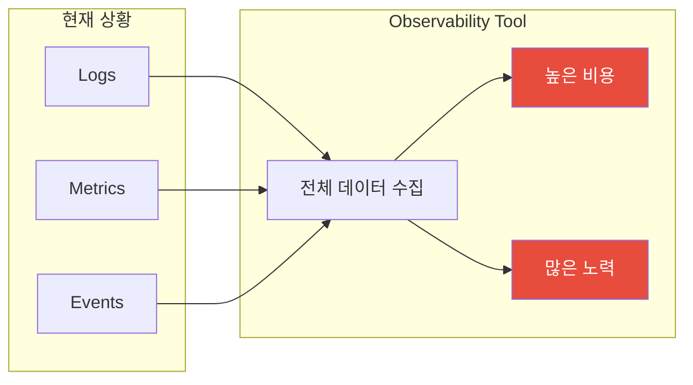
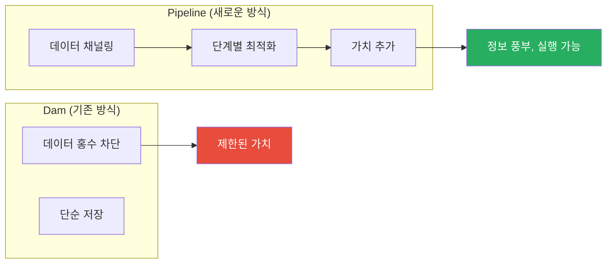
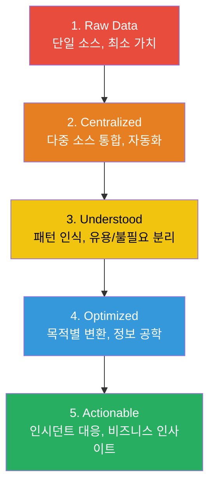
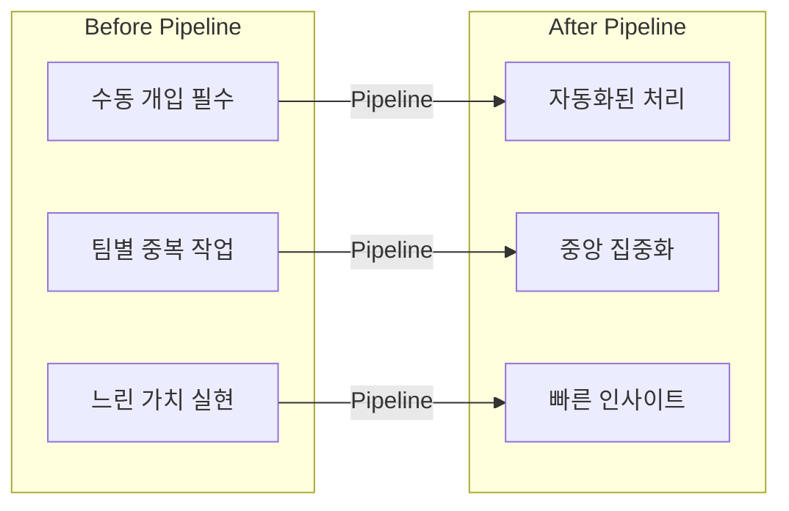
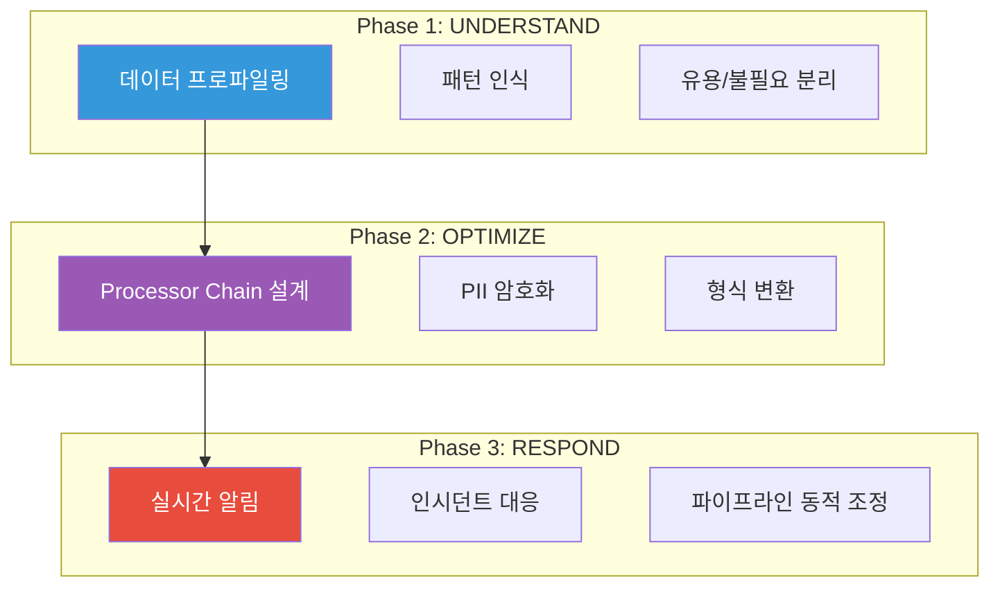
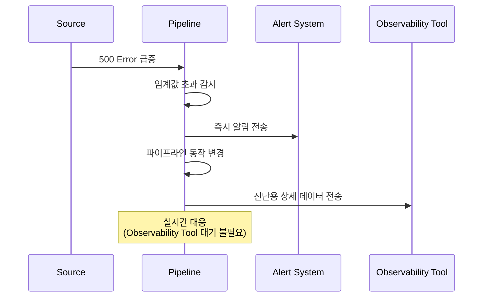
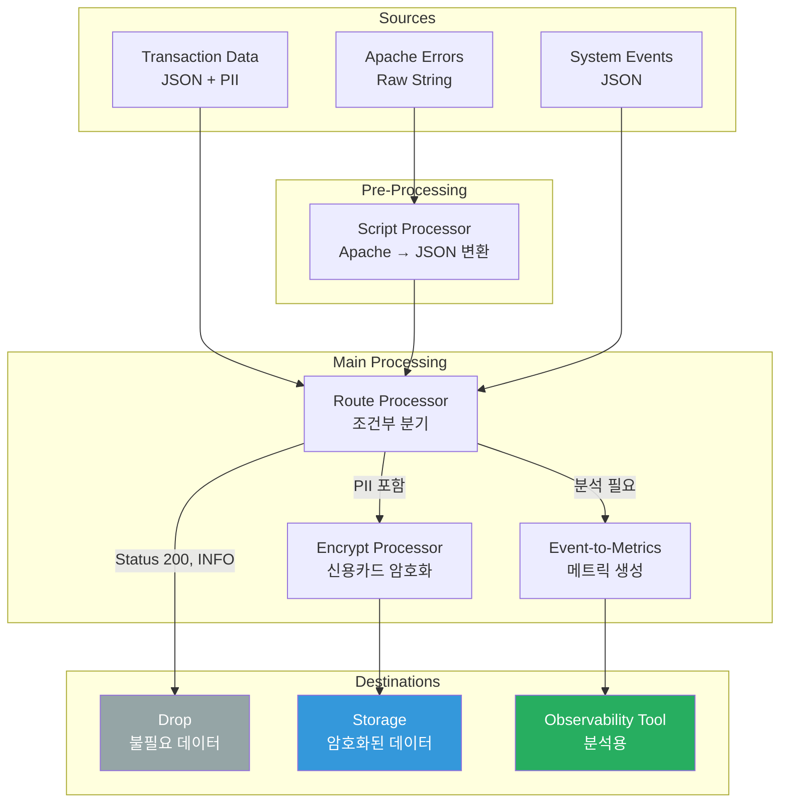
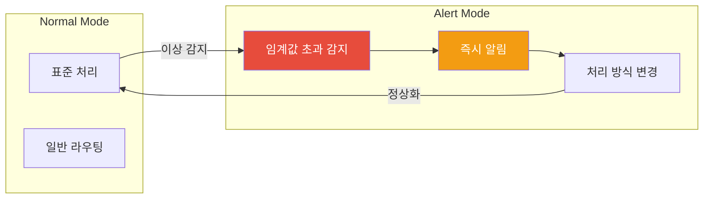
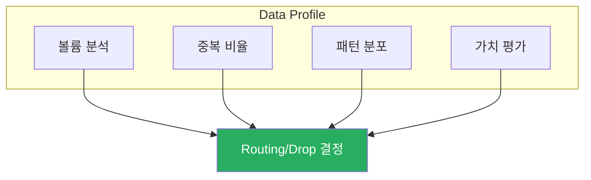

# Chapter 1. The Need for Telemetry Pipelines

> "Data is the new oil."
> — Clive Humby

---

## 📌 핵심 요약

> **Telemetry Pipeline**은 단순한 데이터 전송이 아닌, 원시 데이터를 **단계적으로 정제하여 가치를 증가**시키는 시스템이다. 원유(crude oil)를 정제하여 다양한 제품으로 만들듯이, 텔레메트리 데이터도 **Understand → Optimize → Respond** 단계를 거쳐 **actionable information**으로 변환된다.

---

## 🎯 학습 목표

- [ ] Telemetry Pipeline의 필요성과 가치 이해
- [ ] Incremental Value Chain 5단계 설명
- [ ] Understand, Optimize, Respond 세 가지 위상 파악
- [ ] Pipeline 기본 구조 (Sources, Processors, Destinations) 이해
- [ ] 주요 Processor 유형과 용도 파악

---

## 📖 본문 정리

### 1. Taming the Data Flood (데이터 홍수 길들이기)

#### 1.1 문제: 데이터 홍수

| 문제 | 설명 |
|------|------|
| **데이터 과부하** | 클라우드 시스템의 로그 볼륨이 압도적 |
| **의미 없는 데이터** | 대부분 노이즈, 유용한 정보는 극소수 |
| **높은 비용** | 전체 데이터 수집/저장의 비용 부담 |
| **느린 인사이트** | 사후 분석, 실시간 대응 어려움 |

#### 1.2 해결책: Telemetry Pipeline

**핵심 비유: 원유 정제**

| 원유 | 텔레메트리 데이터 |
|------|-------------------|
| 원유 분출 | 로그/메트릭/이벤트 생성 |
| 정제 과정 | Pipeline 처리 |
| 휘발유/경유/등유 | 목적별 최적화된 정보 |
| 다양한 산업 사용 | 다양한 Destination 활용 |

---

### 2. The Incremental Value Chain (점진적 가치 사슬)

#### 2.1 5단계 가치 증가

| 단계 | 설명 | 가치 수준 |
|------|------|-----------|
| **1. Raw Data** | 단일 소스, 수동 분석 필요 | 🔴 최소 |
| **2. Centralized** | 다중 소스 통합, 자동화 시작 | 🟠 낮음 |
| **3. Understood** | 패턴 파악, 유용/불필요 구분 | 🟡 중간 |
| **4. Optimized** | 목적별 Processor Chain 적용 | 🔵 높음 |
| **5. Actionable** | 즉시 실행 가능한 정보 | 🟢 최고 |

#### 2.2 각 단계의 특징

---

### 3. Understand, Optimize, Respond (이해, 최적화, 대응)

#### 3.1 세 가지 위상(Phase)

#### 3.2 각 위상 상세

**Phase 1: Understand (이해)**

| 컴포넌트 | 역할 | 비유 |
|----------|------|------|
| **Parser** | 데이터 요소 분리 | 금광에서 사금 채취 |
| **Analytics Tool** | 데이터 프로파일 제공 | 광석 품질 분석 |
| **Profiling** | 중복/불필요 데이터 식별 | 돌과 금 구분 |

**Phase 2: Optimize (최적화)**

| 처리 유형 | 목적 | Processor |
|-----------|------|-----------|
| **PII 보호** | 개인정보 암호화/삭제 | Encrypt, Redact |
| **메트릭 생성** | 시각화용 데이터 변환 | Event-to-Metrics |
| **형식 변환** | 다양한 포맷 통일 | Script Processor |
| **라우팅** | 목적지별 데이터 분배 | Route Processor |

**Phase 3: Respond (대응)**

**Respond의 핵심 차별점:**

| 기존 방식 | Pipeline 방식 |
|-----------|---------------|
| 사후 분석 | 실시간 감지 |
| 인덱싱 대기 | 즉시 알림 |
| 수동 대응 | 자동 파이프라인 조정 |

---

### 4. Example Pipeline (예제 파이프라인)

#### 4.1 시나리오

**Source 데이터:**
- Transaction 데이터 (JSON) - PII 포함
- Apache Error 메시지 (Raw String)
- System Events (JSON)

**요구사항:**

| 요구사항 | 문제 | 해결 방안 |
|----------|------|-----------|
| 비용 절감 | 전체 스트림 전송 비용 과다 | 불필요 데이터 Drop |
| 보안 준수 | PII (신용카드 등) 노출 | 암호화/삭제 |
| 형식 통일 | Apache Raw String | JSON 변환 |
| 목적지 분리 | 다른 컴포넌트 다른 목적지 | 라우팅 |
| 메트릭 생성 | 이벤트 시각화 필요 | Event-to-Metrics |

#### 4.2 Pipeline 아키텍처

#### 4.3 주요 Processor 역할

| Processor | 용도 | 적용 사례 |
|-----------|------|-----------|
| **Script** | 형식 변환 스크립트 실행 | Apache Raw → JSON |
| **Route** | 조건부 데이터 분기 | Status 200 → Drop |
| **Encrypt** | 민감정보 암호화 | 신용카드 번호 |
| **Redact** | 민감정보 완전 삭제 | 복구 불필요 시 |
| **Event-to-Metrics** | 이벤트 집계 | 시간별 에러 카운트 |
| **Drop** | 불필요 데이터 제거 | INFO 로그 |

#### 4.4 Responsive Pipeline 기능

**예시: 500 Error 급증 대응**
1. Route Processor가 500 Error 메시지 증가 감지
2. 임계값 초과 시 즉시 알림 전송
3. 해당 메시지에 대한 상세 처리 시작
4. Observability Tool로 진단 데이터 전송

---

## 🔍 심화 학습

### Analytics Tool의 데이터 프로파일링

**프로파일링 결과 활용:**
- 높은 중복: Aggregation 적용
- 낮은 가치: Drop 또는 Cold Storage
- 패턴 발견: 자동화 규칙 생성

### PII 처리 전략

| 전략 | Processor | 사용 사례 |
|------|-----------|-----------|
| **완전 삭제** | Redact | 복구 불필요, 규정 준수 |
| **암호화** | Encrypt | 추후 조사 필요 (사기 조사) |
| **마스킹** | Mask | 부분 표시 필요 (카드 끝 4자리) |
| **토큰화** | Tokenize | 참조 가능하지만 노출 방지 |

---

## 💡 실무 적용 포인트

### Pipeline 설계 시 고려사항

| 질문 | 고려 사항 |
|------|-----------|
| 어떤 데이터가 가치 있는가? | Understand 단계에서 분석 |
| 어떤 규정을 준수해야 하는가? | PII 처리 전략 결정 |
| 어떤 형식 변환이 필요한가? | 소스별 Parser/Script 설계 |
| 어디로 라우팅해야 하는가? | 목적지별 요구사항 파악 |
| 실시간 대응이 필요한가? | Alert/Threshold 설정 |

### 주의사항

| 안티패턴 | 문제점 | 올바른 접근 |
|----------|--------|-------------|
| 전체 데이터 저장 | 비용 폭증 | 가치 기반 필터링 |
| 단일 목적지 | 유연성 부족 | 다중 라우팅 |
| 사후 분석만 | 느린 대응 | 실시간 감지/알림 |
| PII 무시 | 규정 위반 | 암호화/삭제 필수 |

### 면접 예상 질문

1. **"Telemetry Pipeline이 필요한 이유는?"**
   - 데이터 홍수: 볼륨 과다, 대부분 노이즈
   - 비용: 전체 저장/처리 비용
   - 가치: 원시 데이터 → 정제된 정보로 변환
   - 실시간 대응: Observability Tool 대기 없이 즉시 알림

2. **"Understand, Optimize, Respond 단계를 설명하라"**
   - Understand: 데이터 프로파일링, 패턴 인식, 가치 평가
   - Optimize: Processor Chain으로 목적별 변환
   - Respond: 실시간 감지, 알림, 파이프라인 동적 조정

3. **"원유 정제와 Telemetry Pipeline의 비유는?"**
   - 원유 분출 = 로그/메트릭 생성
   - 정제 과정 = Processor Chain
   - 다양한 제품 = 목적별 최적화된 정보
   - 산업 사용 = 다양한 Destination 활용

---

## ✅ 핵심 개념 체크리스트

### 기본 개념
- [ ] Telemetry Pipeline의 정의와 목적
- [ ] 데이터 홍수 문제와 Pipeline 해결책
- [ ] 원유 정제 비유의 의미

### Incremental Value Chain
- [ ] 5단계 가치 증가 과정
- [ ] 각 단계의 특징과 가치 수준
- [ ] Raw Data → Actionable Information 전환

### 세 가지 위상
- [ ] Understand: Parser, Profiling, Analytics
- [ ] Optimize: Processor Chain, PII 보호
- [ ] Respond: 실시간 감지, 알림, 동적 조정

### Pipeline 구조
- [ ] Sources, Processors, Destinations
- [ ] 주요 Processor 유형 (Route, Encrypt, Script, E2M)
- [ ] Responsive Pipeline 개념

---

## 🔗 참고 자료

### 핵심 개념
- Telemetry Pipeline 아키텍처
- Data Engineering 원칙
- Observability vs Monitoring

### 다음 챕터 예고
- Cost Reduction 전략
- Data Compliance 구현
- 주요 Processor 상세 가이드
