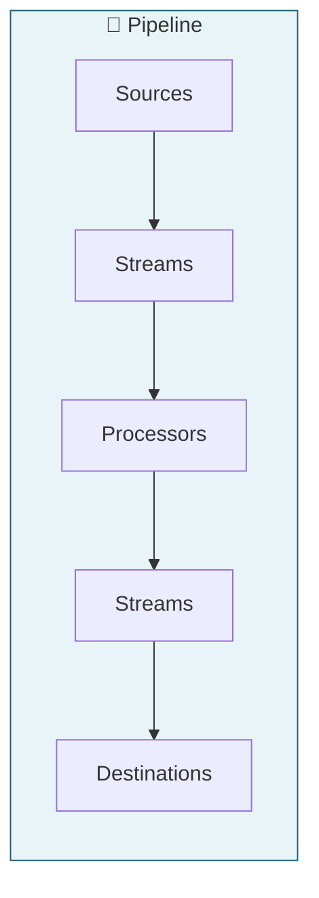
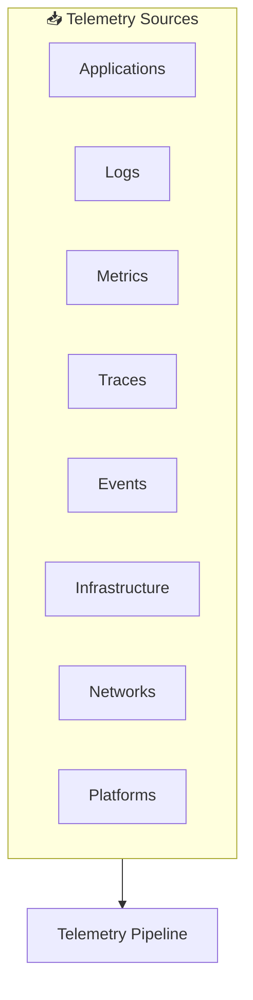
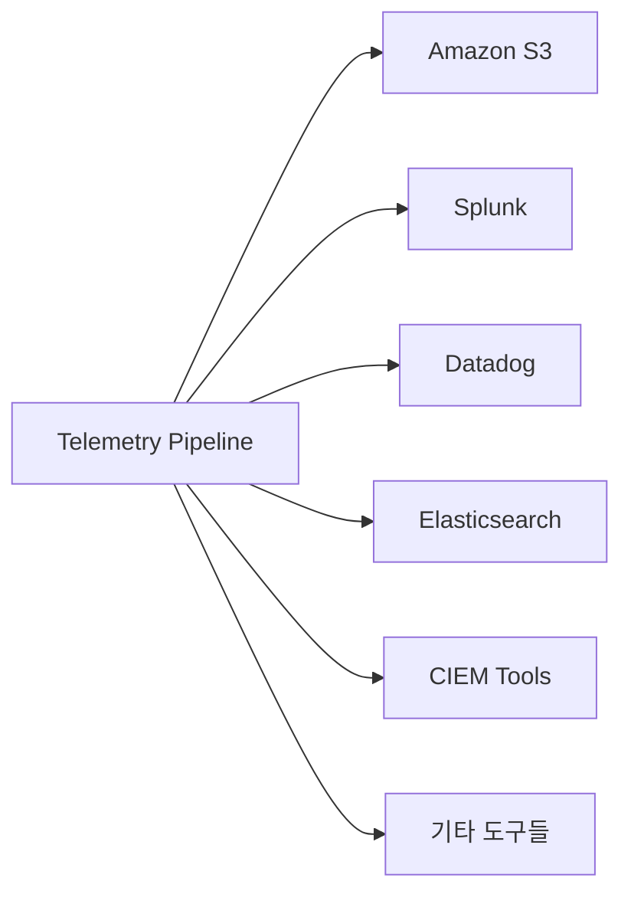
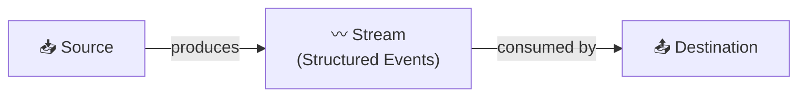
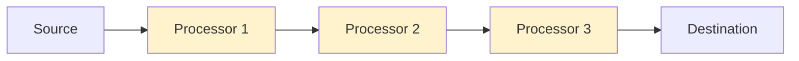
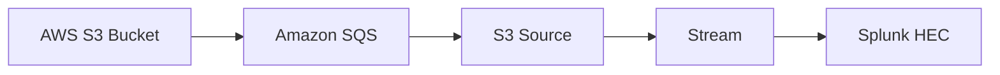
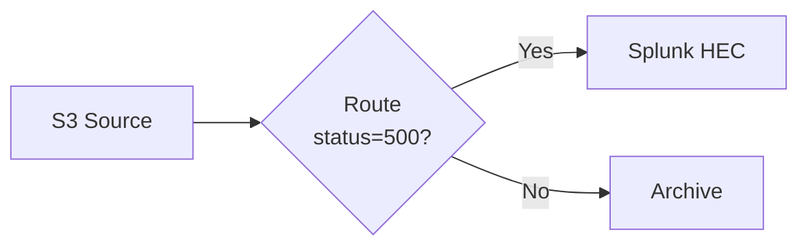
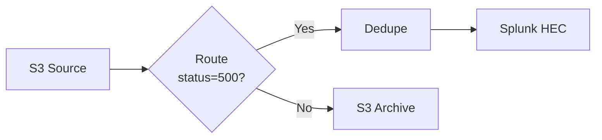
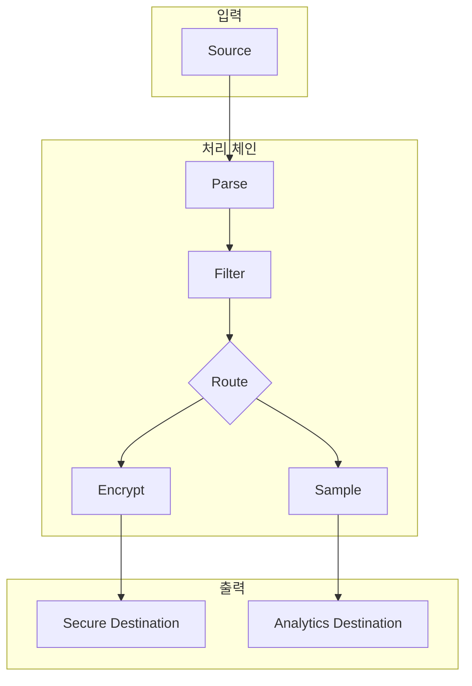

# Chapter 2. The Domain Language of Telemetry Pipelines

> 📌 **핵심 요약**
>
> 텔레메트리 파이프라인은 **5가지 핵심 개념**으로 구성됩니다: Sources(소스), Streams(스트림), Processors(프로세서), Destinations(목적지), 그리고 Pipeline(파이프라인) 자체. 소스는 텔레메트리 데이터의 수도꼭지이고, 목적지는 정제된 데이터가 도달하는 채널입니다. 스트림은 이 둘을 연결하며, 프로세서가 스트림 위에서 데이터를 변환, 라우팅, 필터링하는 실제 작업을 수행합니다.

---

## 🎯 학습 목표

- [ ] 텔레메트리 파이프라인의 5가지 구성 요소 이해
- [ ] Source와 Destination의 역할과 종류 파악
- [ ] Stream의 개념과 구조화된 이벤트 흐름 이해
- [ ] 다양한 Processor 유형과 각각의 용도 학습
- [ ] 실제 파이프라인 구성 예제 분석

---

## 📖 본문 정리

### 1. 텔레메트리 파이프라인의 5가지 Building Blocks



| 구성 요소 | 역할 | 비유 |
|-----------|------|------|
| **Sources** | 텔레메트리 데이터의 진입점 | 수도꼭지 (Faucet) |
| **Streams** | 구조화된 이벤트의 흐름 | 물줄기 |
| **Processors** | 데이터 변환/조작 작업 수행 | 정수 필터 |
| **Destinations** | 정제된 데이터의 도착점 | 저수지/배수구 |
| **Pipeline** | 모든 구성 요소를 패키징 | 전체 배관 시스템 |

---

### 2. Sources: 데이터의 시작점

> "Where are we going to get our data from?"



#### Source 유형별 설명

| Source 유형 | 설명 | 예시 |
|-------------|------|------|
| **Applications** | 애플리케이션/서비스가 발생시키는 텔레메트리 | 커스텀 메트릭, 비즈니스 이벤트 |
| **Logs** | 시스템 내 이벤트의 기록된 항목 | 애플리케이션 로그, 시스템 로그 |
| **Metrics** | 시스템 특성의 스냅샷/트렌드 | 디스크 공간, 응답 속도 |
| **Traces** | 흐름을 보여주는 이벤트 조합 | 분산 트레이싱 데이터 |
| **Events** | 특정 시점의 이산적 행동 | 사용자 클릭, 배포 이벤트 |
| **Infrastructure** | 저수준 인프라 상태 | VM, 네트워크, 게이트웨이 |
| **Networks** | 트래픽 흐름 정보 | Netflow, sFlow, SNMP |
| **Platforms** | 플랫폼 텔레메트리 | Kubernetes 메트릭/이벤트 |

---

### 3. Destinations: 데이터의 도착점

목적지는 정제된(conditioned) 텔레메트리 데이터를 푸시할 장소입니다.



**Destination 예시:**
- **스토리지**: Amazon S3, Azure Blob, GCS
- **Observability 도구**: Splunk, Datadog, New Relic, Elastic
- **보안/컴플라이언스**: SIEM, CIEM 도구
- **분석 플랫폼**: BigQuery, Snowflake

> 💡 **핵심**: 필요한 만큼 많은 destination을 추가하여 데이터를 가장 유용한 곳에 전달할 수 있습니다.

---

### 4. Streams: Source와 Destination의 연결



#### Stream의 특징

| 특성 | 설명 |
|------|------|
| **구조화된 이벤트** | Source가 입력 데이터를 구조화된 이벤트로 패키징 |
| **1:N 관계** | 하나의 Source가 여러 Destination으로 흐를 수 있음 |
| **작업 대상** | Processor가 조작하는 대상 |
| **기회의 채널** | 풍부화, 상관관계, 변환, 라우팅의 기회 |

> "These streams are what you work with when harnessing the power of telemetry pipelines."

---

### 5. Processors: 데이터 변환의 핵심



#### 주요 Processor 유형

| Processor | 기능 | 사용 사례 |
|-----------|------|-----------|
| **Route** | 규칙에 따라 이벤트를 여러 스트림으로 분배 | PII 감지 → 컴플라이언트 스트림 라우팅 |
| **Deduplicate** | 중복 이벤트 제거 | 비용 절감, 데이터 정리 |
| **Encrypt** | 이벤트 내 필드 암호화 | 개인정보/금융 데이터 보호 |
| **Sample** | 스트림 다운샘플링 | 스토리지/비용 절감 |
| **Filter** | 조건에 따라 이벤트 통과/차단 | 노이즈 제거 |
| **Reduce** | 여러 로그 이벤트를 하나로 결합 | 로그 집계 |
| **Parse** | 알려진 형식을 파싱된 값으로 변환 | 로그 파싱 |
| **Event-to-Metric** | 로그에서 메트릭 이벤트 생성 | 로그 기반 메트릭 생성 |

---

### 6. 실전 예제: AWS S3 로그 → Splunk 분석

**시나리오**: 감사팀이 과거 시스템 기록을 분석해야 함. S3에 보관된 로그를 Splunk로 가져와 분석하되, 비용 최적화 필요.

#### Step 1: 기본 스트림 구성



#### Step 2: Route Processor 추가 (500 Status만 필터)



**목적**: 감사팀이 필요한 실패(500 status) 로그만 Splunk로 전송

#### Step 3: Dedupe Processor 추가 (중복 제거)



**결과**:
- ✅ 필요한 500 status 로그만 Splunk로
- ✅ 중복 제거로 비용 절감
- ✅ 나머지 로그는 S3에 아카이브 (필요시 추가 분석용)

---

## 🔍 심화 학습

### Processor 체이닝 패턴



### Stream 분기 전략

| 전략 | 설명 | 사용 시점 |
|------|------|-----------|
| **Fan-out** | 하나의 스트림을 여러 목적지로 | 동일 데이터를 여러 도구에서 분석 |
| **Conditional** | 조건에 따라 다른 경로로 | 데이터 민감도, 유형별 처리 |
| **Pipeline** | 순차적 처리 체인 | 단계별 변환 필요 시 |

---

## 💡 실무 적용 포인트

### 1. Source 선택 가이드

```
시작 질문: "어떤 데이터가 필요한가?"

┌─ 애플리케이션 동작 분석 → Application/Trace Sources
├─ 시스템 건강 상태 → Metrics/Infrastructure Sources
├─ 문제 해결/디버깅 → Logs/Events Sources
├─ 네트워크 분석 → Network Sources (Netflow, SNMP)
└─ 컨테이너 환경 → Platform Sources (Kubernetes)
```

### 2. Processor 조합 전략

```yaml
# 비용 최적화 파이프라인
processors:
  - filter:      # 불필요한 이벤트 제거
  - dedupe:      # 중복 제거
  - sample:      # 다운샘플링
  - route:       # 목적지별 분배

# 컴플라이언스 파이프라인
processors:
  - parse:       # 데이터 구조화
  - route:       # PII 감지 및 분기
  - encrypt:     # 민감 필드 암호화
  - filter:      # 규정 미준수 데이터 차단
```

### 3. 감사 대응 체크리스트

- [ ] 과거 데이터 접근 경로 확보 (S3, Archive)
- [ ] 필요한 데이터만 필터링하여 비용 최적화
- [ ] 중복 제거로 분석 효율성 향상
- [ ] 원본 데이터 보존 (별도 Archive destination)

---

## ✅ 핵심 개념 체크리스트

### Building Blocks
- [ ] Sources: 텔레메트리 데이터의 "수도꼭지"
- [ ] Streams: 구조화된 이벤트의 흐름
- [ ] Processors: 스트림 위에서 작업 수행
- [ ] Destinations: 정제된 데이터의 도착점
- [ ] Pipeline: 모든 구성 요소의 패키지

### Processor 유형
- [ ] Route: 규칙 기반 이벤트 분배
- [ ] Deduplicate: 중복 이벤트 제거
- [ ] Encrypt: 필드 암호화
- [ ] Sample: 다운샘플링
- [ ] Filter: 조건부 통과/차단
- [ ] Reduce: 이벤트 결합
- [ ] Parse: 형식 파싱
- [ ] Event-to-Metric: 로그→메트릭 변환

### 실전 패턴
- [ ] Source → Stream → Destination 기본 흐름
- [ ] Processor 체이닝으로 복잡한 변환 구성
- [ ] Route + Dedupe 조합으로 비용 최적화
- [ ] Archive destination으로 원본 보존

---

## 🔗 참고 자료

- [Mezmo Processors Documentation](https://docs.mezmo.com) - 다양한 프로세서 목록
- Chapter 4: 샘플링에 대한 상세 내용
- Chapter 5: 리스크 및 컴플라이언스 시나리오
