# Chapter 3. Managing Your Telemetry Pipelines

> 📌 **핵심 요약**
>
> 텔레메트리 파이프라인도 시스템처럼 모니터링과 디버깅이 필요합니다. **Ingress/Egress 데이터 볼륨**으로 파이프라인이 예상대로 작동하는지 확인하고, **Pipeline Taps**로 스트림 내부를 들여다보며 문제를 진단할 수 있습니다. 이를 통해 데이터 누출, PII 노출 같은 문제를 조기에 발견하고 수정할 수 있습니다.

---

## 🎯 학습 목표

- [ ] 텔레메트리 파이프라인의 Observability 필요성 이해
- [ ] Ingress/Egress 데이터 볼륨 메트릭 활용법 학습
- [ ] Pipeline Taps(Wire Tap 패턴)의 개념과 사용법 파악
- [ ] 파이프라인 디버깅 워크플로우 습득
- [ ] PII 보호를 위한 Encrypt Processor 적용 사례 분석

---

## 📖 본문 정리

### 1. 파이프라인에도 Observability가 필요하다

> "Quis custodiet ipsos custodes?" - 누가 감시자를 감시할 것인가?

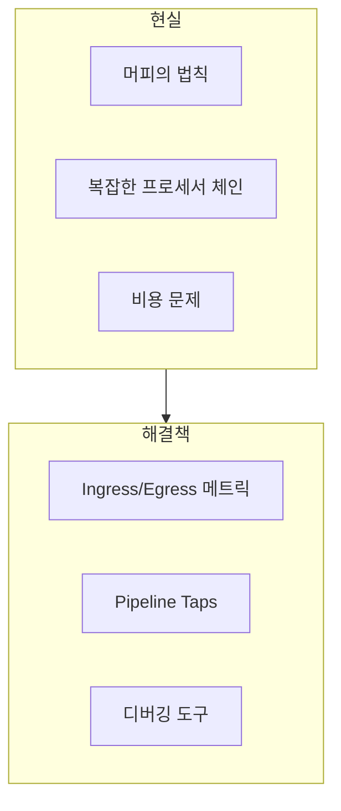

**핵심 통찰**:
- 개발자는 낙관주의자지만, 시스템은 결국 실패한다
- 텔레메트리를 수집하는 파이프라인도 예외가 아니다
- **파이프라인 자체에 대한 Observability**가 필수

---

### 2. Ingress와 Egress 데이터 볼륨

> "Raw data in. Conditioned data out."

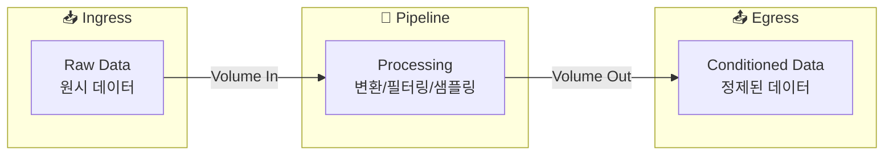

#### 데이터 볼륨으로 확인할 수 있는 것

| 질문 | 확인 방법 | 예상 결과 |
|------|-----------|-----------|
| 파이프라인이 작동하는가? | Ingress 볼륨 확인 | 예상 범위 내 데이터 유입 |
| 비용이 통제되는가? | Egress 볼륨 확인 | 목적지별 허용 범위 내 |
| 프로세서가 작동하는가? | Ingress vs Egress 비교 | Downsample 시 Egress < Ingress |

#### 글로벌 뷰의 중요성

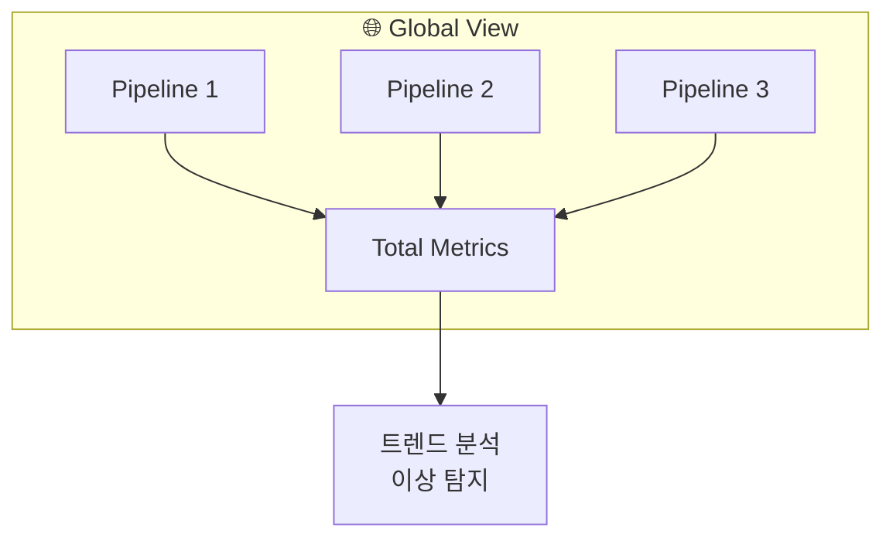

- **파이프라인 레벨**: 개별 파이프라인 건강 상태
- **글로벌 레벨**: 전체 시스템의 worrying trends 발견

---

### 3. Pipeline Taps: Wire Tap 패턴

> "Pipeline taps are an implementation of the Wire Tap pattern"

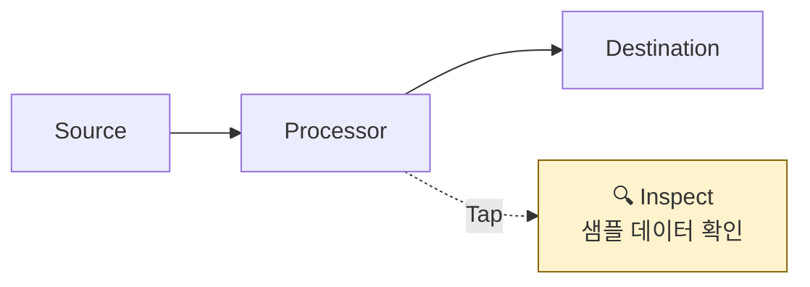

#### Pipeline Tap의 기능

| 기능 | 설명 |
|------|------|
| **Intercept** | 스트림의 메시지를 가로채기 |
| **Observe** | 실시간으로 데이터 관찰 |
| **Simulate** | 프로세서 동작 시뮬레이션 |
| **Debug** | 문제 원인 파악 |

#### Tap 배치 전략

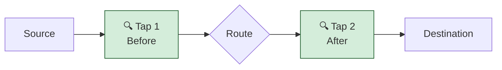

**Before/After Tap**: 프로세서 전후로 배치하여 변환 결과 검증

---

### 4. 디버깅 실전 예제

#### 시나리오: 감사팀을 위한 로그 파이프라인

**초기 구성**:
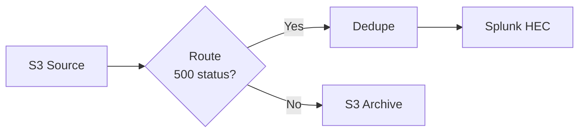

#### Step 1: 볼륨 확인

```
Dashboard 확인:
├─ Ingress: 예상 범위 ✅
├─ Egress to Splunk: 허용 범위 ✅
└─ 비용 안전 ✅
```

#### Step 2: 데이터 형식 검증 (Tap 추가)

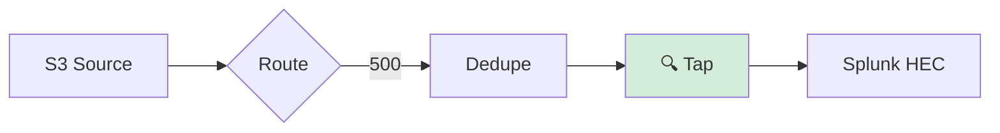

**Tap 검증 내용**:
- [ ] 500 status 로그만 포함되는가?
- [ ] 중복이 제거되었는가?
- [ ] 데이터 형식이 올바른가?

#### Step 3: 문제 발견 - PII 노출!

```
감사팀 질문: "S3에 저장되는 데이터는 암호화되어 있나요?"

Tap으로 확인:
├─ PII(개인정보) 발견! ⚠️
└─ 암호화 없이 저장 중 ❌
```

#### Step 4: 해결 - Encrypt Processor 추가

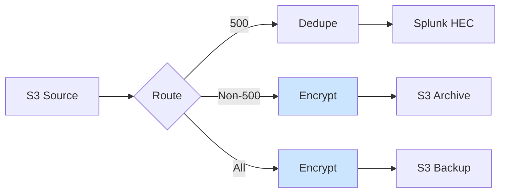

**결과**:
- ✅ PII 필드 암호화
- ✅ S3 저장 전 보호 적용
- ✅ 감사팀 & 규제기관과의 우호 관계 유지!

---

## 🔍 심화 학습

### Pipeline Observability 메트릭 계층

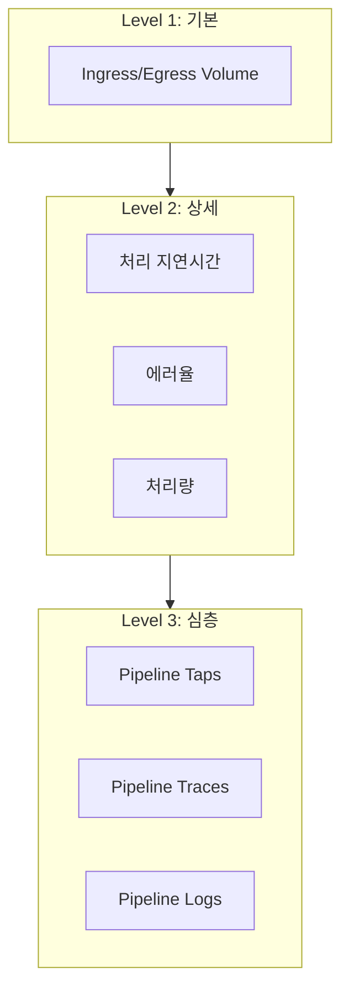

### Wire Tap 패턴 상세

```
Wire Tap Pattern (Enterprise Integration Patterns)

목적: 메시지 채널의 메시지를 복사하여 모니터링

특징:
├─ Non-intrusive: 원본 스트림에 영향 없음
├─ Sampling: 전체가 아닌 샘플만 캡처
├─ Real-time: 실시간 관찰 가능
└─ Temporary: 디버깅 후 제거 가능
```

### 디버깅 Decision Tree

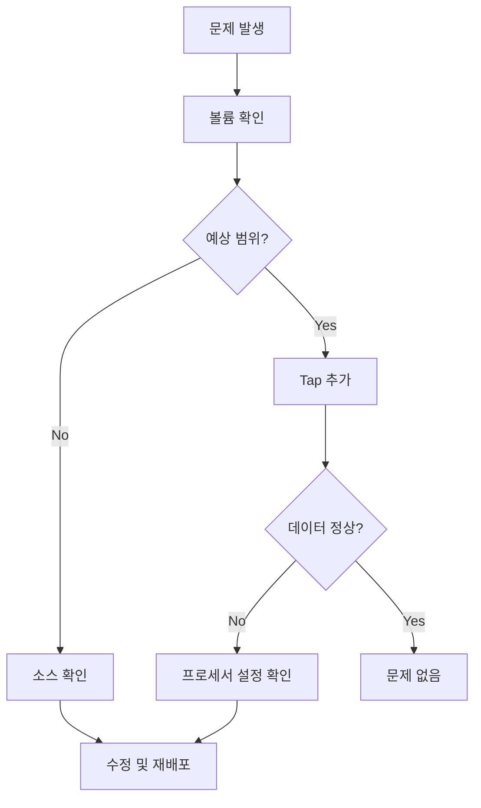

---

## 💡 실무 적용 포인트

### 1. 파이프라인 모니터링 체크리스트

```yaml
daily_checks:
  - ingress_volume: "예상 범위 내?"
  - egress_volume: "비용 허용 범위?"
  - error_rate: "< 1%?"
  - latency: "SLA 충족?"

weekly_checks:
  - volume_trends: "비정상적 증가/감소?"
  - processor_efficiency: "Dedupe/Sample 효과?"
  - destination_health: "모든 목적지 정상?"

incident_response:
  - add_taps: "Before/After 프로세서"
  - sample_data: "실제 이벤트 검사"
  - compare_expected: "예상 vs 실제"
```

### 2. Tap 활용 시나리오

| 상황 | Tap 위치 | 확인 내용 |
|------|----------|-----------|
| 라우팅 검증 | Route 전후 | 올바른 경로로 분배되는지 |
| 필터링 검증 | Filter 후 | 원하는 이벤트만 통과하는지 |
| 변환 검증 | Parse/Transform 후 | 형식이 올바른지 |
| 암호화 검증 | Encrypt 후 | 필드가 암호화되었는지 |
| 성능 분석 | 각 프로세서 전후 | 병목 지점 식별 |

### 3. PII 보호 파이프라인 패턴

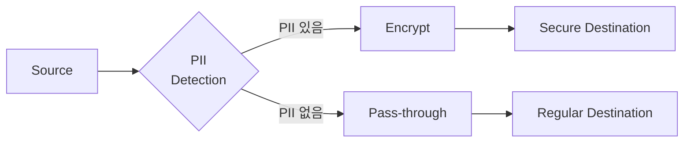

**암호화 대상 필드 예시**:
- 이메일 주소
- 전화번호
- 주민등록번호/SSN
- 신용카드 번호
- IP 주소 (상황에 따라)

---

## ✅ 핵심 개념 체크리스트

### 파이프라인 Observability
- [ ] 파이프라인도 시스템처럼 모니터링 필요
- [ ] 머피의 법칙은 파이프라인에도 적용됨

### Ingress/Egress 볼륨
- [ ] Raw data in → Conditioned data out
- [ ] 비용 통제의 핵심 지표
- [ ] 파이프라인/글로벌 레벨 모두 확인
- [ ] Downsample 시 Egress < Ingress 예상

### Pipeline Taps
- [ ] Wire Tap 패턴 구현
- [ ] Non-intrusive 메시지 관찰
- [ ] Before/After 배치로 프로세서 검증
- [ ] 실시간 디버깅 가능

### 디버깅 워크플로우
- [ ] Volume → Tap → Data Inspection
- [ ] 문제 발견 시 프로세서 추가/수정
- [ ] PII 노출 → Encrypt Processor로 해결

---

## 🔗 참고 자료

- [Enterprise Integration Patterns - Wire Tap](https://www.enterpriseintegrationpatterns.com/WireTap.html)
- Chapter 4: 비용 통제 상세 내용
- Chapter 5: 컴플라이언스 및 규정 준수
