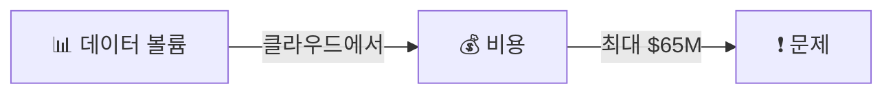
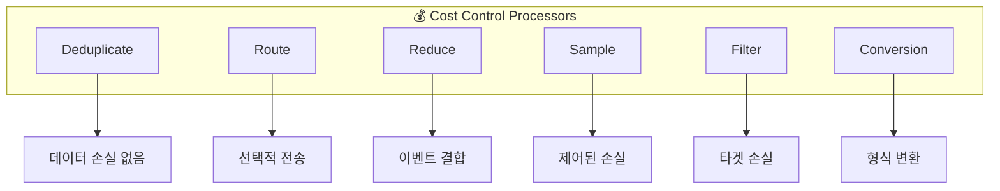
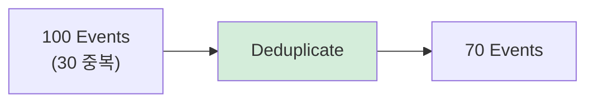
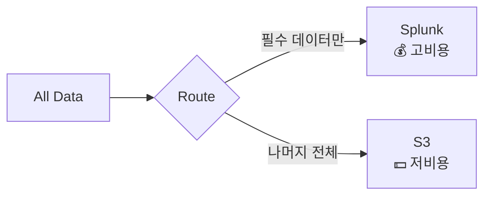
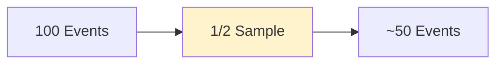
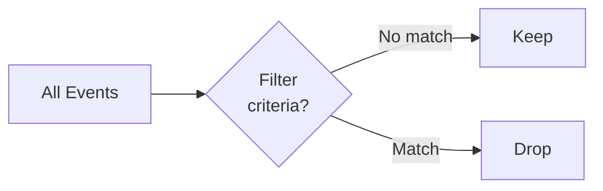
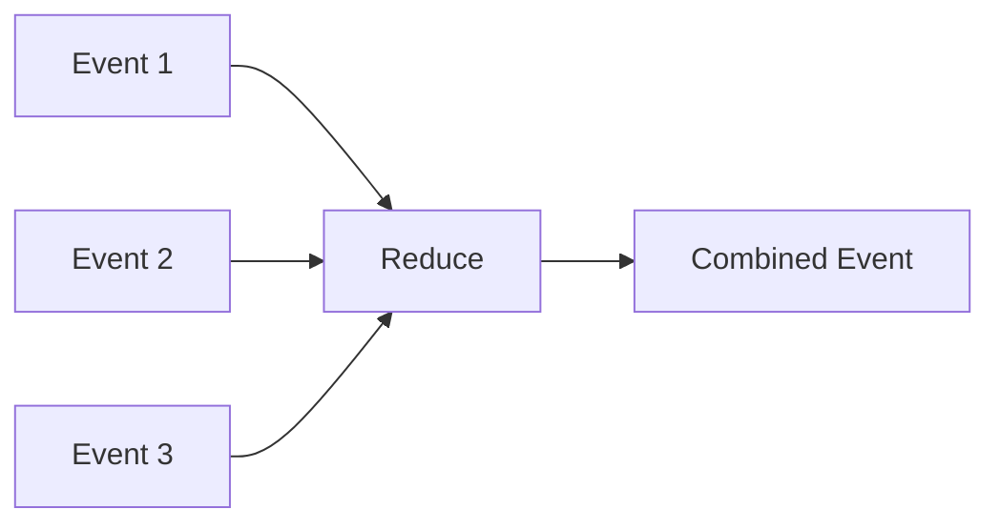
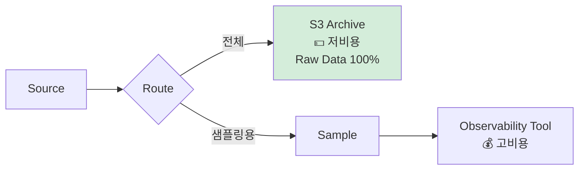
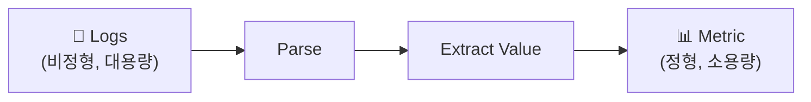
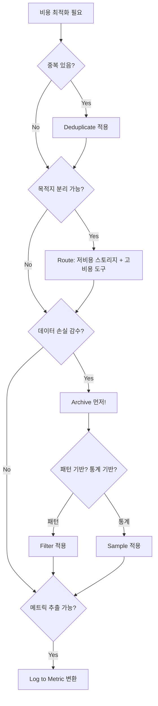

# Chapter 4. Containing the Cost

> 📌 **핵심 요약**
>
> 텔레메트리 데이터는 비용 문제를 야기합니다. 클라우드에서 데이터는 돈입니다. **Deduplicate, Route, Sample, Filter, Reduce, Conversion** 프로세서를 전략적으로 활용하면 비용을 통제할 수 있습니다. 핵심은 데이터를 잃더라도 **저렴한 스토리지(S3)에 아카이브**해두면 나중에 복구할 수 있다는 것입니다.

---

## 🎯 학습 목표

- [ ] 텔레메트리 데이터의 비용 영향 이해
- [ ] 비용 최적화를 위한 6가지 핵심 프로세서 학습
- [ ] Sampling vs Filtering의 차이와 트레이드오프 이해
- [ ] 아카이브 전략(Get-out-of-jail-free card) 습득
- [ ] Log to Metric 변환의 가치 파악

---

## 📖 본문 정리

### 1. 비용 문제의 현실

> "Show me the money!" - Jerry Maguire



**현실**:
- 데이터 볼륨 = 비용
- 클라우드 환경에서 데이터 전송/저장 비용 급증
- **$65 million** 청구서 사례 존재
- Observability 도구는 **바이트 단위 과금**

---

### 2. 비용 통제를 위한 6가지 핵심 프로세서



---

### 3. Deduplicate: 가장 안전한 첫 번째 선택

> "The deduplicate processor is your brutally simple friend."



#### 특징

| 항목 | 설명 |
|------|------|
| **데이터 손실** | ❌ 없음 (중복만 제거) |
| **복잡도** | 낮음 |
| **효과** | 데이터에 따라 다름 (중복이 많을수록 효과적) |
| **권장** | 항상 첫 번째로 적용 |

> 💡 **Best Practice**: 파이프라인 설계 시 **데이터 이해 → Dedupe 적용**이 첫 단계

---

### 4. Route: 선택적 목적지 지정



#### 트레이드오프

| 장점 | 단점 |
|------|------|
| Splunk 비용 최적화 | 데이터 분리로 분석 복잡성 증가 |
| 중요 데이터 집중 | 잘못된 라우팅 시 쓸모없는 데이터만 도착 |
| 아카이브로 백업 가능 | "First-class tool with third-class data" 위험 |

> ⚠️ **주의**: 라우팅은 단순해 보이지만, 유용한 데이터를 보내는 것이 핵심!

---

### 5. Sample, Filter, Reduce: 데이터 손실을 감수하는 전략

> "Sampling and filtering loses data… Say it with me: sampling and filtering by definition loses data."

#### 5.1 Sample Processor: 1/n 샘플링



**1/n 샘플링 종류**:

| 샘플링 | 설명 | 결과 |
|--------|------|------|
| **1/2** | 매 2번째 이벤트만 | 50% 유지 |
| **1/3** | 매 3번째 이벤트만 | 33% 유지 |
| **1/10** | 매 10번째 이벤트만 | 10% 유지 |

**예외 처리 기능**:
```yaml
sample:
  ratio: 1/10
  exceptions:
    - pattern: "status=500"  # 에러는 샘플링 안 함
    - pattern: "level=ERROR"
```

> 💡 중요한 이벤트는 예외로 설정하여 **100% 통과** 보장

#### 5.2 Filter Processor: 타겟 드롭



**Filter vs Sample 비교**:

| 특성 | Sample | Filter |
|------|--------|--------|
| **방식** | 통계적/무작위 | 조건 기반 |
| **제어** | 비율 기반 | 규칙 기반 |
| **정밀도** | 낮음 | 높음 |
| **사용 시점** | Broad brush 필요 시 | 특정 패턴 제거 시 |

**Filter 범위**:
- **Event level**: 전체 이벤트 드롭
- **Field level**: 특정 필드만 드롭 (이벤트 유지)

#### 5.3 Reduce Processor: 이벤트 결합



---

### 6. Get-Out-Of-Jail-Free Card: 아카이브 전략

> 이상적인 세상에서는 샘플링이나 필터링을 하지 않겠지만, 현실은 다릅니다.



**전략의 핵심**:

| 단계 | 설명 |
|------|------|
| **1. 아카이브 먼저** | S3 같은 저비용 스토리지에 원본 저장 |
| **2. 샘플링 후 전송** | Observability 도구에는 샘플링된 데이터만 |
| **3. 필요시 복구** | 나중에 원본을 다시 스트림으로 처리 가능 |

> 💡 **S3 Lifecycle Policies**: 보존 관리도 자동화 가능

---

### 7. Log to Metric 변환: 볼륨 감소 + 인사이트 증가



#### 변환 예시

**원본 로그**:
```
[2024-01-15 10:23:45] Request served in 234ms for /api/users
[2024-01-15 10:23:46] Request served in 567ms for /api/orders
[2024-01-15 10:23:47] Request served in 123ms for /api/users
```

**생성된 메트릭**:
```yaml
metrics:
  - name: request_duration_ms
    value: 234
    endpoint: /api/users
  - name: request_duration_ms
    value: 567
    endpoint: /api/orders
```

**활용처**:
- SIEM 분석
- Grafana 시각화
- 비즈니스 인사이트 도출

---

## 🔍 심화 학습

### 비용 최적화 Decision Tree



### 프로세서별 비용 효과

| 프로세서 | 데이터 손실 | 비용 절감 | 복잡도 | 권장 순위 |
|----------|-------------|-----------|--------|-----------|
| Deduplicate | ❌ | 중 | 낮음 | 1 |
| Route | ❌ | 고 | 중간 | 2 |
| Log→Metric | 부분 | 고 | 높음 | 3 |
| Filter | ✅ | 중~고 | 중간 | 4 |
| Sample | ✅ | 고 | 낮음 | 5 |
| Reduce | 부분 | 중 | 중간 | 6 |

---

## 💡 실무 적용 포인트

### 1. 단계별 비용 최적화 파이프라인

```yaml
# 권장 파이프라인 구조
pipeline:
  stage_1: # 데이터 손실 없는 최적화
    - deduplicate:
        window: 60s
        fields: [timestamp, message]

  stage_2: # 선택적 라우팅
    - route:
        rules:
          - condition: "level == 'ERROR'"
            destination: splunk_hec
          - condition: "default"
            destination: s3_archive

  stage_3: # 아카이브 후 샘플링 (필요시)
    - route:
        all: s3_raw_archive  # 원본 보존
    - sample:
        ratio: 1/10
        exceptions:
          - "status >= 500"
          - "level == 'ERROR'"
        destination: observability_tool

  stage_4: # 메트릭 추출
    - event_to_metric:
        source: logs
        metrics:
          - name: request_latency
            field: duration_ms
```

### 2. 비용 모니터링 대시보드 항목

```
Cost Dashboard:
├─ Ingress Volume (GB/day)
├─ Egress Volume per Destination
│   ├─ Splunk: $X.XX/GB
│   ├─ Datadog: $X.XX/GB
│   └─ S3: $X.XX/GB
├─ Processor Efficiency
│   ├─ Dedupe: X% reduction
│   ├─ Sample: X% reduction
│   └─ Filter: X% reduction
└─ Cost Trend (week over week)
```

### 3. 샘플링 예외 규칙 예시

```yaml
sample_exceptions:
  # 절대 샘플링하지 않을 이벤트
  critical:
    - "severity == 'CRITICAL'"
    - "status >= 500"
    - "error == true"
    - "alert == true"

  # 비즈니스 중요 이벤트
  business:
    - "event_type == 'purchase'"
    - "event_type == 'signup'"
    - "event_type == 'churn'"

  # 보안 관련
  security:
    - "category == 'security'"
    - "failed_login == true"
    - "privilege_escalation == true"
```

---

## ✅ 핵심 개념 체크리스트

### 비용 인식
- [ ] 데이터 볼륨 = 비용
- [ ] Observability 도구는 바이트 단위 과금
- [ ] $65M 청구서 가능성

### 프로세서 전략
- [ ] Deduplicate: 항상 첫 번째, 데이터 손실 없음
- [ ] Route: 선택적 목적지, 저비용 스토리지 활용
- [ ] Sample: 1/n 샘플링, 예외 처리 필수
- [ ] Filter: 조건 기반 드롭, Sample보다 정밀
- [ ] Reduce: 다중 이벤트 결합
- [ ] Conversion: Log → Metric 변환

### 핵심 전략
- [ ] 아카이브 먼저 (Get-out-of-jail-free card)
- [ ] S3 = 저비용 원본 보존소
- [ ] 트레이드오프 인식: 비용 vs 데이터 가치
- [ ] 중요 이벤트는 샘플링 예외 처리

---

## 🔗 참고 자료

- [S3 Lifecycle Policies](https://docs.aws.amazon.com/AmazonS3/latest/userguide/object-lifecycle-mgmt.html)
- Chapter 5: 리스크 및 컴플라이언스
- "Adding Processors" 섹션: 프로세서 상세 설명
