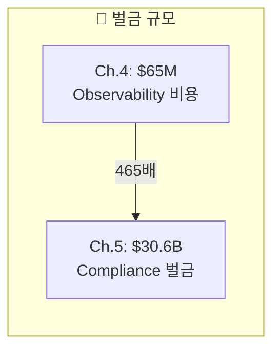
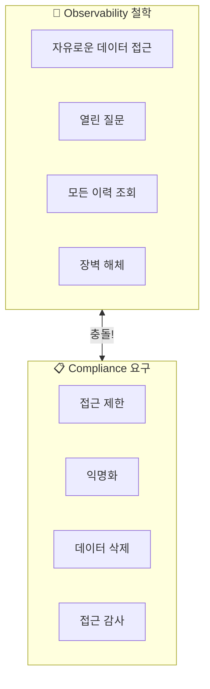
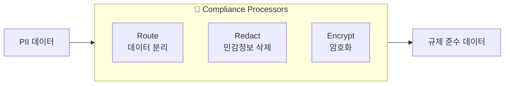
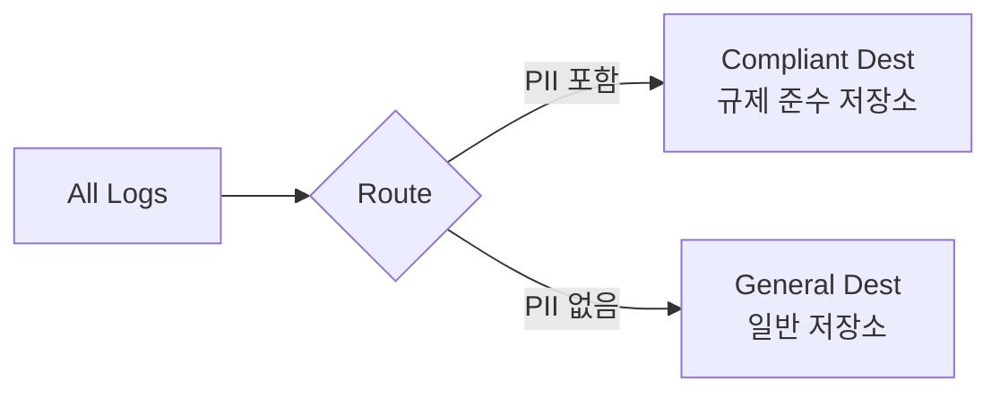
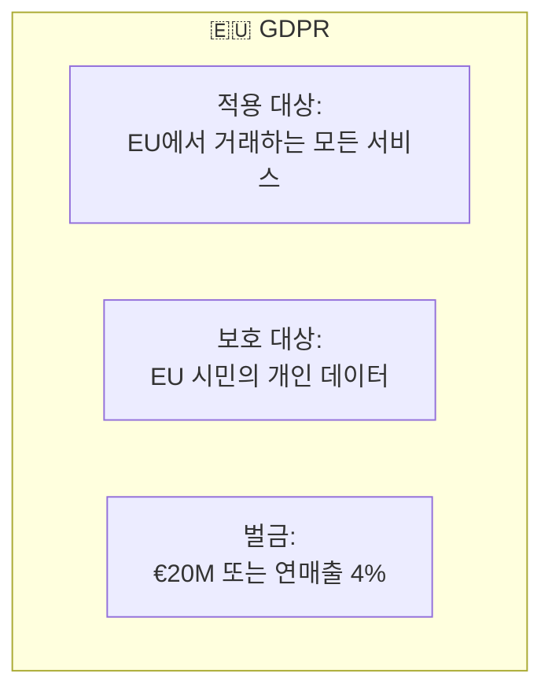
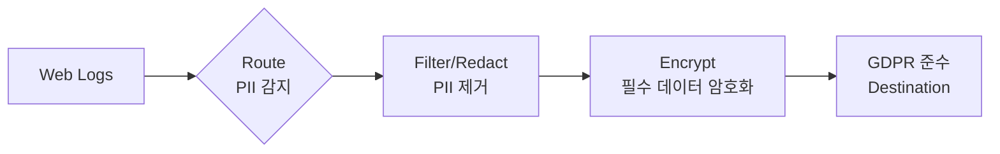
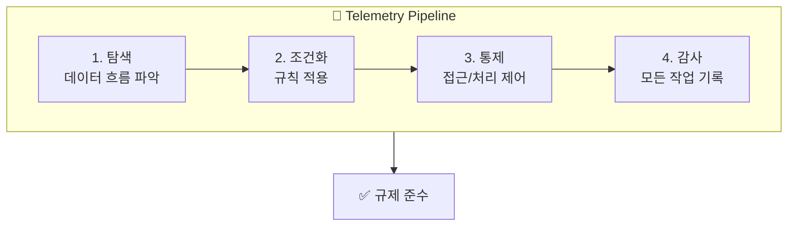
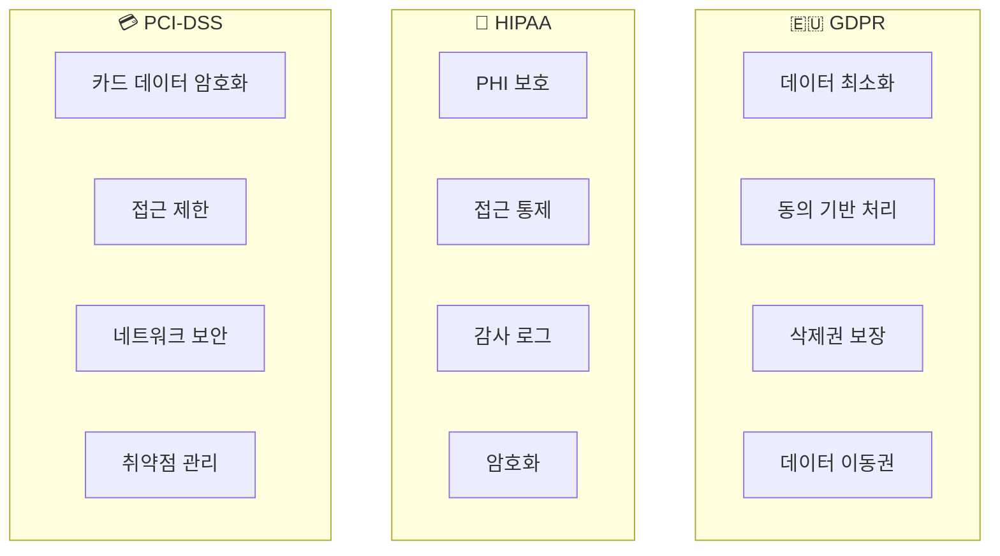
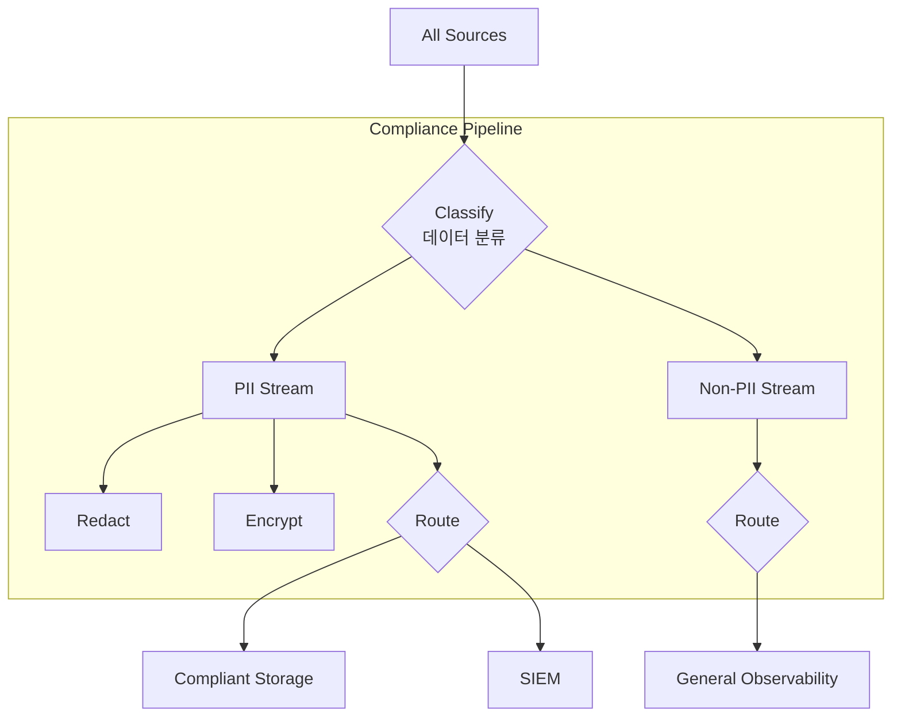

# Chapter 5. Embracing Compliance

> 📌 **핵심 요약**
>
> 컴플라이언스 위반 벌금은 **$30.6 billion**에 달할 수 있습니다. GDPR, HIPAA 등 규제는 관측성 도구의 "자유로운 데이터 접근" 철학과 충돌합니다. **Observability 도구는 규칙을 싫어하지만, 텔레메트리 파이프라인은 규칙을 사랑합니다.** Route, Redact, Encrypt 프로세서로 PII를 보호하고 규제를 준수할 수 있습니다.

---

## 🎯 학습 목표

- [ ] 컴플라이언스 위반의 비용적 영향 이해
- [ ] 주요 규제(GDPR, HIPAA, PII)의 요구사항 파악
- [ ] Observability vs Compliance의 충돌 지점 이해
- [ ] 컴플라이언스를 위한 핵심 프로세서(Route, Redact, Encrypt) 학습
- [ ] Pseudonymization(가명화)의 개념과 적용 방법 습득

---

## 📖 본문 정리

### 1. 컴플라이언스의 비용: 수십억 달러

> "Finance is about the money you make. Compliance is about the money you keep."



**실제 벌금 사례**:

| 규제 | 최대 벌금 | 적용 대상 |
|------|-----------|-----------|
| **금융 서비스** | $30.6 billion | 부정행위, 자금세탁 등 |
| **GDPR** | €20M 또는 연매출 4% | EU 시민 데이터 처리 |
| **HIPAA** | $1.5M/년 | 의료 데이터 |
| **PII 관련** | 지역별 상이 | 개인정보 처리 |

---

### 2. Observability vs Compliance: 철학적 충돌



**Observability 도구가 싫어하는 것들**:
- ❌ 특정 개인에게만 데이터 접근 허용
- ❌ 데이터 익명화 요구
- ❌ 필요시 데이터 처리/삭제
- ❌ 모든 접근에 대한 감사

> **"Observability tools hate rules, but telemetry pipelines love them."**

---

### 3. 컴플라이언스를 위한 핵심 프로세서



#### 3.1 Route Processor: 데이터 분리



**용도**: 민감 데이터와 일반 데이터를 분리하여 접근 통제

#### 3.2 Redact Processor: 민감정보 삭제

```
Before Redact:
{
  "user": "john.doe@email.com",
  "ip": "192.168.1.100",
  "action": "login"
}

After Redact:
{
  "user": "[REDACTED]",
  "ip": "[REDACTED]",
  "action": "login"
}
```

**용도**: PII를 완전히 제거하여 복구 불가능하게 처리

#### 3.3 Encrypt Processor: 암호화

```
Before Encrypt:
{
  "user": "john.doe@email.com",
  "credit_card": "1234-5678-9012-3456"
}

After Encrypt:
{
  "user": "aGVsbG8gd29ybGQ=...",
  "credit_card": "eW91IGZvdW5kIG1l..."
}
```

**용도**: 권한 있는 사용자만 복호화 가능, 저장 시 보호

---

### 4. GDPR 사례 연구

#### GDPR이란?



**핵심 포인트**:
- 유럽에 **존재하지 않아도** 적용됨
- 유럽에서 **거래만 해도** 적용됨
- EU 시민 데이터에 손대면 규제 대상

#### 일반 웹 서비스의 GDPR 위험 요소

| 로그 데이터 | GDPR 관련성 | 위험도 |
|-------------|-------------|--------|
| IP 주소 | 개인 식별 가능 | 높음 |
| 요청 URL | 사용자 행동 추적 | 중간 |
| 사용자명 | 직접적 식별정보 | 높음 |
| 사용자 전체 레코드 | 완전한 개인정보 | 매우 높음 |

#### 텔레메트리 파이프라인으로 GDPR 준수



---

### 5. Pseudonymization (가명화)

> PII를 비식별 데이터로 대체하되, 여전히 "사람"임을 인식할 수 있게 유지

#### Before vs After Pseudonymization

```
Before (원본):
{
  "name": "John Doe",
  "address": "123 Main St, Seoul",
  "credit_card": "1234-5678-9012-3456",
  "user_id": "usr_abc123"
}

After (가명화):
{
  "name": "USER_7f3d2a",
  "address": "[LOCATION_HASH_4b2c]",
  "credit_card": "[CARD_HASH_9e1f]",
  "user_id": "usr_abc123"  // 내부 ID는 유지 가능
}
```

#### Pseudonymization vs Anonymization

| 특성 | Pseudonymization | Anonymization |
|------|------------------|---------------|
| **식별 가능성** | 간접적으로 가능 | 완전 불가능 |
| **데이터 유용성** | 높음 | 낮음 |
| **복원 가능성** | 키가 있으면 가능 | 불가능 |
| **GDPR 분류** | 여전히 개인정보 | 개인정보 아님 |

---

### 6. 파이프라인 자체가 핵심이다

> "While processors are the keys to actually implementing the steps necessary to be compliant, it is the pipeline itself that is the real magic."



**파이프라인이 제공하는 것**:

| 기능 | 설명 | 컴플라이언스 가치 |
|------|------|-------------------|
| **가시성** | 데이터 흐름 파악 | 무엇이 어디로 가는지 알 수 있음 |
| **제어** | 스트림 조작 | 규칙 강제 적용 가능 |
| **감사** | 처리 기록 | 규제 기관에 증빙 가능 |
| **일관성** | 중앙 집중 처리 | 누락 없는 규칙 적용 |

---

## 🔍 심화 학습

### 규제별 핵심 요구사항



### 컴플라이언스 파이프라인 아키텍처



---

## 💡 실무 적용 포인트

### 1. PII 감지 패턴

```yaml
pii_detection_rules:
  email:
    pattern: "[a-zA-Z0-9._%+-]+@[a-zA-Z0-9.-]+\\.[a-zA-Z]{2,}"
    action: redact

  phone:
    pattern: "\\+?[0-9]{10,15}"
    action: redact

  ip_address:
    pattern: "\\b(?:[0-9]{1,3}\\.){3}[0-9]{1,3}\\b"
    action: pseudonymize

  credit_card:
    pattern: "\\b(?:[0-9]{4}[- ]?){3}[0-9]{4}\\b"
    action: encrypt

  ssn:
    pattern: "\\b[0-9]{3}-[0-9]{2}-[0-9]{4}\\b"
    action: encrypt
```

### 2. GDPR 준수 파이프라인 템플릿

```yaml
gdpr_pipeline:
  name: "GDPR Compliance Pipeline"

  processors:
    # Step 1: PII 감지 및 분류
    - classify:
        rules:
          - condition: "contains_pii(event)"
            tag: "pii"

    # Step 2: PII 처리
    - route:
        condition: "tag == 'pii'"
        processors:
          - redact:
              fields: [email, name, address]
          - encrypt:
              fields: [user_id]
              key_ref: "${ENCRYPTION_KEY}"

    # Step 3: 감사 로그 생성
    - audit_log:
        destination: compliance_audit_store
        fields: [timestamp, action, data_type]

  destinations:
    - name: compliant_storage
      type: s3
      encryption: AES-256
      retention: 7_years  # GDPR 보존 요구사항
```

### 3. 컴플라이언스 체크리스트

```
Before Production:
├─ [ ] PII 필드 식별 완료
├─ [ ] Redact/Encrypt 프로세서 설정
├─ [ ] 데이터 분류 규칙 정의
├─ [ ] 감사 로그 활성화
└─ [ ] 보존 정책 설정

Regular Audit:
├─ [ ] PII 누출 모니터링
├─ [ ] 암호화 키 로테이션
├─ [ ] 접근 로그 검토
├─ [ ] 규제 변경 사항 반영
└─ [ ] Pipeline Tap으로 데이터 검증
```

---

## ✅ 핵심 개념 체크리스트

### 컴플라이언스 비용
- [ ] 최대 $30.6 billion 벌금 가능
- [ ] GDPR: €20M 또는 연매출 4%
- [ ] 금융, 의료, 개인정보 각각 규제 존재

### Observability vs Compliance
- [ ] Observability: 자유로운 접근, 열린 질문
- [ ] Compliance: 제한된 접근, 감사, 삭제권
- [ ] "Observability tools hate rules, telemetry pipelines love them"

### 핵심 프로세서
- [ ] Route: 민감/일반 데이터 분리
- [ ] Redact: PII 완전 삭제
- [ ] Encrypt: 복호화 가능한 보호

### GDPR 대응
- [ ] EU 거래만으로도 적용됨
- [ ] IP, 사용자명, URL 모두 PII 가능
- [ ] Pseudonymization: 가명화로 유용성 유지

### 파이프라인의 가치
- [ ] 가시성 + 제어 + 감사 제공
- [ ] 중앙 집중 규칙 적용
- [ ] 규제 기관 증빙 용이

---

## 🔗 참고 자료

- [GDPR Official Text](https://gdpr.eu/)
- [HIPAA Security Rule](https://www.hhs.gov/hipaa/for-professionals/security/)
- [PCI-DSS Requirements](https://www.pcisecuritystandards.org/)
- Chapter 3: Pipeline Taps로 데이터 검증
- Chapter 4: 비용 통제와 연계된 컴플라이언스
