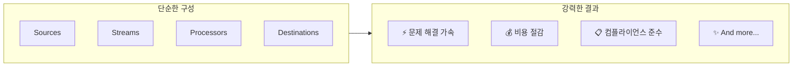
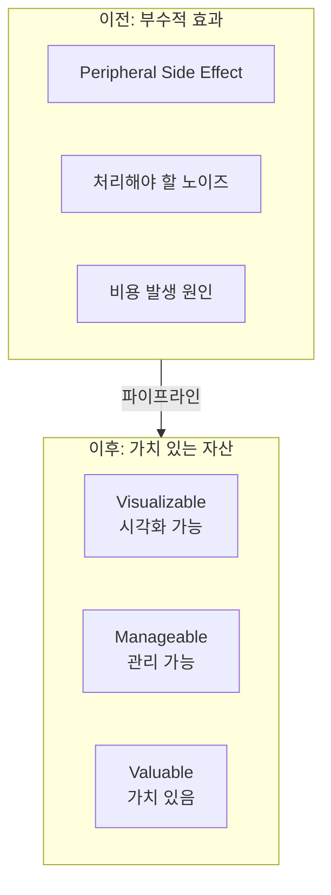
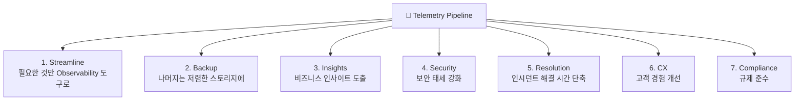
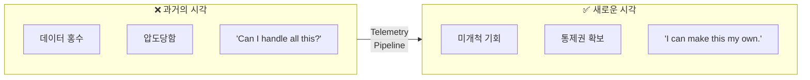
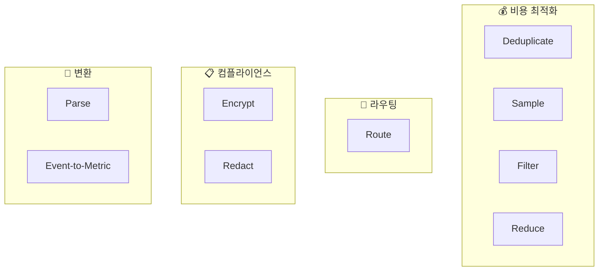

# Chapter 6. Conclusion

> 📌 **핵심 요약**
>
> 텔레메트리 파이프라인은 단순해 보이지만 **철도처럼 엄청난 힘**을 가지고 있습니다. Sources, Streams, Processors, Destinations라는 4가지 빌딩 블록만으로 문제 해결 가속화, 비용 절감, 컴플라이언스 벌금 회피까지 가능합니다. 파이프라인은 텔레메트리 데이터의 홍수를 **"감당할 수 있을까?"에서 "내 것으로 만들 수 있다"**로 바꿔줍니다.

---

## 🎯 학습 목표

- [ ] 텔레메트리 파이프라인의 핵심 가치 종합
- [ ] 4가지 빌딩 블록의 힘 재확인
- [ ] 텔레메트리 데이터를 자산으로 보는 관점 전환
- [ ] 파이프라인이 제공하는 비즈니스 가치 정리

---

## 📖 본문 정리

### 1. 단순함 속의 힘

> "Railroad iron is a magician's rod in its power to evoke the sleeping energies of land and water."
> — Ralph Waldo Emerson



**핵심 통찰**: 철도가 땅과 물의 잠든 에너지를 깨우듯, 텔레메트리 파이프라인은 데이터의 숨겨진 가치를 깨웁니다.

---

### 2. 텔레메트리 데이터의 관점 전환



**데이터 유형**:
- Metrics
- Traces
- Logs
- Events (Alerts 포함)

---

### 3. 파이프라인이 가능하게 하는 것들



---

### 4. 마인드셋 전환



> **"Telemetry pipelines put you in control of your telemetry. Use that power wisely."**

---

## 🔍 전체 책 요약

### 챕터별 핵심 내용

| Chapter | 제목 | 핵심 메시지 |
|---------|------|-------------|
| **Ch.1** | The Need for Telemetry Pipelines | 데이터 홍수 → 정유소처럼 정제 필요 |
| **Ch.2** | The Domain Language | Sources, Streams, Processors, Destinations |
| **Ch.3** | Managing Your Pipelines | Ingress/Egress 메트릭, Pipeline Taps |
| **Ch.4** | Containing the Cost | Dedupe, Route, Sample, Filter, Archive 전략 |
| **Ch.5** | Embracing Compliance | Route, Redact, Encrypt로 GDPR/HIPAA 준수 |
| **Ch.6** | Conclusion | 홍수 → 기회, 통제권 확보 |

### 핵심 프로세서 총정리



---

## 💡 실무 적용 포인트

### 텔레메트리 파이프라인 도입 체크리스트

```yaml
phase_1_assessment:
  - [ ] 현재 텔레메트리 데이터 볼륨 파악
  - [ ] 비용 구조 분석 (Observability 도구별)
  - [ ] 컴플라이언스 요구사항 식별
  - [ ] 데이터 중복률 측정

phase_2_design:
  - [ ] Sources 정의 (어디서 데이터를 가져올 것인가)
  - [ ] Destinations 정의 (어디로 보낼 것인가)
  - [ ] 필요한 Processors 선정
  - [ ] Archive 전략 수립 (S3 등)

phase_3_implementation:
  - [ ] 파이프라인 구축
  - [ ] Pipeline Taps로 검증
  - [ ] Ingress/Egress 메트릭 모니터링
  - [ ] 비용 절감 효과 측정

phase_4_optimization:
  - [ ] 샘플링 비율 조정
  - [ ] 필터 규칙 최적화
  - [ ] 컴플라이언스 감사 대응
  - [ ] 지속적 개선
```

### 성공 지표

| 지표 | 측정 방법 | 목표 |
|------|-----------|------|
| **비용 절감** | Observability 도구 청구서 | 20-50% 감소 |
| **데이터 품질** | 중복률, 노이즈 비율 | Dedupe로 30%+ 감소 |
| **컴플라이언스** | PII 노출 건수 | 0건 |
| **인시던트 해결** | MTTR | 개선 |
| **가시성** | 커버리지 | 증가 |

---

## ✅ 전체 핵심 개념 체크리스트

### 기본 개념
- [ ] 텔레메트리 데이터는 홍수처럼 쏟아진다
- [ ] 파이프라인 = 정유소 (원유 → 정제된 제품)
- [ ] 4가지 빌딩 블록: Sources, Streams, Processors, Destinations

### 관리 & 디버깅
- [ ] Ingress/Egress 볼륨 모니터링
- [ ] Pipeline Taps (Wire Tap 패턴)
- [ ] Before/After 배치로 검증

### 비용 최적화
- [ ] Deduplicate 먼저 (데이터 손실 없음)
- [ ] Route로 선택적 전송
- [ ] Archive 후 Sample (Get-out-of-jail-free card)
- [ ] Log to Metric 변환

### 컴플라이언스
- [ ] Route: 데이터 분리
- [ ] Redact: PII 삭제
- [ ] Encrypt: 암호화
- [ ] Pseudonymization: 가명화

### 마인드셋
- [ ] "Can I handle all this?" → "I can make this my own."
- [ ] 부수적 효과 → 가치 있는 자산
- [ ] 홍수 → 미개척 기회

---

## 🔗 참고 자료

- [Mezmo Documentation](https://docs.mezmo.com) - 텔레메트리 파이프라인 도구
- [OpenTelemetry Collector](https://opentelemetry.io/docs/collector/) - 오픈소스 파이프라인
- [Vector by Datadog](https://vector.dev/) - 고성능 파이프라인
- [Fluent Bit](https://fluentbit.io/) - 경량 파이프라인

---

## 📚 책 완독 요약

```
The Fundamentals of Telemetry Pipelines, Revised Edition

핵심 메시지:
"텔레메트리 파이프라인은 데이터 홍수를 통제 가능한 가치로 바꾼다"

4가지 빌딩 블록:
Sources → Streams → Processors → Destinations

3대 가치:
1. 💰 비용 절감 (Dedupe, Sample, Filter, Archive)
2. 📋 컴플라이언스 (Route, Redact, Encrypt)
3. 🔍 가시성 & 제어 (Taps, Metrics, Audit)

최종 마인드셋:
"Can I handle all this?" → "I can make this my own."
```
