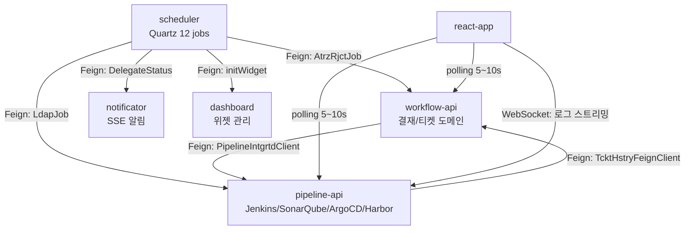
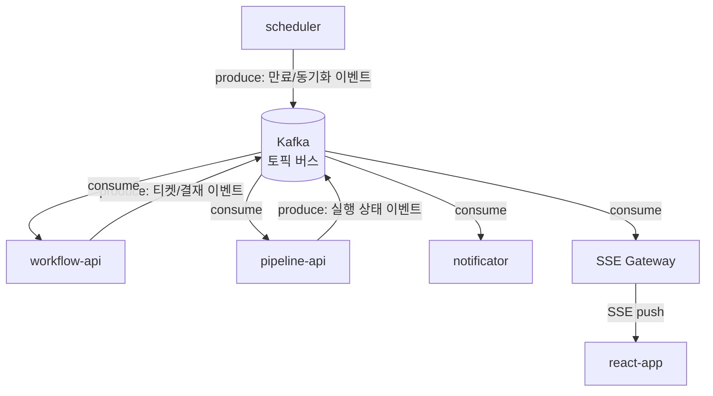

# TPS EDA 전환 개요

TPS는 현재 Feign 기반 동기 호출로 모듈 간 통신한다. 이 문서는 현재 아키텍처의 구조적 문제를 분석하고, Kafka 기반 EDA로 전환할 때의 모듈별 역할 변화와 설계 지침을 정리한다.

---

## 1. 현재 아키텍처: 동기 호출 맵

현재 TPS는 scheduler → workflow-api → pipeline-api로 이어지는 체인 형태의 동기 호출 구조를 갖고 있다. 각 모듈이 다른 모듈을 직접 알고 있어야 하기 때문에, 특정 모듈에서 지연이 발생하면 호출 체인 전체가 블로킹된다.



### 모듈별 현재 역할

**workflow-api**는 결재와 티켓 도메인의 핵심 모듈이다. 티켓 상태가 변경될 때 `PipelineIntgrtdClient`를 통해 pipeline-api를 직접 호출하며, 인-프로세스 이벤트는 `@TransactionalEventListener`로 처리한다. 문제는 pipeline-api 호출이 실패하면 티켓 상태 변경도 함께 롤백된다는 것이다. 두 관심사가 하나의 트랜잭션에 묶여 있어 장애 격리가 불가능하다.

**pipeline-api**는 Jenkins, SonarQube, ArgoCD, Harbor 네 개 외부 시스템을 통합한다. 파이프라인 실행 결과를 기록하기 위해 `TcktHstryFeignClient`로 workflow-api를 역방향 호출하는 구조다. workflow-api → pipeline-api → workflow-api의 순환 의존이 형성되어 있으며, 10개 단계가 모두 동기로 연결된 오케스트레이션이라 부분 실패 시 복구 경로가 없다.

**scheduler**는 Quartz 기반 12개 배치 잡을 실행한다. 잡 하나가 workflow-api, pipeline-api, notificator, dashboard 네 개 모듈로 Feign 호출을 보낸다. 이 중 하나가 내려가 있으면 해당 배치 잡 전체가 실패하며, 부분 성공 이후 재시도 로직이 없어 데이터 정합성 문제가 생길 수 있다.

**react-app**은 5~10초 폴링으로 파이프라인 상태를 갱신하고 WebSocket으로 로그를 스트리밍한다. 단일 사용자 액션에 6개 이상의 React Query key가 연쇄 무효화되어 불필요한 서버 요청이 발생한다.

---

## 2. EDA 전환 후 아키텍처

전환 후에는 모듈이 서로를 직접 호출하는 대신 Kafka 토픽을 매개로 이벤트를 주고받는다. 발신자는 수신자가 누구인지 알 필요가 없고, 수신자는 자신의 처리 속도에 맞춰 이벤트를 소비한다. 이 구조 변화가 장애 격리와 독립 배포의 기반이 된다.



react-app이 직접 폴링하는 대신 SSE Gateway가 Kafka에서 상태 이벤트를 소비하여 클라이언트에 푸시한다. 클라이언트는 연결을 유지하기만 하면 되므로 폴링 주기로 인한 최대 10초 지연이 사라지고, 불필요한 서버 부하도 줄어든다.

---

## 3. 모듈별 역할 변화 요약

| 모듈 | 현재 역할 | 전환 후 역할 |
|------|----------|------------|
| workflow-api | Feign으로 pipeline-api 직접 호출 | 이벤트 퍼블리셔(티켓/결재) + 컨슈머(파이프라인 결과) |
| pipeline-api | Feign으로 workflow-api 역방향 호출 | 이벤트 컨슈머(티켓) + 퍼블리셔(실행 상태) |
| scheduler | Feign으로 workflow/pipeline/notificator 직접 호출 | 이벤트 퍼블리셔(만료/동기화 감지) — Feign 전부 제거 |
| react-app | 5~10초 폴링 + WebSocket | SSE 기반 실시간 푸시 (백엔드가 Kafka consume → SSE 전달) |

---

## 4. 권장 Kafka 토픽 설계

토픽은 도메인 경계 단위로 분리한다. 하나의 토픽에 여러 이벤트 타입을 혼재시키면 컨슈머 필터링 비용이 생기고 파티션 키 전략이 복잡해지기 때문이다.

```
tps.workflow.approval          # 결재 라이프사이클 (요청/승인/반려/만료)
tps.workflow.ticket            # 티켓 라이프사이클 (생성/삭제/완료/리셋)
tps.pipeline.execution         # 파이프라인/트리거 실행 상태
tps.pipeline.integration       # 티켓-파이프라인 통합 이벤트
tps.user.sync                  # LDAP 동기화, 사용자 생성/삭제
tps.notification               # 알림 요청 (SSE, 이메일 등)
tps.audit                      # 감사 로그 통합
tps.system.config              # 공통코드 갱신 등 시스템 설정
```

### 토픽별 운영 기준

**tps.workflow.approval**
- 파티션 키: `atrzId` (결재 ID). 동일 결재의 요청→승인→반려 순서가 보장되어야 한다.
- 예상 처리량: 낮음 (업무 시간 기준 분당 수십 건). 파티션 3개로 시작.
- 보존 기간: 90일. 감사 요건상 최소 30일, 재처리 여유를 고려해 90일 권장.

**tps.workflow.ticket**
- 파티션 키: `tcktNo` (티켓 번호). 동일 티켓의 생성→완료→삭제 순서가 컨슈머에서 중요하다.
- 예상 처리량: 중간. 파티션 6개.
- 보존 기간: 30일. 완료된 티켓은 이미 DB에 영구 저장되므로 메시지 보존 기간은 재처리 목적으로만 유지한다.

**tps.pipeline.execution**
- 파티션 키: `pplnNo` (파이프라인 번호). 동일 파이프라인의 단계별 상태 순서 보장.
- 예상 처리량: 높음 (Jenkins 빌드 상태는 수초 단위 발행). 파티션 12개.
- 보존 기간: 7일. 실시간 상태 전달 목적이므로 장기 보존 불필요.

**tps.user.sync**
- 파티션 키: `userId`. 동일 사용자의 생성→삭제 순서 오역 방지.
- 예상 처리량: 낮음. 파티션 3개.
- 보존 기간: 30일. LDAP 동기화 실패 시 재처리를 위한 여유 기간.

**tps.notification, tps.audit, tps.system.config**
- 알림과 감사는 순서 의존성이 낮아 파티션 키 선택이 자유롭다. 알림은 `userId`, 감사는 `resourceId` 사용.
- 보존 기간: 알림 7일, 감사 1년 (법적 요건 가능성 고려), 시스템 설정 30일.

---

## 5. Feign 제거 대상 9개 매핑

현재 TPS에서 Feign으로 연결된 9개 호출이 EDA 전환의 직접 대상이다. 각 호출을 이벤트로 대체하면 호출 체인이 끊기고, 수신 모듈의 장애가 발신 모듈로 전파되지 않는다.

| # | 현재 Feign 호출 | 발신 모듈 | 수신 모듈 | 대체 이벤트 | 토픽 |
|---|----------------|----------|----------|-----------|------|
| 1 | PipelineIntgrtdClient.createTicket() | workflow-api | pipeline-api | TicketCreatedEvent | tps.workflow.ticket |
| 2 | PipelineIntgrtdClient.completeTicket() | workflow-api | pipeline-api | TicketCompletedEvent | tps.workflow.ticket |
| 3 | PipelineIntgrtdClient.removeTicket() | workflow-api | pipeline-api | TicketDeletedEvent | tps.workflow.ticket |
| 4 | PipelineIntgrtdClient.resetTicket() | workflow-api | pipeline-api | TicketResetEvent | tps.workflow.ticket |
| 5 | TcktHstryFeignClient | pipeline-api | workflow-api | PipelineTicketHistoryEvent | tps.pipeline.integration |
| 6 | WorkflowApiFeignClient.tcktAprvEnd() | scheduler | workflow-api | ApprovalExpiredEvent | tps.workflow.approval |
| 7 | PipelineFeignClient.deleteGitLabUser() | scheduler | pipeline-api | UserDeletedEvent | tps.user.sync |
| 8 | MainDashboardFeignClient.initWidget() | scheduler | dashboard | UserCreatedEvent | tps.user.sync |
| 9 | NotificatorFeignClient.sendSSE() | scheduler | notificator | DelegationStartedEvent | tps.notification |

#1~#4는 workflow-api와 pipeline-api의 순환 의존을 해소하는 핵심 교체다. #5는 역방향 호출을 제거하므로 #1~#4와 함께 구현해야 순환 의존이 완전히 사라진다. #6~#9는 scheduler의 Feign 의존을 전부 없애 scheduler가 순수한 트리거 역할만 담당하게 만든다.

---

## 6. 공통 고려사항

### 6.1 Outbox 패턴

DB 트랜잭션과 이벤트 발행의 원자성을 보장해야 한다. 예를 들어 티켓 생성 DB commit은 성공했는데 Kafka produce가 실패하면, pipeline-api는 티켓 생성 사실을 영영 알 수 없다.

현재 workflow-api에는 `@TransactionalEventListener`가 이미 존재한다. 이것이 인-프로세스 이벤트를 트랜잭션 커밋 후 처리하는 패턴이므로, Outbox 테이블을 추가하거나 Kafka Transactional Producer를 사용하는 방향으로 자연스럽게 확장할 수 있다.

```
[DB 트랜잭션]
  INSERT INTO tickets ...
  INSERT INTO outbox_events (payload, topic, status='PENDING') ...
[커밋 완료]
  → CDC 또는 별도 릴레이가 outbox_events를 읽어 Kafka produce
  → produce 성공 시 status='PUBLISHED'로 갱신
```

### 6.2 멱등성

네트워크 재시도나 Kafka at-least-once 보장으로 인해 컨슈머는 같은 이벤트를 두 번 받을 수 있다. 모든 컨슈머는 `(correlationId, eventType)` 복합 키로 중복 처리를 방어해야 한다. `correlationId`만으로는 티켓 생성과 티켓 완료 이벤트를 구분할 수 없기 때문에 복합 키가 필요하다.

Redpanda Spring Boot PoC에서 검증한 preemptive acquire 패턴이 그대로 적용 가능하다.

```sql
-- INSERT...WHERE NOT EXISTS 네이티브 쿼리로 예외 없이 중복 방어
INSERT INTO processed_events (correlation_id, event_type, processed_at)
SELECT :correlationId, :eventType, NOW()
WHERE NOT EXISTS (
  SELECT 1 FROM processed_events
  WHERE correlation_id = :correlationId AND event_type = :eventType
)
```

### 6.3 순서 보장

동일 티켓이나 결재에 대한 이벤트는 반드시 같은 파티션으로 라우팅되어야 한다. Kafka는 파티션 내에서만 순서를 보장하기 때문이다. 발행 시 메시지 키를 `tcktNo` 또는 `atrzId`로 설정하면 동일 엔티티의 이벤트가 항상 같은 파티션으로 향한다.

파이프라인 실행 상태는 `pplnNo` 기반 파티셔닝을 사용한다. 동일 파이프라인의 단계별 상태(PENDING→RUNNING→SUCCESS)가 순서 역전 없이 전달되어야 프론트엔드에서 올바른 상태를 표시할 수 있다.

### 6.4 DLQ (Dead Letter Queue)

GitLab 사용자 삭제나 외부 웹훅 콜백처럼 외부 시스템에 의존하는 컨슈머는 일시 장애 시 재시도가 필요하다. 재시도를 소진한 후에도 실패하면 DLQ로 이동시켜 수동 처리 대기 상태로 만든다.

```
재시도 전략: 지수 백오프 3회 (1s → 2s → 4s)
→ 소진 시 DLQ 토픽으로 이동 (tps.*.dlq)
→ 운영팀 알림 + 수동 재처리 인터페이스
```

Spring Kafka의 `@RetryableTopic`을 사용하면 재시도 토픽과 DLQ 설정을 선언적으로 구성할 수 있다. 단, Spring Kafka 3.1 이상에서만 `@SendTo`와의 조합이 안정적이다.

### 6.5 SAGA 패턴

**티켓 생성 → 파이프라인 통합** 흐름은 Choreography SAGA가 적합하다. 참여 서비스가 workflow-api와 pipeline-api 두 개뿐이고, 각 서비스가 이벤트를 받아 자율적으로 보상 트랜잭션을 실행할 수 있기 때문이다. 중앙 오케스트레이터가 없어 서비스 간 결합도가 낮다는 장점도 있다.

**결재 라이프사이클**은 Orchestrator SAGA를 고려할 만하다. 결재 요청→승인→알림→감사 기록의 6단계 흐름에서 단계별 보상 순서가 중요하고, 전체 진행 상태를 한 곳에서 추적해야 하는 운영 요건이 있기 때문이다.

---

## 7. 전환 우선순위

우선순위는 현재 아키텍처에서 발생하는 실제 장애 빈도와 비즈니스 영향도를 기준으로 정했다.

| 우선순위 | 후보 | 핵심 이유 | 상세 문서 |
|---------|------|----------|----------|
| HIGH | H1. 결재 라이프사이클 | 웹훅 콜백 블로킹으로 결재 요청이 큐에 적체됨, 1분 폴링 지연이 사용자에게 직접 노출 | 02-approval-workflow-eda.md |
| HIGH | H2. 티켓↔파이프라인 통합 | 양방향 동기 결합이 장애 전파의 주요 경로, pipeline-api 재배포 시 workflow-api도 영향받음 | 03-ticket-pipeline-integration-eda.md |
| HIGH | H3. 파이프라인 실행 상태 | 10단계 동기 오케스트레이션이 전체 배포 파이프라인의 SPOF, 5초 폴링이 서버 부하의 상당 부분 차지 | 04-pipeline-execution-eda.md |
| HIGH | H4. LDAP 사용자 동기화 | 배치 잡 하나가 4개 모듈을 직렬 호출하므로 부분 실패 시 재처리 범위 파악이 어려움 | 05-ldap-user-sync-eda.md |
| MEDIUM | M1. 알림 발송 | notificator 장애가 scheduler 잡 실패로 전파되는 문제 해소가 목적 | 06-medium-priority-candidates.md |
| MEDIUM | M2. 위임 이벤트 | DelegationStartedEvent는 알림 토픽으로 자연스럽게 흡수 가능 | 06-medium-priority-candidates.md |
| MEDIUM | M3. 감사 로그 | `@TransactionalEventListener` 기반 인-프로세스 처리를 Kafka로 외부화하면 감사 서비스 독립 가능 | 06-medium-priority-candidates.md |
| MEDIUM | M4. 티켓 만료 감지 | scheduler AtrzRjctJob의 단순 이벤트화, 비즈니스 로직 변경 없음 | 06-medium-priority-candidates.md |
| MEDIUM | M5. 공통코드 갱신 | tps.system.config 토픽으로 구독하면 각 모듈이 캐시 무효화를 자율적으로 처리 | 06-medium-priority-candidates.md |

H1~H4는 서로 의존 관계가 있다. H2(티켓↔파이프라인)를 구현하려면 H3(파이프라인 실행 상태) 토픽이 먼저 정의되어야 하고, H1(결재)은 H2의 티켓 토픽을 공유한다. 따라서 구현 순서는 H3 → H2 → H1 → H4가 자연스럽다.

---

## 참고

- Redpanda Spring Boot PoC 멱등성 패턴: `runners-high/poc/08_MessageQueue/red-panda/project/redpanda-spring-boot/`
- TPS ApiResponse 패턴: `.claude/skills/tps/backend/tps_architecture/references/api-response-pattern.md`
- EDA 설계 원칙: `runners-high/poc/02_Architecture/01-event-driven/`
