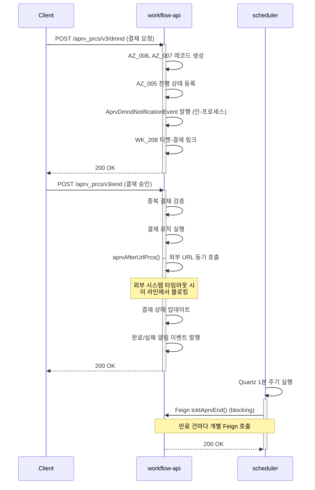
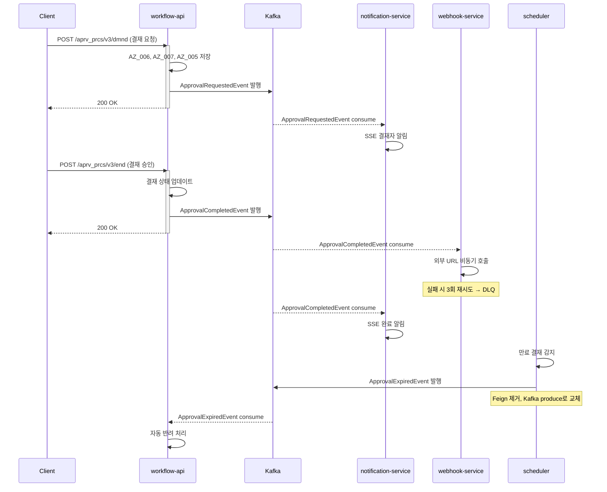

# 결재 라이프사이클 EDA 전환

TPS 결재 프로세스는 현재 동기 호출과 인-프로세스 이벤트에 의존한다. 이 문서는 웹훅 블로킹, 폴링 지연, 알림 결합도라는 세 가지 구조적 병목을 EDA로 해소하는 방법을 정리한다.

---

## 1. 현재 동기 흐름

### 1.1 결재 요청 (aprvDmnd)

**코드 경로**: `workflow-api/.../approval/impl/AprvPrcsCommandServiceImpl.java` (L87-150)

결재 요청은 다음 순서로 처리된다.

1. 결재 실행 레코드를 생성한다 (AZ_006, AZ_007).
2. 결재 진행 상태를 등록한다 (AZ_005).
3. 인-프로세스 Spring Event인 `AprvDmndNotificationEvent`를 발행한다.
4. 티켓-결재 링크를 생성한다 (WK_208).
5. `ArtzExcnHstryEvent`로 이력을 기록한다.

알림 이벤트가 `@TransactionalEventListener`로 구독되므로 알림 발송 실패가 결재 요청 트랜잭션에 영향을 줄 수 있다. 결재와 알림이 같은 스레드에서 순차 실행되기 때문이다.

### 1.2 결재 승인/반려 (aprvEnd)

**코드 경로**: `workflow-api/.../approval/impl/AprvPrcsCommandServiceImpl.java` (L457-486)

승인/반려 처리에서 가장 큰 병목은 동기 웹훅 호출이다.

1. 중복 결재 여부를 검증한다.
2. 결재 로직을 실행한다.
3. **`AtrzPrcsPolicy.aprvAfterUrlPrcs()`를 동기 호출한다** (L50+).
   - AZ_007에서 승인 후 콜백 URL을 조회한다.
   - HTTP 헤더와 메서드를 파싱한다.
   - multipart 요청이면 Minio에서 파일을 다운로드한다.
   - **외부 URL로 동기 WebClient를 호출한다** ← 여기서 블로킹이 발생한다.
4. 결재 상태를 업데이트한다.
5. 완료/실패 알림 이벤트를 발행한다.
6. 감사 이벤트를 발행한다.

외부 시스템의 응답 지연이나 타임아웃이 결재 프로세스 전체를 블로킹한다는 점이 핵심 문제다. 웹훅 콜백은 결재 결과를 외부 시스템에 통보하는 부가 작업인데, 이 작업이 결재의 주 흐름과 같은 스레드에 묶여 있다.

### 1.3 결재 만료 자동 반려

**코드 경로**: `scheduler/.../quartz/job/AtrzRjctJob.java`, `scheduler/.../approval/service/ApprovalCancelService.java`

Quartz 스케줄러가 만료된 결재를 자동 반려하는 방식으로 동작한다.

1. Quartz가 매 1분마다 `AtrzRjctJob`을 실행한다.
2. `TbTpsAz006` 테이블에서 만료된 결재 건을 조회한다.
3. 각 만료 건마다 blocking Feign으로 `WorkflowApiFeignClient.tcktAprvEnd()`를 호출한다 (→ `/workflow/api/aprv_prcs/v3/end/tckt`).
4. 개별 try-catch로 오류를 처리하며, 배치 수준의 재시도 로직은 없다.

만료 감지 지연이 최대 59초에 달할 수 있고, 만료 건이 없어도 1분마다 DB를 조회한다는 점이 비효율적이다.

### 1.4 알림 처리

**코드 경로**: `workflow-api/.../event/notification/ApvrNotificationEventListener.java`

4개의 핸들러가 모두 `@TransactionalEventListener`로 등록되어 있다.

| 핸들러 | 라인 | 역할 |
|--------|------|------|
| `handleAprvDmndNotification()` | L57-98 | 결재 요청 알림 |
| `handleAprvPrcsNotification()` | L105-152 | 결재 진행 알림 |
| `handleAprvEndNotification()` | L159-190 | 결재 완료 알림 |
| `handleAprvFailNotification()` | L197-227 | 결재 실패 알림 |

`@TransactionalEventListener`는 트랜잭션 커밋 후에 실행되므로 결재 상태 변경과의 원자성은 보장된다. 그러나 알림 처리 실패가 재시도 없이 소멸한다는 문제가 있다.

### 현재 흐름 문제점 정리

**문제 1. 웹훅 콜백 블로킹**
`aprvAfterUrlPrcs()`에서 외부 URL 타임아웃이 발생하면 결재 승인 트랜잭션 전체가 블로킹된다. 콜백 실패가 결재 실패로 이어지는 불필요한 결합이다.

**문제 2. 1분 폴링 비효율**
만료 시각이 지났음에도 최대 59초를 기다려야 자동 반려가 실행된다. 만료 건이 없는 경우에도 DB 조회가 반복된다.

**문제 3. 알림 동기 의존**
알림 핸들러가 같은 트랜잭션 스레드에서 실행되므로 알림 서비스 장애가 결재 프로세스에 영향을 준다.



---

## 2. EDA 전환 후 흐름

EDA 전환의 핵심 원칙은 하나다. 결재의 주 흐름(상태 변경)과 부가 작업(웹훅 콜백, 알림, 감사 로그)을 분리한다. 분리 후 각 부가 작업은 독립적으로 실패하고, 독립적으로 재시도할 수 있다.

### 2.1 이벤트 기반 결재 요청

1. 결재 요청 정보를 DB에 저장하고 `ApprovalRequestedEvent`를 Kafka에 발행한다.
2. 알림 서비스가 독립적으로 이벤트를 consume하여 SSE로 결재자에게 전달한다.
3. 감사 서비스가 독립적으로 이벤트를 consume하여 감사 로그를 저장한다.

workflow-api는 DB 저장과 Kafka 발행만 처리하면 된다. 알림 발송 실패가 결재 요청에 영향을 주지 않는다.

### 2.2 이벤트 기반 결재 승인/반려

1. 결재 승인/반려 결과를 DB에 저장하고 `ApprovalCompletedEvent` 또는 `ApprovalRejectedEvent`를 발행한다.
2. **웹훅 콜백 서비스**가 이벤트를 consume하여 외부 URL을 비동기로 호출한다. 실패하면 3회 재시도 후 DLQ로 이동한다.
3. 알림 서비스가 이벤트를 consume하여 SSE로 관련자에게 전달한다.
4. 대시보드 서비스가 이벤트를 consume하여 myTodo 목록을 갱신한다.

웹훅 콜백 실패가 더 이상 결재 상태 변경에 영향을 주지 않는다. 콜백 재처리는 DLQ에서 별도로 관리된다.

### 2.3 이벤트 기반 만료 처리

1. scheduler가 만료된 결재를 감지하면 Feign 대신 `ApprovalExpiredEvent`를 Kafka에 발행한다.
2. workflow-api가 이벤트를 consume하여 자동 반려 처리를 실행한다.

Feign 동기 호출을 제거하므로 scheduler와 workflow-api 사이의 결합이 사라진다. workflow-api가 일시적으로 다운되어도 Kafka에 이벤트가 보존되므로 재기동 후 처리된다.



---

## 3. 이벤트 스키마 정의

이벤트 스키마 설계에서 세 가지 원칙을 따른다. 첫째, 모든 이벤트는 `correlationId`로 티켓 번호를 포함하여 전체 결재 흐름을 추적할 수 있게 한다. 둘째, `eventId`는 UUID로 생성하여 멱등성 체크에 사용한다. 셋째, `payload`는 consumer가 추가 DB 조회 없이 처리할 수 있을 만큼의 정보를 포함한다.

### ApprovalRequestedEvent

```json
{
  "eventId": "uuid",
  "eventType": "APPROVAL_REQUESTED",
  "timestamp": "2026-02-25T10:00:00Z",
  "correlationId": "tckt-12345",
  "payload": {
    "atrzExcnId": "AZ006-001",
    "atrzId": "AZ-001",
    "tcktNo": "TCKT-12345",
    "requesterId": "user-001",
    "approvers": ["user-002", "user-003"],
    "approvalType": "SEQUENTIAL",
    "expiresAt": "2026-02-28T10:00:00Z"
  }
}
```

`approvers` 목록을 payload에 포함하는 이유는 알림 서비스가 별도 DB 조회 없이 수신자 목록을 즉시 파악하기 위해서다. `approvalType`은 SEQUENTIAL(순차)과 PARALLEL(병렬)을 구분한다.

### ApprovalCompletedEvent / ApprovalRejectedEvent

```json
{
  "eventId": "uuid",
  "eventType": "APPROVAL_COMPLETED",
  "timestamp": "2026-02-25T11:00:00Z",
  "correlationId": "tckt-12345",
  "payload": {
    "atrzExcnId": "AZ006-001",
    "atrzId": "AZ-001",
    "tcktNo": "TCKT-12345",
    "approverId": "user-002",
    "result": "APPROVED",
    "callbackUrls": [
      {
        "url": "https://external/api/callback",
        "method": "POST",
        "headers": {"Authorization": "Bearer ${token}", "Content-Type": "application/json"}
      }
    ]
  }
}
```

`callbackUrls`를 이벤트 payload에 포함하는 것이 핵심 설계 결정이다. 웹훅 서비스가 콜백 URL 정보를 이 이벤트에서 직접 읽어 처리하므로 workflow-api에 다시 조회할 필요가 없다. `APPROVAL_REJECTED` 이벤트도 동일한 구조를 사용하며 `result` 필드 값만 다르다.

### ApprovalExpiredEvent

```json
{
  "eventId": "uuid",
  "eventType": "APPROVAL_EXPIRED",
  "timestamp": "2026-02-25T10:01:00Z",
  "correlationId": "tckt-12345",
  "payload": {
    "atrzExcnId": "AZ006-001",
    "atrzId": "AZ-001",
    "tcktNo": "TCKT-12345",
    "expiredAt": "2026-02-25T10:00:00Z"
  }
}
```

`expiredAt`은 실제 만료 시각이고 `timestamp`는 이벤트 발행 시각이다. 두 값이 다를 수 있는 이유는 scheduler가 1분 주기로 실행되므로 만료 감지에 최대 59초 지연이 발생하기 때문이다. 이 필드를 분리하면 감사 로그에서 실제 만료 시각을 정확히 추적할 수 있다.

---

## 4. 고려사항

### 4.1 웹훅 콜백 비동기화

**현재**: `aprvEnd()` 내에서 동기 WebClient로 외부 URL을 호출한다. 외부 시스템이 응답하지 않으면 결재 트랜잭션 전체가 블로킹된다.

**전환 후**: `ApprovalCompletedEvent`를 consume한 웹훅 서비스가 외부 URL을 비동기로 호출한다. 결재 처리와 콜백 전달이 완전히 분리된다.

실패 처리 흐름은 다음과 같다.

1. 웹훅 서비스가 외부 URL 호출에 실패하면 지수 백오프(1초 → 2초 → 4초)로 3회 재시도한다.
2. 3회 실패 후 `tps.workflow.approval.dlq` 토픽으로 메시지를 이동한다.
3. 수동 처리 대시보드에서 DLQ 메시지를 확인하고 재발행한다.
4. 콜백 성공/실패 결과를 `tps.audit` 토픽으로 발행하여 추적성을 보장한다.

이 구조에서 웹훅 콜백 실패는 결재 상태에 영향을 주지 않는다. 결재는 이미 완료된 상태이고, 콜백은 독립적으로 재처리될 수 있다.

### 4.2 만료 폴링 제거

현재 Quartz 1분 폴링 방식의 문제는 만료 감지 지연(최대 59초)과 불필요한 DB 조회다.

전환 방법 두 가지를 비교한다.

**방법 A. Kafka delayed message 활용**
결재 요청 시점에 만료 시각에 맞춘 delayed event를 Kafka에 발행한다. Redpanda는 현재 delayed message를 네이티브로 지원하지 않으므로, 별도 delay queue 서비스나 Redis를 활용해야 한다. 구현 복잡도가 높지만 폴링이 완전히 사라진다.

**방법 B. scheduler 유지 + Feign → Kafka 교체 (권장)**
Quartz 스케줄러는 그대로 유지하되, 만료 감지 후 Feign 호출 대신 Kafka에 `ApprovalExpiredEvent`를 발행한다. scheduler와 workflow-api 사이의 동기 결합만 제거하는 점진적 전환이다.

권장 전략은 B로 시작하여 A로 최종 전환하는 것이다. B는 기존 Quartz 설정을 재사용하므로 전환 위험이 낮다. 안정화 후 A로 전환하면 폴링 자체를 제거할 수 있다.

### 4.3 DLQ 전략

DLQ 토픽명: `tps.workflow.approval.dlq`

DLQ 사용 시나리오는 다음과 같다.

- 웹훅 콜백 3회 재시도 실패
- 알림 서비스 연결 불가로 SSE 전달 실패
- 이벤트 역직렬화 실패 (스키마 호환성 위반)

DLQ 메시지 구조에 `originalTopic`, `failureReason`, `retryCount`, `lastAttemptAt` 필드를 포함하면 수동 처리 시 원인을 빠르게 파악할 수 있다.

재처리 API를 만들어 DLQ 메시지를 원래 토픽으로 재발행하는 Admin 기능을 제공해야 한다. 영구 실패로 판단된 메시지는 `tps.workflow.approval.deadletter`로 이동하여 추적 기록을 보존한다.

### 4.4 Outbox 패턴 적용

결재 상태 변경과 Kafka 이벤트 발행을 원자적으로 처리하려면 Outbox 패턴이 필요하다. Kafka 발행은 DB 트랜잭션 범위 밖이므로 DB 저장 성공 후 Kafka 발행이 실패할 수 있기 때문이다.

적용 방법은 다음과 같다.

1. `tps_outbox` 테이블에 이벤트를 저장하는 작업을 결재 상태 변경과 같은 트랜잭션에서 실행한다.
2. CDC(Debezium) 또는 폴링 방식으로 `tps_outbox`를 읽어 Kafka에 전달한다.
3. 전달 완료된 레코드는 `processed` 상태로 업데이트하거나 삭제한다.

현재 `@TransactionalEventListener`에서 Kafka Producer를 호출하는 방식으로 시작하고, 신뢰성이 더 필요한 시점에 Outbox 테이블 INSERT로 전환하는 것이 자연스러운 마이그레이션 경로다.

`tps_outbox` 테이블 스키마 예시:

```sql
CREATE TABLE tps_outbox (
    id           BIGINT PRIMARY KEY AUTO_INCREMENT,
    event_id     VARCHAR(36) NOT NULL UNIQUE,
    event_type   VARCHAR(100) NOT NULL,
    topic        VARCHAR(200) NOT NULL,
    payload      TEXT NOT NULL,
    status       VARCHAR(20) NOT NULL DEFAULT 'PENDING',
    created_at   DATETIME NOT NULL,
    processed_at DATETIME
);
```

### 4.5 프론트엔드 영향

EDA 전환은 프론트엔드 데이터 갱신 방식에도 영향을 준다.

**`useAprvPrcsMutation` (L38-52)**: 현재 승인 완료 후 4개의 쿼리 키를 cascade로 무효화한다. EDA 전환 후에는 SSE로 `ApprovalCompletedEvent`를 수신하면 관련 쿼리만 선택적으로 무효화한다. 불필요한 네트워크 요청이 줄어든다.

```typescript
// 현재: 승인 완료 시 cascade 무효화
onSuccess: () => {
  queryClient.invalidateQueries(['aprvList']);
  queryClient.invalidateQueries(['tcktDetail']);
  queryClient.invalidateQueries(['myTodo']);
  queryClient.invalidateQueries(['aprvStatus']);
}

// 전환 후: SSE 이벤트 수신 시 선택적 무효화
useEffect(() => {
  eventSource.addEventListener('APPROVAL_COMPLETED', (e) => {
    const event = JSON.parse(e.data);
    queryClient.invalidateQueries(['aprvStatus', event.payload.tcktNo]);
    queryClient.invalidateQueries(['myTodo']);
  });
}, []);
```

**`useAprvMutation` (L22-93)**: 결재 규칙 CRUD는 동기 방식을 유지한다. 결재 규칙 변경은 실시간성보다 정확성이 중요하기 때문이다.

---

## 5. Before/After 비교

| 항목 | Before (현재) | After (EDA) |
|------|--------------|-------------|
| 웹훅 콜백 | 동기 WebClient, 타임아웃 시 결재 전체 블로킹 | 비동기 Consumer, 실패 시 DLQ 독립 재처리 |
| 만료 감지 | 1분 Quartz 폴링, 최대 59초 지연 | Kafka event, scheduler 유지 + Feign 제거 |
| 알림 전달 | 인-프로세스 Spring Event, 재시도 없음 | Kafka Consumer, 독립 확장 및 재시도 가능 |
| 감사 로그 | 인-프로세스 이벤트, 서비스 내 저장 | 중앙 감사 토픽, 전 서비스 이벤트 통합 추적 |
| 실패 격리 | 웹훅 실패 = 결재 실패 (결합) | 웹훅 실패 ≠ 결재 실패 (독립) |
| 서비스 간 결합 | scheduler → workflow-api Feign 동기 의존 | Kafka 토픽을 통한 느슨한 결합 |
| 프론트 갱신 | 완료 시 4개 쿼리 cascade 무효화 | SSE 이벤트 수신 시 선택적 무효화 |
| 장애 복구 | workflow-api 다운 시 scheduler 재시도 없음 | workflow-api 재기동 후 Kafka에서 자동 재처리 |

EDA 전환은 단순한 기술 교체가 아니라 책임 경계를 명확히 하는 설계 변화다. 결재의 주 흐름은 상태 변경이고, 웹훅 콜백과 알림은 그 결과를 전파하는 부가 작업이다. 두 관심사를 분리하면 각 부분을 독립적으로 확장하고, 독립적으로 장애를 처리할 수 있다.
