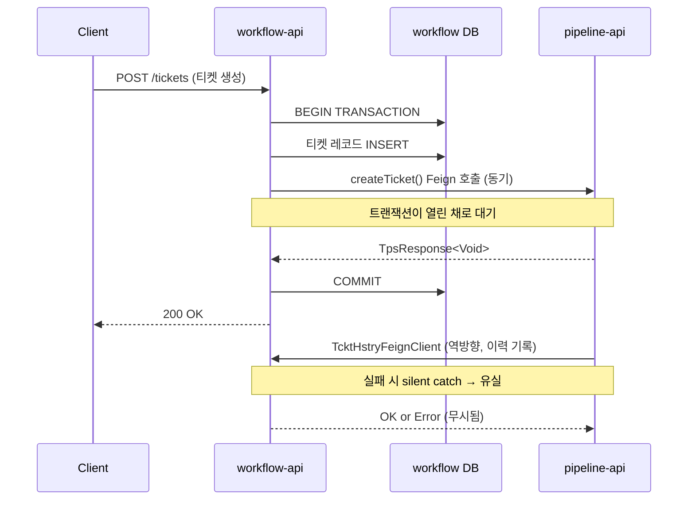
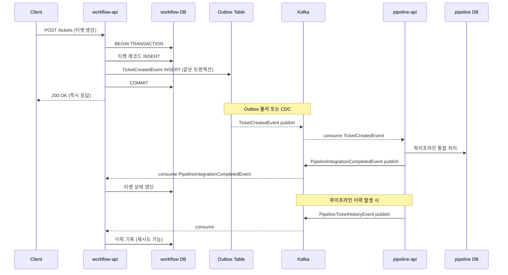
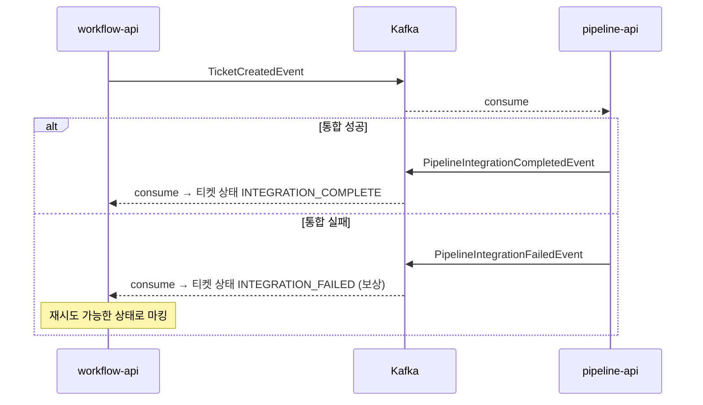

# 티켓↔파이프라인 통합 EDA 전환

workflow-api와 pipeline-api 사이의 양방향 Feign 호출을 단방향 이벤트 흐름으로 전환하는 설계 문서다.
두 서비스는 현재 서로를 직접 호출하는 구조라 한쪽 장애가 양쪽에 전파된다.
EDA로 전환하면 이 결합을 끊고 각 서비스가 독립적으로 장애를 처리할 수 있게 된다.

---

## 1. 현재 양방향 Feign 호출 흐름

### 1.1 workflow-api → pipeline-api (정방향)

**코드 경로**: `workflow-api/.../external/client/PipelineIntgrtdClient.java`

```java
@FeignClient(
    name = "pipeline-integration-feign",
    url = "${trb.services.pipeline-api.url}/pipeline/api/ticket-integration/v2"
)
```

workflow-api는 티켓 생명주기의 각 전환점마다 pipeline-api를 동기 호출한다.
6개 메서드가 각각 다른 시점에 호출된다.

| 메서드 | 라인 | 반환 타입 | 호출 시점 |
|--------|------|----------|----------|
| `createTicket()` | L32 | `TpsResponse<Void>` | 티켓 생성 시 |
| `resetTicket()` | L25 | `TpsResponse<Void>` | 티켓 리셋 시 |
| `removeTicket()` | L39 | `TpsResponse<Void>` | 티켓 삭제 시 |
| `completeTicket()` | L46 | `TpsResponse<TcktCompleteResult>` | 티켓 완료 시 |
| `rejectTicket()` | L52 | `TpsResponse<Void>` | 티켓 반려 시 |
| `disableTicket()` | L57 | `TpsResponse<Void>` | 티켓 비활성화 시 |

`completeTicket()`이 `TcktCompleteResult`를 반환하는 점이 주목할 부분이다.
다른 메서드는 성공/실패만 반환하지만 완료 처리는 파이프라인 측의 처리 결과가 필요하다.
이 때문에 EDA 전환 시 완료 흐름은 별도로 다뤄야 한다.

**티켓 생성 흐름** (`TcktMngServiceImpl.java` L83-122):

```
1. 입력 검증
2. 기본 레코드 생성 (기본 + 실행 + 저장소)
3. PMS 매핑 생성
4. tcktExternalHandler.handleCreateTckt(tcktNo)
   └─ PipelineIntgrtdClient.createTicket() Feign 호출  ← 여기서 동기 블로킹
5. 사전 준비 워크플로우 트리거
6. 감사 & 이력 이벤트 발행
```

4단계에서 pipeline-api가 응답하기 전까지 workflow-api의 트랜잭션이 열린 채로 유지된다.
이는 트랜잭션 범위가 외부 서비스 응답 시간에 의존한다는 의미다.

### 1.2 pipeline-api → workflow-api (역방향)

**코드 경로**: `pipeline-api/.../event/TcktHstryEventListener.java`, `TcktHstryHandlerImpl` (L22-37)

pipeline-api는 파이프라인 실행 이력을 workflow-api에 기록하기 위해 역방향 Feign 호출을 사용한다.
`TcktHstryFeignClient`로 이력 기록 요청을 보내는데, 실패 시 예외를 잡아 무시한다(silent catch).
이력이 유실되어도 파이프라인 실행 자체는 계속 진행되도록 의도한 설계이지만, 이력 데이터의 신뢰성이 낮아진다.

### 1.3 현재 구조의 문제점

현재 구조에는 네 가지 문제가 있다.

**첫째, 양방향 동기 결합이다.** workflow-api와 pipeline-api가 서로를 직접 호출하므로 한쪽이 느려지거나 장애가 발생하면 양쪽 기능이 동시에 영향을 받는다. 독립적으로 배포해도 런타임에는 강하게 결합되어 있다.

**둘째, 실패가 전파된다.** pipeline-api 장애 시 티켓 생성 자체가 실패한다. 파이프라인 통합은 비동기로 처리해도 되는 작업임에도 동기 호출로 인해 불필요한 실패가 발생한다.

**셋째, 이력이 유실된다.** pipeline-api → workflow-api 역방향 호출에서 실패 시 silent catch로 이력이 누락된다. 운영 중 이력 조회 시 데이터 불일치가 발생할 수 있다.

**넷째, 트랜잭션 범위가 과도하다.** 티켓 생성의 DB 트랜잭션이 Feign 호출 완료까지 유지된다. 네트워크 지연이 트랜잭션 길이에 직접 영향을 미친다.



---

## 2. EDA 전환 후 단방향 이벤트 흐름

EDA로 전환하면 두 서비스 간의 호출 방향이 하나로 통일된다.
workflow-api는 이벤트를 발행하고, pipeline-api는 이를 소비한다.
역방향도 동일한 패턴으로, pipeline-api가 이벤트를 발행하고 workflow-api가 소비한다.
직접 호출 대신 Kafka 토픽이 중간 버퍼 역할을 한다.

### 2.1 티켓 → 파이프라인 (이벤트)

```
1. workflow-api: 티켓 생성 → DB 커밋 → TicketCreatedEvent 발행 (Kafka)
2. pipeline-api: consume → 파이프라인 통합 처리 (비동기)
3. pipeline-api: 처리 완료 → PipelineIntegrationCompletedEvent 발행
4. workflow-api: consume → 티켓 상태 갱신
```

DB 커밋 후 이벤트를 발행하므로 트랜잭션 범위가 DB 작업으로 한정된다.
pipeline-api가 처리 중 장애가 발생해도 Kafka에 이벤트가 남아 재시도할 수 있다.

### 2.2 파이프라인 → 티켓 (이벤트)

```
1. pipeline-api: 이력 발생 → PipelineTicketHistoryEvent 발행 (Kafka)
2. workflow-api: consume → 이력 기록 (재시도 가능, 유실 방지)
```

silent catch 대신 Kafka의 at-least-once 보장으로 이력 유실을 방지한다.
workflow-api가 일시 장애 상태여도 이벤트는 Kafka에 적재되어 회복 후 처리된다.



### 2.3 completeTicket 특수 처리

현재 `completeTicket()`은 `TcktCompleteResult`를 동기 반환한다.
이는 workflow-api가 완료 처리 결과를 즉시 클라이언트에게 전달해야 한다고 가정하는 구조다.
EDA 전환 시 두 가지 방안을 고려할 수 있다.

**(A) Request-Reply 패턴**: `TicketCompletedEvent`를 발행하고 pipeline-api가 처리 후 `TicketCompletionResultEvent`를 응답 토픽에 발행한다. workflow-api는 correlationId로 응답을 매칭한다. 동기적 응답을 제공하지만 구현이 복잡하고 타임아웃 처리가 필요하다.

**(B) Eventual Consistency**: 완료 이벤트를 발행하고 클라이언트에게는 "완료 요청 접수"를 응답한다. pipeline-api가 처리 후 결과 이벤트를 발행하면 workflow-api가 최종 상태를 갱신한다. 프론트엔드는 SSE나 폴링으로 최종 상태를 확인한다.

권장 방안은 **(B)**다. 완료 처리 결과가 클라이언트에게 즉시 필요한 경우는 드물고, TPS 프론트엔드는 이미 `useAutoInvalidQuery.ts`를 통해 상태 변경을 감지하는 구조를 갖고 있다. Eventual Consistency가 더 자연스러운 흐름이며 시스템 결합도도 낮다.

---

## 3. 이벤트 스키마 정의

모든 이벤트는 공통 헤더(`eventId`, `eventType`, `timestamp`, `correlationId`)와 이벤트별 `payload`로 구성된다.
`correlationId`에 티켓 번호를 사용해 같은 티켓의 이벤트를 추적한다.

### TicketCreatedEvent

```json
{
  "eventId": "550e8400-e29b-41d4-a716-446655440000",
  "eventType": "TICKET_CREATED",
  "timestamp": "2026-02-25T10:00:00Z",
  "correlationId": "TCKT-12345",
  "payload": {
    "tcktNo": "TCKT-12345",
    "projectId": "PRJ-001",
    "creatorId": "user-001",
    "tcktType": "FEATURE",
    "repositories": ["repo-1", "repo-2"]
  }
}
```

`repositories` 필드는 pipeline-api가 파이프라인 통합 대상을 결정하는 데 사용한다.
현재 Feign 호출에서 전달하는 정보를 그대로 payload에 담는다.

### TicketCompletedEvent

```json
{
  "eventId": "550e8400-e29b-41d4-a716-446655440001",
  "eventType": "TICKET_COMPLETED",
  "timestamp": "2026-02-25T11:00:00Z",
  "correlationId": "TCKT-12345",
  "payload": {
    "tcktNo": "TCKT-12345",
    "completedBy": "user-001",
    "completionType": "NORMAL"
  }
}
```

### TicketDeletedEvent

```json
{
  "eventId": "550e8400-e29b-41d4-a716-446655440002",
  "eventType": "TICKET_DELETED",
  "timestamp": "2026-02-25T12:00:00Z",
  "correlationId": "TCKT-12345",
  "payload": {
    "tcktNo": "TCKT-12345",
    "deletedBy": "user-001",
    "reason": "USER_REQUEST"
  }
}
```

### TicketResetEvent

```json
{
  "eventId": "550e8400-e29b-41d4-a716-446655440003",
  "eventType": "TICKET_RESET",
  "timestamp": "2026-02-25T12:30:00Z",
  "correlationId": "TCKT-12345",
  "payload": {
    "tcktNo": "TCKT-12345",
    "resetBy": "user-001",
    "resetType": "FULL"
  }
}
```

### PipelineTicketHistoryEvent

pipeline-api가 발행하며, workflow-api의 이력 테이블에 기록될 데이터를 담는다.
현재 역방향 Feign 호출이 전달하는 데이터와 동일한 구조다.

```json
{
  "eventId": "550e8400-e29b-41d4-a716-446655440010",
  "eventType": "PIPELINE_TICKET_HISTORY",
  "timestamp": "2026-02-25T10:05:00Z",
  "correlationId": "TCKT-12345",
  "payload": {
    "tcktNo": "TCKT-12345",
    "historyType": "TRIGGER_EXECUTED",
    "pplnNo": "PPLN-001",
    "result": "SUCCESS",
    "details": {
      "triggerId": "TRG-001",
      "executionTime": 1234,
      "message": "파이프라인 트리거 실행 완료"
    }
  }
}
```

### PipelineIntegrationCompletedEvent

파이프라인 통합 처리가 완료되면 pipeline-api가 발행한다.
workflow-api는 이 이벤트를 소비해 티켓의 통합 상태를 갱신한다.

```json
{
  "eventId": "550e8400-e29b-41d4-a716-446655440020",
  "eventType": "PIPELINE_INTEGRATION_COMPLETED",
  "timestamp": "2026-02-25T10:03:00Z",
  "correlationId": "TCKT-12345",
  "payload": {
    "tcktNo": "TCKT-12345",
    "integrationStatus": "SUCCESS",
    "pipelineId": "PPLN-001",
    "completionResult": {
      "branchCreated": true,
      "webhookRegistered": true
    }
  }
}
```

`completionResult`는 현재 `TcktCompleteResult`에 해당하는 데이터를 담는다.
동기 응답 대신 이 이벤트를 통해 workflow-api가 상태를 갱신한다.

---

## 4. 고려사항

### 4.1 SAGA 패턴 (Choreography)

티켓 생성 → 파이프라인 통합 흐름은 Choreography SAGA에 적합하다.
중앙 조율자 없이 각 서비스가 이벤트에 반응해 다음 단계를 진행하는 방식이다.
파이프라인 통합이 실패해도 티켓 자체는 유효하므로 "삭제" 대신 "상태 변경"으로 보상한다.



보상 액션이 티켓 삭제가 아닌 상태 변경인 이유는 티켓과 파이프라인 통합이 독립적인 개념이기 때문이다. 파이프라인 통합이 실패해도 티켓의 작업 이력이나 정보는 유효하다. 상태를 `INTEGRATION_FAILED`로 마킹하면 운영자가 재시도를 트리거하거나 수동으로 처리할 수 있다.

### 4.2 보상 트랜잭션 설계

| 단계 | 정상 이벤트 | 실패 이벤트 | 보상 액션 |
|------|-----------|-----------|----------|
| 티켓 생성 | `TicketCreatedEvent` | — | — |
| 파이프라인 통합 | `IntegrationCompletedEvent` | `IntegrationFailedEvent` | 티켓 상태 → `INTEGRATION_PENDING` |
| 완료 확인 | `TicketCompletionResultEvent` | `CompletionFailedEvent` | 완료 상태 롤백, 재처리 큐 등록 |
| 이력 기록 | 정상 소비 | 소비 실패 | Kafka 재시도 (at-least-once) |

보상 트랜잭션은 원래 작업을 취소하는 것이 아니라 시스템을 일관된 상태로 되돌리는 것이 목적이다.
`INTEGRATION_PENDING` 상태는 "파이프라인 통합이 아직 완료되지 않았음"을 나타내며, 이는 삭제보다 훨씬 정보가 풍부하다.

### 4.3 Outbox 패턴 적용

이벤트 발행의 신뢰성을 보장하려면 Outbox 패턴이 필요하다.
티켓 DB INSERT와 Outbox 테이블 INSERT를 같은 트랜잭션으로 묶어야 한다.
이벤트 발행 실패 시 DB에는 데이터가 있는데 이벤트가 발행되지 않는 문제를 방지한다.

```java
@Transactional
public void createTicket(TcktCreateCommand command) {
    // 1. 티켓 레코드 저장
    Tckt tckt = tcktRepository.save(Tckt.from(command));

    // 2. Outbox 테이블에 이벤트 저장 (같은 트랜잭션)
    TicketCreatedEvent event = TicketCreatedEvent.from(tckt);
    outboxRepository.save(OutboxEvent.of(event));

    // 트랜잭션 커밋 후 Outbox 폴러가 Kafka로 전달
}
```

현재 `@TransactionalEventListener`를 사용 중이라면 Outbox INSERT로 전환할 수 있다.
핵심 비즈니스 로직 변경은 최소화하면서 신뢰성을 확보하는 방법이다.

CDC(Debezium)를 사용하면 Outbox 폴러 없이 DB 변경 로그에서 직접 이벤트를 읽어 Kafka로 전달할 수 있다. Redpanda는 Kafka 호환 인터페이스를 제공하므로 동일하게 적용 가능하다.

### 4.4 순서 보장

파티션 키를 `tcktNo`로 설정하면 같은 티켓의 이벤트가 항상 같은 파티션으로 라우팅된다.
Kafka는 파티션 내 순서를 보장하므로 `CREATE → RESET → COMPLETE → DELETE` 순서가 지켜진다.

```java
// Kafka Producer 설정
ProducerRecord<String, TicketEvent> record = new ProducerRecord<>(
    "ticket-events",
    tcktNo,       // 파티션 키: 티켓 번호
    ticketEvent
);
```

pipeline-api 컨슈머가 이벤트 순서에 의존하는 로직을 가진다면 이 설계가 필수다.
예를 들어 `TICKET_DELETED` 이벤트를 처리하기 전에 반드시 `TICKET_CREATED`가 처리되어야 한다.

### 4.5 멱등성

pipeline-api의 `TicketIntegrationUseCase`는 `(correlationId, eventType)` 복합 키로 중복 이벤트를 방지해야 한다.
Kafka의 at-least-once 특성상 같은 이벤트가 두 번 전달될 수 있기 때문이다.

```sql
-- ProcessedEvent 테이블 스키마
CREATE TABLE processed_event (
    correlation_id VARCHAR(100) NOT NULL,
    event_type     VARCHAR(100) NOT NULL,
    processed_at   TIMESTAMP   NOT NULL,
    PRIMARY KEY (correlation_id, event_type)
);
```

preemptive acquire 패턴을 적용한다. check-then-act(isProcessed → 처리 → markProcessed) 대신 INSERT 시도 자체가 중복 체크 역할을 한다.

```sql
-- 중복 방지 INSERT (0행 반환 시 이미 처리됨)
INSERT INTO processed_event (correlation_id, event_type, processed_at)
SELECT :correlationId, :eventType, NOW()
WHERE NOT EXISTS (
    SELECT 1 FROM processed_event
    WHERE correlation_id = :correlationId
    AND event_type = :eventType
)
```

이미 존재하면 0행이 반환되고, 소비자는 이를 확인해 처리를 건너뛴다.
JPA의 `saveAndFlush()` + 예외 catch 방식은 Hibernate 세션을 rollback-only 상태로 만들 수 있어 네이티브 쿼리가 더 안전하다.

### 4.6 프론트엔드 영향

EDA 전환 시 프론트엔드도 함께 조정이 필요하다.
현재는 Feign 호출 응답이 즉시 돌아오는 동기 구조를 가정하고 있다.

`useAutoInvalidQuery.ts` (L14-33): 현재 티켓 상태 변경 성공 응답 수신 시 6개 query key를 즉시 무효화한다.
EDA 전환 후에는 서버 응답이 "요청 접수"를 의미하므로 즉시 무효화가 맞지 않다.
SSE를 통해 서버가 파이프라인 통합 완료 이벤트를 프론트엔드에 푸시하면 그 시점에 선택적으로 무효화하는 방식으로 전환한다.

`useTcktExcnMutation.ts` (L25-32): 실행 상태 변경 후 cascade 무효화를 수행한다.
동일하게 SSE 이벤트 기반 무효화로 전환한다.

이미 `runners-high/poc/06_Frontend/09-sse/`에서 SSE 연동을 학습한 내용을 그대로 적용할 수 있다.
단방향 서버 푸시가 이 사례에 정확히 들어맞는 패턴이다.

---

## 5. Before/After 비교

| 항목 | Before (현재 Feign) | After (EDA) |
|------|---------------------|-------------|
| 결합도 | 양방향 동기 (6+1 메서드) | 단방향 이벤트 (토픽 2개) |
| 장애 전파 | pipeline-api 장애 = 티켓 생성 실패 | 독립 — 이벤트는 Kafka에 보관 |
| 이력 유실 | silent catch → 유실 가능 | at-least-once 보장 → 재시도 가능 |
| 트랜잭션 범위 | DB + Feign 호출 포함 | DB만 (이벤트는 Outbox 분리) |
| 확장성 | workflow-api 처리량에 pipeline-api가 종속 | 컨슈머 독립 확장 |
| 완료 응답 | 동기 `TcktCompleteResult` 반환 | Eventual Consistency + SSE 알림 |
| 재시도 | Feign Retry (즉각 재시도) | Kafka 재시도 (backoff 설정 가능) |
| 모니터링 | 서비스 로그 + APM | 이벤트 토픽 lag + 컨슈머 그룹 상태 |

가장 큰 변화는 두 서비스가 Kafka를 통해서만 통신한다는 점이다.
직접 호출이 없으므로 어느 한쪽이 장애 상태여도 상대방의 정상 기능은 계속 동작한다.
workflow-api가 재시작하는 동안에도 pipeline-api는 이력 이벤트를 Kafka에 쌓을 수 있고,
workflow-api가 복구되면 밀린 이벤트를 순서대로 처리한다.

---

## 참고

- **SAGA 패턴 상세**: `runners-high/poc/08_MessageQueue/red-panda/learning/03-spring-boot-integration/` Ch03
- **Outbox + CDC**: `runners-high/poc/02_Architecture/01-event-driven/` (Outbox 패턴 챕터)
- **멱등성 패턴**: `runners-high/poc/08_MessageQueue/red-panda/learning/01-event-driven/` Ch17
- **SSE 연동**: `runners-high/poc/06_Frontend/09-sse/`
- **TPS ApiResponse 패턴**: `.claude/skills/tps/backend/tps_architecture/references/api-response-pattern.md`
