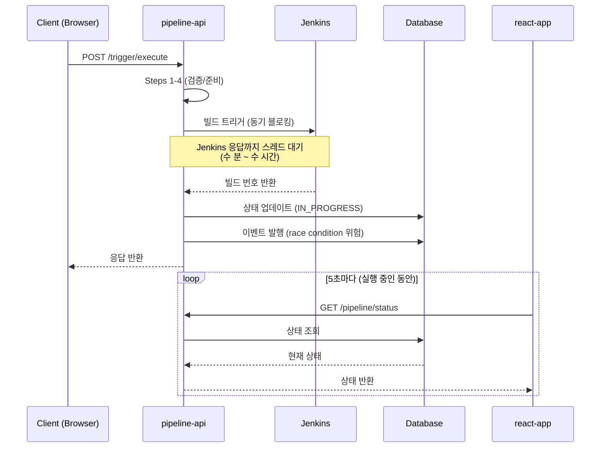
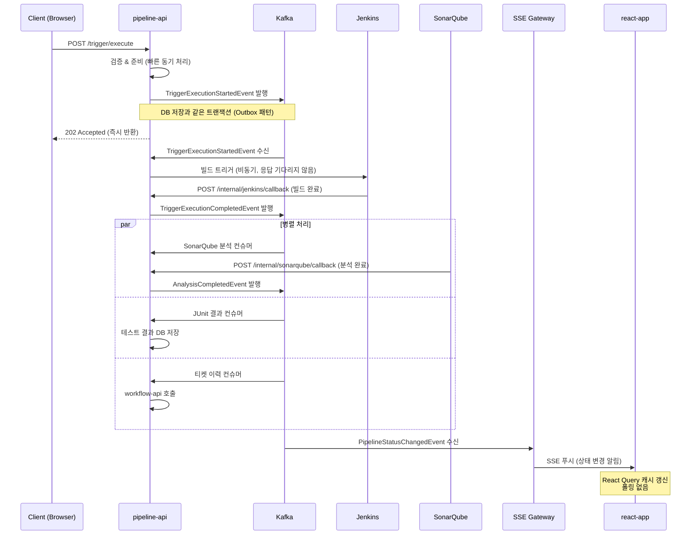

# H3. 파이프라인/트리거 실행 상태 추적 EDA 전환

> 실제 TPS 코드베이스(pipeline-api, react-app)를 기반으로 현재 동기 오케스트레이션 구조가 가진 문제를 분석하고, EDA 전환 후 어떻게 개선되는지 구체적으로 살펴본다.

---

## 1. 현재 구조: 10단계 동기 오케스트레이션 + 5초 폴링

### 1.1 트리거 실행 흐름

**코드 경로**: `pipeline-api/.../trigger/TriggerService.java` (`executeTriggerPipeline` L160-219)

현재 트리거 실행은 하나의 HTTP 요청 스레드 안에서 10단계가 순서대로 진행된다. 각 단계가 완료될 때까지 스레드가 블로킹되는 구조다.

```
Steps 1-4  : 검증 & 준비 (파이프라인 조회, 권한 확인, 파라미터 처리)
Steps 5-6  : Jenkins 트리거 실행 — pipelineProcessor.executeTriggerPipeline()
             ↑ L190에서 Jenkins 응답이 올 때까지 스레드 블로킹
Steps 7-8  : 트리거 파이프라인 DB 업데이트
Step  9    : 조건부 분기 — SonarQube 분석 생성 또는 JUnit 테스트 결과 생성
Step 10    : 티켓 이벤트 발행 — DefaultTcktHstryEvent (L218)
             ↑ L231-239: DB 커밋 후 이벤트 발행 사이에 간극 존재 (race condition 위험)
```

Jenkins 빌드는 수 분에서 수 시간이 걸릴 수 있다. 그런데 동기 호출 방식이므로, Jenkins가 응답을 돌려줄 때까지 스레드가 묶여 있다. 컨테이너 환경에서 스레드 풀 소진이 발생할 수 있는 구조다.

### 1.2 파이프라인 실행 흐름

**코드 경로**: `pipeline-api/.../pipeline/PipelineService.java` (`executePipeline` L252-270)

```java
// L252-270 요약 (의사 코드)
pipelineProcessor.executeJenkinsPipeline(request.getPplnNo()); // 동기 Jenkins 호출
```

파이프라인 상태는 다음 상수로 관리된다.

| 상수 | 의미 |
|------|------|
| WAIT | 대기 중 |
| EXCN / IN_PROGRESS | 실행 중 |
| CMPTN / COMPLETE | 완료 |
| FAIL | 실패 |
| RJCT | 거부됨 |

`TriggerProcessorImpl` (L64-72)에서 수동으로 상태를 체크하는 로직이 있는데, 이는 상태 전이 규칙이 코드 여러 곳에 흩어져 있음을 의미한다. 상태 머신이 명시적으로 정의되지 않아 일관성을 유지하기 어렵다.

### 1.3 프론트엔드 폴링

**코드 경로**: `react-app/.../pipeline/pipelineMng/v3/usePplnMngQuery.ts` (L48)

```typescript
// L48: 파이프라인 실행 중 5초마다 서버에 상태 조회
refetchInterval: isOnProgress ? 5000 : false,
```

관련된 폴링 지점이 화면마다 분산되어 있다.

| 파일 | 폴링 간격 | 용도 |
|------|----------|------|
| `usePplnMngQuery.ts` (L48) | 5초 | 파이프라인 실행 상태 |
| `useAnalysisMngQuery.ts` (L50) | 10초 | SonarQube 분석 결과 |
| `useBaseImgMngQuery.ts` | 암시적 | Harbor 이미지 스캔 |
| `useApplicationQuery.ts` | 암시적 | ArgoCD 배포 상태 |

사용자가 파이프라인 화면을 열어두면 5초마다 서버에 요청을 보낸다. 파이프라인이 30분 동안 실행된다면, 그 시간 동안 360번의 불필요한 요청이 발생한다. 접속자가 20명이라면 7,200번이다.

### 1.4 WebSocket 로그 스트리밍

**코드 경로**: `react-app/.../PipelineRealTimeLogger.tsx` (L1-150)

로그 스트리밍은 WebSocket으로 처리하고 있어 폴링과 다른 방식이다.

```typescript
// useWebSocket → ws://pipeline-server/ppln/logs/v3
// 실시간 파이프라인 로그 수신
// 연결 실패 시 3초 재시도
// v1, v2, v3 세 버전 공존 중
```

로그 스트리밍은 초당 수십 건의 고빈도 데이터를 처리해야 하므로 WebSocket이 적합하다. EDA 전환 이후에도 이 부분은 그대로 유지할 예정이다.

### 1.5 외부 도구 통합 (Feign 클라이언트)

현재 외부 도구는 모두 Feign을 통해 동기 호출된다.

| Feign 클라이언트 | 대상 시스템 | 주요 용도 |
|----------------|-----------|---------|
| `JenkinsFeignClient` | Jenkins | 빌드 실행, 빌드 번호 조회, 상태 확인 |
| `SonarQubeFeignClient` | SonarQube | 코드 분석 결과 조회 |
| `ArgoCdFeignClient` | ArgoCD | 배포 상태 조회, 동기화 트리거 |
| `HarborFeignClient` | Harbor | 이미지 스캔 결과 조회 |
| `AsyncProcessResultClient` | ppln-logging-api | 비동기 처리 결과 전달 |

SonarQube 조회가 특히 문제다. 분석이 아직 완료되지 않았을 때 호출하면 빈 결과가 반환된다(`FeignException` catch, L87-90). 그런데 재시도 로직이 없어서 빈 결과가 그대로 저장된다. 분석이 완료되었는지 polling하거나 다시 조회하는 트리거가 없다.

### 1.6 현재 구조의 문제점 요약

현재 구조에서 발생하는 문제는 크게 다섯 가지로 정리할 수 있다.

**문제 1: Jenkins 블로킹**
빌드 실행이 완료될 때까지 HTTP 요청 스레드가 점유된다. Jenkins 빌드 시간이 수십 분이면 그만큼 스레드가 묶인다.

**문제 2: 폴링 서버 부하**
실행 중인 파이프라인마다 클라이언트가 5초 간격으로 서버를 호출한다. 동시 실행 파이프라인이 늘어날수록 불필요한 DB 조회가 선형으로 증가한다.

**문제 3: SonarQube pull 방식의 불완전성**
분석 완료 여부를 확인하지 않고 한 번만 조회한다. 분석이 완료되기 전에 조회하면 빈 결과가 저장되고, 이후 재조회 없이 넘어간다.

**문제 4: 상태 전파 지연**
파이프라인 상태가 DB에 업데이트되어도 클라이언트는 최대 5초 뒤에야 변경을 인지한다. 빌드가 완료되었는데도 화면에는 여전히 "실행 중"으로 표시되는 기간이 생긴다.

**문제 5: 이벤트 발행의 race condition**
L231-239에서 DB 트랜잭션 커밋 후 이벤트를 발행한다. 트랜잭션이 커밋되기 전에 이벤트 컨슈머가 DB를 조회하면 아직 변경사항이 반영되지 않은 상태를 읽는다.



---

## 2. EDA 전환 후: 이벤트 기반 상태 전파 + SSE 푸시

### 2.1 트리거 실행 (이벤트 기반 비동기)

EDA 전환 후 트리거 실행은 즉시 응답을 반환하고, 실제 실행은 이벤트를 통해 비동기로 처리된다.

```
1. HTTP 요청 수신
2. 검증 & 준비 (Steps 1-4, 동기 유지 — 빠른 검증)
3. DB 저장 (상태: WAIT) + TriggerExecutionStartedEvent 발행 (같은 트랜잭션)
4. HTTP 202 Accepted 즉시 반환 ← 스레드 즉시 해제
---
(별도 컨슈머에서 비동기 처리)
5. TriggerExecutionStartedEvent 수신 → Jenkins 비동기 호출
6. Jenkins webhook 콜백 수신 → TriggerExecutionCompletedEvent / TriggerExecutionFailedEvent 발행
7. TriggerExecutionCompletedEvent 수신 → SonarQube 웹훅 대기 (push 방식)
8. SonarQube 웹훅 수신 → AnalysisCompletedEvent 발행
9. TriggerExecutionCompletedEvent 수신 → JUnit 결과 저장
10. TriggerExecutionCompletedEvent 수신 → workflow-api에 티켓 이력 전달
```

Steps 7-10은 동일한 이벤트를 여러 컨슈머가 독립적으로 처리한다. 한 컨슈머의 실패가 다른 컨슈머에 영향을 주지 않는다.

### 2.2 파이프라인 상태 전파 (SSE 푸시)

상태가 변경될 때마다 이벤트를 발행하고, SSE Gateway를 통해 프론트엔드에 즉시 전달한다.

```
WAIT → IN_PROGRESS: PipelineStatusChangedEvent 발행
IN_PROGRESS → COMPLETE: PipelineStatusChangedEvent 발행
IN_PROGRESS → FAIL: PipelineStatusChangedEvent 발행
```

프론트엔드는 `refetchInterval: 5000`을 제거하고 SSE 연결로 교체한다. 상태 변경 이벤트를 수신하면 React Query 캐시를 선택적으로 갱신(`queryClient.setQueryData()`)한다.

### 2.3 Jenkins 콜백 통합

Jenkins가 빌드를 완료하면 pipeline-api로 직접 콜백을 보내는 방식이다.

**권장 방식 (A): Jenkins Pipeline post 블록**

Pipeline Groovy 스크립트에 `post` 블록을 추가한다. Jenkins가 이미 제공하는 기능이므로 별도 플러그인이 필요 없다.

```groovy
// Jenkinsfile
pipeline {
    stages { /* ... */ }
    post {
        always {
            httpRequest(
                url: "http://pipeline-api/internal/jenkins/callback",
                httpMode: "POST",
                requestBody: groovy.json.JsonOutput.toJson([
                    pplnNo: env.PPLN_NO,
                    buildNumber: currentBuild.number,
                    result: currentBuild.currentResult,
                    duration: currentBuild.duration
                ]),
                contentType: "APPLICATION_JSON"
            )
        }
    }
}
```

**대안 (B): Jenkins Job Notification Plugin**
플러그인을 설치하면 별도 Groovy 수정 없이 웹훅을 설정할 수 있다. 단, 모든 Jenkins 인스턴스에 플러그인 설치가 필요하다.

**대안 (C): 기존 폴링 방식 유지 + Kafka 이벤트 추가**
마이그레이션 초기 단계에서 안전하게 적용할 수 있으나, 폴링 부하 문제는 해결되지 않는다.

### 2.4 SonarQube 웹훅 통합

SonarQube는 자체 웹훅 기능을 내장하고 있다. 분석이 완료되면 pipeline-api로 자동으로 콜백을 보낸다. pull 방식의 `FeignException` 문제가 근본적으로 해결된다.

```
SonarQube Administration > Webhooks
→ URL: http://pipeline-api/internal/sonarqube/callback
→ 이벤트: 분석 완료 시 자동 POST

pipeline-api 수신 처리:
→ SonarQube 콜백 수신
→ 분석 결과 DB 저장
→ AnalysisCompletedEvent 발행
→ SSE로 프론트엔드에 분석 완료 알림
```

주의할 점이 하나 있다. SonarQube 웹훅은 분석이 성공적으로 완료된 경우에만 호출된다. 분석 자체가 실패하거나 SonarQube 서버에 문제가 생기면 콜백이 오지 않는다. 이 경우를 위한 타임아웃 + 폴백 메커니즘이 필요하다.



---

## 3. 이벤트 스키마 정의

모든 이벤트는 공통 envelope을 공유한다. `eventId`로 이벤트를 식별하고, `correlationId`로 하나의 실행 흐름에 속한 이벤트들을 연결한다.

### 3.1 TriggerExecutionStartedEvent

트리거 실행이 시작될 때 발행된다. 이 이벤트를 수신한 컨슈머가 Jenkins를 비동기로 호출한다.

```json
{
  "eventId": "550e8400-e29b-41d4-a716-446655440000",
  "eventType": "TRIGGER_EXECUTION_STARTED",
  "timestamp": "2026-02-25T10:00:00Z",
  "correlationId": "trigger-12345",
  "payload": {
    "tcktNo": "TCKT-001",
    "trigrSn": "TRGR-001",
    "pplnNo": "PPLN-001",
    "compnInptOrd": 1,
    "executorId": "user-001",
    "jenkinsBuildNo": null
  }
}
```

`jenkinsBuildNo`는 이 시점에서 null이다. Jenkins 빌드가 트리거된 후 `PipelineStatusChangedEvent`를 통해 업데이트된다.

### 3.2 PipelineStatusChangedEvent

파이프라인 상태가 변경될 때마다 발행된다. SSE Gateway가 이 이벤트를 수신하여 프론트엔드에 푸시한다.

```json
{
  "eventId": "550e8400-e29b-41d4-a716-446655440001",
  "eventType": "PIPELINE_STATUS_CHANGED",
  "timestamp": "2026-02-25T10:00:05Z",
  "correlationId": "ppln-001",
  "payload": {
    "pplnNo": "PPLN-001",
    "previousStatus": "WAIT",
    "currentStatus": "IN_PROGRESS",
    "jenkinsBuildNo": "42",
    "stage": "BUILD",
    "progress": 30
  }
}
```

`previousStatus`를 포함하는 이유는 컨슈머가 잘못된 순서로 이벤트를 받았을 때 OUT_OF_ORDER 상태를 감지하기 위해서다. `COMPLETE → IN_PROGRESS` 같은 역방향 전이는 무시한다.

### 3.3 TriggerExecutionCompletedEvent / TriggerExecutionFailedEvent

Jenkins 콜백을 수신한 후 발행된다. 이 이벤트를 기점으로 SonarQube 분석, JUnit 결과 저장, 티켓 이력 전달이 병렬로 시작된다.

```json
{
  "eventId": "550e8400-e29b-41d4-a716-446655440002",
  "eventType": "TRIGGER_EXECUTION_COMPLETED",
  "timestamp": "2026-02-25T10:03:00Z",
  "correlationId": "trigger-12345",
  "payload": {
    "tcktNo": "TCKT-001",
    "trigrSn": "TRGR-001",
    "pplnNo": "PPLN-001",
    "result": "SUCCESS",
    "jenkinsBuildNo": "42",
    "duration": 180,
    "analysisRequired": true,
    "junitRequired": true
  }
}
```

`analysisRequired`와 `junitRequired`는 기존 Step 9의 조건부 분기 로직을 이벤트 레벨에서 표현한 것이다. 각 컨슈머는 이 플래그를 확인하여 자신이 처리할 대상인지 판단한다.

`TriggerExecutionFailedEvent`는 동일한 구조에 `result: "FAILURE"`와 `failureReason` 필드가 추가된다.

### 3.4 AnalysisCompletedEvent

SonarQube 웹훅 콜백을 수신한 후 발행된다. 이 이벤트로 프론트엔드의 SonarQube 분석 결과 화면이 갱신된다.

```json
{
  "eventId": "550e8400-e29b-41d4-a716-446655440003",
  "eventType": "ANALYSIS_COMPLETED",
  "timestamp": "2026-02-25T10:04:30Z",
  "correlationId": "trigger-12345",
  "payload": {
    "pplnNo": "PPLN-001",
    "sonarqubeProjectKey": "tps-module",
    "qualityGateStatus": "OK",
    "metrics": {
      "coverage": 82.5,
      "bugs": 0,
      "vulnerabilities": 1,
      "codeSmells": 12
    }
  }
}
```

`qualityGateStatus`가 `ERROR`인 경우, 파이프라인을 실패로 처리할지 아니면 경고만 남길지는 정책에 따라 결정한다. 이 판단 로직은 컨슈머에 위치시키고 이벤트 스키마에는 결과 데이터만 담는다.

---

## 4. 고려사항

### 4.1 Jenkins 콜백 방식 선택

세 가지 방식 중 하나를 선택해야 하는데, 각각 트레이드오프가 다르다.

**(A) Jenkins Pipeline post 블록** — 권장

기존 Jenkinsfile에 `post { always { httpRequest ... } }` 블록을 추가하는 방식이다. Jenkins가 기본 제공하는 `httpRequest` 스텝을 사용하므로 플러그인 설치가 필요 없다. Pipeline as Code 원칙에 부합하고, 콜백 URL을 코드로 관리할 수 있다. 단, Jenkinsfile을 수정해야 하므로 기존 파이프라인을 일괄 수정하는 작업이 필요하다.

**(B) Jenkins Job Notification Plugin**

Jenkinsfile을 수정하지 않고 Jenkins UI에서 웹훅을 설정할 수 있다. 하지만 플러그인을 모든 Jenkins 인스턴스에 설치해야 하고, 설정이 UI에 분산되어 코드로 추적하기 어렵다.

**(C) 기존 폴링 방식 유지 + Kafka 이벤트 추가**

Jenkins 콜백 없이 기존 방식으로 Jenkins 상태를 조회하되, 상태 변경 시 Kafka 이벤트만 추가로 발행한다. 폴링은 서버 내부에서만 발생하고 프론트엔드는 SSE로 받는다. 마이그레이션 초기 단계에서 리스크를 줄이는 용도로 적합하다.

### 4.2 SonarQube 웹훅

SonarQube Administration > Webhooks에서 pipeline-api URL을 등록하면 분석 완료 시 자동으로 POST 콜백이 온다. 기존 `FeignException` 처리 코드(L87-90)를 제거할 수 있다.

한 가지 주의해야 할 상황이 있다. SonarQube 웹훅은 분석이 완료되었을 때만 호출된다. SonarQube 서버 장애, 네트워크 단절, 분석 자체 실패 등으로 콜백이 오지 않는 경우를 대비한 타임아웃 처리가 필요하다. 예를 들어 `TriggerExecutionCompletedEvent` 발행 후 30분 이내에 `AnalysisCompletedEvent`가 발행되지 않으면 DLQ로 이동하거나 폴백으로 기존 pull 방식을 한 번 시도하는 전략이 현실적이다.

### 4.3 프론트엔드 폴링 제거 → SSE 전환

`refetchInterval: 5000`을 제거하고 SSE 연결로 교체한다.

```typescript
// 기존: usePplnMngQuery.ts
refetchInterval: isOnProgress ? 5000 : false,  // ← 제거

// 변경: SSE 연결 훅
const useSSEPipelineStatus = (pplnNo: string) => {
  useEffect(() => {
    const eventSource = new EventSource(
      `/api/pipeline/events/stream?pplnNo=${pplnNo}`
    );
    eventSource.onmessage = (e) => {
      const event = JSON.parse(e.data);
      // React Query 캐시 선택적 갱신
      queryClient.setQueryData(['pipeline', pplnNo], (old) => ({
        ...old,
        status: event.payload.currentStatus,
      }));
    };
    return () => eventSource.close();
  }, [pplnNo]);
};
```

기존 WebSocket 로그 스트리밍(`PipelineRealTimeLogger.tsx`)은 그대로 유지한다. 로그는 초당 수십 줄이 쏟아질 수 있는 고빈도 데이터라 Kafka나 SSE보다 WebSocket이 적합하다. v1, v2, v3 버전 공존 문제는 별도 정리가 필요하지만 이번 EDA 전환 범위에는 포함하지 않는다.

### 4.4 상태 머신 일관성

파이프라인 상태 전이는 단방향이어야 한다.

```
WAIT → IN_PROGRESS → COMPLETE
                   → FAIL
WAIT → RJCT
```

Kafka 이벤트는 pplnNo를 파티션 키로 사용하면 같은 파이프라인에 대한 이벤트가 순서대로 처리된다. 컨슈머 측에서 `previousStatus`를 검증하여 역방향 전이를 감지한다. `COMPLETE` 상태에서 다시 `IN_PROGRESS` 이벤트가 오면 로그를 남기고 무시한다.

```java
// 컨슈머 내부 상태 전이 검증 (의사 코드)
if (!isValidTransition(event.getPreviousStatus(), event.getCurrentStatus())) {
    log.warn("OUT_OF_ORDER event detected: pplnNo={}, {} -> {}",
        event.getPplnNo(), event.getPreviousStatus(), event.getCurrentStatus());
    return; // 처리 중단
}
```

### 4.5 DLQ 전략

각 외부 시스템별로 DLQ 전략이 다르다.

| 실패 시나리오 | 재시도 전략 | DLQ 후 처리 |
|------------|-----------|------------|
| Jenkins 콜백 미수신 (타임아웃) | 폴백: 기존 폴링 1회 시도 | DLQ → 수동 확인 |
| SonarQube 콜백 미수신 | 30분 타임아웃 → 폴백 pull 1회 | DLQ → 경고 알림 |
| SonarQube 분석 결과 조회 실패 | 3회 재시도 (지수 백오프) | DLQ → 빈 결과로 처리 |
| 티켓 이력 전달 실패 | 5회 재시도 | DLQ → 수동 재처리 |

기존 코드에서 `silent catch`로 처리하던 부분들이 DLQ로 이동한다. 같은 실패지만 이제 가시화되고 재처리 가능해진다.

---

## 5. Before/After 비교

| 항목 | Before (현재 구조) | After (EDA 전환) |
|------|------------------|----------------|
| **Jenkins 호출** | 동기 블로킹 — 빌드 완료까지 스레드 점유 | 비동기 + 콜백 — 트리거 후 즉시 스레드 해제 |
| **프론트 상태 갱신** | 5초 폴링 — 접속자 수 × 폴링 횟수만큼 서버 부하 | SSE 푸시 — 상태 변경 시에만 네트워크 발생 |
| **SonarQube 결과** | pull 방식 — 분석 미완료 시 빈 결과 저장 | webhook 수신 — 확정된 결과만 저장 |
| **상태 전파 지연** | DB 업데이트 → 다음 폴링까지 최대 5초 | 이벤트 → SSE → 클라이언트 (밀리초 단위) |
| **실패 처리** | silent catch / 빈 결과 반환 | DLQ + 재시도 — 실패가 가시화됨 |
| **이벤트 발행 안전성** | DB 커밋 후 발행 (race condition 위험) | Outbox 패턴 — 커밋과 발행 원자적 처리 |
| **로그 스트리밍** | WebSocket (v1/v2/v3 혼재) | WebSocket 유지 (변경 없음) |
| **오케스트레이션** | 10단계 동기 체인 — 단일 실패 지점 | 이벤트 기반 Fan-out — 컨슈머 독립 실행 |
| **SonarQube 폴링** | 10초 폴링 (`useAnalysisMngQuery`) | SSE로 교체 — 분석 완료 시 즉시 갱신 |

---

**참고 문서**
- `runners-high/poc/08_MessageQueue/red-panda/` — Redpanda/Kafka 실습
- `docs/08_MessageQueue/Example/01-outbox-pattern.md` — Outbox 패턴 (race condition 해결)
- `docs/08_MessageQueue/Example/03-saga-choreography.md` — Fan-out 패턴
- `runners-high/poc/06_Frontend/09-sse/` — SSE 실습 (프론트엔드 연동)
