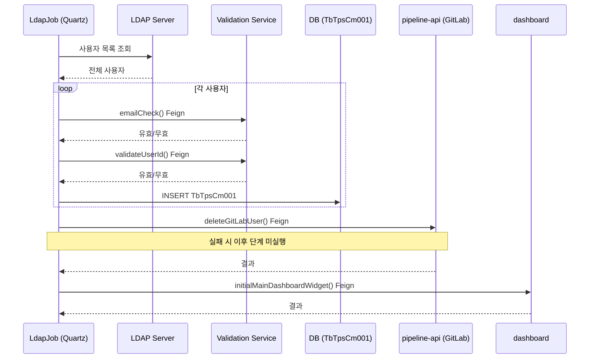
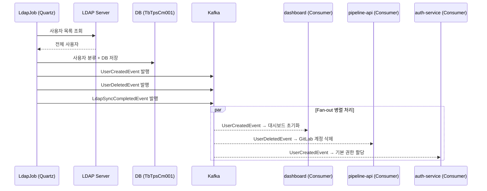

# H4. LDAP 사용자 동기화 EDA 전환

LDAP 사용자 동기화는 TPS 스케줄러의 핵심 배치 작업이다. 현재는 7단계 동기 프로세스에 4개의 Feign 호출이 순차적으로 엮여 있어, 한 단계가 실패하면 이후 단계 전체가 중단되는 연쇄 실패 구조를 가진다. 이 문서는 그 구조를 진단하고, EDA Fan-out 패턴으로 전환했을 때 무엇이 달라지는지를 설명한다.

---

## 1. 현재 7단계 동기 프로세스 + 4개 Feign

### 1.1 동기화 흐름

**코드 경로**:
- `scheduler/.../quartz/job/LdapJob.java`
- `scheduler/.../userMng/service/impl/UserMngServiceImpl.java`
- `scheduler/.../feign/PipelineFeignClient.java`

동기화는 Quartz 스케줄러가 트리거하며, 아래 7단계를 순서대로 실행한다.

1. **LDAP 조회**: `LdapTemplate`으로 LDAP 서버에서 전체 사용자 목록을 가져온다.
2. **이메일 검증**: `LdapFeignClient.emailCheck()`를 호출해 각 사용자의 이메일 유효성을 확인한다. (Feign #1)
3. **임시 테이블 등록**: 검증을 통과한 신규 사용자를 `TbTpsCm045` 임시 테이블에 INSERT한다.
4. **사용자 ID 검증**: `LdapFeignClient.validateUserId()`로 사용자 ID의 유효성을 재확인한다. (Feign #2)
5. **정식 등록**: 검증된 신규 사용자를 `TbTpsCm001` 사용자 마스터 테이블에 INSERT한다.
6. **변경 동기화**: 기존 사용자 중 변경된 필드를 업데이트하고, LDAP에서 제거된 사용자를 soft delete 처리한다.
7. **후처리**:
   - LDAP에서 삭제된 사용자 → `PipelineFeignClient.deleteGitLabUser()` 호출 (Feign #3)
   - 신규 사용자 → `MainDashboardFeignClient.initialMainDashboardWidget()` 호출 (Feign #4)

### 1.2 Feign 클라이언트 상세

| # | Feign 클라이언트 | 대상 서비스 | 용도 | 실패 시 동작 |
|---|----------------|-----------|------|------------|
| 1 | `LdapFeignClient.emailCheck()` | validation | 이메일 유효성 확인 | 해당 사용자 스킵 |
| 2 | `LdapFeignClient.validateUserId()` | validation | 사용자 ID 유효성 확인 | 해당 사용자 스킵 |
| 3 | `PipelineFeignClient.deleteGitLabUser()` | pipeline-api | GitLab 계정 삭제 | 에러 로그 → `TbTpsCm047` |
| 4 | `MainDashboardFeignClient.initialMainDashboardWidget()` | dashboard | 대시보드 초기화 | 에러 로그 → `TbTpsCm047` |

### 1.3 에러 처리

실패한 항목은 `TbTpsCm047` 에러 테이블에 기록되고, 트랜잭션 롤백은 발생하지 않는다. 그 결과 "일부 사용자는 DB에 등록됐지만 GitLab 계정은 미삭제"처럼 서비스 간 상태 불일치가 조용히 쌓인다. 특히 6단계(GitLab 삭제)가 실패하면 7단계(대시보드 초기화)는 아예 실행되지 않는데, 이는 단순한 에러 로깅이 아니라 비즈니스 로직의 누락이다.

### 1.4 현재 흐름 문제점

**문제 1: 부분 실패 복구 불가.**
6단계 실패 시 7단계가 미실행된다. 에러 테이블에 기록되지만, 수동으로 해당 사용자를 찾아 재처리하지 않으면 영구 방치된다.

**문제 2: 동기 체인으로 인한 전체 지연.**
4개의 Feign 호출이 순차적으로 실행된다. validation 서비스나 pipeline-api가 느려지면 동기화 전체가 그 시간을 기다린다.

**문제 3: 다중 인스턴스 경합.**
scheduler가 여러 인스턴스로 실행될 때 동시에 LDAP 동기화가 시작되면 동일 사용자가 중복 처리될 수 있다.

**문제 4: 재시도 없음.**
Feign 실패 시 해당 건은 스킵되고 다음 스케줄 실행 시까지 방치된다.



---

## 2. EDA 전환 후 Fan-out 이벤트 흐름

### 2.1 동기화 시작

EDA 전환 후에도 LDAP 조회와 DB 저장은 scheduler에서 수행한다. 달라지는 것은 그 이후다. 사용자를 신규/수정/삭제로 분류한 뒤, 각 분류에 맞는 이벤트를 Kafka에 발행하고 스케줄러의 책임은 거기서 끝난다. 실제 후처리(GitLab 삭제, 대시보드 초기화)는 각 서비스가 이벤트를 구독해서 독립적으로 처리한다.

### 2.2 Fan-out 이벤트 구조

**신규 사용자 → `UserCreatedEvent`:**
- dashboard 서비스: 대시보드 위젯 초기화
- 권한 서비스: 기본 권한 할당
- 알림 서비스: 환영 알림 발송

**삭제 사용자 → `UserDeletedEvent`:**
- pipeline-api: GitLab 계정 삭제
- 권한 서비스: 권한 회수

**수정 사용자 → `UserModifiedEvent`:**
- 변경 내용에 관심 있는 서비스만 consume

**동기화 완료 → `LdapSyncCompletedEvent`:**
- 감사 로그, 모니터링 대시보드

### 2.3 핵심 변화

4개의 Feign 호출이 사라지고 이벤트 발행으로 대체된다. 순차 실행이었던 후처리가 병렬 Fan-out으로 바뀐다. 가장 중요한 변화는 실패 격리다. GitLab 삭제가 실패해도 대시보드 초기화는 정상적으로 완료된다. 두 컨슈머가 서로의 성공/실패를 모르기 때문이다.



---

## 3. 이벤트 스키마 정의

모든 이벤트는 `eventId`, `eventType`, `timestamp`, `correlationId`를 공통 헤더로 가진다. `correlationId`는 하나의 동기화 배치를 추적하는 키다. 예를 들어 `sync-20260225`로 발행된 모든 이벤트는 같은 동기화 배치에서 비롯됐다고 추적할 수 있다.

### LdapSyncInitiatedEvent

동기화 시작 시점을 기록하고, 이후 발행될 이벤트 수를 예고한다.

```json
{
  "eventId": "uuid",
  "eventType": "LDAP_SYNC_INITIATED",
  "timestamp": "2026-02-25T02:00:00Z",
  "correlationId": "sync-20260225",
  "payload": {
    "syncId": "SYNC-001",
    "totalUsers": 150,
    "newUsers": 5,
    "modifiedUsers": 12,
    "deletedUsers": 2
  }
}
```

### UserCreatedEvent

신규 사용자 등록 시 발행된다. `requiresDashboardInit`, `requiresGitLabAccount` 필드로 각 컨슈머가 자신이 처리해야 할 작업인지 판단할 수 있다.

```json
{
  "eventId": "uuid",
  "eventType": "USER_CREATED",
  "timestamp": "2026-02-25T02:00:05Z",
  "correlationId": "sync-20260225",
  "payload": {
    "userId": "user-new-001",
    "email": "new@company.com",
    "ldapSn": "CN=New User,OU=Dev,DC=company,DC=com",
    "source": "LDAP",
    "department": "DEV",
    "requiresDashboardInit": true,
    "requiresGitLabAccount": true
  }
}
```

### UserDeletedEvent

LDAP에서 제거된 사용자가 확인될 때 발행된다. 삭제 이유(`reason`)를 명시하면 컨슈머가 처리 방식을 달리할 수 있다. 예를 들어 `LDAP_REMOVED`와 `MANUAL_DEACTIVATION`은 GitLab 처리 여부가 다를 수 있다.

```json
{
  "eventId": "uuid",
  "eventType": "USER_DELETED",
  "timestamp": "2026-02-25T02:00:10Z",
  "correlationId": "sync-20260225",
  "payload": {
    "userId": "user-old-001",
    "reason": "LDAP_REMOVED",
    "requiresGitLabDeletion": true,
    "requiresPermissionRevoke": true
  }
}
```

### UserModifiedEvent

변경된 필드만 `changes`에 담아 발행한다. 컨슈머는 자신이 관심 있는 필드 변경 여부를 확인한 후 처리 여부를 결정한다.

```json
{
  "eventId": "uuid",
  "eventType": "USER_MODIFIED",
  "timestamp": "2026-02-25T02:00:15Z",
  "correlationId": "sync-20260225",
  "payload": {
    "userId": "user-001",
    "changes": {
      "email": { "from": "old@company.com", "to": "new@company.com" },
      "department": { "from": "DEV", "to": "QA" }
    }
  }
}
```

### LdapSyncCompletedEvent

동기화 배치 전체가 완료된 후 발행된다. `failedCount`가 0보다 크면 모니터링 알림을 트리거하는 데 활용할 수 있다.

```json
{
  "eventId": "uuid",
  "eventType": "LDAP_SYNC_COMPLETED",
  "timestamp": "2026-02-25T02:00:45Z",
  "correlationId": "sync-20260225",
  "payload": {
    "syncId": "SYNC-001",
    "newCount": 5,
    "modifiedCount": 12,
    "deletedCount": 2,
    "failedCount": 0,
    "duration": 45000
  }
}
```

---

## 4. 고려사항

### 4.1 멱등성

EDA에서 컨슈머는 같은 이벤트를 두 번 받을 수 있다. at-least-once 전달 보장 때문이다. 각 컨슈머는 이를 대비해야 한다.

- **대시보드 초기화**: 이미 초기화된 사용자에게 재시도 시 upsert로 처리한다. 중복 실행이 상태를 오염시키지 않도록 설계한다.
- **GitLab 계정 삭제**: GitLab API가 404를 반환하면 이미 삭제된 것이므로 성공으로 처리한다.
- **중복 이벤트 방지**: `(correlationId + userId + eventType)` 복합 키로 `ProcessedEvent` 테이블에 preemptive acquire를 수행한다. `INSERT ... WHERE NOT EXISTS`를 사용하면 예외 없이 0(중복) 또는 1(신규)을 반환하므로, Hibernate 세션 오염 없이 처리할 수 있다.

preemptive acquire 패턴을 적용하면 check-then-act 패턴의 동시성 문제를 피할 수 있다. 자세한 내용은 `08-redpanda` Ch03 멱등성 섹션을 참고한다.

### 4.2 순서 보장

같은 사용자에 대해 CREATED → MODIFIED → DELETED 순서가 뒤바뀌면 문제가 생긴다. 파티션 키를 `userId`로 설정하면 같은 사용자의 이벤트는 항상 같은 파티션에 들어가므로 파티션 내 순서가 보장된다. 단일 동기화 배치 안에서도 `syncId` 기반 정렬을 유지하는 것이 좋다.

### 4.3 부분 실패 복구

현재 구조에서는 GitLab 삭제(6단계)가 실패하면 대시보드 초기화(7단계)가 아예 실행되지 않는다. 하나의 실패가 관련 없는 다른 작업을 막는 연쇄 실패 구조다.

EDA 전환 후에는 각 컨슈머가 독립적으로 재시도한다. GitLab 삭제가 3회 실패하면 해당 이벤트만 `tps.user.sync.dlq`로 이동하고, 대시보드 초기화 컨슈머는 영향을 받지 않는다. DLQ에 쌓인 이벤트는 관리자 대시보드에서 수동으로 재처리할 수 있다.

`LdapSyncCompletedEvent`의 `failedCount` 필드로 동기화 배치의 실패 건수를 집계할 수 있어 모니터링도 단순해진다.

### 4.4 다중 인스턴스 경합 방지

scheduler 인스턴스가 여러 개 실행될 때, 모든 인스턴스가 동시에 LDAP 동기화를 시작하면 동일 사용자가 중복 처리된다. 이를 막는 방법은 두 가지다.

**방법 1**: Quartz 클러스터 모드를 활성화한다. 이미 TPS에서 사용 중이라면 추가 구현 없이 해결된다. 클러스터 모드에서는 하나의 인스턴스만 Job을 실행한다.

**방법 2**: 동기화 시작 시 Redis 또는 DB 기반 분산 락을 획득한다. 락 획득에 실패한 인스턴스는 해당 회차를 스킵한다.

컨슈머 레벨에서는 `syncId` 중복 체크로 같은 배치를 두 번 처리하는 것을 방지한다.

### 4.5 검증 로직 이동

현재 `emailCheck()`와 `validateUserId()`는 외부 서비스를 Feign으로 호출한다. 이 검증 로직을 scheduler 내부로 이동하면 Feign 2개를 추가로 제거할 수 있다. 검증 규칙이 단순하다면 이 방향이 더 낫다.

검증 규칙이 복잡하거나 다른 서비스에서도 공유해야 한다면, 검증을 별도 Kafka 컨슈머로 분리하는 방법도 있다. 이 경우 `UserValidationRequestedEvent` → `UserValidatedEvent` 흐름의 Request-Reply 패턴을 적용한다. 다만 이는 복잡도를 높이므로, 실제 공유 필요성이 확인된 후에 도입하는 것이 적절하다.

### 4.6 프론트엔드 영향

LDAP 동기화는 배치 작업이라 프론트엔드에 즉각적인 영향은 없다. 하지만 관리자 화면에서 동기화 결과를 실시간으로 보여주고 싶다면 `LdapSyncCompletedEvent`를 SSE로 브라우저에 푸시할 수 있다. "신규 사용자 5명 동기화 완료" 형태의 알림으로 충분하다. 사용자 목록 화면은 이 이벤트 수신 시 자동으로 갱신하도록 연결할 수도 있다.

---

## 5. Before/After 비교

| 항목 | Before (현재) | After (EDA) |
|------|-------------|-------------|
| 실행 방식 | 7단계 순차 동기 | 분류 후 Fan-out 병렬 |
| Feign 호출 수 | 4개 (순차 블로킹) | 0개 (전부 이벤트 대체) |
| 부분 실패 | 연쇄 실패 (6단계 실패 → 7단계 미실행) | 독립 재시도 (컨슈머 간 격리) |
| 재시도 전략 | 없음 (다음 스케줄까지 방치) | 자동 재시도 + DLQ |
| 에러 추적 | `TbTpsCm047` 에러 테이블 | DLQ + 모니터링 대시보드 |
| 처리 성능 | 단일 스레드 순차 | 컨슈머 병렬 처리 |
| 다중 인스턴스 경합 | 대비 없음 | 분산 락 + syncId 중복 체크 |
| 검증 의존성 | Feign 2회 (외부 서비스 의존) | scheduler 내부 로직으로 이동 가능 |

현재 구조의 핵심 문제는 "하나의 실패가 관련 없는 다른 작업을 막는다"는 점이다. GitLab 삭제와 대시보드 초기화는 서로 의존 관계가 없는데도, 같은 트랜잭션 흐름에 묶여 있기 때문에 함께 실패한다. EDA 전환은 이 결합을 끊는다. 각 서비스는 자신의 이벤트를 자신의 속도로 소비하고, 실패는 자신의 범위 안에서 해결한다.
