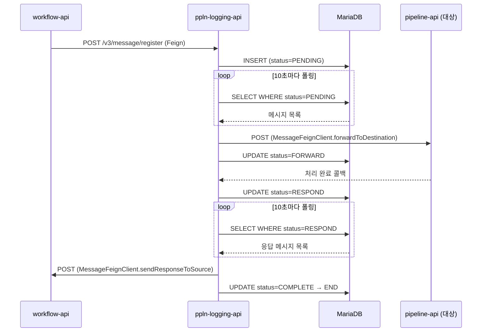
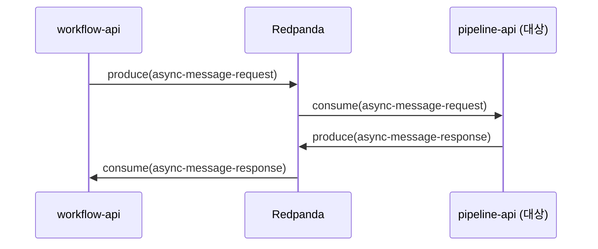

# 08. ppln-logging-api 심층 분석: DB-as-Broker 패턴과 Redpanda 전환

## 문서 목적

기존 01~07 문서에서 가장 적게 다뤄진 ppln-logging-api 모듈을 코드 레벨에서 분석한다. 이 모듈은 MariaDB를 메시지 브로커로 사용하는 독특한 패턴을 갖고 있어, Redpanda 도입 시 가장 극적인 개선 효과를 기대할 수 있다.

**분석 대상**: `ppln-logging-api/src/main/java/org/okestro/tps/api/v3/`
**핵심 발견**: 834줄 MessageService가 DB 폴링 기반 상태머신으로 동작하며, Redpanda 토픽으로 대체하면 모듈 핵심 로직의 절반 이상을 제거할 수 있다.

---

## 1. 모듈 아키텍처 개요

ppln-logging-api는 TPS 시스템에서 **중계 브로커** 역할을 수행한다. workflow-api가 pipeline-api에 비동기 메시지를 보낼 때, 직접 호출하지 않고 ppln-logging-api를 경유하는 구조다.

### 1.1 이중 구조 (v2/v3)

v2는 레거시 API를 유지하고, v3가 현재 활성 아키텍처다. v3에서 MessageService, 스케줄러, 분산 락이 모두 동작한다.

### 1.2 4개 스케줄러

| 스케줄러 | 파일 | 주기 | 락 그룹 |
|---------|------|------|---------|
| MessageTaskScheduler | `v3/application/scheduler/message/` | 10초 | MESSAGE_GROUP |
| PipelineTaskScheduler | `v3/application/scheduler/pipeline/` | 10초 | PIPELINE_GROUP |
| ReservationScheduler | `v3/domain/reservation/` | 별도 | RESERVATION_GROUP |
| ScheduleLockHandler | `v3/domain/scheduler/` | 60초 (하트비트) | 전체 |

4개 모두 DB 기반 분산 락(ScheduleLockHandler)을 사용하여 다중 인스턴스 환경에서 단일 실행을 보장한다.

### 1.3 Feign 클라이언트 9개

ppln-logging-api는 9개의 Feign 클라이언트를 통해 외부 모듈과 통신한다. 이 중 MessageFeignClient가 브로커 역할의 핵심이다.

```
ppln-logging-api Feign Clients (9)
├── MessageFeignClient          ← 메시지 전달/응답 (브로커 핵심)
├── TcktLogFeignClient          ← 티켓 이력 기록
├── PipelineApiFeignClient      ← 파이프라인 상태 동기화, PRD 실행
├── JenkinsUseCase (내부)        ← Jenkins API 호출
└── 기타 5개 (v2 레거시 포함)
```

---

## 2. UC-1: DB-as-Queue 제거 (핵심 유스케이스)

**현재 상태**: MessageService 834줄이 MariaDB를 메시지 큐처럼 사용한다.
**기대 효과**: 834줄 상태머신 + 126줄 스케줄러 + 135줄 락 핸들러 = ~1,100줄 제거 가능

### 2.1 현재 패턴: DB 기반 상태머신

MessageService.java(834줄)는 5단계 상태머신으로 동작한다.

```
PENDING → FORWARD → (대상 모듈 처리) → RESPOND → COMPLETE → END
                                          ↓
                                       FAILURE → 재시도 또는 MAX_RETRY
                                          ↓
                                    RESPONSE_FAILED (CSPNF) → 소스 응답 재시도 (5회)
```

**상태별 처리 메서드** (MessageService.java):

| 상태 | 메서드 | 라인 | 설명 |
|------|--------|------|------|
| PENDING | `processPendingMessages()` | L158-216 | DB에서 PENDING 메시지 조회, 대상 모듈로 Feign 전달 |
| FAILURE | `processFailedMessages()` | L220-261 | 실패 메시지 재시도 또는 최대 재시도 초과 처리 |
| RESPOND | `processRespondMessages()` | L317-374 | 대상 응답 수신, 소스 모듈로 Feign 전달 |
| TIMEOUT | `processTimeoutMessages()` | L378-439 | 응답 대기 시간 초과 메시지 처리 |
| CSPNF | `processCspnfRetryMessages()` | L751-834 | 소스 응답 실패 시 5회 재시도 |

### 2.2 10초 DB 폴링

MessageTaskScheduler.java(126줄)가 10초마다 DB를 폴링하여 상태별 메시지를 처리한다.

```java
// MessageTaskScheduler.java L42-45
scheduleWithFixedDelay(
    () -> processMessageTasks(),
    10_000  // 10초 간격
);
```

**처리 우선순위** (MessageTaskScheduler.java L66-81):

```
1순위: CSPNF_RETRY    (소스 응답 실패 재시도)
2순위: TIMEOUT        (응답 대기 시간 초과)
3순위: FAILED         (대상 전달 실패 재시도)
4순위: RESPOND        (대상 응답 → 소스 전달)
5순위: PENDING        (신규 메시지 → 대상 전달)
```

### 2.3 분산 락: ScheduleLockHandler

다중 인스턴스 환경에서 메시지 중복 처리를 방지하기 위해 DB 기반 분산 락을 사용한다.

**ScheduleLockHandlerImpl.java** (135줄):
- `acquireGroupLock()` (L45-67): DB에서 락 획득 시도
- `executeHeartbeat()` (L89-114): 60초마다 락 갱신, 만료된 락 EXPIRE 처리
- `forceAcquireGroupLock()` (L117-133): 강제 락 획득 (장애 복구용)

### 2.4 메시지 흐름 (현재)



이 흐름에서 **최소 2회의 10초 폴링 대기**가 발생한다. 메시지 등록 후 PENDING 조회까지 최대 10초, 응답 수신 후 RESPOND 조회까지 최대 10초로, 순수 전달 지연만 최대 20초에 달한다.

### 2.5 Redpanda 대체 설계



**제거 대상**:

| 클래스 | 줄 수 | 제거 사유 |
|--------|-------|----------|
| MessageService.java | 834 | 상태머신 전체가 토픽 소비로 대체 |
| MessageTaskScheduler.java | 126 | DB 폴링 불필요 |
| ScheduleLockHandlerImpl.java | 135 | Consumer Group이 분산 처리 보장 |
| MessageFeignClient.java | 42 | Kafka Producer로 대체 |
| **합계** | **~1,137** | |

**정량적 효과**:

| 지표 | 현재 | Redpanda 도입 후 |
|------|------|-----------------|
| 메시지 전달 지연 | 최대 20초 (2회 폴링) | <100ms |
| DB 폴링 쿼리 | 5종류 × 10초 = 분당 30회 | 0회 |
| 상태머신 코드 | 834줄 | 제거 |
| 분산 락 | DB 기반 하트비트 60초 | Consumer Group 자동 관리 |
| 장애 복구 | 수동 forceAcquire | Consumer 리밸런싱 자동 |

### 2.6 토픽 설계

```
tps.async-message.request    (workflow → pipeline)
  - key: correlationId
  - partitions: 6
  - retention: 7d

tps.async-message.response   (pipeline → workflow)
  - key: correlationId
  - partitions: 6
  - retention: 7d
```

기존 `core-lib`에 `AsyncMessageRequest.avsc` 스키마가 이미 존재하므로, 토픽 메시지 포맷은 그대로 활용 가능하다.

---

## 3. UC-2: 파이프라인 상태 폴링 제거

**현재 상태**: PipelineTaskScheduler가 10초마다 Jenkins API를 폴링하여 상태를 동기화한다.
**기대 효과**: Jenkins 콜백 + Redpanda 토픽으로 폴링 제거, 상태 전파 지연 10초→실시간

### 3.1 현재 패턴

PipelineTaskScheduler.java(119줄)가 10초마다 3단계 작업을 실행한다.

**처리 순서** (PipelineTaskScheduler.java L70-80):

```
1순위: LOG_COLLECTION   (파이프라인 로그 수집)
2순위: PIPELINE_SYNC    (Jenkins 상태 동기화)
3순위: TRIGGER_SYNC     (트리거 상태 동기화, 워크플로우 완료 처리)
```

PipelineWriterImpl.java(340줄)의 `syncPipelineStatus()` (L54-87)에서:
1. Jenkins API로 파이프라인 현재 상태 조회 (L69-74)
2. 상태 변경 감지 시 DB 업데이트 (L116-229)
3. 24시간 미동기화 파이프라인 자동 회수 (L60, `autoRetractionHandler()`)
4. ArgoCD 배포 승인 대기 확인 (L153-186)

### 3.2 4홉 통신 체인

```
Jenkins API → ppln-logging-api(폴링) → DB 업데이트 → pipeline-api Feign → workflow-api
```

이 체인에서 Jenkins 상태가 변경되어도, ppln-logging-api가 다음 폴링 주기(최대 10초)에 감지할 때까지 전파되지 않는다.

### 3.3 Redpanda 대체 설계

```
Jenkins Pipeline post { always { ... } }
  → webhook → pipeline-api
  → produce(tps.pipeline.status-changed)
  → consumers: ppln-logging-api, workflow-api, frontend(SSE)
```

**제거/간소화 대상**:

| 클래스 | 현재 줄 | 변경 |
|--------|---------|------|
| PipelineTaskScheduler.java | 119 | PIPELINE_SYNC 단계 제거 |
| PipelineWriterImpl.syncPipelineStatus() | ~80 | 이벤트 소비자로 전환 |

---

## 4. UC-3: 감사 이력 보장 전달

**현재 상태**: TcktHstryHandlerImpl이 Feign 실패 시 catch+log만 수행하여 감사 이력이 유실된다.
**기대 효과**: at-least-once 전달 보장으로 감사 이력 유실 제로화

### 4.1 현재 패턴: Silent Failure

TcktHstryHandlerImpl.java(52줄)의 핵심 로직:

```java
// TcktHstryHandlerImpl.java L28-36
public void recordTcktHstry(RecordTcktHystryDto command) {
    TpsResponse<?> response = null;
    try {
        response = tcktLogFeignClient.recordTcktHstry(request);
    } catch (Exception e) {
        log.error("[TcktLogHandlerImpl] recordTcktLog error", e);
        // L31: catch + log만, rethrow 없음 → 감사 이력 유실
    }
    if (response != null && !SUCCESS.equals(response.getRsltCd())) {
        log.warn("[TcktLogHandlerImpl] recordTcktLog error", response.getRsltCd());
        // L35: warn + 계속 진행 → 응답 실패도 무시
    }
}
```

Feign 호출이 실패해도 예외를 던지지 않으므로, 메인 비즈니스 로직은 영향받지 않지만 **감사 이력이 영구적으로 유실**된다. 이 설계는 감사 기록보다 메인 플로우 안정성을 우선한 의도적 선택이지만, 컴플라이언스 관점에서 위험 요소다.

### 4.2 이벤트 리스너 계층

TcktHstryEventListener.java(85줄)는 3가지 트랜잭션 컨텍스트를 처리한다:

| 메서드 | 트랜잭션 페이즈 | 용도 |
|--------|---------------|------|
| `handleTcktHstryNoTransaction()` (L32) | 트랜잭션 없음 | `REQUIRES_NEW`로 새 트랜잭션 생성 |
| `handleTcktHstryCommit()` (L43) | AFTER_COMMIT | 커밋 성공 후 이력 기록 |
| `handleTcktHstryRollback()` (L58) | AFTER_ROLLBACK | 롤백 후 실패 이력 기록 |

### 4.3 Redpanda 대체 설계

```
@TransactionalEventListener(AFTER_COMMIT)
  → produce(tps.audit.ticket-history)   // Outbox 패턴 권장
  → consumer: 감사 이력 서비스

실패 시: DLQ → 재처리 (at-least-once 보장)
```

기존 `TcktHstryHandlerImpl`의 catch+log 패턴 대신, Redpanda 토픽의 at-least-once 전달 보장과 DLQ를 활용하면 감사 이력 유실을 원천 차단할 수 있다. catch+log 패턴이 제공하던 "메인 플로우 비차단" 특성은 비동기 토픽 발행으로 자연스럽게 유지된다.

---

## 5. UC-4: 예약 실행 Thread.sleep 제거

**현재 상태**: ReservationWriterImpl에서 Thread.sleep(3000) × 최대 10회 = 최대 30초 블로킹
**기대 효과**: 이벤트 기반 비동기 처리로 스레드 블로킹 제거

### 5.1 현재 패턴: 동기 폴링 루프

ReservationWriterImpl.java(139줄)의 `threadExecuteTrigger()` 메서드:

```java
// ReservationWriterImpl.java L104-125
private boolean threadExecuteTrigger(String scheduleUser, TriggerSelectParamVo param) {
    boolean executeAt = false;
    int retryCount = 0;
    int maxRetries = 10;
    long waitTime = 3000;  // 3초

    while (!executeAt && (retryCount < maxRetries)) {
        executeAt = this.executePrdTrigger(scheduleUser, param);
        if (!executeAt) {
            Thread.sleep(waitTime);  // L116: 3초 블로킹
            retryCount++;
        }
    }
    return executeAt;
}
```

`executePrdTrigger()`는 내부적으로 `pipelineApiFeignClient.executePrdPipeline()` (L131)을 호출한다. Feign 호출이 실패하면 `FeignException`을 catch하고 false를 반환하여(L136-138) 재시도를 유발한다.

이 패턴의 문제점:
- **스레드 블로킹**: RESERVATION_GROUP 스케줄러 스레드가 최대 30초 점유
- **고정 대기**: 지수 백오프 없이 3초 고정 대기
- **자원 낭비**: 성공하더라도 최소 1회 Feign 호출 + 응답 대기

### 5.2 Redpanda 대체 설계

```
예약 시간 도래
  → produce(tps.reservation.execute-trigger)
  → pipeline-api consumer: executePrdPipeline 처리
  → produce(tps.reservation.execute-result)
  → ppln-logging-api consumer: 결과 기록

실패 시: 지수 백오프 재시도 (1s → 2s → 4s → 8s → DLQ)
```

Thread.sleep 루프 대신 Kafka Consumer의 재시도 메커니즘을 활용하면, 스레드를 블로킹하지 않으면서도 지수 백오프로 더 효율적인 재시도가 가능하다.

---

## 6. 도입 준비도

ppln-logging-api는 이미 Redpanda 도입을 위한 기반이 일부 갖춰져 있다.

### 6.1 기존 의존성 (build.gradle)

```groovy
// ppln-logging-api/build.gradle L120
implementation 'org.apache.avro:avro:1.11.3'
```

Avro 런타임 의존성이 이미 포함되어 있다. Avro 클래스 생성은 `core-lib`에서 수행하며, ppln-logging-api는 생성된 클래스를 런타임에 사용한다.

### 6.2 core-lib Avro 스키마

`core-lib`에 `AsyncMessageRequest.avsc`가 이미 정의되어 있어, DB-as-Queue 패턴을 토픽 기반으로 전환할 때 메시지 포맷을 새로 설계할 필요가 없다.

### 6.3 전환 우선순위

| 순위 | 유스케이스 | 효과 | 난이도 | 근거 |
|------|----------|------|--------|------|
| P0 | UC-1 (DB-as-Queue 제거) | 극대 | 중 | 1,100줄 제거, 지연 20초→<100ms |
| P0 | UC-3 (감사 보장) | 높음 | 낮 | 컴플라이언스 필수, 코드 변경 최소 |
| P1 | UC-2 (파이프라인 폴링) | 높음 | 중 | Jenkins 콜백 연동 필요 |
| P2 | UC-4 (예약 Thread.sleep) | 중간 | 낮 | 스레드 블로킹만 해소 |

---

## 7. 기존 문서 참조

이 문서에서 다루는 유스케이스와 기존 문서의 연결 관계:

| 이 문서 | 관련 기존 문서 | 보충 내용 |
|---------|--------------|----------|
| UC-1 (DB-as-Queue) | 01 (Feign 매핑) | Feign 9개 중 MessageFeignClient 상세 분석 |
| UC-2 (파이프라인 폴링) | 04 (파이프라인 실행) | ppln-logging 측 폴링 메커니즘 상세 |
| UC-3 (감사 보장) | 03 (티켓↔파이프라인), 06 (M3) | TcktHstryHandler 코드 레벨 분석 |
| UC-4 (예약 실행) | 해당 없음 | 기존 문서에서 미다룸, 완전 신규 |

> **참고**: 기존 04 문서는 pipeline-api 관점에서 파이프라인 실행을 분석했다면, 이 문서의 UC-2는 ppln-logging-api 관점에서 동일 흐름의 다른 측면을 다룬다.
