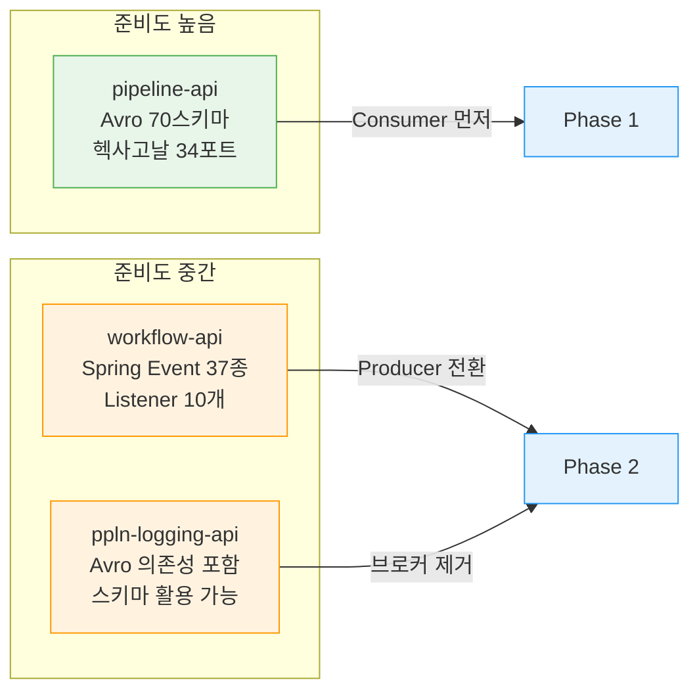

# 09. Redpanda 도입 우선순위 로드맵: 3모듈 교차 분석

## 문서 목적

ppln-logging-api, pipeline-api, workflow-api 3개 모듈의 실제 코드를 교차 분석하여, Redpanda 도입의 우선순위와 단계별 마이그레이션 로드맵을 제시한다. 기존 01~07 문서에서 개별적으로 다뤘던 유스케이스를 **정량적 효과**와 **도입 준비도** 기준으로 통합 정리한다.

---

## 1. 3모듈 현재 통신 구조

### 1.1 Feign 클라이언트 전수 조사

TPS 시스템 전체에서 43개의 Feign 클라이언트가 모듈 간 동기 통신을 담당한다. 3개 핵심 모듈의 분포는 다음과 같다.

| 모듈 | Feign 수 | 주요 호출 대상 |
|------|---------|--------------|
| pipeline-api | 19 | Jenkins, ArgoCD, Harbor, SonarQube, Sparrow, ppln-logging, workflow |
| ppln-logging-api | 9 | pipeline-api, workflow-api (메시지 중계), Jenkins |
| workflow-api | 8 | pipeline-api, ppln-logging-api, pms-api, common-api |
| common-api | 5 | JWT, 모니터링, 인증 |
| pms-api | 2 | pipeline-api |
| **합계** | **43** | |

pipeline-api가 전체의 44%를 차지한다. 외부 DevOps 도구(Jenkins, ArgoCD, SonarQube 등)와의 연동이 집중되어 있기 때문이다.

### 1.2 모듈 간 통신 다이어그램

```mermaid
graph TB
    subgraph "workflow-api"
        W_DOMAIN["도메인 로직<br>(37 ApplicationEvent)"]
        W_FEIGN["Feign Clients (8)"]
        W_LISTENER["@TransactionalEventListener (10)"]
    end

    subgraph "ppln-logging-api"
        P_MSG["MessageService<br>(834줄 상태머신)"]
        P_SCHED["4개 스케줄러<br>(10초 폴링)"]
        P_LOCK["ScheduleLockHandler<br>(DB 분산 락)"]
        P_FEIGN["Feign Clients (9)"]
    end

    subgraph "pipeline-api"
        PI_HEX["헥사고날 아키텍처<br>(34 포트)"]
        PI_AVRO["Avro 스키마<br>(70개)"]
        PI_FEIGN["Feign Clients (19)"]
    end

    subgraph "외부 시스템"
        JENKINS["Jenkins"]
        ARGOCD["ArgoCD"]
        SONAR["SonarQube"]
    end

    W_DOMAIN -->|"Spring Event"| W_LISTENER
    W_LISTENER -->|"Feign"| P_MSG
    P_MSG -->|"Feign (중계)"| PI_HEX
    PI_HEX -->|"콜백 Feign"| P_MSG
    P_MSG -->|"Feign (응답)"| W_FEIGN

    P_SCHED -->|"10초 폴링"| JENKINS
    PI_FEIGN --> JENKINS
    PI_FEIGN --> ARGOCD
    PI_FEIGN --> SONAR

    style P_MSG fill:#ffe0e0,stroke:#cc0000,color:#333
    style P_SCHED fill:#ffe0e0,stroke:#cc0000,color:#333
    style P_LOCK fill:#fff3e0,stroke:#ff9800,color:#333
```

**빨간색 영역**이 Redpanda 도입 시 가장 큰 변화가 발생하는 부분이다. ppln-logging-api의 DB 기반 메시지 브로커(MessageService + 스케줄러)가 Redpanda 토픽으로 대체된다.

### 1.3 동기 체인 문제점

현재 workflow-api → ppln-logging-api → pipeline-api 체인에서 발생하는 문제를 모아 보면:

1. **지연 누적**: Feign 호출 + DB 폴링(10초) + Feign 호출 = 최대 20초+ 전달 지연
2. **장애 전파**: 한 모듈 다운 시 전체 체인 실패
3. **데이터 유실**: catch+log 패턴으로 감사 이력 유실 (TcktHstryHandlerImpl)
4. **자원 낭비**: Thread.sleep(3000) × 10회 블로킹 (ReservationWriterImpl)
5. **확장 제약**: DB 기반 분산 락으로 스케줄러 단일 인스턴스 제약

---

## 2. 우선순위별 유스케이스 종합

### 2.1 P0: 즉시 도입 (1~2주)

가장 높은 ROI를 가진 유스케이스. 인프라 구축과 동시에 착수 가능하다.

#### P0-1: DB-as-Queue 제거 (08 문서 UC-1)

| 항목 | 내용 |
|------|------|
| **모듈** | ppln-logging-api |
| **현재** | MessageService 834줄 상태머신 + 10초 DB 폴링 + DB 분산 락 |
| **대체** | `tps.async-message.request/response` 토픽, 직접 produce/consume |
| **제거량** | ~1,100줄 (MessageService + MessageTaskScheduler + ScheduleLockHandler) |
| **효과** | 메시지 지연 20초 → <100ms, DB 폴링 분당 30회 → 0회 |
| **관련 문서** | 08-ppln-logging-db-broker-analysis.md (UC-1) |

#### P0-2: 감사 이력 보장 (08 문서 UC-3 + 06 문서 M3 보충)

| 항목 | 내용 |
|------|------|
| **모듈** | ppln-logging-api, workflow-api |
| **현재** | TcktHstryHandlerImpl catch+log (L30-31), Feign 실패 시 감사 유실 |
| **대체** | `tps.audit.ticket-history` 토픽, at-least-once 보장 + DLQ |
| **효과** | 감사 유실률 Feign 실패율 → 0% |
| **관련 문서** | 06-medium-priority-candidates.md (M3), 08 (UC-3) |

06 문서의 M3(감사 로그 중앙화)와 08 문서의 UC-3은 같은 문제의 다른 측면이다. M3은 모듈 분산 감사 로그의 중앙화 설계를, UC-3은 ppln-logging-api 코드 레벨의 유실 패턴을 다룬다. 이 둘을 함께 구현하면 감사 시스템이 완성된다.

#### P0-3: 알림 파이프라인 신뢰성 (06 문서 M1 보충)

| 항목 | 내용 |
|------|------|
| **모듈** | workflow-api |
| **현재** | @TransactionalEventListener → 동기 알림 전송, 실패 시 재시도 없음 |
| **대체** | `tps.notification.requested` 토픽, SSE/Email/Slack 소비자 분리 |
| **효과** | 알림 전송 실패 시 자동 재시도, 채널별 독립 확장 |
| **관련 문서** | 06-medium-priority-candidates.md (M1) |

### 2.2 P1: 핵심 비즈니스 (3~4주)

비즈니스 로직 변경이 수반되어 충분한 테스트가 필요한 유스케이스.

#### P1-1: 파이프라인 상태 이벤트 (08 문서 UC-2 + 04 문서 보충)

| 항목 | 내용 |
|------|------|
| **모듈** | ppln-logging-api, pipeline-api |
| **현재** | PipelineTaskScheduler 10초 폴링 → Jenkins API → DB → Feign (4홉) |
| **대체** | Jenkins 콜백 → `tps.pipeline.status-changed` 토픽 → 팬아웃 |
| **효과** | 상태 전파 지연 10초 → 실시간, Jenkins API 부하 감소 |
| **관련 문서** | 04-pipeline-execution-eda.md, 08 (UC-2) |

04 문서가 pipeline-api 관점에서 10단계 동기 오케스트레이션을 분석했다면, 08 문서의 UC-2는 ppln-logging-api 관점에서 동일 흐름의 폴링 메커니즘을 분석한다. 함께 전환해야 End-to-End 효과를 얻을 수 있다.

#### P1-2: 티켓↔파이프라인 SAGA (03 문서)

| 항목 | 내용 |
|------|------|
| **모듈** | workflow-api, pipeline-api |
| **현재** | PipelineIntgrtdClient 양방향 Feign 6+1개 메서드 |
| **대체** | Choreography SAGA, 이벤트 기반 상태 전이 |
| **효과** | 양방향 Feign 의존성 제거, 부분 실패 보상 트랜잭션 |
| **관련 문서** | 03-ticket-pipeline-integration-eda.md |

### 2.3 P2: 점진적 개선 (5~8주)

안정화 후 진행 가능한 유스케이스. 기존 시스템에 즉각적 위험이 없다.

#### P2-1: 결재 비동기 처리 (02 문서)

| 항목 | 내용 |
|------|------|
| **현재** | AprvPrcsCommandServiceImpl 동기 webhook + Quartz 1분 폴링 |
| **대체** | `tps.approval.*` 토픽 + Outbox 패턴 |
| **관련 문서** | 02-approval-workflow-eda.md |

#### P2-2: 예약 실행 Thread.sleep 제거 (08 문서 UC-4)

| 항목 | 내용 |
|------|------|
| **현재** | ReservationWriterImpl Thread.sleep(3000) × 10회 (최대 30초 블로킹) |
| **대체** | `tps.reservation.execute-trigger` 토픽 + 지수 백오프 소비자 |
| **관련 문서** | 08-ppln-logging-db-broker-analysis.md (UC-4) |

#### P2-3: LDAP 사용자 동기화 (05 문서)

| 항목 | 내용 |
|------|------|
| **현재** | 7단계 순차 동기화 + 4 Feign 호출, 부분 실패 복구 없음 |
| **대체** | 팬아웃 패턴, 독립 소비자 |
| **관련 문서** | 05-ldap-user-sync-eda.md |

---

## 3. 정량적 효과 테이블

### 3.1 핵심 지표 비교

| 지표 | 현재 | Redpanda 도입 후 | 개선율 |
|------|------|-----------------|--------|
| 비동기 메시지 전달 지연 | 최대 20초 (2회 DB 폴링) | <100ms | 99.5%+ |
| MessageService 코드 | 834줄 상태머신 | 제거 | -100% |
| DB 폴링 쿼리 (메시지) | 5종 × 6회/분 = 30회/분 | 0회 | -100% |
| DB 폴링 쿼리 (파이프라인) | 3종 × 6회/분 = 18회/분 | 0회 | -100% |
| 감사 이력 유실 | Feign 실패 시 유실 | at-least-once 보장 | 유실→0 |
| 예약 실행 블로킹 | 최대 30초/건 | 비동기 (0초 블로킹) | -100% |
| 분산 락 복잡도 | DB 하트비트 60초 + 수동 복구 | Consumer Group 자동 | 자동화 |

### 3.2 코드 변경량 예측

| 모듈 | 제거 예상 (줄) | 신규 예상 (줄) | 순 변경 |
|------|--------------|--------------|--------|
| ppln-logging-api | ~1,300 | ~200 (Consumer/Producer) | -1,100 |
| workflow-api | ~150 (Feign 호출부) | ~100 (Producer) | -50 |
| pipeline-api | ~80 (콜백 처리부) | ~120 (Consumer) | +40 |
| **합계** | **~1,530** | **~420** | **-1,110** |

ppln-logging-api에서 가장 큰 코드 감소가 발생한다. MessageService 상태머신, 스케줄러, 분산 락이 모두 Redpanda의 Consumer Group과 토픽 기반 전달로 대체되기 때문이다.

---

## 4. 도입 준비도 평가

### 4.1 pipeline-api: 가장 준비됨

pipeline-api는 이미 Redpanda 도입에 필요한 아키텍처 기반을 갖추고 있다.

**Avro 스키마 70개**: `core-lib` 기반으로 12개 도메인(Application, Cluster, Image, JUnit, Manifest, Pipeline, Review, SonarQube, SupportTool, Toolchain, Trigger, VO)에 걸쳐 70개 스키마가 정의되어 있다. 새로운 메시지 포맷 설계 없이 기존 스키마를 토픽 메시지로 활용 가능하다.

**헥사고날 아키텍처 34개 포트**: 도메인 로직이 인프라 계층과 분리되어 있어, Feign 어댑터를 Kafka Consumer 어댑터로 교체할 때 도메인 코드 변경이 최소화된다. `NotifyPort` 등 알림 관련 포트가 이미 추상화되어 있다.

**평가**: Avro + 헥사고날 = 토픽 전환 시 도메인 영향 최소. **Phase 1에서 Consumer 쪽 먼저 착수** 권장.

### 4.2 workflow-api: Spring Event 인프라 활용

workflow-api는 37개 ApplicationEvent + 10개 @TransactionalEventListener로 이미 이벤트 기반 아키텍처를 내부적으로 사용하고 있다.

**이벤트 분류**:

| 카테고리 | 이벤트 수 | 예시 |
|---------|---------|------|
| 티켓 코어 | 7 | TcktPreStartEvent, TcktStepEndEvent |
| 티켓 알림 | 12 | SimpleTcktStateNotificationEvent |
| 티켓 이력 | 5 | TcktBscHstryEvent |
| 결재 | 9 | AprvDmndNotificationEvent |
| 기타 | 4 | AuditCaptureEvent, TicketPreparationEvent |

현재 `ApplicationEventPublisher.publishEvent()` → `@TransactionalEventListener`로 동작하는 내부 이벤트를, `KafkaTemplate.send()` → Consumer로 전환하면 된다. 이벤트 클래스 자체는 유지하고 전달 계층만 교체하는 전략이 가능하다.

**평가**: 37개 이벤트 → Kafka Producer 전환은 점진적으로 가능. **Phase 2에서 Producer 쪽 전환** 권장.

### 4.3 ppln-logging-api: Avro 의존성 포함

ppln-logging-api의 build.gradle에 `org.apache.avro:avro:1.11.3` 런타임 의존성이 이미 포함되어 있다. core-lib의 `AsyncMessageRequest.avsc`를 활용하여 DB-as-Queue → 토픽 전환 시 직렬화 포맷을 즉시 사용할 수 있다.

**평가**: Avro 의존성 존재 + 기존 스키마 활용 가능. 단, **MessageService 834줄 제거는 가장 큰 코드 변경**이므로 Phase 2에서 신중하게 진행.

### 4.4 준비도 요약

---

## 5. 3단계 마이그레이션 로드맵

### Phase 1: 인프라 + 저위험 전환 (1~2주)

**목표**: Redpanda 클러스터 구축 + 감사/알림 토픽으로 빠른 성공 경험 확보

| 주차 | 작업 | 산출물 |
|------|------|--------|
| 1주 전반 | Redpanda 클러스터 + Schema Registry 구축 | docker-compose, 토픽 생성 스크립트 |
| 1주 후반 | `tps.audit.ticket-history` 토픽 + Consumer 구현 | P0-2 완료 |
| 2주 전반 | `tps.notification.requested` 토픽 + 채널별 Consumer | P0-3 완료 |
| 2주 후반 | 모니터링(Consumer Lag, DLQ) + 통합 테스트 | Grafana 대시보드 |

**검증 기준**:
- 감사 이력 유실률 0% 확인 (Feign 장애 주입 테스트)
- 알림 전송 재시도 동작 확인
- Consumer Lag 모니터링 정상 동작

### Phase 2: 핵심 브로커 전환 (3~4주)

**목표**: DB-as-Queue 패턴 제거 + 파이프라인 상태 이벤트화

| 주차 | 작업 | 산출물 |
|------|------|--------|
| 3주 전반 | `tps.async-message.request/response` 토픽 설계 + Producer | workflow-api Producer 구현 |
| 3주 후반 | pipeline-api Consumer + ppln-logging-api MessageService 이중 운영 | 이중 쓰기(Dual Write) |
| 4주 전반 | MessageService 트래픽 0% 확인 후 비활성화 | P0-1 완료 |
| 4주 후반 | Jenkins 콜백 → `tps.pipeline.status-changed` 토픽 | P1-1 완료 |

**이중 운영 전략**: 3주차에 Redpanda 토픽과 DB-as-Queue를 동시에 운영한다. workflow-api가 양쪽에 이중 발행하고, pipeline-api가 토픽에서만 소비하도록 전환한 뒤, DB-as-Queue 트래픽이 0이 된 것을 확인하고 MessageService를 제거한다.

**검증 기준**:
- MessageService DB 폴링 쿼리 0회/분 확인
- 비동기 메시지 전달 지연 <100ms 확인
- 파이프라인 상태 변경 실시간 전파 확인

### Phase 3: 비즈니스 로직 전환 (5~8주)

**목표**: SAGA 패턴 적용 + 나머지 유스케이스 전환

| 주차 | 작업 | 산출물 |
|------|------|--------|
| 5~6주 | 티켓↔파이프라인 SAGA Choreography | P1-2 완료 |
| 7주 | 결재 비동기 + 예약 실행 전환 | P2-1, P2-2 완료 |
| 8주 | LDAP 팬아웃 + 전체 안정화 | P2-3 완료 |

**검증 기준**:
- SAGA 보상 트랜잭션 동작 확인 (장애 주입 테스트)
- Thread.sleep 코드 완전 제거 확인
- 전체 Feign 클라이언트 수 43개 → 목표 수준 감소 확인

---

## 6. 기존 문서 참조 매핑

이 로드맵에서 다루는 각 유스케이스가 기존 01~07 문서 및 신규 08 문서와 어떻게 연결되는지 정리한다.

| 우선순위 | 유스케이스 | 핵심 참조 문서 | 보충 참조 |
|---------|----------|--------------|----------|
| P0-1 | DB-as-Queue 제거 | **08** (UC-1, 신규) | 01 (Feign 매핑) |
| P0-2 | 감사 이력 보장 | **08** (UC-3, 신규) | 06 (M3), 03 (TcktHstry) |
| P0-3 | 알림 파이프라인 | 06 (M1) | 07 (S10) |
| P1-1 | 파이프라인 상태 | 04 (파이프라인 실행) | **08** (UC-2, 신규) |
| P1-2 | 티켓↔파이프라인 SAGA | 03 (통합) | 01 (Feign 매핑) |
| P2-1 | 결재 비동기 | 02 (결재 워크플로우) | 07 (S5) |
| P2-2 | 예약 Thread.sleep | **08** (UC-4, 신규) | - |
| P2-3 | LDAP 동기화 | 05 (LDAP) | 06 (M2) |

**굵은 글씨**가 이번에 신규 작성된 08 문서에서 새롭게 분석된 영역이다. 기존 문서에서 ppln-logging-api 관점의 분석이 부재했던 부분을 보충한다.

### 유스케이스 출처 분류

| 출처 | 유스케이스 |
|------|----------|
| **08 문서 (완전 신규)** | P0-1 DB-as-Queue, P0-2 감사 보장, P2-2 예약 Thread.sleep |
| **08 문서 (기존 보충)** | P1-1 파이프라인 상태 (04의 ppln-logging 관점 보충) |
| **기존 문서 (06)** | P0-3 알림 파이프라인 |
| **기존 문서 (02~05)** | P1-2 SAGA, P2-1 결재, P2-3 LDAP |

---

## 7. 리스크와 완화 전략

### 7.1 이중 운영 기간 데이터 정합성

Phase 2에서 DB-as-Queue와 Redpanda를 이중 운영할 때, 동일 메시지가 양쪽에서 처리될 수 있다. 이를 방지하기 위해:

- **멱등성 키**: (correlationId, eventType) 복합 키로 중복 처리 방지
- **트래픽 전환 순서**: Consumer 먼저 토픽으로 전환 → Producer 전환 → DB 폴링 비활성화

### 7.2 Feign → 토픽 전환 시 응답 패턴 변경

현재 Feign은 동기 응답을 반환하지만, 토픽 기반은 fire-and-forget이다. 동기 응답이 필요한 경우:

- **Request-Reply 패턴**: ReplyingKafkaTemplate 사용 (단, 복잡도 증가)
- **Eventual Consistency**: 대부분의 경우 최종 일관성으로 충분 (03 문서에서 권장한 방식)

### 7.3 모니터링 부재 시 장애 감지 지연

DB 폴링은 실패 시 다음 폴링에서 자연스럽게 재처리되지만, Consumer 장애 시 Lag이 쌓이면 감지가 어렵다. Phase 1에서 Consumer Lag 모니터링을 반드시 구축해야 한다.
