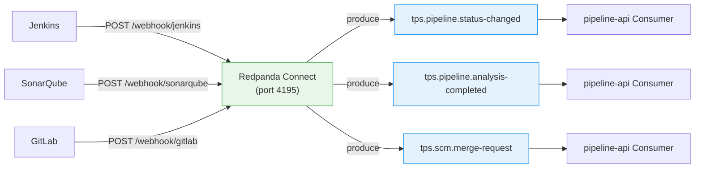

# 13. 외부 도구 연동을 위한 Redpanda Connect 활용

## 문서 목적

TPS는 Jenkins, SonarQube, GitLab 등 외부 DevOps 도구와 Feign 기반 동기 통신을 하고 있다. pipeline-api에만 19개의 Feign 클라이언트가 이 도구들과 연결되어 있다. 이 문서는 외부 도구의 이벤트를 Kafka 토픽으로 수집하기 위한 Redpanda Connect 활용 방안을 다루며, 도구 교체(Jenkins→GitHub Actions, GitLab→GitHub 등) 시에도 소비자 코드를 변경하지 않는 확장 설계를 포함한다.

---

## 1. Kafka Connect vs Redpanda Connect

### 1.1 두 가지 선택지

| 항목 | Kafka Connect | Redpanda Connect (구 Benthos) |
|------|-------------|-------------------------------|
| 런타임 | JVM (Java) | Go 단일 바이너리 |
| 메모리 | 1~2GB+ | 50~100MB |
| 설정 | Java Connector 클래스 + REST API | YAML 파일 |
| 생태계 | 수백 개 커넥터 (Debezium, JDBC 등) | 200+ input/output/processor |
| 배포 | 별도 Connect 클러스터 | 사이드카 또는 단독 컨테이너 |
| 적합 대상 | CDC, DB 연동, 대규모 데이터 파이프라인 | HTTP webhook 수신, 경량 변환, 이벤트 라우팅 |

### 1.2 TPS에서의 선택 근거

TPS의 외부 도구 연동은 대부분 **HTTP webhook 수신** 패턴이다. Jenkins가 빌드 완료 시 POST 요청을 보내고, GitLab이 MR 이벤트 시 webhook을 발행하는 식이다. 이 패턴에는 Kafka Connect의 JVM 클러스터보다 Redpanda Connect의 경량 YAML 설정이 적합하다.

CDC(Debezium)가 필요한 경우(Outbox 패턴 등)에는 Kafka Connect를 별도로 도입할 수 있다. 두 방식은 공존 가능하므로, webhook 수신은 Redpanda Connect, DB CDC는 Kafka Connect로 역할을 분리하는 것이 효율적이다.

---

## 2. Redpanda Connect 아키텍처

### 2.1 기본 구조

Redpanda Connect는 input → processor → output의 3단계 파이프라인으로 동작한다.

```
[외부 도구] --webhook--> [Redpanda Connect]
                          ├── input:  http_server (port 4195)
                          ├── processor: bloblang 변환 (선택)
                          └── output: kafka_franz → Redpanda 토픽
```

하나의 Redpanda Connect 인스턴스가 여러 파이프라인을 동시에 처리할 수 있다. 도구별로 별도 인스턴스를 띄울 필요 없이, 경로(path) 기반으로 라우팅한다.

### 2.2 TPS 배포 구조



---

## 3. TPS 적용 유스케이스

### 3.1 UC-1: Jenkins 빌드 결과 수집

**현재**: ppln-logging-api의 PipelineTaskScheduler가 10초마다 Jenkins API를 폴링하여 빌드 상태를 동기화한다 (08 문서 UC-2).

**전환**: Jenkins Pipeline의 `post` 블록에서 webhook을 발행하고, Redpanda Connect가 수신하여 토픽에 produce한다.

```yaml
# jenkins-webhook.yaml
input:
  http_server:
    path: /webhook/jenkins
    allowed_verbs: [ POST ]

pipeline:
  processors:
    - bloblang: |
        root.pplnNo = this.build.parameters.PPLN_NO
        root.buildNumber = this.build.number
        root.status = this.build.status
        root.duration = this.build.duration
        root.timestamp = now()
        root.sourceModule = "jenkins"

output:
  kafka_franz:
    seed_brokers: [ "redpanda:9092" ]
    topic: "tps.pipeline.status-changed"
    key: ${! this.pplnNo }
    metadata:
      include_patterns: [ "eventType" ]
```

Jenkins Pipeline에 추가할 `post` 블록:

```groovy
post {
    always {
        httpRequest url: "http://redpanda-connect:4195/webhook/jenkins",
                    httpMode: 'POST',
                    contentType: 'APPLICATION_JSON',
                    requestBody: """{
                        "build": {
                            "parameters": { "PPLN_NO": "${params.PPLN_NO}" },
                            "number": ${env.BUILD_NUMBER},
                            "status": "${currentBuild.currentResult}",
                            "duration": ${currentBuild.duration}
                        }
                    }"""
    }
}
```

이 전환으로 PipelineTaskScheduler의 PIPELINE_SYNC 단계(10초 폴링)가 제거되고, 빌드 완료 즉시 이벤트가 전파된다.

### 3.2 UC-2: SonarQube 분석 완료 수집

**현재**: pipeline-api의 SonarQube Feign 클라이언트가 분석 상태를 동기적으로 조회한다.

**전환**: SonarQube의 내장 webhook 기능을 활용하여 분석 완료 이벤트를 수신한다.

```yaml
# sonarqube-webhook.yaml
input:
  http_server:
    path: /webhook/sonarqube
    allowed_verbs: [ POST ]

pipeline:
  processors:
    - bloblang: |
        root.projectKey = this.project.key
        root.qualityGateStatus = this.qualityGate.status
        root.branch = this.branch.name
        root.analysedAt = this.analysedAt
        root.conditions = this.qualityGate.conditions
        root.sourceModule = "sonarqube"

output:
  kafka_franz:
    seed_brokers: [ "redpanda:9092" ]
    topic: "tps.pipeline.analysis-completed"
    key: ${! this.projectKey }
```

SonarQube 관리자 설정에서 `http://redpanda-connect:4195/webhook/sonarqube`를 webhook URL로 등록하면 된다.

### 3.3 UC-3: GitLab MR 이벤트 수집

**현재**: pipeline-api의 GitLab Feign 클라이언트가 MR 상태를 동기적으로 조회한다.

**전환**: GitLab의 webhook(Merge Request Events)을 Redpanda Connect가 수신한다.

```yaml
# gitlab-webhook.yaml
input:
  http_server:
    path: /webhook/gitlab
    allowed_verbs: [ POST ]

pipeline:
  processors:
    - bloblang: |
        root.action = this.object_attributes.action
        root.mrId = this.object_attributes.iid
        root.projectId = this.project.id
        root.sourceBranch = this.object_attributes.source_branch
        root.targetBranch = this.object_attributes.target_branch
        root.state = this.object_attributes.state
        root.authorUsername = this.object_attributes.last_commit.author.name
        root.sourceModule = "gitlab"

output:
  kafka_franz:
    seed_brokers: [ "redpanda:9092" ]
    topic: "tps.scm.merge-request"
    key: ${! this.projectId + "-" + this.mrId }
```

---

## 4. 확장성 설계

### 4.1 CI 도구 교체: Jenkins → GitHub Actions

Jenkins에서 GitHub Actions로 교체할 때, **Consumer 코드는 변경할 필요가 없다**. Redpanda Connect의 YAML 설정만 교체하면 된다.

```yaml
# github-actions-webhook.yaml (Jenkins 교체 시)
input:
  http_server:
    path: /webhook/github-actions
    allowed_verbs: [ POST ]

pipeline:
  processors:
    - bloblang: |
        # GitHub Actions webhook payload → 동일한 출력 스키마로 변환
        root.pplnNo = this.workflow_run.name
        root.buildNumber = this.workflow_run.run_number
        root.status = match this.workflow_run.conclusion {
            "success" => "SUCCESS",
            "failure" => "FAILURE",
            "cancelled" => "CANCEL",
            _ => "UNKNOWN"
        }
        root.duration = this.workflow_run.updated_at.ts_unix() - this.workflow_run.created_at.ts_unix()
        root.timestamp = now()
        root.sourceModule = "github-actions"

output:
  kafka_franz:
    seed_brokers: [ "redpanda:9092" ]
    topic: "tps.pipeline.status-changed"  # 동일 토픽
    key: ${! this.pplnNo }
```

핵심은 **processor에서 출력 스키마를 통일**하는 것이다. Jenkins든 GitHub Actions든 최종 output 구조(`pplnNo`, `buildNumber`, `status`, `duration`)가 동일하면, Consumer는 어떤 CI 도구가 이벤트를 발행했는지 알 필요가 없다. `sourceModule` 헤더로 출처만 구분할 수 있다.

### 4.2 SCM 교체: GitLab → GitHub

GitLab에서 GitHub으로 교체할 때도 동일한 원칙이 적용된다. webhook payload 구조가 다르지만, processor에서 공통 스키마로 변환하면 된다.

```yaml
# github-webhook.yaml (GitLab 교체 시)
pipeline:
  processors:
    - bloblang: |
        # GitHub PR webhook → GitLab MR과 동일한 출력 스키마
        root.action = this.action
        root.mrId = this.pull_request.number
        root.projectId = this.repository.id
        root.sourceBranch = this.pull_request.head.ref
        root.targetBranch = this.pull_request.base.ref
        root.state = this.pull_request.state
        root.authorUsername = this.pull_request.user.login
        root.sourceModule = "github"
```

### 4.3 확장 패턴 요약

```
                    ┌─ Jenkins ─────┐
                    ├─ GitHub Actions┤ → Redpanda Connect → tps.pipeline.status-changed
                    └─ GitLab CI ───┘   (processor가 공통 스키마로 변환)

                    ┌─ GitLab ──────┐
                    ├─ GitHub ──────┤ → Redpanda Connect → tps.scm.merge-request
                    └─ Bitbucket ───┘   (processor가 공통 스키마로 변환)

Consumer는 토픽 스키마만 알면 됨 → 도구 교체 시 Consumer 무변경
```

새 도구를 추가할 때 필요한 작업:
1. Redpanda Connect YAML 파일 하나 작성 (input path + processor 변환)
2. 외부 도구에서 webhook URL 등록
3. **Consumer 코드 변경 없음**

---

## 5. 운영

### 5.1 에러 처리와 DLQ

webhook 수신 또는 Kafka produce가 실패할 때의 처리 방식이다.

```yaml
output:
  fallback:
    - kafka_franz:
        seed_brokers: [ "redpanda:9092" ]
        topic: "tps.pipeline.status-changed"
        key: ${! this.pplnNo }
    - kafka_franz:
        seed_brokers: [ "redpanda:9092" ]
        topic: "tps.dlq.connect-failures"
        key: ${! this.pplnNo }
```

`fallback` output을 사용하면, 첫 번째 output이 실패할 때 자동으로 DLQ 토픽으로 라우팅된다. DLQ Consumer가 실패 원인을 분석하고 재처리할 수 있다.

### 5.2 webhook 인증

외부 도구의 webhook은 인증 없이 들어올 수 있으므로, 시크릿 기반 검증이 필요하다.

```yaml
pipeline:
  processors:
    # GitLab webhook secret 검증
    - bloblang: |
        let token = @X-Gitlab-Token
        root = if $token != env("GITLAB_WEBHOOK_SECRET") {
            throw("Invalid webhook secret")
        } else {
            this
        }
```

Jenkins는 Webhook Secret Token, SonarQube는 별도 인증 헤더, GitLab은 `X-Gitlab-Token` 헤더로 각각 검증한다.

### 5.3 모니터링

Redpanda Connect는 `/ready` 엔드포인트와 Prometheus 메트릭을 기본 제공한다.

```yaml
# 모니터링 설정
http:
  address: "0.0.0.0:4195"
  debug_endpoints: true

metrics:
  prometheus: {}
```

주요 모니터링 지표:
- `input_received_total`: webhook 수신 건수 (도구별)
- `output_sent_total`: 토픽 produce 성공 건수
- `output_error_total`: produce 실패 건수 (DLQ 라우팅 트리거)
- `processor_error_total`: 변환 실패 건수

### 5.4 Docker 배포

```yaml
# docker-compose.yml (일부)
redpanda-connect:
  image: docker.redpanda.com/redpandadata/connect:latest
  ports:
    - "4195:4195"
  volumes:
    - ./connect/jenkins-webhook.yaml:/connect.yaml
    - ./connect/sonarqube-webhook.yaml:/sonarqube.yaml
    - ./connect/gitlab-webhook.yaml:/gitlab.yaml
  command: [ "-c", "/connect.yaml", "-c", "/sonarqube.yaml", "-c", "/gitlab.yaml" ]
  environment:
    - GITLAB_WEBHOOK_SECRET=${GITLAB_WEBHOOK_SECRET}
```

단일 컨테이너에 여러 YAML 설정을 `-c` 플래그로 전달하여 복수 파이프라인을 실행할 수 있다.

---

## 6. 기존 문서 참조

| 이 문서 | 관련 문서 | 관계 |
|---------|----------|------|
| UC-1 (Jenkins) | 04 (파이프라인 실행), 08 (UC-2) | 04/08의 Jenkins 폴링 → webhook 전환의 구체적 구현 |
| UC-2 (SonarQube) | 04 (파이프라인 실행) | 04의 코드 분석 단계를 이벤트 기반으로 전환 |
| UC-3 (GitLab) | 01 (Feign 매핑) | 01에서 식별한 GitLab Feign 5개 중 MR 관련 이벤트화 |
| 확장 설계 | 09 (로드맵) | 09의 Phase 1 인프라에 Redpanda Connect 포함 |
| DLQ/모니터링 | 14 (고려사항) | 14의 모니터링 체계와 연동 |
