# TPS Redpanda 도입 종합 요약

> 14개 분석 문서(01~14)의 핵심을 종합한 발표/의사결정용 문서

---

## 1. 현재 TPS 구조와 문제점

TPS는 모듈 간 통신에 **직접 호출(Feign)** 방식을 사용한다. A 모듈이 B 모듈의 기능이 필요하면 B를 직접 호출하고 응답을 기다린다. 전화 통화처럼 양쪽이 동시에 연결되어야 하는 구조다. 이 방식이 시스템 전반에 4가지 병목을 만들고 있다.

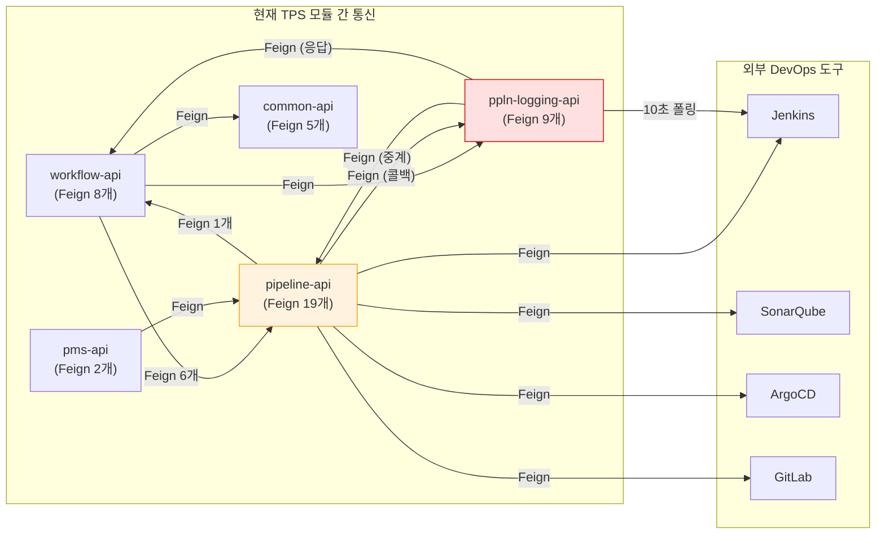

### 1-1. 모듈 간 강결합 — 하나가 죽으면 연쇄 장애

시스템 전체에 43개 Feign 클라이언트가 모듈을 거미줄처럼 엮고 있다.

| 모듈 | Feign 수 | 주요 호출 대상 |
|------|---------|--------------|
| pipeline-api | 19 | Jenkins, ArgoCD, Harbor, SonarQube, ppln-logging, workflow |
| ppln-logging-api | 9 | pipeline-api, workflow-api (메시지 중계), Jenkins |
| workflow-api | 8 | pipeline-api, ppln-logging-api, pms-api, common-api |
| common-api, pms-api | 7 | JWT, 모니터링, 인증, pipeline-api |

pipeline-api가 전체의 44%를 차지한다. 이 모듈이 느려지면 이를 호출하는 모든 모듈이 함께 느려진다.

구체적인 사례를 보면, 결재 승인 하나를 처리할 때 웹훅 호출, 알림 발송, 감사 기록이 모두 동기로 물려 있다. 결재 서비스(`AprvPrcsCommandServiceImpl`)에서 승인을 처리하면 4개의 `@TransactionalEventListener` 핸들러가 순차 실행되면서 Feign으로 외부를 호출한다. 알림 서버가 3초 지연되면, 결재 응답도 3초 늦어진다. 사용자가 "승인" 버튼을 누르고 기다리는 시간이 알림 서버 상태에 좌우되는 것이다.

티켓-파이프라인 통합도 마찬가지다. workflow-api에서 pipeline-api로 가는 정방향 Feign이 6개(`createTicket`, `resetTicket`, `removeTicket`, `completeTicket`, `rejectTicket`, `disableTicket`), 역방향도 1개(`TcktHstryFeignClient`)가 있어서 양쪽이 서로 의존하는 양방향 결합 상태다.

LDAP 사용자 동기화도 7단계를 순차 실행하면서 4개 Feign을 호출한다. 중간 단계에서 실패하면 이전 단계를 되돌릴 수 없고, 에러 테이블에 기록만 남긴다.

### 1-2. ppln-logging-api — DB를 메시지 브로커로 사용하는 중계 모듈

ppln-logging-api는 이름만 보면 로깅 모듈 같지만, 실제로는 TPS의 **중계 브로커** 역할을 수행한다. workflow-api가 pipeline-api에 비동기 메시지를 보내야 할 때, 직접 호출하지 않고 ppln-logging-api를 경유한다. 이 모듈이 MariaDB 테이블을 우편함처럼 사용하여 메시지를 중계하는 구조다.

**현재 메시지 전달 흐름**

메시지 하나가 전달되려면 다음 과정을 거친다.

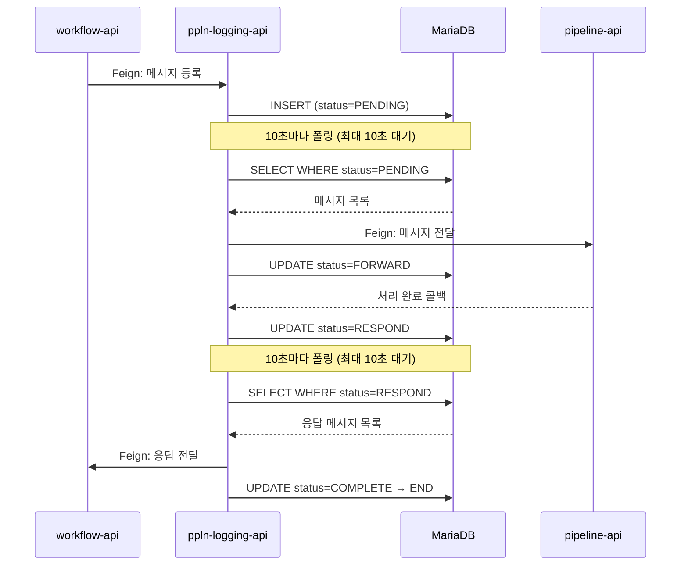

이 흐름에서 **최소 2회의 10초 폴링 대기**가 발생한다. 메시지 등록 후 PENDING 조회까지 최대 10초, 응답 수신 후 RESPOND 조회까지 최대 10초로, 순수 전달 지연만 최대 20초에 달한다.

**834줄 상태머신**

이 중계 로직의 핵심은 `MessageService.java` 834줄이다. 메시지 하나가 5단계 상태를 거치며, 실패 시 분기까지 포함하면 7개 상태를 관리한다.

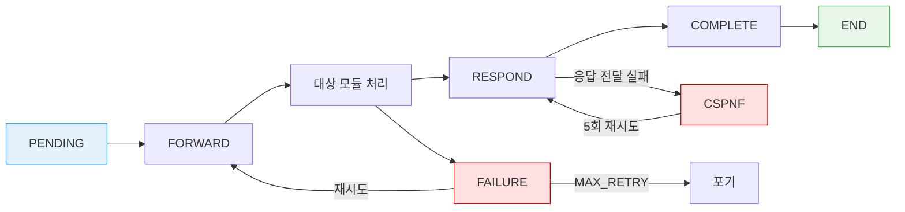

각 상태마다 전용 처리 메서드가 있고, 스케줄러가 우선순위에 따라 순차 실행한다.

```
1순위: CSPNF_RETRY    (소스 응답 실패 재시도)
2순위: TIMEOUT        (응답 대기 시간 초과)
3순위: FAILED         (대상 전달 실패 재시도)
4순위: RESPOND        (대상 응답 → 소스 전달)
5순위: PENDING        (신규 메시지 → 대상 전달)
```

**4개 스케줄러와 DB 분산 락**

ppln-logging-api는 메시지 중계 외에도 파이프라인 상태 동기화, 예약 실행까지 담당하며, 각각 별도 스케줄러로 동작한다.

| 스케줄러 | 주기 | 역할 |
|---------|------|------|
| MessageTaskScheduler | 10초 | PENDING/FAILURE/RESPOND 메시지 폴링 및 전달 |
| PipelineTaskScheduler | 10초 | Jenkins API 폴링 → 파이프라인 상태 동기화 |
| ReservationScheduler | 별도 | 예약 실행 (Thread.sleep 3초 × 10회 = 최대 30초 블로킹) |
| ScheduleLockHandler | 60초 | 분산 락 하트비트 유지 |

메시지 폴링만으로 분당 48회(메시지 30회 + 파이프라인 18회) DB 쿼리가 발생한다. 다중 인스턴스 환경에서는 같은 메시지를 중복 처리하지 않도록 DB 기반 분산 락(`ScheduleLockHandler` 135줄)까지 유지해야 한다. 60초마다 하트비트를 보내고, 만료된 락을 정리하며, 락 획득에 실패하면 운영자가 수동으로 `forceAcquire`를 호출해야 하는 부담이 있다.

예약 실행(`ReservationScheduler`)도 문제다. pipeline-api의 Feign 호출이 실패하면 `Thread.sleep(3000)`으로 3초씩 최대 10번 재시도하므로, 스케줄러 스레드가 최대 30초간 블로킹된다. 지수 백오프 없이 3초 고정 대기라 비효율적이다.

### 1-3. 프론트엔드 폴링 — 불필요한 7,200회 요청

백엔드뿐 아니라 프론트엔드도 폴링 구조다. 서버에 변경 사항이 있는지 주기적으로 물어보는 방식인데, 화면마다 간격이 다르다.

| 화면 | 폴링 간격 | 대상 |
|------|----------|------|
| 파이프라인 실행 로그 | 5초 | 실행 상태 |
| SonarQube 분석 결과 | 10초 | 분석 완료 여부 |
| 칸반 보드 | 10초 | 티켓 상태 |
| 워크플로우 대시보드 | 30초 | 전체 현황 |

파이프라인 하나가 30분간 실행될 때 20명이 접속하면, 실행 로그 화면에서만 `(30분 × 60초 ÷ 5초) × 20명 = 7,200번`의 요청이 발생한다. 대부분 "변경 없음" 응답이다. 여기에 SonarQube, 칸반, 대시보드 폴링까지 합치면 서버 부하가 상당하다.

결재 만료 감지도 Quartz 스케줄러가 1분마다 폴링하므로, 만료 시점과 실제 감지 사이에 최대 59초의 지연이 발생한다.

### 1-4. 감사 이력 유실 — silent catch

감사 이력은 규정 준수를 위해 반드시 기록되어야 하는 데이터다. 그런데 현재 구조에서는 유실될 수 있다.

티켓 이력을 기록하는 `TcktHstryFeignClient`가 실패하면 `try-catch`로 조용히 무시한다(silent catch). 에러 로그만 남기고 비즈니스 흐름은 그대로 진행되므로, 감사 로그가 유실되어도 아무도 모른다. 이력 기록이 실패했다고 티켓 처리 자체를 멈출 수는 없으니 이렇게 설계한 것이지만, 결과적으로 감사 데이터의 완전성을 보장할 수 없는 구조다.

파이프라인 실행 이력도 마찬가지다. ppln-logging-api의 감사 기록 Feign이 실패하면 동일하게 silent catch로 넘어간다. Feign 호출 자체가 네트워크 타임아웃, 서버 과부하 등으로 실패할 수 있는데, 재시도 메커니즘도 없다.

### 현재 문제 요약

| 문제 | 현상 | 수치 |
|------|------|------|
| 강결합 | Feign 직접 호출, 양방향 의존 | 43개 |
| 메시지 지연 | DB 폴링 상태머신 (834줄) | 최대 20초 |
| DB 부하 | 스케줄러 4개의 폴링 쿼리 | 48회/분 |
| 프론트 낭비 | 화면별 개별 폴링 | 7,200회/30분 |
| 감사 유실 | Feign 실패 시 silent catch | 유실률 불명 |
| 운영 부담 | DB 분산 락, 수동 forceAcquire | 60초 하트비트 |

---

## 2. Redpanda 도입 시 아키텍처 변경과 장점

### 2-1. 정량적 개선

| 지표 | 현재 | 목표 | 개선율 |
|------|------|------|--------|
| 비동기 메시지 지연 | 최대 20초 | < 100ms | 99.5%+ |
| 메시지 중계용 DB 폴링 | 48회/분 | 0회/분 | 100% |
| 프론트 불필요 요청 | 7,200회/30분 | 0회 (SSE 푸시) | 100% |
| 감사 이력 유실률 | 불명 (silent catch) | 실무상 무손실 목표 (at-least-once + 멱등 소비) | - |
| Feign 클라이언트 | 43개 | 30개 이하 | 30%+ |
| MessageService 코드 | 834줄 | 제거 | -834줄 |
| 전체 코드 변경 | - | -1,110줄 (제거 1,530 - 신규 420) | 순감소 |

### 2-2. 구조적 개선

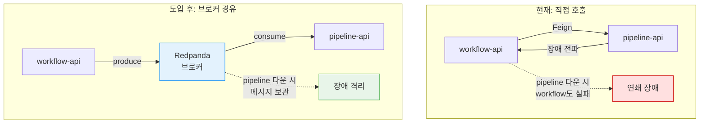

pipeline-api가 다운되어도 메시지는 브로커에 남아 있다가 복구 시 처리된다. 다른 모듈은 영향받지 않는다(장애 격리). 처리량이 부족하면 Consumer 인스턴스만 늘리면 되고, 보내는 쪽 코드를 수정할 필요는 없다(확장성). at-least-once 보장과 DLQ(Dead Letter Queue, 처리 실패 전용 보관함)가 감사 이력 유실을 막는다.

**ppln-logging-api 중계 제거**

가장 큰 구조적 변화는 ppln-logging-api에서 일어난다. 1-2에서 설명한 DB 기반 메시지 중계가 Redpanda 토픽으로 완전히 대체된다.

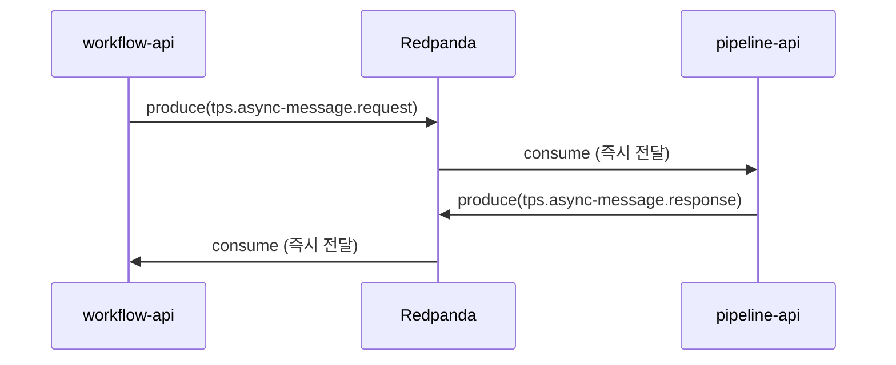

DB 폴링 2회(최대 20초)가 사라지고, 메시지가 토픽에 들어가는 즉시 Consumer에 전달된다(<100ms). 이 전환으로 제거되는 코드는 다음과 같다.

| 제거 대상 | 줄 수 | 이유 |
|----------|-------|------|
| MessageService.java | 834 | 상태머신 전체 → 토픽 produce/consume으로 대체 |
| MessageTaskScheduler.java | 126 | DB 폴링 → Consumer의 push 방식으로 대체 |
| ScheduleLockHandlerImpl.java | 135 | DB 분산 락 → Consumer Group 자동 관리로 대체 |
| MessageFeignClient.java | 42 | Feign 중계 → Kafka Producer로 대체 |
| **합계** | **~1,137줄** | |

분산 락도 필요 없어진다. Redpanda의 Consumer Group이 "같은 파티션은 하나의 Consumer만 처리한다"는 규칙을 자동으로 보장하기 때문이다. 인스턴스가 죽으면 리밸런싱으로 다른 인스턴스가 자동 인계받으므로, `forceAcquire` 같은 수동 복구도 필요 없다.

예약 실행의 `Thread.sleep` 루프도 `tps.reservation.execute-trigger` 토픽과 지수 백오프 재시도(1초→2초→4초→DLQ)로 전환된다. 스레드를 블로킹하지 않으면서 더 효율적인 재시도가 가능하다.

프론트엔드 통신도 바뀐다. 5초마다 "바뀌었나?" 물어보는 폴링 대신, 서버가 변경 사항을 SSE(Server-Sent Events)로 직접 밀어주는 방식이다. 단, 파이프라인 로그 스트리밍은 이미 WebSocket으로 실시간 처리 중이므로 전환 대상에서 제외한다.

### 2-3. 전환 대상 전체 윤곽

14개 분석 문서에서 도출된 전환 대상 유스케이스 전체 목록을 정리했다.

| 우선순위 | 유스케이스 | 현재 방식 | 출처 |
|---------|----------|----------|------|
| P0 | DB-as-Queue 제거 | DB 폴링 20초 | 08 |
| P0 | 감사 이력 보장 | silent catch | 06, 08 |
| P0 | 알림 파이프라인 분리 | 동기 Feign | 06 |
| P1 | 파이프라인 상태 이벤트화 | 10초 폴링 | 04, 08 |
| P1 | 티켓-파이프라인 SAGA | 양방향 Feign 6개 | 03 |
| P2 | 결재 비동기화 | webhook 블로킹 | 02 |
| P2 | LDAP 사용자 동기화 | 7단계 순차 + Feign 4개 | 05 |
| P2 | 예약 실행 개선 | Thread.sleep 블로킹 | 08 |
| 추후 | 위임 상태 변경 | Quartz 24시간 지연 | 06 |
| 추후 | 티켓 지연 감지/스냅샷 | Quartz 배치 | 06 |
| 추후 | 공통코드 캐시 무효화 | Quartz 갱신 | 06 |

### 2-4. 외부 미들웨어(DevOps 도구) 연동 개선

TPS의 pipeline-api는 Jenkins, GitLab, SonarQube, ArgoCD, Harbor 등 외부 DevOps 도구와 직접 Feign으로 통신한다. pipeline-api의 19개 Feign 중 상당수가 이 외부 도구 연동이다.

**현재 구조의 문제**

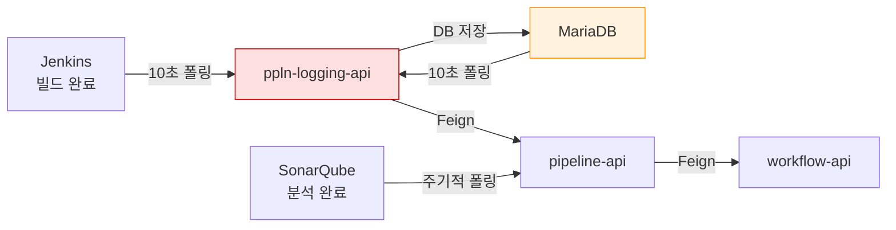

외부 도구에서 이벤트가 발생해도, TPS 쪽에서 "혹시 끝났나?" 폴링하기 전까지는 알 수 없다. Jenkins 빌드가 끝나도 최대 10초를 기다려야 감지된다. 게다가 Jenkins → ppln-logging → pipeline → workflow로 4단계를 거치면서 각 구간마다 지연이 누적된다.

외부 도구가 추가되거나 교체될 때도 문제다. Jenkins에서 GitHub Actions로 바꾸면 Feign 클라이언트 코드를 전부 수정해야 한다. 도구마다 API가 다르므로 새 도구가 추가될 때마다 전용 Feign 클라이언트를 만들어야 한다.

**Redpanda 도입 후 구조**

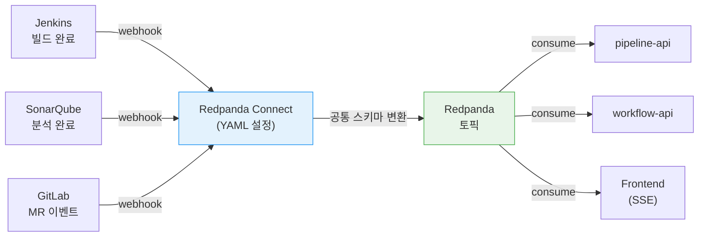

3가지가 달라진다. 첫째, 외부 도구가 이벤트 발생 시 webhook으로 즉시 알려주므로 10초 폴링 대기가 사라진다(폴링→푸시). 둘째, 도구를 교체할 때 Redpanda Connect의 YAML 입력 설정만 수정하면 되고, 출력 스키마가 동일하므로 Consumer 코드는 변경할 필요가 없다. pipeline-api는 "빌드가 끝났다"는 이벤트만 받을 뿐, 그것이 어떤 도구에서 왔는지 알 필요가 없는 셈이다. 셋째, Jenkins → ppln-logging → DB → pipeline → workflow로 이어지던 4단계 경로가 Jenkins → Connect → 토픽 → Consumer의 3단계로 줄어든다.

### 2-5. 도입 후 전체 아키텍처

`tps_manifest`의 Helm 차트 구조를 기준으로, Redpanda 도입 후 TPS의 전체 통신 아키텍처다.

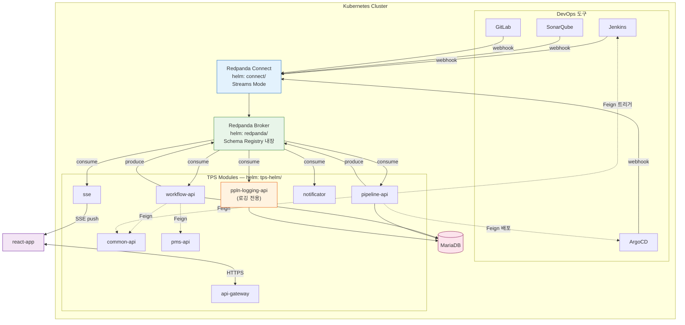

실선 화살표가 이벤트 기반 통신(Redpanda), 점선 화살표가 동기 호출(Feign 유지)이다. 다이어그램은 주요 모듈만 표시했으며, auth-api·scheduler·service-discovery 등 나머지 모듈은 이벤트 통신에 참여하지 않으므로 생략했다. sse 모듈은 이미 별도 서비스로 배포되어 있고, 장시간 연결을 유지하는 SSE 특성상 api-gateway를 우회하여 Frontend와 직접 통신한다. Redpanda 토픽을 구독하여 상태 변경을 실시간으로 푸시하는 역할만 추가하면 된다.

외부 도구 연동은 두 방향이다. 결과 수신(빌드 완료, 배포 상태, 분석 결과)은 Connect가 webhook으로 받아 토픽에 넣고, 명령 전송(빌드 트리거)은 기존 Feign으로 유지한다.

**토픽별 발행·소비 관계**

| 토픽 그룹 | Producer | Consumer |
|-----------|----------|----------|
| tps.workflow.* (ticket, approval) | workflow-api | pipeline-api, notificator |
| tps.pipeline.* (execution, integration) | pipeline-api | workflow-api, sse |
| tps.pipeline.status-changed | Connect (Jenkins, ArgoCD) | workflow-api, sse |
| tps.pipeline.analysis-completed | Connect (SonarQube) | pipeline-api, sse |
| tps.async-message.* (request/response) | workflow-api ↔ pipeline-api | 상호 소비 |
| tps.audit.* | workflow-api, pipeline-api | ppln-logging-api |
| tps.notification | workflow-api, pipeline-api | notificator |
| tps.scm.merge-request | Connect (GitLab) | pipeline-api |
| tps.user.sync | workflow-api | common-api |
| tps.system.config | common-api | workflow-api, pipeline-api |
| tps.reservation.execute-trigger | workflow-api | pipeline-api |

ppln-logging-api의 역할이 가장 크게 바뀐다. 현재는 workflow-api와 pipeline-api 사이에서 DB 기반 메시지 중계를 수행하지만(1-2 참조), Redpanda가 이 역할을 대체하면 감사 토픽(`tps.audit.*`)을 consume하여 DB에 기록하는 순수 로깅 모듈로 축소된다.

**통신 방식 전환 요약**

| 통신 | 현재 | 도입 후 |
|------|------|--------|
| workflow ↔ pipeline 티켓 연동 | Feign 6개 (양방향) | tps.workflow.ticket produce/consume |
| 비동기 메시지 중계 | ppln-logging DB 폴링 (20초) | tps.async-message.* (< 100ms) |
| 감사 이력 기록 | Feign + silent catch | tps.audit → ppln-logging consume |
| Jenkins 빌드 결과 수신 | 10초 폴링 | Connect webhook → 토픽 |
| SonarQube 분석 결과 수신 | 주기적 폴링 | Connect webhook → 토픽 |
| ArgoCD 배포 상태 수신 | Feign 폴링 | Connect webhook → 토픽 |
| GitLab MR 이벤트 수신 | 미연동 | Connect webhook → 토픽 |
| 프론트엔드 상태 갱신 | 5~30초 폴링 | sse 모듈 → SSE push |
| 빌드 트리거 | Feign | Feign 유지 (명령은 동기 적합) |
| 사용자/프로젝트 조회 | Feign | Feign 유지 (조회는 동기 적합) |

---

## 3. 도입 시 고려해야 할 정책

### 3-1. 스키마 관리 정책

스키마는 메시지의 구조 약속이다. 보내는 쪽이 필드를 추가하거나 삭제하면 받는 쪽이 깨질 수 있으므로, 변경 규칙이 필요하다.

**호환성 전략: FULL_TRANSITIVE**

이 모드는 "새 버전과 이전 모든 버전이 서로 호환되어야 한다"는 가장 안전한 규칙이다. 보내는 쪽과 받는 쪽을 어떤 순서로 배포해도 메시지가 깨지지 않는다.

| 허용되는 변경 | 금지되는 변경 |
|--------------|-------------|
| 기본값 있는 필드 추가 | 기존 필드 삭제 |
| 기본값 있는 필드 삭제 | 필드 타입 변경 |
| 문서/주석 수정 | 필수 필드 추가 |

**환경별 등록 정책**


| 환경 | 자동 등록 | 등록 방식 |
|------|----------|----------|
| dev | 허용 | 코드에서 자동 |
| staging | 금지 | CI/CD 파이프라인만 |
| prod | 금지 | CI/CD 파이프라인만 |

feature 브랜치에서는 호환성 테스트만 실행하고, develop/main 머지 시에만 실제로 스키마를 등록한다. 이렇게 해야 미완성 스키마가 Registry에 오염되지 않는다.

### 3-2. 토픽-이벤트 매핑 정책

토픽(메시지가 저장되는 장소)과 이벤트(메시지의 종류)를 어떻게 대응시킬지 정해야 한다. 두 가지 선택지가 있다.

**방식 A — 이벤트마다 토픽 분리 (1:1)**

티켓 생성, 완료, 삭제를 각각 별도 토픽에 넣는 방식이다.

```
tps.workflow.ticket.created
tps.workflow.ticket.completed
tps.workflow.ticket.deleted
```

장점은 Consumer가 자기가 관심 있는 토픽만 구독하면 되니 필터링이 단순하다는 것이다. 단점은 이벤트 종류가 늘어날 때마다 토픽이 계속 생긴다는 점이다. TPS처럼 도메인이 다양한 시스템에서는 토픽 수가 수십 개로 폭증하여 관리 부담이 커진다.

**방식 B — 도메인 토픽에 여러 이벤트 (1:N) [TPS 채택]**

하나의 도메인 토픽에 여러 이벤트를 넣고, 메시지 헤더로 종류를 구분하는 방식이다.

```
tps.workflow.ticket (단일 토픽)
  ├─ header: eventType = TICKET_CREATED
  ├─ header: eventType = TICKET_COMPLETED
  └─ header: eventType = TICKET_DELETED
```

TPS는 01 문서에서 이미 도메인 단위로 8개 토픽을 설계했으므로 이 방식과 맞아떨어진다. Consumer에서 `eventType` 헤더를 확인하여 자기가 처리할 이벤트만 골라서 처리한다.

**TPS 토픽 설계 결과 (15개)** — 01 문서에서 도메인 기준 8개로 시작, 이후 분석(08, 09, 13)에서 감사 이력, 예약 실행, SCM 등 7개가 추가되어 최종 15개로 확정되었다.

| 토픽 | 용도 | 매핑 |
|------|------|------|
| `tps.workflow.approval` | 결재 라이프사이클 | 1:N |
| `tps.workflow.ticket` | 티켓 라이프사이클 | 1:N |
| `tps.pipeline.execution` | 파이프라인 실행 상태 | 1:N |
| `tps.pipeline.integration` | 티켓-파이프라인 통합 | 1:N |
| `tps.pipeline.status-changed` | Jenkins/ArgoCD 상태 | 1:1 |
| `tps.pipeline.analysis-completed` | SonarQube 분석 완료 | 1:1 |
| `tps.async-message.request` | 비동기 메시지 요청 | 1:1 |
| `tps.async-message.response` | 비동기 메시지 응답 | 1:1 |
| `tps.user.sync` | LDAP 동기화 | 1:N |
| `tps.notification` | 알림 요청 | 1:N |
| `tps.audit` | 통합 감사 로그 | 1:N |
| `tps.audit.ticket-history` | 티켓 감사 이력 | 1:1 |
| `tps.system.config` | 시스템 설정 | 1:N |
| `tps.reservation.execute-trigger` | 예약 실행 | 1:1 |
| `tps.scm.merge-request` | SCM MR 이벤트 | 1:1 |

**왜 1:1과 1:N을 혼용하는가**

모든 토픽을 1:N으로 통일하거나, 모든 토픽을 1:1로 통일할 수도 있지만, TPS는 의도적으로 혼용한다. 토픽의 성격에 따라 최적의 방식이 다르기 때문이다.

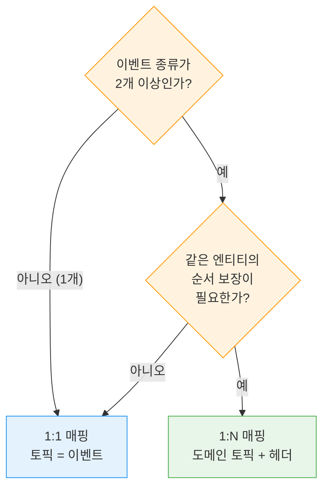

같은 엔티티(티켓, 결재 등)에서 여러 이벤트가 발생하고 순서가 중요하면 1:N을 선택한다. `tps.workflow.ticket` 토픽에는 생성·완료·삭제가 모두 들어가는데, 같은 티켓의 이벤트를 같은 파티션에 넣으려면(`ticketId`를 파티션 키로) 하나의 토픽이어야 하기 때문이다. 토픽을 분리하면 "생성"과 "삭제"가 서로 다른 파티션에 들어가 순서를 보장할 수 없게 된다. 반면 이벤트 종류가 하나뿐이거나 외부 도구의 단일 목적 이벤트라면 1:1이 간결하다.

1:N 토픽의 Consumer는 모든 이벤트를 받되, 메시지 헤더의 `eventType`으로 자기 처리 대상만 골라서 처리하고 나머지는 건너뛴다. Spring Kafka의 메시지 필터가 이를 담당한다. 다만 토픽당 이벤트가 10개를 넘으면 필터링 비용이 늘어나므로, 그때는 도메인을 세분화하여 토픽을 분리하는 편이 낫다. TPS는 토픽당 최대 5~6개 수준이라 문제없다.

### 3-3. 메시지 신뢰성 정책

메시지가 유실되거나 중복 처리되지 않도록 3가지 설정이 필요하다.

**전송 보장** (`acks=all`): 보내는 쪽이 메시지를 브로커에 넣을 때, 모든 복제본에 저장이 완료된 후에야 "성공"으로 응답한다. 하나의 브로커가 죽어도 메시지가 살아 있다.

**중복 방지** (`enable.idempotence=true`): 네트워크 오류로 같은 메시지가 두 번 전송되어도 브로커가 하나만 저장한다. 각 메시지에 일련번호를 매겨 중복을 감지하는 원리다.

**Consumer 멱등성**: 같은 메시지를 두 번 받아도 결과가 동일하도록 설계한다. 처리 완료된 메시지를 DB에 기록해두고, 중복 메시지가 오면 자동으로 건너뛴다. 메시지의 추적 ID와 이벤트 종류를 조합한 복합 키로 "이미 처리했는가"를 판별한다.

**파티션 키 정책**: 같은 티켓의 이벤트는 같은 파티션(메시지 저장 단위)에 들어가도록 `ticketId`를 키로 설정한다. 이렇게 해야 "티켓 생성 → 완료 → 삭제" 순서가 보장된다. 키가 없으면 순서가 뒤섞일 수 있다.

### 3-4. 트랜잭션 아키텍처 정책

메시지 브로커를 도입하면 기존 DB 트랜잭션만으로는 해결할 수 없는 두 가지 문제가 생긴다: (1) "DB 저장과 메시지 발행을 동시에 성공/실패시키려면?" (2) "여러 모듈에 걸친 작업이 중간에 실패하면?" 이를 해결하는 아키텍처 패턴을 정해야 한다.

**Outbox 패턴 — DB와 메시지 발행의 원자성 보장**

"결재를 승인하고 이벤트도 발행해야 하는데, DB 저장은 성공했지만 메시지 발행이 실패하면?" Outbox 패턴이 이 문제를 해결한다.

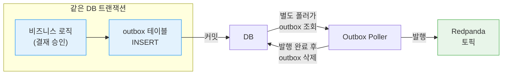

메시지를 브로커에 직접 보내는 대신, DB의 `outbox` 테이블에 함께 저장한다. 비즈니스 데이터와 outbox 레코드가 같은 DB 트랜잭션 안에 있으므로 둘 다 성공하거나 둘 다 실패한다. 별도 프로세스가 outbox 테이블을 읽어서 브로커에 발행하고, 발행 완료된 레코드를 삭제한다.

TPS에서는 결재 승인/반려, 티켓 생성/완료처럼 **"DB 변경과 이벤트 발행이 반드시 함께 성공해야 하는"** 유스케이스에 적용한다. 02 문서에서 `tps_outbox` 테이블 스키마(id, event_id, event_type, topic, payload, status, timestamps)가 설계되어 있다.

**SAGA 패턴 — 여러 모듈에 걸친 트랜잭션 관리**

"티켓을 생성하고 → 파이프라인에 통합하고 → 완료 처리하는" 과정에서 통합이 실패하면? 단일 DB 트랜잭션으로 묶을 수 없다(모듈이 다르니까). SAGA는 이 문제를 "각 단계를 독립 실행하되, 실패하면 이전 단계를 되돌리는 보상 작업을 실행한다"는 방식으로 해결한다.

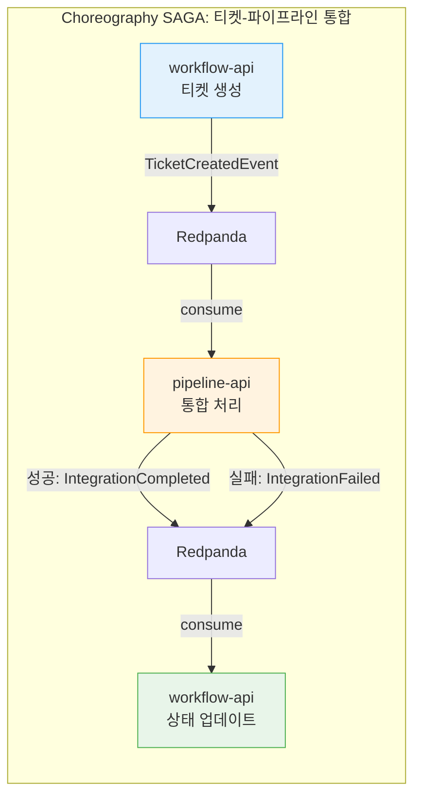

TPS에는 두 가지 SAGA 방식이 필요하다.

| 방식 | 설명 | TPS 적용 대상 |
|------|------|-------------|
| Choreography | 각 모듈이 이벤트를 주고받으며 자율적으로 진행 | 티켓-파이프라인 통합 (2개 모듈) |
| Orchestrator | 중앙 조정자가 단계를 지시하고 보상을 관리 | 결재 프로세스 (3개 이상 모듈) |

Choreography는 참여 모듈이 2~3개일 때 적합하다. 03 문서의 티켓-파이프라인이 여기에 해당한다 — workflow-api가 `TicketCreatedEvent`를 발행하면 pipeline-api가 통합 처리 후 `IntegrationCompletedEvent`를 발행하고, 실패하면 `IntegrationFailedEvent`를 발행하여 workflow-api가 티켓 상태를 `INTEGRATION_FAILED`로 되돌린다.

Orchestrator는 참여 모듈이 많거나 흐름이 복잡할 때 적합하다. 02 문서의 결재 프로세스가 여기에 해당한다 — 요청→진행→승인→후처리까지 여러 모듈이 관여하므로, 중앙 조정자가 "다음 단계를 실행하라"고 지시하는 것이 흐름을 파악하기 쉽다.

**DLQ(Dead Letter Queue) — 실패 메시지 관리**

처리에 실패한 메시지를 버리지 않고 별도 토픽(DLQ)에 보관하는 정책이다. 재시도 3회(지수 백오프 1초→2초→4초) 후에도 실패하면 DLQ로 이동한다. Spring Kafka의 `@RetryableTopic`으로 구현하며, DLQ에 쌓인 메시지는 관리자가 원인을 확인한 후 재처리한다.

### 3-5. 모니터링 정책

메시지 브로커는 "보이지 않는 곳에서" 동작하므로, 문제를 감지할 모니터링이 필수다.

| 지표 | 설명 | 임계값 |
|------|------|--------|
| Consumer Lag | 아직 처리 안 된 메시지 수 | > 1,000 경고 |
| DLQ 메시지 수 | 처리 실패한 메시지 수 | > 0 즉시 알림 |
| 처리율 | 초당 처리된 메시지 수 | 기준선 대비 50% 하락 시 경고 |
| Producer 에러율 | 전송 실패 비율 | > 0.1% 경고 |
| Registry 가용성 | 스키마 저장소 응답 여부 | 다운 시 즉시 알림 |

Grafana 대시보드 3개를 구성한다: (1) 클러스터 상태, (2) 토픽별 처리량/Lag, (3) DLQ/에러 현황. Spring Kafka의 `observation-enabled: true` 설정으로 애플리케이션 메트릭도 수집한다.

### 3-6. 기존 시스템과의 공존 전략

하루아침에 모든 Feign을 제거하면 위험하다. Feature Flag로 점진 전환한다.

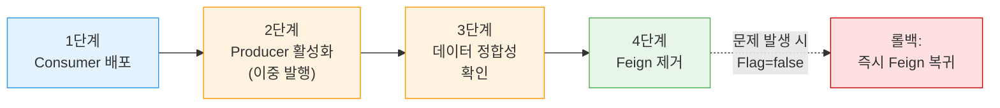

```yaml
# application.yml
feature:
  messaging:
    audit-event: true    # true → Redpanda, false → 기존 Feign
    pipeline-status: false
```

**롤백**: Feature Flag를 `false`로 되돌리면 즉시 기존 Feign으로 복귀한다. Redpanda 클러스터가 완전히 다운되면, 애플리케이션에 폴백 경로가 사전 구현되어 있는 경우 Circuit Breaker가 Feign 폴백으로 자동 전환한다.

### 3-7. 메시징 공통 모듈 및 Connect 관리 정책

**messaging-lib 분리 근거**

Redpanda를 도입하면 모든 API 모듈에 Kafka 설정, Schema Registry 연동, 직렬화 설정이 필요해진다. 이를 모듈마다 따로 구현하면 설정이 중복되고, 정책을 바꿀 때 모든 모듈을 고쳐야 한다. TPS는 이미 `core-lib`을 Nexus에 JAR로 배포하여 공통 코드를 공유하고 있으므로, 같은 패턴으로 `messaging-lib`을 분리하면 된다.

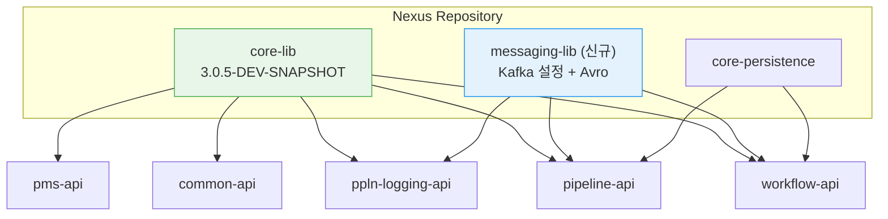

`core-lib`에 합치면 메시징이 필요 없는 모듈(pms-api, common-api)까지 Kafka 의존성을 끌어오게 되므로 별도 모듈로 분리한다. 각 API 모듈은 `messaging-lib` 의존성 한 줄로 Producer/Consumer 설정, Schema Registry 연동, DLQ 핸들러, Outbox 공통 로직을 모두 쓸 수 있게 된다. 패키지 구조와 구현 항목은 4-1에서 다룬다.

**Redpanda Connect 관리 주체**

Redpanda Connect는 Jenkins, SonarQube, GitLab 등 외부 도구의 webhook을 받아 토픽으로 변환하는 경량 파이프라인이다(2-4 참조). 이 Connect의 파이프라인 정의를 누가 관리할지 정해야 한다.

현재 TPS의 Connect는 `tps_manifest/helm-charts/connect/`에 Helm 차트로 배포되고 있다. 파이프라인 정의(input/pipeline/output)는 `values-dev.yaml`의 `config` 블록에 들어가고, Helm이 이를 ConfigMap으로 변환하여 Connect 컨테이너에 마운트하는 구조다. `rolloutConfigMap: true` 설정으로 config가 바뀌면 Pod가 자동 재배포된다.

```yaml
# tps_manifest/helm-charts/connect/values-dev.yaml (현재 구조)
config:                          # ← 파이프라인 정의 (비즈니스 로직)
  input:
    http_server:
      path: /jenkins-webhook
  pipeline:
    processors: [...]
  output:
    redpanda:
      topic: jenkins.events

service:                         # ← 인프라 설정
  type: ClusterIP
  port: 8080
ingress:                         # ← 인프라 설정
  enabled: true
  hosts: [...]
```

파이프라인 정의(비즈니스 로직)와 인프라 설정(포트, 리소스, 인그레스)이 같은 values 파일에 섞여 있으므로, 개발팀이 Jenkins webhook 경로를 바꾸려면 인프라 저장소(`tps_manifest`)에 MR을 올려야 한다. 파이프라인 정의를 별도 저장소에 분리하면 Helm ConfigMap과 동기화하는 추가 파이프라인이 필요하고 배포 흐름이 이중화되므로, **MR 기반으로 `tps_manifest`에서 직접 관리**하는 것이 현실적이다.

파이프라인 정의가 바뀌는 시점은 외부 도구를 추가하거나 교체할 때뿐이라 변경 빈도가 낮다. MR 리뷰를 통해 인프라팀이 배포 영향을 확인하고, 개발팀이 파이프라인 로직의 정확성을 보장하는 구조로 운영비용을 줄인다.

**역할 분리**: CODEOWNERS로 `streams/`는 개발팀, `values-*.yaml`과 `templates/`는 인프라팀으로 승인자를 분리한다. 구체적인 Streams Mode 파일 구조와 YAML 예시는 4-2에서 다룬다.

### 3-8. 이벤트 계약 표준화 (AsyncAPI)

REST API에 OpenAPI(Swagger)가 있듯, 이벤트 기반 통신에는 AsyncAPI가 있다. 토픽, 메시지 스키마, 프로토콜을 하나의 YAML로 정의하여 "이 토픽에 어떤 메시지가 오가는가"를 문서화하는 표준이다.

토픽이 15개이고 이벤트 타입이 수십 종일 때, 개발자가 "이 토픽에 어떤 필드가 들어오는가"를 코드를 뒤져가며 파악해야 한다면 온보딩과 유지보수 비용이 늘어난다. AsyncAPI 명세를 작성해두면 토픽·스키마·프로토콜을 한 곳에서 확인할 수 있고, 명세에서 클라이언트 코드를 자동 생성하는 것도 가능하다.

**TPS 적용 예시** — `tps.workflow.ticket` 토픽의 AsyncAPI 명세:

```yaml
asyncapi: 3.0.0
info:
  title: TPS Workflow Ticket Events
  version: 1.0.0
  description: 티켓 라이프사이클 이벤트

channels:
  tps.workflow.ticket:
    address: tps.workflow.ticket
    messages:
      ticketCreated:
        headers:
          type: object
          properties:
            eventType:
              type: string
              enum: [TICKET_CREATED]
            correlationId:
              type: string
              format: uuid
            sourceModule:
              type: string
              enum: [workflow-api]
        payload:
          schemaFormat: application/vnd.apache.avro;version=1.11.3
          schema:
            $ref: './avro/TicketEvent.avsc'

      ticketCompleted:
        headers:
          type: object
          properties:
            eventType:
              type: string
              enum: [TICKET_COMPLETED]
        payload:
          schemaFormat: application/vnd.apache.avro;version=1.11.3
          schema:
            $ref: './avro/TicketEvent.avsc'

operations:
  publishTicketEvent:
    action: send
    channel:
      $ref: '#/channels/tps.workflow.ticket'
    summary: workflow-api가 티켓 상태 변경 이벤트를 발행
    messages:
      - $ref: '#/channels/tps.workflow.ticket/messages/ticketCreated'
      - $ref: '#/channels/tps.workflow.ticket/messages/ticketCompleted'

  consumeTicketEvent:
    action: receive
    channel:
      $ref: '#/channels/tps.workflow.ticket'
    summary: pipeline-api가 티켓 이벤트를 소비하여 통합 처리
```

이 명세 하나로 토픽에 어떤 이벤트가 흐르는지, 헤더에 무엇이 들어가는지, Avro 스키마가 어디 있는지 한눈에 파악된다.

**자동 생성**: TPS는 Spring Boot 기반이므로 Springwolf 라이브러리가 `@KafkaListener`, `@SendTo` 어노테이션에서 AsyncAPI 문서를 자동 생성한다. 수동으로 명세를 관리할 필요가 없고, 코드가 바뀌면 문서도 함께 갱신된다. 이미 Avro 스키마 70개가 있으니 스키마 참조(`$ref`)만 연결하면 끝이다.

### 3-9. Redpanda Connect 개발자 가이드

새 외부 도구를 연동할 때 따라야 할 절차와 패턴을 정리한다.

**스트림 추가 절차**

1. `streams/` 디렉토리에 YAML 파일 작성 (4-2 파일 구조 참조)
2. `tps_manifest` 저장소에 MR 제출
3. 인프라팀 + 개발팀 리뷰 (CODEOWNERS)
4. ArgoCD가 자동 배포 (`rolloutConfigMap: true`)

**공통 패턴**

모든 외부 도구 연동은 동일한 3단계 구조를 따른다.

```yaml
# webhook 수신 → 스키마 변환 → 토픽 발행
input:
  http_server:
    path: /{tool}-webhook        # 도구별 엔드포인트

pipeline:
  processors:
    - mapping: |
        root.field = this.source  # TPS 공통 스키마로 변환

output:
  redpanda:
    seed_brokers: ["${REDPANDA_BROKERS}"]  # 환경변수 참조
    topic: tps.{domain}.{event}            # TPS 토픽 네이밍 규칙
```

**주의사항**

- 브로커 주소는 반드시 `${REDPANDA_BROKERS}` 환경변수로 참조 (하드코딩 금지)
- 토픽 이름은 3-2의 TPS 토픽 설계 규칙을 따름 (`tps.{도메인}.{이벤트}`)
- 공통 설정(인증, TLS)은 `resources/common.yaml`에서 관리
- 각 스트림 파일은 input/pipeline/output만 담음 (인프라 설정 섞지 않음)

**로컬 테스트**

단일 스트림을 로컬에서 테스트할 수 있다.

```bash
# 단일 스트림 실행
rpk connect run ./streams/jenkins-build-status.yaml

# 전체 스트림 Streams Mode 실행
rpk connect streams -r "./resources/*.yaml" ./streams/*.yaml
```

### 3-10. 팀 준비도

동기 호출에 익숙한 팀이 비동기로 전환할 때 가장 어려운 5가지 변화다.

| 영역 | 기존 (동기) | 변경 후 (비동기) |
|------|------------|-----------------|
| 디버깅 | 콜스택 추적 | correlationId로 분산 추적 |
| 에러 처리 | try-catch 즉시 | DLQ + 재처리 파이프라인 |
| 데이터 일관성 | DB 트랜잭션 | 최종 일관성 (Eventual Consistency) |
| 테스트 | MockMvc 동기 | Embedded Kafka 비동기 |
| 모니터링 | HTTP 상태 코드 | Consumer Lag + 처리율 |

### 3-11. 인프라 요구사항

| 환경 | 브로커 수 | CPU | RAM | 디스크 |
|------|----------|-----|-----|--------|
| dev | 1 | 2 core | 2 GB | 20 GB SSD |
| prod | 3 | 4 core | 4 GB | 50 GB SSD |

Schema Registry와 Console은 Redpanda에 내장되어 별도 인프라가 불필요하다. Redpanda Connect는 별도 컨테이너로 50~100MB다.

**스토리지 제약 — NFS 비호환**

Redpanda는 Raft 합의 알고리즘 기반의 로그 저장소이므로 WAL(Write-Ahead Log)의 fsync가 확실히 보장되는 로컬 디스크가 필수다. NFS는 fsync 지연과 파일 락 미보장 문제가 있어 데이터 손상 위험이 있으며, Redpanda가 공식적으로 지원하지 않는다.

TPS K8s 클러스터는 현재 NFS를 PV로 사용 중이므로, Redpanda용 로컬 PV를 별도로 확보해야 한다.

| 환경 | 스토리지 방식 | 비고 |
|------|-------------|------|
| dev | hostPath | 단일 노드 개발 환경에서 충분 |
| prod | local PersistentVolume | 노드에 SSD 직접 마운트, nodeAffinity로 Pod 고정 |

NFS PV에 Redpanda 데이터를 올리면 리더 선출 실패, 세그먼트 파일 손상 등 복구 불가능한 장애가 발생할 수 있으므로 절대 사용하지 않는다.

**데이터 보존 및 MinIO 아카이빙 정책**

Redpanda 토픽의 보존 기간은 도메인별로 차등 적용한다(3-2 토픽 설계의 `AuditTopicConfig` 참조). 보존 기간이 만료되어 브로커에서 삭제되더라도 장기 보관이 필요한 데이터는 MinIO(S3 호환 오브젝트 스토리지)로 이관한다.

| 항목 | 설정 |
|------|------|
| 이관 대상 | `tps.audit`(90일 보존), `tps.audit.ticket-history`(365일 보존) |
| 이관 방식 | Redpanda Tiered Storage 또는 Connect S3 output → MinIO |
| 이관 주기 | 일 단위 배치 |
| 저장 포맷 | Parquet (분석 효율) 또는 JSON Lines (호환성) |

감사 로그는 규정 준수 목적으로 유실이 허용되지 않는 데이터다(1-4 참조). 브로커 보존 기간 내에 MinIO로 이관이 완료되어야 하며, 이관 실패 시 보존 기간을 자동 연장하거나 알림을 발생시키는 안전장치가 필요하다.

### 3-12. 장애 대응

| 장애 유형 | 대응 |
|----------|------|
| 브로커 1대 다운 | 자동 복구 (3노드 중 2노드 정상이면 서비스 지속) |
| 브로커 과반수 다운 | 쓰기 중단, Circuit Breaker → Feign 폴백 |
| Consumer 처리 지연 | Consumer Lag 알림 → 인스턴스 스케일아웃 |
| 스키마 역직렬화 실패 | DLQ 이동 → 원인 분석 후 재처리 |
| Registry 다운 | 캐싱된 스키마로 계속 처리 (신규 스키마만 등록 불가) |

---

## 4. 실제 해야하는 것들

### 4-1. messaging-lib 모듈 생성

3-7에서 결정한 공통 모듈을 실제로 만들 때의 구현 항목이다. core-lib과 동일하게 Nexus에 배포한다.

**패키지 구조**

| 패키지 | 역할 |
|--------|------|
| config | Producer/Consumer/Registry 공통 설정 |
| config.topic | 도메인별 NewTopic 빈 설정 (파티션 수, 보존 기간) |
| topic | 토픽 이름 상수 (TpsTopics.java 단일 파일) |
| producer | 공통 Producer (헤더 자동 설정, correlationId 주입) |
| consumer | 멱등성 처리, DLQ 재시도 핸들러 |
| outbox | Outbox 테이블 엔티티 + 폴러 |
| monitoring | Micrometer 메트릭 수집 |
| avro | 모듈 간 이벤트 스키마 (TicketEvent, ApprovalEvent 등) |

**토픽 이름 상수 — 단일 파일**

토픽 이름은 `TpsTopics.java` 하나에 `static final`로 전부 선언한다. 15개 토픽이 한 파일에 있어야 "어떤 토픽이 있는지" 한 곳에서 파악 가능하고, 이름 중복이나 오타를 잡기 쉽다.

```java
// messaging-lib/.../topic/TpsTopics.java
public final class TpsTopics {
    // workflow
    public static final String WORKFLOW_APPROVAL = "tps.workflow.approval";
    public static final String WORKFLOW_TICKET = "tps.workflow.ticket";
    // pipeline
    public static final String PIPELINE_EXECUTION = "tps.pipeline.execution";
    public static final String PIPELINE_INTEGRATION = "tps.pipeline.integration";
    public static final String PIPELINE_STATUS_CHANGED = "tps.pipeline.status-changed";
    public static final String PIPELINE_ANALYSIS_COMPLETED = "tps.pipeline.analysis-completed";
    // async-message
    public static final String ASYNC_MESSAGE_REQUEST = "tps.async-message.request";
    public static final String ASYNC_MESSAGE_RESPONSE = "tps.async-message.response";
    // audit
    public static final String AUDIT = "tps.audit";
    public static final String AUDIT_TICKET_HISTORY = "tps.audit.ticket-history";
    // system
    public static final String NOTIFICATION = "tps.notification";
    public static final String USER_SYNC = "tps.user.sync";
    public static final String SYSTEM_CONFIG = "tps.system.config";
    // external
    public static final String RESERVATION_EXECUTE_TRIGGER = "tps.reservation.execute-trigger";
    public static final String SCM_MERGE_REQUEST = "tps.scm.merge-request";

    private TpsTopics() {}
}
```

**토픽 설정(NewTopic) — 도메인별 Config 분리**

토픽 이름은 한 곳에 모으되, `NewTopic` 빈 설정(파티션 수, 복제 팩터, 보존 기간)은 도메인별로 분리한다. 도메인마다 트래픽 특성이 달라 파티션 수와 보존 정책이 다르기 때문이다.

```
messaging-lib/.../config/topic/
├── WorkflowTopicConfig.java      # approval(3파티션), ticket(6파티션)
├── PipelineTopicConfig.java      # execution(6), integration(3), status-changed(3), analysis(1)
├── AuditTopicConfig.java         # audit(3, 90일 보존), ticket-history(3, 365일 보존)
├── AsyncMessageTopicConfig.java  # request(3), response(3)
└── SystemTopicConfig.java        # notification(1), user-sync(1), system-config(1)
```

각 Config 클래스에서 `TpsTopics` 상수를 참조하여 `NewTopic` 빈을 등록한다. 토픽 이름은 상수 파일 하나, 설정은 도메인 파일에서 관리하는 구조다.

**Avro 스키마 배치**

현재 Avro 스키마는 `core-lib`에 5개(비동기 메시지), `pipeline-api`에 70개+(파이프라인 도메인 DTO)가 있다. pipeline-api의 70개는 도메인 특화 요청/응답이므로 messaging-lib으로 옮기기 부적합하고, messaging-lib에는 모듈 간 이벤트 통신용 스키마만 두는 것이 현실적이다. Schema Registry 등록은 양쪽 모두 CI/CD 파이프라인으로 처리한다.

**구현 체크리스트**

- [ ] messaging-lib 모듈 생성 (core-lib과 동일 Gradle 구조)
- [ ] 공통 Kafka/Registry 설정 (`config` 패키지)
- [ ] `TpsTopics.java` — 토픽 이름 상수 전체 선언
- [ ] 도메인별 `NewTopic` Config 클래스 (`config.topic` 패키지)
- [ ] 공통 Producer (헤더 자동 설정, correlationId 주입)
- [ ] 멱등성 처리 공통 로직 (ProcessedEvent)
- [ ] DLQ 재시도 핸들러
- [ ] Outbox 테이블 엔티티 + 폴러
- [ ] Avro 이벤트 스키마 작성 및 CI 등록 파이프라인
- [ ] Micrometer 메트릭 수집 설정
- [ ] Nexus 배포 파이프라인 구성
- [ ] workflow-api, pipeline-api, ppln-logging-api에 의존성 추가

### 4-2. Redpanda Connect 파이프라인 작성

3-7의 관리 정책에 따라, `tps_manifest`에 Streams Mode 파일을 작성한다.

**파일 구조 — Streams Mode로 커넥터별 분리**

Redpanda Connect는 **Streams Mode**를 공식 지원한다. 하나의 Connect 인스턴스가 여러 독립 스트림을 실행하며, 커넥터별로 YAML 파일을 분리 가능하다.

```
tps_manifest/helm-charts/connect/
├── Chart.yaml
├── values.yaml                       # 기본 인프라 설정
├── values-dev.yaml                   # dev 인프라 (image, service, ingress, resources)
├── values-op.yaml                    # prod 인프라
├── streams/                          # ← 커넥터별 파이프라인 (개발팀 MR 관리)
│   ├── jenkins-build-status.yaml     # Jenkins → tps.pipeline.status-changed
│   ├── sonarqube-analysis.yaml       # SonarQube → tps.pipeline.analysis-completed
│   └── gitlab-merge-request.yaml     # GitLab → tps.scm.merge-request
├── resources/                        # ← 공유 리소스 (브로커 주소, 인증 등)
│   └── common.yaml
└── templates/
    ├── configmap.yaml                # streams/ → ConfigMap 변환
    ├── deployment.yaml               # rolloutConfigMap: true
    └── ...
```

각 스트림 파일은 input/pipeline/output만 담고, 브로커 주소 같은 공통 설정은 `resources/`에 분리한다.

**스트림 YAML 예시**

```yaml
# streams/jenkins-build-status.yaml
input:
  http_server:
    path: /jenkins-webhook

pipeline:
  processors:
    - mapping: |
        root.buildNumber = this.build.number
        root.jobName = this.build.full_url
        root.status = this.build.status
        root.timestamp = now()

output:
  redpanda:
    seed_brokers: ["${REDPANDA_BROKERS}"]
    topic: tps.pipeline.status-changed
```

```yaml
# streams/sonarqube-analysis.yaml
input:
  http_server:
    path: /sonarqube-webhook

pipeline:
  processors:
    - mapping: |
        root.projectKey = this.project.key
        root.qualityGate = this.qualityGate.status
        root.timestamp = now()

output:
  redpanda:
    seed_brokers: ["${REDPANDA_BROKERS}"]
    topic: tps.pipeline.analysis-completed
```

새 도구를 추가할 때 `streams/`에 YAML 하나만 넣으면 되고, 기존 파이프라인에 영향이 없다. 각 스트림이 격리 실행되므로 하나가 실패해도 나머지는 정상 동작한다. CODEOWNERS로 `streams/`는 개발팀, `values-*.yaml`과 `templates/`는 인프라팀으로 승인자를 나눌 수 있어 역할 경계도 명확해진다.

런타임에 REST API(`/streams` 엔드포인트)로 스트림을 추가·수정·삭제할 수도 있지만, TPS는 GitOps 일관성을 위해 정적 파일 + ArgoCD 배포 방식을 택한다.

**구현 체크리스트**

- [ ] `streams/` 디렉토리 생성
- [ ] `resources/common.yaml` (브로커 주소, TLS 등) 작성
- [ ] Jenkins 빌드 상태 스트림 작성 (`jenkins-build-status.yaml`)
- [ ] SonarQube 분석 완료 스트림 작성 (`sonarqube-analysis.yaml`)
- [ ] GitLab MR 이벤트 스트림 작성 (`gitlab-merge-request.yaml`)
- [ ] Helm 템플릿 수정 (ConfigMap에 streams/ 포함)
- [ ] CODEOWNERS 설정 (streams/ → 개발팀, templates/ → 인프라팀)

### 4-3. 미래 확장 가능성

Redpanda 기본 도입이 안정되면 다음 영역으로 확장할 수 있다.

**Kafka Streams — 실시간 대시보드**

현재 대시보드는 매번 DB에서 COUNT + GROUP BY 풀스캔으로 데이터를 조회한다. Kafka Streams를 쓰면 이벤트가 발생할 때마다 집계 결과를 미리 계산해둘 수 있다(Materialized View). DB 쿼리 없이 O(1)로 조회 가능하다.

| 후보 | 현재 방식 | Streams 전환 후 |
|------|----------|----------------|
| 일일 티켓 상태 집계 | Quartz 배치 + DB 풀스캔 | KTable, O(1) 조회 |
| 티켓 발행 빈도 히트맵 | 매 로드마다 30일 풀스캔 | Windowed KTable, O(30) 룩업 |
| 티켓 지연 감지 | Quartz 수시간 간격 | CEP, 1분 간격 |
| 파이프라인 실행 현황 | 5초 폴링 | KTable + SSE |

**Redpanda Connect — 추가 도구 연동**

4-2에서 구축한 Connect 인프라에 새 외부 도구를 연동하는 것은 `streams/` 디렉토리에 YAML 파일 하나를 추가하는 것으로 완료된다. Go 기반으로 50~100MB 메모리만 사용하며, 각 스트림이 격리 실행되므로 기존 파이프라인에 영향을 주지 않는다.

---

## 부록. 참조 문서 매핑

각 섹션의 근거가 된 원본 문서 번호다.

| 이 문서의 섹션 | 원본 문서 |
|---------------|----------|
| 1. 현재 구조와 문제점 | 01, 08, 09 |
| 2-1~2. 정량/구조적 개선 | 08, 09, 14 |
| 2-3. 전환 대상 전체 윤곽 | 02, 03, 04, 05, 06, 08 |
| 2-4. 외부 미들웨어 연동 | 08, 09, 13 |
| 2-5. 도입 후 전체 아키텍처 | 01, 08, 09, 13 (+ tps_manifest 분석) |
| 3-1. 스키마 정책 | 12 |
| 3-2. 토픽-이벤트 매핑 | 01, 12 |
| 3-3. 메시지 신뢰성 | 01, 03, 14 |
| 3-4. 트랜잭션 아키텍처 | 01, 02, 03 |
| 3-5. 모니터링 | 14 |
| 3-6. 공존 전략 | 09, 14 |
| 3-7. 메시징 공통 모듈 + Connect 관리 정책 | 09, 12, 13 (+ TPS 프로젝트 구조 분석) |
| 3-8. AsyncAPI 이벤트 계약 | 10, 11 |
| 3-9. Connect 개발자 가이드 | 13 |
| 3-10. 팀 준비도 | 14 |
| 3-11. 인프라 요구사항 | 14 |
| 3-12. 장애 대응 | 14 |
| 4-1. messaging-lib 모듈 | 09, 12 (+ TPS 프로젝트 구조 분석) |
| 4-2. Redpanda Connect 파이프라인 | 13 |
| 4-3. 미래 확장 | 07, 13 |
