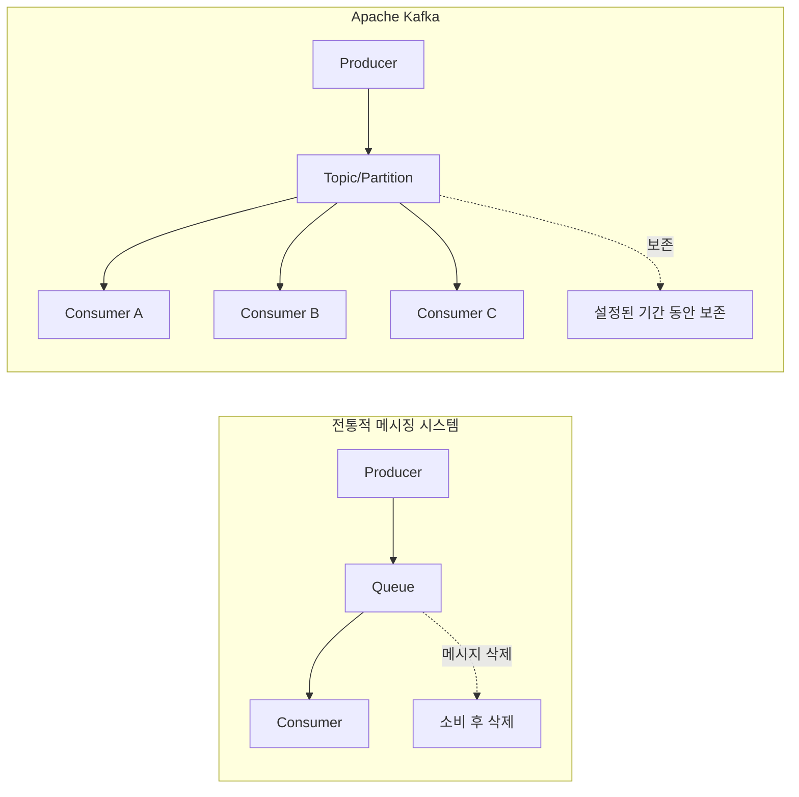
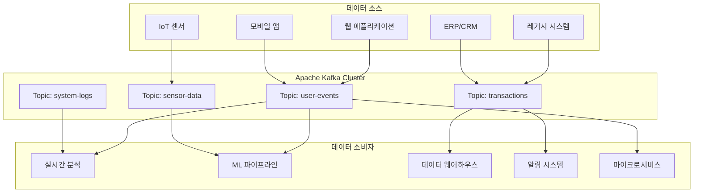
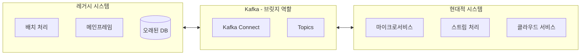
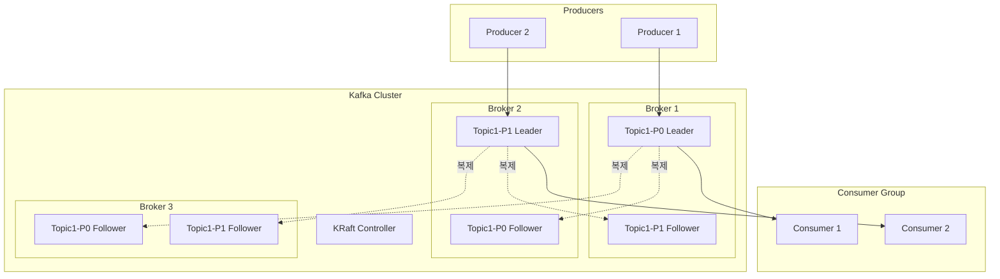
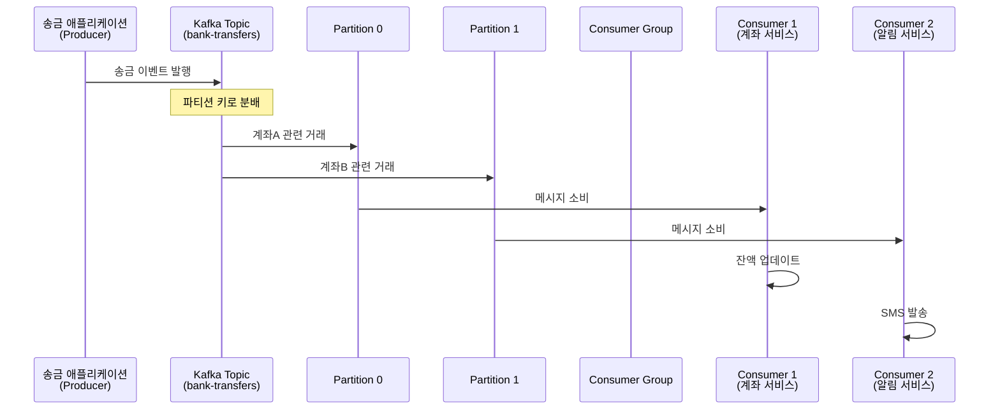
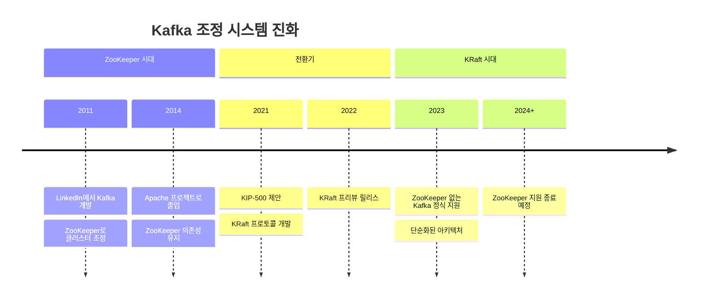
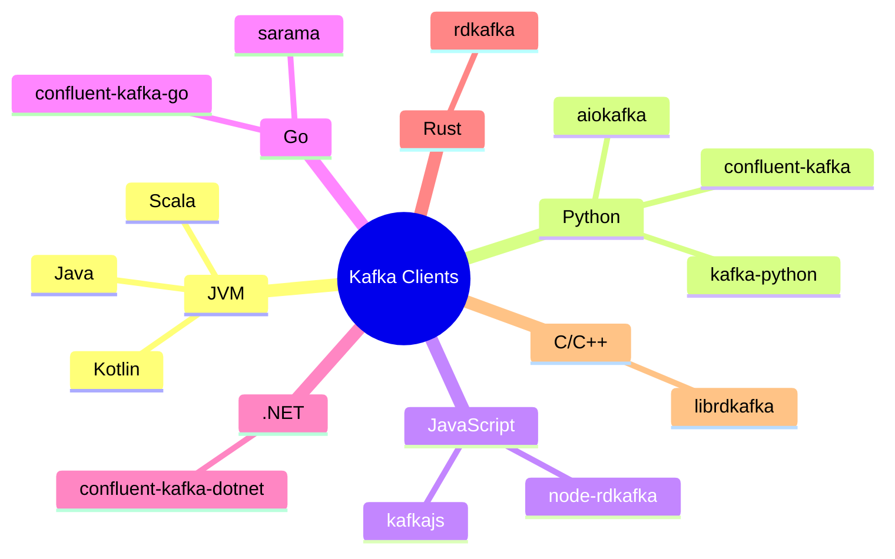
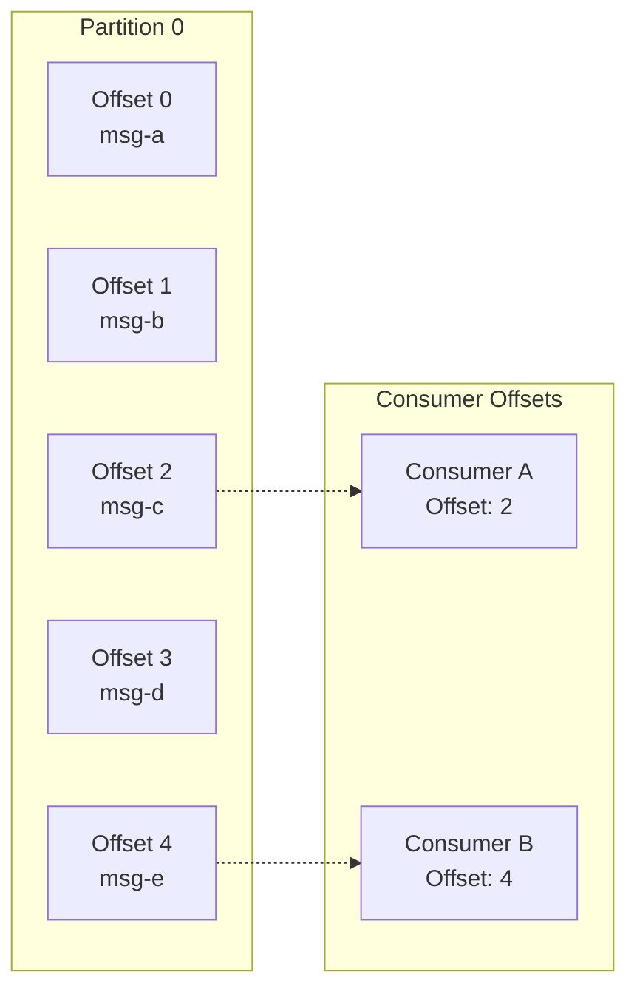
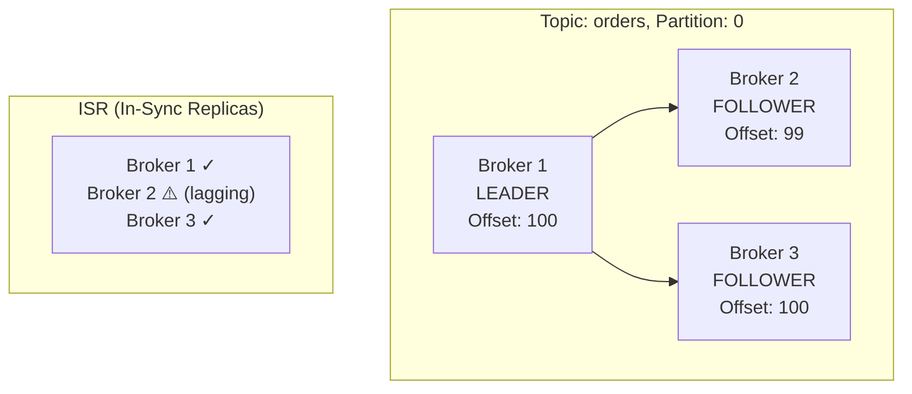
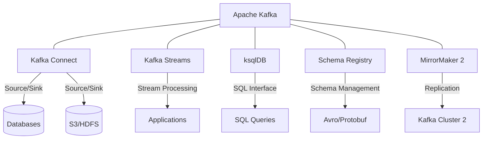

# Chapter 1: Introduction to Apache Kafka

---

## 📌 핵심 요약

> Apache Kafka는 **대용량 실시간 데이터 스트리밍**을 위해 설계된 **분산 스트리밍 플랫폼**이다. LinkedIn에서 시작되어 현재 Fortune 100 기업의 80% 이상이 사용하고 있으며, Producer-Consumer 모델과 영속성 레이어를 통해 기존 메시징 시스템의 한계를 극복한다. Kafka는 기업의 **중앙 신경계(Central Nervous System)** 역할을 하며, 레거시 시스템과 현대적 마이크로서비스 간의 비동기 통신을 가능하게 한다.

---

## 🎯 학습 목표

이 챕터를 읽고 나면 다음을 이해할 수 있다:

- [ ] Apache Kafka가 무엇이며 어떤 문제를 해결하는지 설명할 수 있다
- [ ] Kafka가 엔터프라이즈 에코시스템에서 어떤 역할을 하는지 이해한다
- [ ] Kafka의 핵심 아키텍처 컴포넌트(Producer, Consumer, Topic, Partition, Broker)를 설명할 수 있다
- [ ] Kafka 운영에 필요한 인프라와 도구를 파악할 수 있다
- [ ] 기존 메시징 시스템과 Kafka의 차이점을 구분할 수 있다

---

## 📖 본문 정리

### 1.1 Apache Kafka란 무엇인가?

#### 실시간 데이터 처리의 필요성

현대 비즈니스 환경에서 **실시간 데이터 처리**는 선택이 아닌 필수가 되었다:

| 기대 사항 | 기존 방식 | 현대적 요구 |
|-----------|-----------|-------------|
| 결제 확인 | 익일 처리 | 즉시 확인 |
| 택배 추적 | 하루 1회 업데이트 | 실시간 위치 추적 |
| 이상 거래 탐지 | 배치 분석 후 알림 | 즉각적 알림 |
| 계좌 잔액 조회 | 영업일 기준 반영 | 실시간 반영 |

이러한 실시간 요구사항과 함께 데이터 볼륨의 폭발적 증가(IoT 센서, 디지털 접점 등)가 IT 팀에게 큰 도전 과제를 안겨주고 있다.

#### Kafka의 정의

**Apache Kafka**는 조직의 데이터 흐름을 근본적으로 변화시키는 **오픈소스 분산 스트리밍 플랫폼**이다.

```
┌─────────────────────────────────────────────────────────────┐
│                    Apache Kafka 핵심 특성                     │
├─────────────────────────────────────────────────────────────┤
│  🔄 분산 로그(Distributed Log)                               │
│     - 모든 데이터 이벤트를 영속적으로 저장                      │
│     - 고객 상호작용부터 시스템 상태 변화까지 모든 정보 기록       │
├─────────────────────────────────────────────────────────────┤
│  ⚡ 고성능(High Throughput)                                  │
│     - 초당 수백만 이벤트 처리 가능                             │
│     - 수평적 확장으로 대용량 처리                              │
├─────────────────────────────────────────────────────────────┤
│  🛡️ 내결함성(Fault Tolerance)                               │
│     - 시스템 일부 장애에도 데이터 손실 없음                     │
│     - 복제를 통한 고가용성 보장                                │
└─────────────────────────────────────────────────────────────┘
```

#### 왜 Kafka인가? - 주요 장점

1. **데이터 영속성(Persistence)**
   - 데이터 스트림을 저장하여 실시간 처리와 안정적인 재처리(Replay) 모두 가능
   - 소비 시스템 장애 시 중단된 지점부터 재개 가능
   - 새 서비스가 과거 이벤트를 새 이벤트처럼 처리 가능

2. **분산 아키텍처(Distributed Nature)**
   - 수평적 확장으로 대용량 데이터 처리
   - 단일 클러스터가 초당 수백만 이벤트 처리
   - 일부 시스템 장애에도 데이터 손실 방지

#### Kafka vs 전통적 메시징 시스템



| 특성 | 전통적 메시징 | Apache Kafka |
|------|---------------|--------------|
| 메시지 보존 | 소비 후 삭제 | 설정 기간 동안 보존 |
| 재처리 | 불가능 | 가능 (Offset 기반) |
| 다중 소비자 | 경쟁적 소비 | 독립적 소비 가능 |
| 확장성 | 제한적 | 수평적 확장 용이 |
| 처리량 | 낮음~중간 | 매우 높음 |

---

### 1.2 엔터프라이즈 에코시스템에서의 Kafka

#### 중앙 신경계(Central Nervous System)로서의 Kafka

Kafka는 기업의 모든 데이터가 흐르는 중앙 허브 역할을 한다. 웹, 모바일, IoT, ERP 등 다양한 소스에서 데이터를 받아 분석, ML, 알림 시스템 등으로 전달한다.



#### 이벤트(Event)의 정의

**이벤트(Event)**는 기업 내에서 발생하는 중요한 사건이나 상태 변화를 나타내는 데이터 조각이다:

- 사용자 상호작용 (로그인, 클릭, 구매)
- 시스템 업데이트 (배포, 설정 변경)
- 금융 거래 (입금, 출금, 이체)
- 비즈니스 운영 (주문, 재고 변경)

각 이벤트는 특정 발생의 세부 사항을 캡슐화하는 **구조화된 표현**이다.

#### 레거시와 현대 시스템 연결



**Kafka가 해결하는 기업 과제:**

1. **배치 → 실시간 전환**
   - 일괄 처리에서 실시간 처리로 점진적 전환
   - 고객 기대치 충족 (즉각적인 계좌 잔액 반영 등)

2. **마이크로서비스 통신**
   - 서비스 간 비동기 데이터 교환
   - 한 서비스 장애가 다른 서비스에 영향 주지 않음
   - 독립적인 데이터 포맷 진화 가능

3. **하드웨어 독립성**
   - 전용 하드웨어 불필요
   - 범용 서버에서 운영 가능
   - 서브시스템 장애에도 메시지 전달 보장

---

### 1.3 Kafka 아키텍처 개요

#### 핵심 컴포넌트



#### 컴포넌트 상세 설명

| 컴포넌트 | 설명 | 역할 |
|----------|------|------|
| **Message (Record)** | 바이트 배열로 전송되는 페이로드 | 데이터의 기본 단위, 배치로 그룹화되어 전송 |
| **Producer** | 메시지를 Kafka에 전송하는 클라이언트 | 파티션 리더에 메시지 전송, Partitioner로 파티션 선택 |
| **Topic** | 메시지를 묶는 논리적 단위 | 데이터베이스의 테이블과 유사, 비즈니스 주제별 분류 |
| **Partition** | Topic을 나눈 물리적 단위 | 병렬 처리와 확장성의 핵심, 브로커 간 복제 |
| **Consumer** | Kafka에서 메시지를 읽는 클라이언트 | 여러 파티션/토픽에서 메시지 처리 |
| **Consumer Group** | Consumer들의 논리적 그룹 | 병렬 처리, 파티션 분배, 내결함성 제공 |
| **Broker** | Kafka 서버 | 스토리지, 분배, 복제 관리 |
| **Leader** | 파티션의 읽기/쓰기 담당 브로커 | 모든 읽기/쓰기 요청 처리 |
| **Follower** | 리더로부터 데이터를 복제하는 브로커 | 내결함성 보장, 리더 장애 시 승격 |
| **KRaft** | Kafka 내부 조정 프로토콜 | 메타데이터 관리 (기존 ZooKeeper 대체) |

#### 실제 예시: 은행 송금 시스템



**송금 메시지 구조 예시:**
```json
{
  "eventId": "txn-12345",
  "timestamp": "2024-01-15T10:30:00Z",
  "sourceAccount": "ACC-001",
  "destinationAccount": "ACC-002",
  "amount": 50000,
  "currency": "KRW",
  "type": "TRANSFER"
}
```

#### ZooKeeper에서 KRaft로의 전환



| 항목 | ZooKeeper 방식 | KRaft 방식 |
|------|----------------|------------|
| 외부 의존성 | ZooKeeper 클러스터 필요 | 없음 (자체 내장) |
| 운영 복잡도 | 높음 (2개 시스템 관리) | 낮음 (단일 시스템) |
| 파티션 제한 | ~200,000 파티션 | 수백만 파티션 가능 |
| 리더 선출 | 수 초 소요 | 밀리초 단위 |
| 메타데이터 동기화 | 별도 프로토콜 | Raft 합의 알고리즘 |

---

### 1.4 Kafka 운영 및 사용

#### 운영 필수 요소

```
┌─────────────────────────────────────────────────────────────┐
│                    Kafka 운영 요구사항                        │
├─────────────────────────────────────────────────────────────┤
│  🖥️ 인프라                                                  │
│     • 신뢰성 있는 서버 클러스터                               │
│     • 각 서버가 브로커로 동작                                 │
│     • 범용 하드웨어 사용 가능                                 │
├─────────────────────────────────────────────────────────────┤
│  🌐 네트워크                                                 │
│     • 낮은 지연시간 (Low Latency)                            │
│     • 높은 대역폭 (High Bandwidth)                           │
│     • 브로커 간 원활한 통신 보장                              │
├─────────────────────────────────────────────────────────────┤
│  📊 설계                                                     │
│     • 데이터 요구사항 분석                                    │
│     • 적절한 Topic/Partition 설계                            │
│     • Producer/Consumer 애플리케이션 개발                     │
├─────────────────────────────────────────────────────────────┤
│  🔍 모니터링                                                 │
│     • 성능 추적 전략                                         │
│     • 문제 해결 프로세스                                      │
│     • 알림 및 대시보드                                        │
└─────────────────────────────────────────────────────────────┘
```

#### 관리형 Kafka 서비스

| 제공자 | 서비스명 | 특징 |
|--------|----------|------|
| **AWS** | Amazon MSK | AWS 생태계 통합, 관리형 ZooKeeper/KRaft |
| **Azure** | Azure HDInsight | Azure 서비스 연동, Event Hubs 호환 |
| **Confluent** | Confluent Cloud | Kafka 창시자들의 회사, 풍부한 에코시스템 |
| **Aiven** | Aiven for Kafka | 멀티 클라우드 지원, 간편한 운영 |
| **Redpanda** | Redpanda Cloud | Kafka 호환, C++로 재작성하여 고성능 |
| **WarpStream** | WarpStream | 객체 스토리지 기반, 비용 최적화 |

#### 프로그래밍 언어 및 도구

**Kafka 자체:**
- Scala와 Java로 구현
- JRE(Java Runtime Environment) 필요

**클라이언트 라이브러리:**



---

## 🔍 심화 학습

### Kafka의 역사와 진화

**LinkedIn에서의 탄생 (2010-2011)**

Kafka는 LinkedIn에서 웹사이트 활동 추적과 운영 메트릭 파이프라인을 위해 개발되었다. 당시 LinkedIn은 하루 수십억 개의 이벤트를 처리해야 했고, 기존 메시징 시스템으로는 한계가 있었다.

**주요 개발자:**
- Jay Kreps (현 Confluent CEO)
- Neha Narkhede (현 Confluent CTO)
- Jun Rao

> "카프카(Kafka)"라는 이름은 작가 Franz Kafka에서 따왔다. Jay Kreps가 "글쓰기에 최적화된 시스템"이라는 의미에서 작가의 이름을 선택했다고 한다.

### Offset과 메시지 위치 관리

책에서 간략히 언급된 **Offset**은 Kafka의 핵심 개념이다:



| Offset 특성 | 설명 |
|-------------|------|
| 단조 증가 | 각 파티션 내에서 순차적으로 증가하는 숫자 |
| 파티션별 독립 | 다른 파티션의 Offset과 무관 |
| Consumer 추적 | 각 Consumer Group이 읽은 위치 추적 |
| 재처리 가능 | Offset을 되돌려 과거 메시지 재처리 가능 |

### ISR (In-Sync Replicas)

책에서 언급된 Leader-Follower 복제의 핵심 개념:



- **ISR**: 리더와 동기화된 팔로워 목록
- **replica.lag.time.max.ms**: ISR에서 제외되는 기준 시간
- **min.insync.replicas**: 쓰기 성공에 필요한 최소 ISR 수

### Log Compaction

Kafka의 또 다른 강력한 기능으로, 같은 키를 가진 메시지 중 최신 값만 유지:

```
Before Compaction:
┌────────┬────────┬────────┬────────┬────────┬────────┐
│ key=A  │ key=B  │ key=A  │ key=C  │ key=B  │ key=A  │
│ val=1  │ val=2  │ val=3  │ val=4  │ val=5  │ val=6  │
└────────┴────────┴────────┴────────┴────────┴────────┘

After Compaction:
┌────────┬────────┬────────┐
│ key=C  │ key=B  │ key=A  │
│ val=4  │ val=5  │ val=6  │
└────────┴────────┴────────┘
```

**사용 사례:**
- 데이터베이스 변경 이벤트 (CDC)
- 최신 상태만 필요한 경우
- 키-값 저장소 동기화

### Kafka 에코시스템

책에서 언급된 Kafka Connect와 Kafka Streams 외에도:



---

## 💡 실무 적용 포인트

### 1. Kafka 도입 적합성 판단

**Kafka가 적합한 경우:**
- 대용량 실시간 데이터 스트리밍 필요
- 다수의 Consumer가 같은 데이터를 독립적으로 소비
- 메시지 재처리(Replay) 요구사항 존재
- 마이크로서비스 간 비동기 통신 필요
- 이벤트 소싱 아키텍처 구현

**Kafka가 과도한 경우:**
- 단순한 요청-응답 패턴
- 소량의 메시지 처리
- 강한 트랜잭션 보장이 필요한 경우 (RDB가 더 적합)
- 메시지 순서가 중요하지 않은 단순 작업 큐

### 2. Topic 및 Partition 설계 원칙

```python
# Partition 수 결정 공식 (권장)
# 목표 처리량 / 단일 파티션 처리량 = 필요 파티션 수

# 예시
target_throughput_mb = 100  # MB/s
single_partition_throughput_mb = 10  # MB/s (보수적 추정)
recommended_partitions = target_throughput_mb / single_partition_throughput_mb
# 결과: 10개 파티션 권장
```

**파티션 설계 체크리스트:**
- [ ] Consumer Group의 최대 Consumer 수보다 파티션 수가 크거나 같은가?
- [ ] 파티션 키가 균등하게 분배되는가?
- [ ] 향후 확장을 고려한 여유가 있는가?
- [ ] 순서 보장이 필요한 메시지가 같은 파티션에 들어가는가?

### 3. 운영 환경 선택 가이드

| 요구사항 | 직접 운영 | 관리형 서비스 |
|----------|-----------|---------------|
| 운영 복잡도 허용 | 높음 | 낮음 |
| 비용 최적화 | ✓ (대규모 시) | ✓ (소규모 시) |
| 커스터마이징 | ✓✓✓ | ✓ |
| 빠른 시작 | ✗ | ✓✓✓ |
| 전문 인력 필요 | ✓✓✓ | ✓ |
| 멀티 클라우드 | 가능 | 제공자 의존 |

### 4. 모니터링 핵심 메트릭

```
┌─────────────────────────────────────────────────────────────┐
│                    Kafka 핵심 모니터링 메트릭                  │
├─────────────────────────────────────────────────────────────┤
│  📈 처리량 (Throughput)                                      │
│     • MessagesInPerSec: 초당 수신 메시지 수                    │
│     • BytesInPerSec / BytesOutPerSec                        │
├─────────────────────────────────────────────────────────────┤
│  ⏱️ 지연 (Latency)                                          │
│     • Consumer Lag: 소비자 지연 (가장 중요!)                   │
│     • RequestLatency: 요청 처리 시간                          │
├─────────────────────────────────────────────────────────────┤
│  🖥️ 리소스 (Resources)                                      │
│     • CPU / Memory 사용률                                    │
│     • Disk 사용량 및 I/O                                     │
│     • Network 대역폭                                         │
├─────────────────────────────────────────────────────────────┤
│  🔄 복제 (Replication)                                       │
│     • UnderReplicatedPartitions: 복제 지연 파티션             │
│     • ISRShrinkRate: ISR 축소 빈도                           │
│     • OfflinePartitionsCount: 오프라인 파티션 수               │
└─────────────────────────────────────────────────────────────┘
```

---

## ✅ 정리 체크리스트

### 핵심 개념
- [ ] Apache Kafka는 분산 스트리밍 플랫폼으로, 실시간 데이터 흐름을 처리한다
- [ ] Kafka는 publish-subscribe(producer-consumer) 모델을 사용한다
- [ ] 데이터 영속성으로 재처리(Replay)가 가능하다
- [ ] Fortune 100 기업의 80% 이상이 Kafka를 사용한다

### 아키텍처 컴포넌트
- [ ] Producer: 메시지를 Kafka에 전송
- [ ] Consumer: 메시지를 Kafka에서 수신
- [ ] Topic: 메시지를 논리적으로 그룹화
- [ ] Partition: Topic을 물리적으로 분할하여 병렬 처리
- [ ] Broker: Kafka 서버
- [ ] Consumer Group: Consumer들의 논리적 그룹
- [ ] Leader/Follower: 복제를 통한 내결함성
- [ ] KRaft: ZooKeeper를 대체하는 조정 프로토콜

### 엔터프라이즈 활용
- [ ] Kafka는 레거시와 현대 시스템을 연결하는 브릿지 역할
- [ ] 배치 처리에서 실시간 처리로의 전환 지원
- [ ] 마이크로서비스 간 비동기 통신 플랫폼
- [ ] 범용 하드웨어에서 운영 가능

### 운영 및 도구
- [ ] Kafka는 Java/Scala로 구현, JRE 필요
- [ ] 다양한 언어의 클라이언트 라이브러리 제공
- [ ] 관리형 서비스: AWS MSK, Confluent Cloud, Aiven 등
- [ ] 에코시스템: Kafka Connect, Kafka Streams, ksqlDB

---

## 🔗 참고 자료

### 공식 문서
- [Apache Kafka 공식 문서](https://kafka.apache.org/documentation/)
- [Kafka 설계 문서 (Design)](https://kafka.apache.org/documentation/#design)
- [KRaft 마이그레이션 가이드](https://kafka.apache.org/documentation/#kraft)

### 추가 학습
- [Confluent Developer - Kafka 튜토리얼](https://developer.confluent.io/)
- [Kafka: The Definitive Guide (O'Reilly)](https://www.confluent.io/resources/kafka-the-definitive-guide/)
- [Jay Kreps - The Log: What every software engineer should know](https://engineering.linkedin.com/distributed-systems/log-what-every-software-engineer-should-know-about-real-time-datas-unifying)

### 모니터링 도구
- [Kafka UI](https://github.com/provectus/kafka-ui) - 오픈소스 웹 UI
- [AKHQ](https://akhq.io/) - Kafka 관리 도구
- [Burrow](https://github.com/linkedin/Burrow) - Consumer Lag 모니터링

### 관리형 서비스
- [Amazon MSK](https://aws.amazon.com/msk/)
- [Confluent Cloud](https://www.confluent.io/confluent-cloud/)
- [Aiven for Apache Kafka](https://aiven.io/kafka)

---

*📅 작성일: 2025-12-26*
*📚 출처: Kafka in Action (또는 관련 Kafka 서적)*
