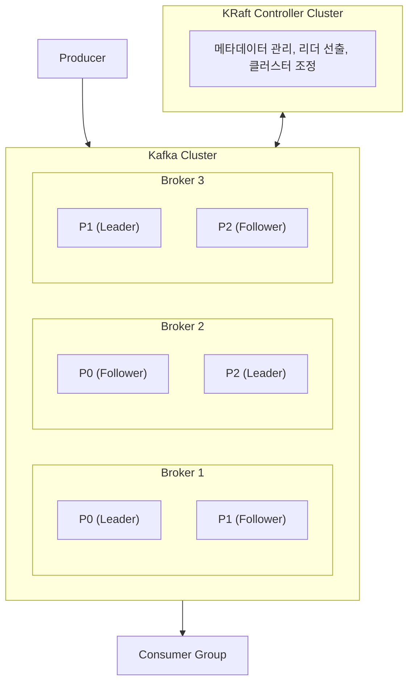
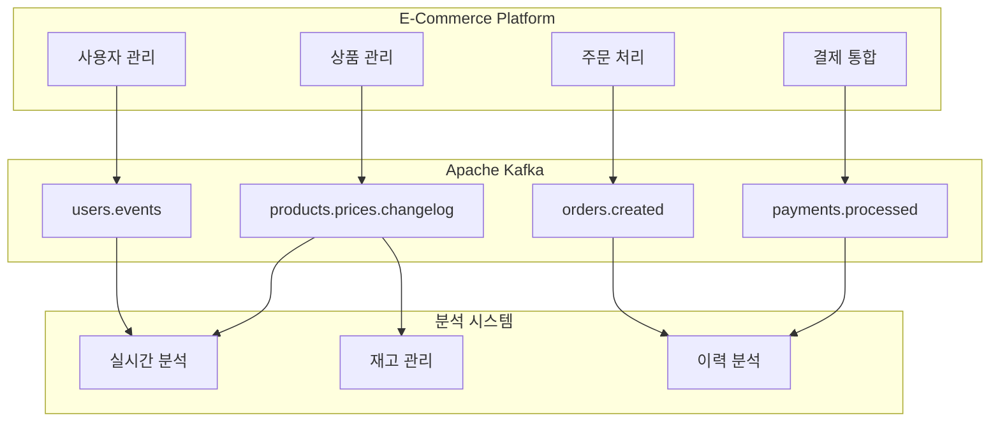
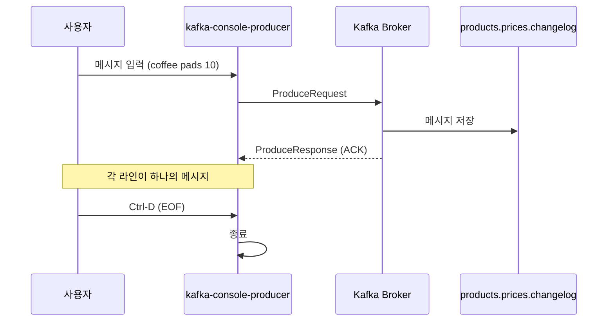
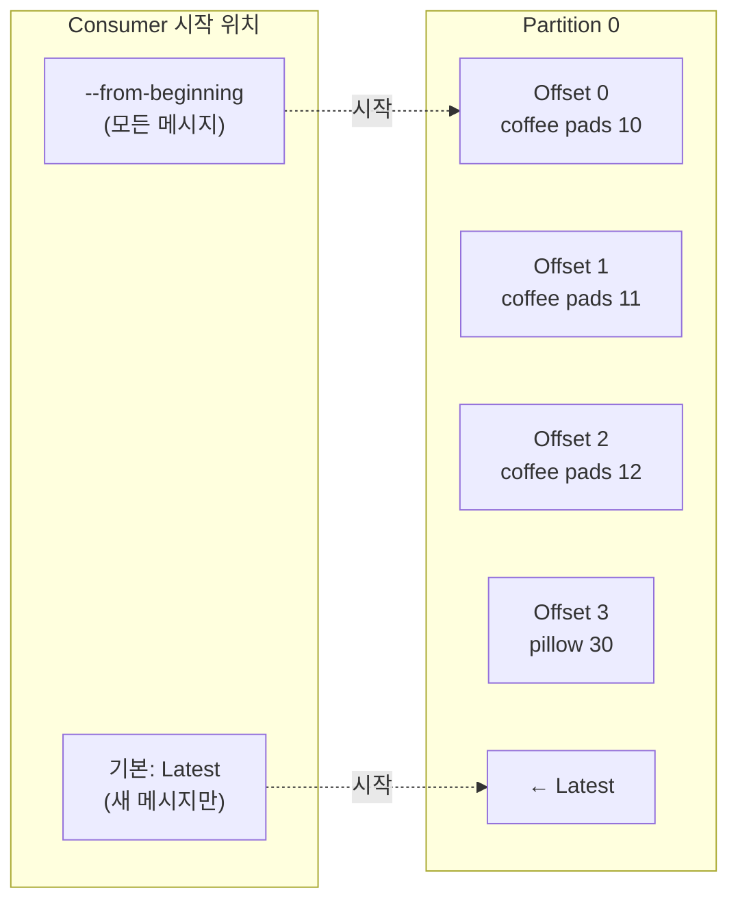
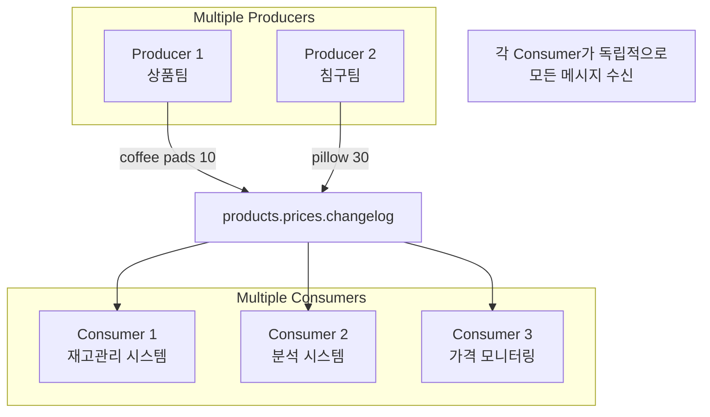
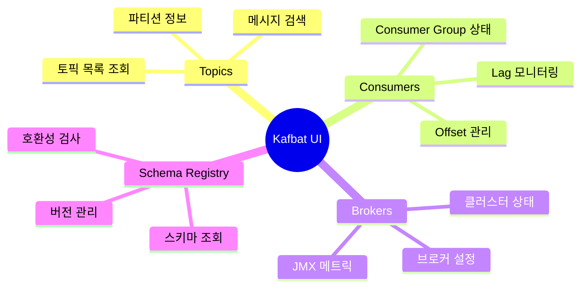
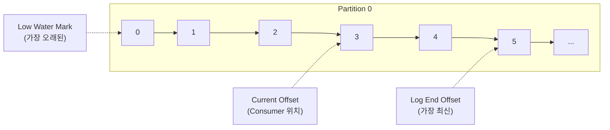
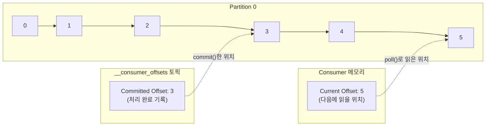
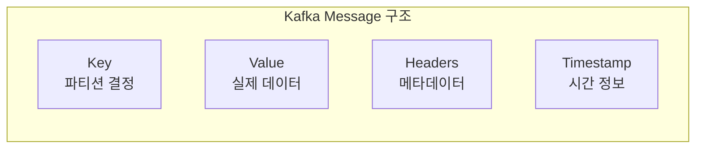
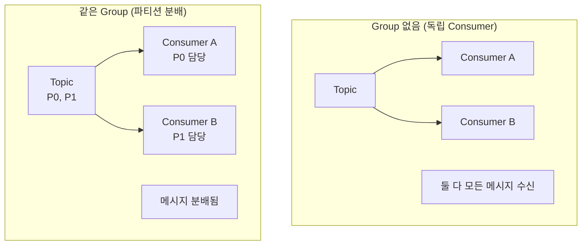

# Chapter 2: First Steps with Kafka

---

## 🏗️ Kafka 기본 개념

### Kafka란?

Apache Kafka는 LinkedIn에서 2011년 개발한 **분산 이벤트 스트리밍 플랫폼**입니다. 현재 Apache 재단의 오픈소스 프로젝트로 관리됩니다.

### Kafka의 세 가지 핵심 기능

| 기능 | 설명 | 사용 사례 |
|------|------|-----------|
| **Publish/Subscribe** | 이벤트 스트림 발행/구독 | 실시간 데이터 파이프라인 |
| **Store** | 이벤트 스트림 내구성 있게 저장 | 이벤트 소싱, 감사 로그 |
| **Process** | 이벤트 스트림 실시간 처리 | 실시간 분석, 변환 |

### 기존 메시징 시스템과의 차이

| 특성 | 기존 MQ (RabbitMQ 등) | Kafka |
|------|----------------------|-------|
| 메시지 소비 | 소비하면 삭제 | 소비해도 보존 (설정 기간) |
| 재처리 | 불가능 | 가능 (Offset 리셋) |
| 처리량 | 중간 | 매우 높음 |
| 순서 보장 | 큐 단위 | 파티션 단위 |
| 확장성 | 제한적 | 수평 확장 용이 |

### Kafka가 빠른 이유

Kafka가 빠른 이유는 크게 네 가지입니다.

**첫째, Sequential I/O를 사용합니다.** 디스크에 순차적으로 쓰기 때문에 랜덤 I/O보다 100배 빠른 성능을 냅니다. 일반적으로 "디스크는 느리다"고 생각하지만, 순차 쓰기는 SSD보다 빠를 수 있습니다.

**둘째, Zero-Copy 기술을 활용합니다.** 데이터를 커널에서 직접 네트워크로 전송하여 사용자 공간 복사 오버헤드를 없앱니다. 일반적인 방식은 커널→사용자 공간→커널→네트워크 4단계지만, Zero-Copy는 커널→네트워크 2단계로 줄입니다.

**셋째, Batching으로 네트워크 효율을 높입니다.** 여러 메시지를 묶어서 한 번에 전송하여 네트워크 왕복(round-trip) 오버헤드를 줄입니다.

**넷째, 배치 단위 Compression을 적용합니다.** gzip, snappy, lz4, zstd 등 압축 알고리즘을 적용하여 네트워크 대역폭을 절약합니다.

### Kafka 아키텍처



### 핵심 구성 요소

| 구성 요소 | 역할 | 상세 설명 |
|-----------|------|-----------|
| **Broker** | 메시지 저장/전달 | Kafka 서버 인스턴스, 최소 3개 권장 |
| **Topic** | 메시지 분류 | 논리적 채널, DB 테이블과 유사 |
| **Partition** | 병렬 처리 단위 | 토픽을 물리적으로 분할 |
| **Producer** | 메시지 발행 | 토픽에 메시지 전송 |
| **Consumer** | 메시지 구독 | 토픽에서 메시지 수신 |
| **Consumer Group** | Consumer 집합 | 파티션 분배, 부하 분산 |
| **KRaft Controller** | 클러스터 관리 | 메타데이터, 리더 선출 |

---

## 📌 핵심 요약

> 이 챕터에서는 Kafka의 핵심 CLI 도구를 사용하여 실제로 메시지를 생산하고 소비하는 과정을 실습한다. **kafka-topics.sh**, **kafka-console-producer.sh**, **kafka-console-consumer.sh** 세 가지 명령어를 통해 토픽 생성, 메시지 발행, 메시지 소비의 기본 워크플로우를 익힌다. 또한 **다중 Producer/Consumer 병렬 처리**와 **--from-beginning** 옵션을 통한 과거 데이터 재처리 방법을 학습한다.

---

## 🎯 학습 목표

이 챕터를 읽고 나면 다음을 수행할 수 있다:

- [ ] kafka-topics.sh를 사용하여 Kafka 토픽을 생성할 수 있다
- [ ] kafka-console-producer.sh로 메시지를 발행할 수 있다
- [ ] kafka-console-consumer.sh로 메시지를 소비할 수 있다
- [ ] --from-beginning 옵션으로 과거 메시지를 조회할 수 있다
- [ ] 다중 Producer와 Consumer가 동시에 동작하는 원리를 이해한다
- [ ] Kafka GUI 도구의 역할과 사용 시 주의사항을 파악한다

---

## 📖 본문 정리

### 2.1 Use Case 소개: E-commerce 플랫폼

이 책에서는 일관된 예제로 **온라인 쇼핑 플랫폼**을 사용한다. 이 플랫폼은 Kafka의 실제 활용 시나리오를 보여주기 위한 실용적인 예시이다.



**주요 기능 영역:**
- **사용자 관리**: 회원가입, 로그인, 프로필 변경 이벤트
- **상품 관리**: 가격 변경, 재고 업데이트, 상품 등록
- **주문 처리**: 주문 생성, 상태 변경, 배송 추적
- **결제 통합**: 결제 요청, 승인, 환불 처리

---

### 2.2 토픽 생성: kafka-topics.sh

#### 실습: 가격 변경 이력 토픽 생성

상품 가격 업데이트를 기록하기 위한 토픽을 생성한다.

```bash
$ kafka-topics.sh \
    --create \
    --topic products.prices.changelog \
    --partitions 1 \
    --replication-factor 1 \
    --bootstrap-server localhost:9092
```

**출력:**
```
Created topic products.prices.changelog.
```

#### 명령어 옵션 설명

| 옵션 | 설명 | 예시 값 |
|------|------|---------|
| `--create` | 새 토픽 생성 | - |
| `--topic` | 토픽 이름 지정 | products.prices.changelog |
| `--partitions` | 파티션 수 | 1 (시작은 단순하게) |
| `--replication-factor` | 복제 팩터 | 1 (개발 환경) |
| `--bootstrap-server` | Kafka 브로커 주소 | localhost:9092 |

#### 토픽 네이밍 컨벤션

```
┌─────────────────────────────────────────────────────────────┐
│                    Kafka 토픽 네이밍 규칙                     │
├─────────────────────────────────────────────────────────────┤
│  ✅ 권장 규칙                                                │
│     • 소문자 사용                                            │
│     • 점(.)으로 계층 구분                                    │
│     • 명확하고 일관된 이름                                    │
├─────────────────────────────────────────────────────────────┤
│  📝 네이밍 패턴                                              │
│     • {도메인}.{이벤트유형}                                   │
│     • {도메인}.{엔티티}.{동작}                                │
│     • {서비스명}.{도메인}.{이벤트}                            │
├─────────────────────────────────────────────────────────────┤
│  📋 예시                                                     │
│     • products.prices.changelog                             │
│     • orders.created                                        │
│     • users.profile.updated                                 │
│     • payments.transactions.completed                       │
└─────────────────────────────────────────────────────────────┘
```

#### 자주 발생하는 오류

| 오류 상황 | 원인 | 해결 방법 |
|-----------|------|-----------|
| Connection refused | Kafka가 실행되지 않음 | Kafka 서비스 시작 확인 |
| Topic already exists | 동일 이름 토픽 존재 | `--list`로 확인 후 삭제 또는 다른 이름 사용 |
| Replication factor larger than available brokers | 브로커 수보다 큰 복제 팩터 | 복제 팩터 줄이기 |

---

### 2.3 메시지 생산: kafka-console-producer.sh

#### 실습: 가격 변경 메시지 발행

```bash
$ echo "coffee pads 10" | kafka-console-producer.sh \
    --topic products.prices.changelog \
    --bootstrap-server localhost:9092
```

**특징:**
- 성공 시 별도의 확인 메시지가 출력되지 않음
- 파이프(`|`)를 통해 직접 데이터 전송 가능
- 대화형 모드로도 사용 가능

#### 대화형 모드 사용

```bash
$ kafka-console-producer.sh \
    --topic products.prices.changelog \
    --bootstrap-server localhost:9092
> coffee pads 11
> coffee pads 12
> pillow 30
# Ctrl-D로 종료 (EOF 전송)
```



---

### 2.4 메시지 소비: kafka-console-consumer.sh

#### 기본 소비 (최신 메시지만)

```bash
$ kafka-console-consumer.sh \
    --topic products.prices.changelog \
    --bootstrap-server localhost:9092
# Ctrl-C로 종료
```

**중요:** 기본적으로 **토픽의 끝(latest)**부터 읽기 시작하므로 이미 존재하는 메시지는 보이지 않는다.

#### 처음부터 소비 (--from-beginning)

```bash
$ kafka-console-consumer.sh \
    --topic products.prices.changelog \
    --from-beginning \
    --bootstrap-server localhost:9092
```

**출력:**
```
coffee pads 10
coffee pads 11
coffee pads 12
pillow 30
```

#### Consumer 시작 위치 이해



| 옵션 | 동작 | 사용 시나리오 |
|------|------|--------------|
| (기본) | 토픽의 끝(latest)부터 읽기 | 실시간 스트리밍, 새 메시지만 처리 |
| `--from-beginning` | 토픽의 처음(earliest)부터 읽기 | 과거 데이터 분석, 초기 로드 |

---

### 2.5 병렬 생산 및 소비

#### 다중 Consumer 동시 소비

Kafka의 핵심 특징 중 하나는 **동일한 메시지를 여러 Consumer가 독립적으로 읽을 수 있다**는 점이다.



#### 실습: 병렬 Producer/Consumer 구성

**터미널 1 - Consumer (재고 관리):**
```bash
$ kafka-console-consumer.sh \
    --topic products.prices.changelog \
    --bootstrap-server localhost:9092
```

**터미널 2 - Consumer (분석, 과거 데이터 포함):**
```bash
$ kafka-console-consumer.sh \
    --topic products.prices.changelog \
    --from-beginning \
    --bootstrap-server localhost:9092
```

**터미널 3 - Producer 1 (상품팀):**
```bash
$ kafka-console-producer.sh \
    --topic products.prices.changelog \
    --bootstrap-server localhost:9092
> coffee pads 11
> coffee pads 12
```

**터미널 4 - Producer 2 (침구팀):**
```bash
$ kafka-console-producer.sh \
    --topic products.prices.changelog \
    --bootstrap-server localhost:9092
> pillow 30
> blanket 40
```

**결과:**
```
# Consumer 1 (실시간만)
coffee pads 11
coffee pads 12
pillow 30
blanket 40

# Consumer 2 (과거 + 실시간)
coffee pads 10      # 과거 데이터
coffee pads 11
coffee pads 12
pillow 30
blanket 40
```

#### 핵심 특성

| 특성 | 설명 |
|------|------|
| **독립적 소비** | 각 Consumer가 다른 Consumer와 무관하게 동작 |
| **데이터 보존** | 기본 7일, 설정으로 무기한 보존 가능 |
| **재처리 가능** | 언제든 과거 데이터 다시 읽기 가능 |
| **병렬 생산** | 여러 Producer가 동시에 메시지 발행 가능 |
| **순서 보장** | 메시지 생산 순서대로 소비 |

---

### 2.6 Kafka GUI 도구

#### 주요 GUI 도구

| 도구 | 라이선스 | 특징 |
|------|----------|------|
| **Kafbat UI** | 오픈소스 | 토픽/메시지 조회, Consumer Group 모니터링 |
| **AKHQ** | 오픈소스 | 종합적인 Kafka 관리 |
| **Kadeck** | 상용 | 기업용 고급 기능 |
| **Confluent Control Center** | 상용 | Confluent 플랫폼 통합 |
| **Kafdrop** | 오픈소스 | 경량 웹 UI |

#### Kafbat UI 기능



#### ⚠️ 프로덕션 환경 주의사항

```
┌─────────────────────────────────────────────────────────────┐
│              🚨 프로덕션 GUI 사용 경고                        │
├─────────────────────────────────────────────────────────────┤
│  ❌ 절대 하지 말아야 할 것                                    │
│     • GUI를 통한 메시지 직접 생산                             │
│     • GUI에서 설정 변경                                       │
│     • 수동으로 Offset 조작                                    │
├─────────────────────────────────────────────────────────────┤
│  📋 이유                                                     │
│     • 데이터 일관성 문제 발생 가능                            │
│     • 불충분한 에러 핸들링                                    │
│     • 확장성 부족                                            │
│     • 감사(Audit) 추적 어려움                                 │
├─────────────────────────────────────────────────────────────┤
│  ✅ GUI 적절한 사용 목적                                      │
│     • 모니터링 및 시각화                                      │
│     • 디버깅 및 트러블슈팅                                    │
│     • 메시지 내용 확인 (읽기 전용)                            │
│     • 클러스터 상태 파악                                      │
└─────────────────────────────────────────────────────────────┘
```

---

## 🔍 심화 학습

### Offset 상세

#### Offset이란?

Offset은 파티션 내 메시지의 **고유 위치**입니다. 0부터 시작하여 순차적으로 증가하며, Consumer가 "어디까지 읽었는지" 추적하는 데 사용됩니다.



#### Offset 종류와 저장 위치

| Offset 종류 | 설명 | 저장 위치 |
|-------------|------|-----------|
| **Log Start Offset** | 파티션에서 가장 오래된 메시지 위치 | Broker (토픽 메타데이터) |
| **Log End Offset (LEO)** | 파티션에서 다음 메시지가 쓰일 위치 | Broker (토픽 메타데이터) |
| **High Water Mark (HWM)** | 모든 ISR에 복제 완료된 마지막 위치 | Broker |
| **Current Offset** | Consumer가 다음에 읽을 위치 | **Consumer 메모리** (휘발성) |
| **Committed Offset** | Consumer가 마지막으로 커밋한 위치 | `__consumer_offsets` 토픽 |

#### Current Offset vs Committed Offset

**왜 두 개가 필요한가요?** Current Offset은 "지금 어디까지 읽었는지", Committed Offset은 "어디까지 처리 완료했는지"입니다. 메시지를 읽는 것(fetch)과 처리 완료를 기록하는 것(commit)은 별개의 행위입니다.



**핵심 차이**:
| 구분 | Current Offset | Committed Offset |
|------|----------------|------------------|
| 의미 | 다음에 읽을 위치 | 처리 완료한 위치 |
| 저장 위치 | Consumer 메모리 | `__consumer_offsets` 토픽 |
| 휘발성 | O (재시작 시 사라짐) | X (영구 저장) |
| 업데이트 시점 | poll() 호출 시 | commit() 호출 시 |

**Consumer 재시작 시**: 메모리의 Current Offset은 사라지고, `__consumer_offsets`에서 Committed Offset을 읽어와 그 위치부터 다시 시작합니다.

#### LAG (지연)

```
LAG = Log End Offset - Current Offset
    = 아직 처리하지 않은 메시지 수

예시:
Log End Offset: 1000 (토픽에 1000번째 메시지까지 있음)
Current Offset: 800  (Consumer가 800번째까지 처리)
LAG: 200            (200개 메시지 밀림)
```

**LAG 모니터링이 중요한 이유**:
- LAG 증가 → Consumer 처리 속도 < Producer 생산 속도
- LAG가 계속 증가하면 → Consumer 스케일아웃 필요
- LAG가 갑자기 증가하면 → Consumer 장애 의심

---

### Kafka CLI 도구 전체 목록

책에서 다룬 세 가지 도구 외에도 Kafka는 다양한 CLI 도구를 제공한다:

#### 토픽 관리

```bash
# 토픽 목록 조회
$ kafka-topics.sh --list --bootstrap-server localhost:9092

# 토픽 상세 정보
$ kafka-topics.sh --describe \
    --topic products.prices.changelog \
    --bootstrap-server localhost:9092

# 토픽 삭제
$ kafka-topics.sh --delete \
    --topic products.prices.changelog \
    --bootstrap-server localhost:9092

# 토픽 설정 변경
$ kafka-configs.sh --alter \
    --entity-type topics \
    --entity-name products.prices.changelog \
    --add-config retention.ms=86400000 \
    --bootstrap-server localhost:9092
```

#### Consumer Group 관리

```bash
# Consumer Group 목록
$ kafka-consumer-groups.sh --list \
    --bootstrap-server localhost:9092

# Consumer Group 상세 (Lag 포함)
$ kafka-consumer-groups.sh --describe \
    --group my-consumer-group \
    --bootstrap-server localhost:9092

# Offset 리셋
$ kafka-consumer-groups.sh --reset-offsets \
    --group my-consumer-group \
    --topic products.prices.changelog \
    --to-earliest \
    --execute \
    --bootstrap-server localhost:9092
```

### 메시지 키와 값

책에서는 단순 문자열 메시지만 다뤘지만, 실제 Kafka 메시지는 **Key-Value** 구조를 가진다:



**Key가 있는 메시지 생산:**
```bash
$ kafka-console-producer.sh \
    --topic products.prices.changelog \
    --property "parse.key=true" \
    --property "key.separator=:" \
    --bootstrap-server localhost:9092
> product-001:coffee pads 10
> product-002:pillow 30
```

**Key와 Value 함께 소비:**
```bash
$ kafka-console-consumer.sh \
    --topic products.prices.changelog \
    --from-beginning \
    --property "print.key=true" \
    --property "key.separator=:" \
    --bootstrap-server localhost:9092
```

**출력:**
```
product-001:coffee pads 10
product-002:pillow 30
```

### 파티션 지정 생산/소비

**특정 파티션에 메시지 생산:**
```bash
# 파티션 0에만 메시지 생산
$ kafka-console-producer.sh \
    --topic products.prices.changelog \
    --bootstrap-server localhost:9092 \
    --property "parse.key=true" \
    --property "key.separator=:"
```

**특정 파티션에서 소비:**
```bash
$ kafka-console-consumer.sh \
    --topic products.prices.changelog \
    --partition 0 \
    --from-beginning \
    --bootstrap-server localhost:9092
```

### Consumer Group 실습

```bash
# 같은 Group의 여러 Consumer
# 터미널 1
$ kafka-console-consumer.sh \
    --topic products.prices.changelog \
    --group price-monitors \
    --bootstrap-server localhost:9092

# 터미널 2
$ kafka-console-consumer.sh \
    --topic products.prices.changelog \
    --group price-monitors \
    --bootstrap-server localhost:9092
```

**차이점:**
- `--group` 없이: 각 Consumer가 **모든 메시지** 수신
- `--group` 있을 때: 메시지가 Group 내 Consumer들에게 **분배**됨



---

## 💡 실무 적용 포인트

### 1. 개발 환경 설정 팁

```bash
# 자주 사용하는 alias 설정 (~/.bashrc 또는 ~/.zshrc)
alias kft='kafka-topics.sh --bootstrap-server localhost:9092'
alias kfp='kafka-console-producer.sh --bootstrap-server localhost:9092'
alias kfc='kafka-console-consumer.sh --bootstrap-server localhost:9092'

# 사용 예
$ kft --list
$ kfp --topic my-topic
$ kfc --topic my-topic --from-beginning
```

### 2. 토픽 설계 체크리스트

| 항목 | 고려 사항 |
|------|-----------|
| **네이밍** | 일관된 컨벤션, 소문자, 점(.) 구분 |
| **파티션 수** | 예상 처리량, Consumer 수 고려 |
| **복제 팩터** | 프로덕션: 최소 3, 개발: 1 |
| **보존 기간** | 데이터 특성에 따라 설정 |
| **Cleanup Policy** | delete(기본) vs compact |

### 3. 테스트 데이터 생성 스크립트

```bash
#!/bin/bash
# test-producer.sh

TOPIC="products.prices.changelog"
BOOTSTRAP="localhost:9092"

products=("coffee" "tea" "pillow" "blanket" "towel")

for i in {1..100}; do
    product=${products[$RANDOM % ${#products[@]}]}
    price=$((RANDOM % 100 + 1))
    echo "${product} ${price}" | kafka-console-producer.sh \
        --topic $TOPIC \
        --bootstrap-server $BOOTSTRAP
    sleep 0.1
done

echo "100 messages produced to $TOPIC"
```

### 4. 메시지 카운트 확인

```bash
# 토픽의 총 메시지 수 확인
$ kafka-run-class.sh kafka.tools.GetOffsetShell \
    --broker-list localhost:9092 \
    --topic products.prices.changelog \
    --time -1

# 또는 kafka-consumer-groups.sh로 확인
$ kafka-consumer-groups.sh --describe \
    --group test-group \
    --bootstrap-server localhost:9092
```

### 5. 트러블슈팅 가이드

| 문제 | 증상 | 해결 방법 |
|------|------|-----------|
| Consumer가 메시지를 못 받음 | 출력 없음 | `--from-beginning` 확인, 토픽 이름 확인 |
| Producer 연결 실패 | Connection refused | Kafka 서비스 상태 확인 |
| 오래된 메시지 없음 | 예상보다 적은 메시지 | retention.ms 설정 확인 |
| 느린 소비 | 높은 Lag | 파티션 수 증가, Consumer 추가 |

---

## ✅ 정리 체크리스트

### CLI 도구
- [ ] `kafka-topics.sh --create`: 토픽 생성
- [ ] `kafka-topics.sh --list`: 토픽 목록
- [ ] `kafka-topics.sh --describe`: 토픽 상세 정보
- [ ] `kafka-console-producer.sh`: 메시지 생산
- [ ] `kafka-console-consumer.sh`: 메시지 소비

### 주요 옵션
- [ ] `--topic`: 토픽 이름 지정
- [ ] `--bootstrap-server`: Kafka 브로커 주소
- [ ] `--partitions`: 파티션 수 (토픽 생성 시)
- [ ] `--replication-factor`: 복제 팩터 (토픽 생성 시)
- [ ] `--from-beginning`: 토픽 처음부터 소비
- [ ] `--group`: Consumer Group 지정

### 핵심 개념
- [ ] 기본 Consumer는 토픽 끝(latest)부터 읽기 시작
- [ ] 여러 Consumer가 동일 토픽을 독립적으로 소비 가능
- [ ] 여러 Producer가 동일 토픽에 병렬로 생산 가능
- [ ] 데이터는 기본 7일간 보존

### GUI 도구
- [ ] Kafbat UI, AKHQ 등 오픈소스 도구 활용 가능
- [ ] 프로덕션에서는 모니터링 용도로만 사용
- [ ] GUI로 메시지 생산/설정 변경은 금지

### 단축키
- [ ] Producer 종료: `Ctrl-D` (EOF)
- [ ] Consumer 종료: `Ctrl-C` (인터럽트)

---

## 🎯 면접 대비 요약

### 한 줄 정의

> **"Kafka란 대용량 실시간 데이터를 발행/구독 방식으로 처리하고 내구성 있게 저장하는 분산 이벤트 스트리밍 플랫폼입니다."**

### 핵심 포인트 3가지

1. **메시지 보존**: 기존 MQ와 달리 메시지를 소비해도 삭제하지 않고 설정 기간 동안 보존합니다. 덕분에 재처리가 가능하고 여러 Consumer가 같은 메시지를 읽을 수 있습니다.

2. **파티션 기반 병렬 처리**: 토픽을 파티션으로 분할하여 여러 Consumer가 동시에 처리합니다. 파티션 수가 최대 병렬 Consumer 수를 결정합니다.

3. **고성능 아키텍처**: Sequential I/O, Zero-Copy, Batching, Compression을 통해 초당 수백만 메시지를 처리할 수 있습니다.

### 자주 묻는 질문

**Q: Kafka와 RabbitMQ의 차이점은?**

A: 가장 큰 차이는 메시지 소비 후 처리입니다. RabbitMQ는 메시지를 소비하면 삭제하지만, Kafka는 설정 기간 동안 보존합니다. 이로 인해 Kafka는 재처리가 가능하고, 여러 Consumer Group이 같은 메시지를 독립적으로 소비할 수 있습니다. 또한 Kafka는 파티션 기반 수평 확장이 용이하여 대용량 처리에 적합합니다.

**Q: Consumer Group은 왜 필요한가요?**

A: Consumer Group은 두 가지 목적을 달성합니다. 첫째, **Load Balancing**입니다. 같은 그룹의 Consumer들이 파티션을 나눠 소비하여 처리량을 높입니다. 둘째, **Fan-out**입니다. 서로 다른 그룹은 같은 메시지를 독립적으로 소비하여 여러 서비스가 동일 데이터를 활용할 수 있습니다.

**Q: Offset이란 무엇이고 왜 중요한가요?**

A: Offset은 파티션 내 메시지의 고유 위치입니다. Consumer가 어디까지 읽었는지 추적하는 데 사용됩니다. Offset을 커밋하면 Consumer가 재시작해도 커밋된 위치부터 이어서 읽습니다. Offset을 리셋하면 과거 메시지를 재처리할 수 있습니다.

**Q: 파티션 수를 어떻게 정해야 하나요?**

A: 두 가지 기준이 있습니다. 첫째, 예상 최대 Consumer 수 이상이어야 합니다. 파티션보다 Consumer가 많으면 남는 Consumer는 유휴 상태가 됩니다. 둘째, 목표 처리량을 단일 파티션 처리량으로 나눈 값입니다. 주의할 점은 파티션 수는 늘릴 수만 있고 줄일 수 없으므로 신중히 결정해야 합니다.

---

## 🔗 참고 자료

### 공식 문서
- [Kafka CLI 도구 가이드](https://kafka.apache.org/documentation/#quickstart)
- [kafka-topics.sh 상세](https://kafka.apache.org/documentation/#topicconfigs)
- [Consumer 설정](https://kafka.apache.org/documentation/#consumerconfigs)

### GUI 도구
- [Kafbat UI (구 kafka-ui)](https://github.com/kafbat/kafka-ui)
- [AKHQ](https://akhq.io/)
- [Kafdrop](https://github.com/obsidiandynamics/kafdrop)

### 추가 학습
- [Kafka CLI Cheat Sheet](https://docs.confluent.io/kafka/operations-tools/kafka-tools.html)
- [Conduktor CLI 대안](https://www.conduktor.io/)

### Docker로 Kafka 실행
```bash
# Docker Compose로 빠른 시작
# https://github.com/confluentinc/cp-all-in-one
docker-compose up -d
```

---

## 🔬 관련 실습

- [Stage 01: Kafka 기초 실습](../../../poc/04-kafka/01-basics/)

---

*📅 작성일: 2025-12-26*
*📚 출처: Kafka in Action / First Steps with Kafka*
