# Chapter 3: Exploring Kafka Topics and Messages

---

## 📌 핵심 요약

> 이 챕터에서는 Kafka의 기본 구성 요소인 **토픽(Topic)**과 **메시지(Message)**의 세부 구조를 탐구한다. 토픽은 데이터베이스의 테이블과 유사하게 데이터를 조직화하는 채널이며, **파티션(Partition)**과 **복제(Replication)**를 통해 성능과 신뢰성을 확보한다. 메시지는 **States, Deltas, Events, Commands** 네 가지 유형으로 분류되며, **Key-Value** 구조와 **Headers, Timestamp**로 구성된다. 특히 **Key**는 파티션 결정과 순서 보장에 핵심적인 역할을 한다.

---

## 🎯 학습 목표

이 챕터를 읽고 나면 다음을 수행할 수 있다:

- [ ] kafka-topics.sh로 토픽을 조회, 생성, 수정, 삭제할 수 있다
- [ ] 파티션과 복제 팩터의 역할을 이해하고 적절히 설정할 수 있다
- [ ] Leader, Follower, ISR의 개념을 설명할 수 있다
- [ ] 메시지 타입(States, Deltas, Events, Commands)을 구분하고 적절히 활용할 수 있다
- [ ] 메시지의 Key-Value 구조와 Key의 역할을 이해한다
- [ ] 데이터 포맷(JSON, Avro, Protobuf)의 특징과 선택 기준을 파악한다

---

## 📖 본문 정리

### 3.1 토픽(Topics)

토픽은 데이터베이스의 **테이블**과 유사하게 데이터 흐름을 조직화하는 핵심 단위이다.

#### 3.1.1 토픽 조회 (--describe, --list)

**토픽 상세 정보 조회:**
```bash
$ kafka-topics.sh \
    --describe \
    --topic products.prices.changelog \
    --bootstrap-server localhost:9092
```

**출력 예시:**
```
Topic: products.prices.changelog TopicId: GGYA9u_aRPSd0JRaGn2eBA
PartitionCount: 1 ReplicationFactor: 1 Configs:
  Topic: products.prices.changelog Partition: 0 Leader: 3 Replicas: 3
    Isr: 3 Elr: LastKnownElr:
```

#### 출력 필드 설명

| 필드 | 설명 | 예시 값 |
|------|------|---------|
| **TopicId** | 토픽 고유 식별자 (자동 생성) | GGYA9u_aRPSd0JRaGn2eBA |
| **PartitionCount** | 파티션 수 | 1 |
| **ReplicationFactor** | 복제 팩터 | 1 |
| **Configs** | 토픽 설정값 | (기본값이면 비어있음) |
| **Leader** | 파티션 리더 브로커 ID | 3 |
| **Replicas** | 복제본이 있는 브로커 목록 | 3,2 |
| **ISR** | 동기화된 복제본 (In-Sync Replicas) | 3,2 |
| **ELR** | 리더 승격 가능 복제본 | - |

#### Kafka 클러스터 아키텍처

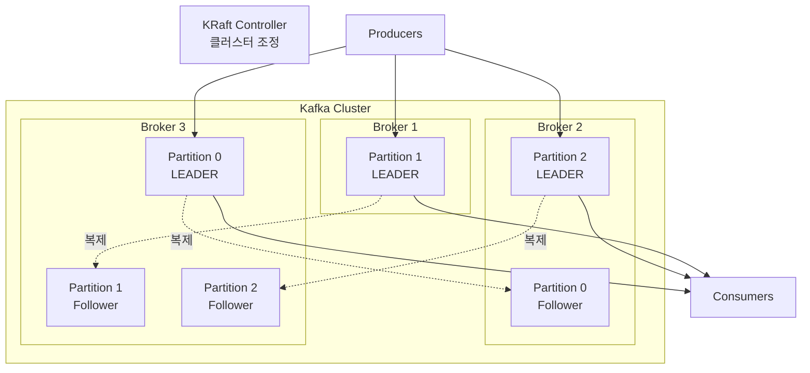

**토픽 목록 조회:**
```bash
$ kafka-topics.sh \
    --list \
    --bootstrap-server localhost:9092
```

**출력:**
```
__consumer_offsets
products.prices.changelog
```

#### __consumer_offsets 토픽

```
┌─────────────────────────────────────────────────────────────┐
│               __consumer_offsets 내부 토픽                   │
├─────────────────────────────────────────────────────────────┤
│  📋 역할                                                     │
│     • 각 Consumer의 현재 읽기 위치(Offset) 저장               │
│     • Consumer Group의 상태 관리                             │
│     • Kafka가 자동으로 생성 및 관리                           │
├─────────────────────────────────────────────────────────────┤
│  ⚠️ 주의사항                                                 │
│     • __ (더블 언더스코어) 접두사는 내부 토픽용                 │
│     • 사용자가 직접 __ 토픽 생성 금지                         │
│     • 내부 토픽과 충돌 및 호환성 문제 발생 가능                 │
└─────────────────────────────────────────────────────────────┘
```

---

#### 3.1.2 토픽 생성, 수정, 삭제

**토픽 삭제:**
```bash
$ kafka-topics.sh \
    --delete \
    --topic products.prices.changelog \
    --bootstrap-server localhost:9092
```

**토픽 생성 (파티션 2, 복제 2):**
```bash
$ kafka-topics.sh \
    --create \
    --topic products.prices.changelog \
    --replication-factor 2 \
    --partitions 2 \
    --bootstrap-server localhost:9092
```

**생성 후 조회:**
```
Topic: products.prices.changelog PartitionCount: 2 ReplicationFactor: 2
  Topic: products.prices.changelog Partition: 0 Leader: 3 Replicas: 3,2 Isr: 3,2
  Topic: products.prices.changelog Partition: 1 Leader: 1 Replicas: 1,3 Isr: 1,3
```

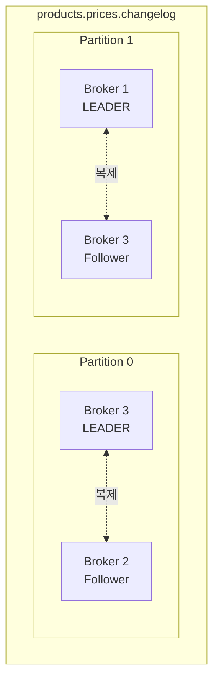

#### 파티션 수 변경 (--alter)

```bash
$ kafka-topics.sh \
    --alter \
    --topic products.prices.changelog \
    --partitions 3 \
    --bootstrap-server localhost:9092
```

**변경 후 조회:**
```
Topic: products.prices.changelog PartitionCount: 3 ReplicationFactor: 2
  Topic: products.prices.changelog Partition: 0 Leader: 3 Replicas: 3,2 Isr: 3,2
  Topic: products.prices.changelog Partition: 1 Leader: 1 Replicas: 1,3 Isr: 1,3
  Topic: products.prices.changelog Partition: 2 Leader: 2 Replicas: 2,3 Isr: 2,3
```

#### 토픽 관리 명령어 요약

| 작업 | 명령어 | 주의사항 |
|------|--------|----------|
| 목록 조회 | `--list` | 모든 토픽 표시 |
| 상세 조회 | `--describe --topic <name>` | Leader, ISR 등 상세 정보 |
| 생성 | `--create --topic <name>` | partitions, replication-factor 지정 |
| 수정 | `--alter --topic <name>` | 파티션 증가만 가능 |
| 삭제 | `--delete --topic <name>` | 데이터 손실 주의 |

#### ⚠️ 중요 제약사항

```
┌─────────────────────────────────────────────────────────────┐
│                    파티션 변경 제약                          │
├─────────────────────────────────────────────────────────────┤
│  ✅ 가능                                                     │
│     • 파티션 수 증가 (1 → 3)                                 │
│     • 복제 팩터 변경 (kafka-reassign-partitions.sh 사용)      │
├─────────────────────────────────────────────────────────────┤
│  ❌ 불가능                                                   │
│     • 파티션 수 감소 (3 → 1)                                 │
│       → 데이터 손실 발생                                     │
│       → 파티션 간 데이터 이동 불가                           │
│       → 메시지 순서 보장 원칙 위반                           │
├─────────────────────────────────────────────────────────────┤
│  💡 복제 팩터 변경 시                                        │
│     • kafka-topics.sh --replica-assignment 사용              │
│     • 또는 kafka-reassign-partitions.sh 사용                 │
│     • 복제 팩터는 브로커 수를 초과할 수 없음                   │
└─────────────────────────────────────────────────────────────┘
```

---

### 3.2 메시지(Messages)

Kafka는 내부적으로 **바이트 배열(Byte Array)**만 처리한다. 데이터 타입에 대해 무관심(agnostic)하므로 어떤 형식의 데이터든 처리 가능하다.

#### 메시지 크기 제한

| 항목 | 값 | 비고 |
|------|-----|------|
| 기본 최대 크기 | **1 MB** | 설정 변경 가능하나 권장하지 않음 |
| 권장 사용 | 많은 작은 메시지 | 성능 최적화됨 |
| LinkedIn 사례 (2019) | 하루 **7조 개** 메시지 | 약 100개 Kafka 클러스터 |

> **주의**: Kafka는 대용량 파일 전송용으로 적합하지 않음. 파일 전송에는 별도 솔루션 사용 권장.

---

#### 3.2.1 메시지 타입

실무에서 Kafka에 저장되는 메시지는 크게 **4가지 유형**으로 분류된다:

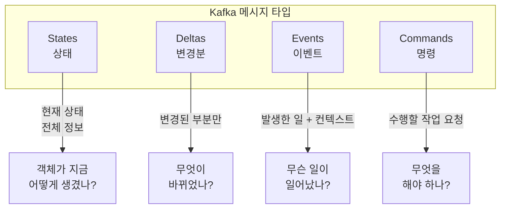

##### 1. States (상태)

객체의 **현재 상태를 완전한 형태**로 담는다.

```json
// products.changelog 토픽
{"id": 123, "name": "coffee pad", "price": "10", "stock": 101010}
{"id": 234, "name": "cola", "price": "2", "stock": 52}
{"id": 345, "name": "energy drink", "price": "3", "stock": 42}
```

**특징:**
- 완전한 정보 포함 (Self-contained)
- Log Compaction과 함께 사용 시 최신 상태만 유지 가능
- 단일 메시지만으로 현재 상태 파악 가능

**사용 사례:**
- 마스터 데이터 동기화
- 상태 스냅샷
- CDC (Change Data Capture) 결과

##### 2. Deltas (변경분)

**변경된 부분만** 포함하여 데이터 효율성을 높인다.

```json
// products.stocks.changes 토픽
{"id": 123, "stock": 1000}
{"id": 234, "price": 2}
{"id": 345, "stock": 60, "price": 3}
{"id": 234, "name": "cola zero"}
```

**특징:**
- 데이터 볼륨 절약 (변경되지 않은 값 제외)
- 변경 내용 파악 용이
- 단독으로는 불완전 (컨텍스트 또는 전체 상태 필요)

**사용 사례:**
- 실시간 업데이트 스트림
- 증분 변경 추적
- 이벤트 소싱 보조

##### 3. Events (이벤트)

발생한 일에 **비즈니스 컨텍스트**를 추가한다.

```json
// products.prices.changelog 토픽
{"id": 123, "event": "vat_adjustment", "payload": {"price": 2.19}}
{"id": 234, "event": "data_correction", "payload": {"name": "Coke Zero"}}
{"id": 345, "event": "storehouse_delivery", "payload": {"stock": 100}}
{"id": 234, "event": "promotion_start", "payload": {"price": 1.99}}
```

**특징:**
- "무슨 일이 일어났는가?" 에 답함
- 비즈니스 의미 포함
- 로그도 특수한 형태의 이벤트

**사용 사례:**
- 비즈니스 이벤트 기록
- 감사 로그 (Audit Log)
- 로그 수집 및 집계

##### 4. Commands (명령)

다른 시스템에 **작업 수행을 요청**한다.

```json
// notifications.commands 토픽
{"command": "notify_customer", "customer_id": 123456,
 "message": "The promotion for Coke Zero started. It's now 1.99"}
{"command": "notify_customer", "customer_id": 123457,
 "message": "The promotion for Coke Zero started. It's now 1.99"}
```

**특징:**
- 미래에 수행할 작업 요청
- 수신 시스템의 응답/액션 필요
- Event보다 높은 결합도 (coupling)

**사용 사례:**
- 비동기 작업 요청
- 서비스 간 명령 전달
- 작업 큐 구현

#### 메시지 타입 비교

| 타입 | 질문 | 결합도 | 완전성 | 사용 예 |
|------|------|--------|--------|---------|
| **States** | 현재 상태? | 낮음 | 완전 | 마스터 데이터, 스냅샷 |
| **Deltas** | 무엇이 변경? | 낮음 | 불완전 | 증분 업데이트 |
| **Events** | 무슨 일이 발생? | 낮음 | 완전 | 비즈니스 이벤트, 로그 |
| **Commands** | 무엇을 해야 하나? | 높음 | 완전 | 작업 요청, 알림 트리거 |

---

#### 3.2.2 데이터 포맷

Kafka는 바이트 배열만 처리하므로 **어떤 데이터 포맷이든 사용 가능**하다.

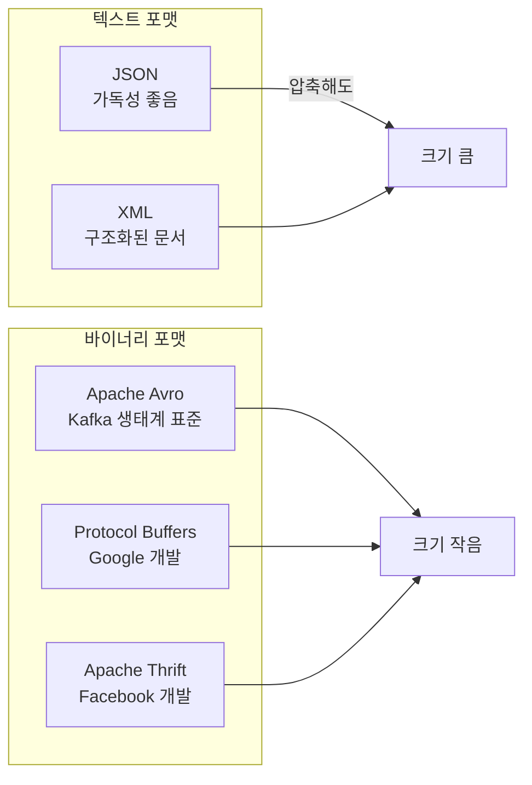

#### 데이터 포맷 비교

| 포맷 | 가독성 | 크기 | 스키마 | Kafka 생태계 지원 |
|------|--------|------|--------|------------------|
| **JSON** | ✅ 우수 | ❌ 큼 | JSON Schema | 보통 |
| **Avro** | ❌ 불편 | ✅ 작음 | 필수 (내장) | ✅ 매우 좋음 |
| **Protobuf** | ❌ 불편 | ✅ 작음 | 필수 (.proto) | 좋음 |
| **XML** | 보통 | ❌ 매우 큼 | XSD, DTD | 낮음 |

#### 스키마(Schema)의 중요성

```
┌─────────────────────────────────────────────────────────────┐
│                    스키마(Schema)의 역할                     │
├─────────────────────────────────────────────────────────────┤
│  📋 정의                                                     │
│     • 데이터 구조와 형식을 정의하는 청사진                     │
│     • 필드 이름, 타입, 필수/선택 여부 명시                    │
├─────────────────────────────────────────────────────────────┤
│  ✅ 장점                                                     │
│     • 토픽 간 일관성 보장                                    │
│     • 데이터 해석 표준화                                     │
│     • 호환성 검증 자동화                                     │
│     • 문서화 역할                                           │
├─────────────────────────────────────────────────────────────┤
│  📝 포맷별 스키마                                            │
│     • JSON → JSON Schema                                    │
│     • Avro → .avsc (JSON 형식 스키마)                       │
│     • Protobuf → .proto                                    │
│     • XML → XSD 또는 DTD                                    │
├─────────────────────────────────────────────────────────────┤
│  💡 권장사항                                                 │
│     • 토픽마다 다른 포맷 사용 지양                           │
│     • 일관된 데이터 포맷 유지                                 │
│     • Schema Registry 활용 (다음 챕터)                       │
└─────────────────────────────────────────────────────────────┘
```

---

#### 3.2.3 메시지 구조

Kafka 메시지(Record)는 다음 요소로 구성된다:

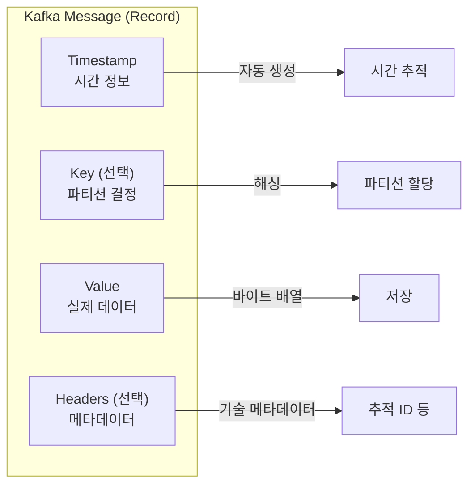

#### 메시지 구성 요소 상세

| 구성 요소 | 필수 여부 | 설명 | 예시 |
|-----------|-----------|------|------|
| **Key** | 선택 | 파티션 결정, 순서 보장 | `product-001`, `user-123` |
| **Value** | 필수 | 실제 데이터 페이로드 | `{"price": 10.99}` |
| **Headers** | 선택 | 기술적 메타데이터 | `trace-id`, `source-system` |
| **Timestamp** | 자동 | 메시지 생성 시간 | `1703577600000` |

#### Headers 사용 주의사항

```
┌─────────────────────────────────────────────────────────────┐
│                    Headers 사용 가이드                        │
├─────────────────────────────────────────────────────────────┤
│  ✅ 적절한 사용                                              │
│     • Tracing ID (분산 추적)                                 │
│     • Correlation ID (요청-응답 연결)                        │
│     • Source System (출처 시스템)                            │
│     • Content-Type (데이터 포맷)                             │
├─────────────────────────────────────────────────────────────┤
│  ❌ 부적절한 사용                                            │
│     • 비즈니스 데이터 저장                                   │
│     • Value 대체 용도                                        │
│     • 대용량 데이터                                          │
├─────────────────────────────────────────────────────────────┤
│  💡 팁                                                       │
│     • HTTP Headers와 유사한 역할                             │
│     • 사용하지 않아도 무방                                    │
└─────────────────────────────────────────────────────────────┘
```

---

#### Key란 무엇인가?

Key는 메시지가 **어느 파티션에 저장될지 결정**하는 값입니다. 선택 사항이지만, 순서 보장이 필요하면 반드시 사용해야 합니다.

**왜 Key가 중요한가요?**

Kafka에서 순서 보장은 **파티션 단위**로만 됩니다. 같은 파티션에 들어간 메시지만 순서가 보장됩니다. 따라서 특정 엔티티(사용자, 주문 등)의 이벤트 순서를 보장하려면, 해당 엔티티의 메시지가 항상 같은 파티션에 들어가야 합니다. Key가 바로 이것을 보장합니다.

예를 들어 `user-001`의 `login → click → logout` 순서를 보장하려면, 세 메시지 모두 같은 파티션에 있어야 합니다. Key를 `user-001`로 설정하면 Kafka가 항상 같은 파티션으로 보냅니다.

---

#### 파티셔닝 알고리즘

Kafka는 Key를 해시하여 파티션을 결정합니다.

```
partition = hash(key) % num_partitions
```

**왜 해시를 사용하나요?**

해시 함수는 같은 입력에 항상 같은 출력을 반환합니다. 덕분에 `user-001`이라는 Key는 항상 같은 파티션으로 갑니다. 또한 해시값은 고르게 분포하므로 파티션 간 부하가 균등해집니다.

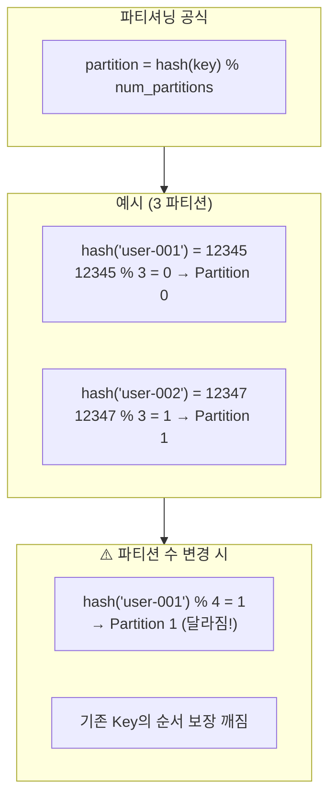

**주의**: 파티션 수를 변경하면 `% num_partitions` 결과가 달라집니다. 기존에 Partition 0에 있던 `user-001`이 갑자기 Partition 1로 갈 수 있습니다. 이러면 같은 Key의 메시지가 여러 파티션에 분산되어 순서 보장이 깨집니다.

---

#### Key가 없는 경우 (Sticky Partitioner)

Key를 지정하지 않으면 Kafka가 자동으로 파티션을 선택합니다.

##### 먼저 알아야 할 것: Producer의 배치 메커니즘

`send()` 호출 시 메시지가 바로 네트워크로 나가는 게 아닙니다. **Producer 내부 버퍼에 쌓아뒀다가 한꺼번에 전송**합니다.

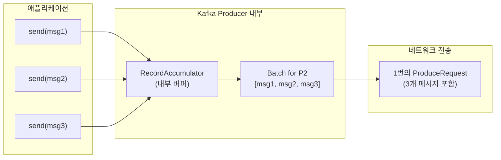

**배치 전송 조건** (둘 중 하나 충족 시 전송):

| 설정 | 기본값 | 의미 |
|------|--------|------|
| `batch.size` | 16KB | 배치 크기가 이 값에 도달하면 전송 |
| `linger.ms` | 0ms | 이 시간만큼 기다린 후 전송 |

예를 들어 `batch.size=16384`, `linger.ms=5`로 설정하면, 메시지가 16KB 모이거나 5ms가 지나면 전송됩니다.

##### Kafka 2.4 이전: Round-Robin의 문제

메시지마다 파티션을 돌아가며 선택했습니다. `msg1→P0, msg2→P1, msg3→P2, msg4→P0...`

**왜 문제인가요?**

파티션마다 버퍼가 따로 있습니다. 메시지가 분산되면 각 버퍼에 조금씩만 쌓입니다. 배치가 안 차서 작은 배치가 자주 전송되고, 네트워크 오버헤드가 커집니다.

##### Kafka 2.4 이후: Sticky Partitioner

배치가 찰 때까지 같은 파티션에 계속 보냅니다. 배치가 완료되면 다음 파티션으로 이동합니다.

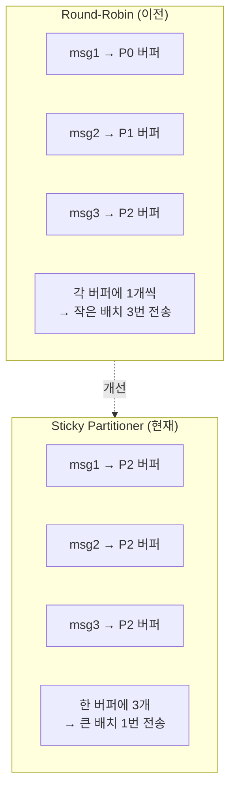

**Sticky Partitioner의 장점:**
- **배치 효율 향상**: 한 파티션에 메시지를 모아서 큰 배치로 전송
- **네트워크 오버헤드 감소**: 전송 횟수가 줄어듦
- **지연 시간 감소**: 배치가 빨리 차서 빨리 전송됨

**정리:**
```
사용자 코드: send(msg1), send(msg2), send(msg3)  ← 3번 호출

Producer 내부:
┌─────────────────────────────────┐
│  P2 버퍼: [msg1, msg2, msg3]    │  ← Sticky로 한 곳에 모음
│  (16KB 도달 또는 linger.ms 경과) │
└─────────────────────────────────┘
                ↓
네트워크: ProduceRequest 1번 전송 (3개 메시지 포함)
```

**단, Key가 없으면 순서 보장이 안 됩니다.** 같은 사용자의 이벤트가 다른 파티션으로 갈 수 있기 때문입니다.

---

#### 순서 보장의 범위

Kafka의 순서 보장은 **파티션 내에서만** 적용됩니다. 이것을 정확히 이해해야 합니다.

**순서가 보장되는 경우:**
1. 같은 Key를 사용한 메시지들 → 같은 파티션 → 순서 보장
2. 한 파티션 내의 모든 메시지 → Offset 순서대로 소비

**순서가 보장되지 않는 경우:**
1. 다른 Key 간의 순서 (다른 파티션일 수 있음)
2. 다른 파티션 간의 순서 (Consumer가 어느 파티션을 먼저 읽을지 모름)
3. Key가 없는 메시지 간의 순서 (Sticky Partitioner가 파티션을 바꿀 수 있음)

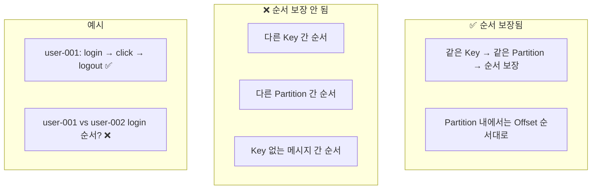

**실무 예시로 이해하기:**

온라인 쇼핑몰에서 주문 상태 변경 이벤트를 Kafka로 전송한다고 가정합니다.
- `order-123`: 주문생성 → 결제완료 → 배송시작 → 배송완료
- 이 순서가 뒤바뀌면 안 됩니다. 배송완료가 주문생성보다 먼저 처리되면 안 되니까요.
- Key를 `order-123`으로 설정하면 네 이벤트 모두 같은 파티션에 저장되고, Consumer가 순서대로 처리합니다.

반면 `order-123`과 `order-456`의 상대적인 순서는 보장되지 않습니다. 다른 파티션에 있을 수 있고, 그래도 괜찮습니다. 서로 다른 주문은 독립적으로 처리해도 되니까요.

---

#### 좋은 Key vs 나쁜 Key

Key를 어떻게 설계하느냐에 따라 Kafka 성능이 크게 달라집니다.

**좋은 Key의 특징:**

1. **카디널리티가 높음**: 고유한 값이 많아서 파티션에 고르게 분배됨
2. **비즈니스 의미가 있음**: 순서 보장이 필요한 단위와 일치함

```
좋은 Key 예시:
user-12345        ← 한 사용자의 이벤트는 순서대로 처리해야 함
order-2024-001234 ← 한 주문의 상태 변화는 순서가 중요함
product-SKU-001   ← 한 상품의 가격 변경은 순서대로 반영해야 함
```

**나쁜 Key와 Hot Partition 문제:**

특정 Key 값이 압도적으로 많으면 한 파티션에 메시지가 몰립니다. 이것을 **Hot Partition**이라고 합니다.

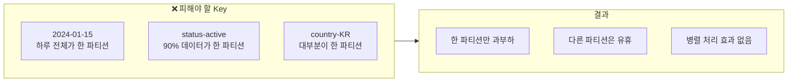

**왜 Hot Partition이 문제인가요?**

예를 들어 `status`를 Key로 사용하면, `active` 상태가 90%라면 한 파티션이 90% 부하를 감당합니다. 파티션을 3개 만들어도 사실상 1개만 일하는 셈입니다. Consumer를 늘려도 한 파티션은 한 Consumer만 읽을 수 있어서 병렬 처리 효과가 없습니다.

**Hot Partition 해결 방법:**

1. **복합 Key 사용**: `country` 대신 `country-userId`처럼 카디널리티를 높임
2. **Key 제거**: 순서 보장이 필요 없다면 Key를 null로 보내서 고르게 분배
3. **파티션 수 조정**: 파티션을 늘려서 분산 (단, 기존 Key 할당이 변경됨)

---

#### Key가 있는 메시지 생산/소비

**Key가 있는 메시지 생산:**
```bash
$ kafka-console-producer.sh \
    --topic products.prices.changelog.keys \
    --property parse.key=true \
    --property key.separator=: \
    --bootstrap-server localhost:9092
> coffee pads:10
> cola:2
> coffee pads:11
> coffee pads:12
```

**Key와 함께 소비:**
```bash
$ kafka-console-consumer.sh \
    --from-beginning \
    --topic products.prices.changelog.keys \
    --property print.key=true \
    --property key.separator=":" \
    --bootstrap-server localhost:9092
```

**출력:**
```
coffee pads:10
cola:2
coffee pads:11
coffee pads:12
```

#### Key의 핵심 역할

| 역할 | 설명 | 예시 |
|------|------|------|
| **파티션 결정** | 같은 Key → 같은 파티션 | 같은 상품의 가격 변경이 순서대로 처리 |
| **순서 보장** | 파티션 내에서만 순서 보장 | coffee pads: 10 → 11 → 12 순서 보장 |
| **Log Compaction** | 같은 Key의 최신 값만 유지 | 최신 가격만 보존 |
| **스트림 조인** | Key 기반 데이터 결합 | 주문과 결제 데이터 매칭 |

---

## 🧪 실습 기록

### 환경

```bash
# 단일 브로커 환경 사용
docker-compose up -d
docker exec -it kafka_learn /bin/bash
```

### 실습 1: 멀티 파티션 토픽 생성

```bash
kafka-topics --create \
    --topic products.price.events \
    --partitions 3 \
    --replication-factor 1 \
    --bootstrap-server localhost:9092
```

**결과:**
```
Created topic products.price.events.
```

**토픽 상세 확인:**
```bash
kafka-topics --describe \
    --topic products.price.events \
    --bootstrap-server localhost:9092
```

**결과:**
```
Topic: products.price.events    PartitionCount: 3    ReplicationFactor: 1
    Topic: products.price.events    Partition: 0    Leader: 1    Replicas: 1    Isr: 1
    Topic: products.price.events    Partition: 1    Leader: 1    Replicas: 1    Isr: 1
    Topic: products.price.events    Partition: 2    Leader: 1    Replicas: 1    Isr: 1
```

### 실습 2: Key 기반 파티션 분배 실험

**Producer 실행 (Key와 함께):**
```bash
kafka-console-producer \
    --topic products.price.events \
    --property parse.key=true \
    --property key.separator=: \
    --bootstrap-server localhost:9092
```

**입력 데이터:**
```
product-001:{"event":"created","price":1000}
product-002:{"event":"created","price":2000}
product-001:{"event":"promotion_start","discount":10}
product-003:{"event":"created","price":3000}
product-001:{"event":"promotion_end"}
product-002:{"event":"price_changed","price":2500}
```

**Consumer로 파티션 확인:**
```bash
kafka-console-consumer \
    --topic products.price.events \
    --from-beginning \
    --property print.key=true \
    --property print.partition=true \
    --bootstrap-server localhost:9092
```

**결과:**
```
Partition:2    product-001    {"event":"created","price":1000}
Partition:0    product-002    {"event":"created","price":2000}
Partition:2    product-001    {"event":"promotion_start","discount":10}
Partition:0    product-003    {"event":"created","price":3000}
Partition:2    product-001    {"event":"promotion_end"}
Partition:0    product-002    {"event":"price_changed","price":2500}
```

**분석:**
- `product-001` → 항상 Partition 2 (같은 Key = 같은 파티션)
- `product-002` → 항상 Partition 0
- `product-003` → Partition 0 (다른 Key지만 해시 결과가 같을 수 있음)
- **핵심**: 같은 Key의 메시지는 순서가 보장됨 (product-001: created → promotion_start → promotion_end)

### 실습 3: Key 없는 메시지 (Sticky Partitioner)

**Producer 실행 (Key 없이):**
```bash
kafka-console-producer \
    --topic products.price.events \
    --bootstrap-server localhost:9092
```

**입력 데이터:**
```
{"event":"log1"}
{"event":"log2"}
{"event":"log3"}
{"event":"log4"}
{"event":"log5"}
```

**결과:**
```
Partition:1    null    {"event":"log1"}
Partition:1    null    {"event":"log2"}
Partition:1    null    {"event":"log3"}
Partition:1    null    {"event":"log4"}
Partition:1    null    {"event":"log5"}
```

**분석:**
- Key가 null이면 Sticky Partitioner 동작
- 배치가 찰 때까지 같은 파티션(Partition 1)에 계속 전송
- Round-Robin이 아니라 한 파티션에 몰아서 배치 효율 향상

### 실습 4: 파티션 수 변경 실험

```bash
# 파티션 3 → 5로 증가
kafka-topics --alter \
    --topic products.price.events \
    --partitions 5 \
    --bootstrap-server localhost:9092
```

**결과:**
```
# 파티션 증가 성공
```

**변경 후 같은 Key 전송:**
```bash
# product-001 다시 전송
product-001:{"event":"after_partition_change"}
```

**결과:**
```
Partition:4    product-001    {"event":"after_partition_change"}
```

**분석:**
- 파티션 증가 전: `product-001` → Partition 2
- 파티션 증가 후: `product-001` → Partition 4 (달라짐!)
- **주의**: `hash("product-001") % 3 = 2` → `hash("product-001") % 5 = 4`
- 파티션 수 변경 시 기존 Key의 순서 보장이 깨질 수 있음

---

## 🔍 심화 학습

### ISR, ELR, LastKnownElr 상세

책에서 언급된 복제 관련 개념을 더 자세히 살펴본다:

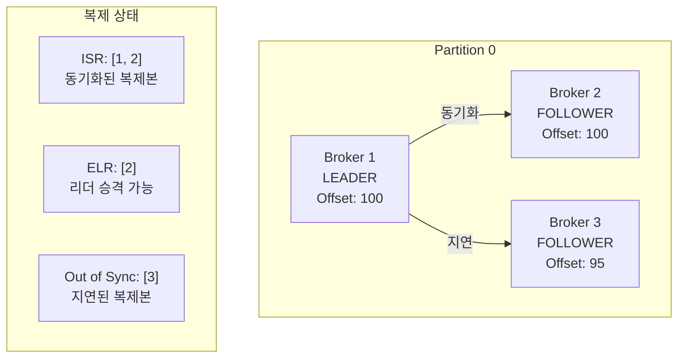

| 용어 | 전체 명칭 | 설명 |
|------|-----------|------|
| **ISR** | In-Sync Replicas | 리더와 동기화된 복제본 목록 |
| **ELR** | Eligible Leader Replicas | 리더 장애 시 승격 가능한 복제본 |
| **LastKnownElr** | Last Known ELR | 비정상 종료된 이전 ELR 목록 |

### 파티션 재할당 (kafka-reassign-partitions.sh)

복잡한 파티션 재배치가 필요할 때:

```bash
# 1. 재할당 계획 생성
$ kafka-reassign-partitions.sh \
    --bootstrap-server localhost:9092 \
    --topics-to-move-json-file topics.json \
    --broker-list "1,2,3" \
    --generate

# 2. 재할당 실행
$ kafka-reassign-partitions.sh \
    --bootstrap-server localhost:9092 \
    --reassignment-json-file reassignment.json \
    --execute

# 3. 진행 상황 확인
$ kafka-reassign-partitions.sh \
    --bootstrap-server localhost:9092 \
    --reassignment-json-file reassignment.json \
    --verify
```

### Avro 스키마 예시

책에서 언급된 바이너리 포맷 중 가장 많이 사용되는 Avro:

```json
{
  "type": "record",
  "name": "ProductPriceChange",
  "namespace": "com.example.ecommerce",
  "fields": [
    {"name": "id", "type": "long"},
    {"name": "name", "type": "string"},
    {"name": "price", "type": "double"},
    {"name": "stock", "type": ["null", "int"], "default": null},
    {"name": "timestamp", "type": "long", "logicalType": "timestamp-millis"}
  ]
}
```

**Avro 장점:**
- 스키마 진화(Schema Evolution) 지원
- 압축률 높음
- Kafka Schema Registry와 완벽 통합

### 메시지 압축

Kafka는 메시지 배치 단위로 압축을 지원한다:

| 압축 알고리즘 | 압축률 | CPU 사용 | 사용 사례 |
|--------------|--------|----------|-----------|
| **none** | 없음 | 낮음 | 이미 압축된 데이터 |
| **gzip** | 높음 | 높음 | 대역폭 제한 환경 |
| **snappy** | 중간 | 낮음 | 균형 잡힌 성능 |
| **lz4** | 중간 | 매우 낮음 | 고성능 요구 |
| **zstd** | 높음 | 중간 | 최신 권장 옵션 |

```bash
# Producer에서 압축 설정
$ kafka-console-producer.sh \
    --topic my-topic \
    --producer-property compression.type=snappy \
    --bootstrap-server localhost:9092
```

---

## 💡 실무 적용 포인트

### 1. 토픽 설계 베스트 프랙티스

```
┌─────────────────────────────────────────────────────────────┐
│                    토픽 설계 체크리스트                       │
├─────────────────────────────────────────────────────────────┤
│  📋 네이밍                                                   │
│     □ 소문자와 점(.) 사용                                    │
│     □ {도메인}.{엔티티}.{동작} 패턴                          │
│     □ 의미 있는 이름 (abbreviation 지양)                     │
├─────────────────────────────────────────────────────────────┤
│  🔢 파티션 수                                                │
│     □ Consumer 수 ≤ 파티션 수                                │
│     □ 처리량 기반 계산                                       │
│     □ 감소 불가능하므로 여유 있게 설정                        │
├─────────────────────────────────────────────────────────────┤
│  🔄 복제 팩터                                                │
│     □ 프로덕션: 최소 3                                       │
│     □ 개발/테스트: 1                                         │
│     □ 브로커 수 이하로 설정                                   │
├─────────────────────────────────────────────────────────────┤
│  🔑 Key 전략                                                 │
│     □ 순서 보장 필요 시 반드시 Key 사용                       │
│     □ Key 분포 균등성 확인                                   │
│     □ Hot Partition 방지                                     │
└─────────────────────────────────────────────────────────────┘
```

### 2. 메시지 타입 선택 가이드

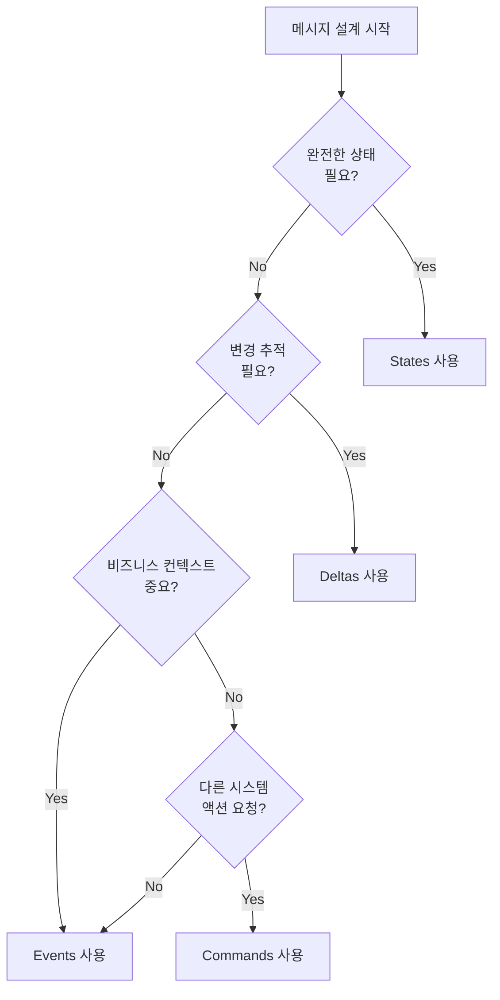

### 3. 데이터 포맷 선택 가이드

| 상황 | 권장 포맷 | 이유 |
|------|-----------|------|
| 디버깅 용이성 중요 | JSON | 가독성 |
| 대역폭/저장 공간 제한 | Avro | 압축률 |
| 다양한 언어 클라이언트 | Protobuf | 언어 지원 |
| Kafka 생태계 통합 | Avro | Schema Registry |
| 레거시 시스템 연동 | JSON/XML | 호환성 |

### 4. Key 설계 전략

```python
# 좋은 Key 예시
"user-12345"           # 사용자별 순서 보장
"order-2024-001234"    # 주문별 이벤트 순서
"product-SKU-001"      # 상품별 가격 변경 순서

# 나쁜 Key 예시 (Hot Partition 유발)
"2024-01-15"           # 하루 전체 데이터가 한 파티션에
"status-active"        # 대부분의 데이터가 한 파티션에
```

---

## ✅ 정리 체크리스트

### 토픽 관리
- [ ] `kafka-topics.sh --list`: 토픽 목록 조회
- [ ] `kafka-topics.sh --describe`: 토픽 상세 정보 (Leader, ISR, Replicas)
- [ ] `kafka-topics.sh --create`: 토픽 생성
- [ ] `kafka-topics.sh --alter`: 파티션 수 증가
- [ ] `kafka-topics.sh --delete`: 토픽 삭제
- [ ] 파티션 수는 증가만 가능, 감소 불가

### 토픽 아키텍처
- [ ] 파티션: 병렬 처리와 확장성
- [ ] 복제 팩터: 내결함성과 신뢰성
- [ ] Leader: 읽기/쓰기 담당 브로커
- [ ] ISR: 동기화된 복제본 목록
- [ ] __consumer_offsets: Consumer 위치 저장 내부 토픽

### 메시지 타입
- [ ] States: 완전한 상태 정보
- [ ] Deltas: 변경분만 포함
- [ ] Events: 비즈니스 컨텍스트 포함
- [ ] Commands: 작업 수행 요청

### 메시지 구조
- [ ] Key (선택): 파티션 결정, 순서 보장
- [ ] Value (필수): 실제 데이터
- [ ] Headers (선택): 기술 메타데이터
- [ ] Timestamp (자동): 시간 정보

### 데이터 포맷
- [ ] Kafka는 바이트 배열만 처리 (포맷 무관)
- [ ] JSON: 가독성 좋음, 크기 큼
- [ ] Avro: Kafka 생태계 표준, 스키마 필수
- [ ] 일관된 포맷 사용 권장
- [ ] 스키마 관리 중요

### Key 활용
- [ ] 같은 Key → 같은 파티션
- [ ] 파티션 내 순서 보장
- [ ] Key 없음 → 라운드 로빈 분배
- [ ] Log Compaction과 연계 가능

---

## 🎯 면접 대비 요약

### 한 줄 정의

> "Kafka 메시지는 Key, Value, Headers, Timestamp로 구성되며,
> Key는 파티션 결정과 순서 보장에 사용되고, Value는 실제 데이터입니다."

### 핵심 포인트 5가지

1. **메시지 구조**: Key(선택), Value(필수), Headers(선택), Timestamp(자동)
2. **직렬화**: Kafka는 바이트만 처리 → Producer가 직렬화, Consumer가 역직렬화
3. **파티셔닝**: `hash(key) % partition_count`로 결정, 같은 Key = 같은 파티션
4. **순서 보장**: 같은 Key의 메시지만 순서 보장, 다른 Key 간에는 보장 안 됨
5. **파티션 수 변경**: 증가만 가능, 변경 시 기존 Key의 파티션 할당이 달라짐

### 자주 묻는 질문

**Q: Key가 없으면 메시지는 어떻게 분배되나요?**

A: Kafka 2.4부터 Sticky Partitioner가 적용됩니다. 배치가 찰 때까지 같은 파티션에 보내고, 배치가 완료되면 다음 파티션으로 이동합니다. Round-Robin보다 배치 효율이 좋습니다.

**Q: Avro를 JSON 대신 쓰는 이유는 무엇인가요?**

A: 세 가지 이유입니다.
1. **크기**: 바이너리라 JSON보다 30~50% 작음
2. **스키마 진화**: 필드 추가/삭제 시 호환성 자동 검증
3. **Schema Registry 통합**: Kafka 생태계와 가장 잘 맞음

**Q: Hot Partition이 발생하면 어떻게 해결하나요?**

A: Key 전략을 바꿔야 합니다. 예를 들어 `country`(값이 적음) 대신 `country-userId`(값이 많음)처럼 카디널리티를 높이는 복합 Key를 사용합니다. 또는 비즈니스 로직상 순서 보장이 필요 없다면 Key를 null로 보내는 것도 방법입니다.

**Q: 파티션 수를 처음에 어떻게 정해야 하나요?**

A: 세 가지를 고려합니다.
1. 예상 최대 Consumer 수 (파티션 ≥ Consumer)
2. 목표 처리량 ÷ 단일 파티션 처리량
3. 향후 확장 여유 (현재의 2~3배)
감소가 불가능하므로 여유 있게 시작하되, 너무 많으면 메타데이터 오버헤드가 있습니다.

---

## 🔗 참고 자료

### 공식 문서
- [Kafka Topics Documentation](https://kafka.apache.org/documentation/#topicconfigs)
- [Kafka Message Format](https://kafka.apache.org/documentation/#messageformat)
- [kafka-topics.sh 사용법](https://kafka.apache.org/documentation/#basic_ops_add_topic)

### 데이터 포맷
- [Apache Avro](https://avro.apache.org/docs/current/)
- [Protocol Buffers](https://developers.google.com/protocol-buffers)
- [JSON Schema](https://json-schema.org/)

### 스키마 관리
- [Confluent Schema Registry](https://docs.confluent.io/platform/current/schema-registry/)
- [Schema Evolution](https://docs.confluent.io/platform/current/schema-registry/avro.html)

### 추가 학습
- [Designing Event-Driven Systems (O'Reilly)](https://www.confluent.io/resources/ebook/designing-event-driven-systems/)
- [Kafka Message Keys 이해하기](https://developer.confluent.io/learn/message-keys/)

---

## 🔬 관련 실습

- [Stage 02: Topics and Messages 실습](../../../poc/04-kafka/02-topics-messages/)

---

*📅 작성일: 2025-12-26*
*📚 출처: Kafka in Action / Exploring Kafka Topics and Messages*
