# Chapter 4: Kafka as a Distributed Log

---

## 📌 핵심 요약

> Kafka의 핵심은 **분산 로그(Distributed Log)**이다. 로그는 시간순으로 정렬된 불변의 데이터 구조로, 새 데이터는 항상 끝에 추가되고 **Offset**으로 위치를 식별한다. Kafka는 **파티셔닝(Partitioning)**을 통해 수평적 확장을, **복제(Replication)**를 통해 내결함성을 달성한다. **Consumer Group**은 병렬 소비와 부하 분산을 가능하게 하며, **Leader-Follower** 구조가 데이터의 일관성과 가용성을 보장한다.

---

## 🎯 학습 목표

이 챕터를 읽고 나면 다음을 이해할 수 있다:

- [ ] 로그(Log)의 기본 특성과 Kafka에서의 역할을 설명할 수 있다
- [ ] Offset의 개념과 메시지 위치 추적 방식을 이해한다
- [ ] 파티셔닝과 Key의 관계를 설명하고 순서 보장 원리를 파악한다
- [ ] Consumer Group의 동작 원리와 파티션 할당 방식을 이해한다
- [ ] 복제(Replication)와 Leader-Follower 구조를 설명할 수 있다
- [ ] Kafka 클러스터의 구성 요소(Coordination Cluster, Broker, Client)를 구분할 수 있다

---

## 📖 본문 정리

### 4.1 로그(Log)의 개념

#### 4.1.1 다양한 로그의 종류

IT에서 **로그**는 여러 곳에서 사용된다:

| 로그 종류 | 용도 | 특징 |
|-----------|------|------|
| **시스템 로그** | OS 상태 모니터링, 오류 추적 | 운영자용, 디버깅 |
| **애플리케이션 로그** | 서비스 동작 확인 | 에러 분석, 모니터링 |
| **커밋 로그 (DB)** | 데이터 변경 기록 | 복구, 복제의 핵심 |
| **Kafka 로그** | 이벤트 스트림 저장 | 시스템의 핵심 데이터 구조 |

> **공통점**: 모든 로그는 **"무엇이 일어났는가?"** 라는 질문에 답한다.

#### 4.1.2 로그의 기본 속성

로그를 **일기장**에 비유하면 이해하기 쉽다:

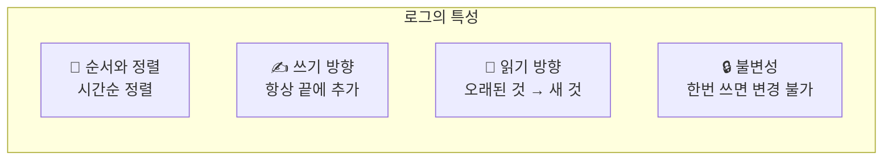

| 속성 | 설명 | 예시 |
|------|------|------|
| **순서 (Order)** | 메시지는 시간순으로 정렬 | 페이지 10은 페이지 11보다 오래됨 |
| **쓰기 방향** | 새 항목은 항상 끝에 추가 | append-only |
| **읽기 방향** | 오래된 것부터 새 것 순으로 | 자연스러운 읽기 흐름 |
| **불변성** | 한번 쓰면 변경/삭제 어려움 | 수정 흔적이 남음 |

#### 로그의 두 가지 핵심 연산

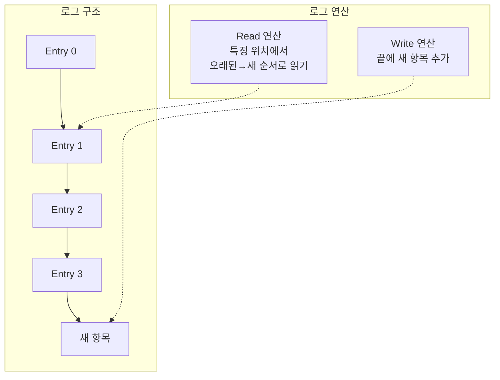

#### Offset - 메시지의 위치 식별자

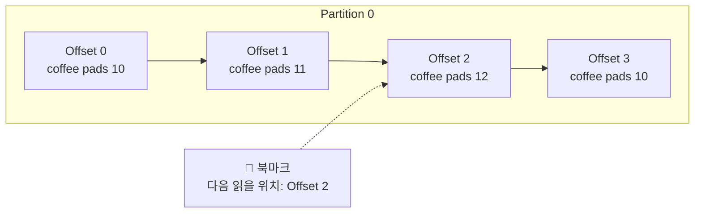

| Offset 특성 | 설명 |
|-------------|------|
| **위치 식별** | 로그 내 메시지의 정확한 위치 (페이지 번호처럼) |
| **읽기 추적** | 다음에 읽을 위치를 기억 |
| **자동 할당** | 브로커가 메시지 쓰기 시 자동 부여 |
| **파티션 독립** | 각 파티션마다 Offset 0부터 시작 |

**Offset 저장 위치:**
- Consumer가 RAM에 저장 → 불안정 (장애 시 처음부터)
- **__consumer_offsets** 토픽에 저장 → 안정적 (Kafka가 관리)

---

#### 4.1.3 Kafka를 로그로 이해하기

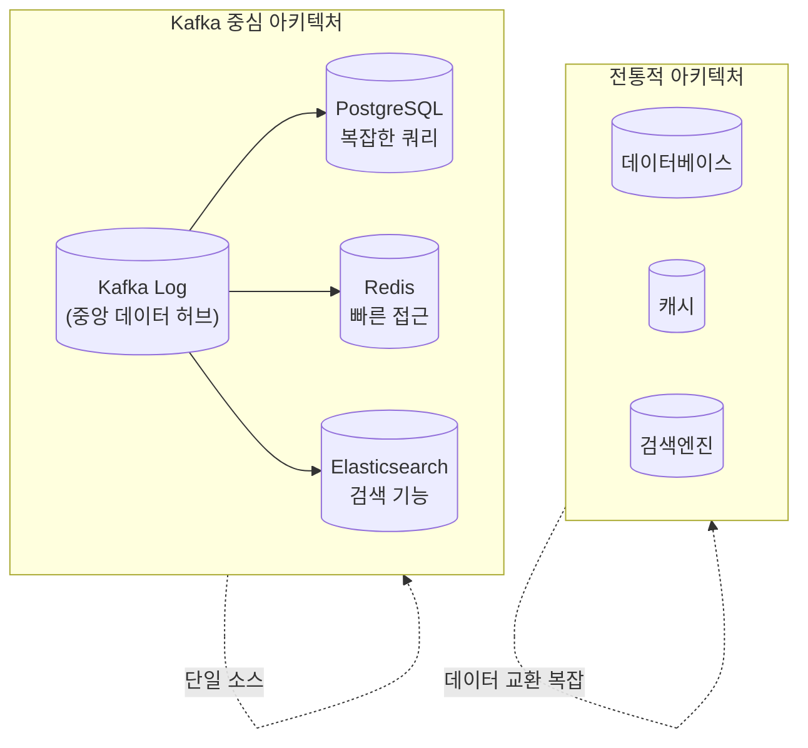

#### Kafka가 적합한 용도 vs 부적합한 용도

| 적합 ✅ | 부적합 ❌ |
|---------|-----------|
| 시스템 간 데이터 교환 | Ad-hoc 쿼리 |
| 이벤트 스트리밍 | Key-Value 스토어 대체 |
| 실시간 데이터 파이프라인 | 전체 데이터 검색 |
| 로그 수집 및 집계 | 트랜잭션 데이터베이스 |

> **핵심**: Kafka는 데이터베이스를 **대체**하는 것이 아니라, 시스템 간 데이터를 **교환**하는 중앙 허브 역할을 한다.

---

### 4.2 Kafka as a Distributed System

#### 수직적 확장 vs 수평적 확장

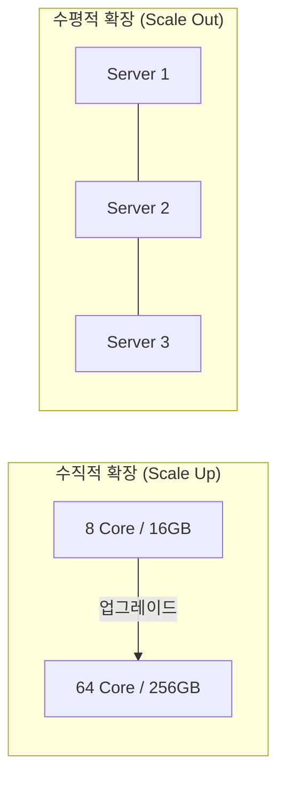

| 확장 방식 | 장점 | 단점 |
|-----------|------|------|
| **수직적** | 단순함, 즉각 효과 | 한계 존재, 신뢰성 개선 없음 |
| **수평적** | 무한 확장 가능, 신뢰성 향상 | 복잡한 조정 필요 |

> **Kafka의 철학**: 값비싼 고성능 하드웨어 대신, 저렴한 범용 서버 여러 대를 사용하고 **장애를 수용**하며 설계한다.

---

#### 4.2.1 파티셔닝과 Key

**파티셔닝이 필요한 이유:**

전 세계 택시 서비스를 예로 들면:
- 모든 데이터를 한 서버에 → 처리량 한계
- 도시별로 데이터 분리 → 병렬 처리 가능
- 도시 간 순서는 중요하지 않음

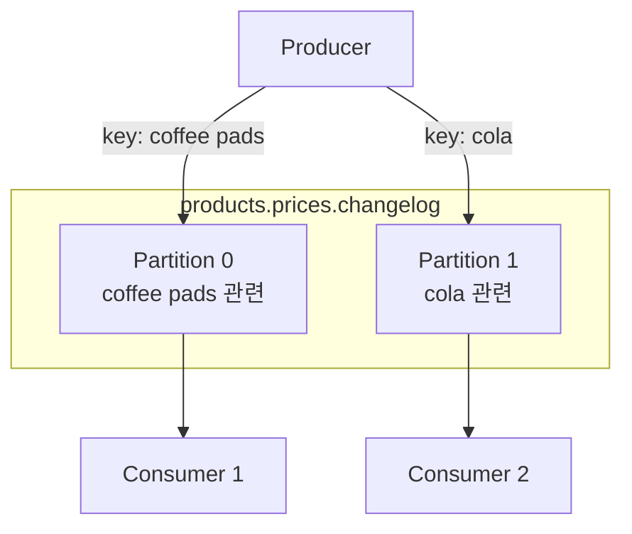

**다중 파티션 토픽 생성:**
```bash
$ kafka-topics.sh \
    --create \
    --topic products.prices.changelog.multi-partitions \
    --partitions 2 \
    --replication-factor 1 \
    --bootstrap-server localhost:9092
```

**Key 없이 생산 시 문제:**
```bash
# 생산 순서
coffee pads 10 → cola 2 → energy drink 3 → coffee pads 11 → coffee pads 12

# 소비 순서 (순서 깨짐!)
cola 2
coffee pads 11
coffee pads 10
energy drink 3
coffee pads 10
coffee pads 12
```

> ⚠️ **문제**: Key 없이 다중 파티션에 생산하면 **메시지 순서가 보장되지 않음!**

#### Key를 사용한 파티션 결정

```python
# Kafka의 파티션 결정 공식
partition_number = hash(key) % number_of_partitions
```

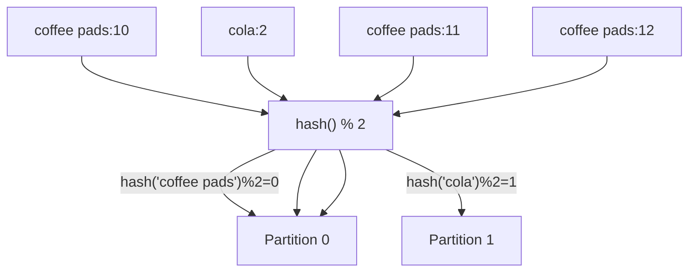

**Key로 생산:**
```bash
$ kafka-console-producer.sh \
    --topic products.prices.changelog.multi-partitions-keys \
    --property parse.key=true \
    --property key.separator=":" \
    --bootstrap-server localhost:9092
> coffee pads:10
> cola:2
> coffee pads:11
> coffee pads:12
```

**Key로 소비:**
```bash
$ kafka-console-consumer.sh \
    --from-beginning \
    --topic products.prices.changelog.multi-partitions-keys \
    --property print.key=true \
    --property key.separator=":" \
    --bootstrap-server localhost:9092
# 출력: 같은 Key끼리는 순서 보장!
coffee pads:10
coffee pads:11
coffee pads:12
cola:2
```

#### Key 분배 전략

| Key 유무 | 파티션 분배 방식 | 순서 보장 |
|----------|-----------------|-----------|
| **Key 없음** | Round-Robin (Kafka 2.4+ 배치 최적화) | ❌ 보장 안됨 |
| **Key 있음** | Hash 기반 고정 파티션 | ✅ 같은 Key 내 보장 |

> ⚠️ **주의**: 파티션 수를 변경하면 Key의 파티션 할당이 바뀌어 순서 보장이 깨질 수 있음!

---

#### 4.2.2 Consumer Groups

**문제 상황:**
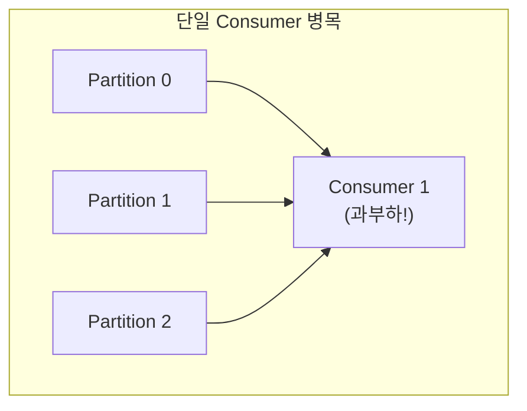

**해결책 - Consumer Group:**

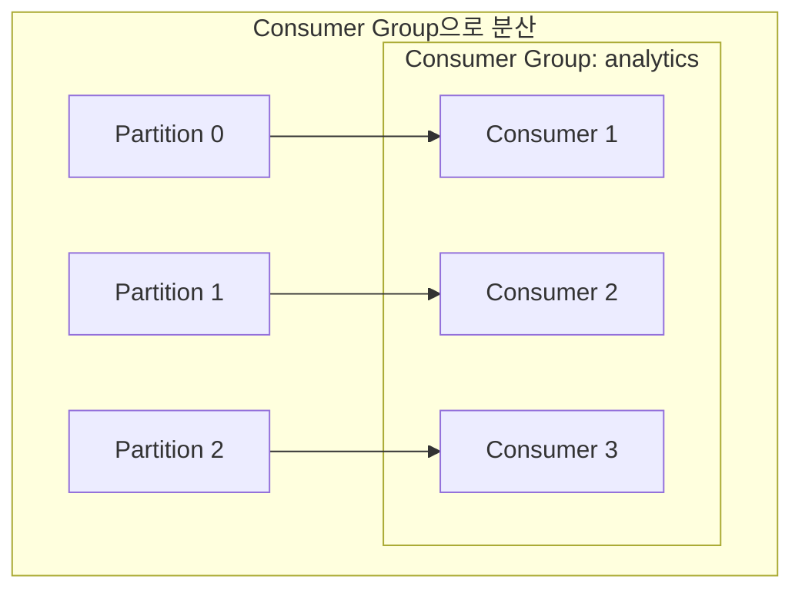

**Consumer Group의 핵심 규칙:**
1. **같은 Group 내**: 파티션은 **하나의 Consumer**에만 할당
2. **다른 Group 간**: 각 Group이 **독립적으로** 모든 데이터 소비
3. **Offset 관리**: Group별로 Kafka가 Offset 저장

```bash
# Consumer Group 사용
$ kafka-console-consumer.sh \
    --topic products.prices.changelog.multi-partitions-keys \
    --property print.key=true \
    --property key.separator=":" \
    --group products \
    --bootstrap-server localhost:9092
```

#### Consumer Group 파티션 할당

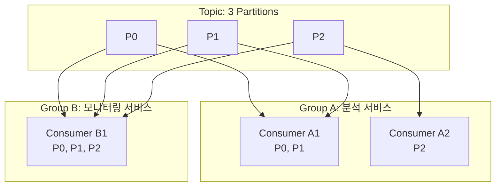

| Consumer 수 vs 파티션 수 | 결과 |
|--------------------------|------|
| Consumer < Partition | 일부 Consumer가 여러 파티션 담당 |
| Consumer = Partition | 1:1 매핑 (이상적) |
| Consumer > Partition | 일부 Consumer가 유휴 상태 |

---

#### 4.2.3 복제 (Replication)

**복제의 필요성:**
- 하드 디스크 연간 장애율: ~1% (Backblaze 통계)
- 단일 서버는 언제든 장애 가능
- **Warm Replication**: 장애 시 즉시 대체 가능

**복제 토픽 생성:**
```bash
$ kafka-topics.sh \
    --create \
    --topic products.prices.replication \
    --partitions 3 \
    --replication-factor 3 \
    --bootstrap-server localhost:9092
```

**복제 상태 확인:**
```
Topic: products.prices.replication PartitionCount: 3 ReplicationFactor: 3
  Partition: 0 Leader: 2 Replicas: 2,1,3 Isr: 2,1,3
  Partition: 1 Leader: 3 Replicas: 3,2,1 Isr: 3,2,1
  Partition: 2 Leader: 1 Replicas: 1,3,2 Isr: 1,3,2
```

#### Leader-Follower 구조

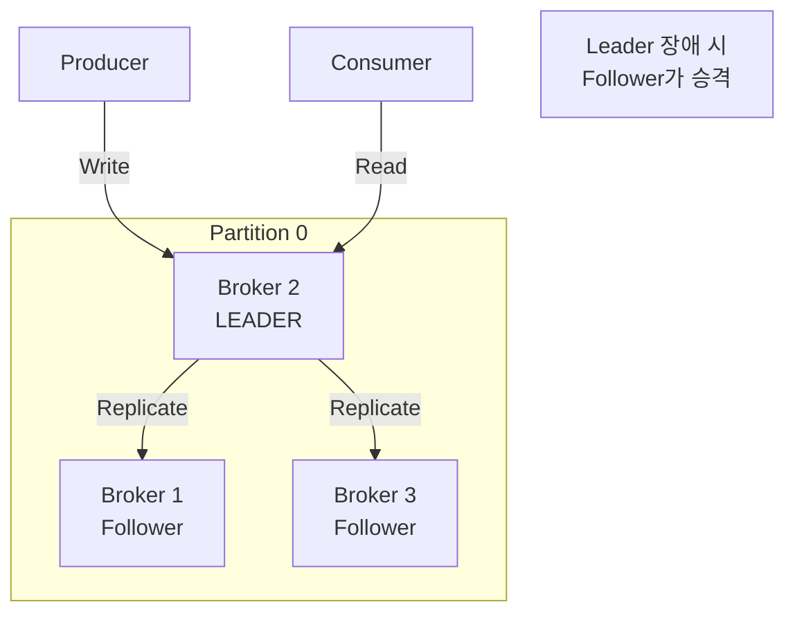

| 역할 | 책임 | 개수 |
|------|------|------|
| **Leader** | 모든 읽기/쓰기 처리 | 파티션당 1개 |
| **Follower** | Leader 데이터 복제, 대기 | 복제팩터-1개 |
| **ISR** | 동기화된 복제본 목록 | 가변 |

**복제 팩터 제약:**
```bash
# 브로커 3개인데 복제 팩터 4 시도 → 에러!
Error: Unable to replicate the partition 4 time(s):
The target replication factor of 4 cannot be reached
because only 3 broker(s) are registered.
```

---

### 4.3 Kafka 구성 요소

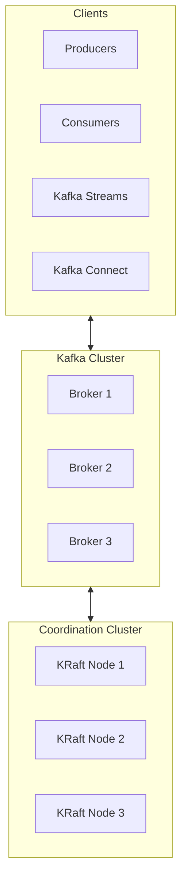

#### 4.3.1 Coordination Cluster

**역할:**
- 클러스터 상태 모니터링
- 브로커 등록/제거 관리
- 토픽 메타데이터 저장
- 파티션 리더 선출

**ZooKeeper → KRaft 전환:**

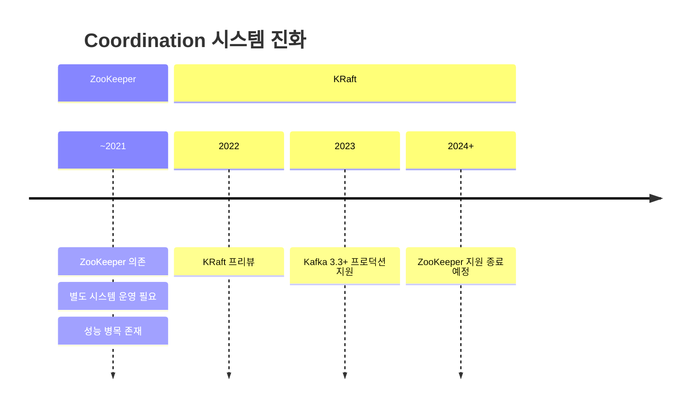

| 항목 | ZooKeeper | KRaft |
|------|-----------|-------|
| 의존성 | 별도 클러스터 | Kafka 내장 |
| 운영 복잡도 | 높음 | 낮음 |
| 파티션 한계 | ~200K | 수백만 |
| 리더 선출 | 수 초 | 밀리초 |

**권장 노드 수:**
- 소규모: **3개** (1개 장애 허용)
- 대규모: **5개** (2개 장애 허용)
- 항상 **홀수**로 구성 (과반수 합의 필요)

#### 4.3.2 Broker

- Kafka 클러스터의 실제 구성 단위
- 메시지 수신, 저장, 전송 담당
- **최소 3개** 권장 (복제를 위해)

#### 4.3.3 Clients

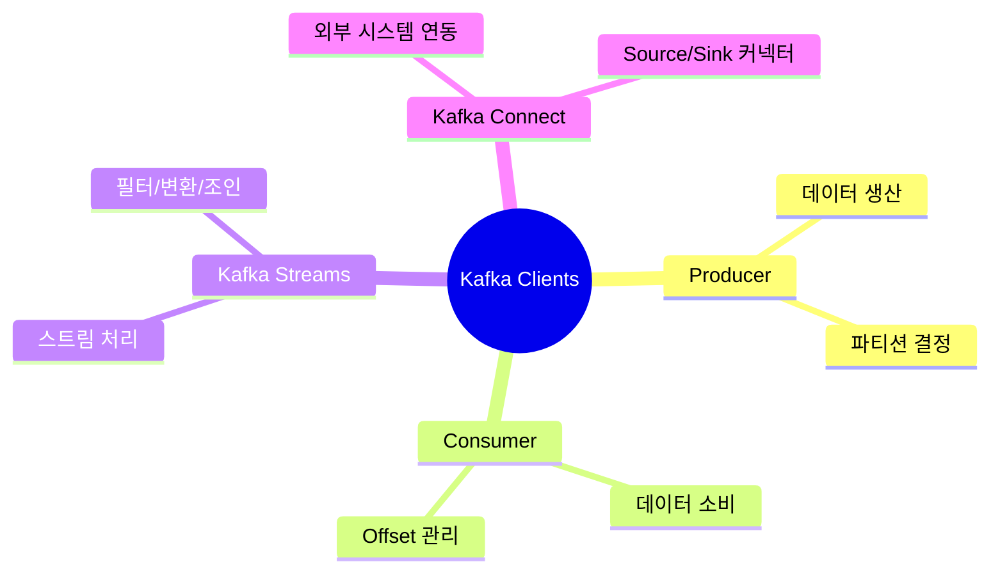

---

### 4.4 기업 환경의 Kafka

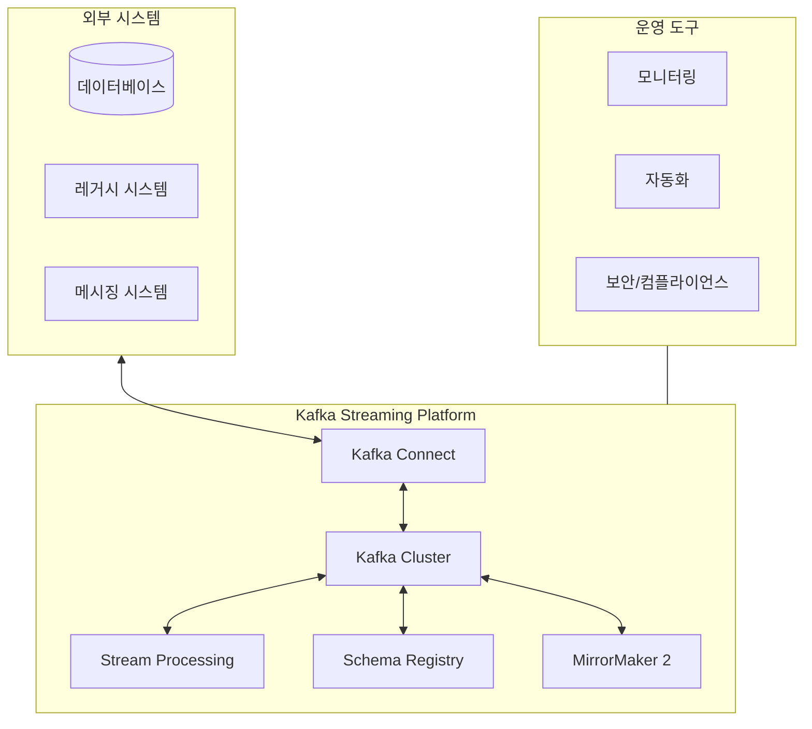

**핵심 구성 요소:**

| 구성 요소 | 역할 | 비고 |
|-----------|------|------|
| **Kafka Connect** | 외부 시스템 연동 | Apache 2.0 라이선스 |
| **REST Proxy** | HTTP로 Kafka 접근 | Karapace (오픈소스) |
| **Schema Registry** | 스키마 관리 | Confluent/Karapace |
| **Stream Processing** | 실시간 데이터 처리 | Kafka Streams, Flink |
| **MirrorMaker 2** | 클러스터 간 복제 | 재해 복구용 |

---

## 🔍 심화 학습

### Offset 관리 상세

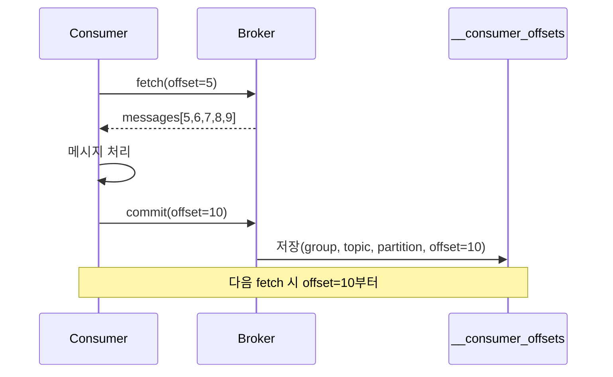

**Offset Commit 전략:**

| 전략 | 설명 | 장단점 |
|------|------|--------|
| **Auto Commit** | 주기적 자동 커밋 | 간편하지만 중복/유실 가능 |
| **Manual Commit** | 처리 후 명시적 커밋 | 정확하지만 구현 복잡 |
| **At-least-once** | 처리 후 커밋 | 중복 가능, 유실 없음 |
| **At-most-once** | 커밋 후 처리 | 중복 없음, 유실 가능 |

### 파티션 리밸런싱

Consumer Group 멤버 변경 시 파티션 재할당:

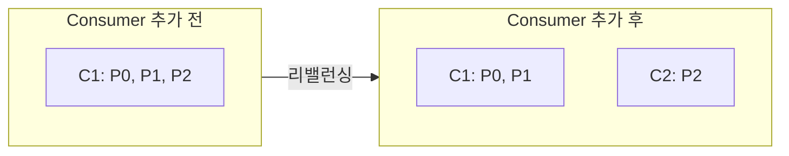

**리밸런싱 트리거:**
- Consumer 추가/제거
- Consumer 장애
- 토픽 파티션 수 변경

### librdkafka 해시 알고리즘 주의

```python
# Java Client: Murmur2 해시
# librdkafka 기본: 다른 알고리즘

# librdkafka에서 Java와 동일하게 설정
producer_config = {
    'partitioner': 'murmur2_random'  # 중요!
}
```

---

## 💡 실무 적용 포인트

### 1. 파티션 수 결정 가이드

```
┌─────────────────────────────────────────────────────────────┐
│                    파티션 수 결정 공식                        │
├─────────────────────────────────────────────────────────────┤
│  📊 처리량 기반                                              │
│     파티션 수 = 목표 처리량 / 단일 파티션 처리량               │
│                                                             │
│  👥 Consumer 기반                                           │
│     파티션 수 ≥ 최대 동시 Consumer 수                        │
│                                                             │
│  🔮 미래 확장성                                              │
│     초기에 여유있게 설정 (감소 불가!)                         │
├─────────────────────────────────────────────────────────────┤
│  💡 권장 시작점                                              │
│     • 소규모: 3-6개                                         │
│     • 중규모: 12-24개                                       │
│     • 대규모: 50개 이상                                      │
└─────────────────────────────────────────────────────────────┘
```

### 2. 복제 팩터 설정 가이드

| 환경 | 복제 팩터 | 이유 |
|------|-----------|------|
| 개발/테스트 | 1 | 리소스 절약 |
| 스테이징 | 2 | 기본 내결함성 |
| 프로덕션 | **3** | 1개 장애 + 유지보수 가능 |
| 미션 크리티컬 | 3-5 | 높은 가용성 |

### 3. Consumer Group 설계

```python
# Group ID 네이밍 컨벤션
group_id = f"{service_name}-{environment}-{purpose}"

# 예시
"analytics-prod-price-monitor"
"inventory-prod-stock-updater"
"notification-prod-order-alerts"
```

### 4. Hot Partition 방지

```
┌─────────────────────────────────────────────────────────────┐
│                    Hot Partition 문제                        │
├─────────────────────────────────────────────────────────────┤
│  ❌ 문제 상황                                                │
│     • 소수의 Key가 대부분의 트래픽 생성                       │
│     • 특정 파티션에 부하 집중                                 │
│     • 전체 성능 저하                                         │
├─────────────────────────────────────────────────────────────┤
│  ✅ 해결 방안                                                │
│     1. Key 분포 분석                                         │
│     2. Compound Key 사용 (userId + timestamp)                │
│     3. Custom Partitioner 구현                               │
│     4. 특수 Key 별도 토픽으로 분리                           │
└─────────────────────────────────────────────────────────────┘
```

---

## 🧪 실습 기록

### 환경

```bash
# 단일 브로커 환경 사용
docker-compose up -d
docker exec -it kafka_learn /bin/bash
```

### 실습 1: Offset 토픽 생성 및 메시지 전송

```bash
# 토픽 생성
kafka-topics --create \
    --topic offset-test \
    --partitions 1 \
    --replication-factor 1 \
    --bootstrap-server localhost:9092
```

**Producer로 10개 메시지 전송:**
```bash
kafka-console-producer \
    --topic offset-test \
    --bootstrap-server localhost:9092
```

**입력:**
```
message-0
message-1
message-2
...
message-9
```

### 실습 2: Consumer Group으로 소비 및 Offset 확인

```bash
# Consumer Group으로 5개만 소비 후 종료
kafka-console-consumer \
    --topic offset-test \
    --group test-group \
    --bootstrap-server localhost:9092
# Ctrl+C로 5개 소비 후 종료
```

**Consumer Group 상태 확인:**
```bash
kafka-consumer-groups --describe \
    --group test-group \
    --bootstrap-server localhost:9092
```

**결과:**
```
GROUP        TOPIC        PARTITION  CURRENT-OFFSET  LOG-END-OFFSET  LAG
test-group   offset-test  0          5               10              5
```

**분석:**
- CURRENT-OFFSET: 5 → 다음에 읽을 위치
- LOG-END-OFFSET: 10 → 전체 메시지 수
- LAG: 5 → 아직 5개 메시지 남음

### 실습 3: Offset 리셋

```bash
# Consumer Group 비활성화 후 리셋
kafka-consumer-groups --reset-offsets \
    --group test-group \
    --topic offset-test \
    --to-earliest \
    --execute \
    --bootstrap-server localhost:9092
```

**결과:**
```
GROUP         TOPIC        PARTITION  NEW-OFFSET
test-group    offset-test  0          0
```

**Offset 리셋 옵션:**
```bash
# 처음부터
--to-earliest

# 최신부터
--to-latest

# 특정 위치
--to-offset 100

# 특정 시간 기준
--to-datetime 2024-01-15T00:00:00.000
```

---

## ✅ 정리 체크리스트

### 로그 개념
- [ ] 로그는 순차적 리스트로, 끝에 추가하고 특정 위치에서 읽음
- [ ] Kafka는 분산 로그이며, 토픽 데이터는 여러 파티션에 분산
- [ ] Offset은 파티션 내 메시지 위치를 식별
- [ ] Kafka는 데이터베이스를 대체하지 않고, 시스템 간 데이터 교환용

### 파티셔닝
- [ ] 파티션은 토픽을 수평 확장하고 병렬 처리 가능하게 함
- [ ] Producer는 Partitioner로 파티션 결정
- [ ] 같은 Key의 메시지는 같은 파티션으로 감
- [ ] Key 없으면 Round-Robin 분배

### Consumer Group
- [ ] Consumer Group으로 Consumer 수평 확장
- [ ] 파티션은 Group 내 하나의 Consumer에만 할당
- [ ] 다른 Group은 독립적으로 모든 데이터 소비

### 복제
- [ ] 복제로 파티션을 여러 브로커에 복사하여 신뢰성 확보
- [ ] 파티션당 하나의 Leader가 모든 읽기/쓰기 담당
- [ ] ISR은 동기화된 복제본 목록
- [ ] Leader 장애 시 Follower가 승격

### Kafka 구성 요소
- [ ] Coordination Cluster: 클러스터 조정 (KRaft 권장)
- [ ] Broker: 메시지 수신/저장/전송
- [ ] Client: Producer, Consumer, Streams, Connect

### 기업 환경
- [ ] Kafka Connect로 외부 시스템 연동
- [ ] Schema Registry로 데이터 형식 관리
- [ ] MirrorMaker 2로 다중 데이터센터 운영

---

## 🎯 면접 대비 요약

### 한 줄 정의

"Kafka의 로그(Log)란 **시간순으로 정렬된 불변의 append-only 데이터 구조**입니다."

### 핵심 포인트 3가지

1. **로그의 불변성과 Sequential I/O**: 한 번 쓴 데이터는 변경 불가, 순차 쓰기로 디스크에서도 빠른 성능
2. **Offset 기반 위치 식별**: 파티션마다 독립적인 Offset, "Topic + Partition + Offset"으로 메시지 특정
3. **Consumer Group의 병렬 처리**: 파티션당 하나의 Consumer만 할당, 파티션 수가 최대 병렬성 결정

### 자주 묻는 질문

**Q: Offset은 무엇이고 어디에 저장되나요?**

A: Offset은 파티션 내 메시지의 고유 위치 식별자입니다. 0부터 시작해서 메시지마다 1씩 증가합니다. Consumer가 어디까지 읽었는지 추적하는 데 사용됩니다. 저장 위치는 `__consumer_offsets`라는 내부 토픽입니다. Key로 `(group_id, topic, partition)` 조합을, Value로 `(offset, metadata, timestamp)`를 저장합니다.

**Q: Key를 사용해야 하는 이유는 무엇인가요?**

A: Key 없이 다중 파티션에 메시지를 보내면 순서가 보장되지 않습니다. Kafka는 같은 Key의 메시지를 항상 같은 파티션에 보내므로, Key를 사용하면 해당 Key의 메시지들은 순서대로 처리됩니다. 예를 들어 주문 ID를 Key로 사용하면 같은 주문의 상태 변경 이벤트들이 순서대로 처리됩니다.

**Q: Consumer Group에서 파티션 수보다 Consumer가 많으면 어떻게 되나요?**

A: 남는 Consumer는 유휴 상태가 됩니다. Kafka에서 하나의 파티션은 Consumer Group 내에서 오직 하나의 Consumer만 소비할 수 있기 때문입니다. 따라서 파티션 수가 최대 병렬성을 결정합니다. 파티션 3개에 Consumer 5개라면, 2개의 Consumer는 아무 일도 하지 않습니다.

**Q: 리밸런싱이란 무엇이고 언제 발생하나요?**

A: 리밸런싱은 Consumer Group 내에서 파티션 할당을 재조정하는 과정입니다. Consumer 추가/제거, Consumer 장애(Heartbeat 타임아웃), 토픽 파티션 수 변경 시 발생합니다. 리밸런싱 동안에는 해당 Group의 소비가 일시 중단됩니다. CooperativeSticky 전략을 사용하면 리밸런싱 영향을 최소화할 수 있습니다.

---

## 🔗 참고 자료

### 공식 문서
- [Kafka Design - Log](https://kafka.apache.org/documentation/#design_log)
- [Kafka Replication](https://kafka.apache.org/documentation/#replication)
- [KRaft Overview](https://kafka.apache.org/documentation/#kraft)

### 심화 학습
- [The Log: What every software engineer should know](https://engineering.linkedin.com/distributed-systems/log-what-every-software-engineer-should-know-about-real-time-datas-unifying) - Jay Kreps
- [Kafka Internals](https://developer.confluent.io/courses/architecture/get-started/)
- [Backblaze Hard Drive Stats](https://www.backblaze.com/b2/hard-drive-test-data.html)

### 도구
- [Karapace (REST Proxy + Schema Registry)](https://github.com/aiven/karapace)
- [librdkafka](https://github.com/edenhill/librdkafka)
- [Kafka Streams](https://kafka.apache.org/documentation/streams/)

---

## 🔬 관련 실습

- [Stage 03: Distributed Log 실습](../../../poc/04-kafka/03-distributed-log/)

---

*📅 작성일: 2025-12-26*
*📚 출처: Kafka in Action / Kafka as a Distributed Log*
