# Chapter 5: Reliability (신뢰성)

---

## 📌 핵심 요약
> Kafka의 신뢰성은 **데이터 내구성(Durability)**, **가용성(Availability)**, **일관성(Consistency)** 세 가지 축으로 구성된다. ACK(Acknowledgment) 전략, 멱등성(Idempotence), 트랜잭션을 통해 메시지 전달 보장 수준을 제어하며, Leader-Follower 복제 원칙으로 장애 상황에서도 데이터를 보호한다.

---

## 🎯 학습 목표
이 내용을 읽고 나면:
- [ ] ACK 전략(acks=0, 1, all)의 차이점과 적용 시나리오를 설명할 수 있다
- [ ] `min.insync.replicas`와 ACK의 상호작용을 이해할 수 있다
- [ ] 메시지 전달 보장 수준(at-most-once, at-least-once, exactly-once)을 구분할 수 있다
- [ ] Kafka 트랜잭션의 동작 원리와 Two-Phase Commit을 설명할 수 있다
- [ ] Leader-Follower 복제와 장애 복구 메커니즘을 이해할 수 있다

---

## 📖 본문 정리

### 1. 신뢰성의 세 가지 축

Kafka에서 신뢰성은 세 가지 범주로 나뉩니다. 각 범주는 서로 다른 문제를 해결합니다.

**데이터 내구성(Data Durability)**은 한 번 저장된 데이터가 사라지지 않는 것을 보장합니다. 브로커가 장애로 죽어도 다른 브로커에 복제본이 있어서 데이터가 살아남습니다. 이것은 복제(Replication)로 달성합니다.

**가용성(Availability)**은 시스템이 언제든 사용 가능한 상태를 유지하는 것입니다. 브로커 하나가 죽어도 다른 브로커가 Leader로 승격되어 서비스가 계속됩니다. 이것도 복제(Replication)로 달성합니다.

**일관성(Consistency)**은 데이터가 정확히 원하는 대로 저장되는 것입니다. 메시지가 중복되거나 순서가 뒤바뀌지 않도록 보장합니다. ACK, 멱등성, 트랜잭션으로 달성합니다.

| 범주 | 설명 | 달성 방법 |
|------|------|-----------|
| **Data Durability** | 데이터가 영구적으로 올바르게 저장됨 | 복제(Replication) |
| **Availability** | Consumer가 언제든 데이터 읽기 가능, Producer가 언제든 쓰기 가능 | 복제(Replication) |
| **Consistency** | 클러스터에 데이터가 정확히 원하는 대로 유지됨 | ACK, 멱등성, 트랜잭션 |

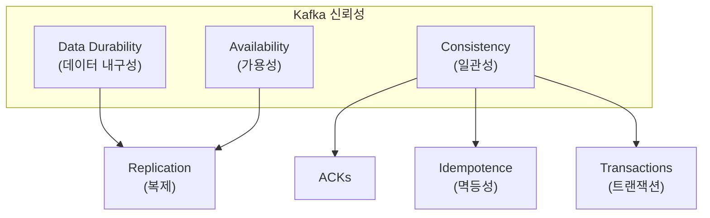

> 💬 **비유**: 신뢰성의 세 축은 은행 금고와 같습니다. **내구성**은 금고가 튼튼해서 돈이 사라지지 않는 것, **가용성**은 영업 시간에 언제든 입출금 가능한 것, **일관성**은 입금한 금액과 장부 기록이 정확히 일치하는 것입니다.

---

### 2. Acknowledgments (ACK)

#### 2.1 ACK란?

ACK(Acknowledgment)는 Producer가 메시지 전송 성공을 확인받는 메커니즘입니다. Producer가 메시지를 보내면 Kafka Broker가 "잘 받았다"는 응답을 보냅니다. TCP의 ACK와 유사하지만 애플리케이션 레벨에서 동작합니다.

어느 수준까지 확인을 받을지에 따라 신뢰성과 성능이 달라집니다. 확인을 많이 받을수록 안전하지만 그만큼 시간이 걸립니다.

#### 2.2 세 가지 ACK 전략

Kafka는 세 가지 ACK 전략을 제공합니다. 각각 다른 트레이드오프를 가집니다.

**acks=0 (Fire & Forget)**은 ACK를 기다리지 않습니다. Producer는 메시지를 보내고 바로 다음 작업을 합니다. 가장 빠르지만 메시지가 유실되어도 알 수 없습니다. 센서 데이터나 로그처럼 일부 유실이 허용되는 경우에 사용합니다.

**acks=1 (Leader ACK)**은 Leader 브로커가 메시지를 받으면 ACK를 보냅니다. Follower에 복제되기 전에 ACK가 오므로, Leader가 ACK 후 바로 죽으면 데이터가 유실될 수 있습니다. 일반적인 메시징에 사용합니다.

**acks=all (모든 ISR ACK)**은 모든 ISR(In-Sync Replicas)이 메시지를 복제한 후에 ACK를 보냅니다. 가장 안전하지만 가장 느립니다. 금융 거래나 중요 데이터에 사용합니다.

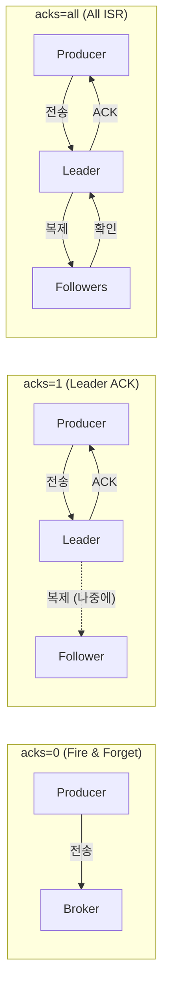

| ACK 값 | 동작 | 신뢰성 | 성능 | 사용 사례 |
|--------|------|--------|------|-----------|
| `acks=0` | ACK 없음 (UDP와 유사) | 최저 | 최고 | 센서 데이터, 로그 스트리밍 |
| `acks=1` | Leader 수신 시 ACK (TCP와 유사) | 중간 | 중간 | 일반적인 메시징 |
| `acks=all` (`-1`) | 모든 ISR 복제 후 ACK | 최고 | 낮음 | 금융 거래, 중요 데이터 |

> 💬 **비유**: `acks=0`은 편지를 우체통에 넣고 가는 것입니다. 도착 여부를 알 수 없습니다. `acks=1`은 우체부가 "받았어요"라고 확인해주는 것입니다. 하지만 우체부가 배달하다 잃어버릴 수 있습니다. `acks=all`은 수신자가 "읽었어요"라고 답장을 보내는 것입니다. 확실하지만 시간이 걸립니다.

> **Note**: Kafka 3.0부터 기본값이 `acks=all`로 변경되었습니다 (이전: `acks=1`).

#### 2.3 ACK와 ISR의 상호작용

`min.insync.replicas` 설정은 `acks=all`과 함께 동작합니다. 이 설정은 최소 몇 개의 ISR이 있어야 쓰기를 허용할지 결정합니다.

예를 들어 `min.insync.replicas=2`로 설정하면, ISR이 2개 미만일 때는 쓰기가 거부됩니다. 이때 `NOT_ENOUGH_REPLICAS` 에러가 발생합니다. 왜 이렇게 할까요? ISR이 1개뿐인 상태에서 쓰기를 허용하면, 그 1개마저 장애가 나면 데이터가 유실되기 때문입니다.

**브로커 장애 시나리오:**

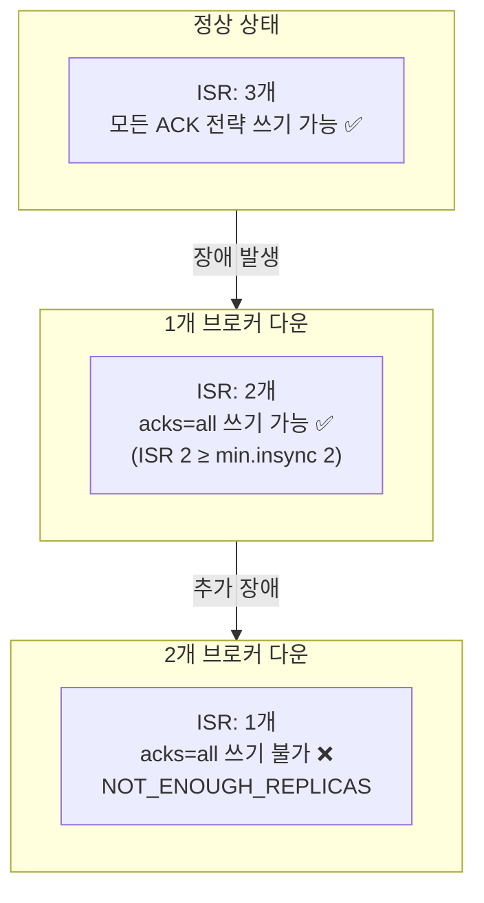

| 상황 | ISR 수 | acks=0 | acks=1 | acks=all |
|------|--------|--------|--------|----------|
| 3개 브로커 정상 | 3 | ✅ 쓰기 가능 | ✅ 쓰기 가능 | ✅ 쓰기 가능 |
| 1개 브로커 다운 | 2 | ✅ 쓰기 가능 | ✅ 쓰기 가능 | ✅ 쓰기 가능 |
| 2개 브로커 다운 | 1 | ✅ 쓰기 (읽기 불가) | ✅ 쓰기 (읽기 불가) | ❌ NOT_ENOUGH_REPLICAS |

> ⚠️ **주의**: `min.insync.replicas=1`이고 ISR이 1개뿐이면, `acks=all`도 `acks=1`과 동일하게 동작하여 데이터 손실 가능합니다.

**장애 허용 공식:**

```
장애 허용 브로커 수 = replication-factor - min.insync.replicas
```

예: `replication-factor=3`, `min.insync.replicas=2` → 1개 브로커 장애까지 허용

> **권장**: `replication-factor=3`, `min.insync.replicas=2` 조합 사용. 더 높은 복원력이 필요하면 `replication-factor=4`, `min.insync.replicas=2`

---

### 3. 메시지 전달 보장 (Delivery Guarantees)

#### 3.1 Producer 관점 vs Consumer 관점

메시지 전달 보장은 같은 용어를 쓰지만 Producer와 Consumer에서 의미가 다릅니다.

**Producer 관점**에서 전달 보장은 "메시지가 Kafka에 저장되는 것"을 말합니다. `acks` 설정으로 제어합니다. `acks=0`이면 저장 확인 없이 보내므로 유실 가능성이 있고, `acks=all`이면 모든 ISR에 저장된 것을 확인하므로 유실이 없습니다.

**Consumer 관점**에서 전달 보장은 "메시지를 처리하는 것"을 말합니다. Offset 커밋 전략으로 제어합니다. 처리 전에 커밋하면 유실 가능성이 있고(At-Most-Once), 처리 후에 커밋하면 중복 가능성이 있습니다(At-Least-Once).

#### 3.2 세 가지 전달 보장 수준

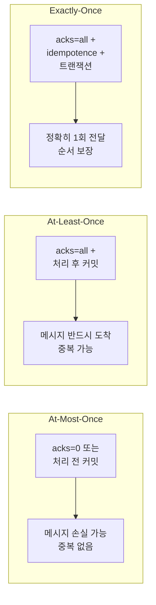

| 보장 수준 | Producer 설정 | Consumer 설정 | 특징 |
|-----------|--------------|---------------|------|
| **At-Most-Once** | `acks=0` | 처리 전 커밋 | 중복 없음, 손실 가능 |
| **At-Least-Once** | `acks=all` + 적절한 `min.insync.replicas` | 처리 후 커밋 | 반드시 도착, 중복 가능 |
| **Exactly-Once** | `acks=all` + `enable.idempotence=true` + 트랜잭션 | `isolation.level=read_committed` | 정확히 1회, 순서 보장 |

> 💬 **비유**: **At-Most-Once**는 초대장을 한 번만 보내고 확인 안 하는 것입니다. 누락 가능하지만 같은 사람에게 두 번 보내진 않습니다. **At-Least-Once**는 답장 올 때까지 계속 보내는 것입니다. 확실히 받지만 같은 초대장을 여러 번 받을 수 있습니다. **Exactly-Once**는 등기우편으로 한 번만 정확히 전달하고 수신 확인도 받는 것입니다.

---

### 4. 멱등성 (Idempotence)

#### 4.1 중복 메시지 문제

ACK가 손실되면 Producer는 메시지가 저장되었는지 알 수 없습니다. 안전을 위해 재전송하면 중복 메시지가 발생합니다.

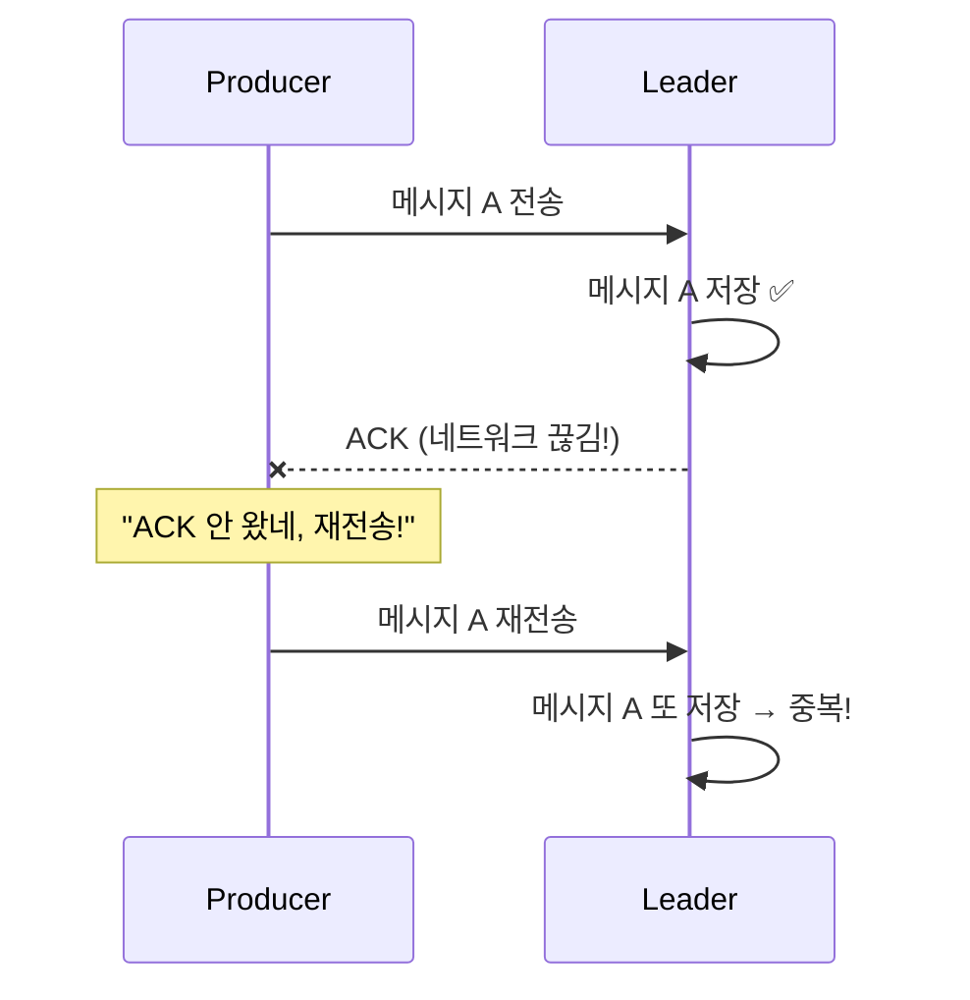

이 문제가 실무에서 중요한 이유는 다음과 같습니다. 결제 시스템에서 "10,000원 결제" 메시지가 중복되면 고객에게 두 번 청구됩니다. 재고 시스템에서 "재고 -1" 메시지가 중복되면 재고가 두 번 차감됩니다.

#### 4.2 해결: enable.idempotence=true

멱등성 Producer를 활성화하면 중복 메시지를 방지할 수 있습니다.

**동작 원리:**

Producer가 시작할 때 Kafka가 고유한 **Producer ID(PID)**를 부여합니다. 메시지를 전송할 때마다 PID와 함께 **Sequence Number**를 보냅니다. Sequence Number는 파티션별로 0, 1, 2, 3... 순차적으로 증가합니다.

네트워크 문제로 재전송이 발생하면, 같은 PID와 같은 Sequence Number가 다시 전송됩니다. Broker는 "이 PID의 이 Sequence는 이미 받았는데?"라고 판단하고 중복 메시지를 무시합니다.

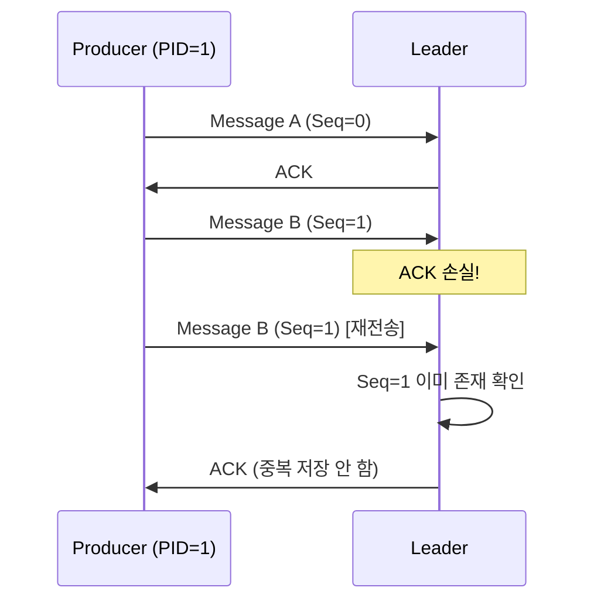

#### 4.3 순서 오류 감지

멱등성은 순서 보장도 제공합니다. Sequence Number가 연속적이지 않으면 Broker가 거부합니다.

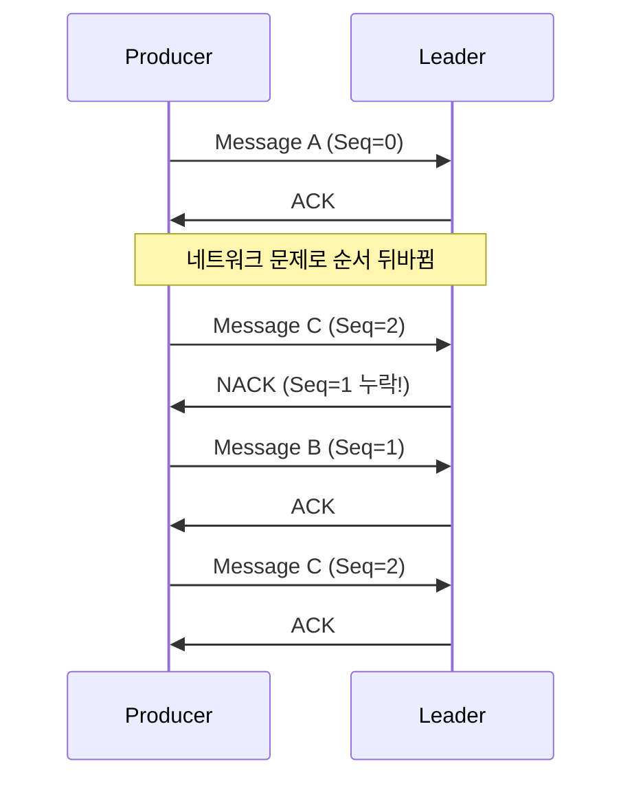

#### 4.4 멱등성 사용 조건

`enable.idempotence=true`를 설정하면 다른 설정들이 자동으로 조정됩니다:

- `acks=all`이 필수로 설정됩니다
- `retries`가 무한대로 설정됩니다 (재시도 포기 없음)
- `max.in.flight.requests.per.connection`이 5 이하로 제한됩니다

> **Note**: Kafka 3.0부터 멱등성이 기본 활성화됨. 성능 저하는 무시할 수준이므로 항상 활성화 권장.

---

### 5. 트랜잭션 (Transactions)

#### 5.1 트랜잭션의 필요성

Kafka 내에서 데이터를 읽고, 처리하고, 다른 토픽에 쓰는 경우 원자적 쓰기가 필요합니다.

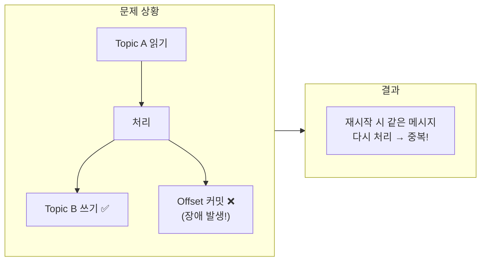

예를 들어, 주문 이벤트를 읽고 재고 감소 이벤트를 쓰는 시스템을 생각해봅시다. 재고 감소 쓰기는 성공했는데 오프셋 커밋 전에 장애가 나면, 재시작 후 같은 주문을 다시 처리합니다. 재고가 두 번 차감됩니다.

트랜잭션은 **쓰기 + 오프셋 커밋을 원자적으로 처리**합니다. 둘 다 성공하거나 둘 다 실패합니다.

> 💬 **비유**: 은행 송금과 같습니다. Bob 계좌에서 -10, Alice 계좌에서 +10이 **동시에** 일어나야 합니다. 하나만 되면 돈이 사라지거나 복제됩니다.

#### 5.2 DB 트랜잭션 vs Kafka 트랜잭션

| 구분 | DB 트랜잭션 | Kafka 트랜잭션 |
|------|-------------|----------------|
| **대상** | INSERT/UPDATE/DELETE | 토픽 쓰기 + 오프셋 커밋 |
| **범위** | 단일 DB 내 | 단일 Kafka 클러스터 내 |
| **롤백** | DB 변경 취소 | 메시지 쓰기 취소 (abort marker) |
| **격리** | ACID 격리 수준 | read_committed / read_uncommitted |

> ⚠️ **주의**: Kafka 트랜잭션은 Kafka 클러스터 내에서만 동작합니다. Kafka + DB를 하나의 트랜잭션으로 묶을 수 없습니다. 이 경우 Outbox 패턴이나 Saga 패턴을 사용해야 합니다.

#### 5.3 Two-Phase Commit

Kafka는 **Two-Phase Commit** 변형을 사용합니다:

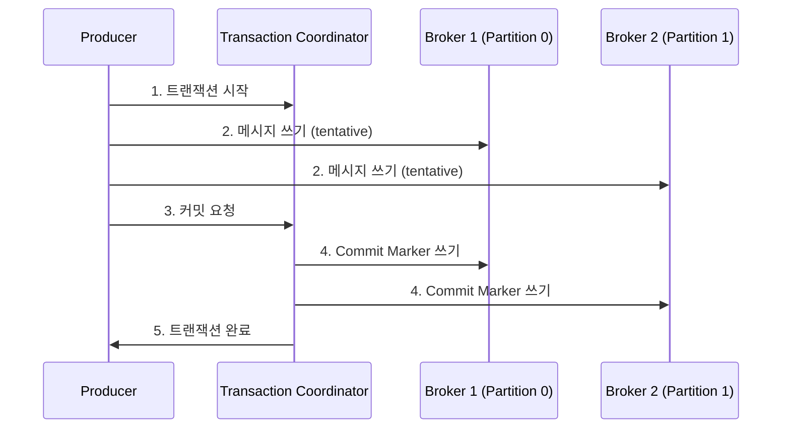

**Phase 1 (Prepare)**: 모든 파티션에 tentative(임시) 상태로 메시지를 씁니다.
**Phase 2 (Commit)**: Transaction Coordinator가 모든 파티션에 Commit Marker를 씁니다.

> 💬 **비유**: 여행 예약과 같습니다. 호텔과 항공권을 동시에 예약하고 싶을 때, 먼저 둘 다 "임시 예약"하고 모두 성공하면 "확정", 하나라도 실패하면 모두 "취소"합니다.

#### 5.4 Consumer의 Isolation Level

Consumer는 `isolation.level` 설정으로 어떤 메시지를 읽을지 결정합니다:

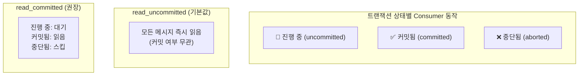

| 설정 | 동작 | 사용 시나리오 |
|------|------|--------------|
| `read_uncommitted` (기본값) | 커밋 안 된 메시지도 읽음 | 트랜잭션 사용 안 할 때 |
| `read_committed` | 커밋된 메시지만 읽음 | 트랜잭션 사용할 때 필수 |

> ⚠️ **주의**: 진행 중인 트랜잭션이 있으면, 그 이후의 **모든 메시지**(트랜잭션과 무관한 것도)가 대기 상태가 됩니다. 오래 걸리는 트랜잭션은 Consumer 지연을 유발합니다.

#### 5.5 트랜잭션 성능 고려사항

트랜잭션 오버헤드는 메시지 수가 아닌 **파티션 수**에 비례합니다:

- 100ms 트랜잭션: 약 3% 오버헤드
- 10ms 트랜잭션: 약 30% 오버헤드 (짧은 트랜잭션은 비효율)

**권장**: 트랜잭션 사용 여부와 관계없이 모든 Consumer에 `isolation.level=read_committed` 설정

---

### 6. Leader-Follower 복제 원칙

#### 6.1 복제 구조

Kafka는 Leader-Follower 복제를 사용합니다. 각 파티션에는 하나의 Leader와 0개 이상의 Follower가 있습니다. 모든 읽기/쓰기는 Leader를 통해 이루어지고, Follower는 Leader를 복제합니다.

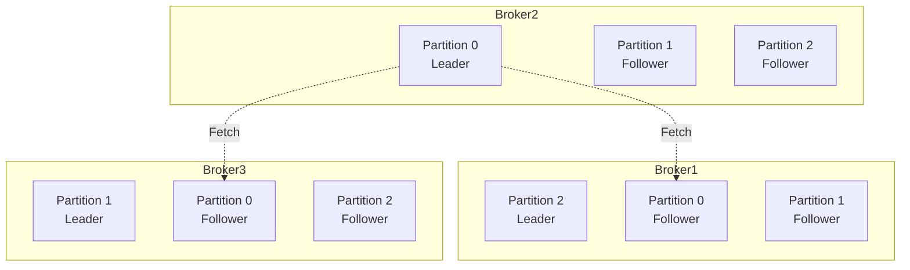

각 파티션의 Leader가 서로 다른 브로커에 분산되어 있습니다. 이렇게 하면 부하가 균등하게 분배됩니다.

#### 6.2 Follower의 데이터 복제

Follower는 **Consumer처럼 동작**합니다. Leader가 Follower에게 Push하는 것이 아니라, Follower가 Leader에게 Fetch 요청을 보내서 데이터를 가져옵니다.

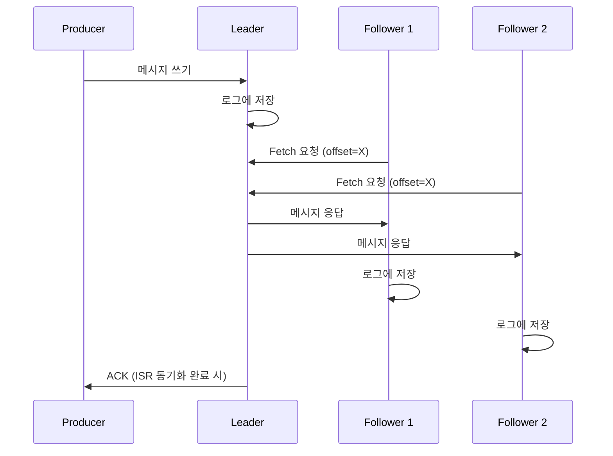

이 구조의 장점은 Follower가 느려져도 Leader 성능에 영향을 주지 않는다는 것입니다. Follower가 자기 속도에 맞춰 데이터를 가져갑니다.

> 💬 **비유**: Leader는 원본 문서를 가진 본사, Follower는 복사본을 유지하는 지사와 같습니다. 지사들은 주기적으로 본사에 "새 문서 있나요?"라고 물어보고 복사합니다.

#### 6.3 브로커 장애 및 복구

**장애 발생 시 동작:**

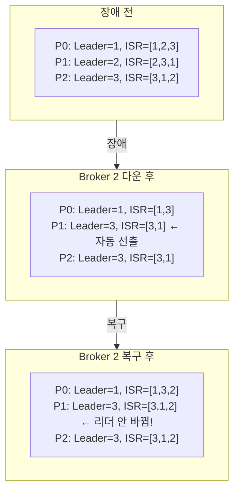

**핵심 포인트:**
1. ISR에서 장애 브로커가 자동 제거됩니다
2. Leader였던 브로커가 다운되면 ISR 중 다른 브로커가 자동으로 새 Leader가 됩니다
3. 복구 후 ISR은 자동으로 복원되지만, **Leader는 자동으로 복원되지 않습니다**

#### 6.4 Under-replicated 파티션

Under-replicated 파티션은 복제본 수가 설정보다 적은 파티션입니다. 이는 브로커 장애의 징후입니다.

모니터링해야 하는 두 가지 유형:

| 유형 | 설명 | 심각도 |
|------|------|--------|
| Under-replicated | ISR < Replicas | 경고 (복제 지연) |
| Under-min-ISR | ISR < min.insync.replicas | 위험 (쓰기 불가능) |

#### 6.5 Preferred Leader Election

Preferred Leader는 Replicas 목록의 첫 번째 브로커입니다. 장애 복구 후 원래 Leader로 돌리려면 Preferred Leader Election을 실행합니다.

| Election Type | 설명 | 위험도 |
|---------------|------|--------|
| `preferred` | 원래 리더(Replicas 목록 첫 번째)로 복원 | 안전 |
| `unclean` | ISR이 아닌 복제본도 리더 가능 | **데이터 손실 위험** |

> ⚠️ **경고**: `unclean` 리더 선출은 극단적 상황에서만 **특정 토픽에 한해** 사용. 클러스터 전체 설정 (`unclean.leader.election.enable`)은 권장하지 않습니다.

---

## 🔍 심화 학습

### CAP 정리와 Kafka

Kafka는 **CP(Consistency-Partition Tolerance)** 시스템으로 분류할 수 있지만, 설정에 따라 트레이드오프 조절 가능합니다:

| 설정 | 우선순위 |
|------|----------|
| `acks=0`, `min.insync.replicas=1` | Availability 우선 (AP) |
| `acks=all`, `min.insync.replicas=2+` | Consistency 우선 (CP) |

### ISR vs ELR (Kafka 3.7+)

Kafka 3.7부터 **ELR(Eligible Leader Replicas)** 개념이 도입되었습니다 (KIP-966).

**기존 문제 (Last Replica Standing)**:
- ISR이 1개까지 줄어든 상태에서 마지막 브로커 다운
- `unclean.leader.election.enable=false`면 파티션 영구 불능
- `unclean.leader.election.enable=true`면 데이터 손실 위험

**ELR 해결책**:
- **ISR**: Leader와 완전히 동기화된 복제본
- **ELR**: ISR은 아니지만 High Watermark까지 데이터 보유한 복제본

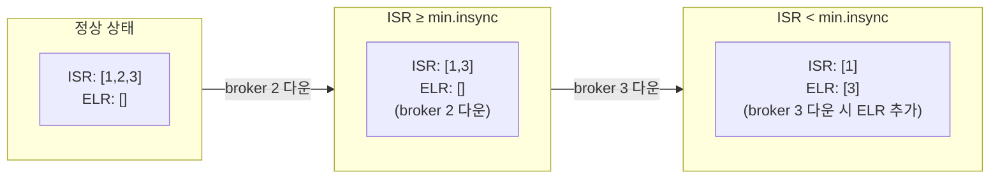

**ELR 추가 조건**:
- ISR에서 제거된 복제본이 ELR에 추가되는 것은 **ISR이 min.insync.replicas 아래로 떨어질 때만** 발생
- Clean shutdown인 복제본만 ELR에 포함 (Unclean shutdown은 제외)

**Leader 선출 우선순위 (Kafka 4.0+)**:
1. ISR 멤버 (안전)
2. ELR 멤버 (데이터 손실 없음)
3. LastKnownElr (Unclean election, 데이터 손실 가능)

### kafka-console-consumer 시작 오버헤드

CLI 도구인 `kafka-console-consumer`는 매 실행마다 새로운 JVM 프로세스를 시작합니다. 이로 인해 상당한 시작 오버헤드가 발생합니다.

**시작 과정과 소요 시간**:

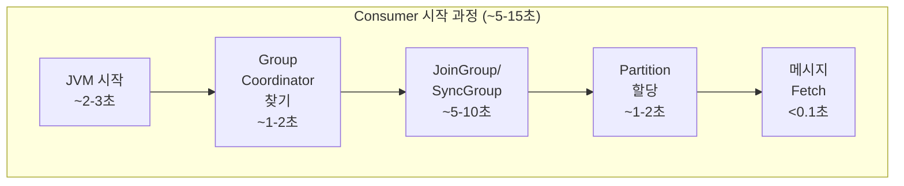

**실제 측정 결과** (메시지 1개 읽기):
```bash
$ time kafka-console-consumer --topic test --max-messages 1 ...
# 결과: 약 17초 소요 (메시지 전송은 0.1초 미만)
```

**`--timeout-ms` 동작 방식**:

```
잘못된 이해:
"메시지가 없으면 3초 후 종료"

실제 동작:
"전체 과정 시작부터 타이머 시작, 3초 내에 메시지를 못 읽으면 종료"
```

| timeout 설정 | 결과 |
|-------------|------|
| 3000ms (3초) | ❌ Consumer 초기화 중 타임아웃, 메시지 0개 |
| 5000ms (5초) | ⚠️ 환경에 따라 실패 가능 |
| 10000ms (10초) | ✅ 대부분 성공 |

**`--from-beginning` 주의사항**:

`--from-beginning`은 **Consumer Group에 커밋된 오프셋이 없을 때만** 처음부터 읽습니다.

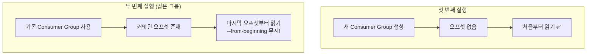

**해결책**:
```bash
# 방법 1: 매번 새로운 그룹 사용
kafka-console-consumer --topic test \
    --from-beginning \
    --group test-$(date +%s) \    # 타임스탬프로 유니크 그룹
    --bootstrap-server kafka1:9092

# 방법 2: 파티션 직접 지정 (Consumer Group 미사용)
kafka-console-consumer --topic test \
    --partition 0 \
    --offset earliest \
    --bootstrap-server kafka1:9092
```

> **Note**: 실제 애플리케이션에서는 Consumer가 계속 실행되므로 이 오버헤드가 없습니다. CLI 도구는 테스트/디버깅 용도로만 사용하세요.

### 데이터베이스 연동 시 Exactly-Once

Kafka 트랜잭션은 Kafka 내에서만 동작합니다. DB 연동 시에는 다른 전략이 필요합니다:

**방법 1: 멱등성 UPSERT**
```sql
INSERT INTO products_price_changelog (id, timestamp, name, price)
    VALUES (…)
    ON CONFLICT DO NOTHING;
```

**방법 2: 오프셋을 DB에 저장 (트랜잭션)**
```sql
BEGIN TRANSACTION;
    INSERT INTO products_price_changelog (id, timestamp, name, price)
        VALUES (…);
    INSERT INTO offsets (topic, partition, offset)
        VALUES ('products_price_changelog', 0, 123);
COMMIT;
```

---

## 💡 실무 적용 포인트

### 상황별 권장 설정

| 상황 | 권장 설정 | 이유 |
|------|----------|------|
| **금융/결제 시스템** | `acks=all` + `enable.idempotence=true` + 트랜잭션 | 데이터 손실/중복 절대 불가 |
| **이벤트 소싱** | `acks=all` + `min.insync.replicas=2` | 이벤트 순서와 무결성 중요 |
| **로그 수집** | `acks=0` 또는 `acks=1` | 처리량 우선, 일부 손실 허용 |
| **IoT 센서 데이터** | `acks=0` | 데이터량 많고 개별 데이터 가치 낮음 |

### 주의할 점 / 흔한 실수

- ⚠️ **min.insync.replicas=1 사용**: `acks=all`이어도 Leader만 확인하므로 데이터 손실 가능
- ⚠️ **트랜잭션 없이 Consumer+Producer**: 오프셋과 메시지 쓰기가 원자적이지 않아 중복/유실 발생
- ⚠️ **read_uncommitted Consumer**: 커밋되지 않은 메시지 읽어서 잘못된 데이터 처리
- ⚠️ **짧은 트랜잭션 남용**: 10ms 이하 트랜잭션은 30% 이상 오버헤드
- ⚠️ **unclean leader election 전체 활성화**: 클러스터 전체에 데이터 손실 위험
- ⚠️ **kafka-console-consumer의 짧은 timeout**: CLI 도구는 JVM + Consumer Group 초기화에 5-15초 소요. `--timeout-ms 3000`은 초기화 완료 전에 타임아웃됨
- ⚠️ **--from-beginning 오해**: 같은 Consumer Group으로 재실행하면 커밋된 오프셋부터 읽음. 매번 새 그룹 사용 필요

### 면접에서 나올 수 있는 질문

**Q: Kafka에서 Exactly-Once를 어떻게 달성하나요?**
A: Producer 측에서는 `acks=all` + `enable.idempotence=true`로 달성합니다. 멱등성 Producer는 PID와 Sequence Number를 사용해서 중복 메시지를 감지하고 무시합니다. Consumer까지 포함한 End-to-End Exactly-Once는 트랜잭션을 사용합니다. 메시지 쓰기와 오프셋 커밋을 하나의 트랜잭션으로 묶어서 원자적으로 처리합니다.

**Q: `acks=all`과 `acks=1`의 차이점은?**
A: `acks=1`은 Leader 브로커만 메시지를 받으면 ACK를 보냅니다. 빠르지만 Leader가 ACK 후 바로 죽으면 데이터가 유실됩니다. `acks=all`은 모든 ISR(In-Sync Replicas)이 메시지를 복제한 후에 ACK를 보냅니다. 느리지만 여러 브로커에 복제되어 안전합니다.

**Q: min.insync.replicas의 역할은?**
A: `acks=all`과 함께 사용되는 설정입니다. 최소 몇 개의 ISR이 있어야 쓰기를 허용할지 결정합니다. 예를 들어 2로 설정하면, ISR이 2개 미만일 때 쓰기가 거부되고 NOT_ENOUGH_REPLICAS 에러가 발생합니다. 이렇게 해서 최소한의 복제본을 보장합니다.

**Q: Kafka 트랜잭션이 Two-Phase Commit을 사용하는 이유는?**
A: 여러 파티션에 원자적으로 쓰기 위해서입니다. Phase 1에서 모든 파티션에 tentative 상태로 메시지를 쓰고, Phase 2에서 Transaction Coordinator가 모든 파티션에 Commit Marker를 씁니다. 한 파티션이라도 실패하면 모든 파티션에 Abort Marker를 써서 롤백합니다.

**Q: ELR(Eligible Leader Replicas)이란 무엇이고 왜 필요한가요?**
A: Kafka 3.7+에서 도입된 개념입니다. ISR이 min.insync.replicas 아래로 떨어질 때, ISR에서 제거된 복제본이 ELR에 추가됩니다. ELR의 복제본은 High Watermark까지 데이터를 보유하므로, ISR이 비었을 때 데이터 손실 없이 Leader로 선출될 수 있습니다. 기존의 "Last Replica Standing" 문제를 해결합니다.

**Q: `--from-beginning` 옵션이 동작하지 않을 때 원인은?**
A: `--from-beginning`은 Consumer Group에 커밋된 오프셋이 없을 때만 처음부터 읽습니다. 같은 그룹으로 재실행하면 이미 커밋된 오프셋이 있어서 마지막 위치부터 읽습니다. 해결책은 매번 새로운 그룹 ID를 사용하거나(`--group test-$(date +%s)`), 파티션을 직접 지정하여 Consumer Group 없이 읽는 것입니다(`--partition 0 --offset earliest`).

---

## ✅ 핵심 개념 체크리스트
- [ ] ACK의 세 가지 전략(0, 1, all)과 각각의 트레이드오프를 설명할 수 있는가?
- [ ] `min.insync.replicas`와 `acks=all`의 상호작용을 이해하는가?
- [ ] 메시지 전달 보장 수준 3가지(at-most-once, at-least-once, exactly-once)를 구분할 수 있는가?
- [ ] 멱등성(Idempotence)의 동작 원리와 Producer ID, Sequence ID 역할을 아는가?
- [ ] Kafka 트랜잭션의 Two-Phase Commit 과정을 설명할 수 있는가?
- [ ] Consumer의 `isolation.level=read_committed` 설정 필요성을 이해하는가?
- [ ] Leader-Follower 복제에서 Follower가 Consumer처럼 동작함을 아는가?
- [ ] Preferred Leader Election과 Unclean Leader Election의 차이를 아는가?
- [ ] ISR과 ELR의 차이점과 ELR이 추가되는 조건을 이해하는가?
- [ ] `--from-beginning`이 Consumer Group 오프셋과 어떻게 상호작용하는지 아는가?

---

## 🧪 실습 기록

### 환경

도커 멀티 브로커 환경에서 실습합니다. 3개의 Kafka 브로커가 KRaft 모드로 동작합니다.

```bash
# 디렉토리 이동
cd /path/to/kafka-messaging

# 멀티 브로커 환경 (3개 브로커) 시작
docker-compose -f docker-compose-multi.yml up -d

# 컨테이너 상태 확인
docker-compose -f docker-compose-multi.yml ps

# kafka1 컨테이너 접속
docker exec -it kafka1 /bin/bash
```

### 실습 1: 복제 토픽 생성

replication-factor=3, min.insync.replicas=2로 토픽을 생성합니다.

```bash
kafka-topics --create \
    --topic replication-test \
    --partitions 3 \
    --replication-factor 3 \
    --config min.insync.replicas=2 \
    --bootstrap-server kafka1:9092
```

**결과:**
```
Created topic replication-test.
```

**토픽 상태 확인:**
```bash
kafka-topics --describe \
    --topic replication-test \
    --bootstrap-server kafka1:9092
```

**결과:**
```
Topic: replication-test   PartitionCount: 3   ReplicationFactor: 3
    Topic: replication-test   Partition: 0   Leader: 1   Replicas: 1,2,3   Isr: 1,2,3
    Topic: replication-test   Partition: 1   Leader: 2   Replicas: 2,3,1   Isr: 2,3,1
    Topic: replication-test   Partition: 2   Leader: 3   Replicas: 3,1,2   Isr: 3,1,2
```

**분석:**
- 각 파티션이 서로 다른 Leader를 가집니다 (균등 분배)
- ISR = Replicas (모든 복제본 동기화 완료)
- Replicas 첫 번째가 Preferred Leader입니다

### 실습 2: 브로커 장애 시뮬레이션 (1개 다운)

```bash
# 호스트에서 Broker 2 중지
docker stop kafka2
```

**토픽 상태 확인 (kafka1 컨테이너 내에서):**
```bash
kafka-topics --describe \
    --topic replication-test \
    --bootstrap-server kafka1:9092
```

**결과:**
```
Topic: replication-test   Partition: 0   Leader: 1   Replicas: 1,2,3   Isr: 1,3
Topic: replication-test   Partition: 1   Leader: 3   Replicas: 2,3,1   Isr: 3,1
Topic: replication-test   Partition: 2   Leader: 3   Replicas: 3,1,2   Isr: 3,1
```

**분석:**
- ISR에서 Broker 2가 제거되었습니다
- Partition 1의 Leader가 2 → 3으로 자동 선출되었습니다
- ISR: 2 ≥ min.insync.replicas: 2 → ✅ 쓰기 가능

**메시지 전송 테스트:**
```bash
echo "test-message-during-failover" | kafka-console-producer \
    --topic replication-test \
    --producer-property acks=all \
    --bootstrap-server kafka1:9092
```

**결과:** 정상 전송됨

### 실습 3: 브로커 장애 시뮬레이션 (2개 다운)

```bash
# 호스트에서 Broker 3도 중지
docker stop kafka3
```

**메시지 전송 시도:**
```bash
echo "test-message-with-two-down" | kafka-console-producer \
    --topic replication-test \
    --producer-property acks=all \
    --bootstrap-server kafka1:9092
```

**결과:**
```
ERROR: NOT_ENOUGH_REPLICAS
```

**분석:**
- ISR: 1 < min.insync.replicas: 2 → ❌ 쓰기 불가
- Kafka가 데이터 안전을 위해 쓰기를 거부합니다
- 이것이 min.insync.replicas 설정의 목적입니다

### 실습 4: 브로커 복구 및 Leader Election

```bash
# 호스트에서 브로커 복구
docker start kafka2
docker start kafka3
```

**토픽 상태 확인:**
```bash
kafka-topics --describe \
    --topic replication-test \
    --bootstrap-server kafka1:9092
```

**결과:**
```
Topic: replication-test   Partition: 0   Leader: 1   Replicas: 1,2,3   Isr: 1,3,2
Topic: replication-test   Partition: 1   Leader: 3   Replicas: 2,3,1   Isr: 3,1,2
Topic: replication-test   Partition: 2   Leader: 3   Replicas: 3,1,2   Isr: 3,1,2
```

**분석:**
- ISR 복구됨 (모든 브로커 포함)
- **하지만 Leader는 자동 복원 안 됨!**
- Partition 1의 Leader가 여전히 3 (원래 2여야 함)

**Preferred Leader Election 실행:**
```bash
kafka-leader-election \
    --election-type preferred \
    --all-topic-partitions \
    --bootstrap-server kafka1:9092
```

**결과:**
```
Successfully completed leader election for partitions:
replication-test-1
```

**최종 토픽 상태:**
```
Topic: replication-test   Partition: 0   Leader: 1   Replicas: 1,2,3   Isr: 1,2,3
Topic: replication-test   Partition: 1   Leader: 2   Replicas: 2,3,1   Isr: 2,3,1
Topic: replication-test   Partition: 2   Leader: 3   Replicas: 3,1,2   Isr: 3,1,2
```

**분석:**
- Partition 1의 Leader가 2로 복원됨
- Replicas 첫 번째가 Preferred Leader

### 실습 5: ACK 전략별 성능 비교

```bash
# acks=0 (Fire & Forget)
time (for i in {1..1000}; do echo "msg-$i"; done | kafka-console-producer \
    --topic replication-test \
    --producer-property acks=0 \
    --bootstrap-server kafka1:9092)

# acks=1 (Leader only)
time (for i in {1..1000}; do echo "msg-$i"; done | kafka-console-producer \
    --topic replication-test \
    --producer-property acks=1 \
    --bootstrap-server kafka1:9092)

# acks=all (All ISR)
time (for i in {1..1000}; do echo "msg-$i"; done | kafka-console-producer \
    --topic replication-test \
    --producer-property acks=all \
    --bootstrap-server kafka1:9092)
```

**예상 결과:**
- acks=0: 가장 빠름 (1-2초)
- acks=1: 중간 (3-5초)
- acks=all: 가장 느림 (5-10초)

**분석:**
- ACK 전략에 따라 처리량과 지연 시간이 크게 달라집니다
- 실무에서는 데이터 중요도에 따라 선택합니다

### 실습 6: Under-replicated 파티션 모니터링

```bash
# Under-replicated 파티션 확인
kafka-topics --describe \
    --under-replicated-partitions \
    --bootstrap-server kafka1:9092

# min.insync.replicas 미만인 파티션 확인
kafka-topics --describe \
    --under-min-isr-partitions \
    --bootstrap-server kafka1:9092
```

**분석:**
- 정상 상태에서는 아무것도 출력되지 않습니다
- 브로커 장애 시 해당 파티션이 출력됩니다
- 프로덕션에서 이 메트릭을 모니터링해야 합니다

---

## 🔗 참고 자료
- 📄 공식 문서: [Apache Kafka - Producer Configs](https://kafka.apache.org/documentation/#producerconfigs)
- 📄 공식 문서: [Apache Kafka - Consumer Configs](https://kafka.apache.org/documentation/#consumerconfigs)
- 📄 KIP 문서: [KIP-98: Exactly Once Delivery and Transactional Messaging](https://cwiki.apache.org/confluence/display/KAFKA/KIP-98+-+Exactly+Once+Delivery+and+Transactional+Messaging)
- 📄 블로그: [Confluent - Transactions in Apache Kafka](https://www.confluent.io/blog/transactions-apache-kafka/)
- 📄 블로그: [Confluent - Kafka Replication](https://docs.confluent.io/platform/current/kafka/replication.html)

---

## 🔬 관련 실습

- [Stage 04: Reliability 실습](../../../poc/04-kafka/04-reliability/)
