# Kafka Performance 완벽 가이드 (면접/책 정리용)

---

## 1. 핵심 개념: Throughput vs Latency

**Throughput(처리량)**: 단위 시간당 처리할 수 있는 데이터 양 (예: 100 MB/sec)

**Latency(지연 시간)**: 메시지 전송부터 저장 완료까지 걸리는 시간 (예: 5ms)

이 두 지표는 **Trade-off 관계**입니다:
- 배치 크기 ↑ → Throughput ↑, Latency ↑
- 배치 크기 ↓ → Throughput ↓, Latency ↓

> **Amazon 사례 (2008)**: 로딩 시간 100ms 증가 시 매출 1% 감소

---

## 2. Kafka가 빠른 3가지 이유

### 2.1 Sequential I/O

Kafka는 **Append-Only 로그 구조**를 사용합니다. 디스크에 순차적으로만 쓰기 때문에 Random I/O 대비 **10~100배 빠릅니다**.

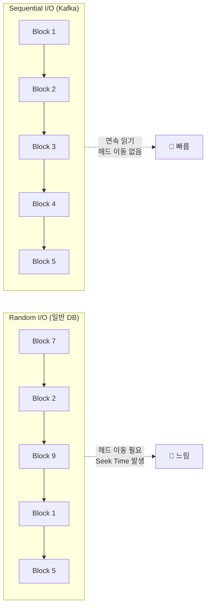

| 접근 방식 | HDD | SSD | 비율 |
|-----------|-----|-----|------|
| Sequential Read | ~100 MB/s | ~500 MB/s | 기준 |
| Random Read | ~1 MB/s | ~50 MB/s | **10~100배 느림** |

#### HDD에서 Random I/O가 느린 이유

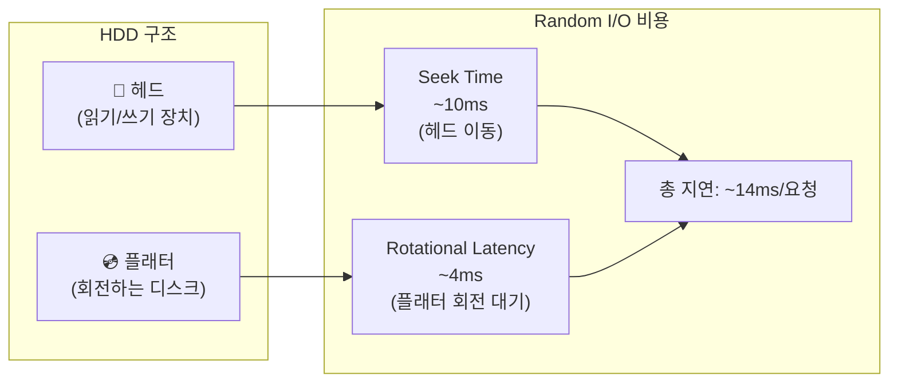

**HDD**: Random I/O는 **Seek Time(~10ms) + Rotational Latency(~4ms) = ~14ms** 발생

**SSD**: Random I/O는 FTL(Flash Translation Layer) 매핑 조회 오버헤드 발생, Sequential은 OS Prefetch 최적화 적용

#### Kafka가 Sequential I/O를 선택한 이유

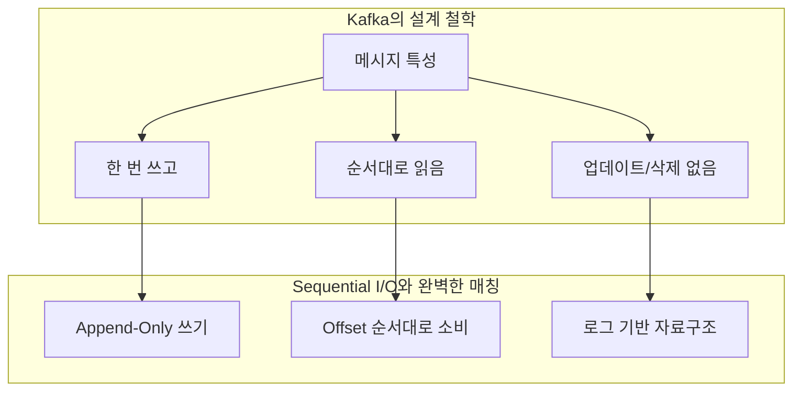

- 메시지는 한 번 쓰고 순서대로 읽음
- 업데이트나 삭제가 없는 Append-Only 구조
- Consumer도 Offset 순서대로 소비

#### Kafka vs DB: 왜 I/O 패턴이 다른가?

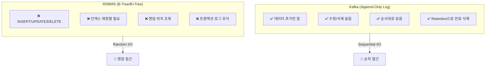

**Kafka가 Append-Only를 사용할 수 있는 이유**:

| 특성 | Kafka | RDBMS |
|------|-------|-------|
| **데이터 모델** | 이벤트 스트림 (불변) | 상태 저장 (가변) |
| **주요 연산** | Append (추가) | CRUD (생성/조회/수정/삭제) |
| **데이터 수명** | Retention 정책으로 자동 삭제 | 명시적 DELETE |
| **조회 패턴** | Offset 순서대로 | WHERE 조건으로 랜덤 |
| **인덱스** | Offset만 (단순) | 다중 컬럼 인덱스 |

**RDBMS가 Random I/O를 사용해야 하는 이유**:

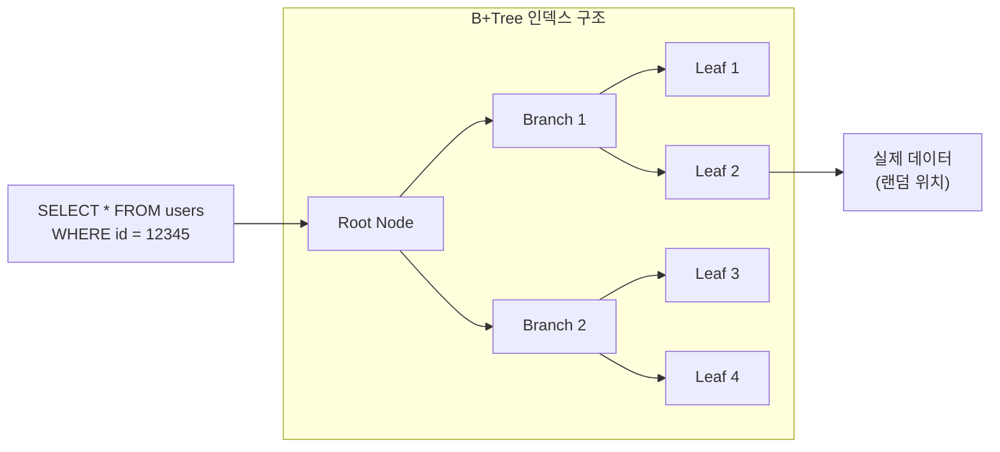

1. **B-Tree/B+Tree 인덱스**: 트리 탐색 시 여러 노드를 랜덤하게 접근
2. **UPDATE 연산**: 기존 데이터 위치를 찾아서 수정 (랜덤 접근)
3. **DELETE 연산**: 기존 데이터 위치를 찾아서 삭제 (랜덤 접근)
4. **WHERE 조건**: 조건에 맞는 데이터를 인덱스로 탐색 (랜덤 접근)
5. **트랜잭션**: 여러 테이블/행을 동시에 수정 가능

**핵심 차이점 요약**:

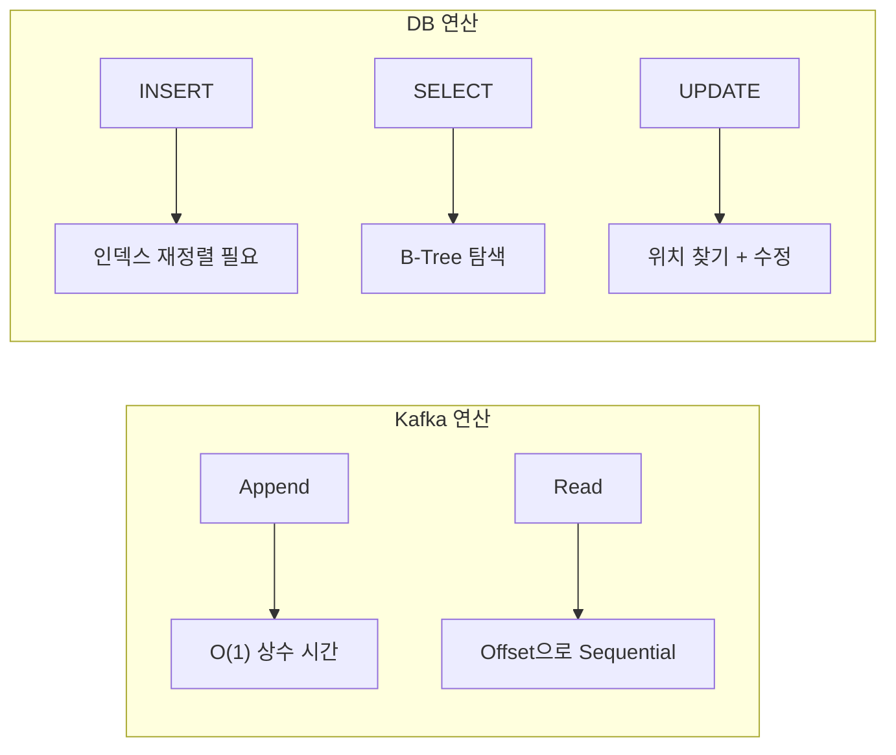

> **💡 면접 포인트**: "Kafka는 이벤트 스트림이라는 불변 데이터 모델을 사용하기 때문에 Append-Only가 가능합니다. 반면 RDBMS는 데이터 수정/삭제가 핵심 기능이므로 B-Tree 인덱스와 Random I/O가 필수입니다."

> **💡 실습 코드**: `poc/kafka-messaging/05-performance/go/sequential-io/` 에서 Sequential vs Random I/O 성능 차이를 직접 측정할 수 있습니다.

### 2.2 Zero-Copy (sendfile)

Zero-Copy는 **데이터를 User Space로 복사하지 않고 Kernel Space 내에서 직접 네트워크로 전송하는 기술**입니다. 이름 그대로 "복사를 없앤다(Zero Copy)"는 의미인데, 정확히는 User Space 복사를 제거한다는 뜻입니다.

#### 왜 일반 애플리케이션은 User Space 복사가 필요한가?

일반적인 웹 서버나 애플리케이션 서버가 파일을 클라이언트에게 전송할 때를 생각해봅시다. 서버는 파일을 읽어서 **가공**한 후 전송합니다.

```
1. 파일에서 HTML 템플릿 읽기
2. 동적 데이터 삽입 (사용자 이름, 날짜 등)
3. 가공된 결과를 클라이언트에게 전송
```

이 과정에서 애플리케이션은 데이터를 **User Space로 가져와서 조작**해야 합니다. 데이터베이스 쿼리 결과를 JSON으로 변환하거나, 이미지를 리사이징하거나, 로그를 파싱하는 등 대부분의 서버는 데이터를 "처리"합니다. 그래서 `read()` 시스템 콜로 Kernel Buffer에서 User Buffer로 데이터를 복사하고, 처리 후 `write()` 시스템 콜로 다시 Kernel의 Socket Buffer로 복사합니다.

#### Kafka는 왜 Zero-Copy가 가능한가?

Kafka Broker는 메시지를 **가공하지 않습니다**. Producer가 보낸 메시지를 그대로 저장하고, Consumer가 요청하면 그대로 전송합니다. 중간에 데이터 변환, 필터링, 집계 같은 처리가 없습니다.

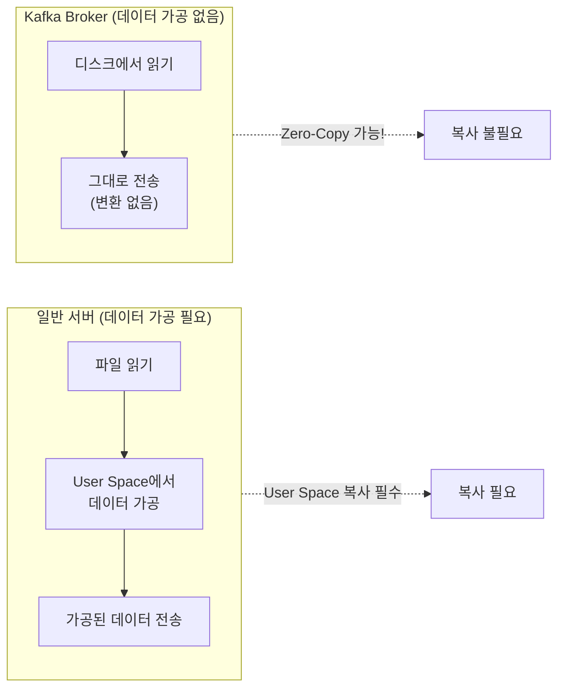

이것이 Kafka가 Zero-Copy를 사용할 수 있는 핵심 이유입니다:
1. **Broker는 메시지 내용을 해석하지 않음** - 바이트 배열로 취급
2. **Broker는 메시지를 변환하지 않음** - 그대로 저장하고 그대로 전송
3. **압축도 해제하지 않음** - Producer가 압축하면 Consumer가 해제

#### 일반 전송 vs Zero-Copy 데이터 흐름

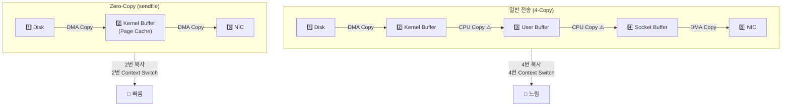

#### 일반 전송의 상세 과정 (4-Copy)

일반적인 파일 전송에서는 다음과 같은 과정이 발생합니다:

**1단계: 디스크 → Kernel Buffer (DMA Copy)**
```c
read(file_fd, user_buffer, size);
```
애플리케이션이 `read()` 시스템 콜을 호출하면, DMA(Direct Memory Access) 컨트롤러가 디스크에서 데이터를 읽어 Kernel Buffer에 저장합니다. 이 과정에서 CPU는 개입하지 않습니다.

**2단계: Kernel Buffer → User Buffer (CPU Copy) ⚠️**
`read()` 시스템 콜이 완료되면, 커널은 데이터를 User Space의 버퍼로 복사합니다. **이 복사는 CPU가 직접 수행**하며, 여기서 첫 번째 Context Switch가 발생합니다 (Kernel Mode → User Mode).

**3단계: User Buffer → Socket Buffer (CPU Copy) ⚠️**
```c
write(socket_fd, user_buffer, size);
```
애플리케이션이 `write()` 시스템 콜을 호출하면, User Buffer의 데이터가 Kernel의 Socket Buffer로 복사됩니다. **이것도 CPU가 직접 수행**하며, 두 번째 Context Switch가 발생합니다 (User Mode → Kernel Mode).

**4단계: Socket Buffer → NIC (DMA Copy)**
마지막으로 DMA가 Socket Buffer에서 네트워크 카드(NIC)로 데이터를 전송합니다.

**문제점**: 2단계와 3단계에서 CPU가 데이터를 복사합니다. 대용량 데이터 전송 시 CPU 사용률이 높아지고, Context Switch 오버헤드가 발생합니다.

#### Zero-Copy의 상세 과정 (sendfile)

Linux의 `sendfile()` 시스템 콜을 사용하면 User Space를 완전히 우회합니다:

```c
sendfile(socket_fd, file_fd, offset, size);
```

**1단계: 디스크 → Kernel Buffer/Page Cache (DMA Copy)**
DMA가 디스크에서 데이터를 읽어 Page Cache에 저장합니다.

**2단계: Page Cache → NIC (DMA Copy)**
커널이 Page Cache의 데이터 위치 정보(descriptor)만 Socket Buffer에 전달하고, DMA가 Page Cache에서 직접 NIC로 데이터를 전송합니다.

**핵심**: User Space로의 복사가 완전히 사라집니다. CPU는 데이터 복사에 전혀 관여하지 않고, 시스템 콜도 1번만 발생합니다.

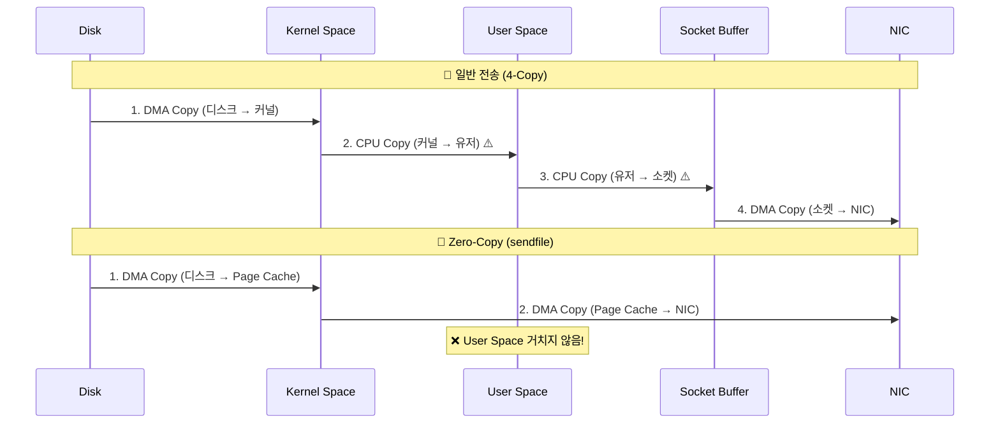

#### 성능 차이 비교

| 항목 | 일반 전송 | Zero-Copy | 개선 |
|------|-----------|-----------|------|
| **데이터 복사** | 4회 | 2회 | 50% 감소 |
| **CPU 복사** | 2회 | 0회 | **100% 제거** |
| **Context Switch** | 4회 | 2회 | 50% 감소 |
| **CPU 사용률** | 높음 | 낮음 | 대폭 감소 |
| **메모리 대역폭** | 2배 사용 | 1배 사용 | 50% 절약 |

실제 벤치마크에서 Zero-Copy는 일반 전송 대비 **2~4배 높은 처리량**을 보여줍니다. 특히 대용량 파일 전송이나 고빈도 네트워크 I/O에서 효과가 극대화됩니다.

#### 왜 Broker가 압축을 해제하지 않는가?

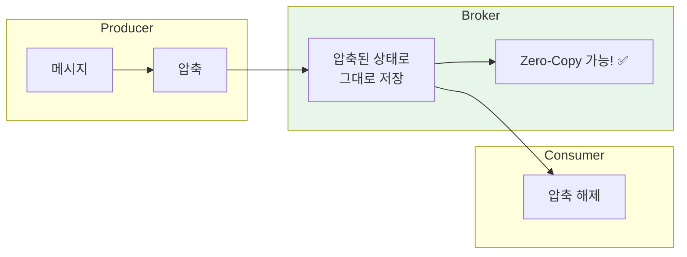

Broker가 압축을 해제하면 데이터를 User Space로 가져와서 처리해야 합니다. 그 순간 Zero-Copy를 사용할 수 없게 됩니다.

> **Broker가 압축 해제 안 하는 이유**:
> 1. **Zero-Copy 사용 가능** - 데이터 변환 없이 직접 전송
> 2. **CPU 절약** - 압축/해제는 CPU 집약적 작업
> 3. **저장 공간 절약** - 압축된 상태로 디스크에 저장
> 4. **네트워크 대역폭 절약** - 압축된 상태로 Consumer에게 전송

#### Java에서의 Zero-Copy 구현

Java에서는 `FileChannel.transferTo()` 메서드가 내부적으로 `sendfile()` 시스템 콜을 사용합니다:

```java
// Kafka의 실제 구현 (간략화)
FileChannel fileChannel = new FileInputStream(logFile).getChannel();
SocketChannel socketChannel = clientSocket.getChannel();

// Zero-Copy 전송!
fileChannel.transferTo(position, count, socketChannel);
```

이 한 줄의 코드가 내부적으로 `sendfile()` 시스템 콜을 호출하여 User Space 복사 없이 파일을 네트워크로 직접 전송합니다.

> **💡 면접 포인트**: "Zero-Copy가 가능한 이유는 Kafka Broker가 메시지를 가공하지 않기 때문입니다. 일반 웹 서버는 데이터를 읽어서 처리(템플릿 렌더링, JSON 변환 등)해야 하므로 User Space로 복사가 필수입니다. 하지만 Kafka는 Producer가 보낸 바이트를 그대로 저장하고 그대로 전송하므로, sendfile() 시스템 콜로 Kernel Space 내에서 직접 네트워크 전송이 가능합니다."

> **💡 실습 코드**: `poc/kafka-messaging/05-performance/go/zero-copy/` 에서 Traditional Copy vs Zero-Copy 성능 차이를 직접 측정할 수 있습니다.

### 2.3 Page Cache

Page Cache는 **운영체제가 디스크 I/O 성능을 높이기 위해 RAM에 디스크 데이터를 캐싱하는 영역**입니다. 애플리케이션이 아닌 OS 커널이 관리하며, 사용하지 않는 메모리를 자동으로 캐시로 활용합니다.

Kafka는 자체 캐시를 구현하지 않고 이 OS의 Page Cache를 적극 활용합니다. 이것이 Kafka 성능의 세 번째 비밀입니다.

#### 왜 일반 애플리케이션은 자체 캐시를 사용하는가?

대부분의 데이터베이스나 애플리케이션은 자체 캐시 레이어를 구현합니다:

```
[MySQL] InnoDB Buffer Pool - 자체 메모리 관리
[Redis] 메모리 데이터 저장소 - 직접 메모리 할당
[Elasticsearch] JVM Heap 기반 캐시 - Lucene 세그먼트 캐싱
[일반 Java 앱] HashMap, ConcurrentHashMap 등으로 캐싱
```

이들이 자체 캐시를 사용하는 이유는 **데이터 구조와 접근 패턴을 애플리케이션이 가장 잘 알기 때문**입니다. MySQL은 B-Tree 노드를 캐싱하고, Elasticsearch는 Lucene 세그먼트를 캐싱합니다. 각자의 자료구조에 최적화된 캐시 전략이 필요합니다.

#### Kafka가 Page Cache를 사용할 수 있는 이유

Kafka의 데이터 접근 패턴은 특별합니다:

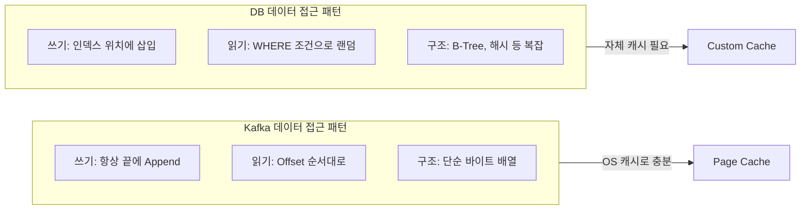

**Kafka가 Page Cache를 활용할 수 있는 조건**:

1. **단순한 데이터 구조**: 메시지는 바이트 배열의 연속. 복잡한 인덱스 구조 없음
2. **예측 가능한 접근 패턴**: 순차 쓰기 + 순차 읽기. OS의 Read-ahead가 효과적
3. **변환 없는 저장**: Producer가 보낸 그대로 저장. 역직렬화나 파싱 불필요
4. **시간 기반 소비**: 대부분의 Consumer는 최신 데이터를 읽음. 최근 데이터가 캐시에 있을 확률 높음

이 조건들이 맞아떨어지면 **OS가 제공하는 범용 캐시로도 충분**합니다. 오히려 자체 캐시를 구현하면 "캐시의 캐시"가 되어 메모리 낭비가 발생합니다.

#### JVM Heap 캐시 vs Page Cache

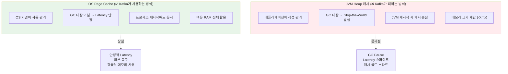

왜 JVM Heap 캐시가 문제인지 구체적으로 살펴보겠습니다.

**문제 1: GC로 인한 Stop-the-World**

JVM Heap에 데이터를 캐싱하면, 그 데이터는 GC의 대상이 됩니다. 특히 대용량 캐시는 Old Generation에 쌓이고, Full GC 시 수 초간 애플리케이션이 멈출 수 있습니다.

```
[일반적인 Java 캐시 문제]
- Heap 10GB 할당
- 캐시 데이터 8GB 사용
- Full GC 발생 → 2~5초 Stop-the-World
- 그 동안 모든 Consumer 요청 지연
```

Kafka가 초당 수백만 메시지를 처리하는데, GC로 인해 2초간 멈추면 그 사이 Producer 요청이 타임아웃되고 Consumer Lag가 급증합니다.

**문제 2: 캐시 콜드 스타트**

JVM Heap 캐시는 프로세스 재시작 시 완전히 비워집니다. Kafka Broker를 재시작하면 캐시가 비어있어 모든 요청이 디스크로 가게 됩니다. 이를 "콜드 스타트" 문제라고 합니다.

```
[JVM 재시작 후]
- 캐시 0% → 모든 읽기가 디스크 I/O
- Throughput 급격히 감소
- 캐시가 다시 따뜻해지는 데 시간 필요 (Warm-up)
```

**Page Cache의 해결책**

Page Cache는 OS 영역이므로 JVM GC와 무관합니다. 또한 Kafka 프로세스를 재시작해도 Page Cache는 그대로 유지됩니다.

```
[Kafka 재시작 후]
- Page Cache 100% 유지
- 즉시 고성능 서빙 가능
- Warm-up 불필요
```

#### Page Cache의 동작 원리

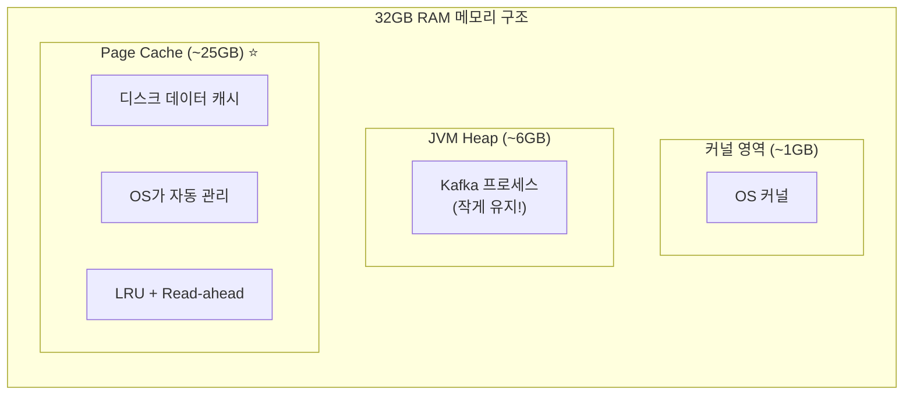

Kafka는 JVM Heap을 **의도적으로 작게 유지**합니다 (보통 6~8GB). 나머지 메모리는 OS가 Page Cache로 활용합니다. 32GB RAM 서버에서 25GB 이상이 Page Cache로 사용될 수 있습니다.

#### Kafka에서 Page Cache가 활용되는 흐름

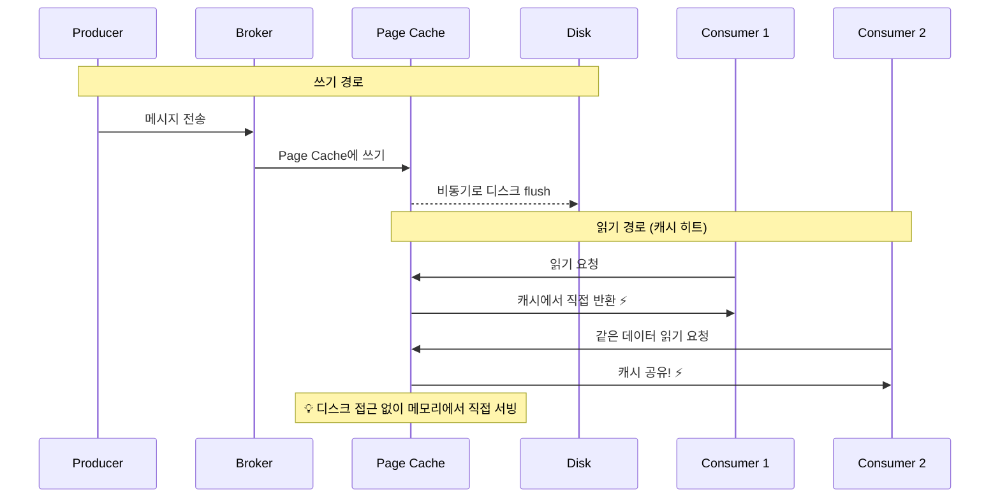

**쓰기 경로 (Producer → Broker)**

1. Producer가 메시지를 보내면 Broker는 `write()` 시스템 콜을 호출
2. 데이터는 먼저 **Page Cache에 저장** (메모리 쓰기, 매우 빠름)
3. OS가 **비동기로 디스크에 flush** (background writeback)
4. Producer는 Page Cache 쓰기 완료 시점에 ACK 받음 (디스크 쓰기 기다리지 않음)

**읽기 경로 (Broker → Consumer)**

1. Consumer가 데이터를 요청하면 Broker는 `read()` 시스템 콜을 호출
2. OS가 먼저 Page Cache 확인
3. **캐시 히트**: 메모리에서 직접 반환 (디스크 접근 없음, 매우 빠름)
4. **캐시 미스**: 디스크에서 읽어 Page Cache에 로드 후 반환

**실시간 스트리밍의 이점**

Kafka의 일반적인 사용 패턴에서 Producer가 쓴 데이터를 Consumer가 거의 실시간으로 읽습니다. 이 경우:

```
Producer 쓰기 → Page Cache에 저장
    ↓ (수 밀리초 후)
Consumer 읽기 → Page Cache에서 히트!
```

최신 데이터는 항상 Page Cache에 있으므로 **디스크 I/O 없이 메모리 속도로 처리**됩니다.

#### Page Cache를 활용하는 4가지 장점

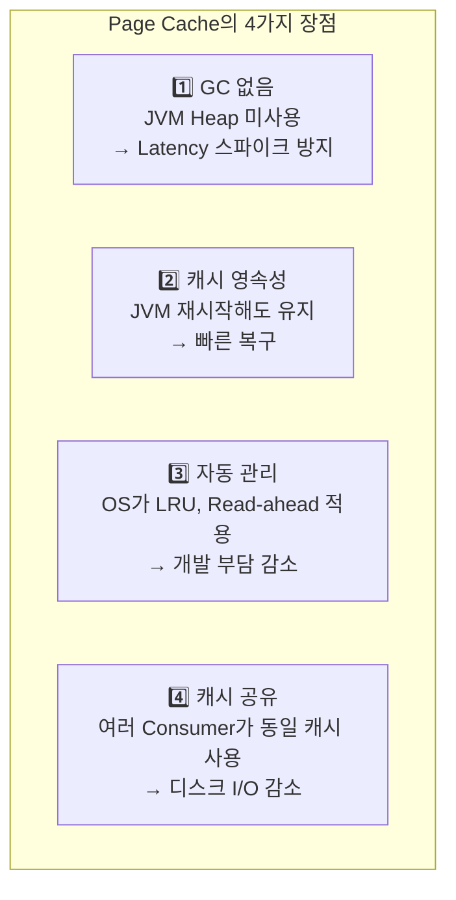

**1. GC가 발생하지 않음 → Latency 안정**

Page Cache는 OS 커널 영역에 있으므로 JVM GC 대상이 아닙니다. 수십 GB의 데이터를 캐싱해도 GC 시간이 늘어나지 않습니다.

```
[JVM Heap 캐시]
Heap 사용량 증가 → GC 빈도 증가 → Latency 스파이크

[Page Cache]
캐시 크기 증가 → GC와 무관 → Latency 안정
```

**2. 프로세스 재시작해도 캐시 유지 → 빠른 복구**

Kafka Broker를 배포하거나 재시작해도 Page Cache는 유지됩니다. 이것은 운영 관점에서 큰 장점입니다.

```
[배포 시나리오]
1. Kafka Broker 종료
2. 새 버전 배포
3. Kafka Broker 시작
→ Page Cache 그대로! 즉시 고성능 서빙
```

**3. OS가 자동 관리 → 개발 부담 감소**

OS는 Page Cache를 위해 여러 최적화를 자동으로 수행합니다:

- **LRU (Least Recently Used)**: 오래된 데이터 자동 제거
- **Read-ahead (Prefetch)**: 순차 읽기 감지 시 다음 데이터 미리 로드
- **Write-back**: 쓰기 데이터를 모아서 배치로 디스크 flush
- **Memory Pressure 대응**: 메모리 부족 시 캐시 자동 축소

개발자가 캐시 만료, 크기 관리, 동시성 처리 등을 구현할 필요가 없습니다.

**4. 여러 Consumer가 캐시 공유 → I/O 감소**

Page Cache는 **단일 서버(브로커) 내의 시스템 전역 자원**입니다. 같은 브로커에 연결된 여러 Consumer가 동일한 Page Cache를 공유합니다.

> **⚠️ 주의**: Page Cache는 OS 레벨 자원이므로 **서로 다른 브로커(서버) 간에는 공유되지 않습니다**. 각 브로커는 자신만의 독립적인 Page Cache를 가집니다.

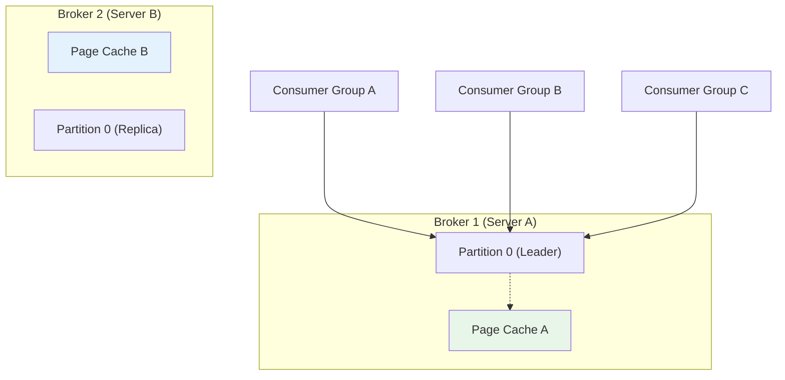

**캐시 공유가 가능한 이유**:

Consumer는 **파티션의 Leader Broker**에 연결합니다. 같은 파티션을 읽는 여러 Consumer Group은 모두 같은 브로커에 연결되므로, 해당 브로커의 Page Cache를 자연스럽게 공유합니다.

```
[시나리오: Partition 0의 Leader가 Broker 1에 있는 경우]

1. Consumer Group A → Broker 1에 연결 → Partition 0 읽기 → Page Cache 로드 (디스크 1회)
2. Consumer Group B → Broker 1에 연결 → Partition 0 읽기 → Page Cache 히트! (디스크 0회)
3. Consumer Group C → Broker 1에 연결 → Partition 0 읽기 → Page Cache 히트! (디스크 0회)

→ 세 Consumer Group 모두 같은 물리 서버(Broker 1)에 연결
→ 같은 OS의 Page Cache를 공유
→ 디스크 I/O 1회로 3개 Consumer Group 서빙!
```

**Replica와 Page Cache**:

Partition 0의 Replica가 Broker 2에도 있지만, 일반적으로 Consumer는 Leader에서만 읽습니다. 따라서 Broker 2의 Page Cache는 이 시나리오에서 사용되지 않습니다. (KIP-392 이후 Follower 읽기가 가능해졌지만, 기본 동작은 Leader 읽기입니다.)

```
[Replica의 Page Cache]
- Broker 1 (Leader): Consumer들이 읽음 → Page Cache 활발히 사용
- Broker 2 (Replica): 복제만 받음 → Page Cache에 데이터는 있지만 Consumer가 안 읽음
```

#### Kafka JVM Heap 설정 권장사항

Kafka는 JVM Heap을 크게 잡지 않는 것이 좋습니다:

| 서버 RAM | 권장 JVM Heap | Page Cache 예상 |
|----------|---------------|-----------------|
| 16GB | 4~6GB | ~10GB |
| 32GB | 6~8GB | ~24GB |
| 64GB | 8~12GB | ~50GB |

```bash
# Kafka 시작 스크립트에서 Heap 설정
export KAFKA_HEAP_OPTS="-Xmx6G -Xms6G"
```

Heap을 너무 크게 잡으면:
- Page Cache 공간이 줄어듦 → 캐시 히트율 감소
- GC 시간이 길어짐 → Latency 증가

#### Page Cache 확인 방법

**Linux에서 확인**

```bash
# Page Cache 사용량 확인
$ free -h
              total        used        free      shared  buff/cache   available
Mem:           31Gi        6Gi        5Gi       256Mi        20Gi        24Gi
                                                             ^^^^
                                                        Page Cache 포함!

# 상세 캐시 정보
$ cat /proc/meminfo | grep -E "^(Cached|Buffers|Active|Inactive)"
Cached:         20971520 kB    # 약 20GB가 Page Cache
Buffers:          524288 kB
Active:         15728640 kB
Inactive:       10485760 kB

# 특정 파일이 Page Cache에 있는지 확인 (vmtouch 도구)
$ vmtouch /var/kafka-logs/my-topic-0/00000000000000000000.log
           Files: 1
     Directories: 0
  Resident Pages: 262144/262144  100%    # 100% 캐시됨!
         Elapsed: 0.023 seconds
```

**macOS에서 확인**

> ⚠️ `free -h`와 `/proc/meminfo`는 Linux 전용입니다. macOS에서는 다른 명령어를 사용합니다.

```bash
# 메모리 통계 확인 (vm_stat)
$ vm_stat
Mach Virtual Memory Statistics: (page size of 16384 bytes)
Pages free:                               12345.
Pages active:                            234567.
Pages inactive:                          123456.
Pages speculative:                        12345.
Pages wired down:                         56789.
File-backed pages:                       345678.  # ← Page Cache와 유사한 개념

# 읽기 쉬운 형태로 변환 (GB 단위)
$ vm_stat | perl -ne '/page size of (\d+)/ and $size=$1;
  /Pages free:\s+(\d+)/ and printf("Free: %.2f GB\n", $1*$size/1073741824);
  /File-backed pages:\s+(\d+)/ and printf("File Cache: %.2f GB\n", $1*$size/1073741824);'

# top 명령어로 메모리 요약 확인
$ top -l 1 -s 0 | grep PhysMem
PhysMem: 16G used (2G wired), 200M unused.

# vmtouch 설치 및 사용 (macOS에서도 동작)
$ brew install vmtouch
$ vmtouch /path/to/kafka-logs/my-topic-0/00000000000000000000.log
           Files: 1
     Directories: 0
  Resident Pages: 262144/262144  100%    # 100% 캐시됨!
         Elapsed: 0.023 seconds
```

| 명령어 | Linux | macOS | 설명 |
|--------|:-----:|:-----:|------|
| `free -h` | ✅ | ❌ | 메모리 사용량 요약 |
| `/proc/meminfo` | ✅ | ❌ | 상세 메모리 정보 |
| `vm_stat` | ❌ | ✅ | 가상 메모리 통계 |
| `vmtouch` | ✅ | ✅ | 파일별 캐시 상태 (별도 설치) |

> **💡 면접 포인트**: "Kafka가 Page Cache를 사용하는 이유는 두 가지입니다. 첫째, JVM Heap에 캐싱하면 GC로 인한 Stop-the-World가 발생하여 Latency 스파이크가 생깁니다. Page Cache는 OS 영역이므로 GC 대상이 아닙니다. 둘째, Kafka의 순차 읽기/쓰기 패턴은 OS의 Read-ahead 최적화와 완벽하게 맞아떨어집니다. 자체 캐시를 구현하면 '캐시의 캐시'가 되어 오히려 비효율적입니다."

> **💡 실습 코드**: `poc/kafka-messaging/05-performance/go/page-cache/` 에서 Page Cache 효과를 직접 측정할 수 있습니다.

---

## 3. 파티션 전략

### 3.1 파티션의 역할

- **수평적 확장**: 브로커 간 부하 분산
- **병렬 처리**: Consumer Group 내 병렬 소비
- **최대 병렬성 = 파티션 수**

### 3.2 파티션 수 결정

```
Consumer 1개: 100ms/메시지 → 초당 10개 처리
피크 시 100개/초 필요 → 최소 10개 파티션
```

| 고려사항 | 설명 |
|----------|------|
| **초기값** | 12개 권장 (쉽게 나눌 수 있는 수) |
| **최대값 (ZooKeeper)** | 브로커당 4,000개, 클러스터당 200,000개 |
| **최대값 (KRaft)** | 훨씬 더 큰 클러스터 지원 |

### 3.3 파티션 수 변경의 위험성

**파티션 수는 증가만 가능하며, 감소는 불가능합니다.**

**Key 기반 파티셔닝 시 순서 보장이 깨짐**:
- 변경 전: `hash(key) % 2` → Partition 1
- 변경 후: `hash(key) % 3` → Partition 2 (다른 파티션!)

**마이그레이션 전략**:

| 시나리오 | 해결 방법 |
|----------|-----------|
| 즉시 처리, 다운타임 허용 | 유지보수 창에서 토픽 재생성 |
| 데이터 단기 보관 | 새 토픽 생성 후 점진적 마이그레이션 |
| 데이터 영구 보관 | Kafka Streams로 데이터 복사 후 오프셋 변환 |

> **팁**: 멱등적 소비(Event ID 포함)로 중복 처리 방지 가능

---

## 4. Producer 튜닝

### 4.1 배치 처리 설정

| 설정 | 기본값 | 권장값 | 효과 |
|------|--------|--------|------|
| `batch.size` | 16KB | **최대 1MB** | 네트워크 요청 수 감소 |
| `linger.ms` | 0ms | **10ms** | 배치 채울 시간 확보 |

**배치 크기 증가 효과**:
- ✅ 네트워크 요청 수 감소
- ✅ 처리량 증가
- ⚠️ 지연시간 증가 가능

### 4.2 압축

| 알고리즘 | 압축률 | CPU 오버헤드 | 권장 |
|----------|--------|--------------|------|
| `lz4` | 중간 | 매우 낮음 | ✅ **권장** |
| `zstd` | 높음 | 중간 | ✅ **권장** |
| `gzip` | 최고 | 높음 | 네트워크 제한 시 |
| `snappy` | 중간 | 낮음 | 범용 |
| `none` | 없음 | 없음 | 이미 압축된 데이터 |

> **핵심**: 압축은 Producer→Broker→Consumer 전 구간에서 유지되어 네트워크, 디스크 모두 절약

### 4.3 Producer 설정 요약

| 설정 | 성능 ↑ | 신뢰성 ↑ | 권장 |
|------|--------|----------|------|
| `acks=0` | ✅ | ❌ | 센서 데이터 |
| `acks=all` | ❌ | ✅ | 중요 데이터 |
| `enable.idempotence=true` | 약간 ↓ | ✅ | **항상 사용** |
| `batch.size=1MB` | ✅ | - | **권장** |
| `linger.ms=10` | ✅ | - | **권장** |
| `compression.type=zstd/lz4` | ✅ | - | **권장** |

### 4.4 성능 테스트 결과

```bash
# 기본 설정
kafka-producer-perf-test.sh --topic test --num-records 1000000 ...
# 결과: 117 MB/s, 165ms 지연

# 최적화 설정 (batch.size=100000, linger.ms=100)
# 결과: 437 MB/s, 65ms 지연 → 3.7배 향상!
```

---

## 5. Consumer 튜닝

### 5.1 Long Polling 방식

Consumer가 Broker에서 데이터를 가져오는 방식은 **Long Polling**입니다. 일반적인 HTTP 요청처럼 즉시 응답하지 않고, 데이터가 준비될 때까지 연결을 유지합니다.

#### Short Polling vs Long Polling

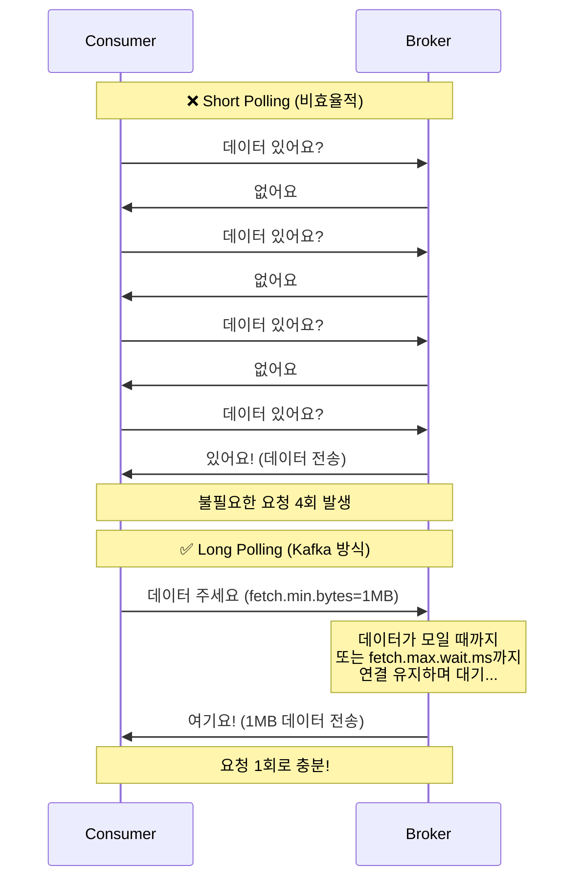

#### Long Polling 동작 원리

Consumer가 Fetch 요청을 보내면 Broker는 **즉시 응답하지 않습니다**:

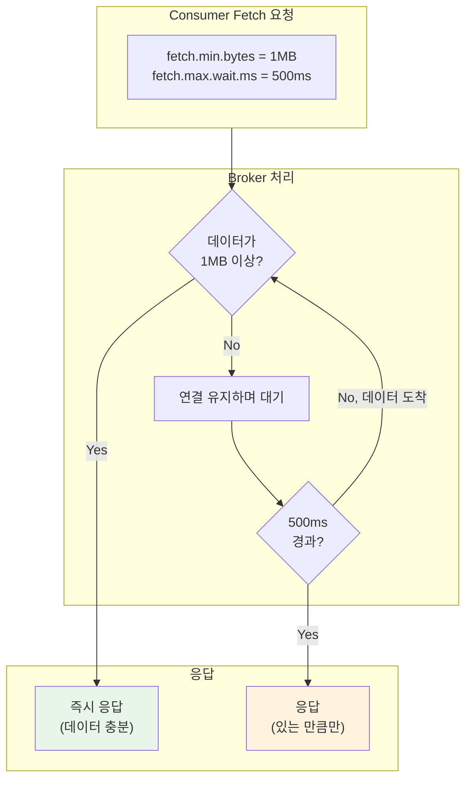

**두 조건은 OR 관계**입니다:
- `fetch.min.bytes` 만큼 데이터가 모이면 → **즉시 응답**
- 데이터가 부족해도 `fetch.max.wait.ms` 경과하면 → **있는 만큼 응답**

#### 왜 Long Polling이 효율적인가?

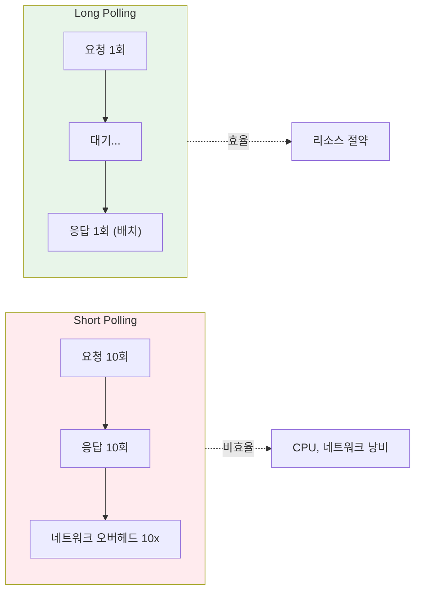

| 방식 | 요청 횟수 | 네트워크 오버헤드 | CPU 사용 | Kafka 사용 |
|------|-----------|-------------------|----------|------------|
| Short Polling | 많음 | 높음 | 높음 | ❌ |
| Long Polling | 적음 | 낮음 | 낮음 | ✅ |

#### Long Polling 설정

| 설정 | 기본값 | 효과 |
|------|--------|------|
| `fetch.min.bytes` | 1 | 증가 시 처리량 ↑, 지연 ↑ |
| `fetch.max.wait.ms` | 500ms | 증가 시 처리량 ↑, 지연 ↑ |

```
[fetch.min.bytes 튜닝 예시]
- 1 (기본값): 데이터 1바이트라도 있으면 즉시 응답 → 낮은 Latency
- 1MB: 1MB 모일 때까지 대기 → 높은 Throughput, 높은 Latency
```

> **⚠️ 경고**: 두 값을 0으로 설정하면 Broker가 즉시 빈 응답을 보내고, Consumer가 다시 요청하는 무한 루프가 발생하여 **브로커 과부하**가 생깁니다.

> **💡 면접 포인트**: "Kafka Consumer는 Long Polling 방식을 사용합니다. Short Polling처럼 '데이터 있어요?'를 반복하지 않고, fetch.min.bytes만큼 데이터가 모이거나 fetch.max.wait.ms가 경과할 때까지 연결을 유지하며 대기합니다. 이 방식으로 네트워크 요청 횟수를 줄이고 배치 처리 효율을 높입니다."

### 5.2 session.timeout.ms vs max.poll.interval.ms

| 설정 | 기본값 | 목적 | 비유 |
|------|--------|------|------|
| `session.timeout.ms` | 45초 | 프로세스/네트워크 죽음 감지 | **"숨 쉬고 있나?"** |
| `max.poll.interval.ms` | 5분 | 처리 지연 감지 | **"일하고 있나?"** |

**시나리오 1: Consumer 프로세스가 죽거나 네트워크 장애**

Heartbeat가 안 옵니다. Heartbeat는 Consumer가 백그라운드 스레드로 주기적으로 보내는 "나 살아있어요" 신호입니다. `session.timeout.ms`(기본 45초) 동안 Heartbeat가 안 오면 Broker는 해당 Consumer가 죽었다고 판단하고 리밸런싱을 트리거합니다.

**시나리오 2: Consumer는 살아있지만 처리가 느림**

예를 들어 메시지 하나 처리하는 데 3분이 걸린다고 합시다. Heartbeat는 백그라운드에서 계속 보내므로 `session.timeout.ms`는 통과합니다. 하지만 `poll()` 호출 간격이 `max.poll.interval.ms`(기본 5분)를 넘으면, Broker는 "이 Consumer가 일을 못하고 있다"고 판단하고 리밸런싱을 트리거합니다.

### 5.3 Consumer Lag 해결

**Consumer Lag = Latest Offset - Consumer Offset** (처리하지 못한 메시지 수)

Lag가 계속 증가하면 Consumer가 생산 속도를 따라가지 못하는 것입니다.

**해결책**:

1. **Consumer 수 증가** - 파티션 수 이하까지만 효과. 파티션보다 Consumer가 많으면 남는 Consumer는 놀게 됩니다.

2. **파티션 수 증가** - 더 많은 Consumer가 병렬로 처리 가능. 단, 한 번 늘린 파티션은 줄일 수 없으므로 신중해야 합니다.

3. **처리 로직 최적화** - 배치 처리로 I/O 횟수를 줄이거나, 비동기 처리로 대기 시간을 줄일 수 있습니다.

### 5.4 Consumer Group 확장

**병렬 처리 핵심**:
- Consumer 수 ≤ 파티션 수
- 파티션 수 = 최대 병렬성
- Consumer Group으로 자동 파티션 할당

---

## 6. 브로커 최적화

### 6.1 주요 브로커 설정

| 설정 | 기본값 | 조정 시나리오 |
|------|--------|---------------|
| `num.network.threads` | 3 | TLS 사용 시 6으로 증가 |
| `num.io.threads` | 8 | 디스크 수에 맞춤 |
| `queued.max.requests` | 500 | 많은 클라이언트 연결 시 증가 |
| File Descriptors | OS 기본 | 증가 필수 (파티션당 파일 오픈) |

### 6.2 브로커 수 결정

**계산 예시**:
```
- 일일 데이터: 1TB
- 보관 기간: 7일
- 필요 용량: 7TB
- 복제 팩터: 3
- 총 필요 용량: 21TB
- 브로커당 디스크: 2TB
- 필요 브로커 수: 최소 11개
```

> **팁**: 소규모 설치는 3개 브로커로 시작, 부하에 따라 확장

---

## 7. 면접 예상 질문 및 모범 답변

### Q1. Kafka가 빠른 이유는?

> 세 가지 핵심 요소가 있습니다.
>
> **첫째, Sequential I/O입니다.** Append-Only 로그 구조로 디스크에 순차적으로만 씁니다. Random I/O 대비 10~100배 빠른 성능을 냅니다.
>
> **둘째, Zero-Copy입니다.** sendfile() 시스템 콜을 사용해서 커널 버퍼에서 네트워크 카드로 직접 데이터를 전송합니다. 사용자 공간 복사를 생략해서 복사 횟수가 4회에서 2회로 줄어듭니다.
>
> **셋째, Page Cache입니다.** 데이터를 JVM Heap이 아닌 OS의 Page Cache에 캐싱합니다. JVM GC가 발생하지 않고, JVM을 재시작해도 캐시가 유지됩니다.

### Q2. session.timeout.ms와 max.poll.interval.ms의 차이는?

> 두 설정은 서로 다른 장애 상황을 감지합니다.
>
> **session.timeout.ms (기본 45초)**는 "숨 쉬고 있나?"를 확인합니다. Heartbeat로 체크하며, 프로세스 죽음이나 네트워크 장애를 감지합니다.
>
> **max.poll.interval.ms (기본 5분)**는 "일하고 있나?"를 확인합니다. poll() 호출 간격으로 체크하며, 프로세스는 살아있지만 처리가 느린 상황을 감지합니다.
>
> 예를 들어 메시지 처리에 3분이 걸리면, Heartbeat는 정상이라 session.timeout.ms는 통과하지만, poll() 간격이 길어져 max.poll.interval.ms에 걸릴 수 있습니다.

### Q3. Consumer Lag가 계속 증가할 때 어떻게 해결하나요?

> 세 가지 해결책이 있습니다.
>
> **첫째, Consumer 수를 늘립니다.** 단, 파티션 수 이하까지만 효과가 있습니다. 파티션보다 Consumer가 많으면 남는 Consumer는 놀게 됩니다.
>
> **둘째, 파티션 수를 늘립니다.** 더 많은 Consumer가 병렬로 처리할 수 있습니다. 단, 한 번 늘린 파티션은 줄일 수 없으므로 신중해야 합니다.
>
> **셋째, 처리 로직을 최적화합니다.** 배치 처리로 I/O 횟수를 줄이거나, 비동기 처리로 대기 시간을 줄일 수 있습니다.
>
> 우선 병목 지점이 Kafka인지 외부 시스템인지 파악해야 합니다. 대부분 병목은 Consumer 처리 로직에 있습니다.

### Q4. 파티션 수를 변경하면 어떤 문제가 발생하나요?

> 파티션 수는 증가만 가능하고, 감소는 불가능합니다.
>
> **Key 기반 파티셔닝을 사용할 경우 순서 보장이 깨집니다.** 예를 들어, key="order-123"이 `hash(key) % 2 = 1`로 Partition 1에 있다가, 파티션을 3개로 늘리면 `hash(key) % 3 = 2`로 Partition 2로 이동합니다.
>
> 해결책으로는 새 토픽 생성 후 점진적 마이그레이션이나, 멱등적 소비(Event ID 포함)로 중복 처리를 방지하는 방법이 있습니다.

### Q5. Producer의 batch.size와 linger.ms는 어떤 관계인가요?

> 두 설정은 배치 전송 시점을 결정합니다.
>
> **batch.size**는 배치의 최대 크기입니다. 기본값은 16KB이고, 권장값은 최대 1MB입니다.
>
> **linger.ms**는 배치가 차지 않아도 대기하는 최대 시간입니다. 기본값은 0ms이고, 권장값은 10ms입니다.
>
> 둘 중 하나라도 조건을 만족하면 배치가 전송됩니다. linger.ms를 늘리면 더 많은 메시지가 배치에 모여 Throughput이 증가하지만, Latency도 증가합니다.

### Q6. Zero-Copy가 정확히 어떻게 동작하나요?

> 일반적인 데이터 전송에서는 4번의 복사가 발생합니다.
> 1. 디스크 → 커널 버퍼 (DMA)
> 2. 커널 버퍼 → 사용자 버퍼 (CPU Copy)
> 3. 사용자 버퍼 → 소켓 버퍼 (CPU Copy)
> 4. 소켓 버퍼 → NIC (DMA)
>
> Kafka의 Zero-Copy는 sendfile() 시스템 콜을 사용해서 2번만 복사합니다.
> 1. 디스크 → 커널 버퍼(Page Cache) (DMA)
> 2. 커널 버퍼 → NIC (DMA)
>
> **사용자 공간을 전혀 거치지 않습니다.** Context Switch도 4회에서 2회로 줄어듭니다. Java에서는 `FileChannel.transferTo()` 메서드가 내부적으로 sendfile()을 사용합니다.

### Q7. Kafka는 왜 Append-Only가 가능하고, DB는 왜 Random I/O를 써야 하나요?

> **Kafka가 Append-Only를 사용할 수 있는 이유**는 데이터 모델 때문입니다.
>
> Kafka는 **이벤트 스트림**을 다룹니다. 이벤트는 한 번 발생하면 변경되지 않는 **불변 데이터**입니다. "주문이 생성되었다"는 사실은 바뀌지 않습니다. 그래서 데이터를 끝에 추가(Append)만 하면 됩니다. 수정이나 삭제가 필요 없습니다. 오래된 데이터는 Retention 정책으로 자동 삭제합니다.
>
> **RDBMS가 Random I/O를 써야 하는 이유**는 CRUD 연산 때문입니다.
>
> DB는 **현재 상태**를 저장합니다. 사용자 정보, 계좌 잔액 같은 데이터는 계속 변경됩니다. UPDATE로 기존 데이터를 수정하려면 해당 위치를 찾아가야 합니다. DELETE도 마찬가지입니다. WHERE 조건으로 조회할 때는 B-Tree 인덱스를 탐색하는데, 이 과정에서 여러 노드를 랜덤하게 접근합니다.
>
> **핵심 차이**: Kafka는 "무엇이 일어났는가"(이벤트)를 기록하고, DB는 "현재 상태가 무엇인가"를 저장합니다. 이 근본적인 차이가 I/O 패턴을 결정합니다.

---

## 8. 실무 적용 체크리스트

| 영역 | 권장 설정 |
|------|-----------|
| 파티션 수 | 12개로 시작, 모니터링 후 조정 |
| Producer batch.size | 1MB |
| Producer linger.ms | 10ms |
| Producer compression.type | lz4 또는 zstd |
| Consumer fetch.min.bytes | 1MB |
| Consumer fetch.max.wait.ms | 500ms~1s |
| 브로커 | file descriptors 증가, swappiness 낮게 |

---

## 9. Spring Kafka 설정 예시

**Producer 설정**:

```yaml
spring:
  kafka:
    producer:
      bootstrap-servers: localhost:9092
      batch-size: 100000        # 100KB
      properties:
        linger.ms: 10           # 10ms 대기
        compression.type: lz4   # 압축
```

**Consumer 설정**:

```yaml
spring:
  kafka:
    consumer:
      bootstrap-servers: localhost:9092
      max-poll-records: 100     # 한 번에 100개
      properties:
        fetch.min.bytes: 1048576          # 1MB
        fetch.max.wait.ms: 1000           # 1초
        session.timeout.ms: 45000         # 45초
        max.poll.interval.ms: 300000      # 5분
```

---

## 10. 핵심 개념 체크리스트

- [ ] Throughput과 Latency의 Trade-off 관계를 설명할 수 있는가?
- [ ] Kafka의 Sequential I/O, Zero-Copy, Page Cache 활용 원리를 이해했는가?
- [ ] Kafka가 Append-Only를 사용할 수 있는 이유와 DB가 Random I/O를 쓰는 이유를 설명할 수 있는가?
- [ ] 파티션 수 결정 기준과 변경 시 위험성을 파악했는가?
- [ ] Producer 배치 처리 설정 (`batch.size`, `linger.ms`)을 이해했는가?
- [ ] 압축 알고리즘 선택 기준 (zstd, lz4 권장)을 알고 있는가?
- [ ] Consumer의 Long Polling 방식을 설명할 수 있는가?
- [ ] `session.timeout.ms`와 `max.poll.interval.ms`의 차이를 아는가?
- [ ] Consumer Lag의 원인과 해결 방법을 설명할 수 있는가?

---

## 참고 자료

- [Cloudera - Kafka Performance Tuning](https://mng.bz/XxQ9)
- [Apache Kafka Documentation - Producer/Consumer Configs](https://kafka.apache.org/documentation/)
- [Confluent - Optimizing Kafka Performance](https://www.confluent.io/blog/optimizing-apache-kafka-deployment/)
- [IBM Developer - Zero-Copy](https://developer.ibm.com/articles/j-zerocopy/)
