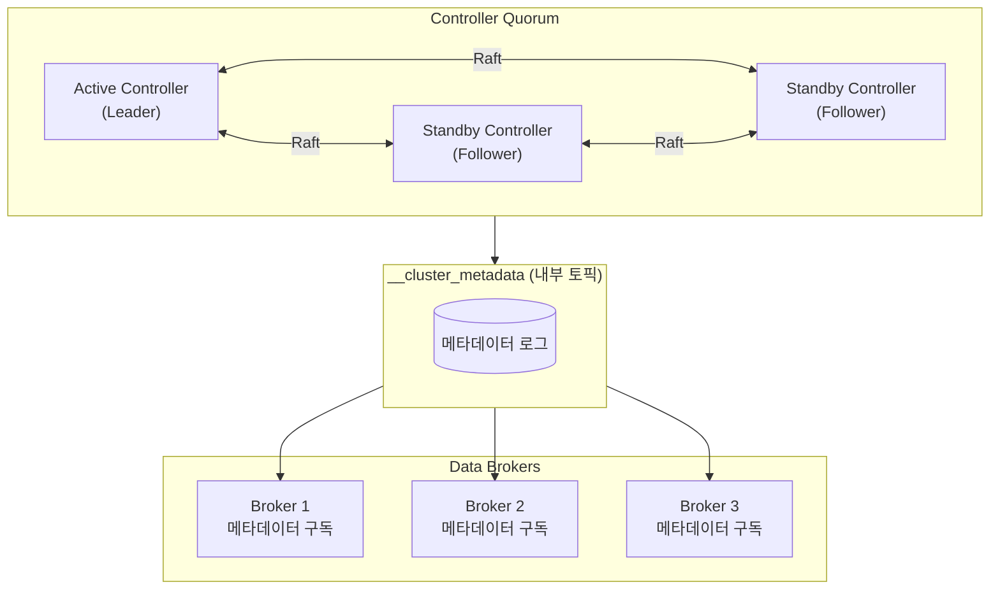
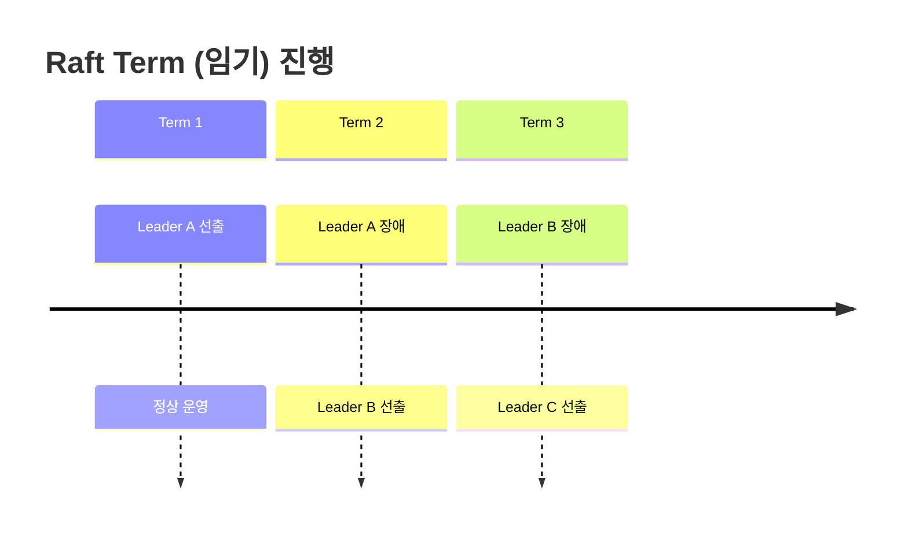
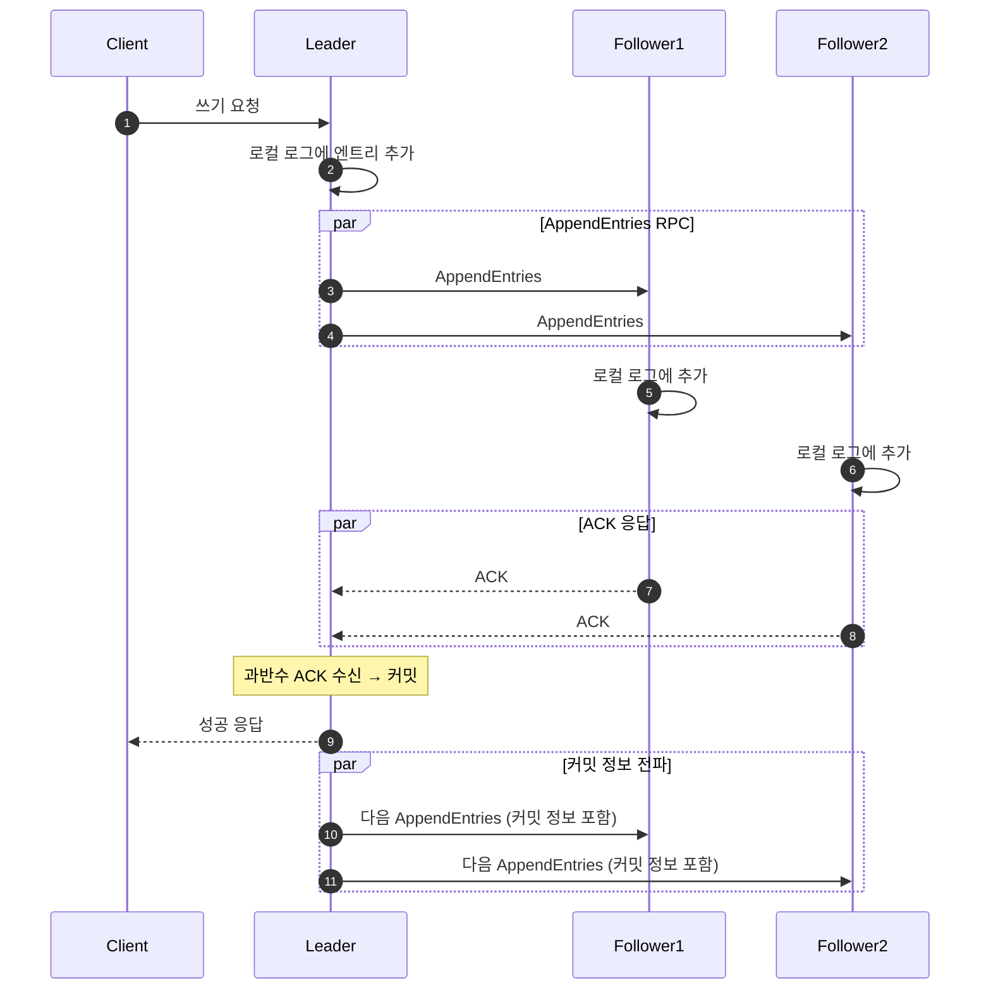
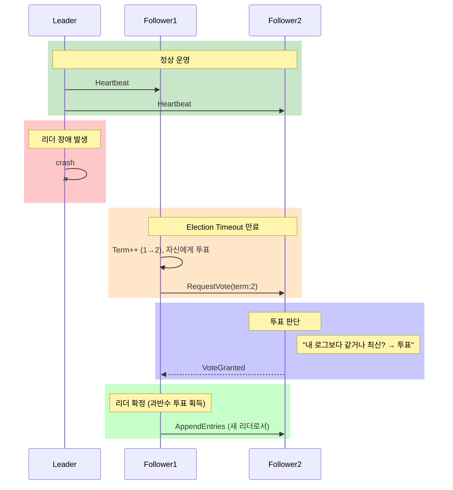
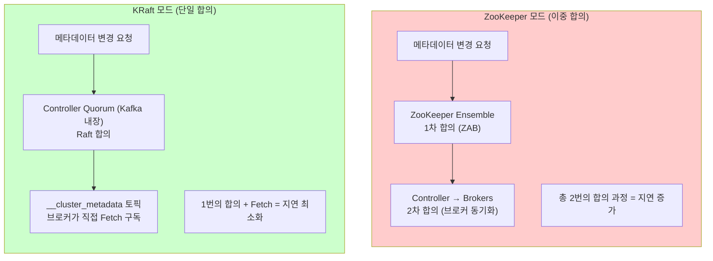
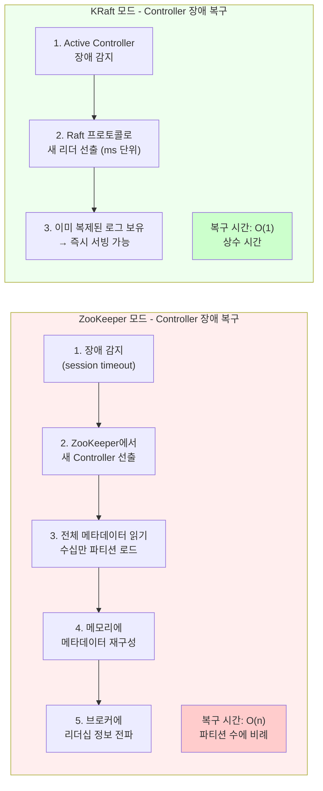
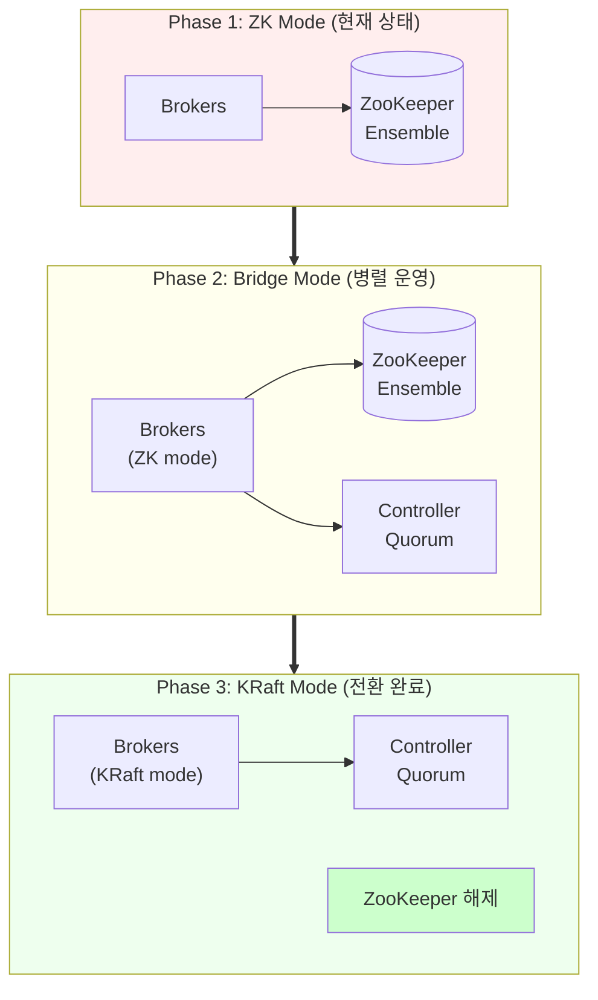
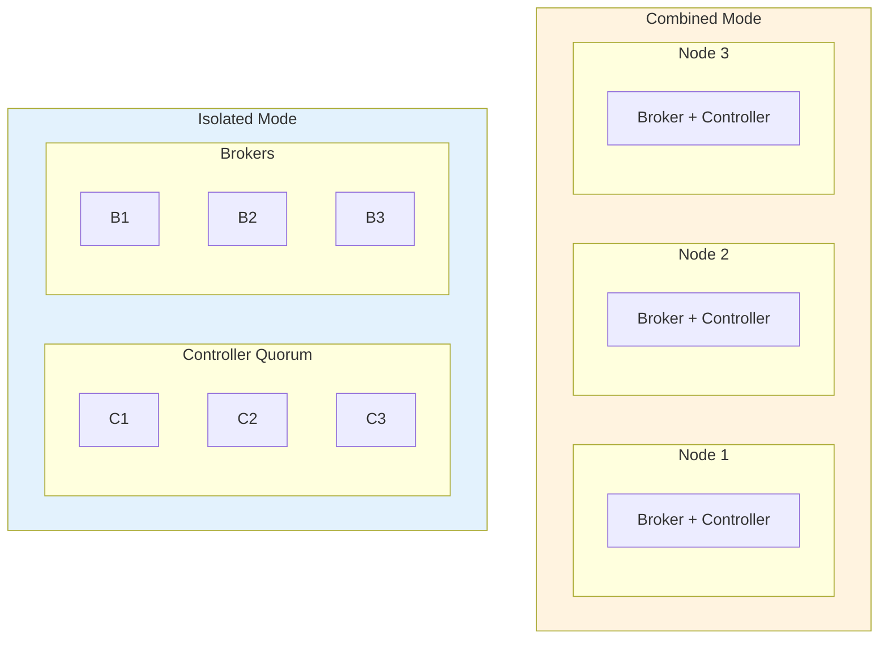
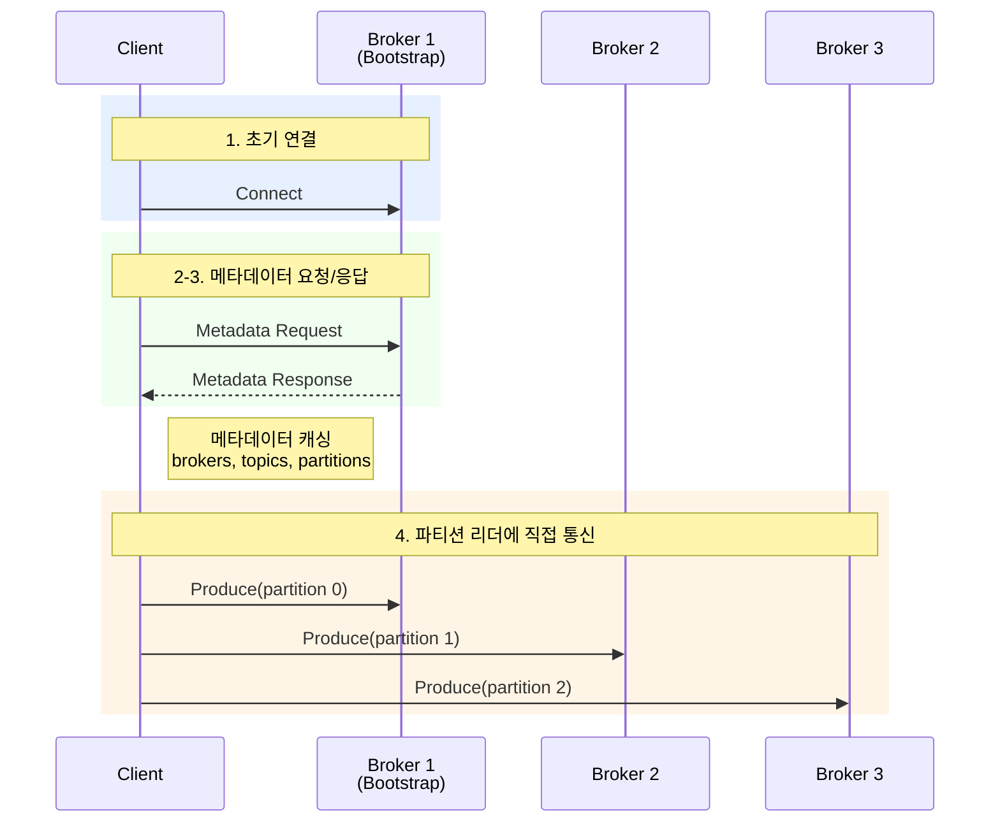
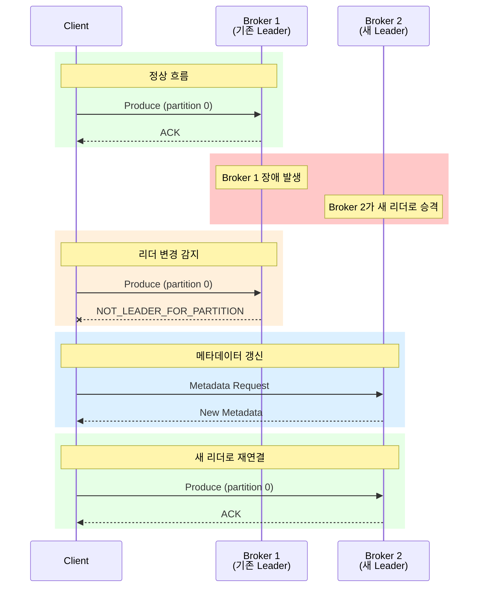

# Chapter 7: Cluster Management - 면접 및 실무 가이드

> Kafka 클러스터 관리의 핵심 개념을 면접과 실무 관점에서 상세히 정리한 문서입니다.

---

## 1. ZooKeeper vs KRaft: 왜 전환하는가?

### 1.1 ZooKeeper 기반 아키텍처의 한계

**면접 답변 예시:**

> "Kafka는 오랫동안 ZooKeeper를 사용해 클러스터 메타데이터를 관리했습니다. ZooKeeper는 브로커 등록, Controller 선출, 토픽 메타데이터, ISR 관리 등을 담당했습니다. 하지만 이 구조에는 근본적인 한계가 있었습니다."

**ZooKeeper의 5가지 한계점:**

| 한계 | 상세 설명 |
|------|-----------|
| **외부 시스템 의존성** | Kafka 운영을 위해 ZooKeeper 클러스터를 별도로 운영해야 합니다. 이는 운영 복잡도를 증가시키고, 두 시스템의 버전 호환성을 맞춰야 하며, 별도의 모니터링과 장애 대응이 필요합니다. |
| **이중 합의 문제** | ZooKeeper 내부에서 ZAB(ZooKeeper Atomic Broadcast) 프로토콜로 합의를 수행하고, Kafka Controller는 별도로 브로커들과 메타데이터를 동기화합니다. 두 번의 합의 과정이 필요하므로 복잡성과 지연이 증가합니다. |
| **메타데이터 동기화 지연** | Controller가 ZooKeeper에서 변경을 감지하고 각 브로커에게 전파하는 과정에서 비동기적 지연이 발생합니다. 대규모 클러스터에서 이 지연은 더욱 심화됩니다. |
| **확장성 제한** | ZooKeeper는 대략 200,000개 파티션까지만 효율적으로 관리할 수 있습니다. 그 이상에서는 Controller 장애 복구 시간이 급격히 증가하고, 메타데이터 갱신 성능이 저하됩니다. |
| **장애 복구 시간** | Controller 장애 시 새로운 Controller가 ZooKeeper에서 전체 메타데이터를 읽어와 메모리에 재구성해야 합니다. 파티션 수가 많을수록 이 과정이 수 초에서 수 분까지 걸릴 수 있습니다. |

**왜 이것이 문제인가?**

실무에서 Kafka를 대규모로 운영할 때, Controller 장애 복구에 수 분이 걸린다면 그 시간 동안 리더 선출, 파티션 재할당 등이 불가능합니다. 이는 곧 서비스 중단으로 이어질 수 있습니다.

### 1.2 KRaft 아키텍처: 근본적인 해결책

**면접 답변 예시:**

> "KRaft(Kafka Raft)는 ZooKeeper를 제거하고 Kafka 자체적으로 메타데이터를 관리하는 새로운 아키텍처입니다. Raft 합의 알고리즘을 기반으로 Controller Quorum이 메타데이터를 관리하며, 모든 메타데이터는 `__cluster_metadata`라는 내부 토픽에 저장됩니다."



**KRaft의 핵심 구성요소:**

| 구성요소 | 역할 | 상세 설명 |
|----------|------|-----------|
| **Active Controller** | 메타데이터 쓰기 담당 | Raft에서 리더 역할을 수행합니다. 모든 메타데이터 변경은 Active Controller를 통해 이루어지며, 변경 사항은 `__cluster_metadata` 토픽에 기록됩니다. |
| **Standby Controller** | 장애 대비 대기 | Raft Follower로서 Active Controller의 로그를 복제합니다. Active Controller 장애 시 즉시 새로운 리더로 선출될 수 있습니다. |
| **`__cluster_metadata`** | 메타데이터 저장소 | Kafka의 일반 토픽과 동일한 구조로, 모든 클러스터 메타데이터를 이벤트 로그 형태로 저장합니다. 단일 파티션으로 순서를 보장합니다. |

---

## 2. Raft 합의 알고리즘

### 2.1 Raft가 필요한 이유

분산 시스템에서 여러 노드가 동일한 데이터를 유지하려면 **합의(Consensus)** 알고리즘이 필요합니다. Raft는 Paxos보다 이해하기 쉽도록 설계된 합의 알고리즘으로, 다음 문제를 해결합니다:

- **리더 선출**: 여러 노드 중 하나를 리더로 선출
- **로그 복제**: 리더의 변경 사항을 모든 노드에 복제
- **안전성**: 네트워크 분할이나 노드 장애 상황에서도 데이터 일관성 보장

### 2.2 Raft의 핵심 개념

**1) Term (임기)**

> "Term은 Raft에서 논리적 시간 단위입니다. 새로운 리더가 선출될 때마다 Term이 1씩 증가합니다. 이를 통해 오래된 리더의 명령을 거부하고, 가장 최신 리더만 유효한 명령을 내릴 수 있습니다."



> **핵심 규칙**
> - 각 Term에는 최대 한 명의 리더만 존재
> - 낮은 Term의 요청은 거부됨

**2) Log Replication (로그 복제)**

> "리더는 클라이언트 요청을 로그 엔트리로 변환하여 자신의 로그에 추가합니다. 그 후 AppendEntries RPC를 통해 모든 Follower에게 전파합니다. 과반수 이상의 노드가 해당 엔트리를 복제하면, 그 엔트리는 커밋된 것으로 간주됩니다."



**로그 복제 상태 예시:**

| 노드 | 로그 엔트리 | committed |
|------|-------------|-----------|
| Leader | `[1][2][3][4][5]` | 5 |
| Follower1 | `[1][2][3][4][5]` | 5 |
| Follower2 | `[1][2][3][4]` | 4 (지연) |

> 과반수(2/3)가 5까지 복제했으므로 5는 커밋됨

**3) Leader Election (리더 선출)**

> "각 노드는 일정 시간(Election Timeout) 동안 리더의 Heartbeat를 받지 못하면 자신을 Candidate로 전환하고 선거를 시작합니다. 과반수 이상의 투표를 받은 Candidate가 새로운 리더가 됩니다. 투표 시에는 가장 최신 로그를 가진 노드가 우선권을 갖습니다."



### 2.3 Raft vs ZAB 비교

**면접 질문: "Raft와 ZooKeeper의 ZAB 프로토콜의 차이점은?"**

| 특성 | Raft | ZAB (ZooKeeper) |
|------|------|-----------------|
| **설계 목표** | 이해하기 쉬운 합의 알고리즘 | ZooKeeper 전용 최적화 |
| **리더 선출** | 가장 최신 로그 보유자 우선 | epoch 기반, 복잡한 복구 절차 |
| **로그 복제** | 단순한 AppendEntries RPC | 2단계 커밋 (propose → commit) |
| **멤버십 변경** | 단일 서버 변경 가능 (joint consensus) | 리더 재선출 필요 |
| **이해 용이성** | 높음 (학습 목적으로 설계됨) | 낮음 (성능 최적화 우선) |

---

## 3. KRaft의 성능 향상

### 3.1 정량적 비교

**면접 답변 예시:**

> "KRaft로 전환함으로써 얻는 가장 큰 이점은 Controller 장애 복구 시간입니다. ZooKeeper 모드에서는 수 초에서 수 분이 걸리던 복구가 KRaft에서는 밀리초 단위로 단축됩니다. 또한 파티션 수 제한도 기존 약 20만 개에서 수백만 개로 확장되었습니다."

| 메트릭 | ZooKeeper 모드 | KRaft 모드 | 개선율 |
|--------|----------------|------------|--------|
| **Controller 장애 복구** | 수 초 ~ 수 분 | 밀리초 단위 | 100배 이상 |
| **파티션 수 제한** | ~200,000개 | 수백만 개 | 10배 이상 |
| **메타데이터 전파** | 비동기 (지연 발생) | 이벤트 기반 실시간 | 즉시 반영 |
| **운영 복잡도** | 2개 시스템 운영 | 1개 시스템 | 50% 감소 |

### 3.2 왜 이런 개선이 가능한가?

**1) 단일 합의 vs 이중 합의**



**2) 장애 복구 메커니즘 비교**



---

## 4. ZooKeeper에서 KRaft로 마이그레이션

### 4.1 마이그레이션 전략

**면접 답변 예시:**

> "ZooKeeper에서 KRaft로의 마이그레이션은 무중단으로 수행할 수 있습니다. 먼저 Controller Quorum을 별도로 구성하고, 브리지 모드에서 ZooKeeper와 KRaft가 동시에 운영됩니다. 그 후 브로커들을 순차적으로 KRaft 모드로 전환하고, 최종적으로 ZooKeeper를 해제합니다."



### 4.2 상세 마이그레이션 단계

| 단계 | 작업 | 설명 | 주의사항 |
|------|------|------|----------|
| **1. 준비** | 버전 업그레이드 | Kafka 3.3+ 버전 필요 | 기존 클러스터와 호환성 확인 |
| **2. Controller 구성** | Controller Quorum 추가 | 새로운 Controller 노드 3~5개 추가 | 홀수 개 권장 (과반수 장애 허용) |
| **3. 브리지 모드** | 이중 메타데이터 운영 | ZK와 KRaft가 동시에 메타데이터 관리 | 데이터 정합성 모니터링 필수 |
| **4. 브로커 전환** | Rolling Restart | 브로커를 하나씩 KRaft 모드로 재시작 | 서비스 중단 없음 |
| **5. 정리** | ZooKeeper 해제 | ZK 클러스터 종료 및 해제 | 롤백 불가능 지점 |

### 4.3 Combined vs Isolated 모드

**면접 질문: "KRaft에서 Combined 모드와 Isolated 모드의 차이는?"**



**Combined Mode**
- 장점: 노드 수 적음, 운영 단순
- 단점: 리소스 경합, 역할 분리 어려움
- 사용: 소규모 클러스터, 개발/테스트 환경

**Isolated Mode**
- 장점: 역할 분리 명확, 독립적 확장 가능
- 단점: 더 많은 노드 필요
- 사용: 대규모 프로덕션 환경

| 특성 | Combined Mode | Isolated Mode |
|------|---------------|---------------|
| **최소 노드 수** | 3개 | 6개 (Controller 3 + Broker 3) |
| **리소스 사용** | 공유 (경합 가능) | 독립 (최적화 가능) |
| **확장성** | 제한적 | 높음 (각각 독립 확장) |
| **장애 격리** | 낮음 | 높음 |
| **권장 환경** | 개발, 소규모 | 프로덕션, 대규모 |

---

## 5. 클라이언트 연결 메커니즘

### 5.1 Bootstrap 서버의 역할

**면접 답변 예시:**

> "클라이언트가 Kafka 클러스터에 연결할 때, 처음에는 `bootstrap.servers`로 지정된 브로커 중 하나에 연결합니다. 이 브로커에서 전체 클러스터의 메타데이터를 받아와 캐싱하고, 이후에는 각 파티션의 리더 브로커에 직접 연결하여 통신합니다. Bootstrap 서버는 초기 연결에만 사용되고, 이후에는 메타데이터 기반으로 적절한 브로커와 통신합니다."



**메타데이터 응답 예시:**
```json
{
  "brokers": [
    {"id": 1, "host": "broker1", "port": 9092},
    {"id": 2, "host": "broker2", "port": 9092},
    {"id": 3, "host": "broker3", "port": 9092}
  ],
  "topics": [{
    "name": "orders",
    "partitions": [
      {"id": 0, "leader": 1, "replicas": [1,2], "isr": [1,2]},
      {"id": 1, "leader": 2, "replicas": [2,3], "isr": [2,3]},
      {"id": 2, "leader": 3, "replicas": [3,1], "isr": [3,1]}
    ]
  }]
}
```

### 5.2 메타데이터 갱신 트리거

**면접 질문: "클라이언트의 메타데이터는 언제 갱신되나요?"**

| 갱신 트리거 | 설명 |
|-------------|------|
| **주기적 갱신** | `metadata.max.age.ms` (기본 5분) 경과 시 자동 갱신 |
| **LEADER_NOT_AVAILABLE** | 요청한 파티션에 리더가 없을 때 |
| **NOT_LEADER_FOR_PARTITION** | 연결한 브로커가 해당 파티션의 리더가 아닐 때 |
| **UNKNOWN_TOPIC_OR_PARTITION** | 토픽이나 파티션 정보가 없을 때 |
| **명시적 요청** | 애플리케이션에서 직접 갱신 요청 시 |



---

## 6. 면접 핵심 질문과 답변

### Q1: "Kafka가 ZooKeeper에서 KRaft로 전환한 이유는?"

**모범 답변:**

> "Kafka가 KRaft로 전환한 가장 큰 이유는 **운영 복잡도 감소**와 **성능 향상**입니다.
>
> 첫째, 외부 시스템인 ZooKeeper를 별도로 운영하는 것은 추가적인 인프라 관리와 모니터링이 필요했습니다. KRaft는 Kafka 내부에 합의 알고리즘을 통합하여 단일 시스템으로 운영할 수 있게 합니다.
>
> 둘째, ZooKeeper 아키텍처에서는 Controller 장애 시 전체 메타데이터를 ZooKeeper에서 다시 읽어와야 했기 때문에 복구에 수 초에서 수 분이 걸렸습니다. KRaft에서는 Raft 프로토콜을 통해 밀리초 단위로 리더 전환이 가능합니다.
>
> 셋째, 확장성 측면에서 ZooKeeper는 대략 20만 개 파티션까지만 효율적으로 관리할 수 있었지만, KRaft는 수백만 개 파티션을 지원합니다."

### Q2: "Raft 알고리즘에서 리더 선출은 어떻게 이루어지나요?"

**모범 답변:**

> "Raft의 리더 선출은 세 단계로 이루어집니다.
>
> 1. **타임아웃 감지**: 각 Follower는 Election Timeout을 설정합니다. 이 시간 동안 리더의 Heartbeat를 받지 못하면 선거를 시작합니다.
>
> 2. **Candidate 전환**: Follower는 자신의 Term을 1 증가시키고 Candidate 상태로 전환합니다. 자신에게 먼저 투표하고, 다른 노드들에게 RequestVote RPC를 보냅니다.
>
> 3. **투표와 당선**: 각 노드는 한 Term에 한 표만 행사할 수 있습니다. Candidate보다 더 최신의 로그를 가진 경우에만 투표를 거부합니다. 과반수 투표를 받은 Candidate가 새 리더가 되어 즉시 Heartbeat를 전송합니다.
>
> Election Timeout은 각 노드마다 랜덤하게 설정되어 동시에 여러 Candidate가 발생하는 Split Vote 상황을 방지합니다."

### Q3: "Bootstrap 서버는 어떤 역할을 하나요?"

**모범 답변:**

> "Bootstrap 서버는 클라이언트가 Kafka 클러스터에 최초로 연결할 때 사용하는 진입점입니다.
>
> 클라이언트는 설정된 Bootstrap 서버 중 하나에 연결하여 Metadata Request를 보냅니다. 응답으로 전체 클러스터의 브로커 목록, 토픽, 파티션, 리더 정보 등을 받아와 로컬에 캐싱합니다.
>
> 이후에는 이 메타데이터를 기반으로 각 파티션의 리더 브로커에 직접 연결합니다. Bootstrap 서버 자체가 특별한 역할을 하는 것이 아니라, 단지 클러스터 진입을 위한 첫 번째 연결 지점일 뿐입니다.
>
> 따라서 Bootstrap 서버로 최소 3개 이상의 브로커를 지정하는 것이 좋습니다. 한두 개의 브로커가 장애 상태더라도 클러스터에 연결할 수 있기 때문입니다."

---

## 7. 실무 적용 체크리스트

### 7.1 KRaft 도입 전 확인사항

- [ ] Kafka 버전이 3.6+ 인지 확인 (프로덕션 권장)
- [ ] 기존 ZooKeeper 클러스터의 상태 점검
- [ ] Controller Quorum 노드 수 결정 (3개 또는 5개)
- [ ] Combined vs Isolated 모드 선택
- [ ] 마이그레이션 롤백 계획 수립

### 7.2 Controller Quorum 설정

```properties
# Controller 노드 설정
process.roles=controller
node.id=1
controller.quorum.voters=1@controller1:9093,2@controller2:9093,3@controller3:9093
controller.listener.names=CONTROLLER
listeners=CONTROLLER://:9093

# Broker 노드 설정 (KRaft 모드)
process.roles=broker
node.id=101
controller.quorum.voters=1@controller1:9093,2@controller2:9093,3@controller3:9093
listeners=PLAINTEXT://:9092
```

### 7.3 클라이언트 설정 권장사항

| 설정 | 권장값 | 이유 |
|------|--------|------|
| `bootstrap.servers` | 최소 3개 브로커 | 장애 시 가용성 확보 |
| `metadata.max.age.ms` | 300000 (5분) | 기본값 유지, 필요시 조정 |
| `reconnect.backoff.ms` | 50 | 빠른 재연결 시도 |
| `reconnect.backoff.max.ms` | 1000 | 과도한 재시도 방지 |

---

## 8. 참고 자료

- [KIP-500: Replace ZooKeeper with a Self-Managed Metadata Quorum](https://cwiki.apache.org/confluence/display/KAFKA/KIP-500)
- [Apache Kafka - KRaft Documentation](https://kafka.apache.org/documentation/#kraft)
- [Raft Consensus Algorithm Paper](https://raft.github.io/raft.pdf)
- [Raft Visualization](https://raft.github.io/)
- [Kafka Migration Guide: ZooKeeper to KRaft](https://kafka.apache.org/documentation/#kraft_migration)
