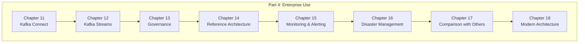
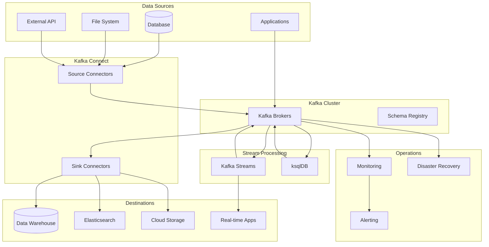

# Part 4: Kafka in Enterprise Use (엔터프라이즈 환경의 Kafka)

---

### 📌 파트 개요
> Part 4에서는 Apache Kafka를 엔터프라이즈 환경에 통합하는 방법을 다룬다. Kafka Connect를 통한 외부 시스템 연동, Kafka Streams를 활용한 스트림 처리, 거버넌스 전략, 고성능 배포를 위한 레퍼런스 아키텍처를 학습한다. 또한 모니터링, 알림, 재해 복구, 이벤트 기반 아키텍처에서의 Kafka 통합과 같은 고급 주제를 다룬다.

---

### 📚 챕터 구성

---

## Chapter 11: Kafka Connect

**외부 시스템 통합**

| 주제 | 내용 |
|------|------|
| Kafka Connect 개요 | 외부 시스템과 Kafka 연결 도구 |
| Source Connector | 외부 → Kafka 데이터 수집 |
| Sink Connector | Kafka → 외부 데이터 전송 |
| 지원 시스템 | 데이터베이스, 파일시스템, 클라우드 서비스 |

---

## Chapter 12: Kafka Streams

**스트림 처리**

| 주제 | 내용 |
|------|------|
| 스트림 처리 개념 | 실시간 데이터 변환 및 분석 |
| Kafka Streams API | 스트림 처리 라이브러리 |
| ksqlDB | SQL 기반 스트림 처리 |
| 동적 데이터 아키텍처 | 실시간 데이터 파이프라인 구축 |

---

## Chapter 13: Governance

**거버넌스 전략**

| 주제 | 내용 |
|------|------|
| 스키마 관리 | Schema Registry, 스키마 진화 |
| 보안 | 인증, 인가, 암호화 |
| 리소스 할당 | 쿼터, 제한 설정 |
| 신뢰성 및 보안 보장 | 엔터프라이즈 환경 요구사항 |

---

## Chapter 14: Reference Architecture

**레퍼런스 아키텍처**

| 주제 | 내용 |
|------|------|
| 배포 모델 | 온프레미스, 클라우드, 하이브리드 |
| 하드웨어 요구사항 | CPU, 메모리, 스토리지, 네트워크 |
| 클러스터 관리 도구 | 운영 및 관리 도구 |
| 고성능 배포 | 성능 최적화 전략 |

---

## Chapter 15: Monitoring & Alerting

**모니터링 및 알림**

| 주제 | 내용 |
|------|------|
| 핵심 메트릭 | 브로커, 클라이언트, 프레임워크 메트릭 |
| 모니터링 전략 | 성능 및 신뢰성 보장 |
| 알림 설정 | 이상 탐지 및 대응 |
| Kafka Streams/Connect 모니터링 | 프레임워크별 메트릭 |

---

## Chapter 16: Disaster Management

**재해 관리**

| 주제 | 내용 |
|------|------|
| 내결함성 | Fault Tolerance 설계 |
| 복제 전략 | 데이터 복제 및 동기화 |
| 복구 메커니즘 | 장애 복구 절차 |
| 데이터 손실 방지 | 리스크 완화 전략 |

---

## Chapter 17: Kafka vs Other Technologies

**기술 비교**

| 주제 | 내용 |
|------|------|
| Kafka vs REST API | 동기 vs 비동기 통신 |
| Kafka vs RDBMS | 이벤트 스트림 vs 트랜잭션 |
| 현대 아키텍처에서의 역할 | 마이크로서비스, 이벤트 소싱 |
| 기술 선택 가이드 | 사용 사례별 적합성 |

---

## Chapter 18: Modern Enterprise Architecture

**현대 엔터프라이즈 아키텍처**

| 주제 | 내용 |
|------|------|
| Data Mesh | 분산 데이터 플랫폼 |
| Event-Driven Architecture | 이벤트 기반 시스템 |
| 통합 패턴 | Kafka 통합 베스트 프랙티스 |
| 일반적인 실수 | 피해야 할 안티패턴 |

---

### 🎯 Part 4 학습 목표

1. **통합**: Kafka Connect를 통한 외부 시스템 연동
2. **처리**: Kafka Streams를 활용한 실시간 스트림 처리
3. **거버넌스**: 스키마, 보안, 리소스 관리
4. **운영**: 모니터링, 알림, 재해 복구 전략
5. **아키텍처**: 현대적 데이터 아키텍처에서의 Kafka 활용

---

### 📊 엔터프라이즈 Kafka 아키텍처 개요

---

### 🔗 참고 자료
- [Kafka Connect Documentation](https://kafka.apache.org/documentation/#connect)
- [Kafka Streams Documentation](https://kafka.apache.org/documentation/streams/)
- [Confluent Platform](https://docs.confluent.io/platform/current/overview.html)
- [Kafka Security](https://kafka.apache.org/documentation/#security)
