# 이벤트 기반 아키텍처 (Event-Driven Architecture) 개요

---

## 📌 핵심 요약

> **이벤트 기반 아키텍처(EDA)**는 시스템 컴포넌트 간 통신을 **이벤트(Event)**를 통해 수행하는 아키텍처 패턴이다. 명령(Command)이 아닌 **"무엇이 일어났는가"**를 표현하는 이벤트를 발행하고, 관심 있는 컴포넌트가 이를 구독하여 반응한다. 느슨한 결합(Loose Coupling), 확장성(Scalability), 복원력(Resilience)을 제공하며, 마이크로서비스 아키텍처와 함께 현대 분산 시스템의 핵심 패턴이 되었다.

---

## 🎯 학습 목표

이 내용을 읽고 나면:
- [ ] 이벤트 기반 아키텍처의 정의와 핵심 개념을 설명할 수 있다
- [ ] 동기 통신과 비동기 이벤트 통신의 차이점을 이해할 수 있다
- [ ] EDA 관련 패턴들(Event Sourcing, CQRS, Saga, Outbox)의 관계를 파악할 수 있다
- [ ] 기술 선택 가이드(Kafka vs RabbitMQ)를 적용할 수 있다
- [ ] EDA의 장단점과 적용 시나리오를 판단할 수 있다

---

## 📖 본문 정리

### 1. 이벤트 기반 아키텍처란?

#### 1.1 정의

**이벤트 기반 아키텍처(EDA, Event-Driven Architecture)**는 시스템의 상태 변화를 **이벤트(Event)**로 표현하고, 이 이벤트를 중심으로 시스템 간 통신이 이루어지는 아키텍처 스타일입니다.

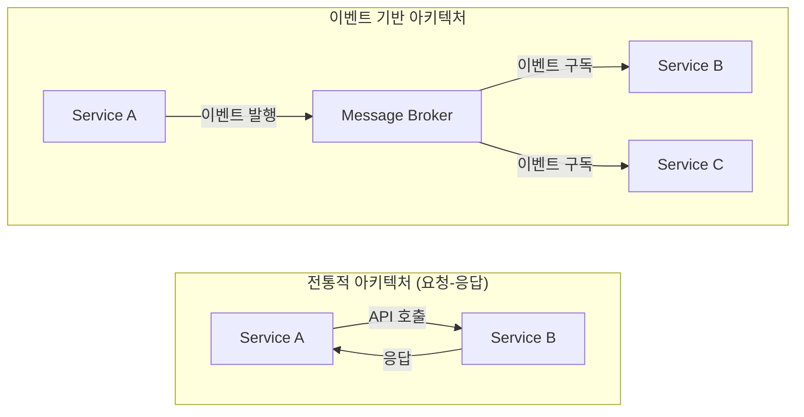

**핵심 차이점**:
- **전통적 아키텍처**: Service A가 Service B를 직접 호출. A는 B의 존재를 알아야 함
- **EDA**: Service A는 이벤트만 발행. 누가 소비하는지 알 필요 없음

#### 1.2 이벤트란?

**이벤트(Event)**는 **"과거에 발생한 사실"**을 나타내는 불변(Immutable) 메시지입니다.

```java
// 이벤트 예시 (Java)
public record OrderCreatedEvent(
    String eventId,
    Instant occurredAt,
    String orderId,
    String customerId,
    BigDecimal totalAmount,
    List<OrderItem> items
) {}
```

| 특성 | 설명 | 예시 |
|------|------|------|
| **과거형** | 이미 발생한 사실 | "주문이 생성되었다" (Created, not Create) |
| **불변** | 변경 불가 | 이벤트 수정은 새 이벤트 발행 |
| **자기 서술적** | 필요한 모든 정보 포함 | orderId, customerId, items 등 |

#### 1.3 Command vs Event vs Query

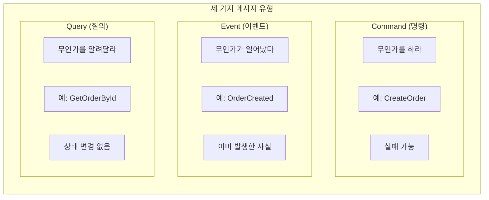

| 구분 | Command | Event | Query |
|------|---------|-------|-------|
| **의도** | 행동 요청 | 사실 통보 | 정보 요청 |
| **시제** | 명령형 (Create) | 과거형 (Created) | 현재형 (Get) |
| **실패** | 가능 | 불가능 (이미 발생) | 가능 |
| **대상** | 특정 서비스 | 불특정 다수 | 특정 서비스 |

> 💬 **비유**: Command는 "문을 열어라", Event는 "문이 열렸다", Query는 "문이 열려있나?"

---

### 2. 동기 vs 비동기 통신

#### 2.1 동기 통신의 문제점

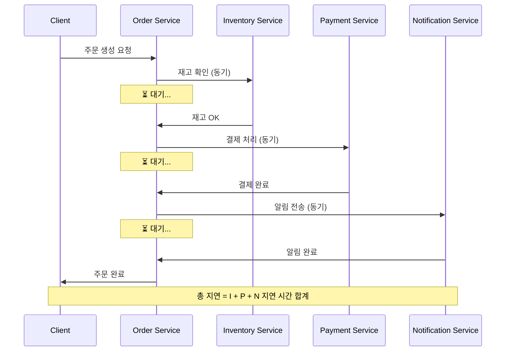

**문제점**:
1. **Temporal Coupling**: 모든 서비스가 동시에 가용해야 함
2. **Chain of Failure**: 하나가 죽으면 전체 실패
3. **Latency Accumulation**: 지연 시간이 누적됨
4. **Tight Coupling**: 서비스 간 강한 의존성

#### 2.2 비동기 이벤트 통신

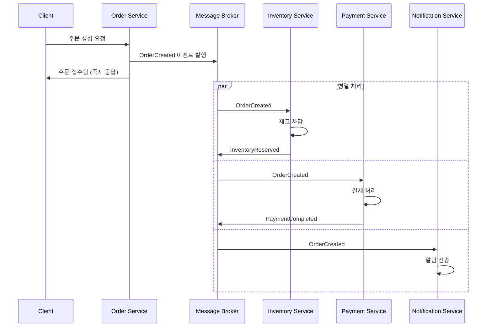

**장점**:
1. **Loose Coupling**: 서비스 간 의존성 제거
2. **Resilience**: 일부 서비스 장애에도 동작
3. **Scalability**: 독립적 확장 가능
4. **Responsiveness**: 빠른 응답 시간

---

### 3. EDA 핵심 패턴들의 관계

이벤트 기반 아키텍처를 구현할 때 함께 사용되는 패턴들이 있습니다. 각 패턴은 특정 문제를 해결합니다.

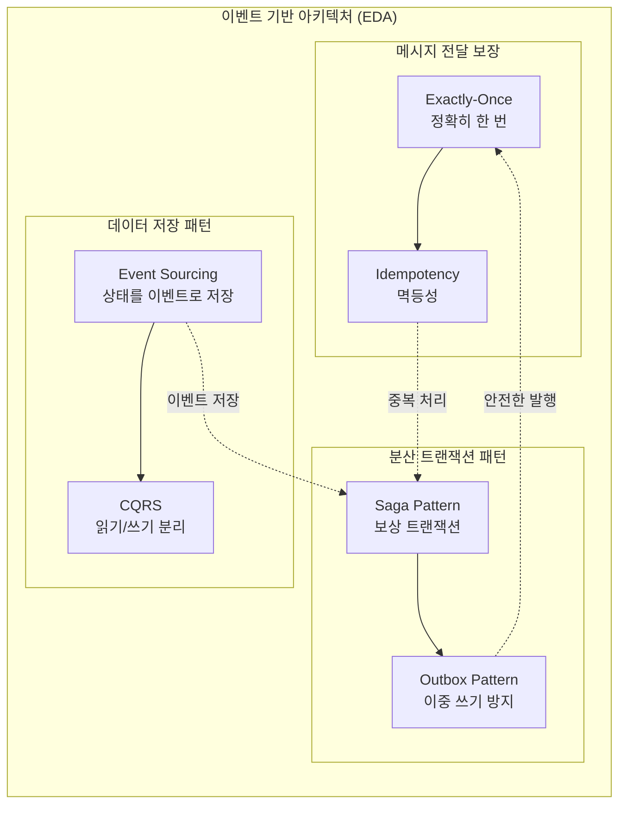

#### 3.1 패턴별 해결 문제

| 패턴 | 해결하는 문제 | 관련 문서 |
|------|--------------|-----------|
| **Event Sourcing** | 상태 변경 이력 추적, 시간 여행 | [01_Event_Sourcing.md](./01_Event_Sourcing.md) |
| **CQRS** | 읽기/쓰기 최적화, 확장성 | [02_CQRS.md](./02_CQRS.md) |
| **Saga Pattern** | 분산 트랜잭션, 롤백 | [03_Saga_Pattern.md](./03_Saga_Pattern.md) |
| **Outbox Pattern** | DB-MQ 이중 쓰기 문제 | [04_Outbox_Pattern.md](./04_Outbox_Pattern.md) |
| **Exactly-Once** | 메시지 중복/유실 방지 | [05_Exactly_Once_Semantics.md](./05_Exactly_Once_Semantics.md) |
| **Idempotency** | 중복 처리 안전성 | [06_Idempotency.md](./06_Idempotency.md) |

#### 3.2 패턴 조합 예시

**주문 시스템 구현 시**:

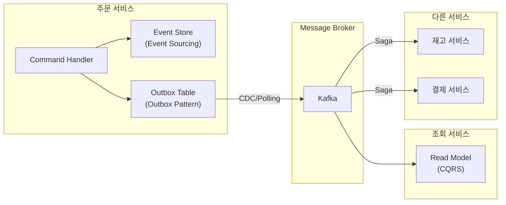

---

### 4. EDA 아키텍처 유형

#### 4.1 Mediator Topology (중재자 토폴로지)

중앙 **Mediator**가 이벤트 흐름을 조율합니다.

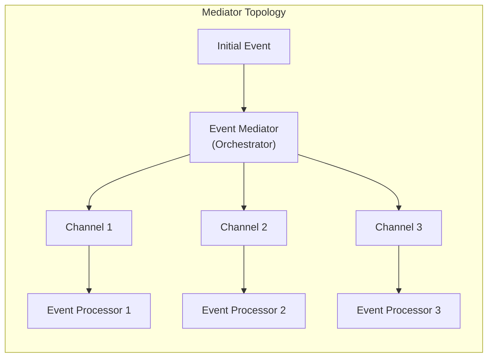

**특징**:
- 중앙 조율자가 워크플로우 관리
- 복잡한 비즈니스 로직 처리 용이
- 단일 장애점(SPOF) 위험

#### 4.2 Broker Topology (브로커 토폴로지)

중앙 조율자 없이 이벤트가 체인 형태로 전파됩니다.

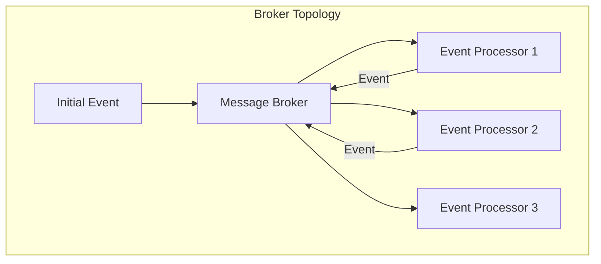

**특징**:
- 분산된 의사결정
- 높은 확장성과 복원력
- 전체 흐름 파악 어려움

| 토폴로지 | 복잡도 | 확장성 | 결합도 | 사용 사례 |
|----------|--------|--------|--------|-----------|
| **Mediator** | 높음 | 중간 | 중간 | 복잡한 워크플로우 |
| **Broker** | 낮음 | 높음 | 낮음 | 단순 이벤트 전파 |

---

### 5. 기술 선택 가이드

#### 5.1 Kafka vs RabbitMQ

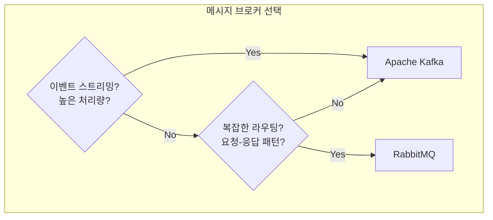

| 기준 | Kafka | RabbitMQ |
|------|-------|----------|
| **처리량** | 수백만 msg/s | 수만 msg/s |
| **메시지 보관** | 장기 보관 (로그) | 소비 후 삭제 |
| **라우팅** | 토픽/파티션 | Exchange/Queue (유연) |
| **순서 보장** | 파티션 내 보장 | 큐 내 보장 |
| **Consumer 모델** | Pull | Push |
| **Replay** | 가능 (Offset) | 불가능 |
| **적합 사례** | 이벤트 소싱, 로그 집계 | RPC, 작업 큐 |

#### 5.2 상황별 추천

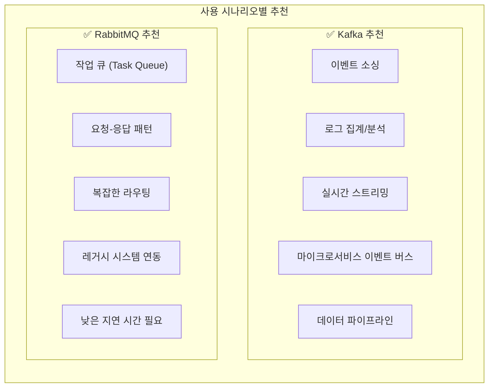

#### 5.3 하이브리드 아키텍처

실무에서는 두 가지를 함께 사용하기도 합니다.

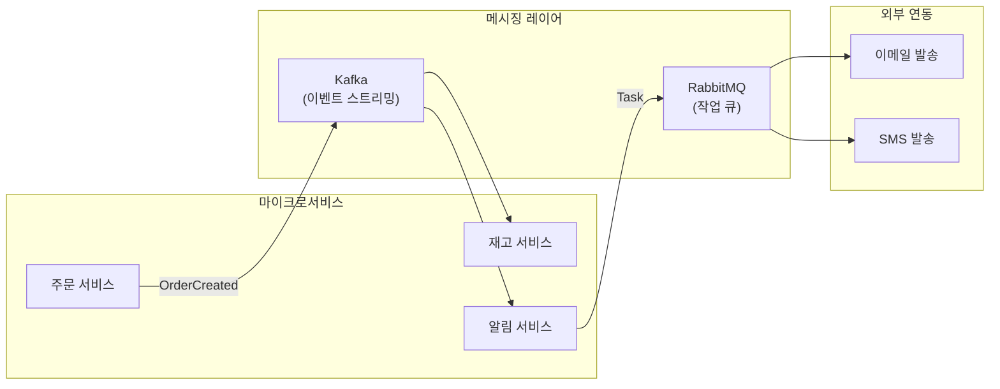

---

### 6. EDA 구현 시 고려사항

#### 6.1 이벤트 설계 원칙

```java
// ❌ 나쁜 예: 너무 적은 정보
public record OrderCreatedEvent(String orderId) {}

// ✅ 좋은 예: 자기 서술적
public record OrderCreatedEvent(
    String eventId,           // 이벤트 고유 ID
    Instant occurredAt,       // 발생 시간
    String eventType,         // 이벤트 유형
    int version,              // 스키마 버전
    
    String orderId,           // 주문 ID
    String customerId,        // 고객 ID
    BigDecimal totalAmount,   // 총액
    List<OrderItem> items,    // 주문 항목
    Address shippingAddress   // 배송 주소
) {}
```

**원칙**:
1. **자기 서술적**: 이벤트만 보고 의미 파악 가능
2. **불변**: 한 번 발행된 이벤트는 수정 불가
3. **버전 관리**: 스키마 진화 대비
4. **고유 식별자**: 멱등성 처리 지원

#### 6.2 이벤트 스키마 진화

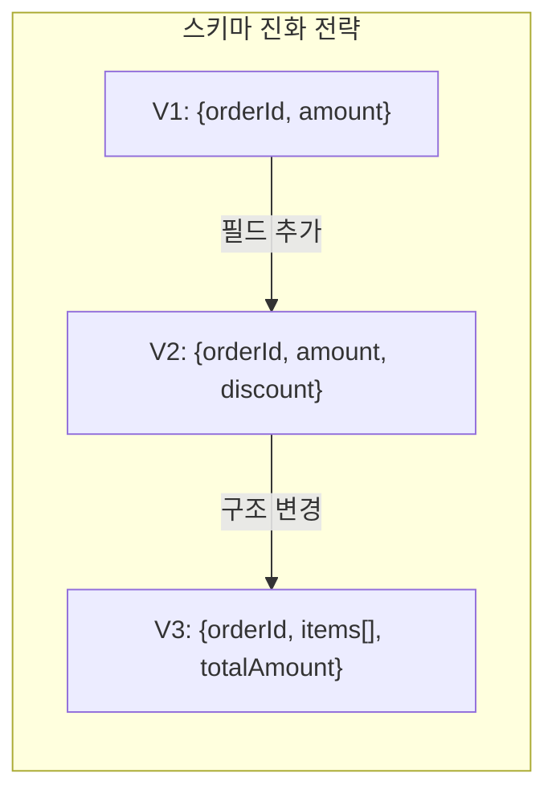

**호환성 규칙**:
- **Backward Compatible**: 새 스키마로 이전 데이터 읽기 가능
- **Forward Compatible**: 이전 스키마로 새 데이터 읽기 가능

```java
// 호환성 유지를 위한 Optional 필드
public record OrderCreatedEventV2(
    String orderId,
    BigDecimal amount,
    Optional<BigDecimal> discount  // V2에서 추가, V1 Consumer도 처리 가능
) {}
```

#### 6.3 장애 처리 전략

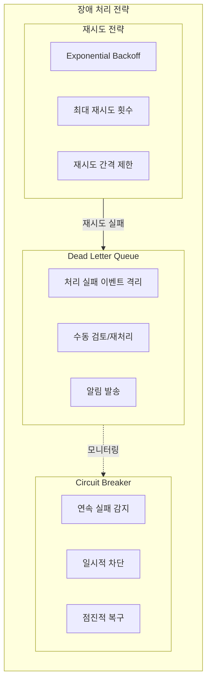

---

## 🔍 심화 학습

### Event Collaboration vs Event Notification

**Event Notification (이벤트 알림)**:
- 이벤트에 최소한의 정보만 포함
- Consumer가 추가 정보 필요 시 Producer에 질의

```java
// Event Notification: 최소 정보
public record OrderCreatedNotification(String orderId) {}

// Consumer가 추가 정보 필요 시
Order order = orderService.getOrder(event.orderId());
```

**Event-Carried State Transfer (이벤트 상태 전달)**:
- 이벤트에 필요한 모든 정보 포함
- Consumer가 Producer에 질의할 필요 없음

```java
// Event-Carried State Transfer: 전체 정보
public record OrderCreatedEvent(
    String orderId,
    String customerId,
    List<OrderItem> items,
    BigDecimal totalAmount,
    Address shippingAddress
) {}
```

| 방식 | 이벤트 크기 | 결합도 | 일관성 | 네트워크 |
|------|------------|--------|--------|----------|
| **Notification** | 작음 | 높음 | 실시간 | API 호출 필요 |
| **State Transfer** | 큼 | 낮음 | 이벤트 시점 | 자급자족 |

### Temporal Coupling 해결

**Temporal Coupling**: 서비스들이 동시에 가용해야 하는 제약

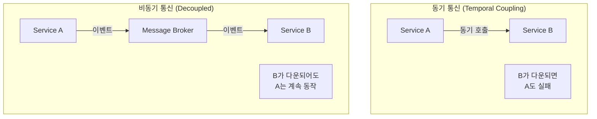

---

## 💡 실무 적용 포인트

### 언제 EDA를 사용해야 하는가?

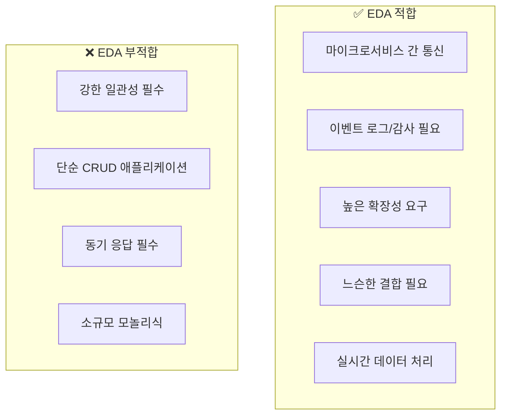

### 주의할 점 / 흔한 실수

- ⚠️ **이벤트 폭풍(Event Storm)**: 과도한 이벤트 발행으로 시스템 과부하
- ⚠️ **순서 보장 무시**: 파티션 키 설계 없이 순서 의존 로직 구현
- ⚠️ **이벤트 크기**: 너무 크거나 작은 이벤트 설계
- ⚠️ **스키마 관리 부재**: 버전 관리 없이 이벤트 구조 변경
- ⚠️ **모니터링 부재**: Consumer Lag, DLQ 모니터링 없이 운영
- ⚠️ **이중 쓰기 문제**: DB 저장과 이벤트 발행의 원자성 미보장

### 기존 문서 참조

| 주제 | 관련 문서 |
|------|-----------|
| Kafka 기초 | [../Kafka/01_Introduction_to_Apache_Kafka.md](../Kafka/01_Introduction_to_Apache_Kafka.md) |
| 메시지 브로커 비교 | [../00_비교_Kafka_vs_RedPanda_vs_RabbitMQ.md](../00_비교_Kafka_vs_RedPanda_vs_RabbitMQ.md) |
| 신뢰성 | [../Kafka/05_Reliability.md](../Kafka/05_Reliability.md) |

---

## ✅ 핵심 개념 체크리스트

- [ ] 이벤트(Event)의 정의와 특성(불변, 과거형)을 설명할 수 있는가?
- [ ] Command, Event, Query의 차이를 구분할 수 있는가?
- [ ] 동기 통신의 문제점(Temporal Coupling, Chain of Failure)을 이해하는가?
- [ ] EDA 관련 패턴들(Event Sourcing, CQRS, Saga, Outbox)의 역할을 아는가?
- [ ] Mediator vs Broker 토폴로지의 차이를 설명할 수 있는가?
- [ ] Kafka vs RabbitMQ 선택 기준을 적용할 수 있는가?
- [ ] 이벤트 스키마 진화 전략을 이해하는가?
- [ ] Event Notification vs Event-Carried State Transfer를 구분할 수 있는가?

---

## 🔗 참고 자료

- 📄 Martin Fowler: [What do you mean by "Event-Driven"?](https://martinfowler.com/articles/201701-event-driven.html)
- 📄 Chris Richardson: [Event-Driven Architecture](https://microservices.io/patterns/data/event-driven-architecture.html)
- 📘 책: "Designing Event-Driven Systems" (Ben Stopford, Confluent)
- 📘 책: "Building Event-Driven Microservices" (Adam Bellemare)

---

*📅 작성일: 2025-01-25*
*📚 관련 문서: Event Sourcing, CQRS, Saga Pattern, Outbox Pattern*
