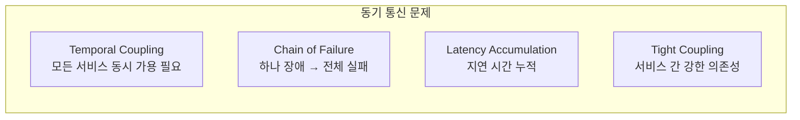
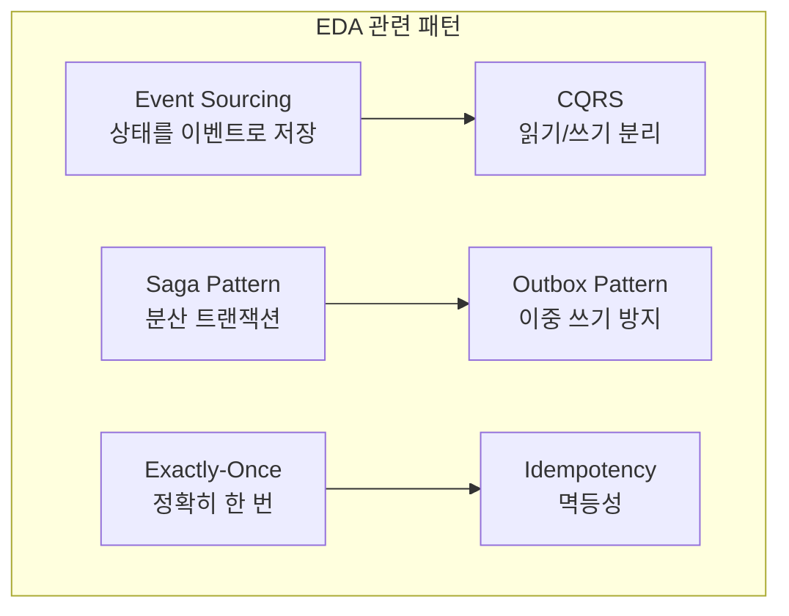

# 이벤트 기반 아키텍처 (EDA) 면접 정리

---

## 1. 핵심 개념 요약

### 1.1 이벤트 기반 아키텍처란?

**이벤트 기반 아키텍처(EDA)**는 시스템 컴포넌트 간 통신을 **이벤트(Event)**를 통해 수행하는 아키텍처 패턴입니다. 명령이 아닌 **"무엇이 일어났는가"**를 표현하는 이벤트를 발행하고, 관심 있는 컴포넌트가 이를 구독하여 반응합니다.

### 1.2 이벤트의 특성

| 특성 | 설명 | 예시 |
|------|------|------|
| **과거형** | 이미 발생한 사실 | OrderCreated (Created, not Create) |
| **불변** | 변경 불가 | 수정 시 새 이벤트 발행 |
| **자기 서술적** | 필요한 모든 정보 포함 | orderId, customerId, items 등 |

### 1.3 Command vs Event vs Query

| 구분 | Command | Event | Query |
|------|---------|-------|-------|
| **의도** | 행동 요청 | 사실 통보 | 정보 요청 |
| **시제** | 명령형 (Create) | 과거형 (Created) | 현재형 (Get) |
| **실패** | 가능 | 불가능 | 가능 |
| **대상** | 특정 서비스 | 불특정 다수 | 특정 서비스 |

---

## 2. 동기 vs 비동기 통신

### 동기 통신의 문제점



### 비동기 통신의 장점

| 장점 | 설명 |
|------|------|
| **Loose Coupling** | 서비스 간 의존성 제거 |
| **Resilience** | 일부 서비스 장애에도 동작 |
| **Scalability** | 독립적 확장 가능 |
| **Responsiveness** | 빠른 응답 시간 |

---

## 3. EDA 핵심 패턴 관계도



| 패턴 | 해결하는 문제 |
|------|-------------|
| **Event Sourcing** | 상태 변경 이력 추적, 시간 여행 |
| **CQRS** | 읽기/쓰기 최적화, 확장성 |
| **Saga Pattern** | 분산 트랜잭션, 롤백 |
| **Outbox Pattern** | DB-MQ 이중 쓰기 문제 |
| **Exactly-Once** | 메시지 중복/유실 방지 |
| **Idempotency** | 중복 처리 안전성 |

---

## 4. Kafka vs RabbitMQ 선택 기준

| 기준 | Kafka | RabbitMQ |
|------|-------|----------|
| **처리량** | 수백만 msg/s | 수만 msg/s |
| **메시지 보관** | 장기 보관 | 소비 후 삭제 |
| **라우팅** | 단순 (토픽/파티션) | 복잡 (Exchange) |
| **순서 보장** | 파티션 내 | 큐 내 |
| **Replay** | 가능 | 불가능 |

**Kafka 추천**: 이벤트 소싱, 로그 집계, 실시간 스트리밍, 데이터 파이프라인

**RabbitMQ 추천**: 작업 큐, 요청-응답 패턴, 복잡한 라우팅

---

## 5. 면접 예상 질문 및 모범 답변

### Q1. 이벤트 기반 아키텍처란 무엇인가요?

> 이벤트 기반 아키텍처는 시스템 간 통신을 **이벤트**를 통해 수행하는 아키텍처 패턴입니다.
>
> **핵심 특징**:
> 1. 이벤트는 **"무엇이 일어났는가"**를 과거형으로 표현합니다. 예를 들어 "주문을 생성하라(CreateOrder)"가 아니라 "주문이 생성되었다(OrderCreated)"입니다.
> 2. 이벤트 발행자는 누가 소비하는지 알 필요가 없어 **느슨한 결합**을 달성합니다.
> 3. 비동기 처리로 **확장성**과 **복원력**이 높아집니다.
>
> 마이크로서비스 간 통신, 이벤트 로깅, 실시간 데이터 처리에 적합합니다.

### Q2. Command와 Event의 차이는 무엇인가요?

> 가장 큰 차이는 **시제**와 **실패 가능성**입니다.
>
> **Command**는 "무언가를 해달라"는 **명령형** 요청입니다. CreateOrder처럼 현재/미래 시제이고, 실행이 실패할 수 있습니다. 특정 서비스를 대상으로 합니다.
>
> **Event**는 "무언가가 일어났다"는 **과거형** 사실입니다. OrderCreated처럼 이미 발생한 일이므로 실패할 수 없습니다. 불특정 다수의 구독자를 대상으로 합니다.
>
> 비유하면 Command는 "문을 열어라", Event는 "문이 열렸다"입니다.

### Q3. 동기 통신의 문제점은 무엇인가요?

> 동기 통신은 네 가지 주요 문제가 있습니다.
>
> **첫째, Temporal Coupling입니다.** 모든 서비스가 동시에 가용해야 합니다. 하나라도 다운되면 전체 요청이 실패합니다.
>
> **둘째, Chain of Failure입니다.** A → B → C로 호출할 때 C가 죽으면 A까지 영향을 받습니다.
>
> **셋째, Latency Accumulation입니다.** 각 서비스 지연 시간이 누적됩니다. 3개 서비스가 각 100ms면 총 300ms가 됩니다.
>
> **넷째, Tight Coupling입니다.** 호출하는 서비스가 호출받는 서비스의 API를 알아야 합니다.
>
> EDA는 메시지 브로커를 중간에 두어 이 문제들을 해결합니다.

### Q4. 이벤트 기반 아키텍처의 장단점은?

> **장점**:
> - **느슨한 결합**: 서비스 간 의존성 제거
> - **확장성**: 독립적 스케일링 가능
> - **복원력**: 일부 서비스 장애에도 동작
> - **유연성**: 새 Consumer 추가 용이
>
> **단점**:
> - **복잡성**: 이벤트 순서, 중복 처리 등 고려 필요
> - **디버깅 어려움**: 분산된 로직 추적 어려움
> - **최종 일관성**: 즉시 일관성 보장 불가
> - **운영 부담**: 메시지 브로커 관리 필요
>
> 강한 일관성이 필수이거나 단순한 CRUD 애플리케이션에서는 EDA가 오히려 복잡성만 증가시킵니다.

### Q5. Kafka와 RabbitMQ 중 어떻게 선택하나요?

> 선택 기준은 **사용 패턴**과 **요구사항**입니다.
>
> **Kafka 선택 시나리오**:
> - 이벤트 소싱, 로그 집계처럼 **메시지 보관**이 필요할 때
> - 초당 수백만 건의 **높은 처리량**이 필요할 때
> - 과거 이벤트 **Replay**가 필요할 때
> - **파티션 기반 순서 보장**이 필요할 때
>
> **RabbitMQ 선택 시나리오**:
> - 작업 큐처럼 **메시지 소비 후 삭제**가 적합할 때
> - 복잡한 **라우팅 규칙**이 필요할 때
> - **요청-응답 패턴**을 사용할 때
> - **낮은 지연 시간**이 중요할 때
>
> 실무에서는 둘을 함께 사용하기도 합니다. Kafka로 이벤트 스트리밍을 처리하고, RabbitMQ로 작업 큐를 처리하는 하이브리드 구성입니다.

### Q6. Event Notification과 Event-Carried State Transfer의 차이는?

> 두 방식의 차이는 **이벤트에 포함되는 정보의 양**입니다.
>
> **Event Notification**은 최소한의 정보만 포함합니다. 예를 들어 `OrderCreated(orderId)`만 전달하고, Consumer가 추가 정보가 필요하면 Producer의 API를 호출합니다. 이벤트 크기는 작지만 서비스 간 결합도가 높아집니다.
>
> **Event-Carried State Transfer**는 필요한 모든 정보를 포함합니다. `OrderCreated(orderId, customerId, items, totalAmount, ...)`처럼 전체 상태를 전달합니다. Consumer가 Producer에 질의할 필요가 없어 결합도가 낮지만, 이벤트 크기가 커집니다.
>
> 일반적으로 EDA에서는 **Event-Carried State Transfer**를 권장합니다. 느슨한 결합이 EDA의 핵심 장점이기 때문입니다.

### Q7. 이벤트 스키마 진화는 어떻게 관리하나요?

> 스키마 진화의 핵심은 **하위 호환성(Backward Compatibility)**입니다.
>
> **원칙**:
> 1. **필드 추가**는 Optional로 해서 이전 Consumer가 무시할 수 있게 합니다
> 2. **필드 삭제**는 하지 않거나, 충분한 마이그레이션 기간을 둡니다
> 3. **필드 타입 변경**은 새 필드로 추가합니다
> 4. **버전 번호**를 이벤트에 포함합니다
>
> ```java
> public record OrderCreatedEventV2(
>     int version,  // 스키마 버전
>     String orderId,
>     BigDecimal amount,
>     Optional<BigDecimal> discount  // V2 추가, V1 Consumer도 처리 가능
> ) {}
> ```
>
> Schema Registry(Confluent, Apicurio)를 사용하면 호환성을 자동으로 검증할 수 있습니다.

---

## 6. 핵심 개념 체크리스트

- [ ] 이벤트(Event)의 정의와 특성(불변, 과거형)을 설명할 수 있는가?
- [ ] Command, Event, Query의 차이를 구분할 수 있는가?
- [ ] 동기 통신의 문제점을 4가지 이상 설명할 수 있는가?
- [ ] EDA 관련 패턴들의 역할을 각각 설명할 수 있는가?
- [ ] Kafka vs RabbitMQ 선택 기준을 적용할 수 있는가?
- [ ] Event Notification vs Event-Carried State Transfer를 구분할 수 있는가?
- [ ] 이벤트 스키마 진화 전략을 설명할 수 있는가?

---

*📅 작성일: 2025-01-25*
*📚 관련 문서: [00_이벤트기반아키텍처_개요.md](./00_이벤트기반아키텍처_개요.md)*
