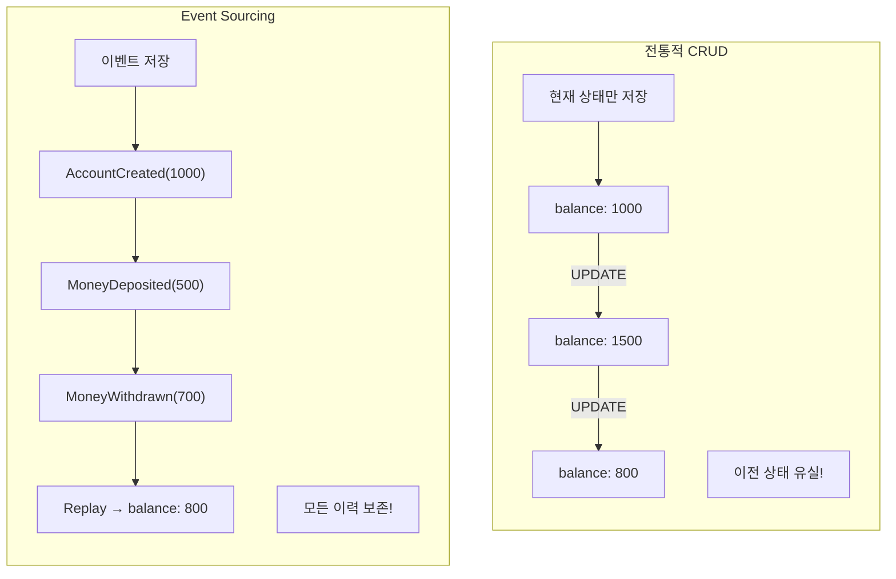
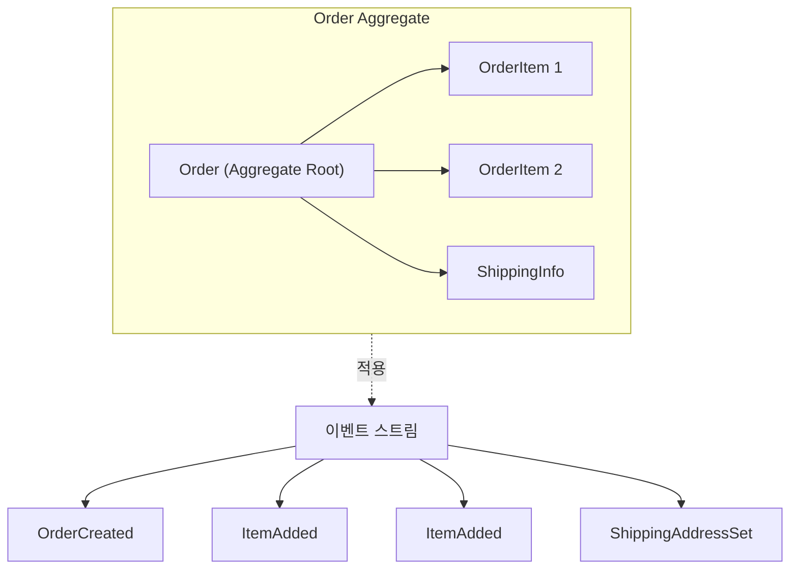
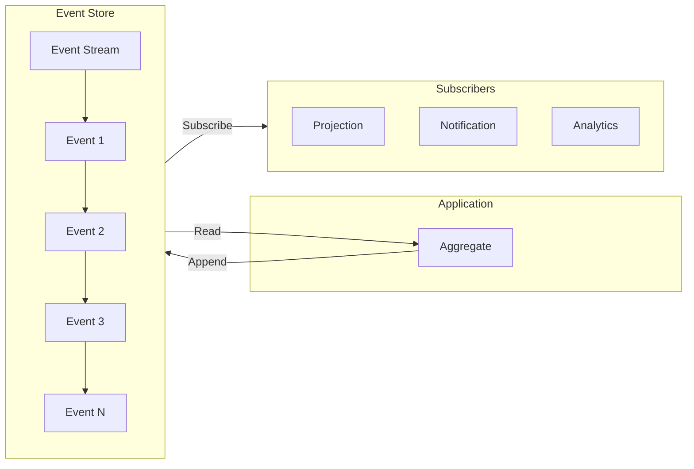
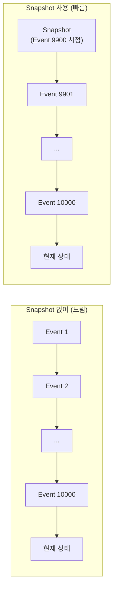
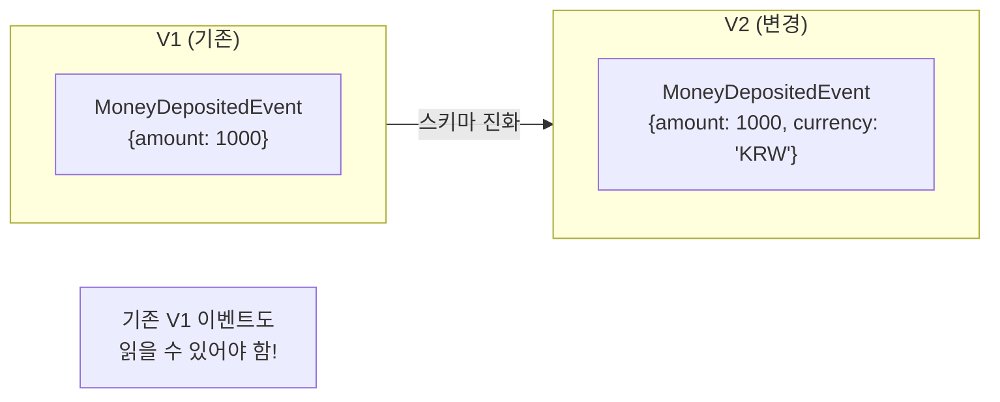
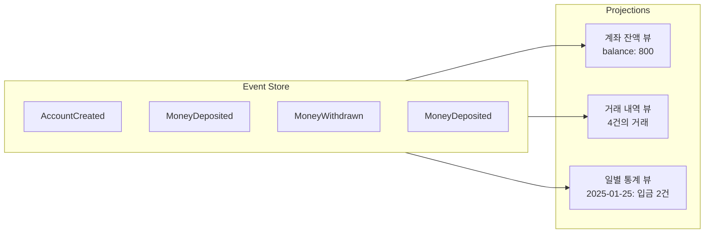
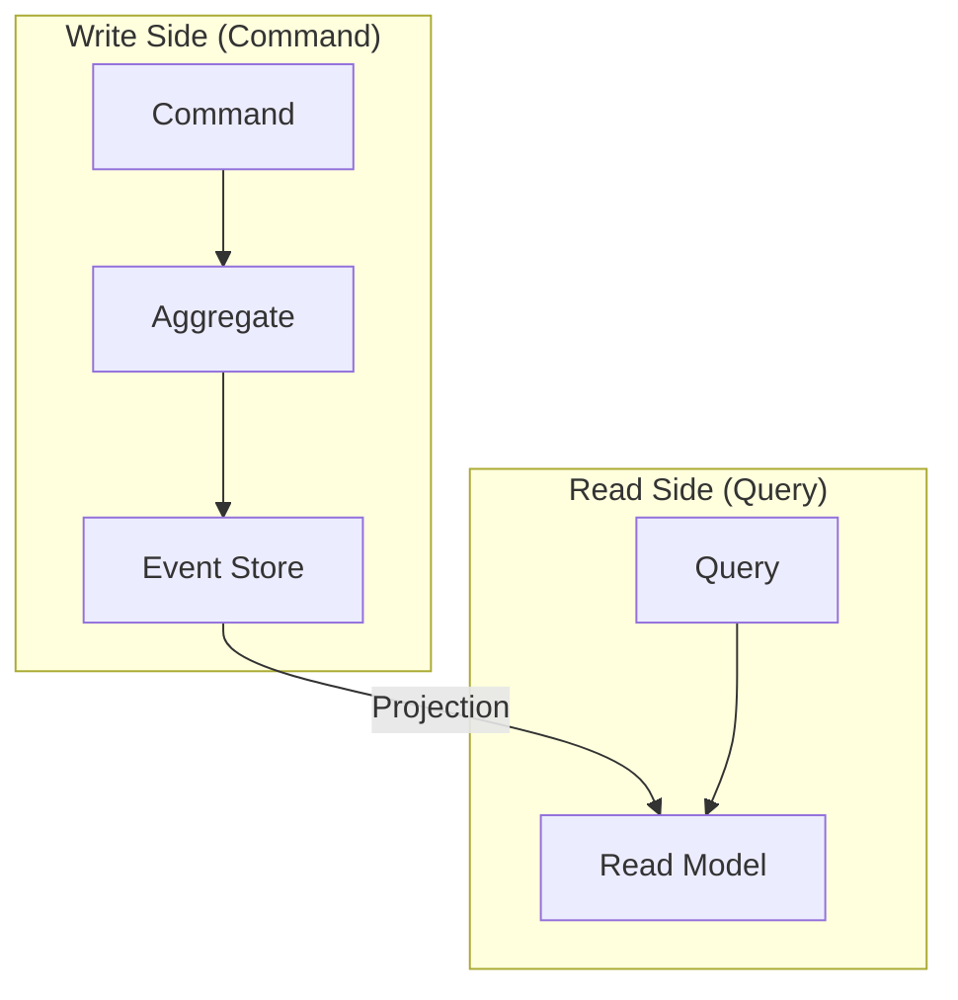
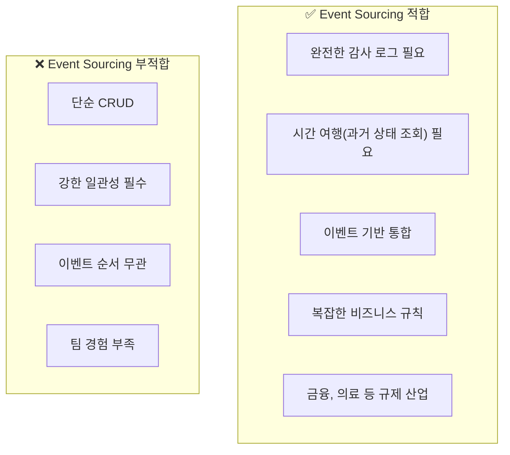

# Event Sourcing (이벤트 소싱)

---

## 📌 핵심 요약

> **Event Sourcing**은 애플리케이션의 상태를 직접 저장하는 대신, **상태 변경을 일으킨 모든 이벤트를 순서대로 저장**하는 패턴이다. 현재 상태는 저장된 이벤트들을 처음부터 재생(Replay)하여 계산한다. 이를 통해 **완전한 감사 로그**, **시간 여행(Time Travel)**, **이벤트 기반 통합**이 가능해지며, CQRS와 함께 사용되는 경우가 많다.

---

## 🎯 학습 목표

이 내용을 읽고 나면:
- [ ] Event Sourcing의 개념과 기존 CRUD 방식과의 차이를 설명할 수 있다
- [ ] Aggregate와 Event Store의 역할을 이해할 수 있다
- [ ] Snapshot을 통한 성능 최적화 방법을 알 수 있다
- [ ] 스키마 진화(Schema Evolution) 전략을 적용할 수 있다
- [ ] Event Sourcing의 장단점과 적용 시나리오를 판단할 수 있다

---

## 📖 본문 정리

### 1. Event Sourcing이란?

#### 1.1 기존 CRUD vs Event Sourcing

**전통적인 CRUD 방식**에서는 현재 상태만 저장합니다. 사용자 정보를 수정하면 이전 값은 사라지고 새 값으로 덮어씁니다.

**Event Sourcing**에서는 **상태 변경의 원인이 된 이벤트**를 저장합니다. 현재 상태는 이벤트들을 재생하여 계산합니다.



> 💬 **비유**: CRUD는 스냅샷 사진과 같습니다. 현재 모습만 알 수 있습니다. Event Sourcing은 비디오 녹화와 같습니다. 처음부터 끝까지 무슨 일이 있었는지 모두 알 수 있고, 원하는 시점으로 돌아갈 수 있습니다.

#### 1.2 핵심 개념

| 개념 | 설명 | 예시 |
|------|------|------|
| **Event** | 과거에 발생한 사실 | `MoneyDeposited(500)` |
| **Event Store** | 이벤트를 저장하는 저장소 | Kafka, EventStoreDB |
| **Aggregate** | 이벤트의 논리적 그룹 | `BankAccount` |
| **Projection** | 이벤트로부터 도출된 뷰 | 현재 잔액 조회용 테이블 |
| **Replay** | 이벤트 재생으로 상태 복원 | 처음부터 재생 → 현재 상태 |

---

### 2. Aggregate (집합체)

#### 2.1 Aggregate란?

**Aggregate**는 함께 변경되어야 하는 엔티티들의 집합입니다. Event Sourcing에서 Aggregate는 **이벤트 스트림의 단위**가 됩니다.



#### 2.2 Aggregate 구현 예시 (Java)

```java
public class BankAccount {
    private String accountId;
    private BigDecimal balance;
    private List<DomainEvent> uncommittedEvents = new ArrayList<>();

    // 이벤트 적용 (상태 변경)
    private void apply(DomainEvent event) {
        if (event instanceof AccountCreatedEvent e) {
            this.accountId = e.accountId();
            this.balance = e.initialBalance();
        } else if (event instanceof MoneyDepositedEvent e) {
            this.balance = this.balance.add(e.amount());
        } else if (event instanceof MoneyWithdrawnEvent e) {
            this.balance = this.balance.subtract(e.amount());
        }
    }

    // Command 처리 → 이벤트 생성
    public void deposit(BigDecimal amount) {
        if (amount.compareTo(BigDecimal.ZERO) <= 0) {
            throw new IllegalArgumentException("Amount must be positive");
        }
        var event = new MoneyDepositedEvent(accountId, amount, Instant.now());
        apply(event);
        uncommittedEvents.add(event);
    }

    public void withdraw(BigDecimal amount) {
        if (amount.compareTo(balance) > 0) {
            throw new InsufficientFundsException();
        }
        var event = new MoneyWithdrawnEvent(accountId, amount, Instant.now());
        apply(event);
        uncommittedEvents.add(event);
    }

    // 이벤트 재생으로 상태 복원
    public static BankAccount rehydrate(List<DomainEvent> events) {
        BankAccount account = new BankAccount();
        for (DomainEvent event : events) {
            account.apply(event);
        }
        return account;
    }

    public List<DomainEvent> getUncommittedEvents() {
        return Collections.unmodifiableList(uncommittedEvents);
    }
}
```

#### 2.3 이벤트 정의

```java
// 기본 이벤트 인터페이스
public sealed interface DomainEvent permits 
    AccountCreatedEvent, MoneyDepositedEvent, MoneyWithdrawnEvent {
    String aggregateId();
    Instant occurredAt();
}

// 계좌 생성 이벤트
public record AccountCreatedEvent(
    String aggregateId,
    String accountId,
    BigDecimal initialBalance,
    String ownerName,
    Instant occurredAt
) implements DomainEvent {}

// 입금 이벤트
public record MoneyDepositedEvent(
    String aggregateId,
    BigDecimal amount,
    String description,
    Instant occurredAt
) implements DomainEvent {}

// 출금 이벤트
public record MoneyWithdrawnEvent(
    String aggregateId,
    BigDecimal amount,
    String description,
    Instant occurredAt
) implements DomainEvent {}
```

---

### 3. Event Store (이벤트 저장소)

#### 3.1 Event Store의 역할



#### 3.2 Event Store 요구사항

| 요구사항 | 설명 |
|----------|------|
| **Append-Only** | 이벤트 추가만 가능, 수정/삭제 불가 |
| **순서 보장** | 이벤트 순서대로 저장 및 조회 |
| **Optimistic Concurrency** | 동시 수정 감지 |
| **구독 지원** | 새 이벤트 발생 시 알림 |

#### 3.3 Event Store 구현 옵션

| 옵션 | 특징 | 적합 상황 |
|------|------|----------|
| **EventStoreDB** | Event Sourcing 전용, Projection 내장 | Event Sourcing 중심 시스템 |
| **Apache Kafka** | 높은 처리량, 분산 | 대규모 이벤트 스트리밍 |
| **PostgreSQL** | 범용 DB, JSON 지원 | 기존 인프라 활용 |
| **MongoDB** | Document 기반, 유연한 스키마 | 스키마 변경 빈번 |

#### 3.4 PostgreSQL 기반 Event Store

```sql
-- 이벤트 테이블
CREATE TABLE events (
    id BIGSERIAL PRIMARY KEY,
    aggregate_id VARCHAR(255) NOT NULL,
    aggregate_type VARCHAR(255) NOT NULL,
    event_type VARCHAR(255) NOT NULL,
    event_data JSONB NOT NULL,
    metadata JSONB,
    version BIGINT NOT NULL,
    created_at TIMESTAMP WITH TIME ZONE DEFAULT NOW(),
    
    -- Optimistic Concurrency를 위한 유니크 제약
    UNIQUE (aggregate_id, version)
);

-- 조회 성능을 위한 인덱스
CREATE INDEX idx_events_aggregate ON events (aggregate_id, version);
CREATE INDEX idx_events_type ON events (event_type);
CREATE INDEX idx_events_created ON events (created_at);
```

```java
@Repository
public class JdbcEventStore implements EventStore {
    
    private final JdbcTemplate jdbcTemplate;
    private final ObjectMapper objectMapper;
    
    @Override
    @Transactional
    public void append(String aggregateId, List<DomainEvent> events, long expectedVersion) {
        long currentVersion = getCurrentVersion(aggregateId);
        
        if (currentVersion != expectedVersion) {
            throw new OptimisticConcurrencyException(
                "Expected version " + expectedVersion + " but found " + currentVersion
            );
        }
        
        long version = expectedVersion;
        for (DomainEvent event : events) {
            version++;
            jdbcTemplate.update("""
                INSERT INTO events (aggregate_id, aggregate_type, event_type, event_data, version)
                VALUES (?, ?, ?, ?::jsonb, ?)
                """,
                aggregateId,
                event.getClass().getSimpleName().replace("Event", ""),
                event.getClass().getSimpleName(),
                objectMapper.writeValueAsString(event),
                version
            );
        }
    }
    
    @Override
    public List<DomainEvent> getEvents(String aggregateId) {
        return jdbcTemplate.query("""
            SELECT event_type, event_data 
            FROM events 
            WHERE aggregate_id = ? 
            ORDER BY version
            """,
            (rs, rowNum) -> deserializeEvent(
                rs.getString("event_type"),
                rs.getString("event_data")
            ),
            aggregateId
        );
    }
}
```

---

### 4. Snapshot (스냅샷)

#### 4.1 왜 Snapshot이 필요한가?

이벤트가 수천, 수만 개 쌓이면 Aggregate를 로드할 때마다 모든 이벤트를 재생해야 합니다. 이는 성능 문제를 일으킵니다.



#### 4.2 Snapshot 전략

| 전략 | 설명 | 적합 상황 |
|------|------|----------|
| **N번째 이벤트마다** | 100개마다 스냅샷 | 균등한 이벤트 발생 |
| **시간 기반** | 1시간마다 스냅샷 | 배치 처리 |
| **이벤트 타입 기반** | 특정 이벤트 시 스냅샷 | 중요 상태 변경 시 |

#### 4.3 Snapshot 구현

```sql
-- 스냅샷 테이블
CREATE TABLE snapshots (
    aggregate_id VARCHAR(255) PRIMARY KEY,
    aggregate_type VARCHAR(255) NOT NULL,
    version BIGINT NOT NULL,
    state_data JSONB NOT NULL,
    created_at TIMESTAMP WITH TIME ZONE DEFAULT NOW()
);
```

```java
@Service
public class SnapshotService {
    
    private static final int SNAPSHOT_THRESHOLD = 100;
    
    public BankAccount loadAggregate(String aggregateId) {
        // 1. 스냅샷 로드
        Optional<Snapshot> snapshot = snapshotRepository.findById(aggregateId);
        
        // 2. 스냅샷 이후의 이벤트만 조회
        long fromVersion = snapshot.map(Snapshot::getVersion).orElse(0L);
        List<DomainEvent> events = eventStore.getEventsAfter(aggregateId, fromVersion);
        
        // 3. Aggregate 복원
        BankAccount account = snapshot
            .map(s -> objectMapper.readValue(s.getStateData(), BankAccount.class))
            .orElse(new BankAccount());
            
        for (DomainEvent event : events) {
            account.apply(event);
        }
        
        // 4. 필요시 새 스냅샷 저장
        if (events.size() >= SNAPSHOT_THRESHOLD) {
            saveSnapshot(account, fromVersion + events.size());
        }
        
        return account;
    }
    
    private void saveSnapshot(BankAccount account, long version) {
        Snapshot snapshot = new Snapshot(
            account.getAccountId(),
            "BankAccount",
            version,
            objectMapper.writeValueAsString(account)
        );
        snapshotRepository.save(snapshot);
    }
}
```

---

### 5. Schema Evolution (스키마 진화)

#### 5.1 스키마 진화가 필요한 이유

비즈니스 요구사항이 변경되면 이벤트 구조도 변경해야 합니다. 하지만 이미 저장된 이벤트는 이전 스키마를 따릅니다.



#### 5.2 진화 전략

**전략 1: Upcasting (업캐스팅)**

이벤트를 읽을 때 이전 버전을 최신 버전으로 변환합니다.

```java
public class MoneyDepositedEventUpcaster implements EventUpcaster {
    
    @Override
    public DomainEvent upcast(JsonNode oldEvent, int fromVersion) {
        if (fromVersion == 1) {
            // V1 → V2: currency 필드 추가
            String amount = oldEvent.get("amount").asText();
            return new MoneyDepositedEventV2(
                oldEvent.get("aggregateId").asText(),
                new BigDecimal(amount),
                "KRW",  // 기본값
                Instant.parse(oldEvent.get("occurredAt").asText())
            );
        }
        // 현재 버전이면 그대로 반환
        return objectMapper.treeToValue(oldEvent, MoneyDepositedEventV2.class);
    }
}
```

**전략 2: Event Versioning (이벤트 버전 관리)**

```java
// V1
public record MoneyDepositedEventV1(
    String aggregateId,
    BigDecimal amount,
    Instant occurredAt
) implements DomainEvent {
    public static final int VERSION = 1;
}

// V2
public record MoneyDepositedEventV2(
    String aggregateId,
    BigDecimal amount,
    String currency,
    String description,
    Instant occurredAt
) implements DomainEvent {
    public static final int VERSION = 2;
}
```

**전략 3: Weak Schema (약한 스키마)**

JSON으로 저장하고, 필드 추가는 자유롭게, 삭제는 하지 않습니다.

```java
public record GenericEvent(
    String eventType,
    int version,
    Map<String, Object> data,
    Instant occurredAt
) {}
```

#### 5.3 스키마 진화 규칙

| 변경 유형 | 안전성 | 처리 방법 |
|----------|--------|----------|
| **필드 추가** | ✅ 안전 | Optional 또는 기본값 |
| **필드 삭제** | ⚠️ 주의 | 무시하되 삭제하지 않음 |
| **타입 변경** | ❌ 위험 | 새 필드로 추가 |
| **이름 변경** | ❌ 위험 | 새 필드로 추가, 매핑 |

---

### 6. Projection (프로젝션)

#### 6.1 Projection이란?

이벤트 스트림을 **읽기에 최적화된 뷰(View)**로 변환하는 것입니다.



#### 6.2 Projection 구현

```java
@Component
public class AccountBalanceProjection {
    
    private final AccountBalanceRepository repository;
    
    @EventHandler
    public void on(AccountCreatedEvent event) {
        var view = new AccountBalanceView(
            event.accountId(),
            event.ownerName(),
            event.initialBalance()
        );
        repository.save(view);
    }
    
    @EventHandler
    public void on(MoneyDepositedEvent event) {
        repository.findById(event.aggregateId())
            .ifPresent(view -> {
                view.setBalance(view.getBalance().add(event.amount()));
                view.setLastUpdated(event.occurredAt());
                repository.save(view);
            });
    }
    
    @EventHandler
    public void on(MoneyWithdrawnEvent event) {
        repository.findById(event.aggregateId())
            .ifPresent(view -> {
                view.setBalance(view.getBalance().subtract(event.amount()));
                view.setLastUpdated(event.occurredAt());
                repository.save(view);
            });
    }
}
```

---

## 🔍 심화 학습

### Event Sourcing과 CQRS

Event Sourcing은 CQRS(Command Query Responsibility Segregation)와 자주 함께 사용됩니다.



자세한 내용은 [02_CQRS.md](./02_CQRS.md) 참조.

### Kafka를 Event Store로 사용하기

Kafka는 Event Store로 사용할 수 있지만, 몇 가지 고려사항이 있습니다.

| 장점 | 단점 |
|------|------|
| 높은 처리량 | Aggregate별 조회 비효율 |
| 분산 확장성 | 순서 보장 (파티션 내만) |
| 내장된 구독 메커니즘 | Optimistic Concurrency 미지원 |

```java
// Kafka를 Event Store로 사용
@Service
public class KafkaEventStore implements EventStore {
    
    private final KafkaTemplate<String, DomainEvent> kafkaTemplate;
    
    @Override
    public void append(String aggregateId, List<DomainEvent> events) {
        for (DomainEvent event : events) {
            // aggregateId를 key로 사용 → 같은 파티션에 저장
            kafkaTemplate.send("events", aggregateId, event);
        }
    }
}
```

자세한 내용은 [../Kafka/17_Comparison.md](../Kafka/17_Comparison.md) 참조.

---

## 💡 실무 적용 포인트

### 언제 Event Sourcing을 사용해야 하는가?



### 주의할 점 / 흔한 실수

- ⚠️ **이벤트 삭제 시도**: 이벤트는 불변, 보상 이벤트로 처리
- ⚠️ **이벤트에 민감 정보**: GDPR 등 규정 준수 어려움
- ⚠️ **과도한 이벤트 세분화**: 이벤트 폭발
- ⚠️ **Projection 동기화 실패**: Eventual Consistency 고려 필요
- ⚠️ **스냅샷 전략 부재**: 수만 개 이벤트 재생 시 성능 문제

### 기존 문서 참조

| 주제 | 관련 문서 |
|------|-----------|
| Kafka 비교 | [../Kafka/17_Comparison.md](../Kafka/17_Comparison.md) |
| 신뢰성 | [../Kafka/05_Reliability.md](../Kafka/05_Reliability.md) |
| CQRS | [02_CQRS.md](./02_CQRS.md) |

---

## ✅ 핵심 개념 체크리스트

- [ ] Event Sourcing의 정의와 CRUD와의 차이를 설명할 수 있는가?
- [ ] Aggregate의 역할과 구현 방법을 이해하는가?
- [ ] Event Store의 요구사항을 나열할 수 있는가?
- [ ] Snapshot이 필요한 이유와 전략을 설명할 수 있는가?
- [ ] 스키마 진화 방법(Upcasting, Versioning)을 이해하는가?
- [ ] Projection의 역할과 구현 방법을 아는가?
- [ ] Event Sourcing의 장단점과 적용 시나리오를 판단할 수 있는가?

---

## 🔗 참고 자료

- 📄 Martin Fowler: [Event Sourcing](https://martinfowler.com/eaaDev/EventSourcing.html)
- 📄 Microsoft: [Event Sourcing pattern](https://docs.microsoft.com/en-us/azure/architecture/patterns/event-sourcing)
- 📘 책: "Implementing Domain-Driven Design" (Vaughn Vernon)
- 🛠️ EventStoreDB: [https://www.eventstore.com/](https://www.eventstore.com/)
- 🛠️ Axon Framework: [https://axoniq.io/](https://axoniq.io/)

---

*📅 작성일: 2025-01-25*
*📚 관련 문서: CQRS, Saga Pattern, Outbox Pattern*
