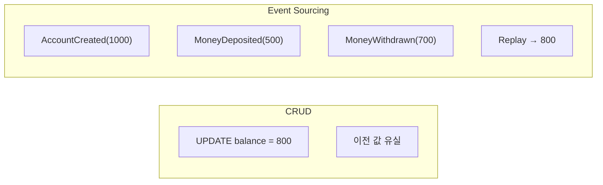

# Event Sourcing 면접 정리

---

## 1. 핵심 개념 요약

### 1.1 Event Sourcing이란?

**Event Sourcing**은 애플리케이션의 상태를 직접 저장하는 대신, **상태 변경을 일으킨 모든 이벤트를 순서대로 저장**하는 패턴입니다. 현재 상태는 저장된 이벤트들을 처음부터 재생(Replay)하여 계산합니다.

### 1.2 CRUD vs Event Sourcing 비교



| 구분 | CRUD | Event Sourcing |
|------|------|----------------|
| **저장 방식** | 현재 상태만 | 모든 이벤트 |
| **이력 추적** | 불가능 | 완전한 이력 |
| **시간 여행** | 불가능 | 가능 |
| **복잡도** | 낮음 | 높음 |

### 1.3 핵심 구성 요소

| 구성 요소 | 역할 |
|----------|------|
| **Event** | 과거에 발생한 불변의 사실 |
| **Aggregate** | 이벤트 스트림의 논리적 단위 |
| **Event Store** | 이벤트를 순서대로 저장하는 저장소 |
| **Projection** | 이벤트로부터 도출된 읽기 전용 뷰 |
| **Snapshot** | 특정 시점의 Aggregate 상태 캐시 |

---

## 2. 주요 구현 패턴

### 2.1 Aggregate 구현

```java
public class BankAccount {
    private String accountId;
    private BigDecimal balance;
    
    // Command → Event 생성
    public void deposit(BigDecimal amount) {
        var event = new MoneyDepositedEvent(accountId, amount);
        apply(event);  // 상태 변경
        uncommittedEvents.add(event);  // 저장할 이벤트
    }
    
    // 이벤트 재생으로 복원
    public static BankAccount rehydrate(List<DomainEvent> events) {
        BankAccount account = new BankAccount();
        events.forEach(account::apply);
        return account;
    }
}
```

### 2.2 Snapshot 전략

| 전략 | 설명 |
|------|------|
| **N번째 이벤트마다** | 100개마다 스냅샷 저장 |
| **시간 기반** | 1시간마다 스냅샷 |
| **이벤트 타입 기반** | 특정 중요 이벤트 시 스냅샷 |

### 2.3 스키마 진화 전략

| 변경 유형 | 안전성 | 처리 방법 |
|----------|--------|----------|
| **필드 추가** | ✅ 안전 | Optional 또는 기본값 |
| **필드 삭제** | ⚠️ 주의 | 무시하되 삭제하지 않음 |
| **타입 변경** | ❌ 위험 | 새 필드로 추가 |

---

## 3. 면접 예상 질문 및 모범 답변

### Q1. Event Sourcing이란 무엇인가요?

> Event Sourcing은 애플리케이션의 상태를 직접 저장하는 대신, **상태 변경을 일으킨 모든 이벤트를 순서대로 저장**하는 패턴입니다.
>
> 예를 들어, 은행 계좌의 잔액을 저장할 때 CRUD 방식은 `balance = 800`만 저장합니다. Event Sourcing은 `AccountCreated(1000)`, `MoneyDeposited(500)`, `MoneyWithdrawn(700)` 이벤트를 저장합니다. 현재 잔액 800은 이 이벤트들을 재생해서 계산합니다.
>
> **장점**:
> - 완전한 감사 로그
> - 시간 여행(과거 상태 조회)
> - 이벤트 기반 통합 용이
> - 버그 재현 가능

### Q2. Aggregate란 무엇이고 왜 필요한가요?

> Aggregate는 **함께 변경되어야 하는 엔티티들의 집합**입니다. DDD(Domain-Driven Design)의 개념이며, Event Sourcing에서 **이벤트 스트림의 단위**가 됩니다.
>
> 예를 들어, `Order` Aggregate는 `Order`(루트), `OrderItem`, `ShippingInfo`를 포함합니다. 이들은 항상 함께 일관성을 유지해야 합니다.
>
> **역할**:
> 1. **일관성 경계**: 트랜잭션 범위 정의
> 2. **이벤트 스트림 단위**: `order-123`의 모든 이벤트
> 3. **비즈니스 규칙 캡슐화**: Command 처리 → Event 생성

### Q3. Snapshot은 왜 필요한가요?

> Snapshot은 **성능 최적화**를 위해 필요합니다.
>
> Event Sourcing에서 Aggregate의 현재 상태를 알려면 모든 이벤트를 처음부터 재생해야 합니다. 이벤트가 1만 개라면 1만 번의 `apply()`를 호출해야 합니다.
>
> **Snapshot 동작 방식**:
> 1. 특정 시점(예: 9900번째 이벤트)의 상태를 저장
> 2. Aggregate 로드 시 스냅샷 먼저 로드
> 3. 스냅샷 이후의 이벤트(9901~10000)만 재생
>
> **전략**:
> - N번째 이벤트마다 스냅샷 (예: 100개마다)
> - 시간 기반 스냅샷 (예: 1시간마다)
> - 특정 이벤트 타입 시 스냅샷

### Q4. 이벤트 스키마 진화는 어떻게 처리하나요?

> 이벤트는 불변이므로 이미 저장된 이벤트의 스키마를 변경할 수 없습니다. 대신 **읽을 때 변환**하는 전략을 사용합니다.
>
> **Upcasting 방식**:
> ```java
> // V1: {amount: 1000}
> // V2: {amount: 1000, currency: "KRW"}
>
> DomainEvent upcast(JsonNode oldEvent, int fromVersion) {
>     if (fromVersion == 1) {
>         return new MoneyDepositedEventV2(
>             oldEvent.get("amount"),
>             "KRW"  // 기본값 추가
>         );
>     }
> }
> ```
>
> **규칙**:
> - 필드 추가: Optional 또는 기본값 사용
> - 필드 삭제: 실제로 삭제하지 않고 무시
> - 타입 변경: 새 필드로 추가

### Q5. Event Sourcing의 장단점은?

> **장점**:
> 1. **완전한 감사 로그**: 모든 변경 이력 보존
> 2. **시간 여행**: 과거 어느 시점의 상태든 복원 가능
> 3. **이벤트 기반 통합**: 다른 시스템에 이벤트 전파 용이
> 4. **버그 재현**: 프로덕션 이벤트로 버그 재현 가능
> 5. **성능 분석**: 언제 무엇이 발생했는지 분석 가능
>
> **단점**:
> 1. **복잡성 증가**: 개발 및 운영 복잡도
> 2. **최종 일관성**: Projection 동기화 지연
> 3. **스키마 진화 어려움**: 이벤트 불변성
> 4. **GDPR 준수 어려움**: 개인정보 삭제 어려움
> 5. **학습 곡선**: 팀 교육 필요

### Q6. Event Sourcing과 CQRS의 관계는?

> **Event Sourcing**과 **CQRS**는 함께 사용되는 경우가 많지만, 별개의 패턴입니다.
>
> **Event Sourcing**: 상태를 이벤트로 저장
> **CQRS**: 읽기와 쓰기 모델 분리
>
> **함께 사용하는 이유**:
> 1. Event Sourcing의 Event Store는 쓰기에 최적화
> 2. 읽기는 Projection(CQRS의 Query 모델)으로 최적화
> 3. 이벤트가 Projection을 업데이트하는 자연스러운 흐름
>
> ```
> Command → Aggregate → Event Store (Write)
>                         ↓
>              Projection → Read Model (Query)
> ```

### Q7. Event Store로 어떤 기술을 사용할 수 있나요?

> 여러 옵션이 있으며, 요구사항에 따라 선택합니다.
>
> | 기술 | 특징 | 적합 상황 |
> |------|------|----------|
> | **EventStoreDB** | 전용 Event Store, Projection 내장 | Event Sourcing 중심 |
> | **Kafka** | 높은 처리량, 분산 | 대규모 스트리밍 |
> | **PostgreSQL** | 범용, JSON 지원 | 기존 인프라 활용 |
>
> **Event Store 요구사항**:
> - Append-Only (추가만, 수정/삭제 불가)
> - 순서 보장
> - Optimistic Concurrency
> - 구독(Subscription) 지원

### Q8. Event Sourcing을 언제 사용해야 하나요?

> **적합한 경우**:
> - 완전한 감사 로그가 법적/규제적으로 필요할 때 (금융, 의료)
> - 시간 여행(과거 상태 조회)이 필요할 때
> - 복잡한 비즈니스 규칙이 있을 때
> - 이벤트 기반 마이크로서비스 통합
>
> **부적합한 경우**:
> - 단순 CRUD 애플리케이션
> - 강한 일관성이 필수일 때
> - 팀에 Event Sourcing 경험이 없을 때
> - 빠른 MVP 개발이 필요할 때
>
> Event Sourcing은 강력하지만 복잡성이 높습니다. "필요할 때만" 사용하는 것이 좋습니다.

---

## 4. 핵심 개념 체크리스트

- [ ] Event Sourcing의 정의와 CRUD와의 차이를 설명할 수 있는가?
- [ ] Aggregate의 역할과 구현 방법을 이해하는가?
- [ ] Snapshot이 필요한 이유와 전략을 설명할 수 있는가?
- [ ] 스키마 진화 방법(Upcasting)을 이해하는가?
- [ ] Event Sourcing과 CQRS의 관계를 설명할 수 있는가?
- [ ] Event Store 기술 옵션과 선택 기준을 아는가?
- [ ] Event Sourcing의 장단점과 적용 시나리오를 판단할 수 있는가?

---

*📅 작성일: 2025-01-25*
*📚 관련 문서: [01_Event_Sourcing.md](./01_Event_Sourcing.md)*
