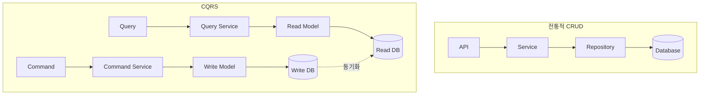
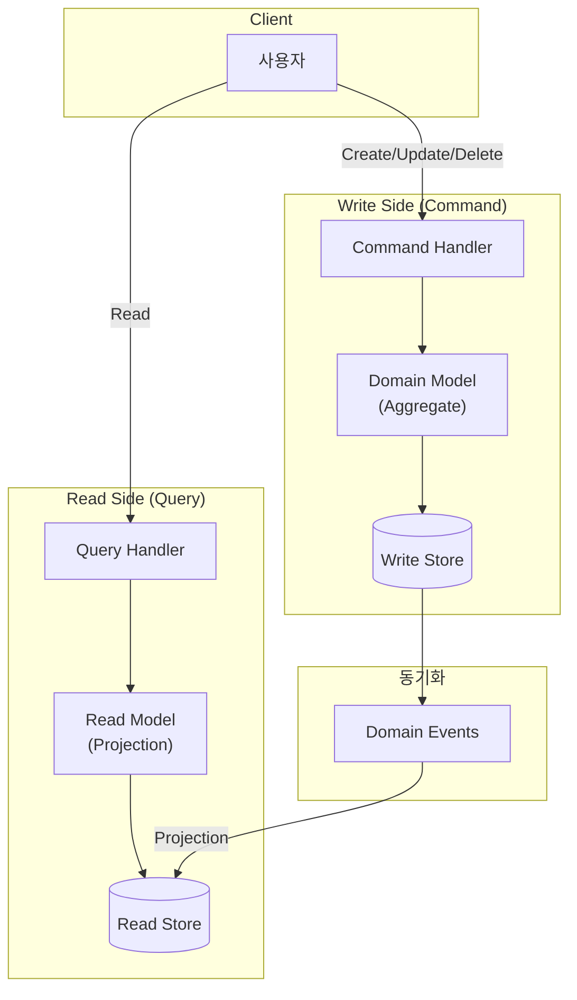
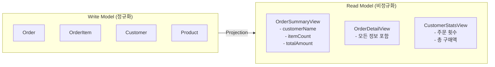
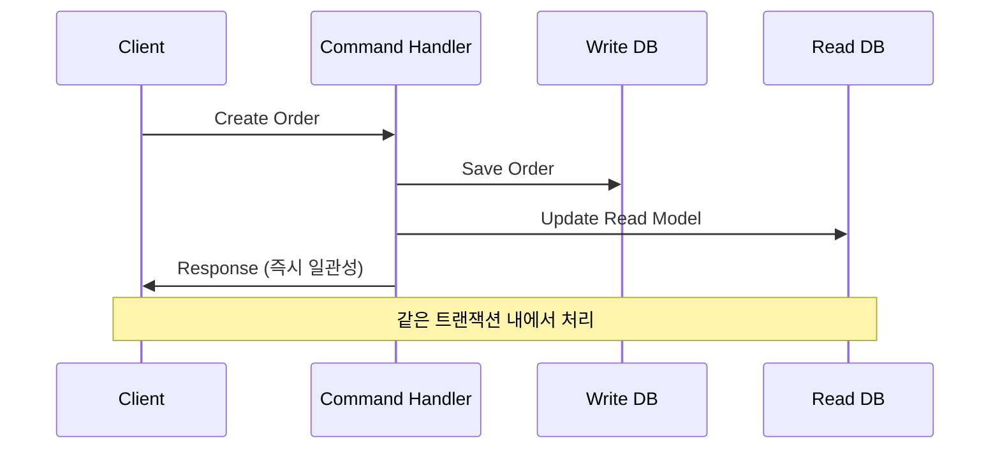
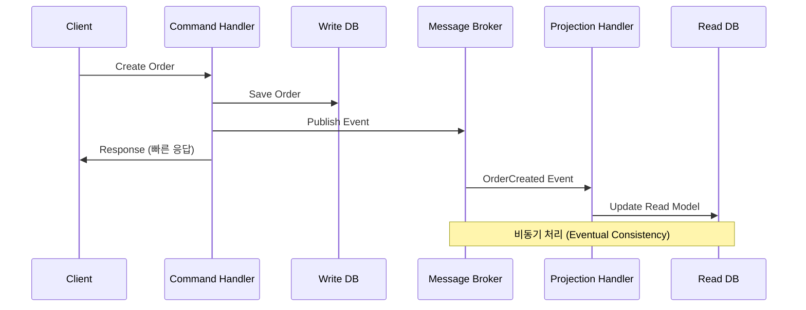
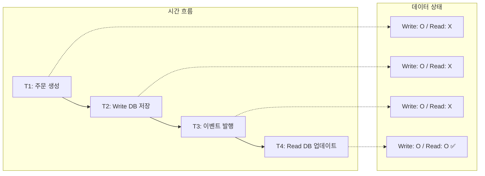
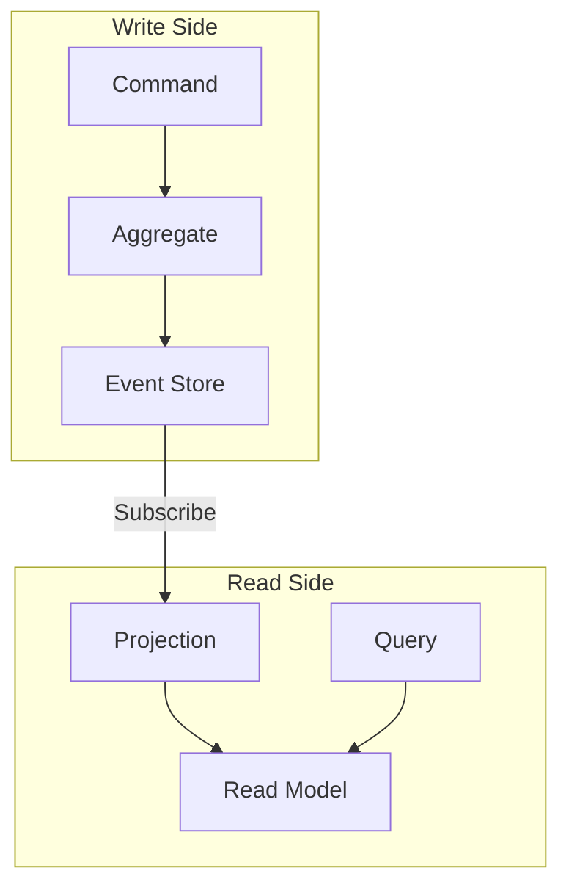
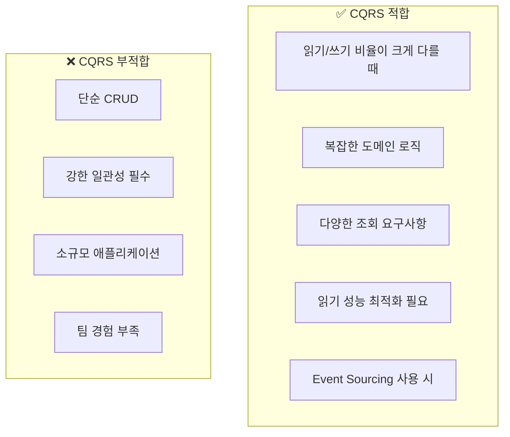

# CQRS (Command Query Responsibility Segregation)

---

## 📌 핵심 요약

> **CQRS(Command Query Responsibility Segregation)**는 **읽기(Query)**와 **쓰기(Command)** 작업을 분리하는 아키텍처 패턴이다. 각 작업에 최적화된 별도의 모델을 사용하여 복잡한 도메인의 성능과 확장성을 개선한다. Event Sourcing과 자주 함께 사용되며, 마이크로서비스 아키텍처에서 서비스 간 데이터 동기화의 기반이 된다.

---

## 🎯 학습 목표

이 내용을 읽고 나면:
- [ ] CQRS의 개념과 기존 CRUD 방식과의 차이를 설명할 수 있다
- [ ] Command Model과 Query Model의 역할을 이해할 수 있다
- [ ] 동기화 전략(동기 vs 비동기)을 적용할 수 있다
- [ ] 최종 일관성(Eventual Consistency)의 의미와 처리 방법을 알 수 있다
- [ ] CQRS의 장단점과 적용 시나리오를 판단할 수 있다

---

## 📖 본문 정리

### 1. CQRS란?

#### 1.1 정의

**CQRS(Command Query Responsibility Segregation)**는 **명령(Command)**과 **질의(Query)**의 책임을 분리하는 패턴입니다.

- **Command**: 상태를 변경하는 작업 (Create, Update, Delete)
- **Query**: 상태를 조회하는 작업 (Read)



#### 1.2 CQS vs CQRS

**CQS(Command Query Separation)**는 메서드 레벨의 원칙입니다.

```java
// CQS 원칙
public interface UserService {
    void updateUser(User user);      // Command: 상태 변경, 반환값 없음
    User getUser(String id);         // Query: 상태 조회, 반환값 있음
}
```

**CQRS**는 CQS를 **아키텍처 레벨**로 확장한 것입니다.

| 구분 | CQS | CQRS |
|------|-----|------|
| **범위** | 메서드/객체 | 아키텍처 |
| **분리 대상** | 메서드 시그니처 | 모델, 서비스, 저장소 |
| **데이터 저장소** | 동일 | 분리 가능 |

---

### 2. CQRS 구조

#### 2.1 기본 구조



#### 2.2 Command Side (쓰기)

Command Side는 **도메인 로직**과 **비즈니스 규칙**을 처리합니다.

```java
// Command
public record CreateOrderCommand(
    String customerId,
    List<OrderItemRequest> items,
    String shippingAddress
) {}

// Command Handler
@Service
public class OrderCommandHandler {
    
    private final OrderRepository orderRepository;
    private final EventPublisher eventPublisher;
    
    @Transactional
    public String handle(CreateOrderCommand command) {
        // 비즈니스 규칙 검증
        validateCustomer(command.customerId());
        validateItems(command.items());
        
        // Aggregate 생성
        Order order = Order.create(
            command.customerId(),
            command.items(),
            command.shippingAddress()
        );
        
        // 저장
        orderRepository.save(order);
        
        // 이벤트 발행 (Read Side 동기화용)
        eventPublisher.publish(new OrderCreatedEvent(
            order.getId(),
            order.getCustomerId(),
            order.getTotalAmount()
        ));
        
        return order.getId();
    }
}
```

#### 2.3 Query Side (읽기)

Query Side는 **조회에 최적화된 단순한 모델**을 사용합니다.

```java
// Read Model (Projection)
@Entity
@Table(name = "order_summary_view")
public class OrderSummaryView {
    @Id
    private String orderId;
    private String customerName;
    private BigDecimal totalAmount;
    private String status;
    private LocalDateTime createdAt;
    private int itemCount;
    // JOIN 없이 조회할 수 있도록 비정규화
}

// Query Handler
@Service
public class OrderQueryHandler {
    
    private final OrderSummaryViewRepository repository;
    
    public OrderSummaryView getOrderSummary(String orderId) {
        return repository.findById(orderId)
            .orElseThrow(() -> new OrderNotFoundException(orderId));
    }
    
    public List<OrderSummaryView> getCustomerOrders(String customerId) {
        return repository.findByCustomerId(customerId);
    }
    
    public Page<OrderSummaryView> searchOrders(OrderSearchCriteria criteria, Pageable pageable) {
        return repository.findByCriteria(criteria, pageable);
    }
}
```

---

### 3. Read Model (Projection)

#### 3.1 Projection이란?

**Projection**은 Write Model의 데이터를 **읽기에 최적화된 형태**로 변환한 것입니다.



#### 3.2 Projection 구현

```java
@Component
public class OrderProjection {
    
    private final OrderSummaryViewRepository summaryRepository;
    private final OrderDetailViewRepository detailRepository;
    
    @EventHandler
    public void on(OrderCreatedEvent event) {
        // Summary View 생성
        OrderSummaryView summary = new OrderSummaryView();
        summary.setOrderId(event.orderId());
        summary.setCustomerId(event.customerId());
        summary.setTotalAmount(event.totalAmount());
        summary.setStatus("CREATED");
        summary.setCreatedAt(event.occurredAt());
        summaryRepository.save(summary);
        
        // Detail View 생성
        OrderDetailView detail = createDetailView(event);
        detailRepository.save(detail);
    }
    
    @EventHandler
    public void on(OrderShippedEvent event) {
        summaryRepository.findById(event.orderId())
            .ifPresent(view -> {
                view.setStatus("SHIPPED");
                view.setShippedAt(event.occurredAt());
                summaryRepository.save(view);
            });
    }
    
    @EventHandler
    public void on(OrderCancelledEvent event) {
        summaryRepository.findById(event.orderId())
            .ifPresent(view -> {
                view.setStatus("CANCELLED");
                view.setCancelReason(event.reason());
                summaryRepository.save(view);
            });
    }
}
```

#### 3.3 다양한 Read Model

같은 데이터로 **여러 목적의 Read Model**을 만들 수 있습니다.

| Read Model | 목적 | 최적화 |
|------------|------|--------|
| **OrderSummaryView** | 목록 조회 | 페이징, 정렬 |
| **OrderDetailView** | 상세 조회 | JOIN 제거 |
| **CustomerStatsView** | 통계 | 집계 데이터 |
| **SearchIndex** | 검색 | Elasticsearch |

---

### 4. 동기화 전략

#### 4.1 동기 동기화 (Synchronous)

Command 처리와 Read Model 업데이트가 **같은 트랜잭션**에서 발생합니다.



```java
@Service
public class OrderCommandHandler {
    
    @Transactional
    public String createOrder(CreateOrderCommand command) {
        Order order = Order.create(command);
        orderRepository.save(order);
        
        // 같은 트랜잭션에서 Read Model 업데이트
        orderSummaryViewRepository.save(
            OrderSummaryView.from(order)
        );
        
        return order.getId();
    }
}
```

**장점**: 즉시 일관성 (Strong Consistency)
**단점**: 성능 저하, 단일 DB 제약

#### 4.2 비동기 동기화 (Asynchronous)

이벤트를 통해 **별도로** Read Model을 업데이트합니다.



```java
@Service
public class OrderCommandHandler {
    
    @Transactional
    public String createOrder(CreateOrderCommand command) {
        Order order = Order.create(command);
        orderRepository.save(order);
        
        // 이벤트 발행 (비동기 처리)
        eventPublisher.publish(OrderCreatedEvent.from(order));
        
        return order.getId();
    }
}

@Component
public class OrderProjection {
    
    @KafkaListener(topics = "order-events")
    public void handle(OrderCreatedEvent event) {
        // 비동기로 Read Model 업데이트
        orderSummaryViewRepository.save(
            OrderSummaryView.from(event)
        );
    }
}
```

**장점**: 높은 성능, 확장성
**단점**: Eventual Consistency, 복잡성

#### 4.3 동기화 전략 비교

| 전략 | 일관성 | 성능 | 복잡도 | 사용 사례 |
|------|--------|------|--------|----------|
| **동기** | 즉시 | 낮음 | 낮음 | 단순 시스템, 강한 일관성 필요 |
| **비동기** | 최종 | 높음 | 높음 | 대규모 시스템, 성능 중요 |

---

### 5. Eventual Consistency (최종 일관성)

#### 5.1 최종 일관성이란?

비동기 동기화를 사용하면 Write 후 즉시 Read에 반영되지 않을 수 있습니다. 하지만 **시간이 지나면 결국 일관성**이 맞춰집니다.



#### 5.2 일관성 지연 처리 전략

**전략 1: UI에서 낙관적 업데이트**

```javascript
// 클라이언트에서 즉시 UI 업데이트
async function createOrder(orderData) {
    // 1. UI 즉시 업데이트 (낙관적)
    addOrderToList(orderData);
    
    // 2. 서버 요청
    const result = await api.createOrder(orderData);
    
    // 3. 실패 시 롤백
    if (!result.success) {
        removeOrderFromList(orderData.id);
        showError(result.error);
    }
}
```

**전략 2: Write 후 바로 Write DB에서 읽기**

```java
@Service
public class OrderService {
    
    public OrderDetailDto createAndGet(CreateOrderCommand command) {
        // 1. 주문 생성
        String orderId = commandHandler.createOrder(command);
        
        // 2. Write DB에서 직접 조회 (Read Model 대신)
        Order order = orderRepository.findById(orderId)
            .orElseThrow();
        
        return OrderDetailDto.from(order);
    }
}
```

**전략 3: 폴링 또는 WebSocket으로 동기화 대기**

```java
@RestController
public class OrderController {
    
    @GetMapping("/orders/{id}")
    public ResponseEntity<OrderSummaryView> getOrder(@PathVariable String id) {
        // Read Model 조회 시도
        Optional<OrderSummaryView> view = orderQueryHandler.findById(id);
        
        if (view.isPresent()) {
            return ResponseEntity.ok(view.get());
        }
        
        // 아직 동기화 안됨 - 재시도 요청
        return ResponseEntity.status(202)
            .header("Retry-After", "1")
            .build();
    }
}
```

---

### 6. 구현 예시 (Spring Boot + Kafka)

#### 6.1 프로젝트 구조

```
order-service/
├── command/
│   ├── OrderCommandHandler.java
│   ├── CreateOrderCommand.java
│   └── domain/
│       ├── Order.java
│       └── OrderRepository.java
├── query/
│   ├── OrderQueryHandler.java
│   └── model/
│       ├── OrderSummaryView.java
│       └── OrderSummaryViewRepository.java
├── event/
│   ├── OrderCreatedEvent.java
│   └── OrderProjection.java
└── api/
    ├── OrderCommandController.java
    └── OrderQueryController.java
```

#### 6.2 Command Controller

```java
@RestController
@RequestMapping("/api/orders")
public class OrderCommandController {
    
    private final OrderCommandHandler commandHandler;
    
    @PostMapping
    public ResponseEntity<CreateOrderResponse> createOrder(
            @RequestBody CreateOrderRequest request) {
        
        CreateOrderCommand command = new CreateOrderCommand(
            request.customerId(),
            request.items(),
            request.shippingAddress()
        );
        
        String orderId = commandHandler.handle(command);
        
        return ResponseEntity
            .status(HttpStatus.CREATED)
            .body(new CreateOrderResponse(orderId));
    }
    
    @PostMapping("/{id}/cancel")
    public ResponseEntity<Void> cancelOrder(@PathVariable String id) {
        commandHandler.handle(new CancelOrderCommand(id));
        return ResponseEntity.ok().build();
    }
}
```

#### 6.3 Query Controller

```java
@RestController
@RequestMapping("/api/orders")
public class OrderQueryController {
    
    private final OrderQueryHandler queryHandler;
    
    @GetMapping("/{id}")
    public ResponseEntity<OrderSummaryView> getOrder(@PathVariable String id) {
        return ResponseEntity.ok(
            queryHandler.getOrderSummary(id)
        );
    }
    
    @GetMapping
    public ResponseEntity<Page<OrderSummaryView>> searchOrders(
            OrderSearchCriteria criteria,
            Pageable pageable) {
        return ResponseEntity.ok(
            queryHandler.searchOrders(criteria, pageable)
        );
    }
    
    @GetMapping("/customer/{customerId}")
    public ResponseEntity<List<OrderSummaryView>> getCustomerOrders(
            @PathVariable String customerId) {
        return ResponseEntity.ok(
            queryHandler.getCustomerOrders(customerId)
        );
    }
}
```

#### 6.4 Kafka 기반 Projection

```java
@Component
public class OrderProjection {
    
    private final OrderSummaryViewRepository repository;
    
    @KafkaListener(
        topics = "order-events",
        groupId = "order-projection"
    )
    public void handle(ConsumerRecord<String, DomainEvent> record) {
        DomainEvent event = record.value();
        
        if (event instanceof OrderCreatedEvent e) {
            on(e);
        } else if (event instanceof OrderShippedEvent e) {
            on(e);
        } else if (event instanceof OrderCancelledEvent e) {
            on(e);
        }
    }
    
    private void on(OrderCreatedEvent event) {
        OrderSummaryView view = new OrderSummaryView();
        view.setOrderId(event.orderId());
        view.setCustomerId(event.customerId());
        view.setTotalAmount(event.totalAmount());
        view.setStatus("CREATED");
        view.setCreatedAt(event.occurredAt());
        repository.save(view);
    }
    
    // ... 다른 이벤트 핸들러
}
```

---

## 🔍 심화 학습

### CQRS와 Event Sourcing

CQRS는 Event Sourcing과 독립적인 패턴이지만, 함께 사용하면 시너지가 있습니다.



자세한 내용은 [01_Event_Sourcing.md](./01_Event_Sourcing.md) 참조.

### 분리 수준

CQRS는 여러 수준으로 적용할 수 있습니다.

| 수준 | 설명 | 복잡도 |
|------|------|--------|
| **코드 분리** | 같은 DB, 다른 모델 클래스 | 낮음 |
| **스키마 분리** | 같은 DB, 다른 테이블 | 중간 |
| **DB 분리** | 다른 DB (PostgreSQL + Redis) | 높음 |
| **서비스 분리** | 다른 마이크로서비스 | 매우 높음 |

자세한 내용은 [../Kafka/11_Kafka_Connect.md](../Kafka/11_Kafka_Connect.md) 참조.

---

## 💡 실무 적용 포인트

### 언제 CQRS를 사용해야 하는가?



### 주의할 점 / 흔한 실수

- ⚠️ **과도한 분리**: 단순 CRUD에 CQRS 적용
- ⚠️ **Eventual Consistency 무시**: UI에서 지연 미처리
- ⚠️ **Projection 실패 무시**: 재처리 메커니즘 없음
- ⚠️ **Read Model 동기화 누락**: 이벤트 유실 시 데이터 불일치
- ⚠️ **너무 많은 Read Model**: 관리 부담 증가

### 기존 문서 참조

| 주제 | 관련 문서 |
|------|-----------|
| Kafka 비교 | [../Kafka/17_Comparison.md](../Kafka/17_Comparison.md) |
| Kafka Connect | [../Kafka/11_Kafka_Connect.md](../Kafka/11_Kafka_Connect.md) |
| Event Sourcing | [01_Event_Sourcing.md](./01_Event_Sourcing.md) |

---

## ✅ 핵심 개념 체크리스트

- [ ] CQRS의 정의와 CQS와의 차이를 설명할 수 있는가?
- [ ] Command Model과 Query Model의 역할을 구분할 수 있는가?
- [ ] Projection의 개념과 구현 방법을 이해하는가?
- [ ] 동기 vs 비동기 동기화 전략의 장단점을 설명할 수 있는가?
- [ ] Eventual Consistency의 의미와 처리 전략을 아는가?
- [ ] CQRS의 장단점과 적용 시나리오를 판단할 수 있는가?

---

## 🔗 참고 자료

- 📄 Martin Fowler: [CQRS](https://martinfowler.com/bliki/CQRS.html)
- 📄 Microsoft: [CQRS pattern](https://docs.microsoft.com/en-us/azure/architecture/patterns/cqrs)
- 📘 책: "Implementing Domain-Driven Design" (Vaughn Vernon)
- 🛠️ Axon Framework: [https://axoniq.io/](https://axoniq.io/)

---

*📅 작성일: 2025-01-25*
*📚 관련 문서: Event Sourcing, Saga Pattern, Kafka Connect*
