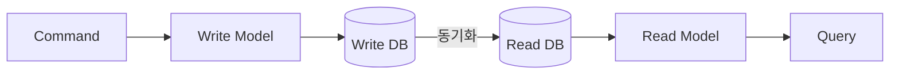

# CQRS 면접 정리

---

## 1. 핵심 개념 요약

### 1.1 CQRS란?

**CQRS(Command Query Responsibility Segregation)**는 **읽기(Query)**와 **쓰기(Command)** 작업을 분리하는 아키텍처 패턴입니다.

- **Command**: 상태를 변경 (Create, Update, Delete)
- **Query**: 상태를 조회 (Read)

### 1.2 CQS vs CQRS

| 구분 | CQS | CQRS |
|------|-----|------|
| **범위** | 메서드/객체 레벨 | 아키텍처 레벨 |
| **분리 대상** | 메서드 시그니처 | 모델, 서비스, 저장소 |
| **데이터 저장소** | 동일 | 분리 가능 |

### 1.3 핵심 구성 요소



| 구성 요소 | 역할 |
|----------|------|
| **Write Model** | 도메인 로직, 비즈니스 규칙 |
| **Read Model** | 조회 최적화된 비정규화 뷰 |
| **Projection** | Write → Read 변환 |

---

## 2. 동기화 전략

### 2.1 동기 vs 비동기

| 전략 | 일관성 | 성능 | 복잡도 |
|------|--------|------|--------|
| **동기** | 즉시 | 낮음 | 낮음 |
| **비동기** | 최종 | 높음 | 높음 |

### 2.2 Eventual Consistency 처리

| 전략 | 설명 |
|------|------|
| **낙관적 UI 업데이트** | 클라이언트에서 즉시 반영 |
| **Write DB에서 조회** | 생성 직후 Write DB 직접 조회 |
| **폴링/WebSocket** | 동기화 완료까지 대기 |

---

## 3. 면접 예상 질문 및 모범 답변

### Q1. CQRS란 무엇인가요?

> CQRS는 **읽기(Query)와 쓰기(Command)의 책임을 분리**하는 아키텍처 패턴입니다.
>
> **핵심 아이디어**:
> - 쓰기 작업은 도메인 로직과 비즈니스 규칙에 집중
> - 읽기 작업은 조회 성능 최적화에 집중
> - 각각 다른 모델, 다른 저장소를 사용할 수 있음
>
> **장점**:
> - 읽기/쓰기 각각 독립적으로 확장 가능
> - 조회에 최적화된 비정규화 모델 사용 가능
> - 복잡한 도메인 로직을 깔끔하게 분리

### Q2. CQS와 CQRS의 차이는?

> **CQS(Command Query Separation)**는 **메서드 레벨**의 원칙입니다.
> ```java
> void updateUser(User user);  // Command: 상태 변경, 반환값 없음
> User getUser(String id);     // Query: 상태 조회, 반환값 있음
> ```
>
> **CQRS**는 CQS를 **아키텍처 레벨**로 확장한 것입니다.
> - 별도의 Command Service와 Query Service
> - 별도의 Write Model과 Read Model
> - 필요시 별도의 데이터베이스
>
> CQS는 코딩 원칙, CQRS는 시스템 설계 패턴입니다.

### Q3. Read Model(Projection)이란?

> **Read Model**은 Write Model의 데이터를 **읽기에 최적화된 형태**로 변환한 것입니다. Projection이라고도 합니다.
>
> **특징**:
> - 비정규화: JOIN 없이 조회할 수 있도록
> - 목적별 분리: 목록용, 상세용, 통계용 등 별도 모델
> - 이벤트 기반 업데이트: Write 변경 시 이벤트로 동기화
>
> **예시**:
> ```
> Write Model: Order, OrderItem, Customer, Product (정규화)
> Read Model: OrderSummaryView (customerName, itemCount, totalAmount 포함)
> ```

### Q4. Eventual Consistency란 무엇이고 어떻게 처리하나요?

> **Eventual Consistency(최종 일관성)**는 Write 후 즉시 Read에 반영되지 않지만, **시간이 지나면 결국 일관성이 맞춰지는** 특성입니다.
>
> 비동기 동기화 사용 시 발생합니다.
>
> **처리 전략**:
> 1. **낙관적 UI 업데이트**: 클라이언트에서 먼저 UI 반영, 실패 시 롤백
> 2. **Write DB 직접 조회**: 생성 직후에는 Read Model 대신 Write DB 조회
> 3. **폴링/WebSocket**: 동기화 완료까지 대기 후 표시
>
> 중요한 것은 **사용자에게 혼란을 주지 않는 것**입니다. 지연이 있음을 인지시키거나, 낙관적 업데이트로 체감 지연을 없애야 합니다.

### Q5. CQRS의 장단점은?

> **장점**:
> 1. **성능 최적화**: 읽기/쓰기 각각 최적화 가능
> 2. **확장성**: 읽기와 쓰기를 독립적으로 스케일링
> 3. **단순한 Query**: 복잡한 JOIN 없이 비정규화된 데이터 조회
> 4. **도메인 집중**: Command Side에서 비즈니스 로직에 집중
>
> **단점**:
> 1. **복잡성 증가**: 두 개의 모델 관리
> 2. **Eventual Consistency**: 즉시 일관성 보장 불가
> 3. **동기화 로직**: Projection 구현 및 관리 필요
> 4. **학습 곡선**: 팀 교육 필요

### Q6. CQRS를 언제 사용해야 하나요?

> **적합한 경우**:
> - 읽기와 쓰기의 비율이 크게 다를 때 (읽기 >> 쓰기)
> - 복잡한 도메인 로직이 있을 때
> - 다양한 조회 요구사항이 있을 때
> - Event Sourcing을 사용할 때
>
> **부적합한 경우**:
> - 단순 CRUD 애플리케이션
> - 강한 일관성이 반드시 필요할 때
> - 소규모 프로젝트
>
> CQRS는 복잡성을 추가합니다. **"필요할 때만"** 사용하는 것이 좋습니다. 대부분의 시스템은 전통적인 CRUD로 충분합니다.

### Q7. CQRS와 Event Sourcing의 관계는?

> CQRS와 Event Sourcing은 **별개의 패턴**이지만 함께 사용하면 시너지가 있습니다.
>
> **Event Sourcing**은 상태를 이벤트로 저장합니다. 이 이벤트들이 자연스럽게 CQRS의 Read Model(Projection)을 업데이트합니다.
>
> ```
> Command → Aggregate → Event Store (Write)
>                         ↓ 이벤트 구독
>              Projection → Read Model (Query)
> ```
>
> Event Sourcing 없이 CQRS만 사용할 수도 있습니다. 이 경우 Write DB 변경 시 별도로 Read Model을 동기화해야 합니다.

### Q8. Read Model 동기화가 실패하면 어떻게 처리하나요?

> Read Model 동기화 실패는 데이터 불일치를 일으키므로 반드시 처리해야 합니다.
>
> **전략**:
> 1. **재시도**: 일시적 오류는 Retry로 해결
> 2. **Dead Letter Queue**: 재시도 실패 시 DLQ에 저장, 수동 처리
> 3. **전체 재구축**: 심각한 불일치 시 Event Store에서 Projection 재구축
> 4. **알림**: 운영팀에 즉시 알림
>
> **모니터링 필수**:
> - Consumer Lag 모니터링
> - Read Model과 Write Model 데이터 비교 (Reconciliation)
> - Projection 처리 속도 및 오류율

---

## 4. 핵심 개념 체크리스트

- [ ] CQRS의 정의와 CQS와의 차이를 설명할 수 있는가?
- [ ] Write Model과 Read Model의 역할을 구분할 수 있는가?
- [ ] Projection의 개념과 구현 방법을 이해하는가?
- [ ] 동기 vs 비동기 동기화의 장단점을 설명할 수 있는가?
- [ ] Eventual Consistency 처리 전략을 3가지 이상 말할 수 있는가?
- [ ] CQRS의 장단점과 적용 시나리오를 판단할 수 있는가?
- [ ] Read Model 동기화 실패 처리 방법을 설명할 수 있는가?

---

*📅 작성일: 2025-01-25*
*📚 관련 문서: [02_CQRS.md](./02_CQRS.md)*
