# Saga Pattern (사가 패턴)

---

## 📌 핵심 요약

> **Saga Pattern**은 마이크로서비스 환경에서 **분산 트랜잭션**을 관리하는 패턴이다. 여러 서비스에 걸친 비즈니스 트랜잭션을 **일련의 로컬 트랜잭션**으로 분해하고, 실패 시 **보상 트랜잭션(Compensating Transaction)**을 통해 롤백을 수행한다. Choreography(이벤트 기반)와 Orchestration(중앙 조율) 두 가지 구현 방식이 있다.

---

## 🎯 학습 목표

이 내용을 읽고 나면:
- [ ] Saga Pattern의 필요성과 기존 분산 트랜잭션(2PC)의 한계를 이해할 수 있다
- [ ] Choreography와 Orchestration 방식의 차이를 설명할 수 있다
- [ ] 보상 트랜잭션(Compensating Transaction)을 설계할 수 있다
- [ ] Saga 실패 시나리오와 복구 전략을 파악할 수 있다
- [ ] 실무에서 Saga Pattern을 적용할 때의 주의점을 알 수 있다

---

## 📖 본문 정리

### 1. 분산 트랜잭션의 문제

#### 1.1 마이크로서비스에서의 트랜잭션

모놀리식에서는 단일 데이터베이스의 **ACID 트랜잭션**으로 일관성을 보장했습니다.

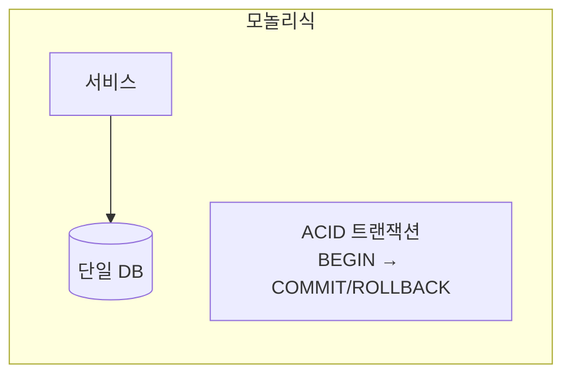

마이크로서비스에서는 **각 서비스가 자체 DB**를 가지므로, 여러 DB에 걸친 트랜잭션이 필요합니다.

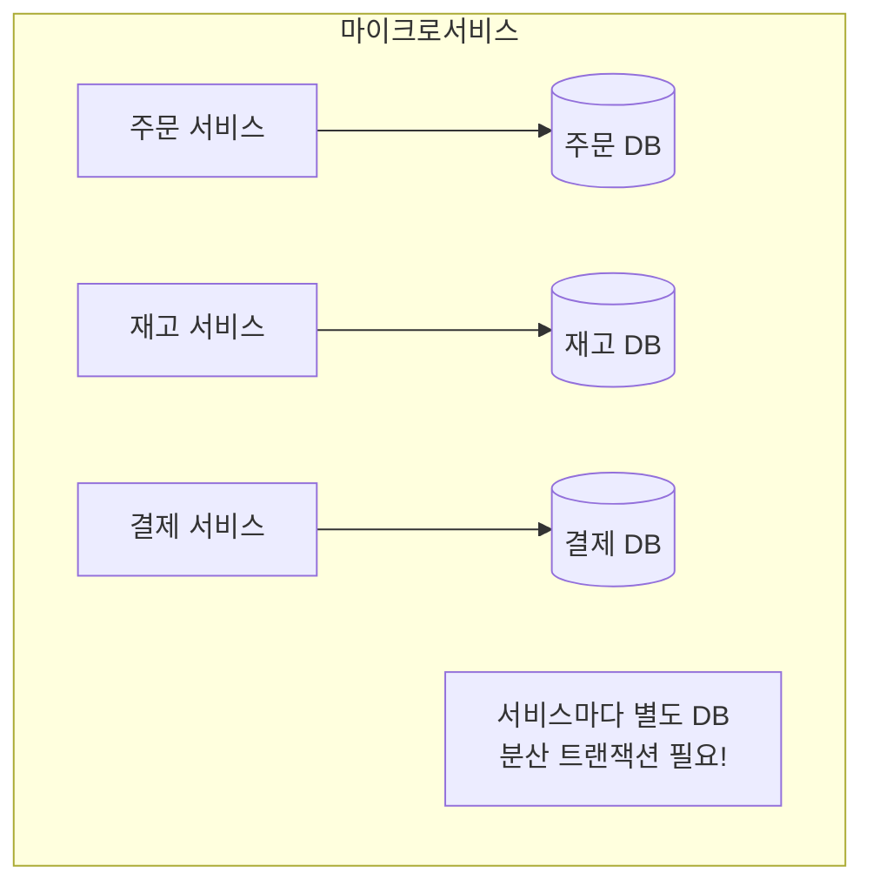

#### 1.2 2PC(Two-Phase Commit)의 한계

**2PC(Two-Phase Commit)**는 전통적인 분산 트랜잭션 프로토콜입니다.

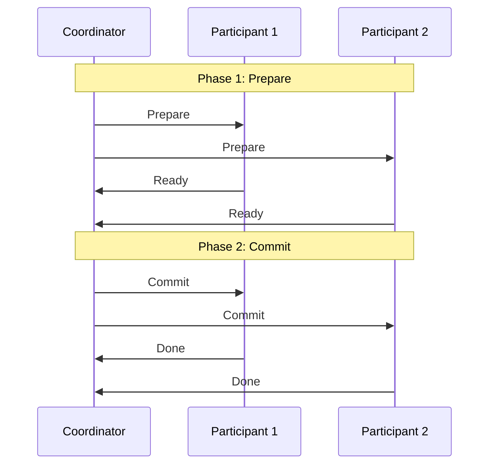

**2PC의 문제점**:

| 문제 | 설명 |
|------|------|
| **가용성 저하** | 모든 참가자가 응답해야 진행 가능 |
| **성능 저하** | 락을 오래 유지, 대기 시간 증가 |
| **단일 장애점** | Coordinator 장애 시 전체 중단 |
| **NoSQL 미지원** | 대부분의 NoSQL, MQ가 2PC 미지원 |

> 💬 **비유**: 2PC는 여러 사람이 동시에 "예" 해야 결혼이 성립하는 것과 같습니다. 한 사람이 답을 안 하면 모두가 기다려야 합니다.

---

### 2. Saga Pattern 개념

#### 2.1 Saga란?

**Saga**는 여러 로컬 트랜잭션의 **시퀀스**입니다. 각 로컬 트랜잭션이 성공하면 다음 트랜잭션을 트리거하고, 실패하면 **보상 트랜잭션(Compensating Transaction)**을 역순으로 실행합니다.

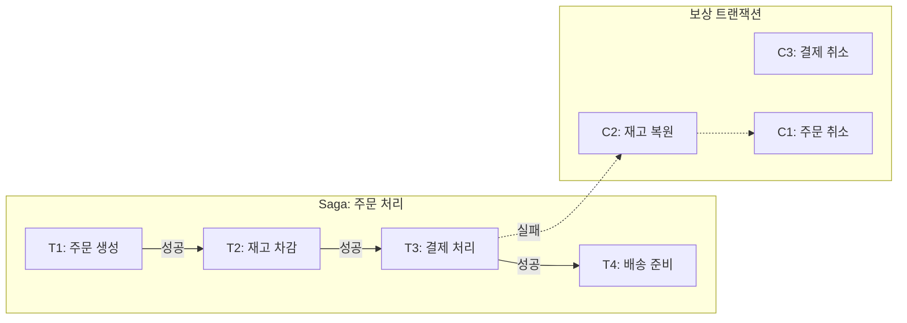

#### 2.2 로컬 트랜잭션 vs 보상 트랜잭션

| 구분 | 로컬 트랜잭션 (Ti) | 보상 트랜잭션 (Ci) |
|------|-------------------|-------------------|
| **목적** | 비즈니스 로직 수행 | 이전 트랜잭션 효과 취소 |
| **실행 시점** | 정상 흐름 | 실패 시 롤백 |
| **설계 원칙** | 멱등성 권장 | **반드시 멱등성** 필요 |

> ⚠️ **중요**: 보상 트랜잭션은 DB의 ROLLBACK이 아닙니다. 이미 커밋된 변경을 **되돌리는 새로운 트랜잭션**입니다.

---

### 3. Choreography (코레오그래피)

#### 3.1 개념

**Choreography**는 중앙 조율자 없이 **이벤트**를 통해 서비스들이 협력하는 방식입니다. 각 서비스는 이벤트를 발행하고, 다른 서비스는 이 이벤트를 구독하여 다음 단계를 실행합니다.

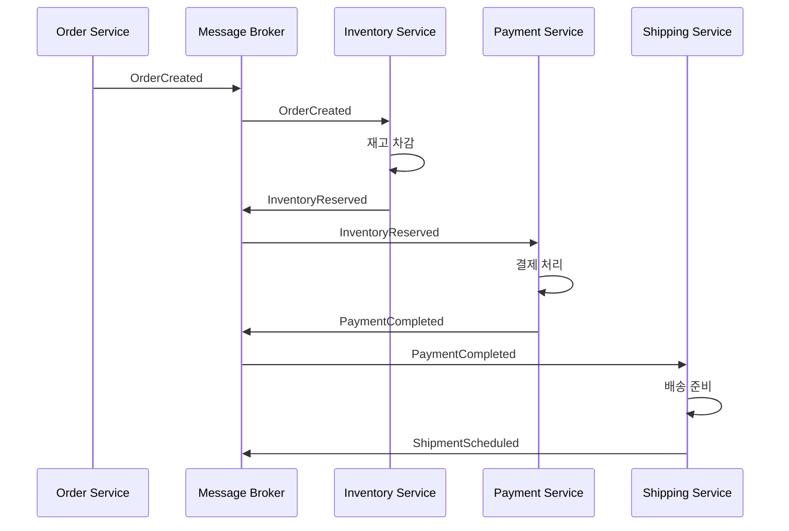

#### 3.2 실패 시 보상 (Choreography)

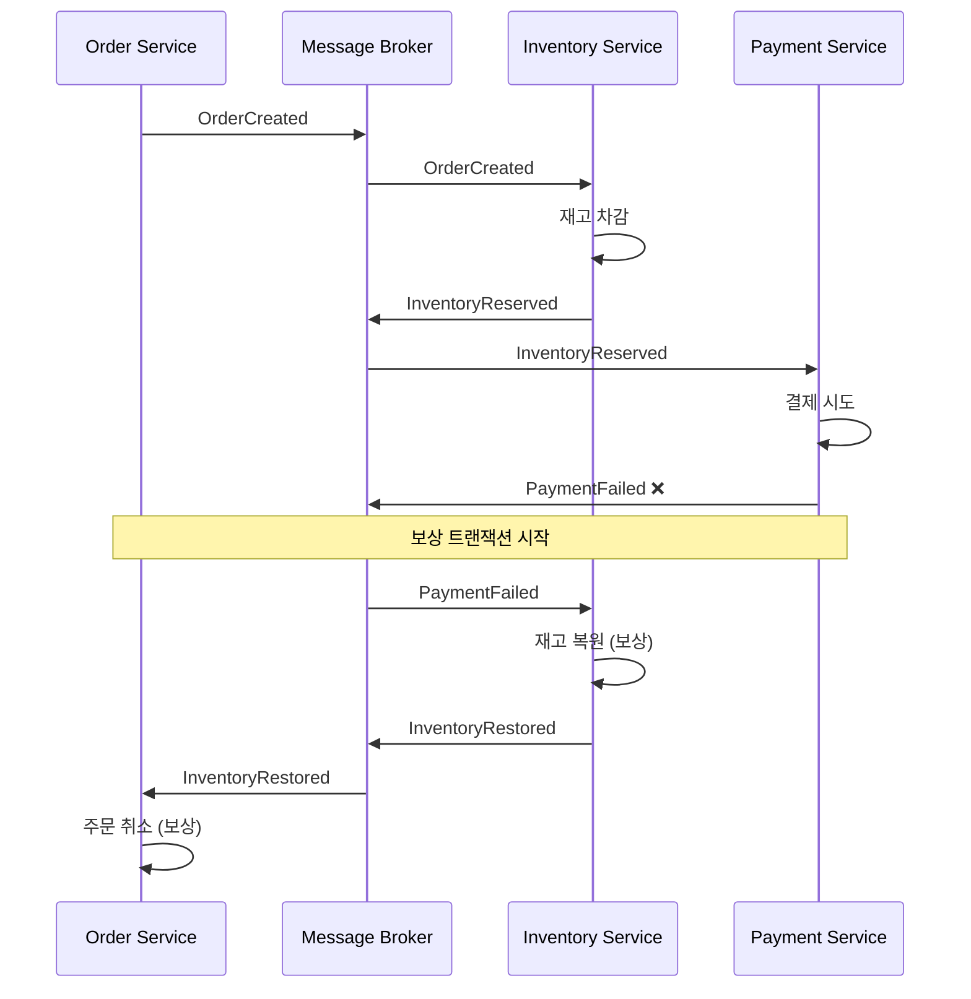

#### 3.3 Choreography 구현 (Spring + Kafka)

```java
// Order Service
@Service
public class OrderService {
    
    @Transactional
    public Order createOrder(CreateOrderRequest request) {
        Order order = Order.create(request);
        order.setStatus(OrderStatus.PENDING);
        orderRepository.save(order);
        
        // 이벤트 발행
        eventPublisher.publish(new OrderCreatedEvent(
            order.getId(),
            order.getItems(),
            order.getTotalAmount()
        ));
        
        return order;
    }
    
    @KafkaListener(topics = "inventory-events")
    public void handleInventoryEvent(InventoryEvent event) {
        if (event instanceof InventoryReservedEvent e) {
            // 다음 단계 진행 (결제 서비스가 처리)
        } else if (event instanceof InventoryRestoredEvent e) {
            // 보상: 주문 취소
            cancelOrder(e.orderId(), "Inventory restoration");
        }
    }
    
    @KafkaListener(topics = "payment-events")
    public void handlePaymentEvent(PaymentEvent event) {
        if (event instanceof PaymentFailedEvent e) {
            // 재고 서비스에게 복원 요청 (이벤트 체인)
            // 실제로는 재고 서비스가 PaymentFailed를 직접 구독
        }
    }
}

// Inventory Service
@Service
public class InventoryService {
    
    @KafkaListener(topics = "order-events")
    public void handleOrderEvent(OrderEvent event) {
        if (event instanceof OrderCreatedEvent e) {
            reserveInventory(e);
        }
    }
    
    @KafkaListener(topics = "payment-events")
    public void handlePaymentEvent(PaymentEvent event) {
        if (event instanceof PaymentFailedEvent e) {
            // 보상: 재고 복원
            restoreInventory(e.orderId());
        }
    }
    
    private void reserveInventory(OrderCreatedEvent event) {
        try {
            // 재고 차감 로직
            inventory.reserve(event.items());
            
            eventPublisher.publish(new InventoryReservedEvent(
                event.orderId()
            ));
        } catch (InsufficientInventoryException e) {
            eventPublisher.publish(new InventoryReservationFailedEvent(
                event.orderId(),
                e.getMessage()
            ));
        }
    }
}
```

#### 3.4 Choreography 장단점

| 장점 | 단점 |
|------|------|
| 느슨한 결합 | 워크플로우 파악 어려움 |
| 단일 장애점 없음 | 순환 의존성 위험 |
| 서비스 독립적 배포 | 테스트 어려움 |
| 확장성 좋음 | 디버깅 복잡 |

---

### 4. Orchestration (오케스트레이션)

#### 4.1 개념

**Orchestration**은 중앙의 **Saga Orchestrator(조율자)**가 전체 워크플로우를 관리하는 방식입니다. Orchestrator가 각 서비스에 명령을 보내고 응답을 기다립니다.

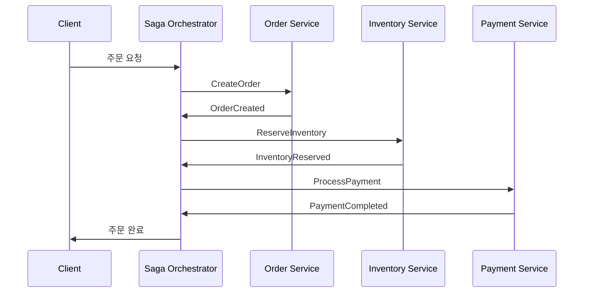

#### 4.2 실패 시 보상 (Orchestration)

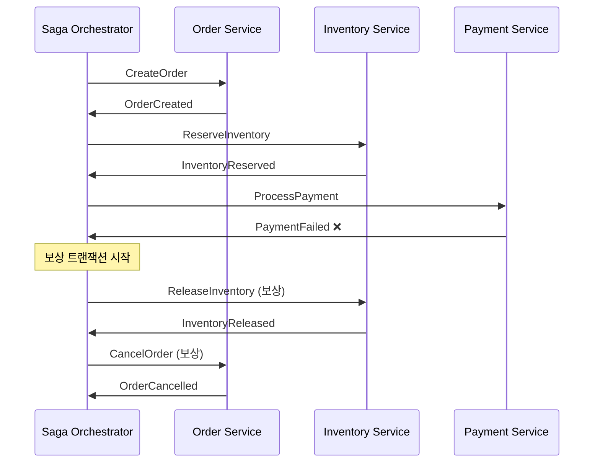

#### 4.3 Orchestration 구현 (Spring + Kafka)

```java
// Saga Orchestrator
@Service
public class OrderSagaOrchestrator {
    
    private final SagaStateRepository sagaRepository;
    private final KafkaTemplate<String, Object> kafkaTemplate;
    
    @Transactional
    public String startSaga(CreateOrderRequest request) {
        // Saga 상태 생성
        SagaState saga = new SagaState();
        saga.setId(UUID.randomUUID().toString());
        saga.setStatus(SagaStatus.STARTED);
        saga.setRequest(request);
        sagaRepository.save(saga);
        
        // Step 1: 주문 생성
        kafkaTemplate.send("order-commands", new CreateOrderCommand(
            saga.getId(),
            request
        ));
        
        return saga.getId();
    }
    
    @KafkaListener(topics = "saga-replies")
    public void handleReply(SagaReply reply) {
        SagaState saga = sagaRepository.findById(reply.sagaId())
            .orElseThrow();
        
        switch (saga.getCurrentStep()) {
            case CREATE_ORDER:
                handleOrderCreated(saga, reply);
                break;
            case RESERVE_INVENTORY:
                handleInventoryReserved(saga, reply);
                break;
            case PROCESS_PAYMENT:
                handlePaymentProcessed(saga, reply);
                break;
        }
    }
    
    private void handleOrderCreated(SagaState saga, SagaReply reply) {
        if (reply.success()) {
            // Step 2: 재고 예약
            saga.setCurrentStep(SagaStep.RESERVE_INVENTORY);
            saga.setOrderId(reply.data().get("orderId"));
            sagaRepository.save(saga);
            
            kafkaTemplate.send("inventory-commands", new ReserveInventoryCommand(
                saga.getId(),
                saga.getOrderId(),
                saga.getRequest().items()
            ));
        } else {
            // 실패: Saga 종료
            saga.setStatus(SagaStatus.FAILED);
            sagaRepository.save(saga);
        }
    }
    
    private void handlePaymentProcessed(SagaState saga, SagaReply reply) {
        if (reply.success()) {
            // Saga 완료
            saga.setStatus(SagaStatus.COMPLETED);
            sagaRepository.save(saga);
        } else {
            // 보상 트랜잭션 시작
            startCompensation(saga);
        }
    }
    
    private void startCompensation(SagaState saga) {
        saga.setStatus(SagaStatus.COMPENSATING);
        sagaRepository.save(saga);
        
        // 역순으로 보상
        if (saga.getCurrentStep().ordinal() >= SagaStep.RESERVE_INVENTORY.ordinal()) {
            kafkaTemplate.send("inventory-commands", new ReleaseInventoryCommand(
                saga.getId(),
                saga.getOrderId()
            ));
        }
    }
}

// Saga State
@Entity
public class SagaState {
    @Id
    private String id;
    
    @Enumerated(EnumType.STRING)
    private SagaStatus status;
    
    @Enumerated(EnumType.STRING)
    private SagaStep currentStep;
    
    private String orderId;
    
    @Type(JsonType.class)
    @Column(columnDefinition = "jsonb")
    private CreateOrderRequest request;
    
    private LocalDateTime createdAt;
    private LocalDateTime updatedAt;
}

public enum SagaStep {
    CREATE_ORDER,
    RESERVE_INVENTORY,
    PROCESS_PAYMENT,
    COMPLETED
}

public enum SagaStatus {
    STARTED,
    IN_PROGRESS,
    COMPLETED,
    COMPENSATING,
    COMPENSATED,
    FAILED
}
```

#### 4.4 Orchestration 장단점

| 장점 | 단점 |
|------|------|
| 워크플로우 명확 | Orchestrator가 단일 장애점 |
| 디버깅 용이 | 서비스 간 결합도 증가 |
| 복잡한 로직 처리 가능 | Orchestrator 로직 복잡 |
| 테스트 용이 | 확장성 제한 |

---

### 5. Choreography vs Orchestration 비교

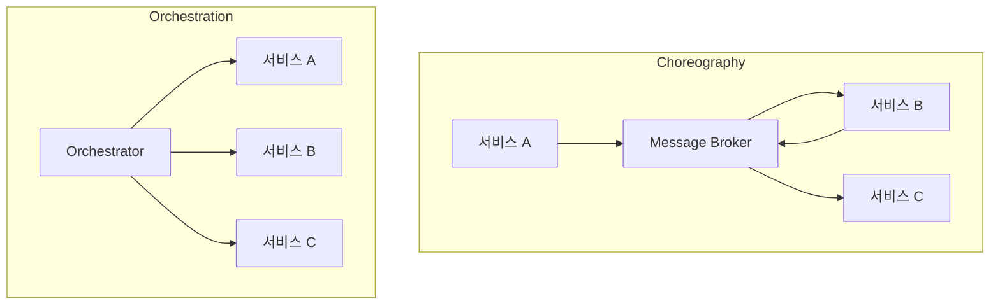

| 기준 | Choreography | Orchestration |
|------|--------------|---------------|
| **제어 방식** | 분산 | 중앙 집중 |
| **결합도** | 낮음 | 중간 |
| **복잡도 관리** | 어려움 | 용이 |
| **확장성** | 높음 | 중간 |
| **단일 장애점** | 없음 | Orchestrator |
| **적합 시나리오** | 단순 흐름, 적은 서비스 | 복잡한 흐름, 많은 서비스 |

---

### 6. 보상 트랜잭션 설계

#### 6.1 보상 트랜잭션 원칙

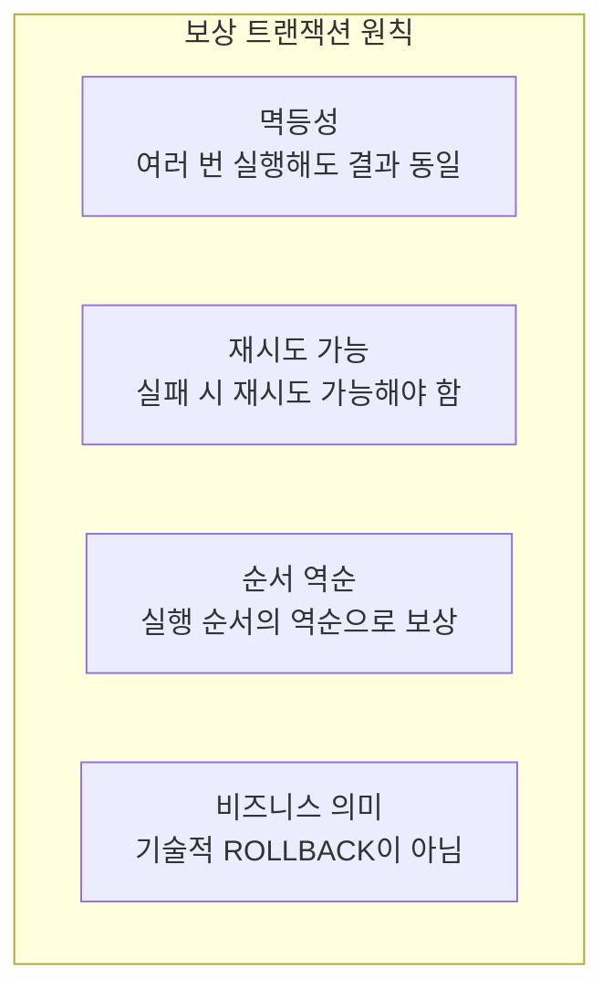

#### 6.2 보상 트랜잭션 예시

| 로컬 트랜잭션 | 보상 트랜잭션 |
|---------------|---------------|
| 주문 생성 | 주문 취소 |
| 재고 차감 | 재고 복원 |
| 결제 처리 | 결제 환불 |
| 배송 요청 | 배송 취소 |
| 포인트 적립 | 포인트 차감 |

#### 6.3 보상이 불가능한 경우

일부 작업은 보상이 불가능하거나 어렵습니다.

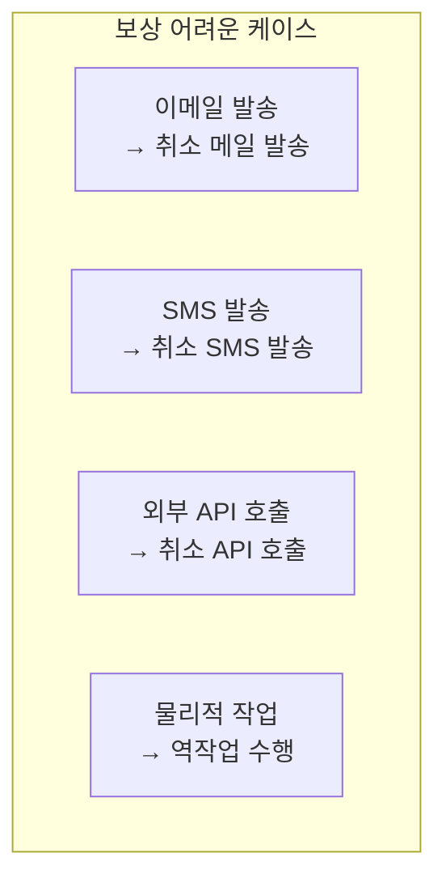

**해결 전략**:
- **순서 조정**: 보상 불가능한 작업을 Saga 끝에 배치
- **Semantic Lock**: 임시 상태로 먼저 처리, 확정 후 완료
- **알림**: 수동 처리 필요 시 운영팀 알림

---

## 🔍 심화 학습

### Saga와 Outbox Pattern

Saga의 이벤트 발행은 **이중 쓰기 문제**가 있습니다. Outbox Pattern과 함께 사용하면 안전합니다.

자세한 내용은 [04_Outbox_Pattern.md](./04_Outbox_Pattern.md) 참조.

### Saga와 Idempotency

보상 트랜잭션은 **반드시 멱등해야** 합니다. 네트워크 문제로 재시도될 수 있기 때문입니다.

자세한 내용은 [06_Idempotency.md](./06_Idempotency.md) 참조.

---

## 💡 실무 적용 포인트

### 언제 Saga를 사용해야 하는가?

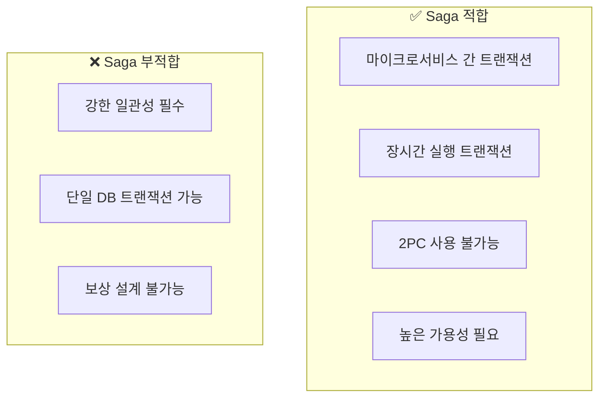

### 주의할 점 / 흔한 실수

- ⚠️ **보상 미설계**: 보상 트랜잭션 없이 Saga 구현
- ⚠️ **멱등성 미보장**: 재시도 시 중복 처리
- ⚠️ **타임아웃 미설정**: 무한 대기 상태
- ⚠️ **상태 관리 부재**: Saga 진행 상태 추적 안 함
- ⚠️ **이중 쓰기**: DB 저장과 이벤트 발행 원자성 미보장

### 기존 문서 참조

| 주제 | 관련 문서 |
|------|-----------|
| 신뢰성 | [../Kafka/05_Reliability.md](../Kafka/05_Reliability.md) |
| Outbox Pattern | [04_Outbox_Pattern.md](./04_Outbox_Pattern.md) |
| Idempotency | [06_Idempotency.md](./06_Idempotency.md) |

---

## ✅ 핵심 개념 체크리스트

- [ ] 2PC의 한계와 Saga의 필요성을 설명할 수 있는가?
- [ ] Choreography와 Orchestration의 차이를 설명할 수 있는가?
- [ ] 보상 트랜잭션의 개념과 설계 원칙을 이해하는가?
- [ ] Saga 상태 관리의 중요성을 아는가?
- [ ] Saga Pattern의 장단점과 적용 시나리오를 판단할 수 있는가?

---

## 🔗 참고 자료

- 📄 Chris Richardson: [Saga Pattern](https://microservices.io/patterns/data/saga.html)
- 📄 Microsoft: [Saga distributed transactions](https://docs.microsoft.com/en-us/azure/architecture/reference-architectures/saga/saga)
- 📘 책: "Microservices Patterns" (Chris Richardson)

---

*📅 작성일: 2025-01-25*
*📚 관련 문서: Outbox Pattern, Idempotency, Kafka Reliability*
